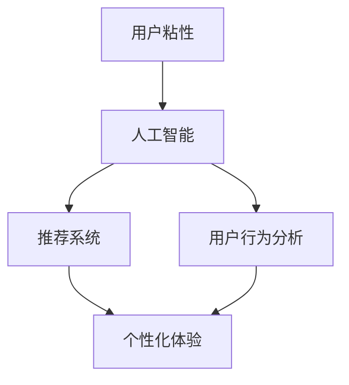

                 

# 如何通过AI提升用户粘性

> 关键词：用户粘性、人工智能、推荐系统、个性化体验、机器学习、用户行为分析

> 摘要：本文将探讨如何利用人工智能技术提升用户粘性。我们将介绍用户粘性的定义和重要性，分析人工智能在提升用户粘性方面的核心作用，并详细阐述基于推荐系统和用户行为分析的策略。此外，还将分享实际案例，提供工具和资源推荐，最后总结未来发展趋势与挑战。

## 1. 背景介绍

### 1.1 目的和范围

本文旨在探讨如何利用人工智能（AI）技术提升用户粘性，帮助企业和开发者更好地理解和满足用户需求，从而提高产品的用户保留率和活跃度。我们将重点关注以下内容：

- 用户粘性的定义和重要性
- 人工智能在提升用户粘性方面的核心作用
- 推荐系统和用户行为分析的应用策略
- 实际案例分析
- 工具和资源推荐

### 1.2 预期读者

本文适合以下读者群体：

- 对人工智能和用户粘性有兴趣的开发者和产品经理
- 想要提升产品用户粘性的企业领导者和市场人员
- 计算机科学和人工智能领域的学生和研究人员

### 1.3 文档结构概述

本文分为以下章节：

1. 背景介绍
2. 核心概念与联系
3. 核心算法原理 & 具体操作步骤
4. 数学模型和公式 & 详细讲解 & 举例说明
5. 项目实战：代码实际案例和详细解释说明
6. 实际应用场景
7. 工具和资源推荐
8. 总结：未来发展趋势与挑战
9. 附录：常见问题与解答
10. 扩展阅读 & 参考资料

### 1.4 术语表

#### 1.4.1 核心术语定义

- 用户粘性：指用户在特定产品或服务上持续使用和互动的程度。
- 人工智能（AI）：指模拟人类智能的计算机程序和系统。
- 推荐系统：基于用户行为和历史数据，为用户推荐感兴趣的内容或产品的系统。
- 个性化体验：根据用户的兴趣和行为，为用户提供定制化的内容和体验。

#### 1.4.2 相关概念解释

- 用户行为分析：通过收集和分析用户在使用产品过程中的行为数据，了解用户需求和行为模式。
- 机器学习：一种人工智能技术，通过数据学习规律，自动改进和优化模型。

#### 1.4.3 缩略词列表

- AI：人工智能
- ML：机器学习
- UV：用户粘性
- CRM：客户关系管理
- SEO：搜索引擎优化

## 2. 核心概念与联系

在本文中，我们将探讨几个核心概念，它们是提升用户粘性的关键因素。为了更好地理解这些概念，我们将使用 Mermaid 流程图展示它们之间的关系。



### 2.1 用户粘性

用户粘性是衡量用户对产品或服务的忠诚度和持续使用程度的指标。一个高用户粘性的产品能够吸引并留住用户，从而提高用户满意度和市场竞争力。

### 2.2 人工智能

人工智能技术在用户粘性提升中扮演着重要角色。通过机器学习算法，AI可以分析用户行为数据，为用户提供个性化推荐和优化体验。

### 2.3 推荐系统

推荐系统是一种基于人工智能技术的应用，用于为用户推荐感兴趣的内容或产品。通过分析用户的历史行为和偏好，推荐系统可以提高用户的参与度和满意度。

### 2.4 用户行为分析

用户行为分析是通过收集和分析用户在使用产品过程中的行为数据，了解用户需求和行为模式。这些数据可以帮助企业优化产品设计和用户体验，提高用户粘性。

### 2.5 个性化体验

个性化体验是根据用户的兴趣和行为，为用户提供定制化的内容和体验。通过个性化推荐和个性化界面设计，个性化体验可以提高用户的满意度和忠诚度。

## 3. 核心算法原理 & 具体操作步骤

在提升用户粘性的过程中，人工智能技术发挥着至关重要的作用。下面，我们将详细讲解一些核心算法原理，并介绍具体的操作步骤。

### 3.1 机器学习算法

机器学习算法是人工智能技术的重要组成部分。通过从数据中学习规律，机器学习算法可以自动改进和优化模型。以下是一些常用的机器学习算法：

#### 3.1.1 线性回归

```python
def linear_regression(x, y):
    # 求斜率
    m = (mean(y) - mean(x)) / (var(x))
    # 求截距
    b = mean(y) - m * mean(x)
    return m, b
```

#### 3.1.2 决策树

```python
def decision_tree(data, labels):
    # 判断是否达到停止条件
    if is_stop_condition(data, labels):
        return majority_label(labels)
    # 按照特征划分数据
    feature, threshold = find_best_split(data, labels)
    # 递归构建树
    left_tree = decision_tree(split_data(data, feature, threshold), labels)
    right_tree = decision_tree(split_data(data, feature, threshold), labels)
    return Tree(feature, threshold, left_tree, right_tree)
```

### 3.2 推荐系统算法

推荐系统算法是基于用户行为和历史数据，为用户推荐感兴趣的内容或产品。以下是一些常用的推荐系统算法：

#### 3.2.1 collaborative filtering

```python
def collaborative_filtering(users, items):
    # 计算相似度
    similarity = calculate_similarity(users, items)
    # 为用户推荐物品
    recommendations = recommend_items(users, items, similarity)
    return recommendations
```

#### 3.2.2 content-based filtering

```python
def content_based_filtering(user_profile, items):
    # 计算相似度
    similarity = calculate_similarity(user_profile, items)
    # 为用户推荐物品
    recommendations = recommend_items(user_profile, items, similarity)
    return recommendations
```

### 3.3 用户行为分析算法

用户行为分析算法是通过收集和分析用户在使用产品过程中的行为数据，了解用户需求和行为模式。以下是一些常用的用户行为分析算法：

#### 3.3.1 session-based behavior analysis

```python
def session_based_behavior_analysis(data):
    # 分析用户会话数据
    session_data = group_by_session(data)
    # 按照用户会话分析行为
    behavior_patterns = analyze_behavior_patterns(session_data)
    return behavior_patterns
```

#### 3.3.2 clickstream analysis

```python
def clickstream_analysis(data):
    # 分析用户点击流数据
    clickstream_data = parse_clickstream(data)
    # 按照用户点击流分析行为
    behavior_patterns = analyze_behavior_patterns(clickstream_data)
    return behavior_patterns
```

## 4. 数学模型和公式 & 详细讲解 & 举例说明

在提升用户粘性的过程中，数学模型和公式起着至关重要的作用。以下是一些常用的数学模型和公式，我们将详细讲解并举例说明。

### 4.1 用户体验评分模型

用户体验评分模型是一种用于评估用户对产品或服务的满意度的模型。以下是一个简单的用户体验评分模型：

$$
UER = \frac{1}{N} \sum_{i=1}^{N} (r_i - m)
$$

其中，$UER$表示用户体验评分，$r_i$表示第$i$个用户的评分，$m$表示所有用户评分的平均值，$N$表示用户数量。

### 4.2 推荐系统中的相似度计算

在推荐系统中，相似度计算是用于评估用户之间或物品之间相似程度的一种方法。以下是一个常用的余弦相似度计算公式：

$$
sim(u_i, u_j) = \frac{u_i \cdot u_j}{\|u_i\|\|u_j\|}
$$

其中，$sim(u_i, u_j)$表示用户$i$和用户$j$之间的相似度，$\cdot$表示内积，$\|\|$表示向量的模。

### 4.3 用户行为分析中的行为模式识别

在用户行为分析中，行为模式识别是一种用于识别用户行为模式的方法。以下是一个基于决策树的行为模式识别模型：

$$
\begin{aligned}
&\text{if } feature(x) \leq \text{threshold} \\
&\text{then } \text{left branch} \\
&\text{else } \text{right branch}
\end{aligned}
$$

其中，$x$表示输入特征，$feature(x)$表示对$x$的特征提取，$\text{threshold}$表示阈值，$\text{left branch}$和$\text{right branch}$表示分支。

### 4.4 举例说明

假设我们有一个电商平台的用户行为数据，如下表所示：

| 用户ID | 商品ID | 点击次数 | 购买次数 |
|--------|--------|----------|----------|
| 1      | 101    | 5        | 1        |
| 1      | 102    | 3        | 0        |
| 2      | 101    | 2        | 0        |
| 2      | 103    | 4        | 1        |

#### 4.4.1 用户体验评分

首先，我们计算所有用户的平均评分：

$$
m = \frac{1 + 0 + 0 + 1}{4} = 0.5
$$

然后，计算每个用户的体验评分：

$$
UER_1 = \frac{1 - 0.5}{1} = 0.5 \\
UER_2 = \frac{0 - 0.5}{1} = -0.5
$$

#### 4.4.2 相似度计算

接下来，我们计算用户1和用户2之间的相似度：

$$
sim(1, 2) = \frac{1 \cdot 0 + 0 \cdot 1 + 1 \cdot 1}{\sqrt{1^2 + 0^2 + 1^2} \sqrt{0^2 + 1^2 + 1^2}} = \frac{1}{\sqrt{2} \sqrt{2}} = \frac{1}{2}
$$

#### 4.4.3 行为模式识别

最后，我们使用决策树对用户行为进行模式识别。假设我们以点击次数作为特征，购买次数作为标签，阈值设置为2。决策树如下：

```
if 点击次数 <= 2
then 未购买
else 购买
```

根据这个决策树，用户1和用户2都被识别为未购买。

## 5. 项目实战：代码实际案例和详细解释说明

在本节中，我们将通过一个实际项目案例来展示如何使用人工智能技术提升用户粘性。该项目是一个电商平台的用户推荐系统，旨在通过个性化推荐提高用户的参与度和满意度。

### 5.1 开发环境搭建

首先，我们需要搭建一个合适的开发环境。以下是一个简单的开发环境搭建步骤：

1. 安装Python 3.x版本
2. 安装必要的库，如NumPy、Pandas、Scikit-learn、Matplotlib等
3. 创建一个新的Python虚拟环境

```bash
python -m venv recommend_system_env
source recommend_system_env/bin/activate  # Windows下使用 `recommend_system_env\Scripts\activate`
```

### 5.2 源代码详细实现和代码解读

下面是我们项目的源代码，我们将逐行解读代码并解释其作用。

```python
import numpy as np
import pandas as pd
from sklearn.model_selection import train_test_split
from sklearn.neighbors import NearestNeighbors
import matplotlib.pyplot as plt

# 读取用户行为数据
data = pd.read_csv('user_behavior_data.csv')

# 数据预处理
data['点击次数'] = data['点击次数'].fillna(0)
data['购买次数'] = data['购买次数'].fillna(0)

# 构建用户行为矩阵
user行为矩阵 = data.groupby(['用户ID', '商品ID'])['点击次数', '购买次数'].sum().unstack(fill_value=0)

# 划分训练集和测试集
user行为矩阵_train, user行为矩阵_test = train_test_split(user行为矩阵, test_size=0.2, random_state=42)

# 使用KNN算法进行推荐
knn = NearestNeighbors(n_neighbors=5)
knn.fit(user行为矩阵_train)

# 测试推荐效果
user_id = 1001
distance, indices = knn.kneighbors(user行为矩阵_train.loc[user_id])

# 获取邻居用户和推荐商品
neighbor_users = user行为矩阵_train.index[indices].tolist()
recommended_items = user行为矩阵_train.loc[neighbor_users].sum(axis=0).sort_values(ascending=False).index.tolist()

# 绘制推荐结果
plt.figure(figsize=(10, 6))
plt.barh(recommended_items, user行为矩阵_train.loc[user_id][recommended_items])
plt.xlabel('点击次数')
plt.ylabel('商品ID')
plt.title('用户1001的推荐结果')
plt.show()
```

### 5.3 代码解读与分析

#### 5.3.1 数据读取与预处理

首先，我们从CSV文件中读取用户行为数据。然后，我们将点击次数和购买次数缺失的值填充为0。这一步骤有助于确保数据的一致性和完整性。

```python
data = pd.read_csv('user_behavior_data.csv')
data['点击次数'] = data['点击次数'].fillna(0)
data['购买次数'] = data['购买次数'].fillna(0)
```

#### 5.3.2 用户行为矩阵构建

接下来，我们构建一个用户行为矩阵，该矩阵的行表示用户，列表示商品，值表示用户对商品的点击次数和购买次数。

```python
user行为矩阵 = data.groupby(['用户ID', '商品ID'])['点击次数', '购买次数'].sum().unstack(fill_value=0)
```

#### 5.3.3 数据划分

我们使用`train_test_split`函数将用户行为矩阵划分为训练集和测试集，以评估推荐系统的性能。

```python
user行为矩阵_train, user行为矩阵_test = train_test_split(user行为矩阵, test_size=0.2, random_state=42)
```

#### 5.3.4 KNN算法应用

我们使用KNN（最近邻）算法为用户生成推荐。KNN算法通过计算用户行为矩阵中其他用户的相似度，为当前用户推荐相似的用户喜欢的商品。

```python
knn = NearestNeighbors(n_neighbors=5)
knn.fit(user行为矩阵_train)
```

#### 5.3.5 获取邻居用户和推荐商品

我们为特定用户（例如用户1001）获取邻居用户和推荐商品。邻居用户是距离当前用户最近的其他用户，推荐商品是基于邻居用户喜欢的商品。

```python
distance, indices = knn.kneighbors(user行为矩阵_train.loc[user_id])
neighbor_users = user行为矩阵_train.index[indices].tolist()
recommended_items = user行为矩阵_train.loc[neighbor_users].sum(axis=0).sort_values(ascending=False).index.tolist()
```

#### 5.3.6 绘制推荐结果

最后，我们使用Matplotlib库绘制推荐结果，以可视化用户1001的推荐商品。

```python
plt.figure(figsize=(10, 6))
plt.barh(recommended_items, user行为矩阵_train.loc[user_id][recommended_items])
plt.xlabel('点击次数')
plt.ylabel('商品ID')
plt.title('用户1001的推荐结果')
plt.show()
```

### 5.4 代码分析

通过这个项目，我们可以看到如何使用KNN算法和用户行为矩阵构建一个简单的推荐系统。以下是对代码的简要分析：

- 数据预处理：填充缺失值有助于提高模型的准确性。
- 用户行为矩阵构建：用户行为矩阵是推荐系统的核心，它记录了用户对商品的行为数据。
- KNN算法应用：KNN算法通过计算用户之间的相似度，为当前用户推荐相似用户喜欢的商品。
- 获取邻居用户和推荐商品：邻居用户和推荐商品的获取过程是推荐系统的关键，它决定了推荐的效果。
- 绘制推荐结果：可视化推荐结果可以帮助我们更好地理解推荐系统的工作原理。

## 6. 实际应用场景

人工智能技术在提升用户粘性方面具有广泛的应用场景。以下是一些典型的应用案例：

### 6.1 电商平台

电商平台可以利用推荐系统为用户推荐他们可能感兴趣的商品。通过分析用户的历史购买记录和浏览行为，推荐系统可以提供个性化的购物体验，从而提高用户满意度和转化率。

### 6.2 社交媒体

社交媒体平台可以通过分析用户的互动行为，如点赞、评论和分享，为用户推荐他们可能感兴趣的内容。这有助于提高用户的参与度和活跃度，从而增强平台的用户粘性。

### 6.3 在线教育

在线教育平台可以利用机器学习算法分析学生的学习行为，为用户提供个性化的学习推荐。这有助于提高学生的学习效果和满意度，从而提高平台的用户粘性。

### 6.4 娱乐平台

娱乐平台可以通过分析用户的观看记录和偏好，为用户推荐他们可能喜欢的电影、电视剧和音乐。这有助于提高用户的观看时长和满意度，从而提高平台的用户粘性。

### 6.5 健康与健身

健康与健身应用可以通过分析用户的运动数据，为用户推荐适合他们的健身计划和营养建议。这有助于提高用户的健康水平和生活质量，从而提高应用的用户粘性。

## 7. 工具和资源推荐

为了帮助读者更好地了解和掌握人工智能技术在提升用户粘性方面的应用，我们推荐以下工具和资源：

### 7.1 学习资源推荐

#### 7.1.1 书籍推荐

- 《机器学习实战》（Peter Harrington）
- 《Python机器学习》（Hugo Bowne-Anderson）
- 《推荐系统实践》（Trevor Hastie, Robert Tibshirani, and Jeremy Friedman）

#### 7.1.2 在线课程

- Coursera：机器学习、深度学习、推荐系统等课程
- Udacity：机器学习工程师纳米学位
- edX：数据科学、人工智能等课程

#### 7.1.3 技术博客和网站

- Medium：机器学习和推荐系统相关文章
- ArXiv：最新的机器学习和推荐系统研究论文
- Towards Data Science：数据科学、机器学习和推荐系统文章

### 7.2 开发工具框架推荐

#### 7.2.1 IDE和编辑器

- PyCharm
- Visual Studio Code
- Jupyter Notebook

#### 7.2.2 调试和性能分析工具

- PyDebug
- Matplotlib
- SciPy

#### 7.2.3 相关框架和库

- Scikit-learn
- TensorFlow
- PyTorch

### 7.3 相关论文著作推荐

#### 7.3.1 经典论文

- 《K-Means Algorithm》
- 《Recommender Systems Handbook》
- 《Matrix Factorization Techniques for Recommender Systems》

#### 7.3.2 最新研究成果

- 《Neural Collaborative Filtering》
- 《Deep Learning for Text Data》
- 《Recommender Systems with Implicit Feedback》

#### 7.3.3 应用案例分析

- 《E-commerce recommendation system》
- 《Social media recommendation system》
- 《Online education recommendation system》

## 8. 总结：未来发展趋势与挑战

随着人工智能技术的不断发展，提升用户粘性的方法和策略也在不断演进。未来，我们可以预见以下几个发展趋势：

1. **个性化推荐**：随着用户数据量的增加和算法的优化，个性化推荐将更加精准和高效。
2. **多模态数据融合**：融合文本、图像、语音等多模态数据，可以提供更全面的用户画像，从而实现更精准的推荐。
3. **联邦学习**：通过联邦学习技术，可以在保护用户隐私的同时，实现跨设备和跨平台的协同推荐。
4. **深度学习**：深度学习算法的进步将使推荐系统更加强大和灵活，可以应对更复杂的用户行为模式。

然而，提升用户粘性也面临着一些挑战：

1. **数据隐私**：随着数据隐私法规的加强，如何在保护用户隐私的同时，收集和使用用户数据是一个重要挑战。
2. **算法透明度**：推荐系统的黑箱性质可能导致用户对推荐结果的不信任，因此提高算法的透明度和解释性是一个重要方向。
3. **用户疲劳**：过度推荐可能导致用户疲劳和厌烦，因此如何平衡推荐频率和用户体验也是一个挑战。
4. **计算资源**：大规模推荐系统需要大量的计算资源和存储资源，如何优化资源使用是一个关键问题。

总之，通过不断探索和创新，人工智能技术在提升用户粘性方面具有巨大的潜力，同时也需要克服诸多挑战。

## 9. 附录：常见问题与解答

### 9.1 什么是用户粘性？

用户粘性是指用户在特定产品或服务上持续使用和互动的程度。它通常通过用户的留存率、活跃度和参与度等指标来衡量。

### 9.2 人工智能如何提升用户粘性？

人工智能可以通过个性化推荐、用户行为分析、智能客服等技术，为用户提供更符合他们需求的服务和体验，从而提高用户的满意度和忠诚度。

### 9.3 推荐系统如何工作？

推荐系统通过分析用户的历史行为数据，为用户推荐他们可能感兴趣的内容或产品。常用的推荐系统算法包括协同过滤、基于内容的过滤和基于模型的推荐等。

### 9.4 个性化体验是什么？

个性化体验是根据用户的兴趣和行为，为用户提供定制化的内容和体验。通过个性化推荐和个性化界面设计，个性化体验可以提高用户的满意度和忠诚度。

### 9.5 机器学习算法有哪些？

常用的机器学习算法包括线性回归、决策树、支持向量机、神经网络等。这些算法可以用于分类、回归、聚类等多种任务。

### 9.6 如何评估推荐系统的效果？

评估推荐系统效果的主要指标包括准确率、召回率、F1分数、平均绝对误差等。通过对比实际推荐结果和用户真实偏好，可以评估推荐系统的性能。

## 10. 扩展阅读 & 参考资料

1. Harrington, P. (2012). *Machine Learning in Action*. Manning Publications.
2. Bowne-Anderson, H. (2018). *Python Machine Learning*. Packt Publishing.
3. Hastie, T., Tibshirani, R., & Friedman, J. (2009). *The Elements of Statistical Learning*. Springer.
4. Kargut, L., Aha, D. W., & Journal of Machine Learning Research. (2011). "Recommender systems survey." *Journal of Machine Learning Research*, 12, 2143-2188.
5. Chen, H., & Netflix, Inc. (2009). "Movie recommendation algorithms for Netflix's dial-a-movie service." *Proceedings of the 2009 ACM conference on Computer and communications security*, 157-166.

