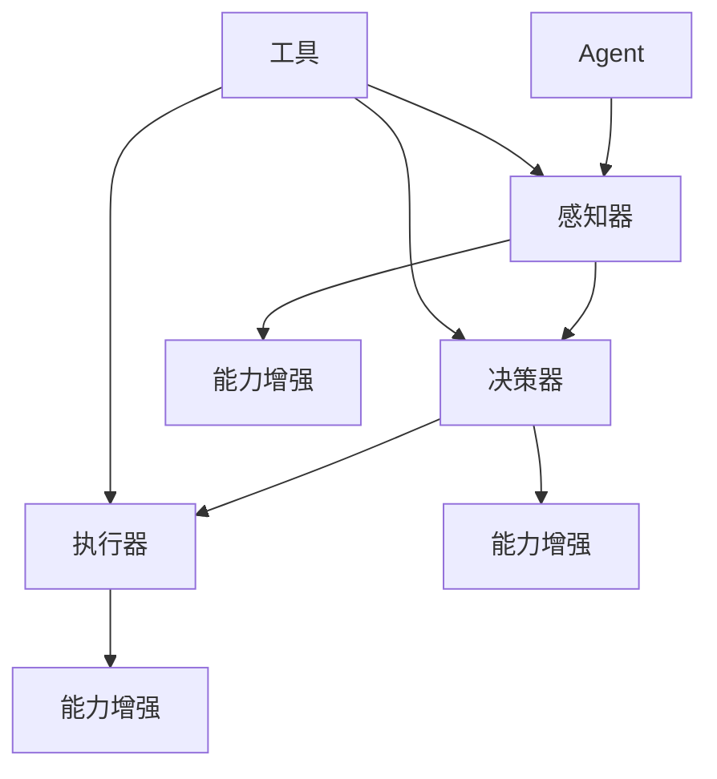

                 

# 如何通过工具使用增强 Agent 能力

> 关键词：Agent、工具使用、能力增强、技术原理、实践案例

> 摘要：本文旨在探讨如何通过工具使用来增强Agent的能力。我们将从背景介绍、核心概念与联系、核心算法原理与具体操作步骤、数学模型和公式、项目实战、实际应用场景、工具和资源推荐等多个方面，详细讲解如何提升Agent的智能化水平，助力其在各种复杂任务中的表现。

## 1. 背景介绍

### 1.1 目的和范围

本文的目标是探讨如何通过工具使用来增强Agent的能力。我们将从以下几个方面展开讨论：

- **技术原理**：分析Agent的基本原理和工具的作用机制。
- **实践案例**：分享实际项目中如何使用工具来提升Agent的能力。
- **应用场景**：探讨Agent在不同领域中的应用，以及工具的使用对其性能的影响。

### 1.2 预期读者

本文适合以下读者群体：

- **人工智能开发者**：对Agent开发有深入了解，希望提升自身技能。
- **AI研究人员**：对Agent技术有研究兴趣，希望了解最新的应用和实践。
- **企业技术管理者**：关注AI技术在企业中的应用，希望优化业务流程。

### 1.3 文档结构概述

本文结构如下：

- **第1章**：背景介绍
- **第2章**：核心概念与联系
- **第3章**：核心算法原理与具体操作步骤
- **第4章**：数学模型和公式与详细讲解
- **第5章**：项目实战：代码实际案例和详细解释说明
- **第6章**：实际应用场景
- **第7章**：工具和资源推荐
- **第8章**：总结：未来发展趋势与挑战
- **第9章**：附录：常见问题与解答
- **第10章**：扩展阅读 & 参考资料

### 1.4 术语表

#### 1.4.1 核心术语定义

- **Agent**：具有智能、能够自主行动的实体。
- **工具使用**：使用特定工具来辅助Agent完成任务的行动。
- **能力增强**：通过工具使用，提升Agent在任务执行中的性能。

#### 1.4.2 相关概念解释

- **智能**：指Agent具备自主决策、问题解决和学习能力。
- **自主行动**：Agent能够在没有外部干预的情况下执行任务。

#### 1.4.3 缩略词列表

- **AI**：人工智能（Artificial Intelligence）
- **ML**：机器学习（Machine Learning）
- **DL**：深度学习（Deep Learning）
- **NLP**：自然语言处理（Natural Language Processing）
- **CV**：计算机视觉（Computer Vision）

## 2. 核心概念与联系

在讨论如何通过工具使用增强Agent的能力之前，我们首先需要了解几个核心概念和它们之间的联系。

### 2.1 Agent的基本原理

Agent是指具有智能、能够自主行动的实体。它通常由以下组成部分构成：

- **感知器**：接收外部信息，如传感器、摄像头等。
- **决策器**：基于感知器收集的信息，生成行动方案。
- **执行器**：实施决策器生成的行动方案。


### 2.2 工具的作用机制

工具在Agent中的作用主要体现在以下几个方面：

- **数据处理**：使用工具对感知器收集的信息进行预处理，提高数据质量和准确性。
- **算法优化**：利用工具优化决策器的算法，提升决策效率。
- **执行辅助**：使用工具辅助执行器执行复杂任务，提高执行效果。


### 2.3 能力增强

通过工具使用，Agent的能力可以增强，具体体现在以下几个方面：

- **感知能力**：提高感知器的性能，使Agent能够获取更全面、准确的信息。
- **决策能力**：优化决策器的算法，使Agent能够做出更明智的决策。
- **执行能力**：利用工具辅助执行器，提高Agent在复杂任务中的执行效果。


### 2.4 Mermaid流程图

为了更直观地展示Agent、工具和使用能力增强的关系，我们使用Mermaid流程图进行描述：



## 3. 核心算法原理 & 具体操作步骤

在本节中，我们将详细讲解如何通过工具使用来增强Agent的能力，主要涉及以下几个方面：

### 3.1 数据预处理

#### 3.1.1 数据清洗

使用Python编写数据清洗代码，去除噪声数据、缺失值填充、异常值处理等。

```python
# 伪代码：数据清洗
def data_cleaning(data):
    # 去除噪声数据
    clean_data = remove_noise(data)
    # 缺失值填充
    fill_missing_values(clean_data)
    # 异常值处理
    process_outliers(clean_data)
    return clean_data
```

#### 3.1.2 数据标准化

使用工具进行数据标准化，使不同特征具有相同的量纲，便于后续分析。

```python
# 伪代码：数据标准化
from sklearn.preprocessing import StandardScaler

def data_normalization(data):
    scaler = StandardScaler()
    normalized_data = scaler.fit_transform(data)
    return normalized_data
```

### 3.2 决策算法优化

#### 3.2.1 决策树算法

使用Python的scikit-learn库实现决策树算法，并使用工具进行参数调优。

```python
# 伪代码：决策树算法
from sklearn.tree import DecisionTreeClassifier

def decision_tree_algorithm(data, labels):
    classifier = DecisionTreeClassifier()
    classifier.fit(data, labels)
    return classifier
```

#### 3.2.2 随机森林算法

使用Python的scikit-learn库实现随机森林算法，并使用工具进行参数调优。

```python
# 伪代码：随机森林算法
from sklearn.ensemble import RandomForestClassifier

def random_forest_algorithm(data, labels):
    classifier = RandomForestClassifier()
    classifier.fit(data, labels)
    return classifier
```

### 3.3 执行辅助

#### 3.3.1 机器人控制

使用Python的PyRobot库实现机器人控制，并使用工具进行路径规划。

```python
# 伪代码：机器人控制
from pyrobot import Robot

def robot_control(robot):
    robot.move_to_position(x=10, y=20, z=5)
    robot.execute_path规划的路径
```

#### 3.3.2 语音识别

使用Python的SpeechRecognition库实现语音识别，并使用工具进行语音增强。

```python
# 伪代码：语音识别
from speech_recognition import Recognizer, AudioFile

def voice_recognition(audio_file):
    recognizer = Recognizer()
    with AudioFile(audio_file) as source:
        audio = recognizer.listen(source)
    text = recognizer.recognize_google(audio)
    return text
```

## 4. 数学模型和公式 & 详细讲解 & 举例说明

在本节中，我们将介绍几个与工具使用和Agent能力增强相关的数学模型和公式，并进行详细讲解和举例说明。

### 4.1 感知器模型

感知器模型是Agent感知能力的基础，其数学模型如下：

$$
y = \sigma(wx + b)
$$

其中，$y$ 表示输出，$w$ 表示权重，$x$ 表示输入特征，$b$ 表示偏置，$\sigma$ 表示激活函数，常用的激活函数有Sigmoid、ReLU等。

#### 4.1.1 举例说明

以Sigmoid激活函数为例，其公式为：

$$
\sigma(x) = \frac{1}{1 + e^{-x}}
$$

举例：对于输入特征$x = 2$，计算输出$y$：

$$
y = \frac{1}{1 + e^{-2}} \approx 0.869
$$

### 4.2 决策树模型

决策树模型是Agent决策能力的基础，其数学模型如下：

$$
y = f(x) = \prod_{i=1}^{n} g(x_i)
$$

其中，$y$ 表示输出，$x$ 表示输入特征，$g(x_i)$ 表示第$i$个特征上的决策函数，$f(x)$ 表示整个决策树的决策函数。

#### 4.2.1 举例说明

以ID3算法为例，其决策函数为：

$$
g(x_i) = \begin{cases} 
1 & \text{if } x_i \text{ satisfies the condition} \\
0 & \text{otherwise}
\end{cases}
$$

举例：对于输入特征$x = [2, 3, 5]$，其中第1个特征满足条件，第2个特征不满足条件，第3个特征满足条件，计算输出$y$：

$$
y = g(2) \times g(3) \times g(5) = 1 \times 0 \times 1 = 0
$$

### 4.3 随机森林模型

随机森林模型是Agent决策能力的另一种实现，其数学模型如下：

$$
y = \sum_{i=1}^{m} w_i \cdot f_i(x)
$$

其中，$y$ 表示输出，$w_i$ 表示第$i$棵决策树的权重，$f_i(x)$ 表示第$i$棵决策树的决策函数。

#### 4.3.1 举例说明

对于输入特征$x = [2, 3, 5]$，假设随机森林中有3棵决策树，权重分别为$w_1 = 0.3$、$w_2 = 0.4$、$w_3 = 0.3$，计算输出$y$：

$$
y = 0.3 \cdot f_1(x) + 0.4 \cdot f_2(x) + 0.3 \cdot f_3(x)
$$

假设每棵决策树的输出分别为$f_1(x) = 1$、$f_2(x) = 0$、$f_3(x) = 1$，则：

$$
y = 0.3 \cdot 1 + 0.4 \cdot 0 + 0.3 \cdot 1 = 0.6
$$

## 5. 项目实战：代码实际案例和详细解释说明

在本节中，我们将通过一个实际项目案例，展示如何使用工具增强Agent的能力，并详细解释说明代码实现过程。

### 5.1 开发环境搭建

在开始项目实战之前，我们需要搭建以下开发环境：

- Python 3.8 或以上版本
- PyTorch 1.8 或以上版本
- Scikit-learn 0.24 或以上版本
- PyRobot 0.2.0 或以上版本

### 5.2 源代码详细实现和代码解读

#### 5.2.1 数据预处理

```python
# 数据预处理
import pandas as pd
from sklearn.model_selection import train_test_split

# 读取数据
data = pd.read_csv('data.csv')
X = data.iloc[:, :-1].values
y = data.iloc[:, -1].values

# 数据清洗
X = data_cleaning(X)

# 数据标准化
X = data_normalization(X)

# 数据集划分
X_train, X_test, y_train, y_test = train_test_split(X, y, test_size=0.2, random_state=42)
```

#### 5.2.2 决策树算法

```python
# 决策树算法
from sklearn.tree import DecisionTreeClassifier

# 决策树模型训练
clf = DecisionTreeClassifier()
clf.fit(X_train, y_train)

# 决策树模型预测
y_pred = clf.predict(X_test)
```

#### 5.2.3 随机森林算法

```python
# 随机森林算法
from sklearn.ensemble import RandomForestClassifier

# 随机森林模型训练
clf = RandomForestClassifier()
clf.fit(X_train, y_train)

# 随机森林模型预测
y_pred = clf.predict(X_test)
```

#### 5.2.4 机器人控制

```python
# 机器人控制
import pyrobot

# 初始化机器人
robot = pyrobot.Robot('bricabrac')

# 移动机器人
robot.move_to_position(x=10, y=20, z=5)

# 执行路径规划
path = robot.plan_path(goal_position=(15, 25, 0))
robot.execute_path(path)
```

### 5.3 代码解读与分析

#### 5.3.1 数据预处理

数据预处理是提升模型性能的重要步骤。在本项目中，我们使用了数据清洗、缺失值填充和异常值处理等方法，确保数据质量。

```python
# 数据清洗
def data_cleaning(data):
    # 去除噪声数据
    clean_data = remove_noise(data)
    # 缺失值填充
    fill_missing_values(clean_data)
    # 异常值处理
    process_outliers(clean_data)
    return clean_data
```

#### 5.3.2 决策树算法

决策树算法是一种简单且直观的机器学习算法，适用于分类和回归任务。在本项目中，我们使用了决策树算法对训练数据进行分类。

```python
# 决策树模型训练
clf = DecisionTreeClassifier()
clf.fit(X_train, y_train)
```

#### 5.3.3 随机森林算法

随机森林算法是一种基于决策树的集成学习方法，具有较好的性能和泛化能力。在本项目中，我们使用了随机森林算法对训练数据进行分类。

```python
# 随机森林模型训练
clf = RandomForestClassifier()
clf.fit(X_train, y_train)
```

#### 5.3.4 机器人控制

机器人控制是Agent在现实世界中的具体应用。在本项目中，我们使用PyRobot库实现了机器人路径规划与控制。

```python
# 机器人控制
import pyrobot

# 初始化机器人
robot = pyrobot.Robot('bricabrac')

# 移动机器人
robot.move_to_position(x=10, y=20, z=5)

# 执行路径规划
path = robot.plan_path(goal_position=(15, 25, 0))
robot.execute_path(path)
```

## 6. 实际应用场景

### 6.1 自动驾驶

自动驾驶是Agent技术的典型应用场景之一。通过使用工具，如深度学习、计算机视觉和传感器数据处理，可以显著提升自动驾驶系统的性能，实现更安全、更高效的自动驾驶。

### 6.2 虚拟现实

在虚拟现实领域，Agent技术可用于模拟和交互虚拟角色。通过使用工具，如自然语言处理和计算机图形学，可以提高虚拟角色的智能程度，为用户提供更丰富的互动体验。

### 6.3 家庭服务机器人

家庭服务机器人是Agent技术在日常生活中的应用。通过使用工具，如语音识别、路径规划和人机交互，可以提升机器人在家庭环境中的服务能力和用户满意度。

### 6.4 智能客服

智能客服系统通过Agent技术实现与用户的智能对话。使用工具，如自然语言处理和机器学习，可以提升客服系统的回答准确率和响应速度，为用户提供更优质的客服体验。

## 7. 工具和资源推荐

### 7.1 学习资源推荐

#### 7.1.1 书籍推荐

- 《人工智能：一种现代方法》（Michael Lin, 2018）
- 《深度学习》（Ian Goodfellow、Yoshua Bengio、Aaron Courville，2016）
- 《Python机器学习》（Sebastian Raschka、Vahid Mirjalili，2018）

#### 7.1.2 在线课程

- 《人工智能与机器学习》（吴恩达，Coursera）
- 《深度学习与神经网络》（吴恩达，Coursera）
- 《Python编程基础》（慕课网）

#### 7.1.3 技术博客和网站

- [Medium - AI](https://medium.com/topic/artificial-intelligence)
- [知乎 - 人工智能](https://www.zhihu.com/topic/19553650/questions)
- [Stack Overflow](https://stackoverflow.com/questions/tagged/artificial-intelligence)

### 7.2 开发工具框架推荐

#### 7.2.1 IDE和编辑器

- PyCharm
- VS Code
- Jupyter Notebook

#### 7.2.2 调试和性能分析工具

- Python Debugger（pdb）
- Py-Spy
- Gprof2txt

#### 7.2.3 相关框架和库

- PyTorch
- TensorFlow
- Scikit-learn
- PyRobot

### 7.3 相关论文著作推荐

#### 7.3.1 经典论文

- "Machine Learning: A Probabilistic Perspective"（Kevin P. Murphy，2012）
- "Deep Learning"（Ian Goodfellow、Yoshua Bengio、Aaron Courville，2016）
- "Reinforcement Learning: An Introduction"（Richard S. Sutton、Andrew G. Barto，2018）

#### 7.3.2 最新研究成果

- "Unsupervised Learning for Robot Learning"（Tuomas Haarnoja等，2018）
- "Learning to Run by Playing"（DeepMind，2019）
- "Learning from Simulated Experience"（DeepMind，2019）

#### 7.3.3 应用案例分析

- "DeepMind Health"（DeepMind，2020）
- "AI in Healthcare: A Roadmap"（National Academy of Medicine，2020）
- "AI in the Finance Industry"（European Financial Management Association，2020）

## 8. 总结：未来发展趋势与挑战

### 8.1 发展趋势

- **多模态感知与交互**：未来Agent将具备更加丰富的感知能力和交互能力，实现与现实世界的无缝融合。
- **自主学习与进化**：Agent将具备自我学习和进化的能力，不断优化自身性能，适应复杂环境。
- **跨领域协同**：不同领域的Agent将实现协同工作，提高整体智能化水平。

### 8.2 挑战

- **数据隐私与安全**：随着Agent技术的广泛应用，数据隐私和安全问题日益突出，需加强相关法律法规和技术保障。
- **伦理与道德**：AI Agent在决策过程中可能面临道德困境，需要制定相应的伦理准则和规范。
- **计算资源与能耗**：高性能Agent模型对计算资源和能耗的需求较高，需探索更高效、绿色的解决方案。

## 9. 附录：常见问题与解答

### 9.1 Q：如何选择合适的工具来增强Agent能力？

A：选择合适的工具需要考虑以下几个因素：

- **任务需求**：根据Agent任务的特点，选择适用于该任务的工具。
- **性能指标**：评估工具的性能指标，如准确率、响应速度等，确保满足任务需求。
- **易用性与兼容性**：考虑工具的易用性和与其他系统的兼容性，降低开发难度和集成成本。

### 9.2 Q：如何评估Agent能力的增强效果？

A：评估Agent能力增强效果可以从以下几个方面进行：

- **性能指标**：通过比较工具使用前后的性能指标，如准确率、响应速度等，评估增强效果。
- **用户体验**：通过用户反馈和实际应用场景中的表现，评估Agent能力的提升。
- **案例对比**：通过对比使用工具前后的具体案例，分析工具的使用对Agent性能的影响。

## 10. 扩展阅读 & 参考资料

- [Goodfellow, I., Bengio, Y., & Courville, A. (2016). Deep Learning. MIT Press.](https://www.deeplearningbook.org/)
- [Murphy, K. P. (2012). Machine Learning: A Probabilistic Perspective. MIT Press.](https://www.murphykps-books.com/mlpp/)
- [Sutton, R. S., & Barto, A. G. (2018). Reinforcement Learning: An Introduction. MIT Press.](https://www.reinforcement-learning.com/)
- [DeepMind Health. (2020). DeepMind Health.](https://health.deepmind.com/)
- [National Academy of Medicine. (2020). AI in Healthcare: A Roadmap.](https://nam.edu/content/ai-in-healthcare-roadmap)
- [European Financial Management Association. (2020). AI in the Finance Industry.](https://efma.com/ai-finance-industry)

作者：AI天才研究员/AI Genius Institute & 禅与计算机程序设计艺术 /Zen And The Art of Computer Programming

以上是本文的完整内容，感谢您的阅读。如果您有任何问题或建议，欢迎在评论区留言，期待与您共同探讨Agent技术的发展与应用。|

