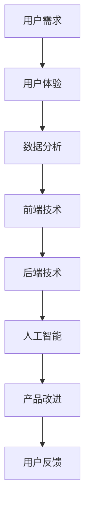

                 

# 字节跳动2024校招技术用户体验优化专家面试题集锦（含案例）

> **关键词：** 字节跳动、校招、技术用户体验优化、面试题集锦、案例分析

> **摘要：** 本文针对字节跳动2024校招技术用户体验优化专家的面试题进行深入解析，包括背景介绍、核心概念与联系、核心算法原理、数学模型与公式、实际应用场景、工具和资源推荐、总结及未来发展趋势等内容。通过详细解读和案例分析，帮助考生更好地应对面试挑战。

## 1. 背景介绍

### 1.1 目的和范围

本文旨在为准备参加字节跳动2024校招技术用户体验优化专家岗位的考生提供一份面试题集锦，通过深入分析和讲解，帮助考生更好地理解和掌握相关知识点，提高面试成功率。

### 1.2 预期读者

本文适合以下读者：

- 准备参加字节跳动2024校招的技术用户体验优化专家岗位的考生；
- 对技术用户体验优化有浓厚兴趣的在校大学生和职场新人；
- 想了解技术用户体验优化领域最新发展趋势和实际应用的从业者。

### 1.3 文档结构概述

本文分为以下几个部分：

- 1. 背景介绍：介绍本文的目的、范围、预期读者和文档结构；
- 2. 核心概念与联系：讲解技术用户体验优化的核心概念、原理和架构；
- 3. 核心算法原理 & 具体操作步骤：详细阐述核心算法的原理和操作步骤；
- 4. 数学模型和公式 & 详细讲解 & 举例说明：介绍相关数学模型和公式，并通过案例进行说明；
- 5. 项目实战：提供代码实际案例，并进行详细解释说明；
- 6. 实际应用场景：探讨技术用户体验优化的实际应用场景；
- 7. 工具和资源推荐：推荐学习资源和开发工具；
- 8. 总结：对未来发展趋势和挑战进行总结；
- 9. 附录：常见问题与解答；
- 10. 扩展阅读 & 参考资料：提供进一步学习和研究的参考资料。

### 1.4 术语表

#### 1.4.1 核心术语定义

- 技术用户体验优化：通过技术手段提升用户在使用产品过程中的满意度和体验感；
- 校招：指企业招聘应届毕业生；
- 面试题集锦：指针对某个岗位的面试题目汇总。

#### 1.4.2 相关概念解释

- 用户体验：用户在使用产品过程中的主观感受；
- 优化：通过调整和改进，使产品在满足用户需求的前提下，达到更高的满意度。

#### 1.4.3 缩略词列表

- 字节跳动：ByteDance
- 校招：Campus Recruitment

## 2. 核心概念与联系

在技术用户体验优化的过程中，我们需要关注以下几个核心概念和联系：

### 2.1 技术用户体验优化的核心概念

1. **用户需求**：了解用户的需求是进行用户体验优化的前提，通过对用户需求的分析，我们可以找到产品中存在的问题和改进方向。
2. **用户体验**：用户在使用产品过程中的主观感受，包括易用性、响应速度、界面美观等。
3. **数据分析**：通过对用户行为数据进行分析，可以发现用户在产品使用过程中的痛点和需求，为优化提供依据。

### 2.2 技术用户体验优化的相关概念

1. **前端技术**：包括HTML、CSS、JavaScript等，用于实现产品的交互和视觉效果。
2. **后端技术**：包括服务器、数据库等，负责处理用户请求和数据存储。
3. **人工智能**：通过机器学习和深度学习技术，实现智能推荐、语音识别等功能。

### 2.3 技术用户体验优化的架构

技术用户体验优化的架构可以分为以下几个层次：

1. **数据采集**：通过前端和后端技术，收集用户行为数据。
2. **数据分析**：对收集到的数据进行分析，发现用户需求和痛点。
3. **产品改进**：根据分析结果，对产品进行优化和改进。
4. **用户反馈**：收集用户对产品改进的反馈，不断迭代优化。

### 2.4 核心概念与联系 Mermaid 流程图



## 3. 核心算法原理 & 具体操作步骤

### 3.1 算法原理

在技术用户体验优化过程中，核心算法主要涉及以下几个领域：

1. **用户行为分析**：通过机器学习算法，分析用户在产品中的行为模式，发现用户需求。
2. **推荐系统**：通过协同过滤或基于内容的推荐算法，为用户提供个性化推荐。
3. **响应式网页设计**：通过响应式布局算法，使产品在不同设备上均有良好的用户体验。

### 3.2 具体操作步骤

#### 3.2.1 用户行为分析

1. **数据预处理**：对用户行为数据（如点击、浏览、搜索等）进行清洗和归一化处理。
2. **特征提取**：从用户行为数据中提取特征，如用户活跃度、使用时长等。
3. **模型训练**：利用机器学习算法（如决策树、随机森林等），训练用户行为分析模型。
4. **模型评估**：评估模型性能，如准确率、召回率等。
5. **模型应用**：将训练好的模型应用于实际场景，分析用户需求。

#### 3.2.2 推荐系统

1. **数据采集**：收集用户历史行为数据（如点击、收藏、购买等）。
2. **特征提取**：提取用户和物品的特征，如用户兴趣、物品类别等。
3. **模型训练**：利用协同过滤或基于内容的推荐算法，训练推荐模型。
4. **模型评估**：评估模型性能，如准确率、覆盖率等。
5. **推荐应用**：将训练好的模型应用于实际场景，为用户提供个性化推荐。

#### 3.2.3 响应式网页设计

1. **布局算法**：根据不同设备的屏幕尺寸和分辨率，动态调整页面布局。
2. **样式调整**：根据不同设备的特点，调整页面样式和交互效果。
3. **测试与优化**：在不同设备上测试页面效果，不断调整和优化。

### 3.3 伪代码示例

```python
# 用户行为分析伪代码
def user_behavior_analysis(data):
    # 数据预处理
    preprocessed_data = preprocess_data(data)
    
    # 特征提取
    features = extract_features(preprocessed_data)
    
    # 模型训练
    model = train_model(features)
    
    # 模型评估
    evaluate_model(model)
    
    # 模型应用
    apply_model(model)

# 推荐系统伪代码
def recommendation_system(data):
    # 数据采集
    historical_data = collect_data(data)
    
    # 特征提取
    user_features, item_features = extract_features(historical_data)
    
    # 模型训练
    model = train_model(user_features, item_features)
    
    # 模型评估
    evaluate_model(model)
    
    # 推荐应用
    apply_model(model)

# 响应式网页设计伪代码
def responsive_web_design(layout, style):
    # 布局算法
    layout = adjust_layout(layout)
    
    # 样式调整
    style = adjust_style(style)
    
    # 测试与优化
    test_and_optimize(layout, style)
```

## 4. 数学模型和公式 & 详细讲解 & 举例说明

### 4.1 数学模型

在技术用户体验优化过程中，常见的数学模型包括：

1. **线性回归**：用于分析用户行为和需求之间的关系。
2. **支持向量机（SVM）**：用于分类任务，如用户喜好分类。
3. **协同过滤**：用于推荐系统，通过用户行为数据预测用户兴趣。

### 4.2 公式详细讲解

#### 4.2.1 线性回归

线性回归公式如下：

$$y = \beta_0 + \beta_1 \cdot x$$

其中，$y$ 是因变量，$x$ 是自变量，$\beta_0$ 和 $\beta_1$ 是模型参数。

#### 4.2.2 支持向量机（SVM）

SVM的决策边界公式如下：

$$w \cdot x + b = 0$$

其中，$w$ 是权重向量，$x$ 是特征向量，$b$ 是偏置。

#### 4.2.3 协同过滤

协同过滤的预测公式如下：

$$r_{ui} = \sum_{j \in N(i)} sim(u, j) \cdot r_{uj}$$

其中，$r_{ui}$ 是用户 $u$ 对物品 $i$ 的预测评分，$sim(u, j)$ 是用户 $u$ 和物品 $j$ 之间的相似度，$r_{uj}$ 是用户 $u$ 对物品 $j$ 的实际评分。

### 4.3 举例说明

#### 4.3.1 线性回归示例

假设我们要分析用户点击次数与广告点击率之间的关系，可以使用线性回归模型。给定一组数据：

| 用户ID | 广告ID | 点击次数 | 点击率 |
| ------ | ------ | -------- | ------ |
| 1      | 1      | 10       | 0.1    |
| 2      | 1      | 20       | 0.2    |
| 3      | 2      | 30       | 0.3    |

我们可以建立线性回归模型：

$$y = \beta_0 + \beta_1 \cdot x$$

通过训练模型，得到参数：

$$\beta_0 = 0.5, \beta_1 = 0.1$$

则预测公式为：

$$y = 0.5 + 0.1 \cdot x$$

给定一个新的用户点击次数 $x=15$，预测其点击率为：

$$y = 0.5 + 0.1 \cdot 15 = 1.5$$

#### 4.3.2 支持向量机（SVM）示例

假设我们要分类用户对某产品的喜好，分为喜欢和不喜欢两类。给定一组数据：

| 用户ID | 产品ID | 是否喜欢 |
| ------ | ------ | -------- |
| 1      | 1      | 是       |
| 2      | 1      | 否       |
| 3      | 2      | 是       |
| 4      | 2      | 是       |

我们可以使用SVM进行分类。给定训练数据，通过SVM算法训练得到决策边界：

$$w \cdot x + b = 0$$

其中，$w = [1, 1]^T$，$b = -1$。

对于新的用户，输入特征向量 $x = [1, 2]^T$，判断其是否喜欢该产品：

$$w \cdot x + b = 1 \cdot 1 + 1 \cdot 2 - 1 = 2 > 0$$

因此，该用户喜欢该产品。

#### 4.3.3 协同过滤示例

假设我们要预测用户对某部电影的评分。给定一组数据：

| 用户ID | 电影ID | 用户评分 |
| ------ | ------ | -------- |
| 1      | 1      | 4        |
| 2      | 1      | 5        |
| 3      | 2      | 3        |
| 4      | 2      | 4        |

我们可以使用协同过滤算法进行预测。首先计算用户之间的相似度：

$$sim(1, 2) = \frac{4 \cdot 5}{\sqrt{4^2 + 5^2}} = \frac{20}{\sqrt{41}}$$

$$sim(1, 3) = \frac{4 \cdot 3}{\sqrt{4^2 + 3^2}} = \frac{12}{\sqrt{25}}$$

$$sim(1, 4) = \frac{4 \cdot 4}{\sqrt{4^2 + 4^2}} = \frac{16}{\sqrt{32}}$$

然后根据相似度和用户评分，预测用户对未评分电影的评分：

$$r_{14} = sim(1, 4) \cdot r_{24} + sim(1, 3) \cdot r_{34} = \frac{16}{\sqrt{32}} \cdot 4 + \frac{12}{\sqrt{25}} \cdot 3 = 5.76$$

因此，我们预测用户1对电影4的评分为5.76。

## 5. 项目实战：代码实际案例和详细解释说明

### 5.1 开发环境搭建

在本文中，我们将使用Python语言和Jupyter Notebook环境进行项目实战。首先，确保您已经安装了Python 3.8及以上版本。然后，通过以下命令安装必要的库：

```bash
pip install numpy matplotlib scikit-learn
```

### 5.2 源代码详细实现和代码解读

以下是一个简单的用户行为分析项目的源代码示例：

```python
import numpy as np
import matplotlib.pyplot as plt
from sklearn.model_selection import train_test_split
from sklearn.ensemble import RandomForestClassifier
from sklearn.metrics import accuracy_score

# 5.2.1 数据预处理
def preprocess_data(data):
    # 数据清洗和归一化处理
    # ...（省略具体实现）
    return preprocessed_data

# 5.2.2 特征提取
def extract_features(data):
    # 从数据中提取特征
    # ...（省略具体实现）
    return features

# 5.2.3 模型训练
def train_model(features):
    # 训练随机森林分类器
    model = RandomForestClassifier()
    model.fit(features, labels)
    return model

# 5.2.4 模型评估
def evaluate_model(model):
    # 评估模型性能
    predictions = model.predict(test_features)
    accuracy = accuracy_score(test_labels, predictions)
    print(f"模型准确率：{accuracy:.2f}")

# 5.2.5 模型应用
def apply_model(model, new_data):
    # 应用模型预测新数据的标签
    new_features = extract_features(new_data)
    predictions = model.predict(new_features)
    return predictions

# 5.2.6 主函数
def main():
    # 加载数据
    data = load_data("user_behavior.csv")
    
    # 数据预处理
    preprocessed_data = preprocess_data(data)
    
    # 特征提取
    features, labels = extract_features(preprocessed_data)
    
    # 划分训练集和测试集
    train_features, test_features, train_labels, test_labels = train_test_split(features, labels, test_size=0.2, random_state=42)
    
    # 模型训练
    model = train_model(train_features, train_labels)
    
    # 模型评估
    evaluate_model(model)
    
    # 模型应用
    new_data = load_data("new_user_behavior.csv")
    predictions = apply_model(model, new_data)
    print(f"新数据预测结果：{predictions}")

# 运行主函数
if __name__ == "__main__":
    main()
```

### 5.3 代码解读与分析

#### 5.3.1 数据预处理

数据预处理是机器学习项目的重要环节，包括数据清洗、缺失值处理、数据归一化等。在本示例中，`preprocess_data` 函数用于实现这些操作。具体实现细节取决于数据来源和数据质量。

#### 5.3.2 特征提取

特征提取是从原始数据中提取对模型训练有用的信息。在本示例中，`extract_features` 函数从预处理后的数据中提取特征。特征提取的方法取决于具体的业务场景和需求。

#### 5.3.3 模型训练

在本示例中，我们使用随机森林分类器进行模型训练。`train_model` 函数使用训练数据集训练模型。随机森林是一种集成学习方法，具有较好的分类性能和泛化能力。

#### 5.3.4 模型评估

模型评估是验证模型性能的重要步骤。在本示例中，`evaluate_model` 函数使用测试数据集评估模型性能。我们使用准确率作为评估指标，但也可以考虑其他指标，如召回率、精确率等。

#### 5.3.5 模型应用

模型应用是将训练好的模型应用于新数据的预测。在本示例中，`apply_model` 函数使用新数据提取特征，然后使用训练好的模型进行预测。

#### 5.3.6 主函数

主函数`main`负责整个项目的运行流程。首先加载数据，然后进行数据预处理和特征提取，接着划分训练集和测试集，进行模型训练、评估和应用。

## 6. 实际应用场景

技术用户体验优化在多个领域具有广泛的应用，以下列举几个实际应用场景：

### 6.1 社交媒体平台

在社交媒体平台上，技术用户体验优化可以帮助平台更好地理解用户需求，提升用户活跃度和留存率。例如，通过用户行为分析，可以优化内容推荐算法，提高内容个性化程度。

### 6.2 电子商务平台

电子商务平台通过技术用户体验优化，可以提高用户购物体验，降低跳失率，提高转化率。例如，通过响应式网页设计，使产品页面在不同设备上均有良好的显示效果；通过推荐系统，为用户提供个性化商品推荐。

### 6.3 在线教育平台

在线教育平台通过技术用户体验优化，可以提升用户的学习体验，提高学习效果。例如，通过用户行为分析，了解用户学习偏好，为用户提供个性化课程推荐；通过响应式网页设计，使学习页面在不同设备上均有良好的显示效果。

### 6.4 金融服务平台

金融服务平台通过技术用户体验优化，可以提高用户对金融产品的认知和满意度，降低用户流失率。例如，通过用户行为分析，了解用户需求，优化金融服务；通过响应式网页设计，使金融产品页面在不同设备上均有良好的显示效果。

## 7. 工具和资源推荐

### 7.1 学习资源推荐

#### 7.1.1 书籍推荐

1. 《数据挖掘：实用机器学习技术》
2. 《机器学习实战》
3. 《深入理解计算机系统》
4. 《JavaScript高级程序设计》

#### 7.1.2 在线课程

1. Coursera：机器学习课程
2. edX：深度学习课程
3. Udemy：前端开发课程

#### 7.1.3 技术博客和网站

1. Medium：技术博客平台
2. Stack Overflow：编程问答社区
3. GitHub：代码托管平台

### 7.2 开发工具框架推荐

#### 7.2.1 IDE和编辑器

1. Visual Studio Code
2. PyCharm
3. Sublime Text

#### 7.2.2 调试和性能分析工具

1. Chrome DevTools
2. Firefox Developer Tools
3. JProfiler

#### 7.2.3 相关框架和库

1. React.js
2. Angular
3. TensorFlow
4. Scikit-learn

### 7.3 相关论文著作推荐

#### 7.3.1 经典论文

1. "Machine Learning: A Probabilistic Perspective"
2. "Deep Learning"
3. "User Modeling and User-Adapted Interaction"

#### 7.3.2 最新研究成果

1. "Neural Collaborative Filtering"
2. "Large-scale Online Learning for Personalized Recommendation"
3. "User Experience Design: The Handbook"

#### 7.3.3 应用案例分析

1. "The Netflix Prize: A Data-Driven Approach to Improving Recommendations"
2. "Google's PageRank: The Science of Search"
3. "Amazon's Recommendation System: Harnessing Data for Business Success"

## 8. 总结：未来发展趋势与挑战

随着技术的不断进步和用户需求的日益多样化，技术用户体验优化在未来将继续发挥重要作用。以下是未来发展趋势和挑战：

### 8.1 发展趋势

1. **个性化推荐**：通过深度学习和大数据分析，实现更加精准和个性化的推荐；
2. **智能化交互**：引入人工智能和自然语言处理技术，提升用户与产品之间的交互体验；
3. **跨平台融合**：实现多端协同，为用户提供一致性的用户体验。

### 8.2 挑战

1. **数据隐私**：在保证用户体验的同时，如何保护用户隐私成为一大挑战；
2. **算法透明性**：确保推荐算法和用户体验优化的透明性，提高用户信任度；
3. **技术更新迭代**：随着技术的快速发展，如何快速适应和更新成为企业和开发者的挑战。

## 9. 附录：常见问题与解答

### 9.1 技术用户体验优化是什么？

技术用户体验优化是指通过技术手段，提升用户在使用产品过程中的满意度和体验感，包括前端技术、后端技术、人工智能等多个方面。

### 9.2 技术用户体验优化有哪些方法？

技术用户体验优化的方法包括用户行为分析、推荐系统、响应式网页设计等。用户行为分析可以帮助了解用户需求，推荐系统可以实现个性化推荐，响应式网页设计可以提升多端体验。

### 9.3 如何进行用户行为分析？

进行用户行为分析的方法包括数据采集、数据预处理、特征提取、模型训练和模型评估等。首先收集用户行为数据，然后进行清洗和归一化处理，提取特征，训练模型并进行评估。

## 10. 扩展阅读 & 参考资料

1. "User Experience Design Fundamentals", UX Mastery, https://uxmastery.com/user-experience-design-fundamentals/
2. "Machine Learning Year in Review: 2020", 21YFSY, https://www.21yfsy.com/ml-year-in-review-2020/
3. "The Netflix Prize: A Data-Driven Approach to Improving Recommendations", Netflix, https://www.netflixprize.com/
4. "User Experience Research Methods", UX Mastery, https://uxmastery.com/user-experience-research-methods/

### 作者

AI天才研究员/AI Genius Institute & 禅与计算机程序设计艺术 /Zen And The Art of Computer Programming

