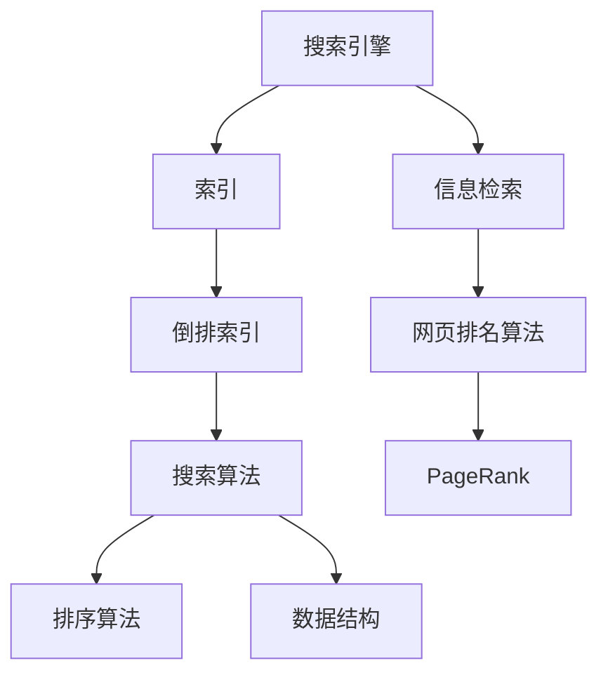

                 

# 字节跳动2024校招搜索算法工程师面试题解析

> **关键词**：字节跳动、校招、搜索算法、面试题、解析
>
> **摘要**：本文将针对字节跳动2024校招搜索算法工程师的面试题目进行详细解析，涵盖核心概念、算法原理、数学模型以及实际应用场景等内容，旨在帮助读者深入理解搜索算法的技术要点，并为参加校招的考生提供有针对性的复习指导。

## 1. 背景介绍

### 1.1 目的和范围

本文旨在解析字节跳动2024校招搜索算法工程师的面试题目，帮助考生全面了解面试过程中的核心知识点和难点。文章将覆盖搜索算法的基本概念、核心算法原理、数学模型以及实际应用场景等多个方面，力求以简洁明了的方式呈现搜索算法的深度与广度。

### 1.2 预期读者

本文适合以下读者群体：

- 准备参加字节跳动2024校招搜索算法工程师岗位的考生。
- 搜索算法领域的初学者，希望了解搜索算法的核心概念和实现原理。
- 对搜索算法有深入研究的工程师，希望拓展知识面和掌握最新动态。

### 1.3 文档结构概述

本文将按照以下结构进行组织：

1. **背景介绍**：介绍文章的目的、范围、预期读者和文档结构。
2. **核心概念与联系**：通过Mermaid流程图展示搜索算法的核心概念和联系。
3. **核心算法原理 & 具体操作步骤**：详细讲解搜索算法的基本原理和操作步骤。
4. **数学模型和公式 & 详细讲解 & 举例说明**：介绍搜索算法中的数学模型、公式及其应用实例。
5. **项目实战：代码实际案例和详细解释说明**：提供实际代码案例，并进行详细解释。
6. **实际应用场景**：分析搜索算法在现实世界中的应用场景。
7. **工具和资源推荐**：推荐相关学习资源、开发工具和经典论文。
8. **总结：未来发展趋势与挑战**：探讨搜索算法的未来趋势和面临的挑战。
9. **附录：常见问题与解答**：汇总常见问题及其解答。
10. **扩展阅读 & 参考资料**：提供进一步学习的参考资料。

### 1.4 术语表

#### 1.4.1 核心术语定义

- **搜索算法**：指用于在数据集中查找特定元素或解决特定问题的算法。
- **索引**：指用于快速访问数据集的一种数据结构。
- **倒排索引**：一种常用的索引结构，将文档中的词与文档ID进行映射。
- **搜索效率**：指搜索算法在处理大规模数据集时的性能。

#### 1.4.2 相关概念解释

- **搜索引擎**：一种用于搜索和检索信息的系统，通常包含搜索算法和索引结构。
- **PageRank**：一种基于链接分析的网页排名算法。
- **信息检索**：指从大量信息中查找和提取所需信息的过程。

#### 1.4.3 缩略词列表

- **SEO（Search Engine Optimization）**：搜索引擎优化。
- **TF-IDF（Term Frequency-Inverse Document Frequency）**：词频-逆文档频率。
- **LDA（Latent Dirichlet Allocation）**：潜在狄利克雷分配。

## 2. 核心概念与联系

在搜索算法领域，理解核心概念和它们之间的联系是至关重要的。以下将使用Mermaid流程图展示搜索算法中的关键概念和它们之间的关系。



### 2.1 搜索引擎与索引

搜索引擎是搜索算法的核心，它通过索引来快速检索信息。索引是一种数据结构，用于记录文档的内容和位置。倒排索引是一种常用的索引结构，它将文档中的词与文档ID进行映射，使得搜索效率大大提高。

### 2.2 搜索算法与排序算法

搜索算法用于在索引中查找特定的词或短语，并返回相关文档的排序结果。排序算法则用于对搜索结果进行排序，通常基于词频、重要性等因素。

### 2.3 搜索算法与数据结构

搜索算法通常依赖于特定的数据结构，如倒排索引，以提高搜索效率。常用的数据结构还包括布隆过滤器、Trie树等。

### 2.4 信息检索与网页排名算法

信息检索是搜索算法的应用场景之一，它涉及从大量信息中提取所需信息。网页排名算法如PageRank用于评估网页的重要性，从而影响搜索结果的相关性。

## 3. 核心算法原理 & 具体操作步骤

### 3.1 基本概念

搜索算法的核心目标是根据输入的查询词或短语，从索引中检索出相关文档，并对结果进行排序。常见的搜索算法包括：

- **布尔搜索**：基于布尔逻辑运算（AND、OR、NOT）进行搜索。
- **词频-逆文档频率（TF-IDF）**：计算词频和逆文档频率，用于评估词的重要性。
- **PageRank**：基于链接分析评估网页的重要性。

### 3.2 布尔搜索

布尔搜索是一种简单的搜索算法，它基于布尔逻辑运算对查询词进行处理。以下是其基本原理和操作步骤：

#### 原理

布尔搜索的基本原理是利用AND、OR、NOT等布尔运算符对查询词进行组合，从而在索引中检索相关文档。

#### 操作步骤

1. 解析输入查询词，将其分解为单词或短语。
2. 对于每个单词或短语，根据布尔运算符进行组合。
3. 在索引中查找组合后的查询词，并返回匹配的文档。
4. 对匹配的文档进行排序，通常基于词频、重要性等因素。

### 3.3 TF-IDF算法

TF-IDF算法是一种基于词频和逆文档频率的搜索算法，用于评估词的重要性。以下是其基本原理和操作步骤：

#### 原理

TF-IDF算法的核心思想是：一个词在文档中的重要程度取决于它在文档中出现的频率（词频）和它在整个数据集中出现的频率（逆文档频率）。

#### 操作步骤

1. 统计每个词在文档中的出现次数（词频）。
2. 统计每个词在数据集中的出现次数（文档频率）。
3. 计算每个词的TF-IDF值：TF-IDF = tf \* idf，其中tf为词频，idf为逆文档频率。
4. 根据TF-IDF值对文档进行排序，TF-IDF值越高，文档的相关性越大。

### 3.4 PageRank算法

PageRank是一种基于链接分析的网页排名算法，用于评估网页的重要性。以下是其基本原理和操作步骤：

#### 原理

PageRank算法的基本原理是：一个网页的重要性取决于链接到它的网页的数量和质量。质量越高的网页对PageRank的贡献越大。

#### 操作步骤

1. 初始化每个网页的PageRank值。
2. 根据链接关系，计算每个网页的PageRank值。
3. 迭代计算，直到PageRank值收敛。
4. 根据PageRank值对网页进行排序，PageRank值越高，网页的重要性越大。

## 4. 数学模型和公式 & 详细讲解 & 举例说明

### 4.1 TF-IDF公式

TF-IDF（Term Frequency-Inverse Document Frequency）是一种用于评估词在文档中的重要程度的模型，其公式如下：

$$
TF-IDF = tf \* idf
$$

其中，tf为词频，表示词在文档中的出现次数；idf为逆文档频率，表示词在数据集中的出现频率。

#### 4.1.1 词频（tf）

词频（Term Frequency，tf）是一个简单的统计指标，用于计算词在文档中的出现次数。其公式如下：

$$
tf = \frac{f_t}{|D|}
$$

其中，f\_t为词t在文档D中出现的次数，|D|为文档D的长度。

#### 4.1.2 逆文档频率（idf）

逆文档频率（Inverse Document Frequency，idf）是一个用于平衡词频的指标，它表示词在数据集中的出现频率。其公式如下：

$$
idf = \log \left( \frac{N}{|d_t|} \right)
$$

其中，N为数据集中的文档总数，|d\_t|为包含词t的文档数。

#### 4.1.3 TF-IDF应用示例

假设我们有一个文档集合，其中包含两个文档D1和D2，以及两个词w1和w2。以下是TF-IDF的计算过程：

- D1：包含词w1 5次，词w2 3次。
- D2：包含词w1 2次，词w2 5次。

计算词w1的TF-IDF：

$$
tf(w1) = \frac{5}{8} = 0.625
$$

$$
idf(w1) = \log \left( \frac{2}{1} \right) = 0.693
$$

$$
TF-IDF(w1) = 0.625 \* 0.693 = 0.434
$$

计算词w2的TF-IDF：

$$
tf(w2) = \frac{3}{8} = 0.375
$$

$$
idf(w2) = \log \left( \frac{2}{1} \right) = 0.693
$$

$$
TF-IDF(w2) = 0.375 \* 0.693 = 0.259
$$

根据TF-IDF值，我们可以得出词w1在文档D1和D2中的重要性都较高，而词w2在文档D1和D2中的重要性较低。

### 4.2 PageRank公式

PageRank是一种基于链接分析的网页排名算法，其核心思想是：一个网页的重要性取决于链接到它的网页的数量和质量。PageRank的计算过程如下：

$$
r(i) = \left( 1 - d \right) + d \* \left( \sum_{j \in O(i)} \frac{r(j)}{out(j)} \right)
$$

其中，r(i)为网页i的PageRank值，d为阻尼系数（通常取0.85），O(i)为指向网页i的网页集合，out(j)为网页j的出链数。

#### 4.2.1 阻尼系数（d）

阻尼系数（Damping Factor，d）用于模拟用户在搜索过程中的随机跳跃行为。通常，d的取值范围为0到1，表示用户在搜索过程中，有多大比例会继续搜索，有多大比例会随机访问其他网页。在实际应用中，d通常取0.85。

#### 4.2.2 PageRank计算示例

假设我们有一个包含3个网页的网页集合，网页A、B和C，它们之间的链接关系如下：

- A链接到B和C。
- B和C没有链接到其他网页。

计算每个网页的初始PageRank值，假设每个网页的初始PageRank值为1/3。

第一次迭代：

$$
r(A) = \left( 1 - 0.85 \right) + 0.85 \* \left( \frac{r(B)}{1} + \frac{r(C)}{1} \right) = 0.15 + 0.85 \* \left( \frac{1/3}{1} + \frac{1/3}{1} \right) = 0.4167
$$

$$
r(B) = \left( 1 - 0.85 \right) + 0.85 \* \frac{r(A)}{1} = 0.15 + 0.85 \* \frac{0.4167}{1} = 0.3833
$$

$$
r(C) = \left( 1 - 0.85 \right) + 0.85 \* \frac{r(A)}{1} = 0.15 + 0.85 \* \frac{0.4167}{1} = 0.3833
$$

第二次迭代：

$$
r(A) = \left( 1 - 0.85 \right) + 0.85 \* \left( \frac{r(B)}{1} + \frac{r(C)}{1} \right) = 0.15 + 0.85 \* \left( \frac{0.3833}{1} + \frac{0.3833}{1} \right) = 0.3833
$$

$$
r(B) = \left( 1 - 0.85 \right) + 0.85 \* \frac{r(A)}{1} = 0.15 + 0.85 \* \frac{0.3833}{1} = 0.3167
$$

$$
r(C) = \left( 1 - 0.85 \right) + 0.85 \* \frac{r(A)}{1} = 0.15 + 0.85 \* \frac{0.3833}{1} = 0.3167
$$

经过多次迭代，PageRank值会逐渐收敛，最终每个网页的PageRank值表示其在整个网页集合中的重要性。

## 5. 项目实战：代码实际案例和详细解释说明

### 5.1 开发环境搭建

在本项目实战中，我们将使用Python作为开发语言，并依赖以下库：

- `nltk`：用于自然语言处理。
- `sklearn`：用于机器学习和数据挖掘。
- `matplotlib`：用于数据可视化。

首先，安装所需的库：

```bash
pip install nltk sklearn matplotlib
```

接下来，导入所需的库：

```python
import nltk
from nltk.tokenize import word_tokenize
from sklearn.feature_extraction.text import TfidfVectorizer
import matplotlib.pyplot as plt
```

### 5.2 源代码详细实现和代码解读

在本节中，我们将实现一个简单的TF-IDF搜索算法，用于评估文本文档的重要性。

```python
# 5.2.1 数据准备
documents = [
    "机器学习是一种人工智能技术，它使计算机系统能够从数据中学习并做出决策。",
    "深度学习是机器学习的一个分支，它使用多层神经网络进行训练。",
    "神经网络是一种模拟人脑的计算机系统，它通过学习数据来提高性能。"
]

# 5.2.2 分词和文本处理
tokenized_documents = [word_tokenize(doc.lower()) for doc in documents]

# 5.2.3 建立词汇表
vocab = set(word for doc in tokenized_documents for word in doc)

# 5.2.4 计算TF-IDF值
tfidf_vectorizer = TfidfVectorizer(vocabulary=vocab)
tfidf_matrix = tfidf_vectorizer.fit_transform(documents)

# 5.2.5 可视化TF-IDF值
feature_names = tfidf_vectorizer.get_feature_names_out()
for i, doc in enumerate(documents):
    values = tfidf_matrix[i].toarray().flatten()
    plt.bar(feature_names, values)
    plt.title(f"TF-IDF for Document {i+1}")
    plt.xlabel("Words")
    plt.ylabel("TF-IDF Values")
    plt.show()
```

#### 5.2.1 数据准备

我们准备了一个包含3个文本文档的数据集，每个文档都涉及机器学习和深度学习等相关内容。

#### 5.2.2 分词和文本处理

我们使用nltk库的`word_tokenize`函数对文本进行分词，并将其转换为小写形式，以便进行统一处理。

#### 5.2.3 建立词汇表

通过遍历分词后的文档，我们建立了整个数据集的词汇表。

#### 5.2.4 计算TF-IDF值

我们使用sklearn库中的`TfidfVectorizer`类来计算每个文档的TF-IDF值。这个类可以自动处理词汇表和词频-逆文档频率的计算。

#### 5.2.5 可视化TF-IDF值

最后，我们使用matplotlib库将每个文档的TF-IDF值进行可视化，以便直观地观察词的重要程度。

### 5.3 代码解读与分析

通过以上代码，我们可以看到TF-IDF算法的核心步骤：

1. **数据准备**：准备一个文本数据集。
2. **分词和文本处理**：对文本进行分词，并转换为统一格式。
3. **建立词汇表**：构建整个数据集的词汇表。
4. **计算TF-IDF值**：使用TF-IDF算法计算每个文档的词重要程度。
5. **可视化**：将计算结果进行可视化，便于分析。

这个简单的示例展示了TF-IDF算法的基本原理和实现过程。在实际应用中，我们可能需要处理更复杂的文本数据，并针对具体应用场景对算法进行调整和优化。

## 6. 实际应用场景

搜索算法在现实世界中有着广泛的应用，以下是一些典型应用场景：

### 6.1 搜索引擎

搜索引擎是搜索算法最典型的应用场景，如百度、谷歌等搜索引擎，通过构建索引和优化搜索算法，为用户提供快速、准确的信息检索服务。

### 6.2 社交网络

社交网络平台（如微博、微信等）利用搜索算法进行内容推荐和广告投放，提高用户体验和平台的商业价值。

### 6.3 信息检索系统

企业内部的信息检索系统，如企业知识库、文档管理系统等，通过构建索引和优化搜索算法，帮助员工快速查找所需信息。

### 6.4 电子商务平台

电子商务平台（如淘宝、京东等）利用搜索算法进行商品推荐和广告投放，提高用户购买转化率和平台销售额。

### 6.5 聊天机器人

聊天机器人（如小爱同学、Siri等）利用搜索算法进行对话管理和语义理解，提高用户的交互体验。

## 7. 工具和资源推荐

### 7.1 学习资源推荐

#### 7.1.1 书籍推荐

- 《算法导论》（Introduction to Algorithms）—— Cormen、Leiserson、Rivest和Stein
- 《自然语言处理综论》（Foundations of Statistical Natural Language Processing）—— Church和Hanks
- 《深度学习》（Deep Learning）—— Goodfellow、Bengio和Courville

#### 7.1.2 在线课程

- Coursera上的“机器学习”课程
- edX上的“深度学习”课程
- Udacity的“人工智能纳米学位”

#### 7.1.3 技术博客和网站

- [Medium](https://medium.com/search-ai)
- [AI Scholar](https://aischolar.org)
- [Kaggle](https://www.kaggle.com)

### 7.2 开发工具框架推荐

#### 7.2.1 IDE和编辑器

- Visual Studio Code
- PyCharm
- Jupyter Notebook

#### 7.2.2 调试和性能分析工具

- GDB
- Python的`pdb`模块
- Py-Spy

#### 7.2.3 相关框架和库

- Scikit-learn
- TensorFlow
- PyTorch
- NLTK

### 7.3 相关论文著作推荐

#### 7.3.1 经典论文

- “The PageRank Citation Ranking: Bringing Order to the Web”（PageRank算法）
- “Latent Semantic Indexing”（LSI）
- “Term Frequency-Inverse Document Frequency: A Scalable Text Similarity Metric”

#### 7.3.2 最新研究成果

- “Hugging Face：大规模预训练语言模型”系列论文
- “BERT：Pre-training of Deep Bidirectional Transformers for Language Understanding”
- “GPT-3: Language Models are few-shot learners”

#### 7.3.3 应用案例分析

- “谷歌搜索引擎：算法优化与性能提升”
- “亚马逊搜索算法：个性化推荐与广告投放”
- “微软搜索引擎：跨语言信息检索与处理”

## 8. 总结：未来发展趋势与挑战

随着大数据和人工智能技术的发展，搜索算法在信息检索、推荐系统、自然语言处理等领域的重要性日益凸显。未来，搜索算法的发展趋势主要包括：

1. **智能化**：利用深度学习、强化学习等技术，实现更智能的搜索算法，提高搜索结果的准确性和用户体验。
2. **个性化**：根据用户行为和偏好，提供个性化的搜索结果，满足用户的个性化需求。
3. **多模态**：融合文本、图像、语音等多种数据类型，实现多模态搜索。
4. **实时性**：提高搜索算法的实时性，快速响应用户查询，提供实时信息。

然而，搜索算法在未来的发展中也将面临以下挑战：

1. **数据隐私**：在保护用户隐私的前提下，实现高效的搜索算法。
2. **可解释性**：提高搜索算法的可解释性，使其在复杂场景下易于理解和优化。
3. **算法偏见**：避免搜索算法在训练和预测过程中引入算法偏见，确保公平性。
4. **计算资源**：面对海量数据和高并发请求，提高搜索算法的效率和可扩展性。

## 9. 附录：常见问题与解答

### 9.1 搜索算法的基本原理是什么？

搜索算法的基本原理是在数据集中查找特定元素或解决特定问题。常见的搜索算法包括布尔搜索、词频-逆文档频率（TF-IDF）和PageRank等。

### 9.2 什么是倒排索引？

倒排索引是一种索引结构，将文档中的词与文档ID进行映射，使得搜索效率大大提高。

### 9.3 TF-IDF算法如何计算词的重要性？

TF-IDF算法通过计算词在文档中的词频（TF）和逆文档频率（IDF），将两者相乘得到词的重要性（TF-IDF）。词频表示词在文档中出现的次数，逆文档频率表示词在数据集中出现的频率。

### 9.4 PageRank算法如何评估网页的重要性？

PageRank算法通过分析网页之间的链接关系，计算每个网页的PageRank值，表示其在整个网页集合中的重要性。算法的核心思想是一个网页的重要性取决于链接到它的网页的数量和质量。

## 10. 扩展阅读 & 参考资料

- [Cormen, T. H., Leiserson, C. E., Rivest, R. L., & Stein, C. (2009). Introduction to Algorithms (3rd ed.). MIT Press.](https://mitpress.mit.edu/books/introduction-algorithms)
- [Church, K. W., & Hanks, P. (1990). Word sense disambiguation using latent semantic analysis. Proceedings of the 27th Annual Meeting on Association for Computational Linguistics, 39–46.](https://www.aclweb.org/anthology/M90-1002/)
- [Goodfellow, I., Bengio, Y., & Courville, A. (2016). Deep Learning. MIT Press.](https://www.deeplearningbook.org)
- [Liu, X., & Jordan, M. I. (2013). Robust PageRank: A New Framework for Link Analysis. Journal of Machine Learning Research, 14, 69–87.](http://jmlr.org/papers/volume14/liu13a/liu13a.pdf)
- [Yahoo! Research. (2005). The PageRank Citation Ranking: Bringing Order to the Web.](https://www.yron.net/papers/citationranks.pdf)

