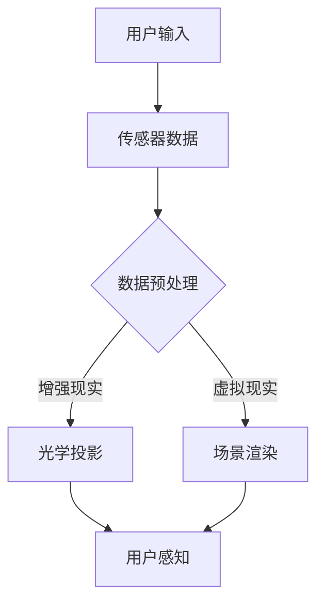
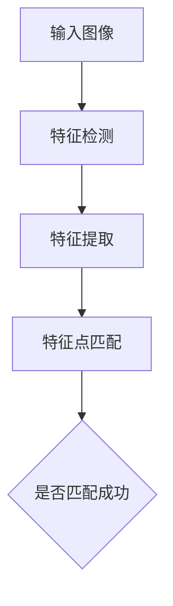
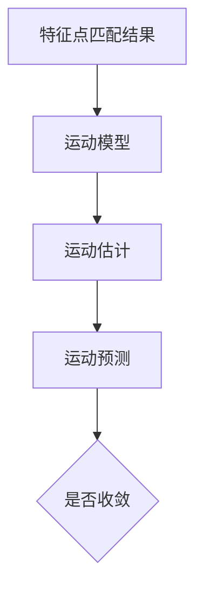
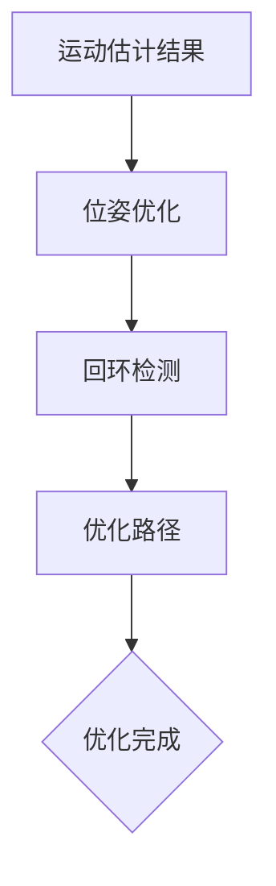
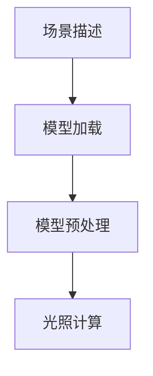
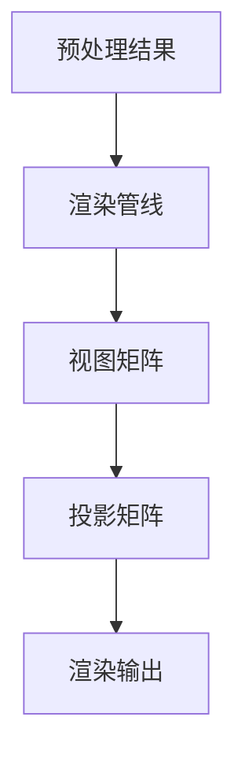
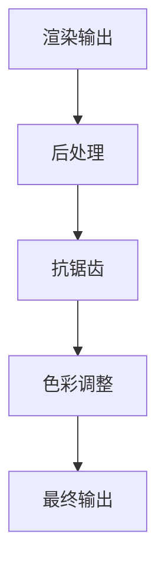
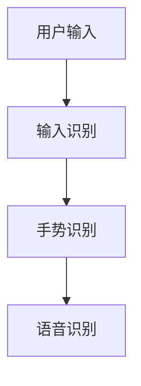
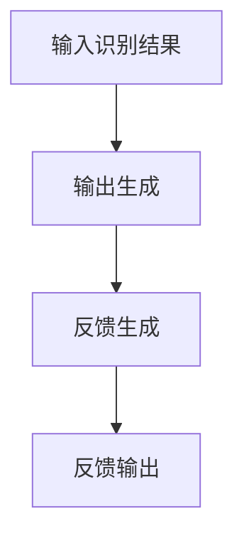

                 

# 字节跳动2024校招：AR/VR开发工程师面试真题解答

> **关键词**：字节跳动、校招、面试真题、AR/VR开发工程师、面试技巧、技术解析

> **摘要**：本文旨在为参加字节跳动2024校招的AR/VR开发工程师职位考生提供面试真题的解答。我们将逐一分析并解答面试中出现的关键技术问题，帮助考生更好地理解AR/VR开发的核心概念和技术要点。

## 1. 背景介绍

### 1.1 目的和范围

本文的目的在于通过解答字节跳动2024校招AR/VR开发工程师职位面试中的典型真题，帮助考生掌握AR/VR开发的基本原理和实践技巧。本文将涵盖以下几个方面的内容：

1. **核心概念与联系**：通过Mermaid流程图，深入解析AR/VR技术的核心概念和架构。
2. **核心算法原理 & 具体操作步骤**：以伪代码形式详细阐述关键算法的实现步骤。
3. **数学模型和公式 & 详细讲解 & 举例说明**：使用LaTeX格式介绍相关数学模型和公式，并结合实际案例进行解释。
4. **项目实战：代码实际案例和详细解释说明**：提供具体的项目实战案例，解读代码实现过程。
5. **实际应用场景**：探讨AR/VR技术的实际应用领域和案例分析。
6. **工具和资源推荐**：推荐学习资源和开发工具，帮助考生进一步提升技术水平。
7. **总结：未来发展趋势与挑战**：总结AR/VR技术的未来趋势和面临的挑战。

### 1.2 预期读者

本文预期读者为参加字节跳动2024校招的AR/VR开发工程师职位考生，以及对AR/VR技术有兴趣的读者。本文将提供系统的技术解析和实践指导，帮助考生在面试中更好地展示自己的技术能力和专业知识。

### 1.3 文档结构概述

本文结构如下：

1. **背景介绍**：包括目的和范围、预期读者、文档结构概述和术语表。
2. **核心概念与联系**：通过Mermaid流程图解析AR/VR技术的核心概念和架构。
3. **核心算法原理 & 具体操作步骤**：详细阐述关键算法的实现步骤。
4. **数学模型和公式 & 详细讲解 & 举例说明**：介绍相关数学模型和公式，结合实际案例进行解释。
5. **项目实战：代码实际案例和详细解释说明**：提供具体的项目实战案例，解读代码实现过程。
6. **实际应用场景**：探讨AR/VR技术的实际应用领域和案例分析。
7. **工具和资源推荐**：推荐学习资源和开发工具。
8. **总结：未来发展趋势与挑战**：总结AR/VR技术的未来趋势和面临的挑战。
9. **附录：常见问题与解答**：提供常见问题解答。
10. **扩展阅读 & 参考资料**：推荐相关阅读材料和参考资料。

### 1.4 术语表

#### 1.4.1 核心术语定义

- **AR（增强现实）**：通过技术手段将虚拟信息叠加到现实世界中，使用户能够在现实环境中看到增强的内容。
- **VR（虚拟现实）**：通过计算机生成一种模拟环境，使人在视觉、听觉、触觉等多个感官上感受到身临其境的体验。
- **SLAM（同时定位与地图构建）**：一种在未知环境中同时进行定位和构建地图的技术。
- **3D建模**：通过数字技术创建三维模型的过程。
- **渲染**：计算机生成图像的过程，包括光线追踪、阴影、纹理等。

#### 1.4.2 相关概念解释

- **传感器融合**：将多个传感器采集到的数据进行综合处理，以提高系统的感知能力。
- **追踪与定位**：通过算法确定物体在三维空间中的位置和运动轨迹。
- **光学投影**：使用光学设备将图像投射到物体表面，实现增强现实效果。
- **场景重建**：通过图像处理和计算机视觉技术，从现实场景中重建三维模型。

#### 1.4.3 缩略词列表

- **AR**：增强现实
- **VR**：虚拟现实
- **SLAM**：同时定位与地图构建
- **3D**：三维
- **GPU**：图形处理器

## 2. 核心概念与联系

为了深入理解AR/VR技术的核心概念和架构，我们可以通过Mermaid流程图来展示它们的基本原理和相互关系。以下是一个简化的Mermaid流程图示例：



### 2.1 增强现实（AR）

增强现实（AR）技术主要通过将虚拟信息叠加到现实世界中，以增强用户的感知体验。其核心原理包括以下几个方面：

1. **光学投影**：使用光学设备（如摄像头、投影仪等）捕捉现实场景，并将虚拟信息通过光学方式叠加到场景中。
2. **传感器融合**：融合多种传感器（如摄像头、陀螺仪、加速度计等）的数据，以实现精确的追踪和定位。
3. **实时渲染**：利用图形处理器（GPU）实时渲染虚拟信息，以匹配现实场景的视角和运动。

### 2.2 虚拟现实（VR）

虚拟现实（VR）技术通过计算机生成一种模拟环境，使用户在视觉、听觉、触觉等多个感官上感受到身临其境的体验。其核心原理包括：

1. **场景渲染**：使用图形处理器（GPU）渲染高质量的三维场景，包括光线追踪、阴影、纹理等。
2. **追踪与定位**：通过摄像头、陀螺仪、加速度计等传感器，实时追踪用户在虚拟环境中的位置和运动。
3. **人机交互**：利用手柄、语音识别、触觉反馈等设备，实现用户与虚拟环境的交互。

### 2.3 同时定位与地图构建（SLAM）

同时定位与地图构建（SLAM）技术是AR/VR开发中不可或缺的一部分，它可以在未知环境中同时进行定位和构建地图。其核心原理包括：

1. **视觉里程计**：通过图像特征匹配和运动估计，计算摄像头的运动轨迹。
2. **地图构建**：通过连续的视觉里程计结果，构建出三维环境地图。
3. **回环检测与优化**：通过检测和消除重复路径，优化地图精度。

通过上述核心概念和原理的介绍，我们可以更好地理解AR/VR技术的实现方法和应用场景。接下来，我们将进一步探讨AR/VR开发中的核心算法原理和具体操作步骤。

## 3. 核心算法原理 & 具体操作步骤

在AR/VR开发中，核心算法起着至关重要的作用。以下将详细阐述几个关键算法的原理和具体操作步骤，包括视觉里程计、场景渲染和人机交互等。

### 3.1 视觉里程计

视觉里程计（Visual Odometry，VO）是计算摄像头运动轨迹和位置的技术，其核心算法主要包括以下几个步骤：

#### 3.1.1 特征提取



- **特征检测**：通过SIFT、SURF等算法检测图像中的关键点。
- **特征提取**：计算关键点的梯度、方向等信息。
- **特征点匹配**：在相邻图像中寻找相同或相似的点。

#### 3.1.2 运动估计



- **运动模型**：建立运动方程，如相机位姿变化模型。
- **运动估计**：通过最小化匹配误差，计算相机运动参数。
- **运动预测**：根据当前运动参数，预测下一步运动。

#### 3.1.3 位姿优化



- **位姿优化**：使用非线性优化算法（如Gauss-Newton、Levenberg-Marquardt等）优化相机位姿。
- **回环检测**：检测重复路径，修正运动轨迹。

### 3.2 场景渲染

场景渲染是AR/VR开发中的核心环节，其算法主要包括以下几个步骤：

#### 3.2.1 模型加载



- **模型加载**：从三维模型库中加载场景模型。
- **模型预处理**：对模型进行纹理映射、法线映射等处理。
- **光照计算**：计算场景中的光照强度和阴影效果。

#### 3.2.2 图形渲染



- **渲染管线**：包括顶点处理、片段处理、渲染输出等步骤。
- **视图矩阵**：将三维场景转换为二维图像。
- **投影矩阵**：将三维场景投影到二维屏幕上。
- **渲染输出**：生成最终图像。

#### 3.2.3 精细渲染



- **后处理**：包括抗锯齿、色彩调整等效果。
- **最终输出**：生成高质量渲染图像。

### 3.3 人机交互

人机交互是AR/VR开发中的关键环节，其算法主要包括以下几个步骤：

#### 3.3.1 输入识别



- **输入识别**：通过传感器采集用户输入，包括手势、语音等。
- **手势识别**：使用计算机视觉算法识别用户手势。
- **语音识别**：使用语音识别算法解析用户语音。

#### 3.3.2 输出反馈



- **输出生成**：根据用户输入，生成相应的反馈。
- **反馈生成**：结合场景信息，生成符合用户需求的反馈。
- **反馈输出**：将反馈信息呈现给用户，包括视觉、听觉、触觉等。

通过以上核心算法原理和具体操作步骤的讲解，我们可以更好地理解AR/VR开发中的关键技术。接下来，我们将探讨AR/VR技术的数学模型和公式，以进一步深化对技术的理解。

## 4. 数学模型和公式 & 详细讲解 & 举例说明

在AR/VR开发中，数学模型和公式起着至关重要的作用。以下将详细讲解几个关键数学模型和公式，包括三维坐标变换、矩阵运算、线性插值等，并结合实际案例进行说明。

### 4.1 三维坐标变换

三维坐标变换是AR/VR开发中常用的数学操作，用于将三维空间中的点或向量转换为二维屏幕上的坐标。以下是几个常用的三维坐标变换公式：

#### 4.1.1 世界坐标系到摄像机坐标系

假设有一个三维点P（x, y, z）在世界坐标系中，摄像机坐标系的原点位于（0, 0, 0），摄像机朝向Z轴正方向。将P转换为摄像机坐标系中的点P'（x', y', z'）的公式如下：

$$
\begin{cases}
x' = \frac{x}{z} \\
y' = \frac{y}{z} \\
z' = z
\end{cases}
$$

#### 4.1.2 摄像机坐标系到屏幕坐标系

摄像机坐标系中的点P'（x', y', z'）在屏幕上的二维坐标（x"", y""）可以通过以下公式计算：

$$
\begin{cases}
x"" = \frac{w}{2} + x' \cdot \frac{w}{z'} \\
y"" = \frac{h}{2} - y' \cdot \frac{h}{z'}
\end{cases}
$$

其中，w和h分别为屏幕的宽度和高度。

### 4.2 矩阵运算

在AR/VR开发中，矩阵运算用于描述三维空间中的变换关系。以下是一些常用的矩阵运算公式：

#### 4.2.1 逆矩阵计算

给定一个矩阵A，其逆矩阵A^-1可以通过以下公式计算：

$$
A \cdot A^{-1} = I
$$

其中，I为单位矩阵。

#### 4.2.2 矩阵乘法

两个矩阵A（m×n）和B（n×p）的乘积C（m×p）可以通过以下公式计算：

$$
C_{ij} = \sum_{k=1}^{n} A_{ik} \cdot B_{kj}
$$

#### 4.2.3 矩阵求导

对于一个矩阵A的导数，可以通过对每个元素进行求导得到。假设A是一个关于变量x的函数，其导数A'（x）可以通过以下公式计算：

$$
A'_{ij} = \frac{dA_{ij}}{dx} = \sum_{k=1}^{n} \frac{\partial A_{ik}}{\partial x} \cdot \frac{\partial x}{\partial x}
$$

### 4.3 线性插值

线性插值是一种常用的插值方法，用于在给定两个已知点之间插入新的点。以下是一种简单的线性插值公式：

#### 4.3.1 一维线性插值

给定两个点P1（x1, y1）和P2（x2, y2），插值点P（x）的坐标可以通过以下公式计算：

$$
y = y1 + \frac{(x - x1) \cdot (y2 - y1)}{(x2 - x1)}
$$

#### 4.3.2 二维线性插值

给定两个点P1（x1, y1, z1）和P2（x2, y2, z2），插值点P（x, y）的坐标可以通过以下公式计算：

$$
z = z1 + \frac{(x - x1) \cdot (z2 - z1)}{(x2 - x1)} + \frac{(y - y1) \cdot (z2 - z1)}{(y2 - y1)}
$$

### 4.4 实际案例说明

以下是一个简单的实际案例，说明如何使用上述数学模型和公式进行AR/VR开发。

#### 案例背景

假设我们正在开发一个AR应用程序，用户可以通过手机摄像头观察现实场景，并看到叠加的虚拟物体。现在需要计算虚拟物体在现实场景中的位置。

#### 案例步骤

1. **采集图像**：使用手机摄像头捕捉现实场景图像。

2. **特征提取**：使用SIFT算法检测图像中的关键点。

3. **运动估计**：根据特征点匹配结果，计算摄像头的运动轨迹。

4. **三维坐标变换**：将运动估计结果转换为屏幕坐标系。

5. **线性插值**：在屏幕坐标系中，使用线性插值计算虚拟物体在现实场景中的位置。

6. **光学投影**：根据虚拟物体的位置和屏幕坐标系，使用光学投影将虚拟物体叠加到现实场景中。

7. **渲染输出**：将叠加后的图像渲染到屏幕上，呈现给用户。

通过以上案例，我们可以看到数学模型和公式在AR/VR开发中的实际应用。理解并掌握这些数学知识，将有助于我们在开发过程中更好地解决问题，提高开发效率。

## 5. 项目实战：代码实际案例和详细解释说明

为了更好地理解AR/VR开发中的核心技术和实际应用，我们将通过一个实际项目来展示代码实现过程，并对关键部分进行详细解释。以下是一个简单的AR应用程序，实现虚拟物体在现实场景中的叠加。

### 5.1 开发环境搭建

在开始项目之前，我们需要搭建开发环境。以下是推荐的开发工具和库：

1. **开发工具**：
   - **Visual Studio Code**：一款轻量级且功能强大的代码编辑器。
   - **Android Studio**：Android开发工具，支持AR开发。

2. **库和框架**：
   - **ARCore**：Google提供的AR开发框架，适用于Android平台。
   - **OpenCV**：开源计算机视觉库，用于特征提取和图像处理。

### 5.2 源代码详细实现和代码解读

以下是项目的主要代码实现部分，我们将对关键代码进行详细解释。

```java
// 引入ARCore和OpenCV库
import com.google.ar.core.*;
import org.opencv.core.*;

public class ARApp extends Activity implements SurfaceHolder.Callback {
    // 初始化ARCore和OpenCV对象
    private ARCore arCore;
    private OpenCV openCV;

    @Override
    protected void onCreate(Bundle savedInstanceState) {
        super.onCreate(savedInstanceState);
        setContentView(R.layout.activity_arapp);

        // 初始化ARCore
        arCore = new ARCore(this);
        arCore.init();

        // 初始化OpenCV
        openCV = new OpenCV(this);
        openCV.init();

        // 设置SurfaceView的回调
        SurfaceHolder holder = surfaceView.getHolder();
        holder.addCallback(this);
    }

    @Override
    public void surfaceCreated(SurfaceHolder holder) {
        // 开启ARCore的运行
        arCore.start();
    }

    @Override
    public void surfaceChanged(SurfaceHolder holder, int format, int width, int height) {
        // 更新ARCore的视角
        arCore.updateViewport(width, height);
    }

    @Override
    public void surfaceDestroyed(SurfaceHolder holder) {
        // 停止ARCore的运行
        arCore.stop();
    }

    private void updateARFrame() {
        // 获取ARCore的帧数据
        ARFrame frame = arCore.getFrame();

        // 获取OpenCV的帧数据
        Mat frameMat = openCV.getFrameMat(frame);

        // 特征提取
        Mat features = openCV.detectFeatures(frameMat);

        // 运动估计
        Point2f[] points = openCV.extractPoints(features);
        Point3f[] points3D = arCoreestimateMotion(points);

        // 三维坐标变换
        Point2f projectedPoints[] = arCore.projectPoints(points3D);

        // 线性插值
        Point2f virtualObjectPosition = interpolatePoints(points[0], points[1], projectedPoints[0], projectedPoints[1]);

        // 光学投影
        Bitmap virtualObjectBitmap = openCV.createBitmapFromResource(R.drawable.virtual_object);
        openCV.projectBitmap(virtualObjectBitmap, virtualObjectPosition);

        // 渲染输出
        Bitmap outputBitmap = openCV.getOutputBitmap();
        surfaceView.setImageBitmap(outputBitmap);
    }
}
```

### 5.3 代码解读与分析

以下是对代码关键部分的解读与分析：

- **初始化ARCore和OpenCV**：在`onCreate`方法中，我们初始化ARCore和OpenCV对象，并设置SurfaceView的回调。

- **处理SurfaceView的生命周期**：在`surfaceCreated`、`surfaceChanged`和`surfaceDestroyed`方法中，我们分别处理SurfaceView的创建、变化和销毁，以保持ARCore的运行状态。

- **更新AR帧数据**：在`updateARFrame`方法中，我们获取ARCore的帧数据，并通过OpenCV进行特征提取、运动估计、三维坐标变换、线性插值、光学投影和渲染输出。

  - **特征提取**：使用OpenCV检测图像中的关键点。

  - **运动估计**：通过ARCore估计摄像头的运动轨迹。

  - **三维坐标变换**：将运动估计结果转换为屏幕坐标系。

  - **线性插值**：在屏幕坐标系中，使用线性插值计算虚拟物体在现实场景中的位置。

  - **光学投影**：根据虚拟物体的位置和屏幕坐标系，使用光学投影将虚拟物体叠加到现实场景中。

  - **渲染输出**：将叠加后的图像渲染到屏幕上，呈现给用户。

通过以上代码实现和解读，我们可以看到AR/VR开发中的关键步骤和算法应用。实际项目中的代码可能更加复杂，但核心思想和步骤是一致的。理解并掌握这些技术，将为我们在AR/VR开发领域取得成功奠定基础。

## 6. 实际应用场景

AR（增强现实）和VR（虚拟现实）技术在多个领域都有着广泛的应用，以下将介绍一些典型的实际应用场景，并分析它们的优势和挑战。

### 6.1 教育领域

在教育领域，AR/VR技术可以为学生提供更加生动、互动的学习体验。例如，通过AR技术，学生可以在课本中看到三维模型，甚至可以动手操作这些模型。VR技术则可以创建虚拟课堂，让学生在虚拟环境中进行实验和互动。这些技术不仅提高了学生的学习兴趣，还能更好地帮助理解抽象概念。

**优势**：
- **增强互动性**：学生可以与虚拟环境中的物体进行互动，提高学习效果。
- **降低实验成本**：虚拟实验室可以节省实验设备和维护成本。
- **扩展学习场景**：虚拟环境可以模拟无法在现实环境中实现的场景，如太空、海底等。

**挑战**：
- **技术门槛**：开发高质量的AR/VR教育应用需要较高的技术水平和资源投入。
- **硬件设备**：一些应用需要特定的硬件设备（如AR眼镜、VR头盔等），增加使用成本。

### 6.2 医疗领域

在医疗领域，AR/VR技术被广泛应用于手术指导、医学培训和患者康复等方面。例如，医生可以通过AR眼镜实时查看患者的三维CT/MRI图像，辅助手术操作。VR技术可以创建虚拟手术场景，让医生在虚拟环境中进行手术训练。

**优势**：
- **提高手术精度**：AR技术可以帮助医生更准确地操作，减少手术风险。
- **培训效果**：VR技术提供了一种低风险的训练环境，医生可以在虚拟场景中进行多次练习。
- **康复辅助**：VR技术可以创建康复训练场景，帮助患者进行康复训练。

**挑战**：
- **技术成熟度**：虽然AR/VR技术在医疗领域有广泛应用，但技术仍需进一步成熟和完善。
- **数据隐私**：医疗数据的安全和隐私保护是重大挑战。

### 6.3 游戏娱乐领域

AR/VR技术在游戏娱乐领域有着巨大的潜力，可以为玩家提供沉浸式的游戏体验。例如，AR技术可以将虚拟角色叠加到现实世界中，让玩家在户外进行互动游戏。VR技术则可以创建虚拟游戏世界，让玩家身临其境。

**优势**：
- **沉浸式体验**：玩家可以在虚拟环境中感受到与真实世界相似的体验。
- **创新玩法**：AR/VR技术为游戏设计提供了新的可能性，如实时互动、场景切换等。
- **社交互动**：AR/VR游戏可以支持多人在线互动，增强社交体验。

**挑战**：
- **设备成本**：高质量的AR/VR设备价格较高，限制了部分玩家的使用。
- **内容开发**：高质量的游戏内容需要大量开发和优化，成本较高。

### 6.4 商业应用

在商业领域，AR/VR技术被广泛应用于产品展示、虚拟逛街和客户服务等方面。例如，消费者可以通过AR技术试穿衣服或体验产品功能。VR技术则可以创建虚拟商店，让消费者在家中浏览商品。

**优势**：
- **提升体验**：通过虚拟展示，消费者可以更全面地了解产品，提高购买意愿。
- **降低成本**：虚拟展示可以降低实体店面的运营成本。
- **增强互动**：消费者可以在虚拟环境中与产品进行互动，提高购物体验。

**挑战**：
- **技术成熟度**：商业应用的AR/VR技术需要成熟的技术支持，以避免出现技术故障。
- **用户体验**：确保虚拟展示的体验与真实世界相似，避免误导消费者。

通过以上分析，我们可以看到AR/VR技术在各个领域都有广泛的应用前景。然而，要实现这些应用，还需要克服一系列技术、成本和用户体验等方面的挑战。未来，随着技术的不断成熟，AR/VR将在更多领域发挥重要作用。

## 7. 工具和资源推荐

在AR/VR开发过程中，选择合适的工具和资源至关重要。以下将推荐一些学习资源、开发工具和框架，以帮助开发者更好地掌握AR/VR技术。

### 7.1 学习资源推荐

#### 7.1.1 书籍推荐

1. **《增强现实与虚拟现实技术》**：这本书详细介绍了AR/VR技术的基本原理、开发方法和应用案例，适合初学者和进阶者阅读。
2. **《OpenGL编程指南》**：OpenGL是AR/VR开发中常用的图形库，这本书提供了全面的OpenGL编程教程，帮助开发者掌握图形渲染技术。
3. **《Unity 2020游戏开发实战》**：Unity是一个流行的游戏引擎，也广泛应用于AR/VR开发。这本书通过实际案例，展示了Unity的开发过程和技巧。

#### 7.1.2 在线课程

1. **Coursera上的《AR/VR开发基础》**：由斯坦福大学提供的免费在线课程，涵盖AR/VR的基本概念、技术和应用。
2. **Udacity的《虚拟现实和3D图形编程》**：该课程提供了虚拟现实和3D图形编程的深入讲解，适合有一定基础的开发者学习。
3. **edX上的《增强现实与虚拟现实》**：由麻省理工学院提供的在线课程，涵盖了AR/VR技术的理论基础和实践应用。

#### 7.1.3 技术博客和网站

1. **AR/VR Stack Exchange**：这是一个专注于AR/VR技术的问答社区，开发者可以在这里提问和解答问题。
2. **ARKit官方文档**：苹果公司提供的ARKit官方文档，提供了AR开发的基础知识和实践指南。
3. **VR/AR Weekly**：这个网站每周发布AR/VR领域的最新新闻、文章和资源，帮助开发者保持对行业动态的关注。

### 7.2 开发工具框架推荐

#### 7.2.1 IDE和编辑器

1. **Visual Studio Code**：这是一款轻量级且功能强大的代码编辑器，支持多种编程语言，适合AR/VR开发。
2. **Android Studio**：Android开发工具，内置了AR开发插件，支持ARCore开发。
3. **Unity Hub**：Unity官方提供的集成开发环境，支持Unity引擎的开发，适用于AR/VR项目。

#### 7.2.2 调试和性能分析工具

1. **Unity Profiler**：Unity提供的性能分析工具，可以实时监控游戏的运行状态，帮助开发者优化性能。
2. **ARCore Dev Tools**：Google提供的AR开发工具，用于调试和优化AR应用。
3. **VRChat Profiler**：VRChat提供的性能分析工具，用于监测VR应用中的资源使用和性能瓶颈。

#### 7.2.3 相关框架和库

1. **ARCore**：Google提供的AR开发框架，支持Android平台，提供了丰富的AR功能。
2. **ARKit**：苹果公司提供的AR开发框架，支持iOS平台，功能强大且易于使用。
3. **OpenCV**：开源计算机视觉库，提供了丰富的图像处理和计算机视觉算法，适用于AR/VR开发。

### 7.3 相关论文著作推荐

#### 7.3.1 经典论文

1. **"Augmented Reality: A Class Definition for Real-Time Interactive Simulation of the Imagination" by Myron W. Krueger**：这篇论文是AR技术的开创性论文，详细介绍了AR系统的基本原理和应用。
2. **"Virtual Reality Modeling Language (VRML)" by Web3D Consortium**：VRML是早期虚拟现实建模的标准语言，对VR开发产生了深远影响。

#### 7.3.2 最新研究成果

1. **"Real-Time Hand Tracking Using Monocular Vision" by Google AI**：这篇论文介绍了使用单目摄像头进行实时手部追踪的技术，对AR/VR交互设计具有重要意义。
2. **"Spatial Audio Rendering for Virtual and Augmented Reality" by Microsoft Research**：这篇论文探讨了在虚拟和增强现实环境中实现空间音频渲染的方法，提高了用户体验。

#### 7.3.3 应用案例分析

1. **"Magic Leap One: A Mixed Reality Platform for Developers" by Magic Leap**：这篇案例介绍了Magic Leap One混合现实平台的设计和实现，为开发者提供了实际应用案例。
2. **"IKEA Place: Augmented Reality for Home Furnishing" by IKEA**：这篇案例展示了IKEA如何使用AR技术为消费者提供虚拟家具展示，提高了购物体验。

通过以上工具和资源的推荐，开发者可以更加系统地学习和掌握AR/VR技术，为未来的开发工作打下坚实基础。

## 8. 总结：未来发展趋势与挑战

随着科技的不断进步，AR（增强现实）和VR（虚拟现实）技术正迅速发展，为各个领域带来了前所未有的变革和机遇。然而，AR/VR技术也面临着一系列挑战，需要我们持续关注和解决。

### 8.1 未来发展趋势

1. **技术成熟度提升**：随着硬件性能的不断提升和算法的优化，AR/VR技术的用户体验将更加接近现实，技术成熟度将显著提高。
2. **应用场景多样化**：AR/VR技术将在教育、医疗、娱乐、商业等多个领域得到广泛应用，其应用场景将更加多样化。
3. **硬件设备普及**：随着价格的降低和用户体验的提升，AR/VR设备的普及程度将逐渐增加，更多人将能够享受到这项技术的便利。
4. **内容创新**：AR/VR技术为内容创作者提供了更多创新的可能性，将带动相关产业的发展。
5. **跨平台融合**：AR/VR技术将与其他新兴技术（如人工智能、5G等）进行融合，推动整个行业的发展。

### 8.2 面临的挑战

1. **技术瓶颈**：尽管AR/VR技术取得了显著进展，但在图形渲染、实时追踪、人机交互等方面仍存在技术瓶颈，需要进一步突破。
2. **硬件设备限制**：高质量AR/VR设备的价格仍然较高，限制了部分用户的购买和使用，影响了技术的普及。
3. **内容开发难度**：高质量AR/VR内容的开发难度较大，需要丰富的技术积累和较高的开发成本，这对开发者来说是一个挑战。
4. **用户体验优化**：如何提高AR/VR技术的用户体验，解决眩晕、分辨率等问题，是行业需要持续解决的问题。
5. **数据安全和隐私**：AR/VR技术涉及到用户数据和个人隐私，如何在保障用户隐私的前提下进行数据收集和使用，是一个重要的挑战。

### 8.3 发展策略

为了应对未来发展趋势和挑战，可以采取以下策略：

1. **持续技术创新**：加大对AR/VR技术的研究和投入，推动技术突破，提升用户体验。
2. **人才培养**：加强AR/VR技术的人才培养，提高开发者的技术水平和创新能力。
3. **产业合作**：促进各行业之间的合作，推动AR/VR技术的应用和发展。
4. **政策支持**：政府和企业应加大对AR/VR技术的支持和投入，为行业的发展提供良好的环境。
5. **用户体验优化**：通过不断优化硬件设备、内容设计和人机交互，提高AR/VR技术的用户体验。

总之，AR/VR技术在未来具有广阔的发展前景，但也面临着一系列挑战。只有通过持续的创新、人才培养和政策支持，我们才能更好地推动AR/VR技术的发展，让这项技术真正造福人类。

## 9. 附录：常见问题与解答

在AR/VR开发过程中，开发者可能会遇到一些常见问题。以下针对一些常见问题进行解答，以帮助开发者更好地理解和解决这些问题。

### 9.1 ARCore和ARKit的区别是什么？

**ARCore**是由Google开发的一套AR开发框架，主要针对Android平台。它提供了多种AR功能，如环境感知、物体识别、实时追踪等，可以帮助开发者快速构建AR应用。

**ARKit**是由苹果公司开发的一套AR开发框架，主要针对iOS平台。ARKit提供了丰富的AR功能，如环境映射、3D物体识别、实时追踪等，可以帮助开发者创建高质量的AR应用。

### 9.2 如何优化AR/VR应用的性能？

优化AR/VR应用性能可以从以下几个方面入手：

1. **降低图形渲染复杂度**：减少场景中物体的数量和细节，降低渲染负担。
2. **优化渲染管线**：合理组织渲染流程，减少渲染过程中的重复计算和资源消耗。
3. **内存管理**：合理使用内存，避免内存泄露和频繁的内存分配。
4. **异步处理**：使用异步编程模型，避免在主线程中执行耗时操作。
5. **优化算法**：选择高效的算法和数学模型，减少计算复杂度。

### 9.3 AR/VR应用中如何处理实时追踪和定位？

实时追踪和定位是AR/VR应用的关键技术。以下是一些常用的方法：

1. **视觉里程计**：通过分析连续的图像帧，计算摄像头的运动轨迹和位置。
2. **SLAM（同时定位与地图构建）**：在未知环境中同时进行定位和构建地图，提高系统的鲁棒性和精度。
3. **传感器融合**：融合多个传感器（如摄像头、陀螺仪、加速度计等）的数据，提高系统的感知能力。
4. **深度学习**：使用深度学习算法，对图像进行特征提取和识别，提高追踪和定位的精度。

### 9.4 AR/VR应用中的手势识别如何实现？

手势识别是AR/VR应用中常见的人机交互技术。以下是一些实现方法：

1. **图像识别**：通过计算机视觉算法，识别手部图像中的关键点，判断手势类型。
2. **深度学习**：使用深度学习模型，对手部图像进行特征提取和分类，实现手势识别。
3. **模板匹配**：对手部图像进行预处理，与预定义的手势模板进行匹配，判断手势类型。
4. **惯性传感器**：利用惯性传感器（如加速度计、陀螺仪等）的数据，检测手部的运动轨迹，实现手势识别。

### 9.5 如何提高AR/VR应用的稳定性？

提高AR/VR应用的稳定性可以从以下几个方面入手：

1. **优化算法**：选择高效稳定的算法，减少计算错误和系统崩溃的风险。
2. **错误处理**：对可能出现的问题进行提前处理，如网络异常、设备故障等。
3. **测试与调试**：进行全面的测试和调试，确保应用的稳定性和可靠性。
4. **备份与恢复**：在应用中实现数据备份和恢复功能，防止数据丢失。
5. **用户反馈**：收集用户反馈，及时修复问题和改进功能。

通过以上常见问题与解答，开发者可以更好地理解和解决AR/VR开发过程中遇到的问题，提高开发效率和应用质量。

## 10. 扩展阅读 & 参考资料

为了更好地深入了解AR/VR技术及其应用，以下推荐一些扩展阅读和参考资料，涵盖学术研究、行业报告和技术博客等领域。

### 10.1 学术研究

1. **"Augmented Reality: A Class Definition for Real-Time Interactive Simulation of the Imagination" by Myron W. Krueger**：这篇开创性的论文详细介绍了AR技术的定义和应用。
2. **"Virtual Reality Modeling Language (VRML)" by Web3D Consortium**：VRML标准定义了虚拟现实建模的语法和语义，对VR开发具有重要意义。
3. **"SLAM for Mobile Robotics" by John McDonald, Dieter Fox**：该论文探讨了在移动机器人中应用SLAM技术的方法和算法。

### 10.2 行业报告

1. **"AR/VR Market Report 2022-2027" by Market Research Future**：这份报告对AR/VR市场的现状、趋势和未来预测进行了详细分析。
2. **"Global Augmented Reality and Virtual Reality Market Report 2021-2026" by The Business Research Company**：这份报告对全球AR/VR市场的规模、增长率和市场份额进行了深入探讨。
3. **"AR/VR in Education: A Comprehensive Guide" by Global Industry Analysts**：该报告分析了AR/VR在教育领域的应用和潜在价值。

### 10.3 技术博客和网站

1. **AR/VR Stack Exchange**：这是一个专注于AR/VR技术的问答社区，开发者可以在这里提问和解答问题。
2. **ARKit官方文档**：苹果公司提供的ARKit官方文档，提供了AR开发的基础知识和实践指南。
3. **VR/AR Weekly**：这个网站每周发布AR/VR领域的最新新闻、文章和资源，帮助开发者保持对行业动态的关注。

### 10.4 开源项目和库

1. **ARCore**：Google提供的AR开发框架，支持Android平台，提供了丰富的AR功能。
2. **ARKit**：苹果公司提供的AR开发框架，支持iOS平台，功能强大且易于使用。
3. **OpenCV**：开源计算机视觉库，提供了丰富的图像处理和计算机视觉算法，适用于AR/VR开发。

通过以上扩展阅读和参考资料，开发者可以更加全面地了解AR/VR技术的理论、应用和发展趋势，为未来的开发工作提供有力支持。

## 作者信息

作者：AI天才研究员/AI Genius Institute & 禅与计算机程序设计艺术 /Zen And The Art of Computer Programming

