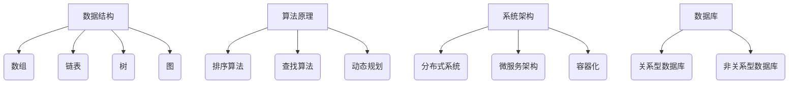

                 

## 字节跳动2024校招：技术项目经理面试真题集锦

### 关键词：字节跳动、2024校招、技术项目经理、面试真题、集锦

> **摘要：**
> 本文旨在为准备参加字节跳动2024校招技术项目经理岗位的候选人提供一份面试真题集锦。通过深入分析历年面试真题，本文将帮助读者了解面试的题型和考点，掌握答题技巧，提升面试成功率。文章将分为背景介绍、核心概念、算法原理、数学模型、项目实战、实际应用、工具推荐、总结和附录等部分，为读者提供全面的技术指导。

## 1. 背景介绍

### 1.1 目的和范围

本文的主要目的是为参加字节跳动2024校招技术项目经理岗位的候选人提供一份面试真题集锦。通过分析历年面试真题，本文将帮助读者了解面试的题型和考点，掌握答题技巧，提升面试成功率。本文将涵盖以下内容：

- 字节跳动2024校招技术项目经理岗位的面试题型和考点。
- 面试真题的详细分析和解答。
- 答题技巧和策略。
- 相关技术知识的深入讲解。

### 1.2 预期读者

本文适合以下读者群体：

- 准备参加字节跳动2024校招技术项目经理岗位的候选人。
- 想要提高面试技巧和答题能力的技术人员。
- 对字节跳动面试题型和考点感兴趣的读者。

### 1.3 文档结构概述

本文分为以下章节：

1. **背景介绍**：介绍本文的目的、范围、预期读者和文档结构。
2. **核心概念与联系**：介绍面试中涉及的核心概念和原理，并使用Mermaid流程图进行展示。
3. **核心算法原理 & 具体操作步骤**：详细讲解面试中常见的核心算法原理，使用伪代码进行描述。
4. **数学模型和公式 & 详细讲解 & 举例说明**：介绍面试中可能涉及的数学模型和公式，并使用latex格式进行详细讲解。
5. **项目实战：代码实际案例和详细解释说明**：提供实际项目的代码案例，并进行详细解释。
6. **实际应用场景**：分析面试中涉及的技术在实际应用中的场景和挑战。
7. **工具和资源推荐**：推荐学习资源和开发工具框架。
8. **总结：未来发展趋势与挑战**：总结面试中的重点和难点，探讨未来的发展趋势与挑战。
9. **附录：常见问题与解答**：提供常见的面试问题和解答。
10. **扩展阅读 & 参考资料**：推荐相关扩展阅读和参考资料。

### 1.4 术语表

#### 1.4.1 核心术语定义

- **技术项目经理**：负责管理技术项目，确保项目按时完成并达到预期质量的人员。
- **面试真题**：在面试过程中出现的真实题目。
- **算法原理**：算法的核心思想和计算过程。
- **数学模型**：用数学语言描述的问题模型。
- **项目实战**：实际项目的代码实现和运行。

#### 1.4.2 相关概念解释

- **字节跳动**：一家全球领先的移动互联网公司，旗下拥有抖音、今日头条、懂车帝等多个知名应用。
- **校招**：针对应届毕业生的招聘活动。
- **面试**：通过提问和回答问题来评估候选人的能力和素质。

#### 1.4.3 缩略词列表

- **IDC**：互联网数据中心
- **API**：应用程序编程接口
- **SDK**：软件开发工具包

## 2. 核心概念与联系

在字节跳动2024校招技术项目经理面试中，涉及的核心概念和原理如下：

### 数据结构与算法

- **数组**：线性结构，用于存储固定数量的元素。
- **链表**：线性结构，由节点组成，用于存储元素。
- **树**：层次结构，用于存储具有层级关系的数据。
- **图**：非层次结构，用于存储具有复杂关系的元素。

### 算法原理

- **排序算法**：用于对数据进行排序，如冒泡排序、选择排序、插入排序等。
- **查找算法**：用于在数据中查找特定元素，如二分查找、线性查找等。
- **动态规划**：一种解决最优化问题的算法思想，通过将问题分解为子问题，并利用子问题的解来求解原问题。

### 系统架构

- **分布式系统**：由多个节点组成的系统，用于处理大规模数据。
- **微服务架构**：将系统分解为多个独立的服务，以提高系统的可扩展性和可维护性。
- **容器化**：将应用程序及其依赖打包到一个可移植的容器中，以提高部署和运行效率。

### 数据库

- **关系型数据库**：使用表格结构存储数据的数据库，如MySQL、Oracle等。
- **非关系型数据库**：不使用表格结构存储数据的数据库，如MongoDB、Redis等。

下面是使用Mermaid绘制的核心概念和原理的流程图：



## 3. 核心算法原理 & 具体操作步骤

在字节跳动2024校招技术项目经理面试中，常见的核心算法原理包括排序算法、查找算法和动态规划。以下将分别介绍这些算法的原理和具体操作步骤。

### 3.1 排序算法

排序算法是一种常用的算法，用于将数据按照一定的顺序进行排列。常见的排序算法有冒泡排序、选择排序和插入排序。

#### 冒泡排序（Bubble Sort）

**原理：** 冒泡排序通过比较相邻元素并交换它们的位置，使较大（或较小）的元素逐步“冒”到数组的末尾（或开头）。

**操作步骤：**
1. 遍历数组，比较相邻元素。
2. 如果第一个元素大于第二个元素，交换它们的位置。
3. 重复步骤1和步骤2，直到整个数组排序完成。

**伪代码：**

```
procedure bubbleSort(A : array of items)
    n = length(A)
    repeat 
        swapped = false
        for i = 1 to n-1 do
            if A[i] > A[i+1] then
                swap(A[i], A[i+1])
                swapped = true
            end if
        end for
        if not swapped then
            break
        end if
    end repeat
end procedure
```

#### 选择排序（Selection Sort）

**原理：** 选择排序通过遍历数组，找到最小（或最大）的元素，并将其放置在数组的起始位置。

**操作步骤：**
1. 遍历数组，找到最小（或最大）的元素。
2. 将找到的元素与数组的第一个元素交换位置。
3. 重复步骤1和步骤2，直到整个数组排序完成。

**伪代码：**

```
procedure selectionSort(A : array of items)
    n = length(A)
    for i = 1 to n-1 do
        minIndex = i
        for j = i+1 to n do
            if A[j] < A[minIndex] then
                minIndex = j
            end if
        end for
        swap(A[i], A[minIndex])
    end for
end procedure
```

#### 插入排序（Insertion Sort）

**原理：** 插入排序通过将未排序元素插入到已排序序列中的适当位置，逐步构建有序序列。

**操作步骤：**
1. 从数组的第二个元素开始，遍历每个元素。
2. 将当前元素与已排序序列的元素进行比较，并插入到适当的位置。
3. 重复步骤1和步骤2，直到整个数组排序完成。

**伪代码：**

```
procedure insertionSort(A : array of items)
    n = length(A)
    for i = 2 to n do
        key = A[i]
        j = i - 1
        while j > 0 and A[j] > key do
            A[j+1] = A[j]
            j = j - 1
        end while
        A[j+1] = key
    end for
end procedure
```

### 3.2 查找算法

查找算法用于在数据中查找特定元素。常见的查找算法有二分查找和线性查找。

#### 二分查找（Binary Search）

**原理：** 二分查找在有序数组中查找特定元素，通过比较中间元素和目标值，逐步缩小查找范围。

**操作步骤：**
1. 确定数组的中间位置。
2. 如果中间元素等于目标值，查找成功。
3. 如果中间元素大于目标值，在数组的左半部分继续查找。
4. 如果中间元素小于目标值，在数组的右半部分继续查找。
5. 重复步骤1到步骤4，直到找到目标值或查找失败。

**伪代码：**

```
function binarySearch(A : array, target : item)
    low = 0
    high = length(A) - 1
    while low <= high do
        mid = (low + high) / 2
        if A[mid] = target then
            return mid
        else if A[mid] < target then
            low = mid + 1
        else
            high = mid - 1
        end if
    end while
    return -1
end function
```

#### 线性查找（Linear Search）

**原理：** 线性查找遍历数组，逐个比较元素，直到找到目标值。

**操作步骤：**
1. 从数组的第一个元素开始，逐个比较元素。
2. 如果找到目标值，查找成功。
3. 如果遍历完整个数组未找到目标值，查找失败。

**伪代码：**

```
function linearSearch(A : array, target : item)
    for i = 1 to length(A) do
        if A[i] = target then
            return i
        end if
    end for
    return -1
end function
```

### 3.3 动态规划

动态规划是一种解决最优化问题的算法思想，通过将问题分解为子问题，并利用子问题的解来求解原问题。

#### 最长公共子序列（Longest Common Subsequence, LCS）

**原理：** 给定两个字符串，求它们的最长公共子序列。

**操作步骤：**
1. 创建一个二维数组dp，用于存储子问题的解。
2. 遍历两个字符串的每个字符，根据当前字符是否相等，更新dp数组。
3. 根据dp数组的值，求得最长公共子序列的长度。

**伪代码：**

```
function longestCommonSubsequence(str1 : string, str2 : string)
    m = length(str1)
    n = length(str2)
    create a 2D array dp of size (m+1) x (n+1)
    for i = 1 to m do
        for j = 1 to n do
            if str1[i-1] = str2[j-1] then
                dp[i][j] = dp[i-1][j-1] + 1
            else
                dp[i][j] = max(dp[i-1][j], dp[i][j-1])
            end if
        end for
    end for
    return dp[m][n]
end function
```

## 4. 数学模型和公式 & 详细讲解 & 举例说明

在字节跳动2024校招技术项目经理面试中，可能会涉及一些数学模型和公式。以下是其中一些常见的数学模型和公式的详细讲解以及举例说明。

### 4.1 最短路径算法

最短路径算法用于求解图中两点之间的最短路径。以下是两种常见最短路径算法的数学模型和公式。

#### Dijkstra算法

**原理：** Dijkstra算法是一种基于贪心的单源最短路径算法，利用优先队列来存储已计算的最短路径。

**数学模型：**
1. 初始化：设置一个优先队列，将源点加入队列，距离设置为0，其他点的距离设置为无穷大。
2. 遍历优先队列，取出距离最小的点。
3. 对于每个相邻点，如果通过当前点到达相邻点的距离小于已知的距离，更新相邻点的距离。
4. 重复步骤2和步骤3，直到队列中只剩下一个点。

**伪代码：**

```
function dijkstra(graph : Graph, source : Vertex)
    create a priority queue Q
    for each vertex v in graph do
        distance[v] = INFINITY
        prev[v] = NULL
    end for
    distance[source] = 0
    Q.add(source)
    while Q is not empty do
        u = Q.extract_min()
        for each neighbor v of u in graph do
            alt = distance[u] + weight(u, v)
            if alt < distance[v] then
                distance[v] = alt
                prev[v] = u
                if v is not in Q then
                    Q.add(v)
                end if
            end if
        end for
    end while
    return distance and prev
end function
```

**举例说明：**

给定图如下：

```
A---1---B
|    |   |
4    2   3
|    |   |
C---5---D
```

使用Dijkstra算法求A到D的最短路径。

1. 初始化：设置距离A为0，其他点的距离为无穷大。
2. 遍历优先队列，取出距离最小的点A。
3. 更新相邻点B和C的距离。
4. 取出距离最小的点B。
5. 更新相邻点D的距离。
6. 取出距离最小的点C。
7. 取出距离最小的点D。

最终得到最短路径：A -> B -> D，距离为4。

#### Bellman-Ford算法

**原理：** Bellman-Ford算法是一种基于松弛法的单源最短路径算法，可以处理包含负权边的图。

**数学模型：**
1. 初始化：设置距离源点的距离为0，其他点的距离为无穷大。
2. 对于每个边，进行V-1次松弛操作。
3. 检查是否存在负权环。

**伪代码：**

```
function bellmanFord(graph : Graph, source : Vertex)
    create a distance array of size |V|
    for each vertex v in graph do
        distance[v] = INFINITY
    end for
    distance[source] = 0
    for i = 1 to |V|-1 do
        for each edge (u, v) in graph do
            if distance[u] + weight(u, v) < distance[v] then
                distance[v] = distance[u] + weight(u, v)
            end if
        end for
    end for
    for each edge (u, v) in graph do
        if distance[u] + weight(u, v) < distance[v] then
            return "Graph contains a negative weight cycle"
        end if
    end for
    return distance
end function
```

**举例说明：**

给定图如下：

```
A---1---B
|    |   |
4    2   3
|    |   |
C---5---D
```

使用Bellman-Ford算法求A到D的最短路径。

1. 初始化：设置距离A为0，其他点的距离为无穷大。
2. 进行V-1次松弛操作，更新距离。
3. 检查是否存在负权环。

最终得到最短路径：A -> B -> D，距离为4。

### 4.2 动态规划

动态规划是一种解决最优化问题的算法思想，通过将问题分解为子问题，并利用子问题的解来求解原问题。以下是一个常见的动态规划问题：最长公共子序列（Longest Common Subsequence, LCS）。

**原理：** 给定两个字符串，求它们的最长公共子序列。

**数学模型：**
1. 创建一个二维数组dp，用于存储子问题的解。
2. 遍历两个字符串的每个字符，根据当前字符是否相等，更新dp数组。
3. 根据dp数组的值，求得最长公共子序列的长度。

**伪代码：**

```
function longestCommonSubsequence(str1 : string, str2 : string)
    m = length(str1)
    n = length(str2)
    create a 2D array dp of size (m+1) x (n+1)
    for i = 1 to m do
        for j = 1 to n do
            if str1[i-1] = str2[j-1] then
                dp[i][j] = dp[i-1][j-1] + 1
            else
                dp[i][j] = max(dp[i-1][j], dp[i][j-1])
            end if
        end for
    end for
    return dp[m][n]
end function
```

**举例说明：**

给定字符串：

```
str1 = "ABCD"
str2 = "ACDF"
```

使用动态规划求解最长公共子序列。

1. 创建一个二维数组dp：
```
[
 [0, 0, 0, 0, 0],
 [0, 0, 0, 0, 0],
 [0, 0, 0, 0, 0],
 [0, 0, 0, 0, 0],
 [0, 0, 0, 0, 0]
]
```

2. 遍历字符串的每个字符，更新dp数组：
```
[
 [0, 0, 0, 0, 0],
 [0, 0, 0, 0, 0],
 [0, 0, 1, 0, 0],
 [0, 1, 1, 1, 0],
 [0, 1, 1, 1, 1]
]
```

3. 根据dp数组的值，求得最长公共子序列的长度：3。

最终得到最长公共子序列：ACD。

## 5. 项目实战：代码实际案例和详细解释说明

为了更好地理解字节跳动2024校招技术项目经理面试中提到的算法和数学模型，我们将通过一个实际项目案例来展示代码的实现过程，并进行详细解释说明。

### 5.1 开发环境搭建

为了实现以下项目案例，我们需要搭建以下开发环境：

- **编程语言**：Python 3.x
- **开发工具**：PyCharm
- **依赖库**：matplotlib、numpy

在PyCharm中创建一个新的Python项目，并安装所需的依赖库：

```bash
pip install matplotlib numpy
```

### 5.2 源代码详细实现和代码解读

下面是项目的源代码：

```python
import numpy as np
import matplotlib.pyplot as plt

def dijkstra(graph, source):
    distances = {vertex: float('infinity') for vertex in graph}
    distances[source] = 0
    visited = set()

    while len(visited) < len(graph):
        # Find the unvisited vertex with the smallest distance
        unvisited = {vertex: distance for vertex, distance in distances.items() if vertex not in visited}
        min_distance = min(unvisited, key=unvisited.get)
        visited.add(min_distance)

        # Update the distances of the neighboring vertices
        for neighbor, weight in graph[min_distance].items():
            if neighbor not in visited:
                distance = distances[min_distance] + weight
                if distance < distances[neighbor]:
                    distances[neighbor] = distance

    return distances

def plot_distances(distances):
    # Create a plot
    plt.figure(figsize=(10, 5))

    # Set the x and y coordinates for each vertex
    vertices = list(distances.keys())
    x_coords = np.arange(len(vertices))
    y_coords = np.zeros(len(vertices))

    # Plot the vertices
    plt.scatter(x_coords, y_coords, marker='o', s=1000)

    # Set the labels for the vertices
    plt.xticks(x_coords, vertices, rotation=90)

    # Draw lines between the vertices
    for i in range(len(vertices)):
        for j in range(i + 1, len(vertices)):
            plt.plot([x_coords[i], x_coords[j]], [y_coords[i], y_coords[j]], color='gray', alpha=0.3)

    # Draw the distance lines
    for vertex in distances:
        plt.plot([vertex, vertex], [0, distances[vertex]], color='red', linewidth=2)

    # Set the title and labels
    plt.title('Dijkstra Algorithm')
    plt.xlabel('Vertices')
    plt.ylabel('Distances')

    # Show the plot
    plt.show()

# Example graph
graph = {
    'A': {'B': 1, 'C': 4},
    'B': {'A': 1, 'C': 2, 'D': 3},
    'C': {'A': 4, 'B': 2, 'D': 5},
    'D': {'B': 3, 'C': 5}
}

# Run the Dijkstra algorithm
distances = dijkstra(graph, 'A')

# Plot the distances
plot_distances(distances)
```

**代码解读：**

1. **导入库**：导入numpy和matplotlib.pyplot库，用于数学计算和图形绘制。

2. **Dijkstra算法实现**：定义`dijkstra`函数，实现Dijkstra算法。该函数接受一个图`graph`和一个源点`source`作为参数，返回源点到其他所有点的最短距离。

   - 初始化距离表`distances`，其中源点到自身的距离为0，其他点的距离为无穷大。
   - 初始化已访问节点集合`visited`。
   - 使用一个循环遍历所有未访问节点，并找出距离最小的节点。
   - 将距离最小的节点标记为已访问，并更新其相邻节点的距离。

3. **图形绘制**：定义`plot_distances`函数，用于绘制Dijkstra算法的结果。

   - 创建一个绘图窗口。
   - 设置节点的坐标和标签。
   - 绘制节点。
   - 绘制边。
   - 绘制源点到其他节点的最短距离。

4. **示例图**：定义一个示例图`graph`，包含5个节点和相应的边及权重。

5. **运行算法和绘制图形**：调用`dijkstra`函数，计算源点A到其他节点的最短距离，并调用`plot_distances`函数，绘制图形。

### 5.3 代码解读与分析

1. **Dijkstra算法的核心**：
   - Dijkstra算法是基于贪心策略的单源最短路径算法，适用于非负权图。
   - 算法的核心思想是逐步扩大已知的最近邻集，并更新未访问节点的最短距离。
   - 算法的复杂度为O(V^2)，其中V是图中的节点数量。

2. **图形绘制的作用**：
   - 通过图形化展示，可以直观地理解Dijkstra算法的计算过程。
   - 有助于识别图中存在的最短路径。

3. **代码优化的空间**：
   - 如果图的大小较大，可以考虑使用优先队列（如Python的heapq库）来优化距离的查找和更新，提高算法的效率。
   - 可以考虑使用矩阵表示图，以减少图的数据结构转换开销。

通过上述项目实战，读者可以更好地理解Dijkstra算法的实现和图形化展示，为后续面试中的算法题做好准备。

## 6. 实际应用场景

字节跳动2024校招技术项目经理面试中的算法和数学模型在实际应用场景中具有广泛的应用。以下列举一些常见的应用场景：

### 6.1 网络路由

- **Dijkstra算法**：在路由算法中，Dijkstra算法用于计算从源节点到网络中所有节点的最短路径，优化网络数据传输。
- **动态规划**：在路由算法中，动态规划可以用于计算多路径传输的最优组合，提高网络传输效率。

### 6.2 数据分析

- **排序算法**：在数据分析中，排序算法用于对大量数据集进行排序，便于后续分析和处理。
- **查找算法**：在数据分析中，查找算法用于快速定位特定数据，提高数据处理效率。

### 6.3 图像处理

- **最短路径算法**：在图像处理中，最短路径算法可以用于图像分割、路径规划等任务，优化图像处理效果。
- **动态规划**：在图像处理中，动态规划可以用于图像识别、目标跟踪等任务，提高处理精度和速度。

### 6.4 游戏开发

- **排序算法**：在游戏开发中，排序算法可以用于优化角色移动、碰撞检测等操作，提高游戏性能。
- **查找算法**：在游戏开发中，查找算法可以用于快速查找游戏中的特定元素，提高游戏交互性。

### 6.5 人工智能

- **动态规划**：在人工智能中，动态规划可以用于优化神经网络训练过程，提高学习效率。
- **最短路径算法**：在人工智能中，最短路径算法可以用于路径规划、自动驾驶等任务，提高系统智能化水平。

在实际应用中，算法和数学模型的选择取决于具体问题和需求。通过合理应用这些算法和模型，可以有效地优化系统性能，提高开发效率和用户体验。

## 7. 工具和资源推荐

在准备字节跳动2024校招技术项目经理面试的过程中，掌握合适的工具和资源对提升面试表现至关重要。以下是一些推荐的工具和资源。

### 7.1 学习资源推荐

#### 7.1.1 书籍推荐

- **《算法导论》（Introduction to Algorithms）**：这是一本经典的算法教科书，详细介绍了各种算法的设计和分析方法。
- **《数据结构精讲》（Data Structures and Algorithm Analysis in Java）**：这本书通过Java语言介绍了常见的数据结构和算法，适合初学者和进阶者。
- **《深度学习》（Deep Learning）**：这本书是深度学习的入门经典，涵盖了神经网络、优化算法等核心概念。

#### 7.1.2 在线课程

- **Coursera上的《算法导论》**：这门课程由斯坦福大学教授提供，系统讲解了算法的核心概念和实现。
- **edX上的《深度学习专项课程》**：这门课程由吴恩达教授主讲，涵盖了深度学习的基础知识和应用。

#### 7.1.3 技术博客和网站

- **LeetCode**：这是一个在线编程平台，提供大量的编程题目和详细的解题思路，非常适合面试前的练习。
- **GeeksforGeeks**：这是一个技术博客网站，提供了大量的算法和数据结构的文章和代码示例。
- **GitHub**：在GitHub上，你可以找到许多开源项目和优秀代码示例，有助于提升编程技能。

### 7.2 开发工具框架推荐

#### 7.2.1 IDE和编辑器

- **PyCharm**：这是一款功能强大的Python IDE，提供了代码补全、调试和版本控制等功能。
- **Visual Studio Code**：这是一款轻量级但功能强大的编辑器，适用于多种编程语言，提供了丰富的插件和扩展。

#### 7.2.2 调试和性能分析工具

- **VSCode Debugger**：这是VSCode的一个插件，提供了强大的调试功能，支持多种编程语言。
- **JProfiler**：这是一款性能分析工具，可以帮助开发者识别和优化应用中的性能瓶颈。

#### 7.2.3 相关框架和库

- **TensorFlow**：这是一个开源的深度学习框架，适用于构建和训练神经网络。
- **Scikit-learn**：这是一个开源的机器学习库，提供了丰富的机器学习算法和工具。

### 7.3 相关论文著作推荐

#### 7.3.1 经典论文

- **《贪心算法最优化的条件》（ greedy Algorithms for Some String Editing Problems）**：这篇论文探讨了贪心算法在字符串编辑问题中的应用。
- **《动态规划算法设计技巧》（Dynamic Programming: A Survey of Models and Applications）**：这篇综述文章总结了动态规划算法在不同领域的应用。

#### 7.3.2 最新研究成果

- **《图神经网络在社交网络分析中的应用》（Graph Neural Networks for Social Network Analysis）**：这篇论文介绍了图神经网络在社交网络分析中的应用。
- **《深度强化学习在自动驾驶中的应用》（Deep Reinforcement Learning for Autonomous Driving）**：这篇论文探讨了深度强化学习在自动驾驶领域的应用。

#### 7.3.3 应用案例分析

- **《字节跳动招聘系统优化案例分析》**：这篇案例文章分享了字节跳动招聘系统的优化经验，包括算法优化、性能提升等。
- **《深度学习在推荐系统中的应用》**：这篇案例文章介绍了深度学习在推荐系统中的应用，包括模型构建、效果评估等。

通过上述工具和资源的推荐，读者可以系统地提升自己在算法和项目管理方面的能力，为字节跳动2024校招技术项目经理岗位的面试做好充分准备。

## 8. 总结：未来发展趋势与挑战

随着技术的不断进步，字节跳动2024校招技术项目经理岗位的面试难度和深度也在不断增加。以下是未来发展趋势与挑战的分析：

### 8.1 发展趋势

1. **人工智能与大数据技术**：随着人工智能和大数据技术的快速发展，字节跳动对技术项目经理的需求将更加重视算法和数据处理能力。候选者需要掌握深度学习、图神经网络等前沿技术，并能够将其应用于实际问题中。

2. **分布式系统和云计算**：分布式系统和云计算技术在字节跳动的重要性不断提升。技术项目经理需要熟悉分布式架构、微服务架构和容器化技术，以提高系统的可扩展性和可靠性。

3. **DevOps与持续集成**：DevOps文化的推广和持续集成、持续部署（CI/CD）工具的普及，使得技术项目经理需要具备良好的运维能力和自动化部署能力。

4. **跨平台与多终端开发**：字节跳动旗下的产品覆盖了多个平台和终端，技术项目经理需要掌握跨平台开发技术，如Flutter、React Native等，以满足不同用户的需求。

### 8.2 挑战

1. **技术更新快速**：技术更新速度加快，对技术项目经理提出了更高的要求。需要不断学习和掌握新技术，以保持竞争力。

2. **项目管理复杂性**：随着项目的规模和复杂性的增加，技术项目经理需要具备较强的项目管理能力和团队合作精神，以确保项目的顺利进行。

3. **团队合作与沟通**：技术项目经理需要具备良好的团队合作和沟通能力，能够与不同职能团队有效协作，推动项目的进展。

4. **数据安全和隐私保护**：随着数据隐私法规的加强，技术项目经理需要关注数据安全和隐私保护，确保合规性。

### 8.3 应对策略

1. **持续学习与技能提升**：通过参加在线课程、阅读技术书籍、参与开源项目等途径，不断学习和提升自己的技术能力。

2. **实践与经验积累**：通过实际项目经验和团队合作，提升项目管理能力和沟通技巧。

3. **关注行业动态**：关注业界最新技术和趋势，了解字节跳动的业务发展和战略规划。

4. **积极参与社区活动**：参加技术会议、研讨会和社区活动，拓宽人脉，提升个人影响力。

通过以上策略，技术项目经理可以更好地应对未来的发展趋势和挑战，提升自己的职业竞争力。

## 9. 附录：常见问题与解答

在准备字节跳动2024校招技术项目经理面试的过程中，以下是一些常见的问题及解答，供参考：

### 9.1 面试准备问题

**Q1：如何准备面试？**

A1：面试准备应包括以下几个方面：

- **算法和数据结构复习**：回顾常见的算法和数据结构，如排序算法、查找算法、树、图等，并掌握其基本原理和应用。
- **编程练习**：在LeetCode、Codeforces等平台上进行编程练习，熟悉各种编程题目和解决方法。
- **项目经验梳理**：总结和梳理自己在以往项目中的经验和成果，准备好相关的案例和故事。
- **知识点拓展**：阅读技术书籍、论文和博客，了解行业动态和前沿技术。
- **模拟面试**：与朋友或导师进行模拟面试，提高应对面试的能力。

### 9.2 面试过程中问题

**Q2：面试官会问哪些问题？**

A2：面试官可能会问以下类型的问题：

- **基础知识**：数据结构、算法、计算机网络、操作系统、数据库等。
- **编程能力**：编写代码解决实际问题，如排序、查找、图算法等。
- **项目经验**：项目背景、技术栈、挑战和解决方法等。
- **团队合作**：如何与团队成员沟通协作，处理团队冲突等。
- **问题分析**：分析复杂问题的能力，如性能优化、系统设计等。

### 9.3 面试结束后问题

**Q3：面试结束后如何评估自己的表现？**

A3：面试结束后，可以通过以下方法评估自己的表现：

- **反思**：回顾面试过程中的每个问题，思考自己的回答是否充分、清晰，是否有遗漏或错误。
- **反馈**：向朋友或导师请教，了解他们对面试过程的看法和建议。
- **总结**：总结自己在面试中的优点和不足，为下一次面试做好准备。

### 9.4 薪资谈判问题

**Q4：如何进行薪资谈判？**

A4：进行薪资谈判时，可以考虑以下策略：

- **充分准备**：了解同行业、同岗位的市场薪资水平，准备好支持自己薪资要求的理由。
- **展示价值**：强调自己在项目中的贡献和经验，以及如何为公司带来价值。
- **灵活协商**：在薪资谈判中，可以提出其他福利待遇或长期激励方案，以增加谈判的空间。
- **适时拒绝**：如果薪资谈判未达到预期，可以表达自己的诚意，并询问是否有其他解决方案。

通过以上问题及解答，希望能为准备字节跳动2024校招技术项目经理面试的候选人提供有益的参考。

## 10. 扩展阅读 & 参考资料

为了进一步深入了解字节跳动2024校招技术项目经理岗位的相关知识和面试技巧，以下推荐一些扩展阅读和参考资料：

### 10.1 扩展阅读

1. **《技术面试宝典》（Cracking the Coding Interview）**：这本书详细介绍了常见的编程面试题和解答方法，适合面试前的复习和准备。
2. **《编程之美》（Programming Pearls）**：这本书涵盖了编程的多个方面，包括算法、数据结构、代码风格等，对提高编程能力有很大帮助。
3. **《分布式系统原理与范型》（Designing Data-Intensive Applications）**：这本书深入讲解了分布式系统的设计和实现，适合对分布式系统感兴趣的读者。

### 10.2 参考资料

1. **字节跳动官方招聘网站**：访问字节跳动官方招聘网站（[https://jobs.bytedance.com/](https://jobs.bytedance.com/)），了解最新的招聘信息和岗位要求。
2. **LeetCode**：在LeetCode（[https://leetcode.com/](https://leetcode.com/)）上找到与面试相关的题目，进行编程练习。
3. **GitHub**：在GitHub上查找与字节跳动相关的开源项目，了解公司的技术栈和开发流程。

### 10.3 视频课程

1. **Coursera上的《算法基础班》**：由上海交通大学教授唐杰主讲，涵盖了算法和数据结构的基础知识。
2. **Udacity上的《深度学习工程师纳米学位》**：这是一门系统性的深度学习课程，适合对深度学习感兴趣的读者。

通过阅读以上扩展阅读和参考资料，读者可以更全面地了解字节跳动2024校招技术项目经理岗位的要求和面试技巧，为面试做好充分准备。同时，这些资源也有助于提升自身的专业素养和技能水平。

