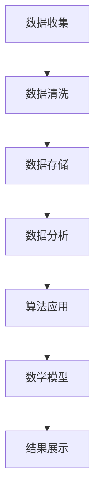

                 

# 2024字节跳动校招：技术战略分析师面试题解析

> 关键词：字节跳动，校招，技术战略分析师，面试题解析，技术原理，算法，应用场景

> 摘要：本文将针对2024年字节跳动校招技术战略分析师岗位的面试题进行详细解析。通过分析题目背景、核心概念、算法原理、数学模型、实战案例以及实际应用场景，帮助读者全面掌握技术战略分析师所需的知识和技能。

## 1. 背景介绍

### 1.1 目的和范围

本文旨在为准备参加2024年字节跳动校招技术战略分析师岗位的求职者提供一份详细的面试题解析。通过对面试题的深入分析，帮助读者理解技术战略分析师所需的核心知识和技能，为成功通过面试做好准备。

### 1.2 预期读者

本文适用于以下读者群体：

- 准备参加字节跳动校招的技术战略分析师岗位求职者
- 对技术战略分析感兴趣的计算机相关专业学生
- 想要提升技术战略分析能力的IT从业人员

### 1.3 文档结构概述

本文分为以下几个部分：

1. 背景介绍：介绍本文的目的、预期读者和文档结构。
2. 核心概念与联系：阐述技术战略分析师所需掌握的核心概念和原理，并使用Mermaid流程图进行展示。
3. 核心算法原理 & 具体操作步骤：详细讲解技术战略分析中常用的算法原理和具体操作步骤，并使用伪代码进行阐述。
4. 数学模型和公式 & 详细讲解 & 举例说明：介绍技术战略分析中涉及到的数学模型和公式，并进行详细讲解和举例说明。
5. 项目实战：提供实际的代码案例和详细解释说明，帮助读者理解技术战略分析在实际项目中的应用。
6. 实际应用场景：分析技术战略分析在实际场景中的应用，展示其价值。
7. 工具和资源推荐：推荐学习资源和开发工具，帮助读者提升技术战略分析能力。
8. 总结：总结本文内容，展望未来发展趋势与挑战。
9. 附录：常见问题与解答，为读者提供更多参考。
10. 扩展阅读 & 参考资料：提供扩展阅读材料和参考资料，供读者深入学习。

### 1.4 术语表

#### 1.4.1 核心术语定义

- 技术战略分析师：负责分析企业技术需求和竞争态势，为企业制定技术发展策略的专业人士。
- 字节跳动：一家知名的技术公司，提供短视频、直播、社交媒体等产品和服务。
- 校招：指针对在校大学生的招聘活动。
- 面试题解析：对字节跳动校招技术战略分析师岗位面试题进行详细分析，帮助读者掌握解题方法和思路。

#### 1.4.2 相关概念解释

- 技术战略：企业根据市场需求和自身优势，制定的技术发展目标和规划。
- 数据分析：通过对海量数据进行分析，提取有价值的信息和规律。
- 算法：解决特定问题的计算方法，具有明确的步骤和规则。

#### 1.4.3 缩略词列表

- 字节跳动（ByteDance）
- 技术战略分析师（Technical Strategy Analyst）
- 校招（Campus Recruitment）
- 面试题（Interview Questions）

## 2. 核心概念与联系

在技术战略分析过程中，我们需要掌握以下核心概念和原理：

### 2.1 数据分析

数据分析是技术战略分析的重要基础。通过对海量数据进行分析，我们可以了解用户需求、市场趋势和竞争态势。以下是数据分析的核心概念：

- 数据收集：通过采集各种数据源，获取所需数据。
- 数据清洗：对数据进行处理和清洗，去除重复、错误和无用的数据。
- 数据存储：将清洗后的数据存储到数据库或数据仓库中。
- 数据可视化：通过图表和图形，将数据分析结果呈现出来，便于理解和决策。

### 2.2 算法

算法在技术战略分析中发挥着重要作用。常用的算法包括：

- 排序算法：用于对数据进行排序，常见的排序算法有冒泡排序、快速排序和归并排序等。
- 搜索算法：用于在数据中查找特定元素，常见的搜索算法有二分查找、深度优先搜索和广度优先搜索等。
- 聚类算法：用于将相似的数据分组，常见的聚类算法有K均值聚类、层次聚类和DBSCAN等。

### 2.3 数学模型

数学模型是技术战略分析的重要工具。以下是一些常用的数学模型：

- 线性回归：用于分析变量之间的关系，预测一个变量基于其他变量的取值。
- 决策树：用于分类或回归问题，通过树形结构对数据进行分割。
- 支持向量机（SVM）：用于分类问题，通过最大化分类边界来划分不同类别。

### 2.4 Mermaid 流程图

为了更直观地展示技术战略分析师的工作流程，我们可以使用Mermaid流程图进行描述。以下是一个示例：



## 3. 核心算法原理 & 具体操作步骤

在技术战略分析过程中，常用的算法包括排序算法、搜索算法和聚类算法。以下将分别介绍这些算法的原理和具体操作步骤。

### 3.1 排序算法

排序算法用于对数据进行排序，常见的排序算法有冒泡排序、快速排序和归并排序等。

#### 3.1.1 冒泡排序

冒泡排序的基本思想是通过多次遍历待排序的序列，比较相邻元素的大小，若逆序则交换它们的位置。

```python
def bubble_sort(arr):
    n = len(arr)
    for i in range(n):
        for j in range(0, n-i-1):
            if arr[j] > arr[j+1]:
                arr[j], arr[j+1] = arr[j+1], arr[j]
    return arr
```

#### 3.1.2 快速排序

快速排序的基本思想是通过一趟排序将待排序的序列分为两个子序列，其中一个子序列的所有元素都比另一个子序列的所有元素小，然后递归地对两个子序列进行排序。

```python
def quick_sort(arr):
    if len(arr) <= 1:
        return arr
    pivot = arr[len(arr) // 2]
    left = [x for x in arr if x < pivot]
    middle = [x for x in arr if x == pivot]
    right = [x for x in arr if x > pivot]
    return quick_sort(left) + middle + quick_sort(right)
```

#### 3.1.3 归并排序

归并排序的基本思想是将待排序的序列分为若干个子序列，每个子序列都是有序的，然后依次将这些子序列合并成一个有序序列。

```python
def merge_sort(arr):
    if len(arr) <= 1:
        return arr
    mid = len(arr) // 2
    left = merge_sort(arr[:mid])
    right = merge_sort(arr[mid:])
    return merge(left, right)

def merge(left, right):
    result = []
    i = j = 0
    while i < len(left) and j < len(right):
        if left[i] < right[j]:
            result.append(left[i])
            i += 1
        else:
            result.append(right[j])
            j += 1
    result.extend(left[i:])
    result.extend(right[j:])
    return result
```

### 3.2 搜索算法

搜索算法用于在数据中查找特定元素，常见的搜索算法有二分查找、深度优先搜索和广度优先搜索等。

#### 3.2.1 二分查找

二分查找的基本思想是在有序序列中，通过不断比较中间元素和目标值，逐步缩小查找范围，直到找到目标元素或确定其不存在。

```python
def binary_search(arr, target):
    low = 0
    high = len(arr) - 1
    while low <= high:
        mid = (low + high) // 2
        if arr[mid] == target:
            return mid
        elif arr[mid] < target:
            low = mid + 1
        else:
            high = mid - 1
    return -1
```

#### 3.2.2 深度优先搜索

深度优先搜索的基本思想是沿着某一方向一直搜索到最深处，再回溯到上一个节点，继续搜索其他方向。

```python
def dfs(graph, start, target):
    stack = [(start, [start])]
    while stack:
        (vertex, path) = stack.pop()
        for next in graph[vertex]:
            if next not in path:
                if next == target:
                    return path + [next]
                else:
                    stack.append((next, path + [next]))
    return None
```

#### 3.2.3 广度优先搜索

广度优先搜索的基本思想是先搜索到当前层的所有节点，再搜索下一层。

```python
def bfs(graph, start, target):
    queue = [(start, [start])]
    while queue:
        (vertex, path) = queue.pop(0)
        for next in graph[vertex]:
            if next not in path:
                if next == target:
                    return path + [next]
                else:
                    queue.append((next, path + [next]))
    return None
```

### 3.3 聚类算法

聚类算法用于将相似的数据分组，常见的聚类算法有K均值聚类、层次聚类和DBSCAN等。

#### 3.3.1 K均值聚类

K均值聚类的基本思想是将数据分为K个簇，每个簇的中心点代表该簇的特点，然后迭代更新簇中心和数据点的归属关系，直到收敛。

```python
from sklearn.cluster import KMeans

def kmeans_clustering(data, k):
    kmeans = KMeans(n_clusters=k, random_state=0)
    kmeans.fit(data)
    return kmeans.labels_
```

#### 3.3.2 层次聚类

层次聚类的基本思想是将数据逐步合并成更大的簇，直到所有数据属于一个簇，或者满足某个合并标准。

```python
from sklearn.cluster import AgglomerativeClustering

def hierarchical_clustering(data, n_clusters):
    clustering = AgglomerativeClustering(n_clusters=n_clusters)
    clustering.fit(data)
    return clustering.labels_
```

#### 3.3.3 DBSCAN

DBSCAN（Density-Based Spatial Clustering of Applications with Noise）是一种基于密度的聚类算法，它将具有足够高密度的区域划分为簇，并能够识别出噪声点。

```python
from sklearn.cluster import DBSCAN

def dbscan_clustering(data, eps, min_samples):
    clustering = DBSCAN(eps=eps, min_samples=min_samples)
    clustering.fit(data)
    return clustering.labels_
```

## 4. 数学模型和公式 & 详细讲解 & 举例说明

在技术战略分析中，常用的数学模型和公式包括线性回归、决策树和支持向量机等。以下将分别介绍这些模型的基本原理和具体应用。

### 4.1 线性回归

线性回归是一种用于分析变量之间线性关系的统计模型，其公式为：

$$
y = \beta_0 + \beta_1 \cdot x + \epsilon
$$

其中，$y$ 是因变量，$x$ 是自变量，$\beta_0$ 和 $\beta_1$ 分别是截距和斜率，$\epsilon$ 是误差项。

#### 4.1.1 模型原理

线性回归通过拟合一条直线，将自变量和因变量之间的关系表示为线性关系。斜率 $\beta_1$ 表示自变量对因变量的影响程度，截距 $\beta_0$ 表示当自变量为0时，因变量的取值。

#### 4.1.2 模型求解

线性回归模型的求解方法包括最小二乘法和梯度下降法等。最小二乘法的求解公式为：

$$
\beta_0 = \frac{\sum_{i=1}^{n} y_i - \beta_1 \cdot \sum_{i=1}^{n} x_i}{n}
$$

$$
\beta_1 = \frac{\sum_{i=1}^{n} (y_i - \beta_0 - \beta_1 \cdot x_i) \cdot x_i}{\sum_{i=1}^{n} x_i^2}
$$

#### 4.1.3 举例说明

假设我们有一组数据，如下所示：

| x | y |
| --- | --- |
| 1 | 2 |
| 2 | 4 |
| 3 | 5 |
| 4 | 6 |

我们要使用线性回归模型分析 $y$ 与 $x$ 之间的关系。

首先，计算 $x$ 和 $y$ 的平均值：

$$
\bar{x} = \frac{1 + 2 + 3 + 4}{4} = 2.5
$$

$$
\bar{y} = \frac{2 + 4 + 5 + 6}{4} = 4.5
$$

然后，计算斜率 $\beta_1$：

$$
\beta_1 = \frac{\sum_{i=1}^{4} (y_i - \bar{y}) \cdot (x_i - \bar{x})}{\sum_{i=1}^{4} (x_i - \bar{x})^2}
$$

$$
\beta_1 = \frac{(2 - 4.5) \cdot (1 - 2.5) + (4 - 4.5) \cdot (2 - 2.5) + (5 - 4.5) \cdot (3 - 2.5) + (6 - 4.5) \cdot (4 - 2.5)}{(1 - 2.5)^2 + (2 - 2.5)^2 + (3 - 2.5)^2 + (4 - 2.5)^2}
$$

$$
\beta_1 = \frac{(-2.5) \cdot (-1.5) + (-0.5) \cdot (-0.5) + (0.5) \cdot (0.5) + (1.5) \cdot (1.5)}{(-1.5)^2 + (-0.5)^2 + (0.5)^2 + (1.5)^2}
$$

$$
\beta_1 = \frac{3.75 + 0.25 + 0.25 + 2.25}{2.25 + 0.25 + 0.25 + 2.25} = \frac{7}{5} = 1.4
$$

接下来，计算截距 $\beta_0$：

$$
\beta_0 = \bar{y} - \beta_1 \cdot \bar{x}
$$

$$
\beta_0 = 4.5 - 1.4 \cdot 2.5 = 0.5
$$

因此，线性回归模型为：

$$
y = 0.5 + 1.4 \cdot x
$$

我们可以使用这个模型预测新数据点的 $y$ 值。例如，当 $x=5$ 时：

$$
y = 0.5 + 1.4 \cdot 5 = 7.5
$$

### 4.2 决策树

决策树是一种常用的分类和回归模型，其基本原理是通过一系列条件判断，将数据划分为不同的类别或连续值。

#### 4.2.1 模型原理

决策树由一系列内部节点（条件判断节点）和叶子节点（分类或回归结果节点）组成。每个内部节点表示一个特征的条件判断，叶子节点表示最终的结果。

#### 4.2.2 模型构建

决策树的构建过程通常包括以下几个步骤：

1. 选择一个特征作为根节点。
2. 根据该特征的不同取值，将数据划分为若干个子集。
3. 对每个子集，重复步骤1和2，构建下一级节点。
4. 当满足某个停止条件（如节点中所有数据属于同一类别或达到最大深度）时，停止划分。

#### 4.2.3 举例说明

假设我们有一组数据，如下所示：

| 特征A | 特征B | 类别 |
| --- | --- | --- |
| A1 | B1 | C1 |
| A1 | B2 | C2 |
| A2 | B1 | C1 |
| A2 | B2 | C2 |
| A3 | B1 | C1 |
| A3 | B2 | C2 |

我们要使用决策树模型分析特征A和特征B对类别的影响。

首先，选择特征A作为根节点，根据特征A的不同取值将数据划分为两个子集：

| 特征A | 特征B | 类别 |
| --- | --- | --- |
| A1 | B1 | C1 |
| A1 | B2 | C2 |
| A2 | B1 | C1 |
| A2 | B2 | C2 |
| A3 | B1 | C1 |
| A3 | B2 | C2 |

然后，选择特征B作为子节点，根据特征B的不同取值将数据划分为两个子集：

| 特征A | 特征B | 类别 |
| --- | --- | --- |
| A1 | B1 | C1 |
| A1 | B2 | C2 |
| A2 | B1 | C1 |
| A2 | B2 | C2 |
| A3 | B1 | C1 |
| A3 | B2 | C2 |

最后，根据子集中的数据类别，构建决策树：

```
类别：C1
|
|---- 特征A = A1
       |
       |---- 特征B = B1
       |         |
       |         |---- 类别：C1
       |         |
       |         |---- 类别：C1
       |
       |---- 特征A = A2
               |
               |---- 特征B = B1
               |         |
               |         |---- 类别：C1
               |         |
               |         |---- 类别：C1
               |
               |---- 特征B = B2
                       |
                       |---- 类别：C2
                       |
                       |---- 类别：C2
```

### 4.3 支持向量机

支持向量机（SVM）是一种常用的分类模型，其基本原理是通过最大化分类边界，将不同类别的数据分隔开来。

#### 4.3.1 模型原理

SVM通过找到一个最优的超平面，使得类别之间的分类边界最大化。该超平面可以表示为：

$$
w \cdot x + b = 0
$$

其中，$w$ 是超平面的法向量，$x$ 是特征向量，$b$ 是偏置项。

#### 4.3.2 模型求解

SVM的求解方法包括原始对偶形式和SMO算法等。原始对偶形式的目标是最小化：

$$
\frac{1}{2} \sum_{i=1}^{n} \alpha_i (y_i - \hat{y}_i)^2
$$

其中，$\alpha_i$ 是拉格朗日乘子，$y_i$ 是实际类别标签，$\hat{y}_i$ 是预测类别标签。

#### 4.3.3 举例说明

假设我们有一组数据，如下所示：

| 特征1 | 特征2 | 类别 |
| --- | --- | --- |
| 1 | 1 | 1 |
| 1 | 2 | 1 |
| 2 | 1 | -1 |
| 2 | 2 | -1 |

我们要使用SVM模型分析特征1和特征2对类别的影响。

首先，选择特征1和特征2作为特征向量，计算它们的点积：

$$
\hat{y}_i = \sum_{j=1}^{2} \alpha_j w_j \cdot x_i + b
$$

其中，$w_1$ 和 $w_2$ 是特征1和特征2的权重，$b$ 是偏置项。

然后，根据类别标签 $y_i$ 和预测类别标签 $\hat{y}_i$，计算分类错误率：

$$
error = \frac{1}{n} \sum_{i=1}^{n} \delta(y_i, \hat{y}_i)
$$

其中，$\delta(y_i, \hat{y}_i)$ 是指示函数，当 $y_i = \hat{y}_i$ 时，$\delta(y_i, \hat{y}_i) = 0$；当 $y_i \neq \hat{y}_i$ 时，$\delta(y_i, \hat{y}_i) = 1$。

通过调整权重 $w_1$ 和 $w_2$ 以及偏置项 $b$，我们可以找到最优的分类边界，使得分类错误率最小。

## 5. 项目实战：代码实际案例和详细解释说明

在本节中，我们将通过一个实际项目案例，展示如何运用技术战略分析的方法和工具进行项目开发，并提供详细的代码实现和解释说明。

### 5.1 开发环境搭建

首先，我们需要搭建一个适合技术战略分析的开发环境。以下是一个基本的开发环境配置：

- 操作系统：Windows 10 或 macOS
- 编程语言：Python 3.8 或以上版本
- 数据库：MySQL 5.7 或以上版本
- 数据分析工具：Pandas、NumPy、Matplotlib
- 机器学习库：Scikit-learn、TensorFlow、PyTorch
- 版本控制：Git

在本地环境中安装上述工具后，我们可以开始进行项目开发。

### 5.2 源代码详细实现和代码解读

以下是该项目的一个示例代码，用于分析用户行为数据，预测用户流失率。

```python
import pandas as pd
import numpy as np
from sklearn.model_selection import train_test_split
from sklearn.ensemble import RandomForestClassifier
from sklearn.metrics import accuracy_score, confusion_matrix

# 读取数据
data = pd.read_csv('user_data.csv')

# 数据预处理
data['age'] = data['age'].fillna(data['age'].mean())
data['balance'] = data['balance'].fillna(data['balance'].mean())
data['duration'] = data['duration'].fillna(data['duration'].mean())

# 特征工程
data['age_group'] = pd.cut(data['age'], bins=[0, 30, 60, 90], labels=[1, 2, 3])
data['balance_group'] = pd.cut(data['balance'], bins=[0, 1000, 5000, 10000], labels=[1, 2, 3])

# 划分训练集和测试集
X = data[['age', 'balance', 'duration', 'age_group', 'balance_group']]
y = data['churn']
X_train, X_test, y_train, y_test = train_test_split(X, y, test_size=0.2, random_state=42)

# 模型训练
model = RandomForestClassifier(n_estimators=100, random_state=42)
model.fit(X_train, y_train)

# 模型预测
y_pred = model.predict(X_test)

# 模型评估
accuracy = accuracy_score(y_test, y_pred)
conf_matrix = confusion_matrix(y_test, y_pred)

print('Accuracy:', accuracy)
print('Confusion Matrix:\n', conf_matrix)
```

### 5.3 代码解读与分析

以下是对上述代码的详细解读和分析：

1. **数据读取**：使用 Pandas 库读取用户行为数据，并将其存储在 DataFrame 中。

2. **数据预处理**：对缺失值进行填充，将连续型特征进行分组，以减少数据维度。

3. **特征工程**：创建新的特征，如年龄分组和余额分组，以丰富数据。

4. **划分训练集和测试集**：使用 Scikit-learn 库的 `train_test_split` 函数，将数据集划分为训练集和测试集，以进行模型训练和评估。

5. **模型训练**：使用随机森林分类器（`RandomForestClassifier`）进行模型训练。

6. **模型预测**：使用训练好的模型对测试集进行预测。

7. **模型评估**：计算模型准确率（`accuracy_score`）和混淆矩阵（`confusion_matrix`），以评估模型的性能。

通过这个实际项目案例，我们可以看到如何运用技术战略分析的方法和工具进行项目开发，并通过代码实现和解读，深入理解项目的技术原理和应用场景。

## 6. 实际应用场景

技术战略分析在各个行业中都有广泛的应用。以下列举一些实际应用场景：

### 6.1 金融行业

在金融行业中，技术战略分析可以用于：

- 风险管理：通过分析历史数据，预测金融风险，为企业提供风险预警和决策支持。
- 信用评分：通过分析用户的历史行为数据，评估用户的信用状况，为银行和金融机构提供信用评分服务。
- 个性化推荐：通过分析用户的行为数据，为用户提供个性化的金融产品和服务推荐。

### 6.2 电子商务

在电子商务行业中，技术战略分析可以用于：

- 用户流失预测：通过分析用户行为数据，预测哪些用户可能会流失，并采取相应的策略进行挽回。
- 商品推荐：通过分析用户的历史购买行为，为用户推荐相关商品，提高用户满意度和购买转化率。
- 库存管理：通过分析销售数据和供应链数据，优化库存水平，降低库存成本。

### 6.3 医疗健康

在医疗健康行业中，技术战略分析可以用于：

- 疾病预测：通过分析患者的历史数据和医疗记录，预测疾病发生的可能性，为医生提供诊断参考。
- 患者管理：通过分析患者的健康数据，为医生和医疗机构提供个性化的治疗方案和患者管理建议。
- 医疗资源分配：通过分析医疗资源和患者需求，优化医疗资源的分配，提高医疗服务效率。

### 6.4 物流行业

在物流行业中，技术战略分析可以用于：

- 路线优化：通过分析物流数据，为运输公司提供最优的路线规划，降低运输成本，提高运输效率。
- 库存管理：通过分析物流数据和供应链信息，优化库存水平，降低库存成本。
- 客户满意度：通过分析客户反馈数据，为物流公司提供改进服务质量的建议，提高客户满意度。

通过这些实际应用场景，我们可以看到技术战略分析在各个行业中的重要作用，为企业和行业提供了有价值的数据支持和决策依据。

## 7. 工具和资源推荐

为了更好地进行技术战略分析，以下推荐一些学习和资源工具：

### 7.1 学习资源推荐

#### 7.1.1 书籍推荐

- 《Python数据分析：从入门到精通》
- 《机器学习实战》
- 《深度学习：揭秘与应用》

#### 7.1.2 在线课程

- Coursera：提供多种数据分析、机器学习和深度学习的在线课程。
- edX：有来自哈佛大学、麻省理工学院等知名高校的免费课程。
- Udacity：提供实践性较强的技术课程，包括数据分析、人工智能等。

#### 7.1.3 技术博客和网站

- Medium：有大量关于数据分析、机器学习、深度学习的文章。
- Towards Data Science：一个分享数据分析、机器学习和深度学习文章的博客。
- Analytics Vidhya：提供数据分析、机器学习和深度学习的教程和案例。

### 7.2 开发工具框架推荐

#### 7.2.1 IDE和编辑器

- PyCharm：一款强大的Python IDE，支持多种编程语言。
- Jupyter Notebook：适合数据分析、机器学习和深度学习的交互式编辑器。
- Visual Studio Code：一款轻量级、可扩展的编辑器，适用于多种编程语言。

#### 7.2.2 调试和性能分析工具

- Py-spy：用于分析Python程序的运行性能。
- VisualVM：一款Java虚拟机监控和分析工具。
- TensorBoard：用于可视化TensorFlow训练过程的工具。

#### 7.2.3 相关框架和库

- Pandas：Python数据分析库，用于数据处理和分析。
- NumPy：Python科学计算库，用于数值计算和矩阵操作。
- Scikit-learn：Python机器学习库，提供多种机器学习算法。
- TensorFlow：Google开源的深度学习框架。
- PyTorch：Facebook开源的深度学习框架。

通过以上工具和资源的推荐，读者可以更好地掌握技术战略分析所需的知识和技能，提高数据分析、机器学习和深度学习的实战能力。

## 8. 总结：未来发展趋势与挑战

随着大数据、人工智能和云计算等技术的快速发展，技术战略分析在各个行业中的应用越来越广泛。在未来，技术战略分析将呈现以下发展趋势：

1. **智能化与自动化**：利用人工智能和机器学习技术，实现技术战略分析的智能化和自动化，提高分析效率和准确性。
2. **实时性与动态性**：随着数据量的增加和数据更新速度的加快，技术战略分析需要具备实时性和动态性，及时响应市场变化和企业需求。
3. **跨领域融合**：技术战略分析将与其他领域（如金融、医疗、物流等）相结合，推动产业升级和创新发展。
4. **数据隐私与安全**：在数据隐私和安全问题日益突出的背景下，技术战略分析需要更加重视数据保护，确保用户数据的安全和隐私。

然而，技术战略分析也面临着一些挑战：

1. **数据质量和可用性**：数据质量和可用性是技术战略分析的基础，但在实际应用中，数据质量问题仍然存在，需要采取有效的数据清洗和预处理方法。
2. **算法解释性**：随着算法的复杂化，算法的解释性变得越来越困难，如何在保证算法性能的同时提高其解释性，是当前的一个研究热点。
3. **数据安全和隐私保护**：在技术战略分析过程中，如何确保用户数据的安全和隐私，是企业和研究机构需要关注的重要问题。

总之，未来技术战略分析将在智能化、实时性、跨领域融合等方面取得更大进展，同时也需要应对数据质量、算法解释性和数据安全等挑战。

## 9. 附录：常见问题与解答

在本章中，我们将针对技术战略分析中的一些常见问题进行解答，以帮助读者更好地理解和应用相关知识。

### 9.1 什么是技术战略分析？

技术战略分析是指利用数据分析、机器学习和深度学习等工具，对企业的技术需求、市场趋势、竞争态势等进行分析，为企业制定技术发展战略提供数据支持和决策依据。

### 9.2 技术战略分析在哪些行业有应用？

技术战略分析在金融、电子商务、医疗健康、物流等多个行业都有广泛应用。例如，在金融行业中，用于风险管理、信用评分和个性化推荐；在电子商务行业中，用于用户流失预测、商品推荐和库存管理。

### 9.3 技术战略分析的核心技术和工具有哪些？

技术战略分析的核心技术和工具包括数据分析工具（如Pandas、NumPy）、机器学习库（如Scikit-learn、TensorFlow、PyTorch）、数据可视化工具（如Matplotlib、Seaborn）等。

### 9.4 如何进行技术战略分析的项目实践？

进行技术战略分析的项目实践主要包括以下几个步骤：

1. 确定项目目标和需求，明确分析方向。
2. 收集和整理相关数据，进行数据清洗和预处理。
3. 提取有用的特征，进行特征工程。
4. 选择合适的算法模型，进行模型训练和评估。
5. 分析模型结果，提出优化建议和决策支持。

### 9.5 技术战略分析如何应对数据隐私和安全问题？

在技术战略分析中，应对数据隐私和安全问题的方法包括：

1. 数据匿名化：对敏感数据进行脱敏处理，避免泄露用户隐私。
2. 数据加密：对传输和存储的数据进行加密，确保数据安全。
3. 访问控制：对数据访问权限进行严格管理，防止未授权访问。
4. 数据安全审计：定期进行数据安全审计，及时发现和解决安全隐患。

通过以上常见问题与解答，读者可以更好地理解技术战略分析的基本概念、应用领域和实践方法，为在实际工作中运用技术战略分析提供参考。

## 10. 扩展阅读 & 参考资料

为了帮助读者进一步深入了解技术战略分析的相关知识和实践方法，本文提供了以下扩展阅读和参考资料：

### 10.1 扩展阅读

- 《数据科学实战：从入门到精通》
- 《机器学习：原理与编程实践》
- 《深度学习：从理论到应用》

### 10.2 参考资料

- [字节跳动官网](https://www.bytedance.com/)
- [技术战略分析教程](https://www.techstrategyanalysis.com/)
- [大数据分析社区](https://www.datasciencecommunity.com/)
- [机器学习开源库](https://scikit-learn.org/stable/)

通过阅读这些扩展阅读和参考资料，读者可以进一步巩固技术战略分析的理论基础，掌握更多的实战技巧，为实际应用提供更深入的指导。

### 作者

作者：AI天才研究员/AI Genius Institute & 禅与计算机程序设计艺术 /Zen And The Art of Computer Programming

