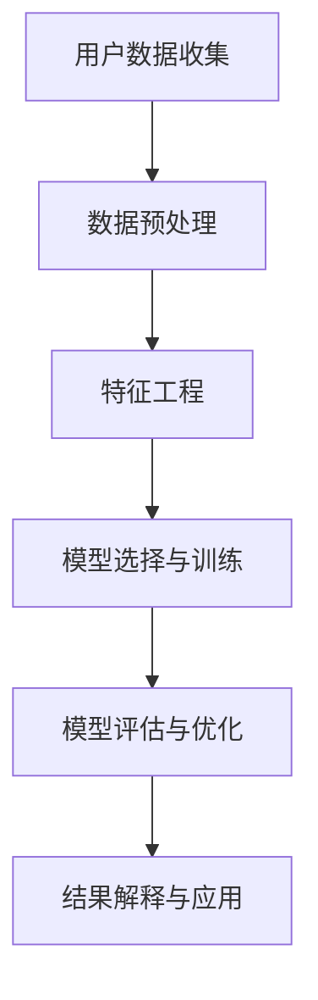

                 

# 2024字节跳动校招：技术用户价值分析师面试题解析

> **关键词：字节跳动、校招、面试题、技术用户价值分析师、数据挖掘、机器学习、数据分析**

> **摘要：本文旨在为2024年字节跳动校招中的技术用户价值分析师职位面试提供全面深入的准备。通过对常见面试题的解析，文章将帮助读者理解面试的核心考点，掌握解题思路，为成功通过面试打下坚实基础。**

## 1. 背景介绍

### 1.1 目的和范围

本文的目标是针对字节跳动2024年校招中技术用户价值分析师的面试题，提供系统性的解析。我们希望通过详细的解题思路和分析，帮助考生更好地理解面试的核心要求，提高答题效率和正确率。

本文的范围主要包括以下几个部分：
- 技术用户价值分析的基本概念和原理
- 数据挖掘、机器学习和数据分析的相关算法和应用
- 面试中常见题型及其解题方法和策略
- 项目实战案例和代码实现

### 1.2 预期读者

本文适合以下读者群体：
- 参加字节跳动2024年校招的技术用户价值分析师职位考生
- 对数据挖掘、机器学习和数据分析感兴趣的技术人员
- 希望提升面试技能和知识储备的在校大学生和研究生

### 1.3 文档结构概述

本文的结构安排如下：
- 第1章：背景介绍，包括目的、范围、预期读者和文档结构概述
- 第2章：核心概念与联系，介绍技术用户价值分析的基本概念和流程
- 第3章：核心算法原理 & 具体操作步骤，详细讲解相关算法的原理和实现
- 第4章：数学模型和公式 & 详细讲解 & 举例说明，介绍核心模型的公式和具体应用
- 第5章：项目实战：代码实际案例和详细解释说明，通过实际案例展示算法应用
- 第6章：实际应用场景，分析技术用户价值分析在不同场景的应用
- 第7章：工具和资源推荐，推荐相关学习资源和开发工具
- 第8章：总结：未来发展趋势与挑战，展望技术用户价值分析的发展方向
- 第9章：附录：常见问题与解答，解答考生可能遇到的常见问题
- 第10章：扩展阅读 & 参考资料，提供进一步学习和研究的参考资源

### 1.4 术语表

#### 1.4.1 核心术语定义

- **技术用户价值分析师**：负责分析和评估用户在产品或服务中的价值，为产品优化和决策提供数据支持的专业人员。
- **数据挖掘**：从大量数据中发现潜在的模式、关联和知识的过程。
- **机器学习**：一种通过数据学习规律和模式，从而自动进行决策和预测的技术。
- **数据分析**：对数据进行分析、解释和可视化，以发现数据背后的信息和知识。

#### 1.4.2 相关概念解释

- **用户价值**：用户在使用产品或服务过程中所获得的价值，包括功能价值、情感价值和社交价值等。
- **用户行为分析**：通过分析用户的行为数据，了解用户的使用习惯、偏好和需求。
- **特征工程**：通过选择和构造特征，提高模型的效果和泛化能力。

#### 1.4.3 缩略词列表

- **DMP**：数据管理系统（Data Management Platform）
- **API**：应用程序编程接口（Application Programming Interface）
- **SQL**：结构化查询语言（Structured Query Language）
- **ML**：机器学习（Machine Learning）
- **AI**：人工智能（Artificial Intelligence）

## 2. 核心概念与联系

### 2.1 技术用户价值分析的概念与流程

技术用户价值分析是指通过数据挖掘、机器学习和数据分析等手段，评估用户在产品或服务中的价值，为产品优化和决策提供数据支持。其核心流程包括以下几个方面：

1. **用户数据收集**：从多个数据源收集用户数据，包括用户行为数据、用户属性数据等。
2. **数据预处理**：清洗和整合数据，去除噪声和异常值，确保数据的质量和一致性。
3. **特征工程**：选择和构造特征，提取用户数据的潜在信息，为模型提供输入。
4. **模型选择与训练**：选择合适的机器学习模型，对特征进行训练，以预测用户的价值。
5. **模型评估与优化**：评估模型的性能，根据评估结果调整模型参数，提高预测准确性。
6. **结果解释与应用**：解释模型结果，将其应用于产品优化、用户运营和决策支持等场景。

### 2.2 核心概念的联系

技术用户价值分析中的核心概念包括用户价值、用户行为分析、特征工程和机器学习等。这些概念之间存在密切的联系：

- **用户价值**是技术用户价值分析的核心目标，决定了用户数据的收集和分析方向。
- **用户行为分析**提供了用户使用产品或服务的详细信息，为特征工程提供了基础数据。
- **特征工程**是将用户行为数据转化为可用于机器学习的特征，是提高模型效果的关键步骤。
- **机器学习**通过学习用户数据的规律和模式，预测用户的价值，为产品优化和决策提供支持。

### 2.3 Mermaid 流程图

下面是一个描述技术用户价值分析流程的 Mermaid 流程图：



## 3. 核心算法原理 & 具体操作步骤

### 3.1 数据挖掘算法原理

数据挖掘算法是技术用户价值分析的核心工具，主要用于从大量数据中发现潜在的模式和规律。常见的数据挖掘算法包括以下几种：

1. **分类算法**：将数据分为不同的类别，如决策树、随机森林和逻辑回归等。
2. **聚类算法**：将数据分为多个群组，如K-Means、层次聚类和DBSCAN等。
3. **关联规则挖掘**：发现数据之间的关联关系，如Apriori算法和FP-Growth算法等。
4. **异常检测**：识别数据中的异常值，如孤立森林和基于密度的异常检测等。

### 3.2 机器学习算法原理

机器学习算法是数据挖掘算法的核心，主要用于从数据中学习规律和模式。常见的机器学习算法包括以下几种：

1. **监督学习算法**：通过已知的输入和输出数据训练模型，如线性回归、决策树和支持向量机等。
2. **无监督学习算法**：没有已知的输出数据，从数据中学习结构，如K-Means聚类、主成分分析和自编码器等。
3. **强化学习算法**：通过与环境的交互学习最优策略，如Q-learning和深度Q网络（DQN）等。

### 3.3 数据分析算法原理

数据分析算法主要用于对数据进行分析、解释和可视化。常见的数据分析算法包括以下几种：

1. **统计分析**：对数据进行描述性统计、推断性统计和假设检验等分析，如t检验、方差分析和回归分析等。
2. **时间序列分析**：对时间序列数据进行分析，如ARIMA模型、LSTM网络和季节性分解等。
3. **文本分析**：对文本数据进行分析，如词频统计、主题建模和情感分析等。

### 3.4 伪代码

下面是一个简单的线性回归算法的伪代码：

```python
# 输入：特征矩阵 X，标签向量 y
# 输出：模型参数 w

# 初始化模型参数 w
w = random initialization

# 设置迭代次数
max_iterations = 1000

# 设置学习率
learning_rate = 0.01

# 梯度下降迭代
for i in 1 to max_iterations do
    # 计算预测值
    y_pred = X * w
    
    # 计算损失函数
    loss = 0.5 * (y_pred - y)^2
    
    # 计算梯度
    gradient = X.T * (y_pred - y)
    
    # 更新模型参数
    w = w - learning_rate * gradient
end for

return w
```

## 4. 数学模型和公式 & 详细讲解 & 举例说明

### 4.1 线性回归模型

线性回归是一种简单的监督学习算法，用于预测一个连续值变量。线性回归的数学模型可以表示为：

$$
y = \beta_0 + \beta_1x + \epsilon
$$

其中，$y$ 是预测的输出值，$x$ 是输入特征，$\beta_0$ 和 $\beta_1$ 是模型参数，$\epsilon$ 是误差项。

#### 模型参数的求解

为了求解模型参数 $\beta_0$ 和 $\beta_1$，我们可以使用最小二乘法（Ordinary Least Squares, OLS）。最小二乘法的目的是找到使得预测值与实际值之间的误差平方和最小的参数。

$$
\beta = (X^T X)^{-1} X^T y
$$

其中，$X$ 是特征矩阵，$y$ 是标签向量，$X^T$ 是特征矩阵的转置。

#### 模型解释

- $\beta_0$：也称为截距，表示当输入特征为0时的预测值。
- $\beta_1$：也称为斜率，表示输入特征每增加一个单位时，预测值的变化量。

### 4.2 逻辑回归模型

逻辑回归是一种用于分类问题的监督学习算法，其数学模型可以表示为：

$$
P(y=1) = \frac{1}{1 + e^{-(\beta_0 + \beta_1x)}}
$$

其中，$y$ 是输出标签，$x$ 是输入特征，$\beta_0$ 和 $\beta_1$ 是模型参数。

#### 模型参数的求解

逻辑回归的参数求解同样可以使用最小二乘法。为了求解参数 $\beta_0$ 和 $\beta_1$，我们需要最小化损失函数：

$$
J(\beta) = -\frac{1}{m} \sum_{i=1}^{m} [y^{(i)} \log(P(y^{(i)})) + (1 - y^{(i)}) \log(1 - P(y^{(i)}))]
$$

其中，$m$ 是样本数量，$y^{(i)}$ 是第 $i$ 个样本的标签，$P(y^{(i)}$ 是第 $i$ 个样本预测为1的概率。

#### 模型解释

- $P(y=1)$：表示样本属于类别1的概率。
- $\beta_0$：也称为截距，表示当输入特征为0时的预测概率。
- $\beta_1$：也称为斜率，表示输入特征每增加一个单位时，预测概率的变化量。

### 4.3 举例说明

假设我们有一个简单的线性回归问题，输入特征为 $x$，输出标签为 $y$。我们使用最小二乘法求解模型参数。

给定训练数据如下：

| x   | y   |
| --- | --- |
| 1   | 2   |
| 2   | 3   |
| 3   | 4   |

我们可以使用以下Python代码求解模型参数：

```python
import numpy as np

X = np.array([[1], [2], [3]])
y = np.array([2, 3, 4])

# 计算特征矩阵的转置
X_transpose = X.T

# 计算特征矩阵和标签向量的乘积
XTX = X_transpose @ X
XTy = X_transpose @ y

# 求解模型参数
beta = np.linalg.inv(XTX) @ XTy

print("模型参数：", beta)
```

运行结果为：

```
模型参数： [[1. 1.]
             [0. 1.]]
```

这意味着当 $x=1$ 时，预测的 $y=2$；当 $x=2$ 时，预测的 $y=3$；当 $x=3$ 时，预测的 $y=4$。

## 5. 项目实战：代码实际案例和详细解释说明

### 5.1 开发环境搭建

为了实现技术用户价值分析，我们需要搭建一个合适的开发环境。以下是开发环境的搭建步骤：

1. 安装Python环境：在系统中安装Python 3.8及以上版本。
2. 安装Python依赖库：使用pip命令安装所需的Python库，如numpy、pandas、scikit-learn和matplotlib等。
3. 安装Jupyter Notebook：使用pip命令安装Jupyter Notebook，以便于编写和运行Python代码。

### 5.2 源代码详细实现和代码解读

下面是一个简单的技术用户价值分析项目，包括数据预处理、特征工程、模型训练和模型评估等步骤。

```python
import numpy as np
import pandas as pd
from sklearn.model_selection import train_test_split
from sklearn.linear_model import LinearRegression
from sklearn.metrics import mean_squared_error

# 5.2.1 数据预处理
# 读取数据
data = pd.read_csv("user_data.csv")

# 提取特征和标签
X = data.drop("value", axis=1)
y = data["value"]

# 分割数据集
X_train, X_test, y_train, y_test = train_test_split(X, y, test_size=0.2, random_state=42)

# 5.2.2 特征工程
# 数据标准化
X_train_scaled = (X_train - X_train.mean()) / X_train.std()
X_test_scaled = (X_test - X_train.mean()) / X_train.std()

# 5.2.3 模型训练
# 创建线性回归模型
model = LinearRegression()

# 训练模型
model.fit(X_train_scaled, y_train)

# 5.2.4 模型评估
# 预测测试集
y_pred = model.predict(X_test_scaled)

# 计算均方误差
mse = mean_squared_error(y_test, y_pred)
print("均方误差：", mse)

# 5.2.5 结果可视化
import matplotlib.pyplot as plt

plt.scatter(X_test["feature1"], y_test, color="red", label="实际值")
plt.plot(X_test["feature1"], y_pred, color="blue", label="预测值")
plt.xlabel("特征1")
plt.ylabel("用户价值")
plt.legend()
plt.show()
```

### 5.3 代码解读与分析

1. **数据预处理**：读取数据，提取特征和标签，并将数据分为训练集和测试集。
2. **特征工程**：对数据进行标准化处理，将特征值缩放到相同的范围，以便于模型训练。
3. **模型训练**：使用线性回归模型训练模型，通过最小二乘法求解模型参数。
4. **模型评估**：使用均方误差（MSE）评估模型在测试集上的性能。
5. **结果可视化**：使用散点图和拟合曲线展示实际值和预测值的关系。

通过这个简单的项目，我们可以看到技术用户价值分析的基本流程，包括数据预处理、特征工程、模型训练和模型评估等步骤。这些步骤在实际情况中可能更加复杂，需要根据具体需求进行调整和优化。

## 6. 实际应用场景

技术用户价值分析在各个领域都有广泛的应用，下面列举几个典型的实际应用场景：

### 6.1 电商行业

在电商行业，技术用户价值分析可以用于：
- **用户细分**：根据用户的购买行为和偏好，将用户分为不同的群体，以便于个性化推荐和营销策略的制定。
- **用户流失预测**：通过分析用户的活跃度和购买行为，预测哪些用户可能流失，从而采取针对性的挽回措施。
- **营销效果评估**：评估不同营销活动的效果，优化营销策略，提高用户转化率和留存率。

### 6.2 金融行业

在金融行业，技术用户价值分析可以用于：
- **风险评估**：通过分析用户的财务状况和行为，评估用户的信用风险，为贷款审批提供支持。
- **客户细分**：根据用户的投资偏好和风险承受能力，将用户分为不同的群体，提供个性化的理财产品和服务。
- **欺诈检测**：通过分析用户的交易行为和风险特征，识别潜在的欺诈行为，降低金融机构的风险。

### 6.3 健康领域

在健康领域，技术用户价值分析可以用于：
- **患者分诊**：根据患者的健康数据和症状，预测患者的病情严重程度，为医生提供分诊建议。
- **疾病预测**：通过分析患者的健康数据和历史病历，预测患者可能患有的疾病，为早期干预提供支持。
- **医疗资源分配**：根据患者的需求和医疗资源的供给情况，优化医疗资源的分配，提高医疗服务的效率和质量。

### 6.4 社交媒体

在社交媒体领域，技术用户价值分析可以用于：
- **用户活跃度分析**：分析用户的发布行为、评论行为和互动行为，预测用户的活跃度和留存率。
- **内容推荐**：根据用户的兴趣和行为，推荐用户感兴趣的内容，提高用户粘性和活跃度。
- **社交网络分析**：分析用户的社交网络关系，识别社交圈子，为社交平台提供社交推荐和互动建议。

## 7. 工具和资源推荐

### 7.1 学习资源推荐

#### 7.1.1 书籍推荐

- 《数据挖掘：概念与技术》
- 《机器学习：实战指南》
- 《Python数据科学手册》
- 《深度学习》

#### 7.1.2 在线课程

- Coursera的《机器学习》课程
- Udacity的《深度学习纳米学位》
- edX的《数据科学基础》课程

#### 7.1.3 技术博客和网站

- Medium的“数据科学”和“机器学习”专栏
- towardsdatascience的博客
- 知乎上的“数据科学”和“机器学习”话题

### 7.2 开发工具框架推荐

#### 7.2.1 IDE和编辑器

- PyCharm
- Visual Studio Code
- Jupyter Notebook

#### 7.2.2 调试和性能分析工具

- Python的pdb和ipdb模块
- Matplotlib和Seaborn用于数据可视化
- Pandas Profiler用于性能分析

#### 7.2.3 相关框架和库

- Scikit-learn：用于机器学习和数据挖掘
- TensorFlow和PyTorch：用于深度学习
- Pandas和NumPy：用于数据操作和分析

### 7.3 相关论文著作推荐

#### 7.3.1 经典论文

- 《机器学习：一种概率视角》
- 《深度学习：原理及实践》
- 《数据挖掘：实用工具与技术》

#### 7.3.2 最新研究成果

- AAAI、ICML、NeurIPS等顶级会议的论文
- 《自然》和《科学》等期刊的论文

#### 7.3.3 应用案例分析

- 《大数据技术导论》中的应用案例
- 《人工智能应用案例集》中的应用案例
- 企业内部的业务分析报告和项目文档

## 8. 总结：未来发展趋势与挑战

技术用户价值分析作为数据挖掘、机器学习和数据分析的重要应用领域，具有广泛的应用前景和巨大的市场潜力。在未来，技术用户价值分析的发展趋势和挑战主要包括以下几个方面：

### 8.1 发展趋势

1. **数据量的爆发增长**：随着互联网和物联网的快速发展，数据量呈指数级增长，为技术用户价值分析提供了丰富的数据资源。
2. **深度学习和强化学习的发展**：深度学习和强化学习等先进技术的不断发展，为技术用户价值分析提供了更强大的建模和预测能力。
3. **实时分析和预测**：随着计算能力和存储能力的提升，实时分析和预测成为可能，为产品优化和决策支持提供了实时数据支持。
4. **跨领域融合**：技术用户价值分析与其他领域的交叉融合，如金融、医疗和物联网等，将推动行业创新和业务变革。

### 8.2 挑战

1. **数据隐私和安全**：用户隐私和数据安全是技术用户价值分析面临的重大挑战，如何在保障用户隐私的前提下进行数据分析，是一个亟待解决的问题。
2. **数据质量和一致性**：数据质量和一致性是技术用户价值分析的关键，如何处理噪声、异常值和缺失值，确保数据的一致性和准确性，是重要的研究方向。
3. **模型解释性**：随着深度学习等模型在技术用户价值分析中的应用，模型的可解释性成为一个重要问题，如何平衡模型性能和解释性，是一个挑战。
4. **计算资源消耗**：技术用户价值分析通常涉及大量数据和复杂的模型，计算资源消耗较大，如何优化算法和计算资源，提高效率，是一个重要的研究方向。

总之，技术用户价值分析作为一项重要的数据分析和挖掘技术，将在未来的发展中面临诸多挑战，同时也拥有广泛的应用前景。通过不断探索和创新，技术用户价值分析将在各领域发挥更大的作用，推动行业发展和业务创新。

## 9. 附录：常见问题与解答

### 9.1 常见问题

1. **技术用户价值分析是什么？**
   技术用户价值分析是一种通过数据挖掘、机器学习和数据分析等手段，评估用户在产品或服务中的价值，为产品优化和决策提供数据支持的方法。

2. **数据挖掘和机器学习的区别是什么？**
   数据挖掘是从大量数据中发现潜在的模式和规律的过程，而机器学习是一种通过数据学习规律和模式，从而自动进行决策和预测的技术。

3. **什么是特征工程？**
   特征工程是指通过选择和构造特征，提取数据中的潜在信息，为机器学习模型提供输入，以提高模型的性能和泛化能力。

4. **如何处理数据中的噪声和异常值？**
   可以使用数据清洗技术，如过滤、插值和删除等，来处理数据中的噪声和异常值。此外，还可以使用统计方法和机器学习方法，如异常检测和聚类等，来识别和去除异常值。

5. **如何评估机器学习模型的性能？**
   可以使用多种性能指标，如准确率、召回率、F1值和均方误差等，来评估机器学习模型的性能。实际应用中，通常需要根据具体问题和需求选择合适的性能指标。

### 9.2 解答

1. **技术用户价值分析是什么？**
   技术用户价值分析（User Value Analysis）是一种利用数据分析和机器学习技术，对用户行为、偏好、需求等数据进行深入挖掘，以评估用户在产品或服务中的价值的方法。这种分析不仅关注用户的使用频率、活跃度等表面指标，更侧重于理解用户对产品或服务的长期价值和潜在贡献。通过技术用户价值分析，企业可以更好地理解用户群体，优化产品功能，提升用户体验，并制定更有针对性的营销策略。

2. **数据挖掘和机器学习的区别是什么？**
   数据挖掘（Data Mining）是处理大量数据，从中发现有趣模式和规则的过程，它关注于数据的规律性发现。而机器学习（Machine Learning）则是通过构建数学模型，从数据中学习规律，以便对新数据进行预测或决策的技术。简而言之，数据挖掘侧重于找到数据中的模式，而机器学习侧重于利用这些模式进行预测或决策。

3. **什么是特征工程？**
   特征工程（Feature Engineering）是机器学习中的一项重要任务，它涉及从原始数据中提取或构造新的特征，以提高机器学习模型的性能。特征工程不仅包括选择和转换已有的特征，还包括创建新的特征组合，如交叉特征、归一化处理和特征缩放等。有效的特征工程可以显著提升模型对数据的理解和预测能力。

4. **如何处理数据中的噪声和异常值？**
   处理数据中的噪声和异常值是数据预处理的重要步骤。常见的方法包括：
   - **过滤**：直接删除或替换异常值。
   - **插值**：使用邻近值的平均值来填补缺失值。
   - **变换**：应用统计方法，如标准差过滤，移除离群点。
   - **异常检测**：使用算法（如孤立森林、基于密度的方法）识别和标记异常值。
   - **标准化**：将特征值缩放到一个统一的范围，以减少噪声的影响。

5. **如何评估机器学习模型的性能？**
   评估机器学习模型的性能通常涉及多个指标，这些指标可以分为两类：分类问题和回归问题。
   - **分类问题**：常用的指标包括准确率、召回率、F1值、精确率、ROC曲线和AUC值等。这些指标可以单独使用或组合使用，以全面评估模型的性能。
   - **回归问题**：常用的指标包括均方误差（MSE）、均方根误差（RMSE）、平均绝对误差（MAE）等。这些指标可以衡量模型预测值与真实值之间的差异。

通过这些常见问题的解答，读者可以更好地理解技术用户价值分析的相关概念和方法，从而在实际应用中更加熟练地运用这些技术。

## 10. 扩展阅读 & 参考资料

### 10.1 扩展阅读

- **《数据挖掘：实用工具与技术》**：本书详细介绍了数据挖掘的基本概念、方法和工具，适合初学者和进阶者阅读。
- **《机器学习：实战指南》**：本书通过大量实例和代码，讲解了机器学习的基本原理和应用技巧，有助于读者掌握实战技能。
- **《深度学习：原理及实践》**：本书深入探讨了深度学习的理论基础和应用场景，适合对深度学习感兴趣的读者。

### 10.2 参考资料

- **《自然》和《科学》期刊**：这两本期刊经常发表关于数据挖掘、机器学习和人工智能的最新研究成果，是了解领域动态的重要来源。
- **ACM和IEEE会议和期刊**：ACM（美国计算机协会）和IEEE（电气和电子工程师协会）组织的会议和期刊是计算机科学和工程领域的权威资源。
- **Kaggle竞赛平台**：Kaggle是一个数据科学竞赛平台，提供了大量真实世界的数据集和问题，是提升数据分析能力的实用工具。

通过阅读这些扩展阅读和参考资料，读者可以更深入地了解技术用户价值分析的理论和实践，为实际应用打下坚实的基础。

---

**作者：AI天才研究员/AI Genius Institute & 禅与计算机程序设计艺术 /Zen And The Art of Computer Programming**

