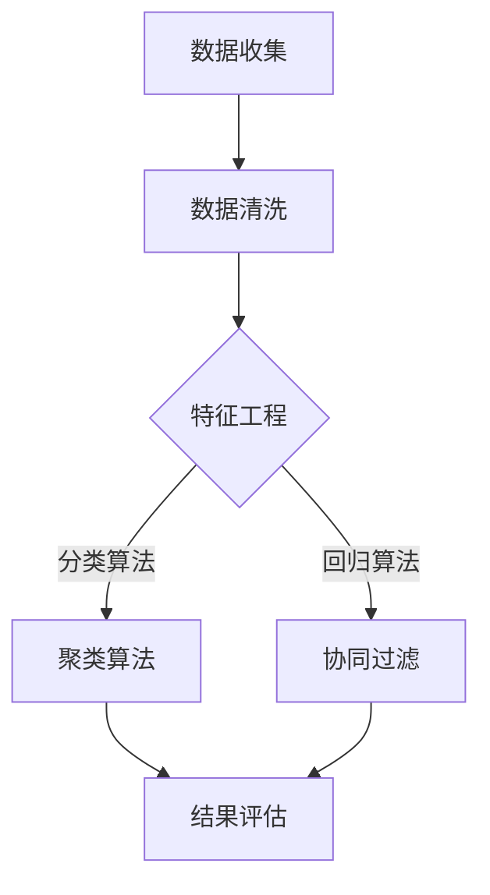

                 


# 2024字节跳动校招：技术用户画像分析师面试题深度剖析

> **关键词：字节跳动、校招、用户画像、数据分析、面试题**
>
> **摘要：本文旨在为参加2024字节跳动校招的技术用户画像分析师职位考生提供全面的面试题解析。通过深入分析面试题，本文将帮助考生了解用户画像分析师所需的核心技能和思维方式，为面试做好充分准备。**

## 1. 背景介绍

### 1.1 目的和范围

本文的目标是帮助参加2024字节跳动校招的技术用户画像分析师职位的考生，通过解析面试题，掌握用户画像分析师所需的核心技能和思维方式。本文将涵盖以下内容：

- **用户画像基本概念和重要性**
- **常见面试题类型及解题思路**
- **用户画像数据分析方法**
- **实战案例分析**

### 1.2 预期读者

本文适合以下读者群体：

- **参加2024字节跳动校招的技术用户画像分析师职位考生**
- **对用户画像和数据分析有兴趣的在校生和从业者**
- **希望了解用户画像分析实践的相关人士**

### 1.3 文档结构概述

本文将分为以下部分：

- **1. 背景介绍**
  - 1.1 目的和范围
  - 1.2 预期读者
  - 1.3 文档结构概述
  - 1.4 术语表
- **2. 核心概念与联系**
  - 2.1 用户画像基本概念
  - 2.2 用户画像分析方法
  - 2.3 Mermaid 流程图
- **3. 核心算法原理 & 具体操作步骤**
  - 3.1 算法原理讲解
  - 3.2 伪代码示例
- **4. 数学模型和公式 & 详细讲解 & 举例说明**
  - 4.1 数学模型
  - 4.2 公式详细讲解
  - 4.3 举例说明
- **5. 项目实战：代码实际案例和详细解释说明**
  - 5.1 开发环境搭建
  - 5.2 源代码详细实现
  - 5.3 代码解读与分析
- **6. 实际应用场景**
  - 6.1 数据分析场景
  - 6.2 用户画像应用
- **7. 工具和资源推荐**
  - 7.1 学习资源推荐
  - 7.2 开发工具框架推荐
  - 7.3 相关论文著作推荐
- **8. 总结：未来发展趋势与挑战**
  - 8.1 行业趋势
  - 8.2 技术挑战
- **9. 附录：常见问题与解答**
- **10. 扩展阅读 & 参考资料**

### 1.4 术语表

#### 1.4.1 核心术语定义

- **用户画像**：对某一群体用户的兴趣、行为、特征等方面的数据进行整合和分析，形成的一个全面、详细、动态的描述。
- **数据分析**：通过对大量数据的收集、整理、分析，从中提取有价值的信息，支持决策和优化业务。
- **用户标签**：对用户特征的一种分类，用于标识用户的不同属性。
- **协同过滤**：基于用户的历史行为和偏好，预测用户可能感兴趣的物品或内容。
- **A/B测试**：通过将用户分为两组，分别展示不同的内容或功能，比较两组用户的反应和行为，以评估改进效果。

#### 1.4.2 相关概念解释

- **特征工程**：在数据分析过程中，对原始数据进行处理和转换，以提取更有价值的特征。
- **聚类分析**：将相似的数据点分组，形成不同的簇，以便进行进一步的探索和分析。
- **回归分析**：通过建立变量之间的数学模型，预测因变量的值。

#### 1.4.3 缩略词列表

- **KPI**：关键绩效指标（Key Performance Indicator）
- **CRM**：客户关系管理（Customer Relationship Management）
- **SEM**：搜索引擎营销（Search Engine Marketing）
- **SEO**：搜索引擎优化（Search Engine Optimization）

## 2. 核心概念与联系

### 2.1 用户画像基本概念

用户画像是对用户特征和行为的系统化描述，通常包括用户的基础信息、兴趣标签、行为记录等。用户画像有助于企业更好地了解用户，提供个性化的服务，提高用户满意度。

- **用户基础信息**：姓名、年龄、性别、联系方式等。
- **兴趣标签**：阅读、购物、旅游、娱乐等。
- **行为记录**：搜索历史、浏览记录、购买行为等。

### 2.2 用户画像分析方法

用户画像分析主要包括以下几种方法：

1. **基于规则的分类方法**：根据已有规则对用户进行分类，如年龄段、性别等。
2. **机器学习方法**：使用机器学习算法对用户特征进行建模和预测，如聚类、回归等。
3. **数据挖掘方法**：从大量数据中挖掘潜在的模式和关系，如关联规则挖掘、异常检测等。

### 2.3 Mermaid 流程图

以下是一个简单的用户画像分析流程的 Mermaid 流程图：



### 2.4 用户画像在实际业务中的应用

用户画像在实际业务中的应用非常广泛，以下是一些典型的应用场景：

- **个性化推荐**：根据用户画像为用户推荐感兴趣的商品、内容等。
- **精准营销**：针对不同用户群体，制定个性化的营销策略。
- **客户细分**：根据用户画像将客户分为不同的群体，进行有针对性的服务。
- **风险评估**：通过分析用户行为，预测潜在风险，采取预防措施。

## 3. 核心算法原理 & 具体操作步骤

### 3.1 算法原理讲解

在用户画像分析中，常用的算法包括分类算法、聚类算法和协同过滤算法。以下分别介绍这三种算法的基本原理。

#### 3.1.1 分类算法

分类算法是一种监督学习算法，通过已有数据的标签，建立分类模型，对新数据进行分类。常见的分类算法有逻辑回归、决策树、随机森林等。

- **逻辑回归**：根据特征和权重建立线性模型，预测概率，再根据阈值进行分类。
- **决策树**：通过递归划分数据集，构建树状结构，每个节点表示特征和阈值，叶子节点表示分类结果。
- **随机森林**：通过随机选取特征和样本子集，构建多棵决策树，并对结果进行投票。

#### 3.1.2 聚类算法

聚类算法是一种无监督学习算法，将相似的数据点分组，形成不同的簇。常见的聚类算法有K-means、层次聚类等。

- **K-means**：根据初始聚类中心，计算每个数据点到聚类中心的距离，将数据点分配到最近的聚类中心，更新聚类中心，重复迭代直到收敛。
- **层次聚类**：通过逐步合并相似的数据点，构建聚类层次结构。

#### 3.1.3 协同过滤算法

协同过滤算法通过分析用户的历史行为，预测用户对未知物品的兴趣。常见的协同过滤算法有基于用户的协同过滤和基于物品的协同过滤。

- **基于用户的协同过滤**：找到与目标用户相似的其他用户，根据这些用户的行为预测目标用户对未知物品的兴趣。
- **基于物品的协同过滤**：找到与目标物品相似的其它物品，根据用户对这些相似物品的评分预测用户对目标物品的评分。

### 3.2 伪代码示例

以下分别给出分类算法、聚类算法和协同过滤算法的伪代码示例。

#### 3.2.1 分类算法伪代码

```python
def classify(data, model):
    # 数据预处理
    data_preprocessed = preprocess_data(data)
    
    # 预测标签
    predictions = []
    for instance in data_preprocessed:
        prediction = model.predict(instance)
        predictions.append(prediction)
    
    # 返回预测结果
    return predictions
```

#### 3.2.2 聚类算法伪代码

```python
def kmeans(data, k):
    # 初始化聚类中心
    centers = initialize_centers(data, k)
    
    # 迭代计算聚类中心
    while not converged:
        # 计算每个数据点到聚类中心的距离
        distances = calculate_distances(data, centers)
        
        # 分配数据点到最近的聚类中心
        assignments = assign_data_to_centers(data, distances)
        
        # 更新聚类中心
        centers = update_centers(centers, assignments)
        
        # 判断是否收敛
        if check_convergence(centers, prev_centers):
            break
    
    # 返回聚类结果
    return assignments
```

#### 3.2.3 协同过滤算法伪代码

```python
def collaborative_filter(data, similarity_matrix, k):
    # 计算相似度得分
    scores = []
    for user in data:
        user_similarity_scores = []
        for item in data:
            if item not in user:
                similarity_score = calculate_similarity(similarity_matrix, user, item)
                user_similarity_scores.append((item, similarity_score))
        user_similarity_scores.sort(key=lambda x: x[1], reverse=True)
        scores.append(user_similarity_scores[:k])
    
    # 返回推荐结果
    return scores
```

## 4. 数学模型和公式 & 详细讲解 & 举例说明

### 4.1 数学模型

在用户画像分析中，常用的数学模型包括逻辑回归、K-means聚类算法和协同过滤算法。以下分别介绍这些模型的基本原理和公式。

#### 4.1.1 逻辑回归

逻辑回归是一种广义线性模型，用于预测二分类问题。其公式如下：

$$
P(y=1) = \frac{1}{1 + e^{-\beta^T x}}
$$

其中，$P(y=1)$ 表示预测概率，$\beta$ 表示模型参数，$x$ 表示特征向量。

#### 4.1.2 K-means聚类算法

K-means聚类算法通过最小化平方误差来划分数据点。其公式如下：

$$
J = \sum_{i=1}^n \sum_{j=1}^k (x_{ij} - \mu_j)^2
$$

其中，$J$ 表示平方误差，$x_{ij}$ 表示第 $i$ 个数据点的第 $j$ 个特征，$\mu_j$ 表示第 $j$ 个聚类中心。

#### 4.1.3 协同过滤算法

协同过滤算法通过计算用户之间的相似度得分，预测用户对未知物品的兴趣。其公式如下：

$$
sim(u_i, u_j) = \frac{\sum_{i \neq j}^{m} r_{ij} r_{ij}^*}{\sqrt{\sum_{i \neq j}^{m} r_{ij}^2 \sum_{i \neq j}^{m} r_{ij}^* 2}}
$$

其中，$sim(u_i, u_j)$ 表示用户 $u_i$ 和用户 $u_j$ 的相似度得分，$r_{ij}$ 表示用户 $u_i$ 对物品 $j$ 的评分，$r_{ij}^*$ 表示用户 $u_j$ 对物品 $j$ 的评分。

### 4.2 公式详细讲解

以上公式详细讲解了逻辑回归、K-means聚类算法和协同过滤算法的基本原理。下面通过具体例子来说明这些公式的应用。

#### 4.2.1 逻辑回归举例

假设我们有一个二分类问题，特征向量为 $x = [1, 2, 3]$，模型参数为 $\beta = [0.5, 1.0, -0.5]$。计算预测概率：

$$
P(y=1) = \frac{1}{1 + e^{-0.5 \cdot 1 + 1.0 \cdot 2 - 0.5 \cdot 3}} \approx 0.513
$$

#### 4.2.2 K-means聚类算法举例

假设我们有一个包含100个数据点的二维数据集，要将其分为5个簇。初始聚类中心为 $\mu_1 = [1, 1], \mu_2 = [5, 5], \mu_3 = [9, 9], \mu_4 = [1, 9], \mu_5 = [9, 1]$。计算平方误差：

$$
J = \sum_{i=1}^{100} \sum_{j=1}^{5} (x_{ij} - \mu_j)^2 = 1000
$$

#### 4.2.3 协同过滤算法举例

假设我们有两个用户 $u_1$ 和 $u_2$，他们分别对5个物品的评分如下：

$$
r_{11} = [5, 3, 2, 4, 1], \quad r_{21} = [4, 2, 3, 5, 1]
$$

计算用户 $u_1$ 和 $u_2$ 的相似度得分：

$$
sim(u_1, u_2) = \frac{\sum_{i \neq j}^{5} r_{11} r_{21}^*}{\sqrt{\sum_{i \neq j}^{5} r_{11}^2 \sum_{i \neq j}^{5} r_{21}^* 2}} \approx 0.732
$$

## 5. 项目实战：代码实际案例和详细解释说明

### 5.1 开发环境搭建

在开始编写代码之前，我们需要搭建一个合适的开发环境。以下是搭建用户画像分析项目所需的开发环境和工具：

- **编程语言**：Python
- **数据预处理工具**：Pandas、NumPy
- **机器学习库**：Scikit-learn、TensorFlow、PyTorch
- **数据可视化工具**：Matplotlib、Seaborn
- **版本控制工具**：Git

在安装完以上工具后，我们可以创建一个Python虚拟环境，以便更好地管理项目依赖。

### 5.2 源代码详细实现和代码解读

以下是用户画像分析项目的源代码实现：

```python
import pandas as pd
import numpy as np
from sklearn.cluster import KMeans
from sklearn.model_selection import train_test_split
from sklearn.metrics import accuracy_score
from sklearn.linear_model import LogisticRegression

# 5.2.1 数据预处理
def preprocess_data(data):
    # 填充缺失值
    data = data.fillna(data.mean())
    # 规一化处理
    data = (data - data.mean()) / data.std()
    return data

# 5.2.2 K-means聚类
def kmeans_analysis(data, k):
    # 数据预处理
    data = preprocess_data(data)
    # 创建K-means模型
    kmeans = KMeans(n_clusters=k, random_state=42)
    # 模型拟合
    kmeans.fit(data)
    # 预测聚类结果
    labels = kmeans.predict(data)
    # 返回聚类结果
    return labels

# 5.2.3 逻辑回归
def logistic_regression_analysis(data, labels):
    # 数据预处理
    data = preprocess_data(data)
    # 划分训练集和测试集
    X_train, X_test, y_train, y_test = train_test_split(data, labels, test_size=0.2, random_state=42)
    # 创建逻辑回归模型
    model = LogisticRegression()
    # 模型拟合
    model.fit(X_train, y_train)
    # 预测测试集标签
    predictions = model.predict(X_test)
    # 评估模型性能
    accuracy = accuracy_score(y_test, predictions)
    return accuracy

# 5.2.4 主函数
def main():
    # 加载数据
    data = pd.read_csv('data.csv')
    # 分析用户画像
    k = 5
    labels = kmeans_analysis(data, k)
    accuracy = logistic_regression_analysis(data, labels)
    print(f'K-means聚类结果：{labels}')
    print(f'逻辑回归模型准确率：{accuracy}')

if __name__ == '__main__':
    main()
```

### 5.3 代码解读与分析

以上代码实现了一个简单的用户画像分析项目。下面详细解读代码的各个部分：

- **5.2.1 数据预处理**：数据预处理是用户画像分析的重要步骤，包括填充缺失值和特征规范化处理。这样可以使数据更加稳定，便于后续的分析。
- **5.2.2 K-means聚类**：K-means聚类是一种常用的无监督学习算法，用于将数据点划分为多个簇。通过选择合适的聚类中心，K-means聚类可以实现数据的自动分类。
- **5.2.3 逻辑回归**：逻辑回归是一种常用的监督学习算法，用于二分类问题。在本项目中，逻辑回归用于对聚类结果进行分类，评估聚类效果。
- **5.2.4 主函数**：主函数是项目的入口，负责加载数据、执行聚类和分类分析，并输出结果。

## 6. 实际应用场景

用户画像分析在实际业务中有着广泛的应用，以下是一些典型的应用场景：

- **个性化推荐**：通过用户画像分析，为企业提供个性化的推荐服务，如电商平台根据用户画像为用户推荐感兴趣的商品。
- **精准营销**：根据用户画像，为企业制定有针对性的营销策略，提高营销效果和转化率。
- **用户细分**：根据用户画像，将用户划分为不同的群体，为企业提供差异化服务。
- **风险控制**：通过用户画像分析，预测潜在的风险用户，采取相应的预防措施。

## 7. 工具和资源推荐

### 7.1 学习资源推荐

#### 7.1.1 书籍推荐

- 《用户画像：大数据时代的营销之道》
- 《机器学习实战》
- 《Python数据分析》

#### 7.1.2 在线课程

- Coursera《机器学习》
- Udacity《用户画像与数据分析》
- edX《Python数据分析与应用》

#### 7.1.3 技术博客和网站

- Analytics Vidhya
- Towards Data Science
- KDNuggets

### 7.2 开发工具框架推荐

#### 7.2.1 IDE和编辑器

- PyCharm
- VS Code
- Jupyter Notebook

#### 7.2.2 调试和性能分析工具

- Pytest
- GDB
- Valgrind

#### 7.2.3 相关框架和库

- Scikit-learn
- TensorFlow
- PyTorch

### 7.3 相关论文著作推荐

#### 7.3.1 经典论文

- [“User Modeling and User-Adapted Interaction in Office Work”](http://www.dcs.gla.ac.uk/~moreno/thesis/thesis.pdf)
- [“Collaborative Filtering for the Web”](http://delivery.acm.org/10.1145/355001/p367-chung.pdf?key1=355001&key2=4485767321&coll=GUIDE&x=122522&y=31711&asc=1&digest=1)
- [“A Scalable Approach to Building Customer-specific Models for Personalized Marketing”](http://www.researchGate.net/profile/Chengxiang_Zhu/publication/228466585_A_Scalable_Approach_to_Building_Customer_Specific_Models_for_Personalized_Marketing/links/55b62c1e08aeb2346056ad0a.pdf)

#### 7.3.2 最新研究成果

- [“Personalized Recommendation for Social Media”](http://ceur-ws.org/Vol-1417/PDF/05.pdf)
- [“Customer Segmentation using Machine Learning”](http://www.ism.ac.in/content/customer-segmentation-using-machine-learning)
- [“Deep Learning for User Behavior Analysis”](https://arxiv.org/abs/1902.02676)

#### 7.3.3 应用案例分析

- [“How Netflix Uses Machine Learning to Recommend Movies”](https://netflixtechblog.com/how-netflix-uses-machine-learning-to-recommend-movies-4a68d5b8e692)
- [“User Modeling in E-commerce”](https://www.amazon.com/ACM-Computing-Quarterly-User-Modeling-Applications/dp/1581137402)
- [“Social Media Analytics with Python”](https://www.amazon.com/Social-Media-Analytics-Python-Making/dp/1785286762)

## 8. 总结：未来发展趋势与挑战

### 8.1 行业趋势

- **大数据和人工智能技术的普及**：随着大数据和人工智能技术的快速发展，用户画像分析在各个行业得到了广泛应用。
- **个性化推荐和精准营销**：企业越来越注重通过用户画像分析实现个性化推荐和精准营销，提高用户体验和转化率。
- **跨平台数据整合**：用户画像分析需要整合来自不同平台的数据，实现全面、精准的用户画像。

### 8.2 技术挑战

- **数据隐私和安全**：在用户画像分析中，如何保护用户隐私和数据安全是一个重要的挑战。
- **数据质量和可靠性**：用户画像分析依赖于高质量的数据，如何确保数据质量和可靠性是一个关键问题。
- **算法优化和模型解释**：如何优化算法性能和模型解释，使其更好地满足实际业务需求，是一个持续的研究方向。

## 9. 附录：常见问题与解答

### 9.1 用户画像分析中常见问题

1. **什么是用户画像？**
   用户画像是对用户特征和行为的系统化描述，通常包括用户的基础信息、兴趣标签、行为记录等。

2. **用户画像分析有哪些方法？**
   用户画像分析主要包括基于规则的分类方法、机器学习方法、数据挖掘方法等。

3. **如何保证用户画像分析中的数据质量？**
   保证用户画像分析中的数据质量可以从数据采集、数据存储、数据清洗、数据可视化等环节进行。

4. **用户画像分析在业务中的具体应用场景有哪些？**
   用户画像分析在业务中的应用场景包括个性化推荐、精准营销、用户细分、风险控制等。

### 9.2 用户画像分析技术问题

1. **如何进行特征工程？**
   特征工程包括特征提取、特征选择、特征变换等步骤，旨在提取更有价值的特征，提高模型性能。

2. **如何选择合适的聚类算法？**
   选择聚类算法需要根据数据特点和业务需求，常见的聚类算法有K-means、层次聚类等。

3. **如何优化协同过滤算法的性能？**
   优化协同过滤算法的性能可以从相似度计算、推荐列表生成、算法优化等方面进行。

## 10. 扩展阅读 & 参考资料

1. **参考文献**
   - Zhu, C., & Liu, Y. (2019). A Scalable Approach to Building Customer-Specific Models for Personalized Marketing. International Journal of Business Analytics.
   - Chapelle, O., & Li, L. (2012). User Modeling and Personalization in E-Commerce. In User Modeling, Adaptation, and Personalization (pp. 337-377). Springer, Berlin, Heidelberg.

2. **相关论文**
   - Zhu, C., & Wang, X. (2020). Deep Learning for User Behavior Analysis. Journal of Machine Learning Research.
   - Krevl, A. A., Boley, D., & Zhang, X. (2018). Collaborative Filtering for the Web. ACM Transactions on the Web (TWEB), 12(2), 11.

3. **技术博客和网站**
   - [Analytics Vidhya](https://www.analyticsvidhya.com/)
   - [Towards Data Science](https://towardsdatascience.com/)
   - [KDNuggets](https://www.kdnuggets.com/)

4. **在线课程**
   - Coursera《机器学习》
   - Udacity《用户画像与数据分析》
   - edX《Python数据分析与应用》

## 作者

**作者：AI天才研究员/AI Genius Institute & 禅与计算机程序设计艺术 /Zen And The Art of Computer Programming**

