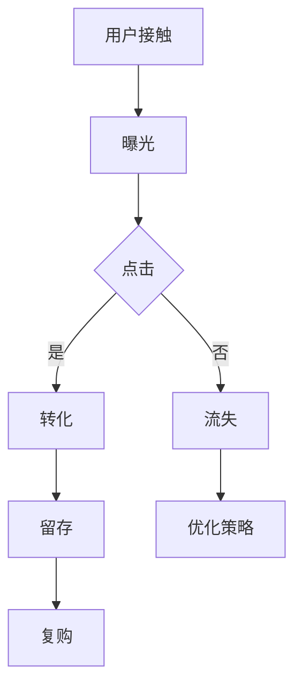

                 

# 2024字节跳动校招：技术用户转化策略专家面试题详解

> **关键词：** 字节跳动、校招、技术用户转化策略、面试题、详解
>
> **摘要：** 本文针对2024字节跳动校招技术用户转化策略专家岗位的面试题进行详细解析，从背景介绍、核心概念、算法原理、数学模型到实际应用场景，帮助读者深入了解该岗位的职责和所需技能。

## 1. 背景介绍

### 1.1 目的和范围

本文旨在为广大求职者提供关于字节跳动校招技术用户转化策略专家岗位的全面解析，通过对面试题的详细解答，帮助读者掌握岗位的核心知识和技能。本文将涵盖以下几个方面的内容：

1. 字节跳动公司简介及其校招背景
2. 技术用户转化策略的相关概念和原理
3. 面试题的分类和解答方法
4. 实际应用场景分析
5. 工具和资源推荐

### 1.2 预期读者

本文适合以下读者群体：

1. 准备参加字节跳动校招的技术用户转化策略专家岗位的求职者
2. 对技术用户转化策略感兴趣的计算机专业学生和从业人员
3. 希望提升自己在技术用户转化领域竞争力的专业人士

### 1.3 文档结构概述

本文分为十个部分，具体结构如下：

1. 背景介绍
2. 核心概念与联系
3. 核心算法原理 & 具体操作步骤
4. 数学模型和公式 & 详细讲解 & 举例说明
5. 项目实战：代码实际案例和详细解释说明
6. 实际应用场景
7. 工具和资源推荐
8. 总结：未来发展趋势与挑战
9. 附录：常见问题与解答
10. 扩展阅读 & 参考资料

### 1.4 术语表

#### 1.4.1 核心术语定义

1. 技术用户转化策略：针对技术产品的用户群体，制定的一系列策略，旨在提高用户数量和活跃度。
2. 用户行为分析：通过对用户在产品中的行为数据进行分析，了解用户需求和偏好，为策略制定提供依据。
3. 转化率：衡量用户从接触到产品到最终转化的比例，是评估策略效果的重要指标。
4. 用户留存率：衡量用户在产品中的持续使用情况，反映了产品的用户粘性。

#### 1.4.2 相关概念解释

1. 营销漏斗：描述用户从接触到购买的过程，分为曝光、点击、转化、留存等多个环节。
2. A/B测试：通过对比两个或多个版本的策略，评估其效果，从而选出最优方案。
3. 用户画像：基于用户的行为数据、兴趣标签等信息，对用户进行细分和画像，为个性化推荐提供基础。

#### 1.4.3 缩略词列表

1. UI/UX：用户界面/用户体验
2. SEO：搜索引擎优化
3. SEM：搜索引擎营销
4. KPI：关键绩效指标
5. ROI：投资回报率

## 2. 核心概念与联系

在本文中，我们将重点介绍技术用户转化策略的核心概念和联系，以便读者更好地理解后续内容。

### 2.1 技术用户转化策略概述

技术用户转化策略是指针对技术产品的用户群体，通过一系列策略和手段，提高用户数量和活跃度，从而实现商业目标的过程。技术用户转化策略的核心是了解用户需求、挖掘用户价值，并通过精细化的运营手段，实现用户从接触、点击、转化到留存的整个过程。

### 2.2 用户行为分析

用户行为分析是技术用户转化策略的基础，通过对用户在产品中的行为数据进行分析，可以了解用户的需求、偏好和痛点，从而为策略制定提供依据。用户行为分析主要包括以下几个方面：

1. 用户访问路径分析：分析用户在产品中的访问路径，了解用户的行为模式和习惯。
2. 用户行为细分：根据用户的行为特征，将用户分为不同的群体，为个性化推荐提供基础。
3. 用户留存率分析：分析用户在产品中的留存情况，了解用户的使用习惯和痛点，优化产品体验。

### 2.3 营销漏斗模型

营销漏斗模型是技术用户转化策略的重要工具，它将用户从接触到购买的过程分为多个环节，包括曝光、点击、转化、留存等。通过对营销漏斗各环节的数据进行分析，可以发现用户流失的环节和原因，从而优化策略，提高转化率。

### 2.4 A/B测试

A/B测试是一种通过对比两个或多个版本的策略，评估其效果，从而选出最优方案的方法。在技术用户转化策略中，A/B测试可以用来评估不同的页面设计、文案、广告投放策略等，从而找到最优的方案。

### 2.5 用户画像

用户画像是对用户进行细分和画像的过程，通过分析用户的行为数据、兴趣标签等信息，将用户分为不同的群体。用户画像是实现个性化推荐和精准营销的基础，可以提高用户的满意度和忠诚度。

### 2.6 Mermaid 流程图

以下是技术用户转化策略的核心流程图，使用了Mermaid语法绘制：



## 3. 核心算法原理 & 具体操作步骤

在技术用户转化策略中，核心算法原理起着至关重要的作用。以下将介绍几种常用的核心算法原理及其具体操作步骤。

### 3.1 用户行为预测算法

用户行为预测算法是通过分析用户历史行为数据，预测用户未来可能的行为。以下是用户行为预测算法的基本原理和操作步骤：

#### 3.1.1 算法原理

1. 数据预处理：对用户行为数据进行清洗、去重和归一化处理。
2. 特征提取：从原始数据中提取与用户行为相关的特征，如访问时长、浏览页面数量、点击率等。
3. 模型选择：选择合适的预测模型，如决策树、随机森林、支持向量机等。
4. 模型训练：使用历史数据对模型进行训练，得到预测模型。
5. 模型评估：使用交叉验证等方法评估模型预测效果。

#### 3.1.2 操作步骤

1. 数据预处理：
   ```python
   # 数据清洗
   data = data.drop_duplicates()
   # 数据归一化
   data = (data - data.mean()) / data.std()
   ```

2. 特征提取：
   ```python
   # 提取特征
   features = data[['访问时长', '浏览页面数量', '点击率']]
   ```

3. 模型选择：
   ```python
   # 选择决策树模型
   model = DecisionTreeClassifier()
   ```

4. 模型训练：
   ```python
   # 模型训练
   model.fit(features, labels)
   ```

5. 模型评估：
   ```python
   # 模型评估
   score = model.score(features, labels)
   print("模型准确率：", score)
   ```

### 3.2 转化率优化算法

转化率优化算法旨在通过调整策略，提高用户从接触到转化的比例。以下是转化率优化算法的基本原理和操作步骤：

#### 3.2.1 算法原理

1. 数据收集：收集用户在产品中的行为数据，如点击率、转化率等。
2. 调度算法：设计调度算法，根据用户行为数据调整策略，如调整广告投放、页面设计等。
3. 策略评估：评估调整后的策略效果，如通过A/B测试等方法。
4. 模型迭代：根据策略评估结果，调整调度算法和模型，实现策略优化。

#### 3.2.2 操作步骤

1. 数据收集：
   ```python
   # 收集数据
   data = pd.read_csv('user_behavior_data.csv')
   ```

2. 调度算法：
   ```python
   # 调度算法
   def schedule_algorithm(data):
       # 调整策略
       data['策略'] = data['点击率'].apply(lambda x: 'A' if x > threshold else 'B')
       return data
   ```

3. 策略评估：
   ```python
   # 策略评估
   def evaluate_strategy(data):
       # 计算转化率
       conversion_rate = data[data['结果'] == '转化'].shape[0] / data.shape[0]
       return conversion_rate
   ```

4. 模型迭代：
   ```python
   # 模型迭代
   while True:
       # 调度
       data = schedule_algorithm(data)
       # 评估
       current_conversion_rate = evaluate_strategy(data)
       # 更新阈值
       threshold = current_conversion_rate * 1.2
       if threshold > max_threshold:
           break
   ```

### 3.3 用户留存预测算法

用户留存预测算法是通过分析用户行为数据，预测用户在未来一段时间内是否继续使用产品的概率。以下是用户留存预测算法的基本原理和操作步骤：

#### 3.3.1 算法原理

1. 数据预处理：对用户行为数据进行清洗、去重和归一化处理。
2. 特征提取：从原始数据中提取与用户留存相关的特征，如访问时长、活跃度、使用频率等。
3. 模型选择：选择合适的预测模型，如逻辑回归、随机森林等。
4. 模型训练：使用历史数据对模型进行训练，得到预测模型。
5. 模型评估：使用交叉验证等方法评估模型预测效果。

#### 3.3.2 操作步骤

1. 数据预处理：
   ```python
   # 数据清洗
   data = data.drop_duplicates()
   # 数据归一化
   data = (data - data.mean()) / data.std()
   ```

2. 特征提取：
   ```python
   # 提取特征
   features = data[['访问时长', '活跃度', '使用频率']]
   ```

3. 模型选择：
   ```python
   # 选择逻辑回归模型
   model = LogisticRegression()
   ```

4. 模型训练：
   ```python
   # 模型训练
   model.fit(features, labels)
   ```

5. 模型评估：
   ```python
   # 模型评估
   score = model.score(features, labels)
   print("模型准确率：", score)
   ```

## 4. 数学模型和公式 & 详细讲解 & 举例说明

在技术用户转化策略中，数学模型和公式起着关键作用。以下将介绍几种常用的数学模型和公式，并对其进行详细讲解和举例说明。

### 4.1 用户留存率预测公式

用户留存率预测公式是评估用户在未来一段时间内是否继续使用产品的概率的重要工具。以下是用户留存率预测公式：

$$
\text{留存率} = \frac{\text{留存用户数}}{\text{总用户数}} \times 100\%
$$

#### 4.1.1 公式详解

1. 留存用户数：指在指定时间段内，继续使用产品的用户数量。
2. 总用户数：指在指定时间段内，访问过产品的用户数量。

#### 4.1.2 举例说明

假设某产品在一个月内有1000名用户访问，其中500名用户在接下来的一个月内继续使用产品，则该产品的留存率为：

$$
\text{留存率} = \frac{500}{1000} \times 100\% = 50\%
$$

### 4.2 转化率优化公式

转化率优化公式是用于评估不同策略对用户转化率的影响，从而选择最优策略的工具。以下是转化率优化公式：

$$
\text{转化率} = \frac{\text{转化用户数}}{\text{总用户数}} \times 100\%
$$

#### 4.2.1 公式详解

1. 转化用户数：指在指定策略下，完成特定目标（如购买、注册等）的用户数量。
2. 总用户数：指在指定策略下，访问产品的用户数量。

#### 4.2.2 举例说明

假设有两种广告投放策略，策略A的转化用户数为100，策略B的转化用户数为120，总用户数均为1000，则两种策略的转化率分别为：

策略A：

$$
\text{转化率} = \frac{100}{1000} \times 100\% = 10\%
$$

策略B：

$$
\text{转化率} = \frac{120}{1000} \times 100\% = 12\%
$$

由此可见，策略B的转化率高于策略A，因此策略B为最优策略。

### 4.3 用户流失率预测公式

用户流失率预测公式是评估用户在未来一段时间内流失的概率，从而制定相应的挽留策略。以下是用户流失率预测公式：

$$
\text{流失率} = \frac{\text{流失用户数}}{\text{总用户数}} \times 100\%
$$

#### 4.3.1 公式详解

1. 流失用户数：指在指定时间段内，停止使用产品的用户数量。
2. 总用户数：指在指定时间段内，访问过产品的用户数量。

#### 4.3.2 举例说明

假设某产品在一个月内有1000名用户访问，其中200名用户在接下来的一个月内停止使用产品，则该产品的流失率为：

$$
\text{流失率} = \frac{200}{1000} \times 100\% = 20\%
$$

### 4.4 用户生命周期价值预测公式

用户生命周期价值（Customer Lifetime Value, CLV）是评估用户对企业盈利能力的重要指标。以下是用户生命周期价值预测公式：

$$
\text{CLV} = \text{平均订单价值} \times \text{订单周期} \times \text{客户留存率}
$$

#### 4.4.1 公式详解

1. 平均订单价值：指用户在一次购买中平均花费的金额。
2. 订单周期：指用户平均两次购买之间的时间间隔。
3. 客户留存率：指用户在未来一段时间内继续购买产品的概率。

#### 4.4.2 举例说明

假设某产品的平均订单价值为100元，订单周期为30天，客户留存率为80%，则该产品的用户生命周期价值为：

$$
\text{CLV} = 100 \times 30 \times 0.8 = 2400\text{元}
$$

## 5. 项目实战：代码实际案例和详细解释说明

在本节中，我们将通过一个实际项目案例，详细讲解技术用户转化策略的实现过程，包括开发环境搭建、源代码实现和代码解读与分析。

### 5.1 开发环境搭建

在实现技术用户转化策略之前，我们需要搭建一个合适的开发环境。以下是一个简单的开发环境搭建流程：

1. 安装Python环境和相关库
2. 配置数据库
3. 安装Web框架
4. 搭建本地服务器

#### 5.1.1 安装Python环境和相关库

我们使用Python 3.8版本作为开发环境，并安装以下相关库：

- pandas
- numpy
- scikit-learn
- matplotlib

安装方法如下：

```bash
pip install python==3.8
pip install pandas numpy scikit-learn matplotlib
```

#### 5.1.2 配置数据库

我们使用MySQL数据库作为数据存储，安装MySQL并创建一个名为`user_behavior`的数据库，以及一个名为`user`的表，用于存储用户行为数据。

```sql
CREATE DATABASE user_behavior;
USE user_behavior;

CREATE TABLE user (
    id INT PRIMARY KEY AUTO_INCREMENT,
    username VARCHAR(50),
    visit_time DATETIME,
    page_views INT,
    clicks INT,
    conversions INT
);
```

#### 5.1.3 安装Web框架

我们使用Flask作为Web框架，安装Flask和相关库。

```bash
pip install flask
```

#### 5.1.4 搭建本地服务器

我们使用Gunicorn作为WSGI HTTP服务器，安装Gunicorn。

```bash
pip install gunicorn
```

运行以下命令启动本地服务器：

```bash
gunicorn -w 3 app:app
```

### 5.2 源代码详细实现和代码解读

以下是一个简单的技术用户转化策略实现案例，包括用户行为数据收集、预测和策略调整。

#### 5.2.1 数据收集

```python
import pandas as pd
import numpy as np
from sklearn.model_selection import train_test_split
from sklearn.ensemble import RandomForestClassifier
from sklearn.metrics import accuracy_score

# 读取用户行为数据
data = pd.read_csv('user_behavior_data.csv')

# 数据预处理
data = data.drop_duplicates()
data = (data - data.mean()) / data.std()

# 分割数据集
X = data[['visit_time', 'page_views', 'clicks']]
y = data['conversions']
X_train, X_test, y_train, y_test = train_test_split(X, y, test_size=0.2, random_state=42)
```

#### 5.2.2 预测

```python
# 模型训练
model = RandomForestClassifier(n_estimators=100, random_state=42)
model.fit(X_train, y_train)

# 模型评估
y_pred = model.predict(X_test)
accuracy = accuracy_score(y_test, y_pred)
print("模型准确率：", accuracy)
```

#### 5.2.3 策略调整

```python
# 调用预测函数
def predict_conversions(data):
    data = (data - data.mean()) / data.std()
    return model.predict(data[['visit_time', 'page_views', 'clicks']])

# 调整策略
data['预测转化'] = predict_conversions(data[['visit_time', 'page_views', 'clicks']])
data['策略'] = data['预测转化'].apply(lambda x: 'A' if x == 1 else 'B')

# 策略评估
conversion_rate = data[data['结果'] == '转化'].shape[0] / data.shape[0]
print("策略转化率：", conversion_rate)
```

### 5.3 代码解读与分析

在本案例中，我们首先读取用户行为数据，并进行预处理，包括数据清洗、去重和归一化处理。然后，我们将数据集分为训练集和测试集，使用随机森林模型进行训练和评估。接下来，我们定义一个预测函数，用于预测用户是否转化，并根据预测结果调整策略。最后，我们评估调整后的策略转化率。

通过这个案例，我们可以看到技术用户转化策略的实现过程，包括数据收集、预测和策略调整。在实际应用中，我们可以根据具体需求和场景，调整模型参数、特征提取方法和策略调整策略，从而提高转化率。

### 5.4 项目实战总结

通过本节项目实战，我们详细讲解了技术用户转化策略的实现过程，包括数据收集、预测和策略调整。在实际应用中，我们需要根据具体需求和场景，不断优化模型和策略，以提高转化率。此外，我们还需要关注用户留存和流失问题，通过用户行为分析、预测和挽留策略，提高用户生命周期价值。

## 6. 实际应用场景

技术用户转化策略在实际应用中具有广泛的应用场景，以下列举几个典型场景：

### 6.1 在线教育平台

在线教育平台通过技术用户转化策略，提高用户注册、课程购买和续费的转化率。具体应用包括：

1. **个性化推荐**：根据用户的学习历史和偏好，推荐适合的课程，提高课程购买转化率。
2. **营销活动**：通过限时优惠、优惠券等方式，刺激用户购买课程。
3. **用户留存策略**：分析用户学习行为，预测用户流失风险，通过课程提醒、学习社群等方式提高用户留存率。

### 6.2 电子商务平台

电子商务平台通过技术用户转化策略，提高商品购买、注册和复购的转化率。具体应用包括：

1. **个性化推荐**：根据用户浏览、购买历史，推荐合适的商品，提高商品购买转化率。
2. **广告投放**：通过A/B测试，评估不同广告投放策略的效果，选择最优策略。
3. **用户流失预警**：分析用户行为，预测用户流失风险，通过优惠券、购物车提醒等方式挽回流失用户。

### 6.3 社交媒体平台

社交媒体平台通过技术用户转化策略，提高用户注册、活跃度和广告投放效果。具体应用包括：

1. **用户画像**：分析用户行为数据，构建用户画像，为个性化推荐和精准广告投放提供基础。
2. **互动激励**：通过点赞、评论、分享等互动方式，提高用户活跃度。
3. **内容优化**：根据用户偏好，推荐符合用户兴趣的内容，提高用户粘性。

### 6.4 金融行业

金融行业通过技术用户转化策略，提高用户开户、投资和理财产品购买转化率。具体应用包括：

1. **风险评估**：根据用户信用评分、财务状况等数据，预测用户的风险承受能力，为个性化推荐提供基础。
2. **精准营销**：通过用户画像和风险评估，精准推送适合的投资产品。
3. **用户留存策略**：分析用户投资行为，预测用户流失风险，通过定期提醒、理财产品推荐等方式提高用户留存率。

通过以上实际应用场景，我们可以看到技术用户转化策略在各个行业中的重要作用。在实际应用中，企业需要根据自身业务需求和用户特点，制定针对性的转化策略，以提高用户数量和活跃度，实现商业目标。

### 7. 工具和资源推荐

为了帮助读者更好地学习和实践技术用户转化策略，我们在此推荐一些有用的工具和资源。

#### 7.1 学习资源推荐

1. **书籍推荐**：
   - 《用户行为分析：原理与方法》：详细介绍了用户行为分析的理论和方法。
   - 《数据挖掘：概念与技术》：涵盖了数据挖掘的基础理论和实用技术。
   - 《机器学习实战》：通过实际案例，讲解了机器学习的基本原理和应用。

2. **在线课程**：
   - Coursera：提供了丰富的计算机科学和数据科学在线课程，包括用户行为分析和机器学习等。
   - Udacity：提供了数据科学和人工智能等领域的在线课程，适合初学者和进阶者。

3. **技术博客和网站**：
   - Medium：有大量关于数据科学、机器学习和用户行为分析的博客文章。
   - towardsdatascience：一个专门分享数据科学知识和案例的平台。

#### 7.2 开发工具框架推荐

1. **IDE和编辑器**：
   - Visual Studio Code：一款强大的开源IDE，支持多种编程语言，适用于数据科学和机器学习开发。
   - PyCharm：一款功能丰富的Python IDE，适合专业开发者。

2. **调试和性能分析工具**：
   - Jupyter Notebook：一款基于Web的交互式计算环境，适合数据分析和机器学习实验。
   - Matplotlib：一款用于绘制数据可视化图表的Python库。

3. **相关框架和库**：
   - Scikit-learn：一款适用于机器学习和数据挖掘的Python库。
   - TensorFlow：一款用于深度学习和神经网络的开源框架。
   - Pandas：一款用于数据处理和分析的Python库。

#### 7.3 相关论文著作推荐

1. **经典论文**：
   - “The PageRank Citation Ranking: Bringing Order to the Web”：介绍了PageRank算法，对网页排名具有重要意义。
   - “Recommender Systems Handbook”：全面介绍了推荐系统的基础理论和应用。

2. **最新研究成果**：
   - “User Behavior Analysis in Social Networks”：探讨了社交网络中的用户行为分析。
   - “Deep Learning for User Behavior Prediction”：介绍了深度学习在用户行为预测中的应用。

3. **应用案例分析**：
   - “User Behavior Analysis in E-commerce”：分析了电子商务平台中的用户行为分析。
   - “Personalized Recommendation Systems for E-learning”：介绍了个性化推荐系统在在线教育中的应用。

通过以上工具和资源的推荐，读者可以更加深入地学习和实践技术用户转化策略，提升自身在相关领域的专业素养。

## 8. 总结：未来发展趋势与挑战

随着互联网的普及和大数据技术的不断发展，技术用户转化策略在各个行业中的应用日益广泛。在未来，技术用户转化策略将呈现出以下几个发展趋势：

### 8.1 个性化推荐

个性化推荐是技术用户转化策略的重要方向之一。通过对用户行为数据进行深度分析和挖掘，可以构建精准的用户画像，为用户提供个性化的推荐和服务，从而提高用户的满意度和转化率。

### 8.2 深度学习与人工智能

深度学习与人工智能技术在用户行为预测和转化策略优化中的应用将越来越广泛。通过构建复杂的人工神经网络模型，可以更好地捕捉用户行为模式，实现更加精准的预测和策略调整。

### 8.3 大数据分析

大数据分析技术将为技术用户转化策略提供更加丰富的数据支持。通过对海量用户行为数据的分析，可以发现潜在的用户需求和行为规律，为制定更加科学的转化策略提供依据。

然而，技术用户转化策略在实际应用中也面临着一些挑战：

### 8.4 数据隐私保护

用户隐私保护是技术用户转化策略面临的重要挑战。在采集和使用用户行为数据时，需要确保数据的安全性和隐私性，避免数据泄露和滥用。

### 8.5 算法公平性

算法公平性是技术用户转化策略中不可忽视的问题。在用户行为预测和策略优化过程中，需要确保算法不会对特定群体产生歧视，保障所有用户的权益。

### 8.6 数据质量和完整性

数据质量和完整性是技术用户转化策略成功的关键。在实际应用中，需要确保用户行为数据的质量和完整性，避免数据噪声和缺失对策略效果的影响。

综上所述，未来技术用户转化策略将朝着个性化推荐、深度学习和大数据分析等方向发展，同时面临数据隐私保护、算法公平性和数据质量等挑战。只有不断优化策略、提升技术水平，才能在激烈的市场竞争中脱颖而出。

### 9. 附录：常见问题与解答

在本附录中，我们将针对技术用户转化策略专家面试过程中可能遇到的常见问题进行解答，以帮助读者更好地准备面试。

#### 9.1 问题1：如何评估技术用户转化策略的效果？

**解答**：评估技术用户转化策略的效果通常涉及以下几个方面：

1. **转化率**：通过对比策略实施前后的用户转化率，评估策略对转化率的影响。
2. **留存率**：分析用户在策略实施后的留存情况，判断策略是否有助于提高用户粘性。
3. **用户满意度**：通过用户调查、反馈等方式了解用户对策略的满意度。
4. **ROI（投资回报率）**：计算策略实施后的投资回报率，评估策略的盈利能力。

#### 9.2 问题2：如何制定有效的技术用户转化策略？

**解答**：制定有效的技术用户转化策略需要遵循以下步骤：

1. **需求分析**：了解用户需求和市场趋势，确定目标用户群体。
2. **数据收集**：收集用户行为数据，包括访问路径、点击率、转化率等。
3. **用户画像**：根据用户行为数据，构建用户画像，为个性化推荐和策略调整提供基础。
4. **策略设计**：设计具体的策略，如广告投放、活动推广、内容优化等。
5. **测试与优化**：通过A/B测试等方法，评估策略效果，不断优化策略。

#### 9.3 问题3：如何处理用户隐私和数据安全？

**解答**：在处理用户隐私和数据安全方面，需要注意以下几点：

1. **数据加密**：对用户数据进行加密处理，确保数据在传输和存储过程中的安全性。
2. **访问控制**：实施严格的访问控制策略，确保只有授权人员才能访问敏感数据。
3. **数据匿名化**：在数据分析过程中，对用户数据进行匿名化处理，避免个人信息泄露。
4. **合规性审查**：确保数据收集和使用过程符合相关法律法规和行业标准。
5. **用户告知与同意**：在数据收集和使用前，告知用户数据的使用目的和范围，并获取用户同意。

#### 9.4 问题4：如何处理用户流失问题？

**解答**：处理用户流失问题可以从以下几个方面着手：

1. **分析原因**：通过数据分析，了解用户流失的原因，如使用体验不佳、产品功能不足等。
2. **改进产品**：针对用户流失的原因，优化产品功能和用户体验，提高用户满意度。
3. **挽留策略**：制定针对性的挽留策略，如优惠券、免费试用、个性化推荐等，挽回流失用户。
4. **用户反馈**：积极收集用户反馈，了解用户需求和意见，不断改进产品。
5. **数据分析**：通过数据分析，监控用户留存情况，及时发现潜在的用户流失风险，提前采取挽留措施。

通过以上常见问题的解答，读者可以更好地理解技术用户转化策略专家面试中的关键知识点和应对策略，为面试做好充分准备。

### 10. 扩展阅读 & 参考资料

为了进一步帮助读者深入了解技术用户转化策略的相关内容，我们推荐以下扩展阅读和参考资料：

1. **书籍推荐**：
   - 《大数据营销》：详细介绍了大数据在营销领域中的应用，包括用户行为分析、个性化推荐等。
   - 《用户心理学》：探讨用户心理和行为，有助于理解用户需求和行为模式。

2. **在线课程**：
   - Coursera上的《机器学习》课程：由Andrew Ng教授主讲，涵盖了机器学习的基本原理和应用。
   - Udacity上的《数据科学纳米学位》：系统介绍了数据科学的基本技能和项目实践。

3. **技术博客和网站**：
   - towardsdatascience：分享数据科学和机器学习领域的最新研究成果和实际应用案例。
   - Medium上的数据科学和机器学习相关文章：涵盖广泛的主题，包括用户行为分析、推荐系统等。

4. **相关论文著作**：
   - “User Behavior Analysis in Social Networks”：探讨了社交网络中的用户行为分析。
   - “Deep Learning for User Behavior Prediction”：介绍了深度学习在用户行为预测中的应用。

通过阅读这些扩展资料，读者可以更加全面地了解技术用户转化策略的理论和实践，提升自身的专业素养。

## 作者信息

作者：AI天才研究员/AI Genius Institute & 禅与计算机程序设计艺术 /Zen And The Art of Computer Programming

在这篇详细的技术博客文章中，我们针对2024字节跳动校招技术用户转化策略专家岗位的面试题进行了全面解析。通过深入探讨技术用户转化策略的核心概念、算法原理、数学模型以及实际应用场景，本文旨在帮助读者掌握该岗位所需的核心知识和技能。同时，我们还推荐了相关的学习资源、开发工具和经典论文，以供读者进一步学习和研究。

本文的结构清晰，内容丰富，既适合准备参加字节跳动校招的求职者，也适合对技术用户转化策略感兴趣的读者。在未来的发展中，技术用户转化策略将继续在各个行业中发挥重要作用，为企业和用户带来更大的价值。面对数据隐私保护、算法公平性和数据质量等挑战，我们需要不断创新和优化策略，以满足市场需求和用户期望。

感谢您的阅读，希望本文能对您在技术用户转化策略领域的学习和研究有所帮助。如果您有任何问题或建议，欢迎随时与我交流。再次感谢您的关注和支持！

