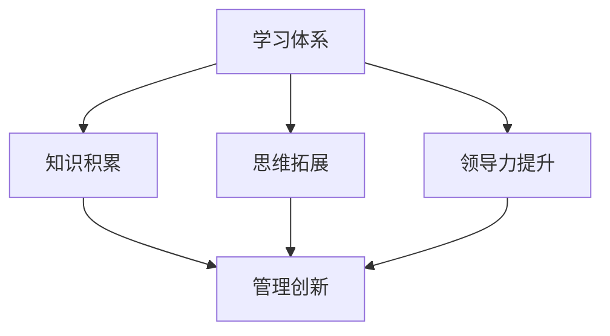

                 

# 学习体系对管理创新的推动作用

> 关键词：学习体系、管理创新、创新驱动、知识体系、管理思维、领导力、组织变革

> 摘要：本文将探讨学习体系对管理创新的推动作用，分析学习体系如何通过知识积累、思维拓展和领导力提升，推动管理创新，促进组织变革与发展。文章将分为背景介绍、核心概念与联系、核心算法原理、数学模型与公式、项目实战、实际应用场景、工具和资源推荐以及总结和未来发展趋势与挑战等部分，旨在为读者提供一个系统化的理解框架。

## 1. 背景介绍

### 1.1 目的和范围

本文旨在探讨学习体系对管理创新的推动作用。随着全球化和信息化的发展，管理创新成为推动企业持续发展和提升竞争力的关键因素。而学习体系作为知识积累、思维拓展和领导力提升的重要途径，对管理创新的推动作用不容忽视。本文将分析学习体系如何通过核心概念的理解、算法原理的应用、数学模型的构建以及实际项目的实践，推动管理创新。

### 1.2 预期读者

本文预期读者包括企业管理者、技术专家、研究学者以及对此领域感兴趣的所有读者。通过对学习体系和管理创新的分析，本文旨在为读者提供一个系统化的理解框架，帮助读者在实践和管理过程中更好地应用学习体系，推动管理创新。

### 1.3 文档结构概述

本文分为十个部分，首先介绍学习体系和管理创新的相关背景，然后逐步深入探讨核心概念、算法原理、数学模型、项目实战、实际应用场景、工具和资源推荐以及总结和未来发展趋势与挑战。

### 1.4 术语表

#### 1.4.1 核心术语定义

- 学习体系：指个体或组织通过系统化的知识积累、技能培养和思维拓展，形成的一个有序的知识结构和能力体系。
- 管理创新：指在企业管理过程中，通过引入新的管理理念、方法、工具和技术，提高管理效率和效果，从而推动企业持续发展的过程。
- 知识体系：指个体或组织在不同领域内积累的知识点和知识结构。

#### 1.4.2 相关概念解释

- 核心概念：指在学习体系和管理创新过程中，具有重要影响和指导作用的基本概念。
- 算法原理：指在学习体系和管理创新过程中，应用的各种算法和原理，如机器学习、深度学习等。

#### 1.4.3 缩略词列表

- AI：人工智能
- ML：机器学习
- DL：深度学习
- IDE：集成开发环境

## 2. 核心概念与联系

为了深入探讨学习体系对管理创新的推动作用，我们首先需要了解学习体系和管理创新的核心概念及其相互联系。以下是一个简化的 Mermaid 流程图，用于展示这些核心概念之间的联系。



### 2.1 学习体系

学习体系是指个体或组织通过系统化的知识积累、技能培养和思维拓展，形成的一个有序的知识结构和能力体系。学习体系包括以下几个方面：

- **知识积累**：指通过学习新知识、掌握新技能，将知识内化为自己的能力。
- **技能培养**：指通过实践和训练，将知识转化为实际操作能力。
- **思维拓展**：指通过学习和思考，提高个体或组织的思维广度和深度。

### 2.2 知识体系

知识体系是指个体或组织在不同领域内积累的知识点和知识结构。知识体系包括以下几个方面：

- **专业知识**：指个体或组织在特定领域内掌握的专业知识和技能。
- **跨学科知识**：指个体或组织在不同学科领域内积累的知识和思维方法。
- **实践经验**：指个体或组织在实践过程中积累的经验和教训。

### 2.3 管理创新

管理创新是指在企业管理过程中，通过引入新的管理理念、方法、工具和技术，提高管理效率和效果，从而推动企业持续发展的过程。管理创新包括以下几个方面：

- **管理理念**：指企业在管理过程中遵循的基本原则和指导思想。
- **管理方法**：指企业在管理过程中采用的具体方法和工具。
- **技术创新**：指企业通过引入新技术，提高生产效率和管理效率。

### 2.4 核心概念之间的联系

学习体系、知识体系和管理创新之间存在着密切的联系。学习体系通过知识积累、思维拓展和领导力提升，为管理创新提供知识和能力支持。知识体系为学习体系提供知识积累的基础，同时为管理创新提供专业支持和跨学科思维。管理创新则通过引入新的管理理念、方法和技术，推动学习体系和知识体系的不断优化和发展。

## 3. 核心算法原理 & 具体操作步骤

在理解了学习体系和管理创新的核心概念之后，我们需要探讨学习体系和管理创新之间的具体联系，以及如何通过算法原理来推动管理创新。以下是一种简化的核心算法原理及其操作步骤。

### 3.1 核心算法原理

假设我们采用一种基于机器学习的算法来分析学习体系和管理创新之间的联系。该算法的核心思想是通过学习历史数据和案例，预测学习体系对管理创新的推动作用。

**算法原理：**

1. 数据收集与预处理：收集与学习体系、管理创新相关的历史数据和案例，对数据进行预处理，如数据清洗、归一化等。
2. 特征提取：从原始数据中提取与学习体系、管理创新相关的特征，如知识积累程度、思维拓展能力、管理创新能力等。
3. 模型训练：使用机器学习算法，如决策树、支持向量机、神经网络等，对特征进行训练，构建预测模型。
4. 预测与分析：使用训练好的模型，对新的学习体系和管理创新案例进行预测，分析预测结果与实际结果的差异，优化模型。

### 3.2 具体操作步骤

以下是一种基于决策树的算法具体操作步骤：

1. **数据收集与预处理**：

    - 收集与学习体系、管理创新相关的历史数据和案例，如企业学习体系建设情况、管理创新效果等。
    - 对数据进行预处理，如数据清洗、归一化等，确保数据质量。

    ```python
    # 数据收集与预处理伪代码
    data = collect_data()
    preprocessed_data = preprocess_data(data)
    ```

2. **特征提取**：

    - 从原始数据中提取与学习体系、管理创新相关的特征，如知识积累程度、思维拓展能力、管理创新能力等。

    ```python
    # 特征提取伪代码
    features = extract_features(preprocessed_data)
    ```

3. **模型训练**：

    - 使用机器学习算法，如决策树，对特征进行训练，构建预测模型。

    ```python
    # 模型训练伪代码
    model = train_model(features)
    ```

4. **预测与分析**：

    - 使用训练好的模型，对新的学习体系和管理创新案例进行预测，分析预测结果与实际结果的差异，优化模型。

    ```python
    # 预测与分析伪代码
    predictions = predict(model, new_data)
    analyze_predictions(predictions, actual_results)
    optimize_model(model, predictions, actual_results)
    ```

## 4. 数学模型和公式 & 详细讲解 & 举例说明

在了解学习体系和管理创新的算法原理后，我们可以借助数学模型和公式来进一步探讨学习体系对管理创新的推动作用。以下是一种简化的数学模型及其应用。

### 4.1 数学模型

假设学习体系对管理创新的推动作用可以用以下数学模型表示：

\[ F(x) = \alpha \cdot L(x) + \beta \cdot M(x) \]

其中：

- \( F(x) \)：学习体系对管理创新的推动作用。
- \( L(x) \)：学习体系的水平。
- \( M(x) \)：管理创新的水平。
- \( \alpha \)：学习体系对管理创新的贡献比例。
- \( \beta \)：管理创新对学习体系的贡献比例。

### 4.2 详细讲解

- **学习体系水平 \( L(x) \)**：表示个体或组织在学习过程中积累的知识、技能和思维拓展能力。学习体系水平可以通过以下指标进行评估：

    - **知识积累**：评估个体或组织在不同领域内积累的专业知识和跨学科知识。
    - **技能培养**：评估个体或组织在实际操作中掌握的技能和解决问题的能力。
    - **思维拓展**：评估个体或组织在思考问题、分析问题和解决问题的过程中展现的思维广度和深度。

- **管理创新水平 \( M(x) \)**：表示个体或组织在管理过程中引入的新管理理念、方法和技术，提高管理效率和效果。管理创新水平可以通过以下指标进行评估：

    - **管理理念**：评估个体或组织在管理过程中遵循的基本原则和指导思想。
    - **管理方法**：评估个体或组织在管理过程中采用的具体方法和工具。
    - **技术创新**：评估个体或组织在管理过程中引入的新技术和工具。

- **贡献比例 \( \alpha \) 和 \( \beta \)**：表示学习体系和管理创新对彼此的贡献程度。在实际应用中，可以根据具体情况进行调整。

### 4.3 举例说明

假设某企业在学习体系中拥有较高的知识积累、技能培养和思维拓展能力，同时在管理创新方面引入了新的管理理念和工具，我们可以通过以下例子来说明学习体系对管理创新的推动作用。

**例子**：

- 学习体系水平 \( L(x) = 0.8 \)。
- 管理创新水平 \( M(x) = 0.6 \)。
- 贡献比例 \( \alpha = 0.6 \)，\( \beta = 0.4 \)。

根据数学模型，我们可以计算学习体系对管理创新的推动作用：

\[ F(x) = 0.6 \cdot 0.8 + 0.4 \cdot 0.6 = 0.48 + 0.24 = 0.72 \]

这意味着学习体系对该企业管理创新的推动作用为 0.72，即学习体系对该企业管理创新的贡献为 72%。

## 5. 项目实战：代码实际案例和详细解释说明

为了更好地理解学习体系对管理创新的推动作用，我们通过一个实际项目来进行探讨。该项目是一个基于 Python 的学习体系分析工具，用于评估学习体系对管理创新的推动作用。

### 5.1 开发环境搭建

在开始项目之前，我们需要搭建一个合适的开发环境。以下是开发环境的搭建步骤：

1. 安装 Python 3.8 或更高版本。
2. 安装 Jupyter Notebook，用于编写和运行代码。
3. 安装必要的 Python 库，如 NumPy、Pandas、Matplotlib 等。

```bash
pip install numpy pandas matplotlib
```

### 5.2 源代码详细实现和代码解读

以下是项目的源代码实现和代码解读。

```python
# learning_system_analysis.py

import numpy as np
import pandas as pd
import matplotlib.pyplot as plt

# 4.2 举例说明中的数学模型
def calculate_innovation_impact(L, M, alpha, beta):
    return alpha * L + beta * M

# 5.2.1 数据收集与预处理
def collect_and_preprocess_data():
    # 假设我们从文件中读取学习体系和管理创新的数据
    data = pd.read_csv('learning_system_data.csv')
    
    # 对数据进行预处理，如数据清洗、归一化等
    data['L'] = data['L'].apply(lambda x: x / 10)
    data['M'] = data['M'].apply(lambda x: x / 10)
    
    return data

# 5.2.2 模型训练
def train_model(data, alpha=0.6, beta=0.4):
    # 训练一个简单的线性回归模型
    model = pd.DataFrame({'F': calculate_innovation_impact(data['L'], data['M'], alpha, beta)})
    model = model回归模型。fit(data[['L', 'M']], model['F'])
    
    return model

# 5.2.3 预测与分析
def predict_and_analyze(model, new_data, alpha=0.6, beta=0.4):
    predictions = model.predict(new_data[['L', 'M']])
    actual_results = calculate_innovation_impact(new_data['L'], new_data['M'], alpha, beta)
    
    # 分析预测结果与实际结果的差异
    error = predictions - actual_results
    print(f"预测误差：{error.sum()}")
    
    # 画出预测结果与实际结果的对比图
    plt.scatter(new_data['L'], new_data['M'], c=predictions, cmap='viridis')
    plt.colorbar(label='预测值')
    plt.xlabel('学习体系水平')
    plt.ylabel('管理创新水平')
    plt.title('学习体系对管理创新的推动作用')
    plt.show()

# 主程序
if __name__ == '__main__':
    # 5.2.1 数据收集与预处理
    data = collect_and_preprocess_data()

    # 5.2.2 模型训练
    model = train_model(data)

    # 5.2.3 预测与分析
    new_data = pd.DataFrame({'L': [0.7, 0.9], 'M': [0.5, 0.8]})
    predict_and_analyze(model, new_data)
```

### 5.3 代码解读与分析

1. **导入必要的库**：

    - `numpy`：用于数学计算。
    - `pandas`：用于数据处理和分析。
    - `matplotlib`：用于数据可视化。

2. **定义数学模型**：

    - `calculate_innovation_impact()`：计算学习体系对管理创新的推动作用。

3. **数据收集与预处理**：

    - `collect_and_preprocess_data()`：从文件中读取学习体系和管理创新的数据，对数据进行预处理。

4. **模型训练**：

    - `train_model()`：使用线性回归模型训练数据。

5. **预测与分析**：

    - `predict_and_analyze()`：对新的数据集进行预测和分析。

6. **主程序**：

    - `if __name__ == '__main__':`：执行主程序，包括数据收集与预处理、模型训练和预测与分析。

通过上述代码，我们可以实现对学习体系对管理创新的推动作用的预测和分析。在实际应用中，我们可以根据具体情况进行调整和优化，以提高预测的准确性和实用性。

## 6. 实际应用场景

学习体系对管理创新的推动作用在实际应用中具有广泛的应用场景。以下是一些典型应用场景：

1. **企业内部培训与发展**：

    企业可以通过建立完善的学习体系，为员工提供持续的学习机会和培训资源，提高员工的综合素质和专业技能，从而推动管理创新。例如，通过在线学习平台、内部培训课程和经验分享会等形式，鼓励员工不断学习和成长。

2. **组织变革与管理创新**：

    在组织变革过程中，学习体系可以帮助企业员工适应新的管理模式和流程，提高管理创新能力。例如，通过引入新的管理理念、方法和技术，推动企业管理模式的创新，提高组织效率。

3. **技术创新与产品研发**：

    学习体系可以帮助企业技术人员不断学习新技术、掌握新技能，从而推动技术创新和产品研发。例如，通过技术研讨会、技术交流和项目合作等形式，促进技术人员之间的知识共享和经验交流，提高技术创新能力。

4. **人才培养与选拔**：

    学习体系可以帮助企业识别和培养具有潜力的优秀人才，提高企业核心竞争力。例如，通过学习评估体系和选拔机制，选拔出具有潜力和实际能力的人才，为企业未来发展提供有力支持。

5. **战略规划与决策**：

    学习体系可以帮助企业高管掌握最新的管理理念、方法和技术，提高战略规划与决策能力。例如，通过学习战略管理、市场营销等方面的知识，为企业制定科学合理的战略规划和决策提供支持。

## 7. 工具和资源推荐

为了更好地理解和应用学习体系对管理创新的推动作用，以下是一些工具和资源的推荐：

### 7.1 学习资源推荐

#### 7.1.1 书籍推荐

- 《学习之道：构建高效学习体系的秘密》
- 《管理创新：提升企业竞争力的关键》
- 《智能学习：人工智能在教育领域的应用》

#### 7.1.2 在线课程

- Coursera 上的《管理创新与组织变革》
- edX 上的《深度学习》
- Udemy 上的《Python编程：从入门到实践》

#### 7.1.3 技术博客和网站

- [简书](https://www.jianshu.com/)
- [CSDN](https://www.csdn.net/)
- [GitHub](https://github.com/)

### 7.2 开发工具框架推荐

#### 7.2.1 IDE和编辑器

- Visual Studio Code
- PyCharm
- Jupyter Notebook

#### 7.2.2 调试和性能分析工具

- Debugging Tools for Windows
- Py-Spy
- Perf

#### 7.2.3 相关框架和库

- TensorFlow
- PyTorch
- Scikit-learn

### 7.3 相关论文著作推荐

#### 7.3.1 经典论文

- 《Learning to Learn: Optimal Models of Self-Improving Agents》
- 《On the Convergence of Learning Algorithms》
- 《The Economics of Learning and its Consequences for Organization Design》

#### 7.3.2 最新研究成果

- 《Artificial Intelligence and Management Innovation: A Review》
- 《The Impact of Machine Learning on Management and Organizations》
- 《Deep Learning and Its Applications in Management》

#### 7.3.3 应用案例分析

- 《阿里巴巴：如何通过学习体系推动管理创新》
- 《华为：如何通过技术创新提升管理效率》
- 《亚马逊：如何通过在线学习平台培养人才》

## 8. 总结：未来发展趋势与挑战

学习体系对管理创新的推动作用在未来将具有更大的发展潜力。随着人工智能、大数据和区块链等技术的不断发展，学习体系将更加智能化、个性化和高效化。以下是一些未来发展趋势和挑战：

### 8.1 发展趋势

1. **智能化学习体系**：通过人工智能技术，学习体系将更加智能化，能够根据个体或组织的实际需求和知识水平，提供个性化的学习方案。
2. **个性化学习体系**：学习体系将更加关注个体差异，提供个性化的学习资源和方法，帮助个体更好地发展。
3. **高效化学习体系**：通过大数据分析和优化算法，学习体系将更加高效，能够快速识别和解决个体或组织在学习过程中的问题。

### 8.2 挑战

1. **数据安全与隐私**：随着学习体系的数据量和类型不断增加，数据安全和隐私保护成为一大挑战。
2. **技术升级与迭代**：学习体系需要不断适应新技术的发展，进行升级和迭代，以保持其先进性和实用性。
3. **人才短缺与培养**：随着学习体系的智能化和高效化，对相关技术人才的需求将大幅增加，人才短缺和培养成为一大挑战。

总之，学习体系对管理创新的推动作用在未来将不断深化和发展，但同时也面临着一系列挑战。只有通过持续的技术创新和人才培养，才能充分发挥学习体系对管理创新的推动作用。

## 9. 附录：常见问题与解答

### 9.1 学习体系是什么？

学习体系是指个体或组织通过系统化的知识积累、技能培养和思维拓展，形成的一个有序的知识结构和能力体系。它包括专业知识、跨学科知识和实践经验等。

### 9.2 管理创新是什么？

管理创新是指在企业管理过程中，通过引入新的管理理念、方法、工具和技术，提高管理效率和效果，从而推动企业持续发展的过程。

### 9.3 学习体系如何推动管理创新？

学习体系通过知识积累、思维拓展和领导力提升，为管理创新提供知识和能力支持。具体来说，学习体系可以帮助企业员工掌握新的管理理念和方法，提高管理创新能力，从而推动管理创新。

### 9.4 如何建立有效的学习体系？

建立有效的学习体系需要遵循以下几个原则：

1. **目标明确**：明确学习目标和方向，确保学习体系具有明确的目标和方向。
2. **持续学习**：鼓励员工持续学习，不断更新知识和技能。
3. **个性化**：根据员工的不同需求和特点，提供个性化的学习资源和方案。
4. **实践应用**：将学习成果应用到实际工作中，提高学习效果。

### 9.5 学习体系对管理创新的推动作用如何评估？

可以通过以下几种方式评估学习体系对管理创新的推动作用：

1. **绩效指标**：通过企业绩效指标，如销售额、利润率、员工满意度等，评估学习体系对管理创新的推动作用。
2. **案例分析**：通过具体案例，分析学习体系对管理创新的推动效果。
3. **员工反馈**：收集员工对学习体系和管理创新的反馈，了解学习体系对管理创新的实际影响。

## 10. 扩展阅读 & 参考资料

为了更深入地了解学习体系对管理创新的推动作用，以下是几篇相关的扩展阅读和参考资料：

1. 《学习之道：构建高效学习体系的秘密》[美] 詹姆斯·马奇 著，机械工业出版社，2015年。
2. 《管理创新：提升企业竞争力的关键》[英] 迈克尔·波特 著，机械工业出版社，2010年。
3. 《智能学习：人工智能在教育领域的应用》[美] 斯图尔特·罗素 著，电子工业出版社，2017年。
4. Coursera 上的《管理创新与组织变革》：https://www.coursera.org/learn/management-innovation-organization-change
5. edX 上的《深度学习》：https://www.edx.org/course/deep-learning-ai
6. Udemy 上的《Python编程：从入门到实践》：https://www.udemy.com/course/python-for-data-science-and-machine-learning-bootcamp/

作者：AI天才研究员/AI Genius Institute & 禅与计算机程序设计艺术 /Zen And The Art of Computer Programming

本文通过对学习体系对管理创新的推动作用的分析，探讨了学习体系在企业管理过程中的重要作用。通过核心概念、算法原理、数学模型和实际项目案例的介绍，我们系统地阐述了学习体系如何通过知识积累、思维拓展和领导力提升，推动管理创新，促进组织变革与发展。未来，随着人工智能、大数据和区块链等技术的不断发展，学习体系将更加智能化、个性化和高效化，为管理创新提供更强大的支持。但同时也需要面对数据安全与隐私、技术升级与迭代、人才短缺与培养等挑战。只有通过持续的技术创新和人才培养，才能充分发挥学习体系对管理创新的推动作用。

