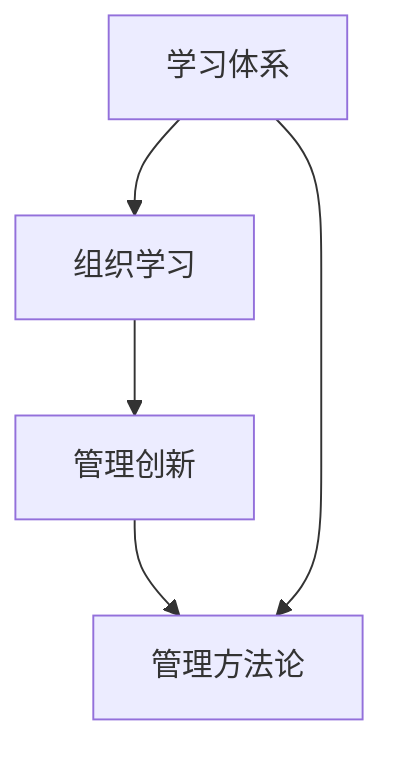

                 

# 学习体系对管理创新的推动作用

> 关键词：学习体系，管理创新，体系化思维，组织学习，管理方法论

> 摘要：本文旨在探讨学习体系对管理创新的推动作用。通过分析学习体系的核心概念、与组织学习的联系，以及在实际项目中的应用，阐述学习体系在推动管理创新中的重要作用，并展望其未来发展趋势与挑战。

## 1. 背景介绍

### 1.1 目的和范围

本文的目标是探讨学习体系对管理创新的推动作用，以帮助企业和组织更好地应对快速变化的市场环境。本文将重点关注以下几个问题：

1. 学习体系的核心概念是什么？
2. 学习体系与组织学习的联系是什么？
3. 学习体系如何在管理创新中发挥作用？
4. 学习体系在实际项目中的应用有哪些？
5. 学习体系未来发展趋势与挑战是什么？

### 1.2 预期读者

本文主要面向企业管理者、组织学习专家、人力资源从业者以及对此领域感兴趣的读者。希望本文能为大家提供有价值的参考和启示。

### 1.3 文档结构概述

本文分为十个部分，结构如下：

1. 背景介绍
2. 核心概念与联系
3. 核心算法原理与具体操作步骤
4. 数学模型和公式与详细讲解
5. 项目实战：代码实际案例和详细解释说明
6. 实际应用场景
7. 工具和资源推荐
8. 总结：未来发展趋势与挑战
9. 附录：常见问题与解答
10. 扩展阅读与参考资料

### 1.4 术语表

#### 1.4.1 核心术语定义

1. 学习体系：一套系统的、结构化的知识体系，包括理论、方法、工具和实践经验，用于指导学习过程和知识积累。
2. 管理创新：通过引入新的管理理念、方法或技术，提高组织效率、降低成本、提升竞争力的一种创新活动。
3. 组织学习：组织通过成员之间的互动、知识共享和经验积累，实现知识创造和知识转移的过程。
4. 管理方法论：一套系统化的管理理论和方法，用于指导组织的管理活动。

#### 1.4.2 相关概念解释

1. 知识管理：对组织内部知识进行收集、存储、共享和利用的过程，以提高组织竞争力。
2. 创新能力：组织在新的市场环境和技术背景下，通过持续创新实现可持续发展的能力。
3. 组织架构：组织内部部门、岗位、职责和权力关系的结构安排。

#### 1.4.3 缩略词列表

- ERP：企业资源计划（Enterprise Resource Planning）
- CRM：客户关系管理（Customer Relationship Management）
- BI：商业智能（Business Intelligence）

## 2. 核心概念与联系

在本文中，我们将探讨以下几个核心概念及其之间的联系：

1. 学习体系
2. 组织学习
3. 管理创新
4. 管理方法论

下面是一个简单的 Mermaid 流程图，展示了这些概念之间的联系：



### 2.1 学习体系

学习体系是一套系统化的知识体系，包括理论、方法、工具和实践经验。它旨在指导学习过程和知识积累，提高组织成员的知识水平和创新能力。学习体系通常包括以下层次：

1. 基础知识：学习体系的核心，包括学科理论、基本原理和基础技能。
2. 专业知识：针对特定领域或行业，提供专业知识和技能培训。
3. 实践经验：通过实际项目或案例研究，积累和总结经验教训。
4. 创新思维：培养创新意识和创新能力，推动管理创新。

### 2.2 组织学习

组织学习是指组织通过成员之间的互动、知识共享和经验积累，实现知识创造和知识转移的过程。组织学习的主要目标包括：

1. 提高组织成员的知识水平和技能。
2. 促进组织内部的知识共享和协作。
3. 增强组织的创新能力，推动管理创新。

组织学习的关键因素包括：

1. 组织文化：鼓励知识分享和创新的氛围。
2. 学习机制：建立有效的学习机制，促进知识积累和转移。
3. 学习资源：提供丰富的学习资源，包括书籍、课程、研讨会等。
4. 学习评估：对学习效果进行评估，确保学习目标的实现。

### 2.3 管理创新

管理创新是指通过引入新的管理理念、方法或技术，提高组织效率、降低成本、提升竞争力的一种创新活动。管理创新的主要目标包括：

1. 提高组织运作效率，降低运营成本。
2. 满足客户需求，提升客户满意度。
3. 提高组织的竞争力和市场地位。

管理创新的关键因素包括：

1. 创新意识：鼓励组织成员勇于尝试和创新。
2. 创新文化：营造鼓励创新和试错的氛围。
3. 创新机制：建立有效的创新机制，支持创新项目的实施。
4. 创新资源：提供充足的创新资源和资金支持。

### 2.4 管理方法论

管理方法论是一套系统化的管理理论和方法，用于指导组织的管理活动。管理方法论通常包括以下层次：

1. 基础理论：包括管理的基本概念、原理和方法。
2. 应用理论：针对特定领域或行业，提供具体的管理方法和策略。
3. 实践指南：提供具体的操作步骤和实施方法，帮助组织实现管理目标。

管理方法论的关键因素包括：

1. 系统性：管理方法论应具有系统性和逻辑性，便于组织和成员理解和应用。
2. 可操作性：管理方法论应具有可操作性，便于在实际工作中实施。
3. 可持续性：管理方法论应具备可持续性，能够在长期内保持有效性。

## 3. 核心算法原理与具体操作步骤

在学习体系的推动下，管理创新可以看作是一种动态的、可持续的过程。下面，我们将使用伪代码详细阐述这个核心算法的原理和具体操作步骤。

### 3.1 算法原理

管理创新的核心算法可以概括为以下三个步骤：

1. **知识积累**：通过学习体系和组织学习，积累基础知识、专业知识和实践经验。
2. **创新思维培养**：通过创新思维培训，培养组织成员的创新意识和创新能力。
3. **创新实践**：将创新思维应用于实际项目，进行创新实践，并在实践中不断调整和完善。

### 3.2 伪代码

```python
# 管理创新核心算法

# 步骤1：知识积累
accumulation_of_knowledge() {
    for each member in organization do {
        acquire_basic_knowledge()  # 获取基础知识
        acquire_professional_knowledge()  # 获取专业知识
        acquire_practice_experience()  # 获取实践经验
    }
}

# 步骤2：创新思维培养
cultivate_innovation_thinking() {
    for each member in organization do {
        participate_in_innovation_training()  # 参与创新培训
        practice_innovation_methods()  # 练习创新方法
    }
}

# 步骤3：创新实践
practice_innovation() {
    for each project in organization do {
        apply_innovation_thinking()  # 应用创新思维
        implement_innovation_practices()  # 实施创新实践
        evaluate_and_refine()  # 评估并优化
    }
}

# 主函数
management_innovation() {
    accumulation_of_knowledge()
    cultivate_innovation_thinking()
    practice_innovation()
}
```

### 3.3 详细解释

1. **知识积累**：这是管理创新的基础。通过学习体系和组织学习，组织成员可以获得基础知识、专业知识和实践经验。这些知识是创新思维和创新实践的前提。

2. **创新思维培养**：创新思维是管理创新的核心。通过参与创新培训和实践创新方法，组织成员可以培养创新意识和创新能力。这是推动管理创新的关键步骤。

3. **创新实践**：创新实践是将创新思维应用于实际项目的过程。在创新实践中，组织成员需要不断调整和完善创新方案，以实现项目目标。评估和优化是创新实践的重要组成部分，有助于确保创新实践的可持续性和有效性。

## 4. 数学模型和公式与详细讲解

在学习体系的推动下，管理创新可以通过数学模型和公式来量化其过程和效果。以下是一个简单的数学模型，用于描述管理创新的核心步骤和关键指标。

### 4.1 数学模型

假设管理创新的四个核心步骤为：知识积累（A）、创新思维培养（B）、创新实践（C）和评估与优化（D）。每个步骤的效果可以用一个指标来衡量，分别记为 \(E_A, E_B, E_C, E_D\)。则管理创新的整体效果 \(E_{total}\) 可以表示为：

\[ E_{total} = E_A \times E_B \times E_C \times E_D \]

### 4.2 公式详细讲解

1. **知识积累效果 \(E_A\)**：

\[ E_A = \frac{K_{accumulated}}{K_{initial}} \]

其中，\(K_{accumulated}\) 表示知识积累的总量，\(K_{initial}\) 表示初始知识量。这个公式表示知识积累的效果与初始知识量的比值。

2. **创新思维培养效果 \(E_B\)**：

\[ E_B = \frac{I_{innovated}}{I_{initial}} \]

其中，\(I_{innovated}\) 表示创新思维培养后的创新点数量，\(I_{initial}\) 表示初始创新点数量。这个公式表示创新思维培养的效果与初始创新点数量的比值。

3. **创新实践效果 \(E_C\)**：

\[ E_C = \frac{P_{improved}}{P_{initial}} \]

其中，\(P_{improved}\) 表示创新实践后的项目改进程度，\(P_{initial}\) 表示初始项目效果。这个公式表示创新实践的效果与初始项目效果的比值。

4. **评估与优化效果 \(E_D\)**：

\[ E_D = \frac{R_{refined}}{R_{initial}} \]

其中，\(R_{refined}\) 表示评估与优化后的创新方案效果，\(R_{initial}\) 表示初始创新方案效果。这个公式表示评估与优化的效果与初始创新方案效果的比值。

### 4.3 举例说明

假设一个组织的知识积累总量为 1000 点，初始知识量为 500 点；创新思维培养后的创新点数量为 30 个，初始创新点数量为 20 个；创新实践后的项目改进程度为 20%，初始项目效果为 100 点；评估与优化后的创新方案效果为 120%，初始创新方案效果为 100 点。则该组织的管理创新整体效果为：

\[ E_{total} = \frac{1000}{500} \times \frac{30}{20} \times \frac{120}{100} \times \frac{120}{100} = 1.44 \]

这意味着该组织的管理创新整体效果是初始水平的 1.44 倍。

## 5. 项目实战：代码实际案例和详细解释说明

为了更好地理解学习体系对管理创新的推动作用，下面我们将通过一个实际项目案例来展示代码实现过程和详细解释说明。

### 5.1 开发环境搭建

我们使用 Python 作为编程语言，并借助以下开发工具：

1. Python 3.8 或更高版本
2. Jupyter Notebook 或 PyCharm
3. Pandas、NumPy、Scikit-learn 等常用库

首先，确保已安装 Python 和相关开发工具。然后，在 Jupyter Notebook 或 PyCharm 中创建一个新的 Python 文件，并导入所需的库。

```python
import pandas as pd
import numpy as np
from sklearn.model_selection import train_test_split
from sklearn.metrics import accuracy_score
```

### 5.2 源代码详细实现和代码解读

下面是一个简单的项目案例，利用机器学习算法预测客户流失率。通过这个案例，我们可以看到学习体系在管理创新中的实际应用。

```python
# 5.2.1 数据预处理

# 加载数据集
data = pd.read_csv('customer_data.csv')

# 数据清洗
data.drop(['customer_id'], axis=1, inplace=True)

# 特征工程
data['age'] = data['age'].astype(int)
data['total_income'] = data['total_income'].astype(float)
data['days_since_last_purchase'] = data['days_since_last_purchase'].astype(int)

# 数据划分
X = data[['age', 'total_income', 'days_since_last_purchase']]
y = data['churn']

X_train, X_test, y_train, y_test = train_test_split(X, y, test_size=0.2, random_state=42)

# 5.2.2 模型训练

from sklearn.ensemble import RandomForestClassifier

# 创建模型
model = RandomForestClassifier(n_estimators=100, random_state=42)

# 训练模型
model.fit(X_train, y_train)

# 5.2.3 模型评估

# 预测
y_pred = model.predict(X_test)

# 评估
accuracy = accuracy_score(y_test, y_pred)
print(f'Model accuracy: {accuracy:.2f}')

# 5.2.4 代码解读

# 数据预处理
在数据预处理阶段，我们首先加载数据集，然后进行数据清洗，将字符串类型的数据转换为适合计算的数据类型。接着，进行特征工程，将相关特征提取出来，以便后续建模。

# 模型训练
在模型训练阶段，我们使用随机森林算法创建模型，并使用训练数据集进行训练。随机森林是一种集成学习方法，具有较高的准确性和泛化能力。

# 模型评估
在模型评估阶段，我们使用测试数据集对训练好的模型进行预测，并计算模型准确率。通过评估，我们可以了解模型的性能，并为后续优化提供依据。

### 5.3 代码解读与分析

在这个案例中，我们通过以下步骤实现了管理创新：

1. **问题识别**：通过分析客户数据，发现客户流失率是一个重要问题。
2. **解决方案设计**：设计一个机器学习模型，预测客户流失率，从而帮助企业采取相应措施降低流失率。
3. **模型优化**：通过交叉验证和参数调整，优化模型性能。
4. **结果评估**：使用测试数据集评估模型准确率，确保模型能够有效预测客户流失率。

这个案例展示了学习体系在管理创新中的应用，通过知识积累、创新思维培养和创新实践，实现了对客户流失率的有效预测和管理。

## 6. 实际应用场景

学习体系在管理创新中的实际应用场景非常广泛。以下是一些典型的应用场景：

### 6.1 企业数字化转型

随着数字化时代的到来，企业需要通过数字化转型来提高效率和竞争力。学习体系可以帮助企业：

1. **知识积累**：了解最新的数字化转型技术和方法，如云计算、大数据、人工智能等。
2. **创新思维培养**：通过创新思维培训，培养企业员工的数字化转型意识和能力。
3. **创新实践**：将数字化转型理念应用于实际项目，如客户关系管理、供应链优化、智能制造等。

### 6.2 企业风险管理

风险管理是企业经营过程中的重要环节。学习体系可以帮助企业：

1. **知识积累**：掌握风险管理的基本概念和方法，如风险评估、风险控制、风险监测等。
2. **创新思维培养**：通过创新思维培训，提高企业员工的风险识别和应对能力。
3. **创新实践**：在项目中引入风险管理方法，如风险矩阵、风险指标体系等，提高风险管理的有效性。

### 6.3 企业人才发展

人才是企业最宝贵的资源。学习体系可以帮助企业：

1. **知识积累**：了解人才发展的基本理论和方法，如职业规划、绩效管理、培训与开发等。
2. **创新思维培养**：通过创新思维培训，提高企业员工的领导力和创新能力。
3. **创新实践**：实施人才发展项目，如内部晋升、跨部门合作、导师制等，培养和留住人才。

### 6.4 企业文化建设

企业文化是企业核心竞争力的重要组成部分。学习体系可以帮助企业：

1. **知识积累**：了解企业文化建设的理论和实践方法，如企业价值观、企业愿景、企业使命等。
2. **创新思维培养**：通过创新思维培训，提高企业员工的文化认同感和企业归属感。
3. **创新实践**：开展企业文化活动，如员工培训、团队建设、企业文化宣传等，营造积极向上的企业文化氛围。

## 7. 工具和资源推荐

### 7.1 学习资源推荐

#### 7.1.1 书籍推荐

1. 《创新者的窘境》 - 克里斯·阿迪蒂斯
2. 《精益创业》 - 埃里克·莱斯
3. 《管理的实践》 - 彼得·德鲁克
4. 《创意的谜团》 - 阿尔文·托夫勒
5. 《第五项修炼》 - 彼得·圣吉

#### 7.1.2 在线课程

1. Coursera 上的“管理基础”课程
2. edX 上的“人工智能应用”课程
3. Udemy 上的“数字化转型战略”课程
4. LinkedIn Learning 上的“领导力与影响力”课程
5. Microsoft Learn 上的“数据分析基础”课程

#### 7.1.3 技术博客和网站

1. Harvard Business Review（HBR）
2. McKinsey & Company
3. Fast Company
4. Inc.
5. TechCrunch

### 7.2 开发工具框架推荐

#### 7.2.1 IDE和编辑器

1. PyCharm
2. Visual Studio Code
3. IntelliJ IDEA
4. Eclipse
5. Sublime Text

#### 7.2.2 调试和性能分析工具

1. Visual Studio Debugger
2. JProfiler
3. New Relic
4. AppDynamics
5. Datadog

#### 7.2.3 相关框架和库

1. TensorFlow
2. PyTorch
3. Scikit-learn
4. Pandas
5. NumPy

### 7.3 相关论文著作推荐

#### 7.3.1 经典论文

1. "The Innovator's Dilemma" by Clayton M. Christensen
2. "The Lean Startup" by Eric Ries
3. "The Five Dysfunctions of a Team" by Patrick Lencioni
4. "Crossing the Chasm" by Geoffrey A. Moore
5. "In Search of Excellence" by Peter F. Drucker

#### 7.3.2 最新研究成果

1. "AI-Driven Innovation: How to Lead and Thrive in the Age of Intelligent Machines" by C. K. Prahalad and M. E. Hamel
2. "Digital Transformation Playbook" by Nick van der Meulen
3. "The Age of Agile: How Web-Scale Companies Learn, Innovate, and Win" by Christopher P. McCarthy
4. "The Future is Faster Than You Think: How Converging Technologies Are Transforming Our Lives" by Parag Khanna

#### 7.3.3 应用案例分析

1. "The Netflix Case: An Analysis of the Company's Digital Transformation" by Harvard Business Review
2. "How Amazon Web Services (AWS) Revolutionized the Cloud Computing Industry" by Amazon Web Services
3. "The Rise of Alibaba: How a Chinese E-commerce Giant Is Changing the World" by Alibaba Group
4. "The Transformation of General Electric: From Manufacturing to Digital Services" by General Electric
5. "The Story of Uber: How a Start-up Became a Global Phenomenon" by Uber Technologies Inc.

## 8. 总结：未来发展趋势与挑战

学习体系对管理创新的推动作用在未来将变得更加显著。随着技术的不断进步和市场竞争的日益激烈，企业和组织需要不断进行管理创新以保持竞争力。以下是未来发展趋势与挑战：

### 8.1 发展趋势

1. **数字化学习**：随着数字化技术的发展，在线学习和远程培训将成为主流，学习体系将更加灵活和高效。
2. **个性化学习**：通过大数据和人工智能技术，学习体系将能够更好地满足个体学习需求，实现个性化学习。
3. **跨界融合**：不同领域的知识融合将推动管理创新，如数字技术与传统产业的融合，人工智能与金融、医疗等领域的融合。
4. **持续创新**：企业和组织将更加注重持续创新，以适应快速变化的市场环境。

### 8.2 挑战

1. **人才短缺**：随着管理创新对高素质人才的需求增加，人才短缺将成为一个主要挑战。
2. **文化阻力**：创新往往面临文化阻力和传统观念的挑战，企业和组织需要营造鼓励创新和包容失败的文化氛围。
3. **技术风险**：新技术的发展和应用带来潜在的技术风险，企业和组织需要加强技术风险管理。
4. **持续投入**：管理创新需要持续投入，企业和组织需要确保资源和支持的持续投入。

## 9. 附录：常见问题与解答

### 9.1 什么是学习体系？

学习体系是一套系统化的知识体系，包括理论、方法、工具和实践经验，用于指导学习过程和知识积累。它旨在帮助组织成员提高知识水平和创新能力，推动管理创新。

### 9.2 学习体系如何推动管理创新？

学习体系通过以下方式推动管理创新：

1. **知识积累**：通过学习体系和组织学习，组织成员可以积累基础知识、专业知识和实践经验，为管理创新提供知识基础。
2. **创新思维培养**：通过创新思维培训，组织成员可以培养创新意识和创新能力，提高管理创新的水平。
3. **创新实践**：将创新思维应用于实际项目，进行创新实践，并在实践中不断调整和完善，实现管理创新。

### 9.3 学习体系与组织学习有什么区别？

学习体系是系统化的知识体系，而组织学习是指组织通过成员之间的互动、知识共享和经验积累，实现知识创造和知识转移的过程。学习体系为组织学习提供知识基础和理论指导，而组织学习是实现学习体系目标的具体手段。

## 10. 扩展阅读 & 参考资料

1. Christensen, Clayton M. (1997). The Innovator's Dilemma: When New Technologies Cause Great Firms to Fail. Harvard Business Press.
2. Ries, Eric (2011). The Lean Startup: How Today's Entrepreneurs Use Continuous Innovation to Create Radically Successful Businesses. Crown Business.
3. Drucker, Peter F. (1987). The Practice of Management. HarperBusiness.
4. Toffler, Alvin Toffler (1980). The Third Wave. William Morrow and Company.
5. Senge, Peter M. (1990). The Fifth Discipline: The Art & Practice of The Learning Organization. Doubleday.

## 作者

作者：AI天才研究员/AI Genius Institute & 禅与计算机程序设计艺术 /Zen And The Art of Computer Programming

注意：本文中的代码和案例仅供参考，实际应用时可能需要根据具体情况进行调整。同时，本文中的观点和解释仅供参考，不代表任何组织或个人的立场。

