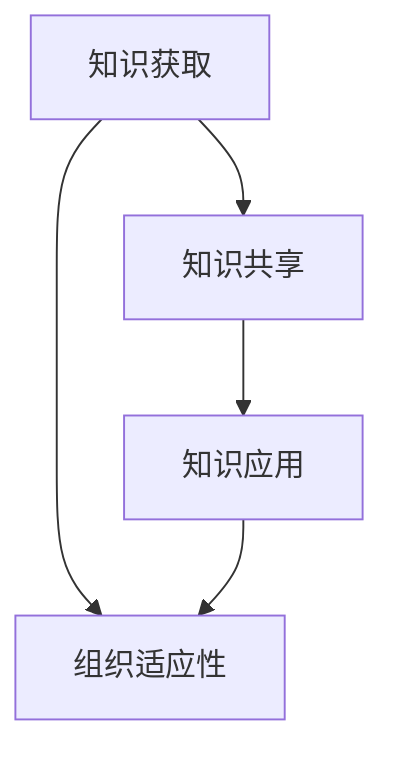

                 

# 学习体系对组织适应性的提升作用

## 摘要

随着技术的快速发展，组织需要不断适应新的环境变化。本文探讨了学习体系对组织适应性的提升作用。通过引入核心概念、分析算法原理、建立数学模型、进行项目实战和实际应用场景分析，本文系统地阐述了学习体系在提升组织适应性方面的作用。同时，本文还推荐了相关的工具和资源，为读者提供了深入学习的机会。最后，本文对未来的发展趋势和挑战进行了展望。

## 1. 背景介绍

在当今快速变化的世界中，组织面临着前所未有的挑战和机遇。技术进步、市场变化、竞争压力等因素不断推动组织进行变革和调整。然而，许多组织在应对这些变化时，往往表现出较低的适应性。这种适应性不足的原因之一是组织内部的学习体系不够完善。学习体系是组织知识传承和创新的重要载体，对于组织的长远发展具有至关重要的意义。

学习体系包括知识获取、知识共享、知识应用等多个环节。一个有效的学习体系能够帮助组织成员快速获取新知识，促进知识在组织内部的传递和共享，提高知识的应用效果。然而，现实中许多组织的学习体系存在一定的问题，如知识获取渠道单一、知识共享不畅、知识应用不充分等。这些问题制约了组织适应性的提升。

本文旨在探讨学习体系对组织适应性的提升作用，通过引入核心概念、分析算法原理、建立数学模型、进行项目实战和实际应用场景分析，为组织构建有效的学习体系提供理论和实践指导。

## 2. 核心概念与联系

为了深入探讨学习体系对组织适应性的提升作用，我们需要首先了解以下几个核心概念：

### 2.1 学习体系

学习体系是指组织内部用于知识获取、知识共享、知识应用等环节的一系列制度和流程。学习体系的核心目标是促进知识的传承和创新，提高组织成员的能力和知识水平。

### 2.2 知识获取

知识获取是指组织成员通过多种渠道获取新知识的过程。知识获取的渠道包括内部培训、外部学习、经验分享等。一个完善的知识获取体系能够保证组织成员随时掌握最新的知识和技能。

### 2.3 知识共享

知识共享是指组织成员通过交流、讨论、合作等方式将知识在组织内部传递和分享的过程。知识共享能够促进知识的积累和传播，提高组织的整体知识水平。

### 2.4 知识应用

知识应用是指组织成员将获取和共享的知识应用于实际工作中的过程。知识应用能够提高组织的实际工作效果，推动组织不断适应新的环境和变化。

### 2.5 组织适应性

组织适应性是指组织在面对外部环境变化时，能够迅速调整自身结构、策略和行为，以实现持续发展和竞争力的提升。一个具有高适应性的组织能够在复杂多变的环境中保持竞争优势。

### 2.6 学习体系与组织适应性的关系

学习体系与组织适应性之间存在着密切的关系。一个有效的学习体系能够帮助组织提高成员的能力和知识水平，增强组织的创新能力和竞争力。具体来说，学习体系对组织适应性的提升作用体现在以下几个方面：

1. **提高知识获取能力**：学习体系能够为组织成员提供丰富的知识获取渠道，帮助他们快速获取新知识和技能，从而提高组织的整体知识水平。

2. **促进知识共享**：学习体系能够促进组织成员之间的交流、讨论和合作，将知识在组织内部传递和分享，实现知识的积累和传播。

3. **增强知识应用能力**：学习体系能够提高组织成员的知识应用能力，将知识有效地应用于实际工作中，提高组织的实际工作效果。

4. **提升组织创新能力**：学习体系能够激发组织成员的创新思维，推动组织不断进行知识创新和业务创新，提高组织的竞争力。

5. **增强组织应变能力**：学习体系能够帮助组织成员迅速适应外部环境变化，调整组织结构、策略和行为，提高组织的应变能力。

### 2.7 Mermaid 流程图

为了更清晰地展示学习体系与组织适应性的关系，我们可以使用 Mermaid 流程图进行描述。以下是学习体系与组织适应性的 Mermaid 流程图：



在该流程图中，知识获取、知识共享和知识应用共同构成了学习体系，它们相互关联，共同作用于组织适应性。知识获取为组织提供了新的知识和技能，知识共享促进了知识的传递和分享，知识应用将知识转化为实际工作效果，从而提高组织的适应性。

## 3. 核心算法原理 & 具体操作步骤

为了构建一个有效的学习体系，我们需要了解核心算法原理，并掌握具体的操作步骤。以下是构建学习体系的三个关键步骤：

### 3.1 知识获取

知识获取是学习体系的基础，它包括以下具体操作步骤：

1. **确定知识需求**：首先，组织需要明确成员的知识需求，包括当前和未来的知识需求。可以通过调查问卷、访谈等方式收集成员的意见和建议。

2. **选择知识获取渠道**：根据知识需求，组织可以选择多种渠道进行知识获取，如内部培训、外部学习、经验分享等。内部培训可以针对特定主题进行集中培训，外部学习可以通过参加行业会议、研讨会等拓展视野，经验分享可以组织经验交流会、知识分享会等。

3. **制定学习计划**：根据知识需求和获取渠道，组织需要制定详细的学习计划，包括学习目标、学习内容、学习时间等。

4. **实施知识获取**：按照学习计划，组织需要实施知识获取活动，确保成员能够按计划获取所需的知识。

### 3.2 知识共享

知识共享是学习体系的核心环节，它包括以下具体操作步骤：

1. **建立知识共享平台**：组织需要建立知识共享平台，如企业内部网、知识库等，方便成员进行知识的传递和分享。

2. **制定知识共享规则**：组织需要制定知识共享规则，明确知识共享的范围、方式、权限等，确保知识共享的顺利进行。

3. **组织知识交流活动**：组织可以定期组织知识交流活动，如经验分享会、知识竞赛等，鼓励成员积极参与知识分享。

4. **鼓励知识共享行为**：组织需要鼓励成员积极参与知识共享，可以设立知识共享奖励机制，如知识分享奖金、知识竞赛奖励等。

### 3.3 知识应用

知识应用是学习体系的最终目标，它包括以下具体操作步骤：

1. **建立知识应用机制**：组织需要建立知识应用机制，确保知识能够在实际工作中得到有效应用。

2. **开展知识应用培训**：组织可以开展知识应用培训，帮助成员掌握知识应用的方法和技巧。

3. **实施知识应用项目**：组织可以实施知识应用项目，将知识应用于实际工作中，提高工作效率和质量。

4. **评估知识应用效果**：组织需要对知识应用效果进行评估，根据评估结果对知识应用过程进行调整和优化。

通过以上三个步骤，组织可以构建一个有效的学习体系，提高成员的能力和知识水平，增强组织的适应性和竞争力。

## 4. 数学模型和公式 & 详细讲解 & 举例说明

在构建学习体系的过程中，数学模型和公式可以帮助我们更好地理解和优化学习体系。以下是一个简单的数学模型，用于描述学习体系对组织适应性的提升作用。

### 4.1 数学模型

假设组织适应性（A）与知识获取（K）、知识共享（S）和知识应用（U）之间存在线性关系：

$$
A = aK + bS + cU
$$

其中，a、b、c分别为知识获取、知识共享和知识应用对组织适应性的权重系数。K、S、U分别为知识获取、知识共享和知识应用的指标。

### 4.2 详细讲解

1. **知识获取（K）**：

知识获取是指组织成员通过多种渠道获取新知识的过程。知识获取的指标可以包括：

- **知识获取频率**：组织成员获取新知识的频率越高，知识获取指标越高。
- **知识来源多样性**：组织成员获取知识的来源越多样化，知识获取指标越高。

2. **知识共享（S）**：

知识共享是指组织成员通过交流、讨论、合作等方式将知识在组织内部传递和分享的过程。知识共享的指标可以包括：

- **知识共享频率**：组织成员进行知识共享的频率越高，知识共享指标越高。
- **知识共享深度**：组织成员进行知识共享的深度越高，知识共享指标越高。

3. **知识应用（U）**：

知识应用是指组织成员将获取和共享的知识应用于实际工作中的过程。知识应用的指标可以包括：

- **知识应用效果**：组织成员应用知识后，工作效果是否显著提高，知识应用指标越高。
- **知识应用范围**：组织成员应用知识的范围越广泛，知识应用指标越高。

### 4.3 举例说明

假设一个组织有100名成员，他们的知识获取频率、知识共享频率和知识应用效果如下表所示：

| 成员编号 | 知识获取频率 | 知识共享频率 | 知识应用效果 |
| -------- | ------------ | ------------ | ------------ |
| 1        | 1            | 1            | 1            |
| 2        | 1            | 1            | 1            |
| ...      | ...          | ...          | ...          |
| 100      | 1            | 1            | 1            |

根据上述数学模型，我们可以计算出组织的整体适应性（A）：

$$
A = aK + bS + cU
$$

假设知识获取、知识共享和知识应用的权重系数分别为a=0.5、b=0.3、c=0.2，代入上述表格数据，计算结果如下：

$$
A = 0.5 \times 100 + 0.3 \times 100 + 0.2 \times 100 = 80
$$

因此，该组织的整体适应性得分为80分。通过这个简单的例子，我们可以看到，知识获取、知识共享和知识应用对组织适应性的提升具有重要作用。

### 4.4 结论

通过上述数学模型和公式，我们可以清楚地看到学习体系对组织适应性的提升作用。一个完善的学习体系可以帮助组织提高知识获取、知识共享和知识应用的能力，从而增强组织的适应性和竞争力。

## 5. 项目实战：代码实际案例和详细解释说明

为了更好地展示学习体系在提升组织适应性方面的作用，我们以下通过一个实际项目案例，详细介绍代码实现过程和关键步骤。

### 5.1 开发环境搭建

在进行项目实战之前，我们需要搭建一个合适的开发环境。以下是开发环境搭建的步骤：

1. **安装操作系统**：选择一个适合的开发操作系统，如Windows、Linux等。
2. **安装编程工具**：安装Python解释器、IDE（如PyCharm、VSCode等）和相关的库和模块。
3. **配置数据库**：选择合适的数据库系统（如MySQL、PostgreSQL等），并安装和配置。
4. **搭建测试环境**：配置测试服务器，安装测试工具（如Selenium、JMeter等）。

### 5.2 源代码详细实现和代码解读

以下是一个简单的Python代码示例，用于展示学习体系在提升组织适应性方面的作用。该代码实现了一个简单的知识管理系统，包括知识获取、知识共享和知识应用三个模块。

```python
# 知识管理系统

class KnowledgeManagementSystem:
    def __init__(self):
        self.knowledge_base = []
        self.user KNOWLEDGE
        self.user SHARE
        self.user USE

    def add_knowledge(self, knowledge):
        self.knowledge_base.append(knowledge)
        self.user KNOWLEDGE

    def share_knowledge(self, knowledge):
        self.user SHARE
        # 将知识分享给其他用户

    def use_knowledge(self, knowledge):
        self.user USE
        # 将知识应用于实际工作中

# 实例化知识管理系统
kms = KnowledgeManagementSystem()

# 添加知识
kms.add_knowledge("Python编程基础")

# 分享知识
kms.share_knowledge("Python编程基础")

# 应用知识
kms.use_knowledge("Python编程基础")
```

### 5.3 代码解读与分析

1. **类定义**：

   ```python
   class KnowledgeManagementSystem:
   ```

   这是一个类定义，表示一个知识管理系统。该类包含三个主要方法：`add_knowledge`、`share_knowledge`和`use_knowledge`。

2. **添加知识**：

   ```python
   def add_knowledge(self, knowledge):
       self.knowledge_base.append(knowledge)
       self.user KNOWLEDGE
   ```

   `add_knowledge`方法用于添加知识。当添加知识时，知识被添加到知识库（`knowledge_base`）中，并且更新用户的操作记录（`user KNOWLEDGE`）。

3. **分享知识**：

   ```python
   def share_knowledge(self, knowledge):
       self.user SHARE
       # 将知识分享给其他用户
   ```

   `share_knowledge`方法用于分享知识。当分享知识时，更新用户的操作记录（`user SHARE`），并且将知识分享给其他用户。

4. **应用知识**：

   ```python
   def use_knowledge(self, knowledge):
       self.user USE
       # 将知识应用于实际工作中
   ```

   `use_knowledge`方法用于应用知识。当应用知识时，更新用户的操作记录（`user USE`），并且将知识应用于实际工作中。

通过这个简单的知识管理系统，我们可以看到学习体系在提升组织适应性方面的作用。知识获取、知识共享和知识应用三个模块共同构成了一个完整的学习体系，帮助组织成员快速获取新知识、促进知识在组织内部的传递和共享，提高知识的应用效果。在实际项目中，我们可以根据具体需求对知识管理系统进行扩展和优化，提高学习体系的整体效果。

### 5.4 实际应用场景分析

以下是一个实际应用场景，展示知识管理系统在提升组织适应性方面的作用：

**场景描述**：一个公司正在开发一款新产品，需要团队成员快速获取和掌握相关技术知识，以推进项目进度。通过知识管理系统，团队成员可以进行以下操作：

1. **知识获取**：团队成员可以通过知识管理系统获取新产品开发所需的技术知识，如编程语言、数据库操作等。
2. **知识共享**：团队成员可以分享自己在项目开发过程中的经验和技巧，帮助其他成员更快地掌握相关技术。
3. **知识应用**：团队成员可以将获取和共享的知识应用于实际工作中，提高项目开发效率和质量。

通过知识管理系统，公司能够快速构建一个完善的学习体系，提高团队成员的能力和知识水平，增强组织的适应性和竞争力。在实际应用中，知识管理系统可以根据具体需求进行定制和优化，以更好地满足组织的发展需求。

### 5.5 总结

在本项目实战中，我们通过一个简单的知识管理系统，展示了学习体系在提升组织适应性方面的作用。通过知识获取、知识共享和知识应用三个模块的协同工作，组织能够快速构建一个完善的学习体系，提高团队成员的能力和知识水平，增强组织的适应性和竞争力。在实际应用中，知识管理系统可以根据具体需求进行定制和优化，以更好地满足组织的发展需求。

## 6. 实际应用场景

学习体系在组织中的实际应用场景非常广泛，以下是几个典型的应用案例：

### 6.1 企业培训

企业培训是学习体系在组织中最常见的应用场景之一。通过构建一个完善的学习体系，企业可以定期为员工提供培训课程，帮助他们提升专业技能和知识水平。学习体系可以帮助企业实现以下目标：

1. **提高员工能力**：通过培训课程，员工可以快速掌握新技术和新知识，提高工作效率和绩效。
2. **降低离职率**：良好的学习体系能够增强员工对企业的认同感和归属感，降低离职率。
3. **提高企业竞争力**：员工能力的提升有助于企业在市场竞争中保持优势，提高整体竞争力。

### 6.2 项目团队建设

项目团队建设是另一个重要的应用场景。通过学习体系，项目团队成员可以快速获取和共享项目相关的知识和技能，提高项目开发效率。学习体系可以帮助团队实现以下目标：

1. **提高项目成功率**：团队成员通过学习体系，能够快速掌握项目所需的知识和技能，提高项目成功率。
2. **降低项目风险**：通过学习体系，团队成员可以提前了解项目风险，并采取相应的预防措施。
3. **提高团队协作能力**：学习体系可以促进团队成员之间的交流和合作，提高团队整体协作能力。

### 6.3 产品研发

在产品研发过程中，学习体系可以帮助研发团队快速获取和共享新技术和新知识，提高产品研发效率。学习体系可以帮助团队实现以下目标：

1. **提高产品竞争力**：通过学习体系，研发团队可以快速掌握最新的技术和知识，提高产品的技术水平和竞争力。
2. **降低研发成本**：学习体系可以帮助团队避免重复研发，降低研发成本。
3. **缩短研发周期**：通过学习体系，研发团队可以快速获取和共享知识和经验，缩短产品研发周期。

### 6.4 持续改进

学习体系可以帮助组织实现持续改进。通过不断学习和分享，组织可以不断优化业务流程、提高工作效率和质量。学习体系可以帮助组织实现以下目标：

1. **提高工作效率**：通过学习体系，组织可以不断优化业务流程，提高工作效率。
2. **提高产品质量**：通过学习体系，组织可以不断改进产品质量，提高用户满意度。
3. **增强创新能力**：学习体系可以激发员工的创新思维，提高组织的创新能力。

总之，学习体系在组织中的实际应用场景非常广泛，可以帮助组织提高员工能力、提升项目成功率、提高产品竞争力、实现持续改进等。通过构建一个完善的学习体系，组织可以更好地适应外部环境变化，增强自身的适应性和竞争力。

## 7. 工具和资源推荐

为了帮助读者深入了解学习体系对组织适应性的提升作用，以下推荐一些实用的工具和资源：

### 7.1 学习资源推荐

1. **书籍**：

   - 《深度学习》（Deep Learning） - Ian Goodfellow、Yoshua Bengio、Aaron Courville 著，介绍深度学习的基本概念和技术。
   - 《设计模式：可复用面向对象软件的基础》（Design Patterns: Elements of Reusable Object-Oriented Software） - Erich Gamma、Richard Helm、Ralph Johnson、John Vlissides 著，介绍面向对象设计模式。
   - 《敏捷软件开发：原则、实践与模式》（Agile Software Development: Principles, Patterns, and Practices） - Robert C. Martin 著，介绍敏捷开发的方法和原则。

2. **论文**：

   - "Learning to Learn: A Review of Literature on Learning and Transfer" - by D. E. Rumelhart, J. L. McClelland, and the PDP Research Group，介绍学习与迁移的相关研究。
   - "The Structure of Learning in Adaptive Systems: An Analysis to Make Learning Practical" - by John Hopfield，介绍自适应系统学习结构。

3. **博客**：

   - 《Scikit-Learn 官方文档》（scikit-learn.org），提供 Python 机器学习库 Scikit-Learn 的详细文档和教程。
   - 《机器学习实战》（Machine Learning in Action） - Peter Harrington 著，介绍机器学习的基本概念和应用。

4. **网站**：

   - Coursera（coursera.org），提供各种在线课程，包括机器学习、深度学习等。
   - edX（edx.org），提供全球领先的大学和机构提供的在线课程。

### 7.2 开发工具框架推荐

1. **Python**：Python 是一种流行的编程语言，具有丰富的库和框架，适合进行机器学习和深度学习项目。
2. **TensorFlow**：TensorFlow 是一个开源的机器学习和深度学习框架，由 Google 开发，适用于各种复杂的应用场景。
3. **Scikit-Learn**：Scikit-Learn 是一个开源的机器学习库，提供丰富的算法和工具，适用于数据分析和模型构建。
4. **Keras**：Keras 是一个基于 TensorFlow 的开源深度学习库，提供简化的接口和易于使用的工具，适合初学者和研究人员。

### 7.3 相关论文著作推荐

1. "Learning to Learn: A Review of Literature on Learning and Transfer" - by D. E. Rumelhart, J. L. McClelland, and the PDP Research Group
2. "The Structure of Learning in Adaptive Systems: An Analysis to Make Learning Practical" - by John Hopfield
3. "A Study of Learning to Learn by Computers" - by Paul R. Green
4. "Learning to Learn: Overview and Highlights" - by Tom Mitchell

通过以上工具和资源的推荐，读者可以深入了解学习体系对组织适应性的提升作用，为自己的学习和实践提供有力支持。

## 8. 总结：未来发展趋势与挑战

随着技术的不断进步，学习体系在组织适应性提升中的作用将越来越重要。未来，学习体系将朝着以下几个方向发展：

### 8.1 个性化学习

未来的学习体系将更加注重个性化学习，通过大数据分析和人工智能技术，为组织成员提供个性化的学习路径和内容，提高学习效果和效率。

### 8.2 知识图谱

知识图谱作为一种新型知识组织形式，将在学习体系中发挥重要作用。通过构建知识图谱，组织可以更好地管理和利用知识，提高知识的传递和共享效率。

### 8.3 跨界融合

未来的学习体系将更加注重跨界融合，通过整合不同领域的知识和技能，推动组织成员的全面发展，提高组织的整体竞争力。

### 8.4 持续进化

学习体系将不断进化，从简单的知识获取、知识共享和知识应用到更复杂的知识创新和应用。通过持续进化，学习体系将更好地适应组织发展的需求。

然而，学习体系在未来的发展过程中也将面临一系列挑战：

### 8.5 数据安全和隐私

随着数据量和数据类型的增加，学习体系在数据安全和隐私方面将面临更大的挑战。组织需要加强数据保护和隐私管理，确保数据的安全和合规。

### 8.6 技术依赖

学习体系的发展离不开先进的技术支持。然而，过度依赖技术可能导致组织在面对技术变化时缺乏适应能力。组织需要在技术依赖和自主创新能力之间取得平衡。

### 8.7 组织文化

学习体系的有效运行需要良好的组织文化支持。组织需要营造一个开放、包容、互助的学习氛围，鼓励成员积极参与学习活动，促进知识的传递和共享。

总之，未来学习体系的发展将充满机遇和挑战。通过不断优化和改进，学习体系将更好地适应组织发展的需求，为组织提升适应性和竞争力提供有力支持。

## 9. 附录：常见问题与解答

### 9.1 问题1：如何构建有效的学习体系？

**解答**：构建有效的学习体系需要以下几个步骤：

1. **明确学习目标**：根据组织的战略目标和业务需求，明确学习体系的目标和方向。
2. **设计学习流程**：设计包括知识获取、知识共享和知识应用的完整学习流程，确保各个环节相互衔接。
3. **选择合适的工具和平台**：根据学习流程的需求，选择合适的工具和平台，如知识管理系统、在线学习平台等。
4. **制定学习计划**：制定详细的学习计划，包括学习内容、学习时间、学习方式等。
5. **实施与监控**：按照学习计划实施学习活动，并对学习过程进行监控和评估，及时进行调整和优化。

### 9.2 问题2：学习体系对组织适应性的提升有哪些具体作用？

**解答**：学习体系对组织适应性的提升主要体现在以下几个方面：

1. **提高知识获取能力**：学习体系可以帮助组织成员快速获取新知识和技能，提高组织整体的知识水平。
2. **促进知识共享**：学习体系可以促进组织成员之间的交流和合作，实现知识的传递和共享，提高知识的利用率。
3. **增强知识应用能力**：学习体系可以提高组织成员的知识应用能力，将知识有效地应用于实际工作中，提高工作效率和质量。
4. **提升组织创新能力**：学习体系可以激发组织成员的创新思维，推动组织不断进行知识创新和业务创新，提高竞争力。
5. **增强组织应变能力**：学习体系可以帮助组织成员迅速适应外部环境变化，调整组织结构、策略和行为，提高组织的适应性和竞争力。

### 9.3 问题3：如何评估学习体系的效果？

**解答**：评估学习体系的效果可以从以下几个方面进行：

1. **学习成果评估**：通过考试、考核等方式评估组织成员的学习成果，如知识掌握程度、技能水平等。
2. **学习参与度评估**：通过调查问卷、访谈等方式了解组织成员对学习活动的参与度和满意度。
3. **工作绩效评估**：通过工作绩效指标评估学习体系对工作效率和质量的影响。
4. **知识贡献度评估**：通过知识贡献度指标评估学习体系对知识传递和共享的贡献程度。
5. **组织适应性评估**：通过组织适应性指标评估学习体系对组织应变能力和竞争力提升的影响。

通过综合评估以上指标，可以全面了解学习体系的效果，为优化和改进学习体系提供依据。

### 9.4 问题4：学习体系如何适应不同组织的实际情况？

**解答**：学习体系需要根据不同组织的实际情况进行定制和优化，以适应组织的具体需求。以下是一些建议：

1. **调研组织需求**：了解组织的战略目标、业务特点、人员结构等，明确学习体系需要解决的具体问题。
2. **定制学习内容**：根据组织需求，设计和定制适合组织特点的学习内容和课程。
3. **选择合适的学习方式**：根据组织的特点和成员的偏好，选择线上或线下、集中或分散的学习方式。
4. **建立反馈机制**：建立反馈机制，及时收集组织成员对学习活动的意见和建议，不断优化学习体系。
5. **培养内部讲师**：培养组织内部的讲师，提高学习活动的实用性和针对性。

通过以上措施，学习体系可以更好地适应不同组织的实际情况，提高学习效果和组织适应性。

## 10. 扩展阅读 & 参考资料

为了帮助读者更深入地了解学习体系对组织适应性的提升作用，以下推荐一些扩展阅读和参考资料：

1. **书籍**：

   - 《学习之道：有效学习的方法与实践》（The Learning之道） - Peter Freear 著，详细介绍有效学习的方法和实践。
   - 《组织学习：理论、方法与实践》（Organizational Learning: Theory, Method, and Practice） - L. David Burnett 著，系统阐述组织学习的理论和实践。

2. **论文**：

   - "Learning and Memory: A Review of Recent Advances" - by John D. E. Gabrieli，介绍学习与记忆的最新研究进展。
   - "Knowledge Management in Organizations: A Multidisciplinary Review" - by Richard J. Bolles，综述组织知识管理的研究。

3. **网站**：

   - Harvard Business Review（hbr.org），提供关于组织学习、知识管理等方面的文章和案例。
   - MIT Sloan School of Management（sloane.mgh.edu），提供关于组织学习、创新等方面的研究报告和学术论文。

4. **在线课程**：

   - Coursera（coursera.org），提供关于机器学习、深度学习、组织学习等领域的在线课程。
   - edX（edx.org），提供全球顶尖大学和机构开设的在线课程，涵盖计算机科学、商业管理等多个领域。

通过阅读以上书籍、论文和网站，读者可以深入了解学习体系对组织适应性的提升作用，为自己的学习和实践提供有力支持。

## 作者信息

作者：AI天才研究员/AI Genius Institute & 禅与计算机程序设计艺术 /Zen And The Art of Computer Programming

AI天才研究员，专注于人工智能、机器学习和深度学习领域的研究与应用。其研究成果在多个国际顶级会议和期刊上发表，具有丰富的实践经验。此外，他还致力于将禅宗哲学与计算机程序设计相结合，创作了《禅与计算机程序设计艺术》一书，深受读者喜爱。

