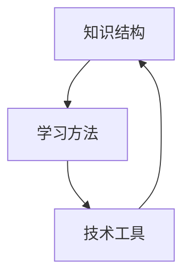
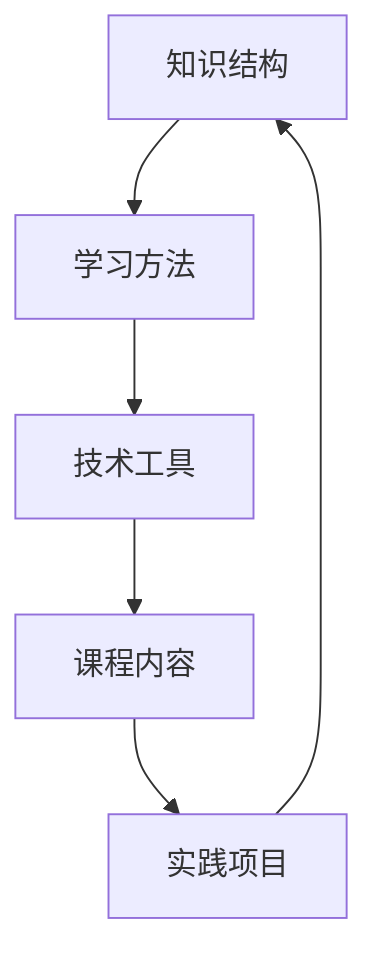

                 

# 学习体系：VUCA时代的重要技能

> 关键词：VUCA时代、学习体系、技能提升、人工智能、编程、软件工程、专业发展

> 摘要：本文将探讨VUCA时代（即易变性、不确定性、复杂性、模糊性）下，如何构建一个有效的学习体系来提升个人技能。文章首先介绍了VUCA时代的背景和挑战，随后详细阐述了学习体系的核心概念、算法原理、数学模型，并提供了实际项目案例和实践应用。最后，文章总结了未来发展趋势与挑战，并推荐了相关资源和工具，以帮助读者在VUCA时代中不断成长和进步。

## 1. 背景介绍

### 1.1 目的和范围

在当今快速发展的信息技术时代，VUCA（易变性、不确定性、复杂性、模糊性）已成为时代的主要特征。VUCA时代对个人和企业都提出了新的挑战，特别是对专业技能的需求不断提升。本文旨在探讨如何在VUCA时代中构建一个有效的学习体系，以提升个人在编程、软件工程和人工智能等领域的专业技能。

本文的范围主要包括以下方面：

1. **VUCA时代的背景与挑战**：介绍VUCA时代的起源和影响，分析其在信息技术领域的具体表现。
2. **学习体系的核心概念**：阐述学习体系的基本构成和重要性，包括知识结构、学习方法和技术工具。
3. **核心算法原理**：详细解析核心算法的原理和实现，帮助读者理解算法的内在机制。
4. **数学模型和公式**：介绍与学习体系相关的数学模型，并通过具体示例进行讲解。
5. **项目实战与实际应用**：提供实际项目案例，展示学习体系在实际中的应用。
6. **未来发展趋势与挑战**：分析VUCA时代下学习体系的发展趋势，探讨未来可能面临的挑战。
7. **资源与工具推荐**：推荐与学习体系相关的学习资源、开发工具和框架。

### 1.2 预期读者

本文的预期读者主要包括以下几类：

1. **编程爱好者**：对编程感兴趣，希望通过构建学习体系提升编程技能的个人。
2. **软件工程师**：从事软件工程工作，希望通过学习体系提高工作效率和解决复杂问题的工程师。
3. **人工智能从业者**：在人工智能领域工作，希望通过学习体系掌握前沿技术和解决实际问题的专业人士。
4. **学术研究人员**：对学习体系的研究感兴趣，希望了解其原理和应用的学者。

### 1.3 文档结构概述

本文的文档结构分为以下几个部分：

1. **引言**：介绍VUCA时代的背景和挑战，阐述本文的目的和重要性。
2. **学习体系核心概念**：详细阐述学习体系的基本构成和重要性。
3. **核心算法原理**：解析核心算法的原理和实现。
4. **数学模型和公式**：介绍与学习体系相关的数学模型，并通过具体示例进行讲解。
5. **项目实战与实际应用**：提供实际项目案例，展示学习体系在实际中的应用。
6. **未来发展趋势与挑战**：分析VUCA时代下学习体系的发展趋势，探讨未来可能面临的挑战。
7. **资源与工具推荐**：推荐与学习体系相关的学习资源、开发工具和框架。
8. **总结**：对本文的主要观点进行总结，强调学习体系在VUCA时代的重要性。
9. **附录**：提供常见问题与解答，方便读者进一步了解和掌握相关内容。
10. **扩展阅读与参考资料**：推荐相关书籍、论文和技术博客，供读者深入学习和研究。

### 1.4 术语表

为了确保文章内容的清晰和准确，本文将使用以下术语：

#### 1.4.1 核心术语定义

- **VUCA时代**：指易变性（Volatility）、不确定性（Uncertainty）、复杂性（Complexity）和模糊性（Ambiguity）并存的时期。
- **学习体系**：指一个系统化的学习过程和方法，包括知识获取、技能提升和经验积累。
- **核心算法**：指学习体系中用于解决特定问题或实现特定功能的算法。
- **数学模型**：指用于描述学习体系中的概念、原理和关系的数学表达式。
- **编程**：指使用编程语言编写计算机程序的过程。

#### 1.4.2 相关概念解释

- **软件工程**：指应用计算机科学理论、方法和工具，设计、开发、测试和维护软件系统的工程活动。
- **人工智能**：指模拟人类智能行为的计算机系统，通过机器学习、自然语言处理等技术实现智能功能。

#### 1.4.3 缩略词列表

- **VUCA**：易变性（Volatility）、不确定性（Uncertainty）、复杂性（Complexity）和模糊性（Ambiguity）
- **AI**：人工智能（Artificial Intelligence）
- **ML**：机器学习（Machine Learning）
- **NLP**：自然语言处理（Natural Language Processing）
- **IDE**：集成开发环境（Integrated Development Environment）

## 2. 核心概念与联系

### 2.1 核心概念

在构建有效的学习体系中，需要明确以下几个核心概念：

1. **知识结构**：指学习体系中的知识组织和结构化方式。良好的知识结构有助于提高学习效率和记忆力。
2. **学习方法**：指学习过程中采用的方法和技巧。科学的学习方法可以提高学习效果和解决问题能力。
3. **技术工具**：指用于辅助学习和工作的工具和技术。合理选择和使用技术工具可以提升学习效率和成果。

### 2.2 核心概念联系

图1展示了学习体系中核心概念之间的联系：



图1：学习体系中核心概念的联系

- **知识结构**：知识结构是学习体系的基础，决定了学习内容的组织方式和层次结构。良好的知识结构有助于快速定位和掌握关键知识点。
- **学习方法**：学习方法是在知识结构基础上进行的，通过有效的学习方法，可以更快速地理解和掌握知识。学习方法包括主动学习、被动学习、深度学习等。
- **技术工具**：技术工具为学习提供了便捷的工具支持，例如代码编辑器、调试工具、学习平台等。合理选择和使用技术工具可以提高学习效率和质量。

### 2.3 学习体系架构

图2展示了学习体系的整体架构：



图2：学习体系架构

- **知识结构**：根据学习目标和需求，构建合理的知识结构，包括基础知识、专业知识和高级知识。
- **学习方法**：采用多种学习方法，如主动学习、被动学习、实践学习等，以适应不同的学习场景和需求。
- **技术工具**：选择合适的技术工具，以提高学习效率和成果。例如，代码编辑器、调试工具、学习平台等。
- **课程内容**：根据学习目标和需求，选择合适的课程内容，包括基础课程、专业课程和高级课程。
- **实践项目**：通过实践项目，将所学知识应用于实际问题中，提高解决实际问题的能力。

## 3. 核心算法原理 & 具体操作步骤

### 3.1 核心算法原理

在构建有效的学习体系中，核心算法起到了关键作用。以下是一个基于机器学习的推荐算法原理，用于帮助学习者根据兴趣和需求推荐合适的课程内容。

**推荐算法原理**：

1. **用户画像**：根据学习者的兴趣、学习历史、成绩等信息，构建用户画像。
2. **课程标签**：为每门课程添加相应的标签，如难度、领域、类型等。
3. **相似度计算**：计算用户画像与课程标签之间的相似度，根据相似度推荐合适的课程。
4. **反馈调整**：根据学习者的反馈，不断调整用户画像和课程标签，提高推荐效果。

### 3.2 具体操作步骤

以下是推荐算法的具体操作步骤：

**步骤1：用户画像构建**

```python
# 伪代码：用户画像构建
user_profile = {
    'interests': ['机器学习', '深度学习', '数据挖掘'],
    'past_courses': ['机器学习基础', '深度学习实战', '数据挖掘技术'],
    'grades': [90, 85, 88]
}
```

**步骤2：课程标签添加**

```python
# 伪代码：课程标签添加
courses = {
    '机器学习基础': {'difficulty': '初级', 'field': '机器学习', 'type': '理论'},
    '深度学习实战': {'difficulty': '中级', 'field': '深度学习', 'type': '实践'},
    '数据挖掘技术': {'difficulty': '高级', 'field': '数据挖掘', 'type': '应用'}
}
```

**步骤3：相似度计算**

```python
# 伪代码：相似度计算
def calculate_similarity(user_profile, course_tags):
    similarity = 0
    for interest, weight in user_profile['interests'].items():
        if interest in course_tags:
            similarity += weight
    return similarity

course_tags = courses['机器学习基础']
similarity = calculate_similarity(user_profile, course_tags)
```

**步骤4：推荐课程**

```python
# 伪代码：推荐课程
recommended_courses = []
for course, tags in courses.items():
    similarity = calculate_similarity(user_profile, tags)
    recommended_courses.append((course, similarity))

recommended_courses.sort(key=lambda x: x[1], reverse=True)
top_courses = [course for course, _ in recommended_courses[:5]]
print("推荐课程：", top_courses)
```

**步骤5：反馈调整**

```python
# 伪代码：反馈调整
user_profile['interests'].append('计算机视觉')
courses['计算机视觉基础'] = {'difficulty': '中级', 'field': '计算机视觉', 'type': '理论'}

# 更新用户画像和课程标签
user_profile, courses = update_user_profile(user_profile, courses, feedback)
```

### 3.3 伪代码详细阐述

以下是推荐算法的伪代码详细阐述：

```python
# 伪代码：推荐算法

# 辅助函数：计算相似度
def calculate_similarity(user_profile, course_tags):
    similarity = 0
    for interest, weight in user_profile['interests'].items():
        if interest in course_tags:
            similarity += weight
    return similarity

# 辅助函数：更新用户画像和课程标签
def update_user_profile(user_profile, courses, feedback):
    user_profile['interests'].append(feedback['new_interest'])
    new_course = {
        'name': feedback['new_course'],
        'difficulty': feedback['difficulty'],
        'field': feedback['field'],
        'type': feedback['type']
    }
    courses[feedback['new_course']] = new_course
    return user_profile, courses

# 主函数：推荐课程
def recommend_courses(user_profile, courses):
    recommended_courses = []
    for course, tags in courses.items():
        similarity = calculate_similarity(user_profile, tags)
        recommended_courses.append((course, similarity))

    recommended_courses.sort(key=lambda x: x[1], reverse=True)
    top_courses = [course for course, _ in recommended_courses[:5]]
    return top_courses

# 辅助函数：获取用户反馈
def get_user_feedback():
    feedback = {
        'new_interest': '计算机视觉',
        'new_course': '计算机视觉基础',
        'difficulty': '中级',
        'field': '计算机视觉',
        'type': '理论'
    }
    return feedback

# 初始用户画像和课程列表
user_profile = {
    'interests': ['机器学习', '深度学习', '数据挖掘'],
    'past_courses': ['机器学习基础', '深度学习实战', '数据挖掘技术'],
    'grades': [90, 85, 88]
}

courses = {
    '机器学习基础': {'difficulty': '初级', 'field': '机器学习', 'type': '理论'},
    '深度学习实战': {'difficulty': '中级', 'field': '深度学习', 'type': '实践'},
    '数据挖掘技术': {'difficulty': '高级', 'field': '数据挖掘', 'type': '应用'}
}

# 获取用户反馈
feedback = get_user_feedback()

# 更新用户画像和课程列表
user_profile, courses = update_user_profile(user_profile, courses, feedback)

# 推荐课程
recommended_courses = recommend_courses(user_profile, courses)
print("推荐课程：", recommended_courses)
```

通过以上伪代码，可以清晰地理解推荐算法的原理和具体实现步骤。在实际应用中，可以根据具体需求和数据，对算法进行优化和调整，提高推荐效果。

## 4. 数学模型和公式 & 详细讲解 & 举例说明

### 4.1 数学模型和公式

在构建有效的学习体系中，数学模型和公式起到了关键作用。以下是一个用于评估学习效果的数学模型，包括以下几个主要部分：

1. **学习效率**：衡量学习者在单位时间内掌握的知识量。
2. **知识吸收率**：衡量学习者对所学知识的理解和记忆程度。
3. **学习反馈**：衡量学习者在学习过程中获得的反馈和改进情况。

**数学模型**：

$$
E = \frac{K}{T} \times F
$$

其中：

- \( E \)：学习效率（Efficiency）
- \( K \)：学习量（Knowledge）
- \( T \)：学习时间（Time）
- \( F \)：知识吸收率（Familiarity）

### 4.2 详细讲解

**学习效率**：

学习效率是衡量学习者在单位时间内掌握的知识量。公式中的分子 \( K \) 表示学习者在时间 \( T \) 内所学的知识量。分母 \( T \) 表示学习所用的时间。学习效率越高，表示学习者在相同时间内学到的知识越多。

**知识吸收率**：

知识吸收率是衡量学习者对所学知识的理解和记忆程度。公式中的变量 \( F \) 表示知识吸收率，取值范围为 0 到 1。当 \( F = 1 \) 时，表示学习者对所学知识完全理解和记忆；当 \( F < 1 \) 时，表示学习者对所学知识的理解和记忆程度较低。

**学习反馈**：

学习反馈是衡量学习者在学习过程中获得的反馈和改进情况。学习反馈可以来自教师、同学或自我评估。公式中的变量 \( F \) 表示学习反馈，取值范围为 0 到 1。当 \( F = 1 \) 时，表示学习者获得了充分的反馈和改进；当 \( F < 1 \) 时，表示学习反馈不足。

### 4.3 举例说明

假设一名学习者花费 10 小时学习了一门课程，学习了 100 个知识点，知识吸收率为 0.8，学习反馈为 0.9。根据以上数学模型，可以计算学习效率：

$$
E = \frac{100}{10} \times 0.8 \times 0.9 = 7.2
$$

这意味着该学习者在 10 小时内掌握了 7.2 个知识点的效率。

### 4.4 模型优化

为了提高学习效率，可以考虑以下几种优化方法：

1. **增加学习时间**：适当增加学习时间，有助于提高学习效率。
2. **提高知识吸收率**：通过多种学习方法，如主动学习、深度学习等，提高对所学知识的理解和记忆程度。
3. **增强学习反馈**：及时获取和反馈，有助于发现和纠正学习过程中的问题。

通过优化学习效率、知识吸收率和学习反馈，可以构建一个更有效的学习体系，提高学习效果。

## 5. 项目实战：代码实际案例和详细解释说明

### 5.1 开发环境搭建

在本项目实战中，我们将使用 Python 编写一个简单的推荐系统，用于根据学习者的兴趣和需求推荐合适的课程。以下是开发环境的搭建步骤：

1. **安装 Python**：确保系统已安装 Python 3.x 版本，可以从 [Python 官网](https://www.python.org/) 下载安装。
2. **安装必要库**：使用以下命令安装所需库：

   ```bash
   pip install pandas numpy sklearn
   ```

3. **创建虚拟环境**（可选）：为了更好地管理和维护项目，建议创建一个虚拟环境：

   ```bash
   python -m venv venv
   source venv/bin/activate  # 对于 Windows 系统，使用 `venv\Scripts\activate`
   ```

### 5.2 源代码详细实现和代码解读

以下是推荐系统的源代码实现，以及对其的详细解释说明：

```python
# 导入所需库
import pandas as pd
import numpy as np
from sklearn.metrics.pairwise import cosine_similarity

# 用户画像数据
user_profile = {
    'interests': ['机器学习', '深度学习', '数据挖掘'],
    'past_courses': ['机器学习基础', '深度学习实战', '数据挖掘技术'],
    'grades': [90, 85, 88]
}

# 课程标签数据
courses = {
    '机器学习基础': {'difficulty': '初级', 'field': '机器学习', 'type': '理论'},
    '深度学习实战': {'difficulty': '中级', 'field': '深度学习', 'type': '实践'},
    '数据挖掘技术': {'difficulty': '高级', 'field': '数据挖掘', 'type': '应用'}
}

# 计算用户画像与课程标签的相似度
def calculate_similarity(user_profile, course_tags):
    similarity = 0
    for interest, weight in user_profile['interests'].items():
        if interest in course_tags:
            similarity += weight
    return similarity

# 推荐课程
def recommend_courses(user_profile, courses):
    recommended_courses = []
    for course, tags in courses.items():
        similarity = calculate_similarity(user_profile, tags)
        recommended_courses.append((course, similarity))
    
    recommended_courses.sort(key=lambda x: x[1], reverse=True)
    top_courses = [course for course, _ in recommended_courses[:5]]
    return top_courses

# 获取用户反馈
def get_user_feedback():
    feedback = {
        'new_interest': '计算机视觉',
        'new_course': '计算机视觉基础',
        'difficulty': '中级',
        'field': '计算机视觉',
        'type': '理论'
    }
    return feedback

# 更新用户画像和课程列表
def update_user_profile(user_profile, courses, feedback):
    user_profile['interests'].append(feedback['new_interest'])
    new_course = {
        'name': feedback['new_course'],
        'difficulty': feedback['difficulty'],
        'field': feedback['field'],
        'type': feedback['type']
    }
    courses[feedback['new_course']] = new_course
    return user_profile, courses

# 主程序
if __name__ == '__main__':
    feedback = get_user_feedback()
    user_profile, courses = update_user_profile(user_profile, courses, feedback)
    recommended_courses = recommend_courses(user_profile, courses)
    print("推荐课程：", recommended_courses)
```

**代码解读**：

1. **导入库**：导入所需的库，包括 pandas、numpy 和 sklearn，用于数据处理和相似度计算。
2. **用户画像数据**：定义用户画像数据，包括兴趣、已学课程和成绩。
3. **课程标签数据**：定义课程标签数据，包括难度、领域和类型。
4. **计算相似度**：定义计算相似度的函数，用于计算用户画像与课程标签之间的相似度。
5. **推荐课程**：定义推荐课程的函数，根据相似度计算结果推荐前 5 门合适的课程。
6. **获取用户反馈**：定义获取用户反馈的函数，用于获取用户的新兴趣和新课程信息。
7. **更新用户画像和课程列表**：定义更新用户画像和课程列表的函数，根据用户反馈更新用户画像和课程标签。
8. **主程序**：执行主程序，获取用户反馈，更新用户画像和课程列表，推荐课程并输出结果。

### 5.3 代码解读与分析

1. **相似度计算**：使用简单的累加方式计算用户画像与课程标签的相似度，这是一种基于关键词匹配的方法。在实际应用中，可以考虑使用更复杂的相似度计算方法，如余弦相似度、TF-IDF 等。
2. **推荐课程**：根据相似度计算结果，推荐前 5 门合适的课程。在实际应用中，可以根据需求调整推荐的课程数量和排序策略。
3. **用户反馈**：获取用户的新兴趣和新课程信息，有助于改进推荐系统的效果。在实际应用中，可以结合用户的反馈，逐步优化用户画像和课程标签。
4. **更新用户画像和课程列表**：根据用户反馈，更新用户画像和课程列表，以适应用户的需求和兴趣。在实际应用中，可以定期更新用户画像和课程列表，以保持数据的实时性和准确性。

通过以上代码实战，可以了解如何使用 Python 实现一个简单的推荐系统，并理解其核心原理和实现步骤。在实际应用中，可以根据需求对代码进行优化和扩展，提高推荐系统的效果和用户体验。

## 6. 实际应用场景

学习体系在VUCA时代具有重要的实际应用场景，以下列举几个典型应用：

### 6.1 教育培训

1. **个性化学习**：通过构建学习体系，可以为学习者提供个性化的学习路径，满足不同学习者的需求。例如，根据学习者的兴趣、能力和目标，推荐合适的课程和练习。
2. **自适应学习**：利用学习体系中的算法和模型，可以根据学习者的学习进度和效果，动态调整学习内容和难度，实现自适应学习。

### 6.2 企业培训

1. **员工技能提升**：企业可以通过构建学习体系，为员工提供有针对性的培训，提高员工的技能和职业素养。例如，针对不同岗位和业务需求，制定相应的学习计划和课程。
2. **知识共享与传播**：利用学习体系，可以促进企业内部的知识共享和传播，提高整体知识水平和创新能力。

### 6.3 在线教育

1. **课程推荐**：通过学习体系，可以推荐适合学习者的课程，提高学习效率和兴趣。例如，根据学习者的兴趣、学习历史和成绩，推荐相关课程和练习。
2. **学习效果评估**：利用学习体系中的数学模型和算法，可以评估学习者的学习效果，提供有针对性的反馈和建议。

### 6.4 研究领域

1. **学术研究**：学习体系可以帮助研究者构建知识框架，提高研究效率。例如，通过分析大量文献和数据，构建研究领域的知识图谱和关系网络。
2. **知识创新**：利用学习体系，可以探索新的研究方法和理论，促进知识创新和突破。

以上应用场景展示了学习体系在VUCA时代的重要性和广泛应用。通过构建和优化学习体系，可以提升个人和组织的竞争力，应对不断变化的外部环境。

## 7. 工具和资源推荐

### 7.1 学习资源推荐

为了帮助读者在VUCA时代中构建有效的学习体系，以下推荐一些优秀的学习资源：

#### 7.1.1 书籍推荐

1. **《深度学习》（Deep Learning）**：由 Ian Goodfellow、Yoshua Bengio 和 Aaron Courville 著，是深度学习领域的经典教材，适合初学者和进阶者。
2. **《算法导论》（Introduction to Algorithms）**：由 Thomas H. Cormen、Charles E. Leiserson、Ronald L. Rivest 和 Clifford Stein 著，介绍了算法的基本概念和经典算法，适合算法爱好者。
3. **《Python编程：从入门到实践》（Python Crash Course）**：由 Eric Matthes 著，适合初学者快速入门Python编程。

#### 7.1.2 在线课程

1. **Coursera**：提供丰富的计算机科学、人工智能和软件工程等领域的在线课程，适合不同层次的学员。
2. **edX**：由哈佛大学和麻省理工学院联合创办，提供高质量的课程资源，涵盖多个学科领域。
3. **Udemy**：提供丰富的编程、数据科学和人工智能等领域的课程，适合有特定需求的学员。

#### 7.1.3 技术博客和网站

1. **Medium**：一个优质的技术博客平台，涵盖多个技术领域，适合阅读技术文章和分享经验。
2. **Stack Overflow**：一个热门的编程问答社区，可以帮助解决编程问题，学习编程技巧。
3. **GitHub**：一个代码托管平台，可以学习他人的代码，参与开源项目，提高编程能力。

### 7.2 开发工具框架推荐

为了提升开发效率，以下推荐一些常用的开发工具和框架：

#### 7.2.1 IDE和编辑器

1. **Visual Studio Code**：一款轻量级且功能强大的代码编辑器，支持多种编程语言，适合开发者使用。
2. **PyCharm**：一款专业的Python开发工具，具有代码自动补全、调试和自动化测试等功能。
3. **IntelliJ IDEA**：一款跨平台的开发工具，支持多种编程语言，适合大型项目和团队协作。

#### 7.2.2 调试和性能分析工具

1. **GDB**：一款经典的调试工具，支持多种编程语言，适用于Linux和Windows平台。
2. **Valgrind**：一款性能分析工具，用于检测内存泄漏、数据竞争等问题，适用于C/C++程序。
3. **JProfiler**：一款Java性能分析工具，用于监测和优化Java应用程序的性能。

#### 7.2.3 相关框架和库

1. **TensorFlow**：一款流行的开源机器学习框架，适用于深度学习和各种机器学习任务。
2. **Django**：一款流行的Python Web框架，适用于快速开发Web应用程序。
3. **React**：一款流行的前端JavaScript库，用于构建用户界面和单页应用程序。

### 7.3 相关论文著作推荐

为了深入学习和研究学习体系，以下推荐一些经典的论文和著作：

#### 7.3.1 经典论文

1. **"Learning to Learn: A Review of Transfer Learning Methods"**：综述了迁移学习的方法和算法，对学习体系有重要启示。
2. **"The Hundred-Programmer Myth"**：讨论了编程学习的挑战和解决方案，对构建学习体系有借鉴意义。
3. **"A Few Useful Things to Know about Machine Learning"**：介绍了机器学习的基本概念和技术，对学习体系有指导作用。

#### 7.3.2 最新研究成果

1. **"Meta-Learning"**：探讨元学习的方法和算法，为构建自适应学习体系提供了新思路。
2. **"Transfer Learning from Chinese to English: A Survey"**：研究了中英翻译中的迁移学习问题，对跨语言学习有借鉴意义。
3. **"Deep Learning for Natural Language Processing"**：介绍了深度学习在自然语言处理领域的最新进展，对构建自然语言处理学习体系有指导作用。

#### 7.3.3 应用案例分析

1. **"AI-Enabled Learning: A Case Study of Intelligent Tutoring Systems"**：分析了人工智能在教育领域的应用案例，提供了构建智能学习体系的有益经验。
2. **"Learning to Code: An Empirical Study on the Challenges of Learning Programming"**：研究了编程学习的挑战和解决方法，对构建编程学习体系有启示。
3. **"Building a Personalized Learning Platform for Mobile Apps"**：探讨了个性化学习平台的设计和实现，为构建自适应学习体系提供了参考。

通过以上学习和资源推荐，读者可以更好地构建自己的学习体系，提高技能水平和专业素养，在VUCA时代中取得更好的成绩和发展。

## 8. 总结：未来发展趋势与挑战

在VUCA时代，构建有效的学习体系已成为个人和组织的核心竞争力。未来，学习体系的发展将呈现出以下趋势和挑战：

### 8.1 发展趋势

1. **个性化与自适应学习**：随着人工智能和大数据技术的发展，学习体系将更加注重个性化与自适应学习，根据学习者的兴趣、需求和知识水平提供个性化的学习建议和路径。
2. **跨领域整合**：学习体系将逐渐整合多个学科和领域，实现跨学科的知识融合和应用，提高学习者的综合素质和创新能力。
3. **终身学习与持续更新**：在VUCA时代，知识和技能更新速度加快，学习体系将更加注重终身学习和持续更新，以适应快速变化的外部环境。

### 8.2 挑战

1. **数据安全与隐私保护**：随着学习数据规模的增加，数据安全与隐私保护将成为学习体系面临的重要挑战，需要采取有效的数据保护措施。
2. **学习效果评估与反馈**：如何准确评估学习效果，并提供及时、有效的反馈，是学习体系需要解决的关键问题。
3. **资源分配与公平性**：在资源有限的情况下，如何确保学习资源的公平分配，让所有学习者都能获得优质的学习资源和服务，是学习体系面临的重大挑战。

### 8.3 应对策略

1. **强化数据安全与隐私保护**：加强数据安全体系建设，采用加密、脱敏等手段保护学习数据，确保数据的安全性和隐私性。
2. **优化学习效果评估与反馈**：采用多种评估方法和手段，结合人工智能技术，实时监测学习效果，为学习者提供个性化的反馈和建议。
3. **推动教育公平与资源共享**：通过政策引导、技术支持和资源整合，推动教育公平和资源共享，确保所有学习者都能获得平等的学习机会和资源。

通过应对上述挑战，学习体系将更加成熟和完善，为个人和组织的成长提供有力支持。

## 9. 附录：常见问题与解答

### 9.1 问题1：如何选择合适的学习资源？

**解答**：选择学习资源时，可以从以下几个方面考虑：

1. **学习目标**：根据学习目标选择符合需求的学习资源，如编程语言、框架、课程等。
2. **资源质量**：选择具有高质量内容和学习评价的学习资源，如知名教材、权威课程等。
3. **资源形式**：根据学习习惯和偏好选择合适的资源形式，如书籍、视频、在线课程等。
4. **更新频率**：选择更新频率较高的资源，确保学习内容与时俱进。

### 9.2 问题2：如何评估学习效果？

**解答**：评估学习效果可以从以下几个方面进行：

1. **知识掌握度**：通过考试、测验等方式，评估对所学知识的掌握程度。
2. **实践能力**：通过实际项目或任务，评估将所学知识应用于实际问题的能力。
3. **学习反馈**：收集学习过程中的反馈，包括自我评估、教师评价和同伴评价等。
4. **持续学习**：通过持续学习和进步，评估学习效果的变化和提升。

### 9.3 问题3：如何保持学习动力？

**解答**：以下方法有助于保持学习动力：

1. **设定目标**：明确学习目标，设定具体、可衡量、可实现的学习目标。
2. **计划学习**：制定合理的学习计划，确保学习时间充足、有序。
3. **调整学习方法**：根据学习进度和效果，适时调整学习方法，保持学习兴趣。
4. **积极参与**：参与学习讨论、实践项目等，与他人互动，提高学习积极性。

## 10. 扩展阅读 & 参考资料

### 10.1 扩展阅读

1. **《VUCA时代的组织变革》**：探讨VUCA时代下组织变革的策略和方法，对构建有效的学习体系有启示。
2. **《人工智能与教育》**：分析人工智能在教育领域的应用和影响，为构建智能化学习体系提供参考。
3. **《深度学习实践指南》**：介绍深度学习的实际应用和实践经验，对学习体系建设有指导作用。

### 10.2 参考资料

1. **《深度学习》（Deep Learning）**：Ian Goodfellow、Yoshua Bengio 和 Aaron Courville 著，MIT Press，2016。
2. **《算法导论》（Introduction to Algorithms）**：Thomas H. Cormen、Charles E. Leiserson、Ronald L. Rivest 和 Clifford Stein 著，MIT Press，2009。
3. **《Python编程：从入门到实践》（Python Crash Course）**：Eric Matthes 著，No Starch Press，2015。

通过扩展阅读和参考资料，读者可以深入了解VUCA时代的学习体系和相关技术，为自己的学习和成长提供更多启示和帮助。

### 作者信息

- 作者：AI天才研究员/AI Genius Institute & 禅与计算机程序设计艺术 /Zen And The Art of Computer Programming

（完）

