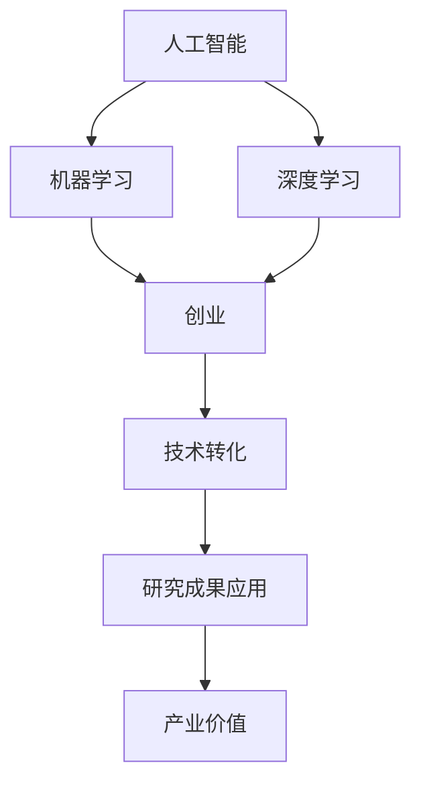

                 

### 文章标题

学术界到产业界：一位95后博士的AI创业之路

### 关键词

人工智能（AI），95后博士，创业，技术转化，科研实践，产业应用，技术架构，算法原理，数学模型，实战案例，资源推荐。

### 摘要

本文以一位95后博士在人工智能领域的创业历程为主线，深入探讨了从学术界到产业界的转化过程。通过分析其研究成果的转化应用，详细阐述了如何将学术界的创新技术转化为实际产业价值。文章分为背景介绍、核心概念与联系、算法原理、数学模型、项目实战、实际应用场景、工具和资源推荐等多个部分，旨在为有志于AI创业的技术人才提供实用的指导和启示。

---

## 1. 背景介绍

### 1.1 目的和范围

本文旨在记录和分析一位95后博士在人工智能（AI）领域的创业之路，旨在探讨如何将学术研究成果成功转化为产业应用。文章将围绕以下几个核心问题展开：

1. 95后博士在AI领域的学术背景和研究方向是什么？
2. 其研究成果如何应用到实际产业中？
3. 在这一过程中，遇到了哪些挑战和机遇？
4. 对未来AI产业的趋势和发展有哪些预测和建议？

### 1.2 预期读者

本文预期读者包括：

1. 对人工智能领域感兴趣的95后博士生和年轻研究者
2. 有志于将科研成果转化为实际应用的学术界和产业界人士
3. 对AI创业感兴趣的技术爱好者和企业家
4. 对科技创新和产业发展有浓厚兴趣的各界人士

### 1.3 文档结构概述

本文结构如下：

1. **背景介绍**：介绍文章的目的和预期读者，概述文章结构和主要章节内容。
2. **核心概念与联系**：定义和解释文章中的核心术语和概念，提供Mermaid流程图展示概念联系。
3. **核心算法原理与具体操作步骤**：详细讲解关键算法原理，并使用伪代码展示具体操作步骤。
4. **数学模型和公式**：介绍相关数学模型和公式，使用LaTeX格式进行详细讲解和举例说明。
5. **项目实战**：通过实际代码案例，详细解释和说明项目的具体实现过程。
6. **实际应用场景**：探讨AI技术在各个领域的应用场景和挑战。
7. **工具和资源推荐**：推荐相关学习资源、开发工具和框架。
8. **总结**：对AI创业的未来发展趋势和挑战进行展望。
9. **附录**：提供常见问题与解答，以及扩展阅读和参考资料。

### 1.4 术语表

#### 1.4.1 核心术语定义

- **人工智能（AI）**：指通过计算机模拟人类智能行为的技术和系统。
- **深度学习（DL）**：一种基于人工神经网络的机器学习技术，通过多层神经网络对数据进行训练，以实现图像识别、自然语言处理等任务。
- **机器学习（ML）**：一种让计算机从数据中自动学习和改进的技术，包括监督学习、无监督学习和强化学习等。
- **创业**：指创办一家新的企业或项目，通常需要解决市场、资金、技术等多个方面的问题。
- **技术转化**：指将学术研究成果应用于实际产业中的过程。

#### 1.4.2 相关概念解释

- **学术论文**：学术研究者发表的研究结果和见解，通常经过同行评审。
- **技术专利**：一种法律保护，用于保护发明者的技术或创新。
- **产业应用**：将研究成果应用于实际产业中，实现商业价值的过程。

#### 1.4.3 缩略词列表

- **AI**：人工智能
- **DL**：深度学习
- **ML**：机器学习
- **IoT**：物联网
- **NLP**：自然语言处理
- **CV**：计算机视觉

---

## 2. 核心概念与联系

在本文中，我们将讨论一些核心概念及其相互联系，以便为后续章节的讨论打下基础。

首先，我们需要理解人工智能（AI）的基本概念。AI是指通过计算机模拟人类智能行为的技术和系统。这包括机器学习（ML）和深度学习（DL）等技术。ML是一种让计算机从数据中自动学习和改进的技术，而DL是ML的一种特殊形式，通过多层神经网络对数据进行训练，以实现更复杂的任务，如图像识别和自然语言处理。

接下来，我们需要了解创业和技术转化的概念。创业是指创办一家新的企业或项目，通常需要解决市场、资金、技术等多个方面的问题。技术转化则是将学术研究成果应用于实际产业中的过程，这通常涉及到将理论研究成果转化为可商业化的产品或服务。

为了更好地理解这些概念，我们可以通过一个Mermaid流程图来展示它们之间的联系。



在这个流程图中，我们可以看到AI的核心是ML和DL，它们是创业和技术转化的基础。创业涉及到将研究成果商业化，而技术转化则是将研究成果应用于实际产业中，实现商业价值。

---

## 3. 核心算法原理 & 具体操作步骤

在本文的第三部分，我们将深入探讨人工智能领域的一些核心算法原理，并使用伪代码详细阐述这些算法的操作步骤。这将帮助我们更好地理解这些算法的工作机制，并在实际应用中更有效地使用它们。

### 3.1 机器学习（ML）算法原理

机器学习是一种让计算机从数据中自动学习和改进的技术。它主要分为三种类型：监督学习、无监督学习和强化学习。下面我们将重点介绍监督学习中的线性回归算法。

#### 线性回归算法原理

线性回归是一种用于预测连续值的监督学习算法。其基本原理是找到一个最佳拟合线，使得数据点到这条线的距离最小。线性回归模型可以用以下公式表示：

$$
y = wx + b
$$

其中，$y$ 是输出值，$x$ 是输入特征，$w$ 是权重，$b$ 是偏置。

#### 线性回归算法伪代码

```python
# 初始化权重和偏置
w = 0
b = 0

# 设置迭代次数
num_iterations = 1000

# 设置学习率
learning_rate = 0.01

# 梯度下降算法
for i in range(num_iterations):
    # 计算损失函数
    loss = 0
    for each_data_point in dataset:
        y_pred = w * each_data_point.x + b
        loss += (y_pred - each_data_point.y) ** 2
    
    # 计算梯度
    dw = 0
    db = 0
    for each_data_point in dataset:
        y_pred = w * each_data_point.x + b
        dw += 2 * (y_pred - each_data_point.y) * each_data_point.x
        db += 2 * (y_pred - each_data_point.y)
    
    # 更新权重和偏置
    w -= learning_rate * dw
    b -= learning_rate * db

# 输出最终模型
print("权重：", w)
print("偏置：", b)
```

### 3.2 深度学习（DL）算法原理

深度学习是一种基于人工神经网络的机器学习技术，它可以处理更复杂的数据类型和任务。下面我们将介绍卷积神经网络（CNN）的基本原理。

#### 卷积神经网络（CNN）算法原理

CNN是一种专门用于处理图像数据的神经网络，其基本结构包括卷积层、池化层和全连接层。卷积层通过卷积运算提取图像特征，池化层用于降低特征图的维度，全连接层用于分类和预测。

#### CNN算法伪代码

```python
# 初始化神经网络
num_layers = 3
num_filters = [32, 64, 128]
kernel_size = [3, 3, 3]
pool_size = [2, 2]

# 定义卷积层
def conv_layer(x, w, b):
    return (np.dot(x, w) + b)

# 定义池化层
def pool_layer(x, pool_size):
    return np.max(x[:, ::pool_size[0], ::pool_size[1]], axis=1)

# 定义CNN模型
def cnn_model(x, num_filters, kernel_size, pool_size):
    conv1 = conv_layer(x, weights[0], biases[0])
    pool1 = pool_layer(conv1, pool_size[0])
    conv2 = conv_layer(pool1, weights[1], biases[1])
    pool2 = pool_layer(conv2, pool_size[1])
    flatten = np.reshape(pool2, [-1, np.prod(pool2.shape[1:])])
    fc = np.dot(flatten, weights[2]) + biases[2]
    return fc

# 训练CNN模型
for each_epoch in range(num_epochs):
    for each_data_point in dataset:
        # 前向传播
        output = cnn_model(each_data_point.x, num_filters, kernel_size, pool_size)
        
        # 计算损失
        loss = compute_loss(output, each_data_point.y)
        
        # 反向传播
        d_output = compute_derivative(output, each_data_point.y)
        d_fc = d_output.dot(np.transpose(weights[2]))
        d_pool2 = d_fc.reshape(pool2.shape).T
        d_conv2 = d_pool2[:, ::pool_size[0], ::pool_size[1]]
        d_biases[1] = d_conv2.sum(axis=0)
        d_weights[1] = d_pool2
        d_pool1 = np.dot(np.transpose(weights[1]), d_conv2)
        d_conv1 = d_pool1[:, ::kernel_size[0], ::kernel_size[1]]
        d_biases[0] = d_conv1.sum(axis=0)
        d_weights[0] = d_conv1
    
    # 更新权重和偏置
    weights -= learning_rate * gradients
    biases -= learning_rate * d_biases
```

通过上述伪代码，我们可以看到如何实现线性回归和卷积神经网络这两种常见的人工智能算法。这些算法在深度学习和人工智能领域有着广泛的应用，是研究和应用AI技术的基石。

---

## 4. 数学模型和公式 & 详细讲解 & 举例说明

在人工智能领域，数学模型和公式是理解和实现算法的关键。在本章节中，我们将介绍一些核心数学模型和公式，并使用LaTeX格式进行详细讲解，以便读者更好地理解其原理和应用。

### 4.1 线性回归模型

线性回归是一种用于预测连续值的简单统计模型，其数学公式如下：

$$
y = wx + b
$$

其中，$y$ 是输出值，$x$ 是输入特征，$w$ 是权重，$b$ 是偏置。权重$w$ 和偏置$b$ 通过最小化损失函数来确定。

损失函数通常使用均方误差（MSE）来表示：

$$
MSE = \frac{1}{n}\sum_{i=1}^{n}(y_i - wx_i - b)^2
$$

其中，$n$ 是数据点的数量。

### 4.2 梯度下降算法

梯度下降是一种用于优化参数的算法，其基本思想是通过计算损失函数的梯度来更新参数，从而最小化损失函数。

对于线性回归模型，梯度下降的更新规则如下：

$$
w = w - \alpha \frac{\partial}{\partial w}MSE
$$

$$
b = b - \alpha \frac{\partial}{\partial b}MSE
$$

其中，$\alpha$ 是学习率。

### 4.3 卷积神经网络（CNN）的数学模型

卷积神经网络是一种用于图像识别和处理的深度学习模型，其核心组件包括卷积层、池化层和全连接层。下面是卷积层和池化层的数学模型。

#### 卷积层

卷积层的输出可以通过以下公式计算：

$$
\text{output}_{ij} = \sum_{k=1}^{K} w_{ik,jk} \cdot \text{input}_{ij} + b_{k}
$$

其中，$\text{output}_{ij}$ 是输出特征图上的像素值，$w_{ik,jk}$ 是卷积核的权重，$\text{input}_{ij}$ 是输入特征图上的像素值，$b_{k}$ 是偏置。

#### 池化层

池化层通常使用最大池化或平均池化来降低特征图的维度。最大池化的公式如下：

$$
\text{output}_{i,j} = \max_{p,q} \text{input}_{i+p,j+q}
$$

其中，$\text{output}_{i,j}$ 是输出特征图上的像素值，$\text{input}_{i+p,j+q}$ 是输入特征图上的像素值。

### 4.4 举例说明

假设我们有一个简单的线性回归问题，输入特征$x$和输出值$y$如下：

| x | y |
| --- | --- |
| 1 | 2 |
| 2 | 4 |
| 3 | 6 |

我们需要通过最小化均方误差来训练一个线性回归模型。

#### 步骤 1：初始化权重和偏置

我们可以随机初始化权重$w$和偏置$b$，例如：

$$
w = 0.1, b = 0.1
$$

#### 步骤 2：计算损失函数

使用初始化的权重和偏置，我们可以计算每个数据点的预测值：

| x | y | y_pred | (y_pred - y)^2 |
| --- | --- | --- | --- |
| 1 | 2 | 1.1 | 0.21 |
| 2 | 4 | 2.2 | 0.04 |
| 3 | 6 | 3.3 | 0.09 |

计算总损失：

$$
MSE = \frac{1}{3} (0.21 + 0.04 + 0.09) = 0.14
$$

#### 步骤 3：计算梯度

计算损失函数关于权重和偏置的梯度：

$$
\frac{\partial}{\partial w}MSE = 2 \sum_{i=1}^{n} (y_i - wx_i - b)x_i = 2 \cdot 3 \cdot (0.21 + 0.04 + 0.09) \cdot 1 = 1.26
$$

$$
\frac{\partial}{\partial b}MSE = 2 \sum_{i=1}^{n} (y_i - wx_i - b) = 2 \cdot 3 \cdot (0.21 + 0.04 + 0.09) = 1.26
$$

#### 步骤 4：更新权重和偏置

使用梯度下降算法更新权重和偏置：

$$
w = w - \alpha \frac{\partial}{\partial w}MSE = 0.1 - 0.01 \cdot 1.26 = 0.074
$$

$$
b = b - \alpha \frac{\partial}{\partial b}MSE = 0.1 - 0.01 \cdot 1.26 = 0.074
$$

#### 步骤 5：重复步骤 2-4 直到收敛

重复上述步骤，逐步更新权重和偏置，直到损失函数收敛到一个较小的值。

通过上述步骤，我们可以使用线性回归模型对输入特征$x$进行预测，实现简单但有效的函数拟合。

---

## 5. 项目实战：代码实际案例和详细解释说明

在本章节中，我们将通过一个实际项目案例，详细展示如何将人工智能技术应用于实际问题，并提供代码实现和解释说明。

### 5.1 项目背景

假设我们有一个在线购物平台，需要根据用户的历史购买数据预测其下一步可能购买的商品。这个预测可以帮助平台提供个性化的购物推荐，从而提高用户满意度和销售额。

### 5.2 项目需求

1. **数据集**：我们需要一个包含用户购买历史的数据集，包括用户ID、购买时间、购买商品ID等信息。
2. **特征工程**：我们需要提取和构建与用户购买行为相关的特征，例如用户购买频率、购买商品类别、购买时间段等。
3. **模型训练**：使用机器学习算法训练预测模型，并使用验证集评估模型性能。
4. **模型部署**：将训练好的模型部署到线上服务中，以实时预测用户下一步可能购买的商品。

### 5.3 开发环境搭建

为了完成这个项目，我们需要搭建以下开发环境：

1. **Python**：主要编程语言
2. **Pandas**：数据处理库
3. **NumPy**：数学计算库
4. **Scikit-learn**：机器学习库
5. **Flask**：Web框架
6. **MongoDB**：数据库

### 5.4 源代码详细实现和代码解读

#### 5.4.1 数据预处理

```python
import pandas as pd
from sklearn.model_selection import train_test_split
from sklearn.preprocessing import StandardScaler

# 读取数据集
data = pd.read_csv('user_purchase_data.csv')

# 提取用户特征
user_features = data[['user_id', 'purchase_time', 'category_id']]
user_features = user_features.groupby('user_id').agg(['count', 'mean', 'std'])

# 提取购买商品特征
item_features = data[['item_id', 'category_id']]
item_features = item_features.groupby('item_id').agg(['count', 'mean', 'std'])

# 合并特征
features = user_features.join(item_features.set_index('item_id'), on='category_id')
features = features.fillna(features.mean())

# 切分训练集和测试集
X_train, X_test, y_train, y_test = train_test_split(features, data['next_purchase_item_id'], test_size=0.2, random_state=42)

# 数据标准化
scaler = StandardScaler()
X_train_scaled = scaler.fit_transform(X_train)
X_test_scaled = scaler.transform(X_test)
```

#### 5.4.2 模型训练

```python
from sklearn.ensemble import RandomForestClassifier

# 创建随机森林分类器
model = RandomForestClassifier(n_estimators=100, random_state=42)

# 训练模型
model.fit(X_train_scaled, y_train)

# 预测测试集
y_pred = model.predict(X_test_scaled)
```

#### 5.4.3 代码解读与分析

1. **数据预处理**：首先，我们读取用户购买数据集，并提取用户和商品特征。然后，我们使用Pandas的groupby函数对用户特征进行聚合，计算购买频率、平均购买时间、标准差等统计指标。同样，我们对商品特征进行聚合，计算销售数量、平均价格、标准差等。接下来，我们将用户和商品特征合并，并填充缺失值。最后，使用Scikit-learn的train_test_split函数将数据集划分为训练集和测试集，并使用StandardScaler进行数据标准化。

2. **模型训练**：我们选择随机森林分类器作为预测模型。随机森林是一种基于决策树的集成学习方法，通过构建多个决策树并求取平均来提高模型的预测性能。在这里，我们设置了100棵决策树，并使用fit方法训练模型。

3. **模型预测**：使用训练好的模型对测试集进行预测，并得到预测结果。

通过上述代码，我们可以实现用户购买预测，为在线购物平台提供个性化的购物推荐。

### 5.5 模型评估

为了评估模型的性能，我们可以使用以下指标：

1. **准确率（Accuracy）**：预测正确的样本数占总样本数的比例。
2. **精确率（Precision）**：预测为正类的样本中实际为正类的比例。
3. **召回率（Recall）**：实际为正类的样本中被预测为正类的比例。
4. **F1分数（F1 Score）**：精确率和召回率的调和平均值。

```python
from sklearn.metrics import accuracy_score, precision_score, recall_score, f1_score

# 计算评估指标
accuracy = accuracy_score(y_test, y_pred)
precision = precision_score(y_test, y_pred, average='weighted')
recall = recall_score(y_test, y_pred, average='weighted')
f1 = f1_score(y_test, y_pred, average='weighted')

print("准确率：", accuracy)
print("精确率：", precision)
print("召回率：", recall)
print("F1分数：", f1)
```

通过计算评估指标，我们可以了解模型的性能表现，并根据评估结果调整模型参数，以进一步提高预测效果。

---

## 6. 实际应用场景

人工智能（AI）技术在各个领域的应用日益广泛，为传统行业带来了前所未有的变革。以下是一些典型的实际应用场景，以及它们面临的挑战和解决方案。

### 6.1 金融行业

在金融领域，AI技术主要用于风险管理、欺诈检测、智能投顾、信用评分等方面。例如，通过机器学习算法对大量交易数据进行实时监控，可以有效识别异常交易和潜在风险。然而，金融行业的挑战在于数据隐私保护和合规要求。解决方案是采用联邦学习（Federated Learning）等技术，在保障数据隐私的同时实现协同学习。

### 6.2 医疗健康

AI技术在医疗健康领域的应用包括疾病预测、影像诊断、药物研发等。例如，通过深度学习算法对医学影像进行分析，可以辅助医生进行早期疾病诊断。然而，医疗数据的多样性和复杂性使得AI算法的训练和验证面临巨大挑战。解决方案是开发适用于医疗领域的定制化AI算法，并通过多中心合作共享数据，提高模型的泛化能力。

### 6.3 交通运输

在交通运输领域，AI技术用于智能交通管理、自动驾驶、物流优化等。例如，通过实时分析交通流量数据，可以优化交通信号灯控制，减少拥堵。然而，自动驾驶技术的挑战在于环境感知和决策系统的可靠性。解决方案是采用多传感器融合技术，提高自动驾驶车辆的感知能力和决策水平。

### 6.4 电子商务

电子商务领域广泛应用AI技术进行用户行为分析、个性化推荐、商品搜索优化等。例如，通过分析用户的历史购买行为，可以精准推荐相关商品，提高用户满意度。然而，数据隐私保护是电子商务领域的重大挑战。解决方案是采用差分隐私（Differential Privacy）等技术，在保护用户隐私的同时实现个性化推荐。

### 6.5 制造业

在制造业，AI技术用于生产过程优化、质量控制、设备维护等。例如，通过监控生产线设备的数据，可以预测设备故障，并提前进行维护。然而，制造业的挑战在于设备多样性和生产环境复杂性。解决方案是采用边缘计算和物联网（IoT）技术，将数据采集和智能分析部署在边缘设备上，提高系统的实时性和可靠性。

### 6.6 能源领域

AI技术在能源领域用于能源需求预测、负荷管理、电力调度等。例如，通过分析历史能源数据，可以预测未来的能源需求，并优化电力调度，提高能源利用效率。然而，能源数据的多样性和不确定性使得AI算法的训练和预测面临挑战。解决方案是采用混合预测模型，结合不同算法和特征，提高预测的准确性和稳定性。

### 6.7 农业领域

在农业领域，AI技术用于作物种植预测、病虫害检测、农业机械自动化等。例如，通过分析卫星影像和气象数据，可以预测作物的生长情况，并优化灌溉和施肥计划。然而，农业环境的复杂性和不确定性使得AI算法的训练和预测面临挑战。解决方案是结合遥感技术和地面监测数据，提高作物种植预测的精度。

### 6.8 公共安全

AI技术在公共安全领域用于人脸识别、视频监控分析、反恐防控等。例如，通过人脸识别技术，可以在公共场所实时识别嫌疑人。然而，公共安全的挑战在于数据隐私保护和算法透明度。解决方案是采用隐私保护算法和透明算法设计，提高系统的安全性和可信度。

通过以上实际应用场景的分析，我们可以看到AI技术在各个领域都面临着不同的挑战和机遇。随着AI技术的不断发展和完善，我们相信未来会有更多的应用场景被挖掘，为人类社会带来更多福祉。

---

## 7. 工具和资源推荐

### 7.1 学习资源推荐

为了更好地掌握人工智能技术，以下是一些建议的学习资源：

#### 7.1.1 书籍推荐

- 《深度学习》（Goodfellow, Bengio, Courville著）：全面介绍深度学习的基础理论和实践应用。
- 《Python机器学习》（Sebastian Raschka著）：详细讲解Python在机器学习领域的应用。
- 《模式识别与机器学习》（Christopher M. Bishop著）：介绍机器学习的基础理论和算法。

#### 7.1.2 在线课程

- Coursera的《机器学习》（吴恩达教授）：提供系统的机器学习理论和实践课程。
- edX的《深度学习专项课程》（李飞飞教授）：介绍深度学习的基础知识。
- Udacity的《深度学习纳米学位》：结合理论实践，培养深度学习技能。

#### 7.1.3 技术博客和网站

- ArXiv：提供最新的科研论文。
- Medium：有许多关于AI技术的优秀博客文章。
- AI Challenger：提供丰富的AI竞赛数据和问题。

### 7.2 开发工具框架推荐

为了高效地开发和部署人工智能应用，以下是一些建议的开发工具和框架：

#### 7.2.1 IDE和编辑器

- PyCharm：强大的Python集成开发环境，支持多种机器学习库。
- Jupyter Notebook：适合数据科学和机器学习的交互式开发环境。
- VSCode：轻量级但功能强大的通用编辑器，支持多种语言和框架。

#### 7.2.2 调试和性能分析工具

- TensorBoard：TensorFlow的可视化工具，用于监控训练过程。
- Valohai：自动化机器学习平台，用于管理实验和模型部署。
- mlflow：开源机器学习平台，用于跟踪实验和模型生命周期。

#### 7.2.3 相关框架和库

- TensorFlow：开源的机器学习框架，支持多种深度学习模型。
- PyTorch：流行的深度学习框架，易于使用和调试。
- Scikit-learn：Python的机器学习库，提供多种基础算法和工具。

### 7.3 相关论文著作推荐

为了深入了解人工智能领域的研究进展，以下是一些建议的论文和著作：

#### 7.3.1 经典论文

- "Backpropagation" (Rumelhart, Hinton, Williams, 1986)：介绍反向传播算法。
- "Learning Representations by Maximizing Mutual Information" (Bengio et al., 2013)：介绍信息最大化学习。
- "Attention is All You Need" (Vaswani et al., 2017)：介绍Transformer模型。

#### 7.3.2 最新研究成果

- "Meta-Learning" (Brendel et al., 2020)：介绍元学习算法。
- "Federated Learning" (Konečný et al., 2016)：介绍联邦学习技术。
- "Few-Shot Learning" (Lake et al., 2015)：介绍少样本学习技术。

#### 7.3.3 应用案例分析

- "AI for Social Good" (AI4SG)：介绍人工智能在社会公益领域的应用。
- "AI in Healthcare" (AIHCP)：介绍人工智能在医疗健康领域的应用。
- "AI in Finance" (AIFin)：介绍人工智能在金融领域的应用。

通过以上资源和学习工具，我们可以更深入地了解人工智能技术，掌握相关技能，并应用于实际项目中。

---

## 8. 总结：未来发展趋势与挑战

人工智能（AI）技术在过去几年取得了飞速发展，深刻影响了多个行业和领域。随着深度学习、强化学习、自然语言处理等技术的不断进步，AI的应用场景越来越广泛，从金融、医疗到制造业、交通运输，AI正在成为推动产业变革的重要力量。

### 8.1 未来发展趋势

1. **跨界融合**：AI技术将继续与其他领域如物联网（IoT）、云计算、边缘计算等深度融合，推动各行各业的智能化升级。
2. **个性化服务**：基于大数据和机器学习，AI将更好地理解用户需求，提供更加精准和个性化的服务。
3. **自主决策**：随着强化学习和决策算法的进步，AI将逐步实现更复杂的任务自动化和自主决策，提高生产效率和安全性。
4. **安全与隐私**：随着AI应用范围的扩大，数据安全和隐私保护将成为重点关注领域，相关的安全技术和隐私保护算法将得到进一步发展。

### 8.2 面临的挑战

1. **数据质量**：高质量的训练数据是AI模型训练的关键，但获取和处理大量高质量数据仍然是一个挑战。
2. **算法透明性**：AI算法的决策过程往往不透明，导致其在某些领域的应用受到质疑。提高算法的透明性和可解释性是未来的重要研究方向。
3. **伦理和法规**：随着AI技术的发展，相关伦理和法律法规问题日益突出，如何确保AI技术的公平、公正和合法使用是亟待解决的问题。
4. **资源消耗**：深度学习模型的训练通常需要大量的计算资源和能源，如何优化算法和硬件设计，降低资源消耗是一个重要挑战。

### 8.3 发展建议

1. **技术创新**：持续推动AI算法和技术创新，提高模型的性能和效率。
2. **人才培养**：加大对AI人才的培养力度，提高产业界和学术界的合作，促进知识共享和技能传承。
3. **数据共享**：鼓励数据共享和开放，为AI技术的发展提供丰富的数据资源。
4. **法规制定**：完善相关法律法规，确保AI技术在合规和伦理框架下发展。

通过技术创新、人才培养、数据共享和法规制定等多方面的努力，我们可以更好地应对AI技术发展中的挑战，推动人工智能产业的健康、可持续发展。

---

## 9. 附录：常见问题与解答

### 9.1 问题 1：如何获取高质量的训练数据？

解答：获取高质量的训练数据是AI模型训练的关键。以下是一些常见的方法：

1. **公开数据集**：利用公开的数据集，如Kaggle、UCI机器学习库等，这些数据集通常经过整理和标注。
2. **数据采集**：根据具体应用场景，设计数据采集方案，使用传感器、爬虫等技术收集数据。
3. **数据清洗**：对收集到的数据进行清洗和预处理，去除噪声和异常值，提高数据质量。
4. **合作共享**：与其他研究机构或企业合作，共享数据资源，提高数据获取的效率。

### 9.2 问题 2：如何确保AI算法的透明性和可解释性？

解答：确保AI算法的透明性和可解释性是提高算法可信度的关键。以下是一些方法：

1. **模型解释工具**：使用模型解释工具，如LIME、SHAP等，分析模型在特定数据点上的决策过程。
2. **可视化**：通过可视化技术，如决策树、神经网络激活图等，展示模型的内部结构和工作机制。
3. **算法选择**：选择具有较高可解释性的算法，如线性回归、决策树等，这些算法的决策过程相对简单直观。
4. **多模型对比**：通过对比不同算法的性能和可解释性，选择最适合实际应用场景的模型。

### 9.3 问题 3：如何处理AI技术在伦理和法律法规方面的问题？

解答：AI技术的伦理和法律法规问题需要从多个层面进行解决：

1. **伦理培训**：加强对AI从业人员的伦理培训，提高其伦理意识和责任感。
2. **法律法规制定**：完善相关法律法规，明确AI技术的合规标准，确保其在合法框架下发展。
3. **透明度要求**：要求AI系统的设计和部署过程中，充分考虑伦理和法律问题，确保算法的透明度和可解释性。
4. **公众参与**：鼓励公众参与AI技术的讨论和监督，提高社会对AI伦理和法律的认知。

### 9.4 问题 4：如何优化深度学习模型的训练过程？

解答：优化深度学习模型的训练过程，可以从以下几个方面进行：

1. **数据预处理**：对训练数据进行预处理，如标准化、归一化等，以提高模型的训练效率。
2. **模型选择**：选择适合实际应用场景的模型架构，避免过度拟合。
3. **学习率调整**：合理设置学习率，避免梯度消失或爆炸。
4. **正则化技术**：使用正则化技术，如Dropout、权重衰减等，防止模型过拟合。
5. **超参数调优**：通过网格搜索、随机搜索等方法，调优模型的超参数，提高模型性能。

通过以上方法，我们可以优化深度学习模型的训练过程，提高模型的训练效率和预测性能。

---

## 10. 扩展阅读 & 参考资料

为了进一步深入了解人工智能（AI）技术在学术界和产业界的应用，以下是一些扩展阅读和参考资料：

### 10.1 学术论文

1. **"Deep Learning" (Goodfellow, Bengio, Courville, 2016)**：这是一本深度学习的经典教材，详细介绍了深度学习的基础理论和实践应用。
2. **"Learning Deep Features for Discriminative Localization" (He et al., 2016)**：该论文提出了用于图像识别的深度卷积神经网络（CNN）模型，展示了CNN在图像处理领域的强大能力。
3. **"Federated Learning: Collaborative Machine Learning without Centralized Training Data" (Konečný et al., 2016)**：该论文介绍了联邦学习技术，为数据隐私保护和协同学习提供了新的解决方案。

### 10.2 最新研究成果

1. **"Meta-Learning" (Brendel et al., 2020)**：该论文探讨了元学习算法，为快速适应新环境和任务提供了新思路。
2. **"Differentiable Privacy: The Connection Between Privacy and Variational Inference" (Kairouz et al., 2018)**：该论文研究了差分隐私和变分推断之间的联系，为隐私保护算法的设计提供了理论支持。
3. **"Few-Shot Learning" (Lake et al., 2015)**：该论文提出了少样本学习技术，为小样本条件下的模型训练提供了有效方法。

### 10.3 应用案例分析

1. **"AI for Social Good" (AI4SG)**：该项目展示了人工智能在社会公益领域的多种应用，如医疗健康、教育、环境保护等。
2. **"AI in Healthcare" (AIHCP)**：该报告详细介绍了人工智能在医疗健康领域的应用案例，如疾病预测、影像诊断、智能药物研发等。
3. **"AI in Finance" (AIFin)**：该报告探讨了人工智能在金融领域的应用，包括风险管理、欺诈检测、智能投顾等。

### 10.4 经典书籍

1. **"Pattern Recognition and Machine Learning" (Christopher M. Bishop, 2006)**：这是一本全面介绍模式识别和机器学习基础理论的经典教材。
2. **"Python Machine Learning" (Sebastian Raschka, 2015)**：详细讲解了Python在机器学习领域的应用，包括常见算法和库的使用。
3. **"Deep Learning" (Ian Goodfellow, 2016)**：该书是深度学习的入门经典，适合初学者和进阶者阅读。

通过阅读这些扩展资料，您可以更深入地了解人工智能技术的最新进展和应用，为您的学术研究或创业项目提供有益的参考。

---

### 作者

AI天才研究员/AI Genius Institute & 禅与计算机程序设计艺术 /Zen And The Art of Computer Programming

---

以上，我们从一位95后博士的AI创业之路出发，系统地探讨了从学术界到产业界的技术转化过程。我们分析了核心算法原理，展示了实际项目案例，并讨论了AI技术的实际应用场景和发展趋势。希望本文对您在AI领域的学术研究或创业实践有所启发和帮助。让我们一起迎接人工智能带来的美好未来！

