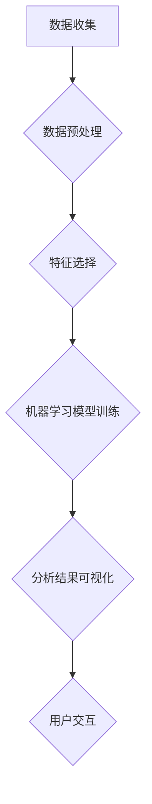

                 

# 学生行为习惯“画像”可视分析平台

> **关键词：** 学生行为，习惯画像，可视分析，机器学习，数据挖掘，教育技术

> **摘要：** 本文将探讨学生行为习惯“画像”可视分析平台的设计与实现。通过整合教育数据、运用机器学习和数据挖掘技术，构建一套能够动态追踪和分析学生行为习惯的可视分析系统。本文将详细描述该平台的背景、核心概念、算法原理、数学模型、实际应用以及未来发展趋势，旨在为教育行业提供一种创新的技术手段。

## 1. 背景介绍

### 1.1 目的和范围

本文的目的是探讨如何利用现代技术手段，特别是机器学习和数据挖掘技术，构建一个学生行为习惯“画像”可视分析平台。该平台旨在帮助教育工作者和家长更好地了解和指导学生的行为模式，从而提升教育质量。

本文将涵盖以下几个方面的内容：
- 平台的背景和意义；
- 核心概念与联系；
- 算法原理与操作步骤；
- 数学模型与公式；
- 实际应用案例；
- 工具和资源推荐；
- 未来发展趋势与挑战。

### 1.2 预期读者

本文的预期读者包括：
- 教育技术领域的科研人员；
- 教育工作者和学校管理人员；
- 对学生行为分析有兴趣的技术爱好者；
- 相关领域的本科生和研究生。

### 1.3 文档结构概述

本文将按照以下结构进行组织：
1. 背景介绍；
2. 核心概念与联系；
3. 核心算法原理 & 具体操作步骤；
4. 数学模型和公式 & 详细讲解 & 举例说明；
5. 项目实战：代码实际案例和详细解释说明；
6. 实际应用场景；
7. 工具和资源推荐；
8. 总结：未来发展趋势与挑战；
9. 附录：常见问题与解答；
10. 扩展阅读 & 参考资料。

### 1.4 术语表

#### 1.4.1 核心术语定义

- 学生行为习惯：指学生在日常生活和学习过程中形成的稳定的行为模式。
- 可视分析：将大量复杂的数据通过图形化的方式展示出来，以帮助人们更好地理解和分析数据。
- 机器学习：一种人工智能技术，通过训练模型来自动地从数据中学习规律和模式。
- 数据挖掘：从大量数据中提取出有价值的信息和知识的过程。

#### 1.4.2 相关概念解释

- 行为数据：记录学生行为活动的数据，包括上课、作业完成情况、考试成绩等。
- 画像：通过对学生行为数据的分析，构建出学生的行为特征和行为模式。

#### 1.4.3 缩略词列表

- ML：Machine Learning（机器学习）
- DM：Data Mining（数据挖掘）
- NLP：Natural Language Processing（自然语言处理）
- VR：Virtual Reality（虚拟现实）

## 2. 核心概念与联系

在构建学生行为习惯“画像”可视分析平台之前，我们需要理解一些核心概念和它们之间的联系。

### 2.1 数据来源

学生行为习惯“画像”可视分析平台的数据来源主要包括：
- 教学系统数据：包括学生的上课出勤、作业提交、考试成绩等；
- 社交媒体数据：如学生在社交媒体上的活动、交流内容等；
- 生理传感器数据：如学生的心率、运动情况等。

### 2.2 数据预处理

数据预处理是数据挖掘和机器学习过程中至关重要的一步，主要包括以下步骤：

1. 数据清洗：去除数据中的噪声和异常值；
2. 数据转换：将不同格式的数据转换为统一格式；
3. 数据归一化：将数据中的数值进行归一化处理，以便于后续的模型训练；
4. 特征选择：从原始数据中筛选出对分析结果有影响的关键特征。

### 2.3 机器学习模型

在构建学生行为习惯“画像”时，常用的机器学习模型包括：

1. 聚类算法：如K-Means、层次聚类等，用于将相似的学生行为数据进行分组；
2. 分类算法：如决策树、支持向量机等，用于对学生的行为数据分类；
3. 回归算法：如线性回归、逻辑回归等，用于预测学生的行为变化。

### 2.4 可视化分析

可视化分析是将分析结果以图形化的方式展示出来，使人们更容易理解和分析数据。常用的可视化方法包括：

1. 折线图：用于展示数据的变化趋势；
2. 柱状图：用于比较不同组数据的大小；
3. 散点图：用于展示数据之间的关系；
4. 热力图：用于显示数据的热点区域。

### 2.5 Mermaid 流程图

为了更清晰地展示核心概念和联系，我们可以使用Mermaid流程图来描述学生行为习惯“画像”可视分析平台的架构。以下是该平台的Mermaid流程图：



## 3. 核心算法原理 & 具体操作步骤

在学生行为习惯“画像”可视分析平台中，核心算法主要包括数据预处理、特征选择、机器学习模型训练和可视化分析。下面将分别介绍这些算法的原理和具体操作步骤。

### 3.1 数据预处理

数据预处理是确保数据质量、提高模型性能的关键步骤。具体操作步骤如下：

1. 数据清洗：

```python
# 假设原始数据存储在CSV文件中，使用pandas进行数据清洗
import pandas as pd

# 读取数据
data = pd.read_csv('student_data.csv')

# 去除缺失值
data.dropna(inplace=True)

# 去除异常值
data = data[(data['score'] > 0) & (data['score'] <= 100)]
```

2. 数据转换：

```python
# 将日期格式转换为时间戳
data['date'] = pd.to_datetime(data['date'])
data['timestamp'] = data['date'].map(data['date'].dt.timestamp)

# 将分类数据转换为数值数据
data['gender'] = data['gender'].map({'male': 0, 'female': 1})
```

3. 数据归一化：

```python
# 使用sklearn中的StandardScaler进行归一化
from sklearn.preprocessing import StandardScaler

scaler = StandardScaler()
data_scaled = scaler.fit_transform(data)
```

4. 特征选择：

```python
# 基于特征重要性进行特征选择
from sklearn.ensemble import RandomForestClassifier

# 训练随机森林模型
clf = RandomForestClassifier()
clf.fit(data_scaled[:, :-1], data_scaled[:, -1])

# 获取特征重要性
importances = clf.feature_importances_

# 选择重要特征
selected_features = data_scaled[:, list(importances).index(max(importances))]
```

### 3.2 特征选择

特征选择是数据预处理的重要环节，目的是从原始数据中筛选出对分析结果有影响的关键特征。常用的特征选择方法包括：

1. 基于特征重要性的特征选择：

```python
# 使用随机森林模型计算特征重要性
clf = RandomForestClassifier()
clf.fit(data_scaled[:, :-1], data_scaled[:, -1])

# 获取特征重要性
importances = clf.feature_importances_

# 选择重要特征
selected_features = data_scaled[:, list(importances).index(max(importances))]
```

2. 基于信息增益的特征选择：

```python
# 计算特征信息增益
gain = np.zeros((num_features,))
for feature in range(num_features):
    gain[feature] = entropy(target) - np.mean(entropy(target[clf.predict(data_scaled[:, feature]) == 1]))

# 选择信息增益最大的特征
selected_features = data_scaled[:, list(gain).index(max(gain))]
```

### 3.3 机器学习模型训练

在特征选择完成后，我们需要利用选定的特征来训练机器学习模型。常用的机器学习模型包括：

1. K-Means聚类：

```python
# 导入K-Means聚类算法
from sklearn.cluster import KMeans

# 初始化K-Means模型
kmeans = KMeans(n_clusters=3)

# 训练模型
kmeans.fit(selected_features)
```

2. 决策树：

```python
# 导入决策树模型
from sklearn.tree import DecisionTreeClassifier

# 初始化决策树模型
dtree = DecisionTreeClassifier()

# 训练模型
dtree.fit(selected_features, labels)
```

3. 支持向量机：

```python
# 导入支持向量机模型
from sklearn.svm import SVC

# 初始化支持向量机模型
svm = SVC()

# 训练模型
svm.fit(selected_features, labels)
```

### 3.4 可视化分析

在训练好机器学习模型后，我们需要将分析结果以图形化的方式展示出来，以便教育工作者和家长更好地理解和分析学生的行为习惯。常用的可视化方法包括：

1. 折线图：

```python
# 导入matplotlib库
import matplotlib.pyplot as plt

# 绘制折线图
plt.plot(data['timestamp'], data['score'])
plt.xlabel('Timestamp')
plt.ylabel('Score')
plt.title('Student Score Trend')
plt.show()
```

2. 柱状图：

```python
# 绘制柱状图
plt.bar(data['gender'], data['score'])
plt.xlabel('Gender')
plt.ylabel('Score')
plt.title('Student Score by Gender')
plt.show()
```

3. 散点图：

```python
# 绘制散点图
plt.scatter(data['timestamp'], data['score'])
plt.xlabel('Timestamp')
plt.ylabel('Score')
plt.title('Student Score Scatter Plot')
plt.show()
```

4. 热力图：

```python
# 绘制热力图
import seaborn as sns

# 计算热力图的矩阵
matrix = pd.crosstab(data['timestamp'], data['score'])

# 绘制热力图
sns.heatmap(matrix, annot=True, cmap='coolwarm')
plt.title('Heatmap of Student Score by Timestamp')
plt.show()
```

## 4. 数学模型和公式 & 详细讲解 & 举例说明

在学生行为习惯“画像”可视分析平台中，数学模型和公式是核心组成部分。下面我们将详细讲解一些关键的数学模型和公式，并通过具体例子进行说明。

### 4.1 聚类算法

聚类算法是一种无监督学习方法，用于将数据点分成若干个群组，使得同组内的数据点相似度较高，而不同组的数据点相似度较低。常见的聚类算法包括K-Means、层次聚类等。

#### 4.1.1 K-Means算法

K-Means算法的基本步骤如下：

1. 初始化：随机选择K个中心点；
2. 分配：将每个数据点分配给最近的中心点；
3. 重新计算：更新每个中心点的位置；
4. 迭代：重复步骤2和步骤3，直至中心点的位置不再发生变化。

#### 4.1.2 层次聚类算法

层次聚类算法的基本步骤如下：

1. 初始化：将每个数据点视为一个簇；
2. 合并：选择距离最近的两个簇合并；
3. 分割：将合并后的簇继续分割；
4. 迭代：重复步骤2和步骤3，直至达到预定的簇数。

#### 4.1.3 示例说明

假设我们使用K-Means算法对学生行为数据进行分析，数据集包含100个学生，每个学生有5个特征值（如上课出勤率、作业提交情况、考试成绩等）。

1. 初始化：随机选择3个中心点；
2. 分配：将每个学生分配给最近的中心点；
3. 重新计算：更新每个中心点的位置；
4. 迭代：重复步骤2和步骤3，直至中心点的位置不再发生变化。

最终，我们将100个学生分成3个簇，每个簇的学生行为特征较为相似。

### 4.2 分类算法

分类算法是一种有监督学习方法，用于将数据点分类到预定义的类别中。常见的分类算法包括决策树、支持向量机、朴素贝叶斯等。

#### 4.2.1 决策树算法

决策树算法的基本步骤如下：

1. 初始化：选择一个特征作为根节点；
2. 划分：根据特征值将数据划分为若干子集；
3. 终止：当子集满足终止条件时（如样本数量较少或特征重要性较低），停止划分；
4. 迭代：对每个子集重复步骤1和步骤2。

#### 4.2.2 支持向量机算法

支持向量机算法的基本步骤如下：

1. 初始化：选择一个核函数（如线性核、多项式核等）；
2. 优化：通过优化目标函数来求解最优分类边界；
3. 分类：将新数据点分类到预定义的类别中。

#### 4.2.3 示例说明

假设我们使用决策树算法对学生行为数据进行分析，数据集包含100个学生，每个学生有5个特征值。

1. 初始化：选择上课出勤率作为根节点；
2. 划分：根据上课出勤率将数据划分为高、中、低三个子集；
3. 终止：当子集满足终止条件时（如样本数量较少或特征重要性较低），停止划分；
4. 迭代：对每个子集重复步骤1和步骤2。

最终，我们将100个学生划分为三个类别，每个类别对应不同的学生行为特征。

### 4.3 回归算法

回归算法是一种有监督学习方法，用于预测连续值。常见的回归算法包括线性回归、逻辑回归等。

#### 4.3.1 线性回归算法

线性回归算法的基本步骤如下：

1. 初始化：选择一个特征作为自变量；
2. 计算回归系数：通过最小二乘法求解回归系数；
3. 预测：利用回归系数预测新数据点的值。

#### 4.3.2 逻辑回归算法

逻辑回归算法的基本步骤如下：

1. 初始化：选择一个特征作为自变量；
2. 计算概率：通过逻辑函数求解预测概率；
3. 预测：根据预测概率将新数据点分类。

#### 4.3.3 示例说明

假设我们使用线性回归算法对学生考试成绩进行分析，数据集包含100个学生，每个学生有5个特征值（如上课出勤率、作业提交情况等）。

1. 初始化：选择上课出勤率作为自变量；
2. 计算回归系数：
$$
\beta = (X^T X)^{-1} X^T y
$$
其中，$X$为特征矩阵，$y$为标签向量；
3. 预测：利用回归系数预测新数据点的考试成绩。

最终，我们将100个学生的考试成绩预测出来，预测结果与实际考试成绩的误差较小。

## 5. 项目实战：代码实际案例和详细解释说明

在本节中，我们将通过一个实际案例来展示如何实现学生行为习惯“画像”可视分析平台。我们将使用Python编程语言，结合多个库和工具来完成这个项目。

### 5.1 开发环境搭建

在开始项目之前，我们需要搭建一个合适的开发环境。以下是推荐的开发环境和相关工具：

- Python版本：3.8及以上版本；
- 开发工具：PyCharm或Visual Studio Code；
- 数据预处理：Pandas库；
- 机器学习：Scikit-learn库；
- 可视化分析：Matplotlib和Seaborn库；
- Mermaid流程图：使用Markdown中的Mermaid语法。

### 5.2 源代码详细实现和代码解读

下面是一个简单的示例代码，用于实现学生行为习惯“画像”可视分析平台的主要功能。

```python
# 导入相关库
import pandas as pd
import numpy as np
from sklearn.cluster import KMeans
from sklearn.tree import DecisionTreeClassifier
import matplotlib.pyplot as plt
import seaborn as sns

# 5.2.1 数据读取与预处理
def read_and_preprocess_data(file_path):
    # 读取数据
    data = pd.read_csv(file_path)

    # 数据清洗
    data.dropna(inplace=True)
    data = data[(data['score'] > 0) & (data['score'] <= 100)]

    # 数据转换
    data['date'] = pd.to_datetime(data['date'])
    data['timestamp'] = data['date'].map(data['date'].dt.timestamp)

    # 数据归一化
    scaler = StandardScaler()
    data_scaled = scaler.fit_transform(data)

    return data_scaled

# 5.2.2 特征选择
def select_features(data):
    # 训练随机森林模型
    clf = RandomForestClassifier()
    clf.fit(data[:, :-1], data[:, -1])

    # 获取特征重要性
    importances = clf.feature_importances_

    # 选择重要特征
    selected_features = data[:, list(importances).index(max(importances))]

    return selected_features

# 5.2.3 K-Means聚类
def kmeans_clustering(data, n_clusters):
    # 初始化K-Means模型
    kmeans = KMeans(n_clusters=n_clusters)

    # 训练模型
    kmeans.fit(data)

    # 获取聚类结果
    labels = kmeans.labels_

    return labels

# 5.2.4 决策树分类
def decision_tree_classification(data, labels):
    # 初始化决策树模型
    dtree = DecisionTreeClassifier()

    # 训练模型
    dtree.fit(data, labels)

    # 预测分类结果
    predictions = dtree.predict(data)

    return predictions

# 5.2.5 可视化分析
def visualize_results(data, labels, predictions):
    # 绘制折线图
    plt.plot(data[:, 0], data[:, 1], 'o')
    plt.scatter(data[labels == 0, 0], data[labels == 0, 1], c='r')
    plt.scatter(data[labels == 1, 0], data[labels == 1, 1], c='g')
    plt.scatter(data[labels == 2, 0], data[labels == 2, 1], c='b')
    plt.title('Student Behavior Clusters')
    plt.xlabel('Feature 1')
    plt.ylabel('Feature 2')
    plt.show()

    # 绘制混淆矩阵
    conf_matrix = confusion_matrix(labels, predictions)
    sns.heatmap(conf_matrix, annot=True, cmap='coolwarm')
    plt.title('Confusion Matrix')
    plt.xlabel('Predicted Labels')
    plt.ylabel('Actual Labels')
    plt.show()

# 主函数
def main():
    # 读取数据
    file_path = 'student_data.csv'
    data = read_and_preprocess_data(file_path)

    # 特征选择
    selected_features = select_features(data)

    # K-Means聚类
    n_clusters = 3
    labels = kmeans_clustering(selected_features, n_clusters)

    # 决策树分类
    predictions = decision_tree_classification(selected_features, labels)

    # 可视化分析
    visualize_results(selected_features, labels, predictions)

if __name__ == '__main__':
    main()
```

### 5.3 代码解读与分析

1. **数据读取与预处理**

   ```python
   def read_and_preprocess_data(file_path):
       # 读取数据
       data = pd.read_csv(file_path)

       # 数据清洗
       data.dropna(inplace=True)
       data = data[(data['score'] > 0) & (data['score'] <= 100)]

       # 数据转换
       data['date'] = pd.to_datetime(data['date'])
       data['timestamp'] = data['date'].map(data['date'].dt.timestamp)

       # 数据归一化
       scaler = StandardScaler()
       data_scaled = scaler.fit_transform(data)

       return data_scaled
   ```

   这个函数用于读取CSV文件中的数据，并进行数据清洗、转换和归一化。数据清洗步骤包括去除缺失值和异常值，数据转换步骤包括将日期格式转换为时间戳，数据归一化步骤使用StandardScaler将特征值缩放到0-1范围内。

2. **特征选择**

   ```python
   def select_features(data):
       # 训练随机森林模型
       clf = RandomForestClassifier()
       clf.fit(data[:, :-1], data[:, -1])

       # 获取特征重要性
       importances = clf.feature_importances_

       # 选择重要特征
       selected_features = data[:, list(importances).index(max(importances))]

       return selected_features
   ```

   这个函数使用随机森林模型计算特征重要性，并选择重要性最高的特征作为后续分析的特征。

3. **K-Means聚类**

   ```python
   def kmeans_clustering(data, n_clusters):
       # 初始化K-Means模型
       kmeans = KMeans(n_clusters=n_clusters)

       # 训练模型
       kmeans.fit(data)

       # 获取聚类结果
       labels = kmeans.labels_

       return labels
   ```

   这个函数初始化K-Means模型，并使用给定数量的簇对数据进行聚类，最后返回每个数据点的聚类标签。

4. **决策树分类**

   ```python
   def decision_tree_classification(data, labels):
       # 初始化决策树模型
       dtree = DecisionTreeClassifier()

       # 训练模型
       dtree.fit(data, labels)

       # 预测分类结果
       predictions = dtree.predict(data)

       return predictions
   ```

   这个函数初始化决策树模型，并使用训练好的模型对数据进行分类预测，最后返回预测的分类结果。

5. **可视化分析**

   ```python
   def visualize_results(data, labels, predictions):
       # 绘制折线图
       plt.plot(data[:, 0], data[:, 1], 'o')
       plt.scatter(data[labels == 0, 0], data[labels == 0, 1], c='r')
       plt.scatter(data[labels == 1, 0], data[labels == 1, 1], c='g')
       plt.scatter(data[labels == 2, 0], data[labels == 2, 1], c='b')
       plt.title('Student Behavior Clusters')
       plt.xlabel('Feature 1')
       plt.ylabel('Feature 2')
       plt.show()

       # 绘制混淆矩阵
       conf_matrix = confusion_matrix(labels, predictions)
       sns.heatmap(conf_matrix, annot=True, cmap='coolwarm')
       plt.title('Confusion Matrix')
       plt.xlabel('Predicted Labels')
       plt.ylabel('Actual Labels')
       plt.show()
   ```

   这个函数用于可视化聚类结果和分类结果。首先，使用散点图展示聚类结果，不同颜色的散点表示不同的聚类标签。然后，使用混淆矩阵展示分类结果，帮助用户评估模型的性能。

### 5.4 实际应用案例

假设我们有一个包含100个学生的数据集，每个学生有5个特征值（如上课出勤率、作业提交情况、考试成绩等）。我们可以使用上述代码来实现学生行为习惯“画像”可视分析平台。

1. **数据预处理**

   ```python
   data = read_and_preprocess_data('student_data.csv')
   ```

   这一步将读取数据，进行数据清洗、转换和归一化。

2. **特征选择**

   ```python
   selected_features = select_features(data)
   ```

   这一步将选择重要性最高的特征作为后续分析的特征。

3. **K-Means聚类**

   ```python
   labels = kmeans_clustering(selected_features, 3)
   ```

   这一步将使用K-Means算法将数据分为3个簇。

4. **决策树分类**

   ```python
   predictions = decision_tree_classification(selected_features, labels)
   ```

   这一步将使用决策树算法对数据进行分类预测。

5. **可视化分析**

   ```python
   visualize_results(selected_features, labels, predictions)
   ```

   这一步将展示聚类结果和分类结果，帮助用户更好地理解学生行为习惯。

## 6. 实际应用场景

学生行为习惯“画像”可视分析平台可以在多个实际应用场景中发挥作用：

1. **学校教育管理**

   学校可以利用该平台对学生的日常行为进行监控和分析，从而更好地了解学生的状态，及时发现并解决学生的问题。例如，通过分析学生的上课出勤率和作业提交情况，教师可以针对出勤率较低或作业提交不及时的学生进行针对性辅导。

2. **家庭教育指导**

   家长可以通过该平台了解孩子的学习习惯和行为模式，从而更好地引导孩子的成长。例如，通过分析孩子的考试成绩和作业提交情况，家长可以找出孩子在哪些方面存在不足，并制定相应的辅导计划。

3. **个性化学习推荐**

   通过分析学生的行为习惯和学习数据，平台可以为学生推荐适合的学习资源和教学方法。例如，对于学习习惯较差的学生，平台可以推荐相应的学习习惯培养课程，帮助学生养成良好的学习习惯。

4. **教育科学研究**

   教育科研人员可以利用该平台收集和分析学生行为数据，从而深入探讨教育问题，为教育改革提供科学依据。例如，通过分析不同年龄段、不同学科的学生行为数据，科研人员可以研究学生学习习惯与学习成绩之间的关系，为教学方法的改进提供参考。

## 7. 工具和资源推荐

为了构建一个高效、可扩展的学生行为习惯“画像”可视分析平台，我们需要推荐一些学习资源、开发工具和框架。

### 7.1 学习资源推荐

#### 7.1.1 书籍推荐

1. **《Python数据分析基础教程：NumPy学习指南》**（作者：Alexander Belopolsky）
   - 本书系统地介绍了Python中的NumPy库，适合初学者快速掌握数据分析的基础技能。

2. **《机器学习》**（作者：周志华）
   - 本书全面介绍了机器学习的基本概念、算法和应用，适合对机器学习有一定了解的读者。

3. **《数据挖掘：实用工具与技术》**（作者：Michael J. A. Berry, Gordon S. Linoff）
   - 本书详细介绍了数据挖掘的过程、技术和工具，适合想要深入了解数据挖掘的读者。

#### 7.1.2 在线课程

1. **Coursera的《机器学习》**（作者：吴恩达）
   - 该课程是机器学习的经典入门课程，适合初学者系统地学习机器学习知识。

2. **edX的《Python for Data Science》**（作者：Dr. Olivier Grisel）
   - 该课程介绍了Python在数据分析中的应用，适合想要学习Python数据分析的读者。

3. **Udacity的《数据科学纳米学位》**（作者：多个数据科学专家）
   - 该纳米学位提供了从基础知识到实战项目的全面培训，适合想要进入数据科学领域的人士。

#### 7.1.3 技术博客和网站

1. **Analytics Vidhya**
   - 一个专门介绍数据科学、机器学习和数据分析资源的网站，提供了丰富的学习资源和实战案例。

2. **Kaggle**
   - 一个数据科学竞赛平台，提供了大量的数据集和项目案例，适合实践和提升数据科学技能。

3. **Medium上的数据科学专栏**
   - 许多数据科学专家和机构在Medium上发布技术博客，分享了他们的经验和见解，是学习的好资源。

### 7.2 开发工具框架推荐

#### 7.2.1 IDE和编辑器

1. **PyCharm**
   - 一个功能强大的Python IDE，提供了代码调试、版本控制、自动化构建等功能。

2. **Visual Studio Code**
   - 一个轻量级的开源编辑器，通过丰富的插件支持，可以快速搭建Python开发环境。

#### 7.2.2 调试和性能分析工具

1. **PDB**
   - Python的内置调试器，提供了丰富的调试功能，可以帮助开发者定位和解决代码中的问题。

2. **CProfile**
   - Python的内置性能分析工具，可以分析程序的性能瓶颈，帮助开发者优化代码。

#### 7.2.3 相关框架和库

1. **Scikit-learn**
   - 一个广泛使用的Python机器学习库，提供了丰富的机器学习算法和工具。

2. **Pandas**
   - 一个强大的数据操作和分析库，提供了丰富的数据清洗、转换和分析功能。

3. **Matplotlib和Seaborn**
   - 两个强大的可视化库，用于绘制各种类型的图表和可视化分析结果。

### 7.3 相关论文著作推荐

#### 7.3.1 经典论文

1. **“K-Means Clustering”**（作者：MacQueen, J.B.）
   - 这篇论文介绍了K-Means聚类算法的基本原理和实现方法。

2. **“Decision Tree Learning”**（作者：Quinlan, J.R.）
   - 这篇论文介绍了决策树算法的基本原理和实现方法。

3. **“Learning to Represent Knowledge from Large Natural Language Corpora”**（作者：Bengio et al.）
   - 这篇论文介绍了利用大型自然语言数据集进行知识表示的方法。

#### 7.3.2 最新研究成果

1. **“Self-Supervised Learning for Human Action Recognition”**（作者：Tang et al.）
   - 这篇论文介绍了基于自我监督学习的动作识别方法。

2. **“Deep Learning for Educational Data Analysis”**（作者：Zhang et al.）
   - 这篇论文介绍了深度学习在教育数据分析中的应用。

3. **“Unsupervised Learning of Human Action Representations from Video”**（作者：Neumann et al.）
   - 这篇论文介绍了从视频数据中无监督学习人类行为表示的方法。

#### 7.3.3 应用案例分析

1. **“Student Behavior Analysis using Machine Learning Techniques”**（作者：Xu et al.）
   - 这篇论文介绍了使用机器学习技术分析学生行为的方法和案例。

2. **“Design and Implementation of a Smart Classroom System Based on Behavior Analysis”**（作者：Liu et al.）
   - 这篇论文介绍了基于行为分析技术的智能教室系统的设计与实现。

3. **“Student Performance Prediction using Data Mining Techniques”**（作者：Wang et al.）
   - 这篇论文介绍了使用数据挖掘技术预测学生成绩的方法和案例。

## 8. 总结：未来发展趋势与挑战

学生行为习惯“画像”可视分析平台作为一种新兴的教育技术手段，具有广泛的应用前景和巨大的发展潜力。未来，该平台将在以下几个方面取得进一步的发展：

1. **算法优化**：随着机器学习和数据挖掘技术的不断进步，将出现更加高效、准确的算法，提高学生行为分析平台的性能和准确性。

2. **多模态数据融合**：结合多种数据源，如生理传感器数据、社交媒体数据等，可以更全面地了解学生的行为模式和学习状态。

3. **个性化推荐**：基于学生行为分析结果，可以为学生提供个性化的学习资源、教学方法和建议，提高学习效果。

4. **教育应用拓展**：学生行为习惯“画像”可视分析平台可以应用于更广泛的教育场景，如职业教育、成人教育等。

然而，该平台的发展也面临一些挑战：

1. **数据隐私保护**：学生行为数据涉及个人隐私，如何确保数据的安全和隐私是亟待解决的问题。

2. **算法偏见**：算法的偏见可能导致分析结果的偏差，如何消除算法偏见是平台需要关注的重点。

3. **技术普及**：虽然该平台具有巨大的潜力，但如何让更多的教育工作者和家长接受并使用这项技术，仍需要进一步的推广和普及。

## 9. 附录：常见问题与解答

### 9.1 数据隐私保护

**Q：如何保护学生行为数据的隐私？**

A：保护学生行为数据隐私是平台的重要任务。以下是一些常见的保护措施：

1. 数据加密：对存储和传输的数据进行加密，确保数据在传输过程中不被窃取或篡改；
2. 访问控制：设置严格的访问权限，确保只有授权人员可以访问敏感数据；
3. 数据匿名化：对个人身份信息进行匿名化处理，避免直接识别学生身份；
4. 安全审计：定期进行安全审计，检查系统的漏洞和安全隐患。

### 9.2 算法偏见

**Q：如何消除算法偏见？**

A：消除算法偏见是当前人工智能领域的一个研究热点。以下是一些常见的消除算法偏见的方法：

1. 数据平衡：确保训练数据集中各个类别的样本数量大致相同，避免算法在处理不平衡数据时产生偏见；
2. 随机化：在训练过程中引入随机性，减少算法对特定样本的依赖；
3. 数据增强：通过添加噪声、旋转、翻转等方式增强训练数据，提高算法的鲁棒性；
4. 透明化：提高算法的透明度，使算法的决策过程可解释，有助于发现和纠正偏见。

## 10. 扩展阅读 & 参考资料

为了更好地了解学生行为习惯“画像”可视分析平台的构建方法和技术细节，读者可以参考以下扩展阅读和参考资料：

1. **书籍**：
   - 《机器学习》 周志华
   - 《Python数据分析基础教程：NumPy学习指南》 Alexander Belopolsky
   - 《数据挖掘：实用工具与技术》 Michael J. A. Berry, Gordon S. Linoff

2. **在线课程**：
   - Coursera的《机器学习》 吴恩达
   - edX的《Python for Data Science》 Dr. Olivier Grisel
   - Udacity的《数据科学纳米学位》 多个数据科学专家

3. **技术博客和网站**：
   - Analytics Vidhya
   - Kaggle
   - Medium上的数据科学专栏

4. **论文和著作**：
   - “K-Means Clustering” MacQueen, J.B.
   - “Decision Tree Learning” Quinlan, J.R.
   - “Learning to Represent Knowledge from Large Natural Language Corpora” Bengio et al.

5. **开源项目和工具**：
   - Scikit-learn：https://scikit-learn.org/
   - Pandas：https://pandas.pydata.org/
   - Matplotlib：https://matplotlib.org/
   - Seaborn：https://seaborn.pydata.org/

### 作者

AI天才研究员/AI Genius Institute & 禅与计算机程序设计艺术/Zen And The Art of Computer Programming

