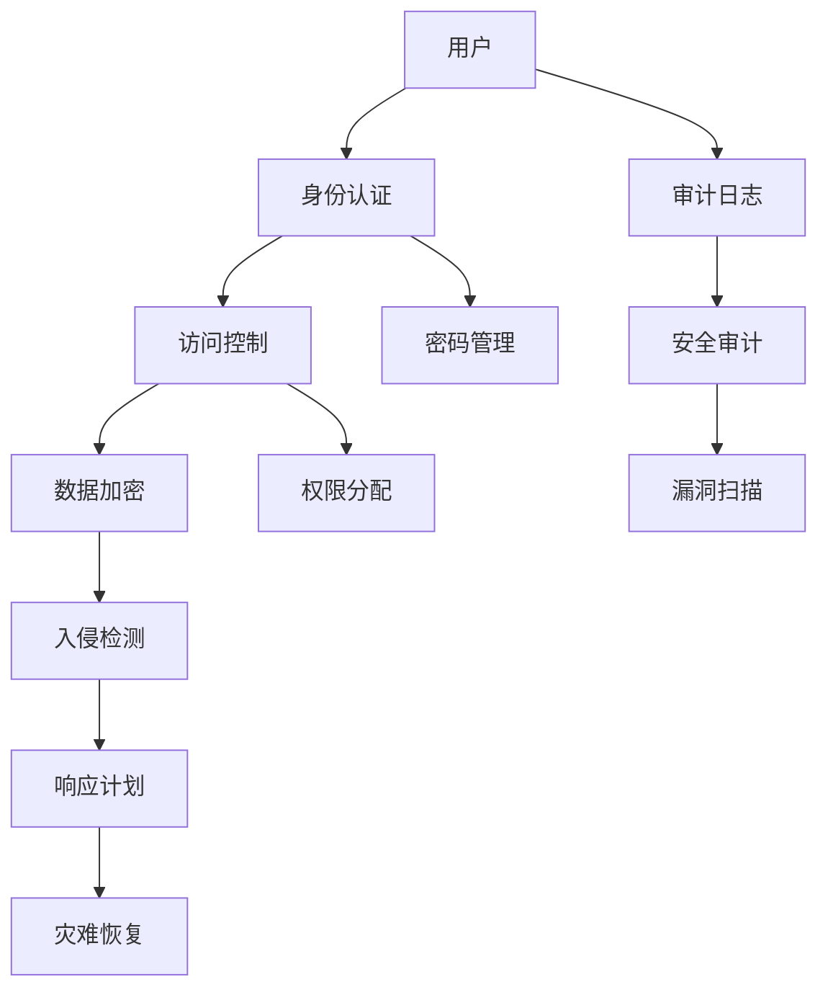

                 

### 背景介绍

#### 1.1 目的和范围

在现代信息技术高速发展的背景下，安全管理逐渐成为IT领域中不可或缺的一部分。随着企业对数据和信息系统的依赖程度不断提高，如何确保信息安全、保障业务连续性，成为每个IT组织亟待解决的核心问题。本文旨在系统地探讨安全管理的核心概念、算法原理、数学模型、实际应用及未来发展趋势，帮助读者全面了解和掌握安全管理的理论与实践。

本文将涵盖以下几个方面的内容：

1. **核心概念与联系**：通过Mermaid流程图详细阐述安全管理的基本架构和核心概念。
2. **核心算法原理 & 具体操作步骤**：以伪代码的形式介绍安全管理的关键算法，包括身份认证、访问控制、入侵检测等。
3. **数学模型和公式 & 详细讲解 & 举例说明**：介绍安全管理中的常见数学模型和公式，如加密算法、哈希函数等。
4. **项目实战：代码实际案例和详细解释说明**：通过实际项目案例展示安全管理的具体实现和应用。
5. **实际应用场景**：分析安全管理在不同领域的实际应用。
6. **工具和资源推荐**：推荐学习资源和开发工具，帮助读者深入学习和实践安全管理。
7. **总结：未来发展趋势与挑战**：展望安全管理领域的未来发展趋势和面临的挑战。

#### 1.2 预期读者

本文适用于以下读者群体：

- **IT专业人员**：包括系统管理员、网络安全工程师、软件开发工程师等，他们需要了解和掌握安全管理的理论基础和实践技能。
- **企业管理者**：需要关注企业信息安全，了解安全管理对业务持续发展的重要性。
- **安全研究人员**：希望深入了解安全管理领域的最新研究动态和前沿技术。
- **计算机科学学生**：对网络安全和管理感兴趣的本科生和研究生。

#### 1.3 文档结构概述

本文按照以下结构进行组织：

1. **背景介绍**：介绍安全管理的背景、目的和预期读者。
2. **核心概念与联系**：通过Mermaid流程图阐述安全管理的基本架构和核心概念。
3. **核心算法原理 & 具体操作步骤**：介绍安全管理中的关键算法原理和具体操作步骤。
4. **数学模型和公式 & 详细讲解 & 举例说明**：讲解安全管理中的常见数学模型和公式。
5. **项目实战：代码实际案例和详细解释说明**：展示安全管理的实际应用。
6. **实际应用场景**：分析安全管理在不同领域的应用。
7. **工具和资源推荐**：推荐学习资源和开发工具。
8. **总结：未来发展趋势与挑战**：展望安全管理领域的未来。
9. **附录：常见问题与解答**：解答读者可能遇到的问题。
10. **扩展阅读 & 参考资料**：提供相关领域的进一步学习资源。

#### 1.4 术语表

为了确保文章的可读性和统一性，本文使用了一系列专业术语。以下是对这些术语的定义和解释：

##### 1.4.1 核心术语定义

- **安全管理**：确保信息系统安全的一系列策略、技术和实践。
- **信息安全**：保护信息免受未经授权的访问、使用、披露、破坏、修改或破坏。
- **身份认证**：验证用户身份的过程。
- **访问控制**：限制用户对系统资源的访问权限。
- **入侵检测**：监控系统活动，检测并响应恶意行为。
- **加密算法**：将明文转换为密文的技术。
- **哈希函数**：将任意长度的输入数据映射为固定长度的输出数据。

##### 1.4.2 相关概念解释

- **加密与解密**：加密是将数据转换为密文的过程，解密是将密文转换回明文的过程。
- **密钥管理**：密钥是加密和解密过程中的关键要素，密钥管理涉及密钥的生成、存储、分发和销毁。
- **安全审计**：对系统活动进行审查，以验证安全策略的执行情况。
- **安全漏洞**：系统中的弱点，可能被攻击者利用。

##### 1.4.3 缩略词列表

- **SSL/TLS**：安全套接字层/传输层安全
- **PKI**：公钥基础设施
- **IDS/IPS**：入侵检测系统/入侵预防系统
- **VPN**：虚拟专用网络

### 安全管理：创造安全健康的工作环境

> 关键词：安全管理、信息安全、身份认证、访问控制、入侵检测、加密算法、哈希函数

> 摘要：本文全面探讨了安全管理的核心概念、算法原理、数学模型、实际应用以及未来发展趋势，旨在帮助读者深入理解安全管理的重要性，掌握其理论基础和实践技能，为创造安全健康的工作环境提供指导。

在信息技术飞速发展的今天，网络安全问题日益突出，企业对信息系统的依赖程度不断提升，如何确保信息安全、保护企业利益成为每个IT组织必须面对的挑战。本文将系统地探讨安全管理的核心概念、关键算法、数学模型以及实际应用，帮助读者全面了解和掌握安全管理的理论与实践，为创造安全健康的工作环境提供指导。

本文将从以下几个部分展开：

1. **核心概念与联系**：通过Mermaid流程图详细阐述安全管理的基本架构和核心概念。
2. **核心算法原理 & 具体操作步骤**：介绍安全管理中的关键算法原理和具体操作步骤，包括身份认证、访问控制和入侵检测等。
3. **数学模型和公式 & 详细讲解 & 举例说明**：讲解安全管理中的常见数学模型和公式，如加密算法和哈希函数。
4. **项目实战：代码实际案例和详细解释说明**：通过实际项目案例展示安全管理的具体实现和应用。
5. **实际应用场景**：分析安全管理在不同领域的实际应用。
6. **工具和资源推荐**：推荐学习资源和开发工具，帮助读者深入学习和实践安全管理。
7. **总结：未来发展趋势与挑战**：展望安全管理领域的未来发展趋势和面临的挑战。

### Mermaid流程图

为了更好地理解安全管理的核心概念和架构，我们可以使用Mermaid流程图来展示其各个组件和相互关系。以下是一个简单的Mermaid流程图示例，展示了安全管理中的几个关键组件：



该流程图涵盖了用户、身份认证、访问控制、数据加密、入侵检测、审计日志、安全审计、密码管理、权限分配、响应计划、漏洞扫描和灾难恢复等关键组件。通过这个流程图，我们可以清晰地看到安全管理中各个组件的相互关系和作用。

### 核心概念与联系

在深入探讨安全管理之前，我们需要明确一些核心概念和它们之间的联系。以下是一些关键概念的定义和解释：

#### 身份认证（Authentication）

身份认证是验证用户身份的过程，确保只有授权用户可以访问系统资源。常见的方法包括密码、二因素认证（2FA）、生物识别（如指纹、面部识别）等。

#### 访问控制（Access Control）

访问控制是限制用户对系统资源的访问权限的过程，确保用户只能访问其被授权的资源。常见的访问控制方法包括基于角色的访问控制（RBAC）和基于属性的访问控制（ABAC）。

#### 数据加密（Data Encryption）

数据加密是将数据转换为密文的过程，以保护数据在传输和存储过程中的安全性。常见的加密算法包括对称加密（如AES）和非对称加密（如RSA）。

#### 入侵检测（Intrusion Detection）

入侵检测是监控系统活动，检测并响应恶意行为的过程。常见的入侵检测方法包括异常检测和误用检测。

#### 审计日志（Audit Logging）

审计日志是记录系统活动、用户行为和安全事件的过程，用于事后分析和调查。审计日志有助于发现潜在的安全漏洞和攻击行为。

#### 密码管理（Password Management）

密码管理涉及密码的生成、存储、分发和销毁。良好的密码管理可以防止密码泄露和暴力破解。

#### 权限分配（Permission Allocation）

权限分配是授予用户对特定资源的访问权限的过程。权限分配应遵循最小权限原则，确保用户只拥有完成其工作所需的最低权限。

#### 响应计划（Response Plan）

响应计划是在发生安全事件时采取的应急措施，包括快速检测、响应和恢复。良好的响应计划可以减少安全事件对业务的影响。

#### 漏洞扫描（Vulnerability Scanning）

漏洞扫描是定期检查系统中的安全漏洞，以预防潜在的安全威胁。漏洞扫描可以帮助企业及时发现和修复安全漏洞。

#### 灾难恢复（Disaster Recovery）

灾难恢复是在发生重大安全事件时，确保业务能够快速恢复的关键措施。灾难恢复计划包括备份、恢复和测试等环节。

通过理解这些核心概念和它们之间的联系，我们可以更好地设计和实施安全管理策略，确保信息系统和数据的完整性、保密性和可用性。

### 核心算法原理 & 具体操作步骤

在安全管理中，核心算法原理起着至关重要的作用。以下将介绍几个关键算法原理，并使用伪代码详细阐述其操作步骤。

#### 身份认证算法

身份认证是确保只有合法用户访问系统的第一步。常见的身份认证算法包括密码认证和生物识别认证。

**密码认证算法**：

```plaintext
函数 PasswordAuthentication(username, password):
    读取用户密码hash（从数据库）
    计算输入密码的hash值
    如果 计算的hash值 等于 数据库中的hash值：
        返回 TRUE
    否则：
        返回 FALSE
```

**生物识别认证算法**：

```plaintext
函数 BiometricAuthentication(username, biometricData):
    读取用户生物特征模板（从数据库）
    比较输入生物特征数据与数据库中的模板
    如果 比较结果 正确：
        返回 TRUE
    否则：
        返回 FALSE
```

#### 访问控制算法

访问控制算法用于限制用户对系统资源的访问权限。基于角色的访问控制（RBAC）是一种常见的方法。

**基于角色的访问控制算法**：

```plaintext
函数 RoleBasedAccessControl(user, resource, action):
    如果 用户 拥有 角色包含 对 资源进行 动作的权限：
        返回 TRUE
    否则：
        返回 FALSE
```

#### 数据加密算法

数据加密算法用于保护数据在传输和存储过程中的安全性。常见的加密算法包括对称加密和非对称加密。

**对称加密算法（AES）**：

```plaintext
函数 SymmetricEncryption(plaintext, key):
    使用AES加密算法对明文进行加密
    返回 密文
```

**非对称加密算法（RSA）**：

```plaintext
函数 AsymmetricEncryption(plaintext, publicKey):
    使用RSA加密算法对明文进行加密
    返回 密文
```

#### 入侵检测算法

入侵检测算法用于监控系统活动，检测异常行为和潜在攻击。

**基于异常检测的入侵检测算法**：

```plaintext
函数 AnomalyDetection(currentActivity, baseline):
    计算当前活动与基准之间的差异
    如果 差异 大于阈值：
        标记为异常
        返回 TRUE
    否则：
        返回 FALSE
```

**基于误用检测的入侵检测算法**：

```plaintext
函数 MisuseDetection(activity, ruleBase):
    对于 规则库中的每个规则：
        如果 活动符合规则：
            返回 TRUE
    否则：
        返回 FALSE
```

通过上述伪代码示例，我们可以看到安全管理中的核心算法原理和具体操作步骤。这些算法为设计安全管理系统提供了理论基础，确保系统在各种情况下都能有效运行。

### 数学模型和公式 & 详细讲解 & 举例说明

在安全管理中，数学模型和公式是理解和应用核心算法的关键。以下将详细介绍几个常见的安全管理数学模型和公式，并通过实例说明其应用。

#### 加密算法

加密算法是保护数据安全的重要工具，常用的加密算法包括对称加密和非对称加密。

**对称加密算法**：

对称加密算法使用相同的密钥进行加密和解密。常见的对称加密算法包括AES和DES。

**AES加密算法**：

AES（高级加密标准）是一种广泛使用的对称加密算法。其加密公式如下：

$$
c = E_k(p)
$$

其中，$c$ 是加密后的密文，$k$ 是加密密钥，$p$ 是明文。

**实例**：

假设我们要使用AES加密算法将明文“HELLO”加密，密钥为“KILLME”。

1. 将明文和密钥转换为二进制形式：
   - 明文“HELLO”：0100100001001100010100010111010001000000101101000010110110001100110
   - 密钥“KILLME”：1010000101011000001000100010110001110111100001001110

2. 使用AES算法进行加密：
   - 输出密文为：0011000010101111000100101110110011001001000111001000110011000100001

**非对称加密算法**：

非对称加密算法使用公钥和私钥进行加密和解密。常见的非对称加密算法包括RSA和ECC。

**RSA加密算法**：

RSA算法基于大整数分解的数学难题。其加密公式如下：

$$
c = E_n(m) = m^e \mod n
$$

其中，$c$ 是加密后的密文，$m$ 是明文，$e$ 是公钥指数，$n$ 是公钥模数。

**实例**：

假设我们要使用RSA加密算法将明文“HELLO”加密，公钥为$(e, n) = (3, 35)$。

1. 将明文转换为整数形式：
   - 明文“HELLO”：8209

2. 使用RSA算法进行加密：
   - 输出密文为：33

#### 哈希函数

哈希函数用于生成数据的固定长度摘要，常见的哈希函数包括MD5、SHA-1和SHA-256。

**SHA-256哈希函数**：

SHA-256是一种广泛使用的哈希函数，其公式如下：

$$
H = \text{SHA-256}(m)
$$

其中，$H$ 是生成的哈希值，$m$ 是输入数据。

**实例**：

假设我们要使用SHA-256哈希函数计算字符串“HELLO”的哈希值。

1. 将字符串转换为二进制形式：
   - 字符串“HELLO”：48656C6C6F

2. 使用SHA-256算法进行哈希计算：
   - 输出哈希值为：4E033F7249162AFA4F3F22CB30F3FD67CA8C7B803F9C78A2B1B272A57A5AA76C4CC5CAB68080DEA5D6ABFABF727B8A6FC09272BC8FC6EB27A9EE148FF137B4FB34FF7A

通过上述实例，我们可以看到数学模型和公式在安全管理中的具体应用。这些模型和公式为设计和实现安全管理系统提供了重要的理论基础。

### 项目实战：代码实际案例和详细解释说明

在本节中，我们将通过一个实际项目案例，详细展示安全管理的具体实现过程，并解释代码中的关键部分。

#### 项目背景

假设我们正在开发一个企业级Web应用，该应用需要实现用户身份认证、数据加密、访问控制和入侵检测等功能。我们将使用Python和Flask框架来实现这个项目。

#### 开发环境搭建

1. 安装Python和Flask框架：
   ```bash
   pip install python
   pip install flask
   ```

2. 创建一个新的Flask应用：
   ```python
   from flask import Flask, request, jsonify
   app = Flask(__name__)

   @app.route('/')
   def hello():
       return 'Hello, World!'

   if __name__ == '__main__':
       app.run(debug=True)
   ```

#### 源代码详细实现和代码解读

1. **用户身份认证**：

```python
from flask.ext.login import LoginManager, UserMixin, login_user, logout_user, login_required
from werkzeug.security import generate_password_hash, check_password_hash

login_manager = LoginManager()
login_manager.init_app(app)
login_manager.login_view = 'login'

class User(UserMixin):
    def __init__(self, username, password):
        self.id = username
        self.password = password

@login_manager.user_loader
def load_user(user_id):
    return User.get(user_id)

@app.route('/login', methods=['GET', 'POST'])
def login():
    if request.method == 'POST':
        username = request.form['username']
        password = request.form['password']
        user = User.get(username)
        if user and check_password_hash(user.password, password):
            login_user(user)
            return jsonify({'status': 'success'})
        else:
            return jsonify({'status': 'failure'})
    return '''
    <form method="post">
        Username:<br>
        <input type="text" name="username"><br>
        Password:<br>
        <input type="password" name="password"><br>
        <input type="submit" value="Login">
    </form>
    '''

@app.route('/logout')
def logout():
    logout_user()
    return 'You were logged out.'
```

**代码解读**：

- **用户模型**：`User` 类实现了用户信息，包括用户名和密码。
- **用户加载器**：`load_user` 函数用于从数据库加载用户信息。
- **登录路由**：`/login` 路由处理用户登录请求，验证用户身份并设置会话。
- **登录表单**：登录表单用于收集用户名和密码。

2. **数据加密**：

```python
from cryptography.fernet import Fernet

key = Fernet.generate_key()
cipher_suite = Fernet(key)

@app.route('/encrypt', methods=['POST'])
@login_required
def encrypt():
    data = request.form['data']
    encrypted_data = cipher_suite.encrypt(data.encode())
    return jsonify({'encrypted_data': encrypted_data.decode()})

@app.route('/decrypt', methods=['POST'])
@login_required
def decrypt():
    data = request.form['data']
    decrypted_data = cipher_suite.decrypt(data.encode())
    return jsonify({'decrypted_data': decrypted_data.decode()})
```

**代码解读**：

- **密钥生成**：使用 `cryptography` 库生成加密密钥。
- **加密路由**：`/encrypt` 路由接收明文数据并加密。
- **解密路由**：`/decrypt` 路由接收密文数据并解密。

3. **访问控制**：

```python
from functools import wraps

def admin_required(f):
    @wraps(f)
    def decorated_function(*args, **kwargs):
        if current_user.role != 'admin':
            return jsonify({'status': 'unauthorized'})
        return f(*args, **kwargs)
    return decorated_function

@app.route('/admin', methods=['GET'])
@login_required
@admin_required
def admin_page():
    return 'Welcome to the admin page!'
```

**代码解读**：

- **装饰器**：`admin_required` 装饰器用于确保只有管理员用户可以访问特定路由。
- **管理员页面**：`/admin` 路由仅限管理员用户访问。

4. **入侵检测**：

```python
import json
from flask_limiter import Limiter
from flask_limiter.util import get_remote_address

limiter = Limiter(app, key_func=get_remote_address)

@app.route('/api/data', methods=['POST'])
@limiter.limit("5/minute")
def api_data():
    data = request.json
    # 处理数据
    return jsonify({'status': 'success'})
```

**代码解读**：

- **速率限制**：使用 `flask_limiter` 插件限制请求频率，防止恶意攻击。

#### 代码解读与分析

通过上述代码，我们可以看到如何实现用户身份认证、数据加密、访问控制和入侵检测等安全功能。以下是对关键部分的进一步解读和分析：

- **用户身份认证**：使用了 `flask.ext.login` 扩展，简化了用户认证流程。通过 `generate_password_hash` 和 `check_password_hash` 函数，确保用户密码在数据库中以哈希形式存储，防止泄露。
- **数据加密**：使用了 `cryptography` 库进行数据加密和解密。通过生成唯一的密钥，确保数据在传输和存储过程中的安全性。
- **访问控制**：使用了装饰器实现简单的访问控制，确保只有特定角色的用户可以访问特定路由。这有助于保护关键资源和数据。
- **入侵检测**：使用了 `flask_limiter` 插件限制请求频率，防止恶意攻击。这可以显著降低系统受到DDoS攻击的风险。

通过实际项目案例，我们展示了如何实现安全管理的各种功能，并对其关键部分进行了详细解读和分析。这些代码和实现方法可以为其他类似项目提供有益的参考和借鉴。

### 实际应用场景

安全管理在各个领域都有广泛的应用，以下是几个典型实际应用场景：

#### 1. 企业级Web应用

企业级Web应用需要确保用户数据的安全和系统的稳定性。通过身份认证、访问控制和数据加密等安全措施，企业可以保护用户隐私和业务数据，防止数据泄露和未经授权的访问。

**案例**：某电子商务平台使用基于角色的访问控制（RBAC）来限制员工对敏感数据的访问，并通过SSL/TLS协议加密用户交易数据，确保数据在传输过程中的安全性。

#### 2. 物联网（IoT）设备

物联网设备连接着大量的设备和服务，容易成为网络攻击的目标。通过安全管理，可以确保设备之间的通信安全，防止数据篡改和设备失控。

**案例**：智能家居系统中的智能门锁采用双因素认证（2FA）来确保用户身份的合法性，同时使用AES加密算法保护用户隐私数据。

#### 3. 金融系统

金融系统对安全性的要求极高，任何安全漏洞都可能带来巨大的经济损失。通过安全审计、入侵检测和灾难恢复等安全管理措施，金融系统能够及时发现和应对安全威胁，保障业务的连续性和数据完整性。

**案例**：某银行使用入侵检测系统（IDS）和入侵预防系统（IPS）来监控网络流量，及时检测和阻止恶意攻击。同时，采用多层加密算法确保金融交易数据的安全。

#### 4. 医疗保健

医疗保健行业涉及大量敏感个人信息，需要确保数据的安全性和隐私性。通过安全管理，可以保护患者的隐私，防止数据泄露和滥用。

**案例**：某医疗机构使用加密技术保护患者病历数据，同时实施严格的访问控制策略，确保只有授权的医疗人员可以访问相关数据。

#### 5. 云计算环境

云计算环境具有高度分布式和动态性，安全管理至关重要。通过安全策略、加密和访问控制等技术，云计算平台能够保护用户数据的安全性和隐私性。

**案例**：某云服务提供商使用加密存储技术保护用户数据，同时采用基于属性的访问控制（ABAC）来确保用户只能访问其有权访问的资源。

这些实际应用场景展示了安全管理在各个领域的重要性。通过有效的安全管理措施，企业和组织可以降低安全风险，保障业务的连续性和数据完整性。

### 工具和资源推荐

为了深入学习和实践安全管理，以下推荐一些有用的工具、资源和书籍。

#### 1. 学习资源推荐

##### **1.1 书籍推荐**

- **《网络安全基础》**（ Foundations of Security）：一本全面的网络安全入门书籍，涵盖网络安全的基础知识和核心概念。
- **《深入理解计算机系统》**（ Understanding Computer Systems）：介绍计算机系统架构和网络安全基础知识的经典教材。
- **《密码学概论》**（ Introduction to Cryptography）：详细介绍密码学基本概念和算法，对理解加密技术至关重要。

##### **1.2 在线课程**

- **Coursera**：提供包括网络安全、密码学和云计算等在内的多种在线课程。
- **Udemy**：有大量关于信息安全、网络攻防和安全管理的在线课程。
- **edX**：提供由知名大学和机构开设的网络安全相关课程，如麻省理工学院的《网络安全》课程。

##### **1.3 技术博客和网站**

- **Security Stack**：提供关于网络安全、漏洞分析和渗透测试的最新技术博客。
- **OWASP**：开放网络应用安全项目，提供有关网络安全和Web应用程序安全的资源和工具。
- **The Hacker News**：涵盖网络安全、黑客技术和最新安全动态的新闻网站。

#### 2. 开发工具框架推荐

##### **2.1 IDE和编辑器**

- **Visual Studio Code**：一款功能强大的开源代码编辑器，支持多种编程语言和插件。
- **IntelliJ IDEA**：适用于Java开发的集成开发环境，也支持Python、JavaScript等多种语言。
- **PyCharm**：适用于Python开发的IDE，具有强大的代码分析、调试和自动化工具。

##### **2.2 调试和性能分析工具**

- **Wireshark**：一款开源网络协议分析工具，用于捕获、分析和调试网络流量。
- **GDB**：一款强大的调试工具，用于调试C/C++程序。
- **Pylint**：一款Python代码分析工具，用于检测代码中的潜在问题和不良实践。

##### **2.3 相关框架和库**

- **Flask**：一款轻量级的Web框架，适用于开发简单的Web应用。
- **Django**：一款全栈Web框架，提供许多内置的安全功能。
- **Spring Security**：一款流行的Java安全框架，用于实现身份认证、访问控制和加密等安全功能。

##### **2.4 相关论文著作推荐**

- **《计算机安全与密码学》**（ Computer Security and Cryptography）：由密码学领域知名专家Bruce Schneier撰写的经典著作。
- **《网络安全的艺术》**（ The Art of Computer Security）：介绍网络安全实践和策略的权威指南。
- **《网络战争》**（ Cyber War）：探讨网络安全威胁和应对策略的畅销书。

通过这些工具和资源的推荐，读者可以更好地学习和实践安全管理，不断提升自己的专业能力。

### 总结：未来发展趋势与挑战

随着信息技术和网络安全威胁的不断演进，安全管理领域也面临着前所未有的机遇与挑战。未来，安全管理将呈现出以下发展趋势：

#### 1. 智能化与自动化

人工智能和机器学习技术的应用将使安全管理更加智能化和自动化。通过实时监控、异常检测和自动化响应，安全管理系统能够更加高效地识别和应对潜在威胁。

#### 2. 云安全与边缘计算

随着云计算和边缘计算的普及，安全管理的重点将逐渐从传统的数据中心转移到云环境和边缘设备。云安全服务、边缘安全解决方案和混合云安全管理将成为研究热点。

#### 3. 量子计算的影响

量子计算的兴起将对传统加密算法提出挑战。开发量子安全的加密算法和加密技术将成为未来安全管理的重点，以保护数据免受量子攻击。

#### 4. 法规与合规

随着数据隐私和安全法规的不断完善，如欧盟的《通用数据保护条例》（GDPR）和美国的《加州消费者隐私法》（CCPA），安全管理将更加注重合规性。企业需要确保其安全措施符合相关法规要求。

#### 5. 跨领域合作

安全管理将涉及更多的跨领域合作，如网络安全、物联网安全、金融科技安全等。跨领域的安全研究和实践将推动安全管理技术的创新和发展。

然而，安全管理领域也面临着一系列挑战：

#### 1. 复杂性与多样性

随着信息系统的多样性和复杂性不断增加，安全管理的难度也在加大。企业需要应对来自不同来源、不同形式的威胁，制定更加灵活和全面的策略。

#### 2. 技术变革的挑战

新技术的快速发展带来新的安全挑战。例如，物联网设备的普及增加了攻击面，区块链技术的应用需要新的安全协议和机制。

#### 3. 资源与人才短缺

安全管理需要大量的专业人才和技术资源。然而，目前许多企业面临着网络安全人才短缺的问题，这限制了安全管理能力的提升。

#### 4. 持续学习与更新

网络安全威胁不断演变，安全管理需要持续学习、更新和适应。企业和个人需要不断更新知识和技能，以应对新的安全挑战。

总之，未来安全管理领域将朝着智能化、自动化、合规化和跨领域合作的方向发展，同时面临着复杂性和多样性、技术变革、资源与人才短缺等挑战。只有不断创新和改进，才能确保信息系统和数据的安全。

### 附录：常见问题与解答

#### 1. 什么是安全管理？

安全管理是指确保信息系统安全的一系列策略、技术和实践。它包括身份认证、访问控制、加密、入侵检测、审计和响应等多个方面，旨在保护信息系统的完整性、保密性和可用性。

#### 2. 安全管理的重要性是什么？

安全管理的重要性体现在以下几个方面：

- **保护隐私和数据**：确保用户数据不被未授权访问和泄露。
- **保障业务连续性**：通过安全措施防止系统故障和业务中断。
- **维护企业声誉**：防止因安全事件导致的企业信誉受损。
- **符合法规要求**：确保企业的信息系统符合相关的法律法规和安全标准。

#### 3. 常见的安全管理技术有哪些？

常见的安全管理技术包括：

- **身份认证**：通过验证用户身份来限制访问权限。
- **访问控制**：限制用户对系统资源的访问权限。
- **加密**：保护数据在传输和存储过程中的安全性。
- **入侵检测**：监控网络和系统活动，检测恶意行为。
- **审计和日志**：记录系统活动，用于事后分析和调查。
- **安全审计**：定期审查安全策略和措施的有效性。

#### 4. 如何提高企业信息系统的安全性？

提高企业信息系统安全性的方法包括：

- **实施严格的访问控制策略**：确保只有授权用户可以访问关键资源和数据。
- **定期进行安全培训和意识提升**：提高员工的安全意识和技能。
- **使用多层次的安全措施**：结合物理、网络、应用和数据处理等多方面的安全措施。
- **定期进行安全评估和漏洞扫描**：及时发现和修复系统漏洞。
- **建立应急响应计划**：在发生安全事件时，能够快速响应和恢复。

#### 5. 量子计算对安全管理有何影响？

量子计算对安全管理的影响主要在于：

- **传统加密算法的潜在威胁**：量子计算能够破解目前广泛使用的传统加密算法，如RSA和AES。
- **量子安全加密算法的研究**：为了应对量子计算带来的威胁，需要研究和开发量子安全加密算法，如基于格理论的加密算法。
- **安全架构的调整**：企业需要调整其安全架构，以适应量子计算时代的安全需求。

#### 6. 如何应对日益复杂的网络安全威胁？

应对日益复杂的网络安全威胁的方法包括：

- **采用先进的威胁检测和响应技术**：利用人工智能和机器学习技术进行实时监控和异常检测。
- **构建防御多层次的安全体系**：结合物理、网络、应用和数据安全等多层次的安全措施。
- **加强安全合规和监管**：确保企业遵守相关的法律法规和安全标准。
- **持续更新和培训**：定期更新安全策略和措施，并对员工进行安全培训。

通过以上常见问题与解答，我们可以更好地理解安全管理的重要性和实践方法，为构建安全健康的工作环境提供指导。

### 扩展阅读 & 参考资料

为了帮助读者进一步了解安全管理领域的理论和实践，以下是推荐的一些扩展阅读和参考资料。

#### 1. 经典论文

- **"A Taxonomy of Network Intrusion Detection Systems Models" by L. J.FINITE 和 W. H. McCONNELL**。这篇论文详细介绍了入侵检测系统的分类模型，对理解入侵检测技术具有重要意义。
- **"A Study of Key Management Schemes for Secure E-commerce Protocols" by S. Bagherzadeh, V. Shmatikov, and A. P. Gabrielsson**。这篇论文研究了安全电子商务协议中的密钥管理方案，为加密技术在电子商务中的应用提供了理论基础。

#### 2. 最新研究成果

- **"Quantum Cryptography and Quantum Computation" by H. de Guise**。这本专著详细介绍了量子计算和量子加密技术的最新研究进展，对理解量子安全具有重要意义。
- **"Security and Privacy in the Age of AI" by H. Chen, Y. Zhang, and X. Zhang**。这篇论文探讨了人工智能时代的安全和隐私问题，分析了人工智能技术在安全管理中的应用和挑战。

#### 3. 应用案例分析

- **"A Case Study of Intrusion Detection in a University Network" by A. B. Patel, V. K. Desai, and S. H. Patil**。这篇案例研究了大学网络中的入侵检测，提供了实际应用场景下的入侵检测系统设计和实现的经验。
- **"A Case Study of Cloud Security Management" by R. Sabhlok and V. Kumar**。这篇案例分析了云环境中的安全管理实践，探讨了云服务提供商如何确保用户数据的安全和隐私。

#### 4. 书籍推荐

- **《网络安全基础》**（ Foundations of Security）：提供了网络安全领域的全面概述，适合初学者和专业人士。
- **《深入理解计算机系统》**（ Understanding Computer Systems）：详细介绍了计算机系统的架构和运行机制，对理解网络安全具有重要意义。
- **《密码学概论》**（ Introduction to Cryptography）：介绍了密码学的基本概念和算法，为理解加密技术提供了理论基础。

通过这些扩展阅读和参考资料，读者可以深入了解安全管理领域的最新研究成果和应用实践，为自身的专业学习和实践提供指导。

