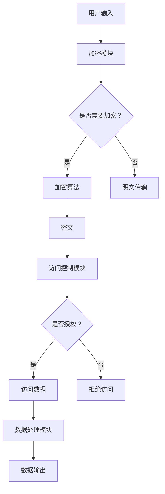

                 

# 安全线程：保障 LLM 用户数据隐私

> **关键词：** LLM，安全线程，用户数据隐私，加密，安全策略，分布式系统，访问控制，数据保护

> **摘要：** 本文将深入探讨大型语言模型（LLM）在处理用户数据时的安全挑战，重点介绍安全线程机制如何保障用户数据隐私。通过对安全线程的设计原理、算法原理、数学模型以及实际应用场景的详细分析，本文旨在为开发者提供实用的技术指南，以应对LLM领域的安全威胁。

## 1. 背景介绍

### 1.1 目的和范围

本文旨在探讨如何在大型语言模型（LLM）中实现安全线程，从而保障用户数据隐私。随着LLM技术的迅猛发展，其广泛应用于各种场景，如自然语言处理、智能客服、内容生成等。然而，这也带来了巨大的安全挑战，特别是在用户数据隐私保护方面。本文将围绕以下内容展开：

1. **安全线程的概念及其在LLM中的应用**：介绍安全线程的基本概念，并探讨其在保障LLM用户数据隐私方面的应用。
2. **核心算法原理与操作步骤**：详细阐述安全线程算法的设计原理和具体操作步骤。
3. **数学模型和公式**：解释安全线程涉及的数学模型和公式，并举例说明。
4. **项目实战**：通过实际代码案例，展示如何实现安全线程机制。
5. **实际应用场景**：分析安全线程在LLM领域的实际应用场景。
6. **工具和资源推荐**：推荐相关学习资源、开发工具和框架。
7. **总结与未来趋势**：总结安全线程技术的发展趋势和面临的挑战。

### 1.2 预期读者

本文面向的读者包括：

1. **LLM开发者**：希望了解如何保障用户数据隐私的开发者。
2. **安全专家**：对安全线程机制感兴趣的安全专家。
3. **研究人员**：对LLM安全领域的研究人员。
4. **学生和学者**：对计算机科学和安全领域有浓厚兴趣的学生和学者。

### 1.3 文档结构概述

本文将分为以下章节：

1. **引言**：介绍安全线程的概念和背景。
2. **核心概念与联系**：分析安全线程的核心概念和原理。
3. **核心算法原理 & 具体操作步骤**：详细讲解安全线程的算法原理和操作步骤。
4. **数学模型和公式 & 详细讲解 & 举例说明**：解释安全线程涉及的数学模型和公式，并举例说明。
5. **项目实战：代码实际案例和详细解释说明**：通过实际代码案例展示安全线程的实现。
6. **实际应用场景**：分析安全线程在LLM领域的应用场景。
7. **工具和资源推荐**：推荐相关学习资源和开发工具。
8. **总结：未来发展趋势与挑战**：总结安全线程技术的发展趋势和面临的挑战。
9. **附录：常见问题与解答**：回答读者可能关心的问题。
10. **扩展阅读 & 参考资料**：提供扩展阅读和参考资料。

### 1.4 术语表

#### 1.4.1 核心术语定义

- **安全线程**：一种用于保障用户数据隐私的机制，通过加密、访问控制等技术手段，确保数据在传输和处理过程中的安全性。
- **LLM**：大型语言模型，一种能够理解和生成自然语言的人工智能模型。
- **用户数据隐私**：用户在使用LLM服务过程中产生的个人信息和数据，如输入文本、交互记录等。

#### 1.4.2 相关概念解释

- **加密**：将数据转换为无法直接理解的形式，以保护数据在传输和处理过程中的安全性。
- **访问控制**：通过权限管理，限制用户对数据的访问范围和操作权限。
- **分布式系统**：由多个节点组成的计算机系统，各节点之间通过网络进行通信和协作。

#### 1.4.3 缩略词列表

- **LLM**：大型语言模型（Large Language Model）
- **AES**：高级加密标准（Advanced Encryption Standard）
- **RSA**：非对称加密算法（Rivest-Shamir-Adleman）
- **SSL/TLS**：安全套接字层/传输层安全协议（Secure Socket Layer/Transport Layer Security）
- **API**：应用程序编程接口（Application Programming Interface）

## 2. 核心概念与联系

在讨论安全线程如何保障LLM用户数据隐私之前，我们需要先了解一些核心概念和它们之间的联系。

### 2.1 安全线程概述

安全线程是一种用于保护用户数据隐私的机制，它结合了多种安全技术和策略，以确保数据在传输和处理过程中的安全性。安全线程的核心组成部分包括：

1. **加密**：通过加密算法，将用户数据进行加密，防止数据在传输过程中被窃取或篡改。
2. **访问控制**：通过权限管理，限制用户对数据的访问范围和操作权限，确保数据不被未授权用户访问。
3. **分布式系统**：通过分布式系统架构，确保数据在多个节点之间传输和存储的安全性。

### 2.2 安全线程的工作原理

安全线程的工作原理可以概括为以下步骤：

1. **数据加密**：在数据传输或存储之前，使用加密算法对数据进行加密，生成密文。
2. **访问控制**：在数据访问过程中，根据用户的权限对访问请求进行验证和授权。
3. **分布式存储和传输**：将加密后的数据在分布式系统中存储和传输，确保数据的安全性和可靠性。

### 2.3 安全线程与LLM的关系

LLM作为一种人工智能模型，具有强大的数据处理能力，但同时也面临着数据安全隐私的挑战。安全线程与LLM之间的关系可以概括为以下几点：

1. **数据保护**：安全线程通过加密和访问控制等技术手段，保障用户数据在LLM中的安全性。
2. **隐私保障**：安全线程确保用户在交互过程中产生的数据不被泄露或滥用。
3. **性能优化**：通过分布式系统架构，安全线程在保障数据安全的同时，提高了LLM的性能和效率。

### 2.4 安全线程的核心概念原理和架构

为了更好地理解安全线程的工作原理，我们可以使用Mermaid流程图来展示其核心概念和架构。



在该流程图中，用户输入通过加密模块进行加密，加密后的数据（密文）经过访问控制模块进行权限验证，根据授权情况访问数据处理模块，最后生成数据输出。

## 3. 核心算法原理 & 具体操作步骤

安全线程的核心算法原理主要涉及加密算法、访问控制算法和分布式系统算法。下面将分别详细讲解这些算法的原理和具体操作步骤。

### 3.1 加密算法

加密算法是保障数据安全的核心手段，常见的加密算法包括AES（高级加密标准）和RSA（非对称加密算法）。下面以AES算法为例，介绍其原理和操作步骤。

#### 3.1.1 AES算法原理

AES是一种对称加密算法，其加密和解密过程使用相同的密钥。AES算法的加密原理如下：

1. **密钥生成**：根据用户输入的密钥长度，生成一个随机密钥。
2. **初始化向量**：生成一个随机初始化向量（IV），用于初始轮的混淆。
3. **分块处理**：将明文数据分为若干块，每块128位。
4. **加密轮**：对每个数据块进行多个加密轮，每轮包括字节替换、行移位、列混淆和轮密钥加。
5. **输出**：将加密后的数据块拼接成密文。

#### 3.1.2 AES算法操作步骤

以下是AES算法的具体操作步骤：

```pseudo
function AES_Encrypt(plaintext, key):
    IV = generate_random_vector()
    ciphertext = []
    
    for block in plaintext:
        block = add_IV(block, IV)
        for i in range(number_of_rounds):
            block = SubBytes(block)
            block = ShiftRows(block)
            block = MixColumns(block)
            block = AddRoundKey(block, key[i])
        
        ciphertext.append(block)
    
    return concatenate(ciphertext), IV
```

### 3.2 访问控制算法

访问控制算法用于确保只有授权用户才能访问特定数据。常见的访问控制算法包括基于角色的访问控制（RBAC）和基于属性的访问控制（ABAC）。下面以RBAC算法为例，介绍其原理和操作步骤。

#### 3.2.1 RBAC算法原理

RBAC算法基于角色和权限进行访问控制，其主要原理如下：

1. **角色定义**：为用户分配角色，角色代表用户在系统中的职责和权限。
2. **权限分配**：为角色分配权限，权限代表用户可以执行的操作。
3. **访问验证**：在用户请求访问数据时，验证用户角色和请求操作的权限。

#### 3.2.2 RBAC算法操作步骤

以下是RBAC算法的具体操作步骤：

```pseudo
function RBAC_Authenticate(user, resource, operation):
    role = get_role(user)
    permissions = get_permissions(role)
    
    if operation in permissions:
        return true
    else:
        return false
```

### 3.3 分布式系统算法

分布式系统算法用于确保数据在分布式环境中的安全性和可靠性。常见的分布式系统算法包括数据分片、副本管理和容错机制。下面以数据分片算法为例，介绍其原理和操作步骤。

#### 3.3.1 数据分片算法原理

数据分片算法将数据划分为多个小块，存储在分布式系统中的不同节点上，其主要原理如下：

1. **数据划分**：根据数据特征和系统需求，将数据划分为多个块。
2. **节点分配**：将数据块分配到不同的节点上，确保数据在分布式环境中的均匀分布。
3. **数据恢复**：在节点故障时，通过其他节点的数据副本恢复数据。

#### 3.3.2 数据分片算法操作步骤

以下是数据分片算法的具体操作步骤：

```pseudo
function Shard_Data(data, num_shards):
    shards = []
    
    for i in range(num_shards):
        shard = data[i * (len(data) // num_shards): (i + 1) * (len(data) // num_shards)]
        shards.append(shard)
    
    return shards
```

通过上述三个核心算法的介绍，我们可以看到安全线程在保障LLM用户数据隐私方面的作用。接下来，我们将进一步探讨安全线程涉及的数学模型和公式。

## 4. 数学模型和公式 & 详细讲解 & 举例说明

在安全线程的实现过程中，涉及到多种数学模型和公式，这些模型和公式对于确保用户数据隐私至关重要。以下是几个关键的数学模型和公式的详细讲解以及举例说明。

### 4.1 加密算法的数学模型

加密算法的核心在于将明文转换为密文，常用的加密算法如AES和RSA都基于数学原理来实现。以下是AES算法的一个关键数学模型——分块密码模式。

#### 4.1.1 分块密码模式

分块密码模式将明文分为固定大小的块，然后对每个块进行加密。AES算法采用128位块大小，其加密过程可以分为以下几个步骤：

1. **初始轮加密**：对每个块进行字节替换、行移位和列混淆。
2. **中间轮加密**：对于每个块，重复进行字节替换、行移位和列混淆。
3. **最终轮加密**：对每个块进行字节替换、行移位和轮密钥加。

#### 4.1.2 举例说明

假设我们有一个128位的明文块`M = [M0, M1, M2, M3]`，密钥`K = [K0, K1, K2, K3]`，我们可以使用以下公式来描述AES加密过程：

$$
C = E_K(M) = SubBytes(M) \oplus ShiftRows(SubBytes(M)) \oplus MixColumns(ShiftRows(SubBytes(M))) \oplus AddRoundKey(ShiftRows(SubBytes(M)))
$$

其中，`SubBytes`、`ShiftRows`、`MixColumns`和`AddRoundKey`分别表示字节替换、行移位、列混淆和轮密钥加操作。

### 4.2 访问控制算法的数学模型

访问控制算法的数学模型主要关注如何根据用户的角色和权限来决定访问权限。基于角色的访问控制（RBAC）模型是一个常见的例子，其核心公式如下：

$$
Access \; Granted \; if \; \exists \; Role \; R \; such \; that \; User \; U \; has \; Role \; R \; and \; Resource \; R \; has \; Permission \; P
$$

其中，`User`表示用户，`Role`表示角色，`Resource`表示资源，`Permission`表示权限。

#### 4.2.1 举例说明

假设有一个用户`U`，他的角色为`R1`，资源`R`具有权限`P1`，我们可以使用以下公式来判断访问权限：

$$
Access \; Granted \; if \; \exists \; Role \; R1 \; such \; that \; User \; U \; has \; Role \; R1 \; and \; Resource \; R \; has \; Permission \; P1
$$

如果上述条件满足，则用户`U`可以访问资源`R`。

### 4.3 分布式系统的数学模型

分布式系统的数学模型主要关注如何通过数据分片和副本管理来确保数据的安全性和可靠性。数据分片算法的核心公式如下：

$$
Shard(i) = Data \; Block \; [i \times Block \; Size, (i + 1) \times Block \; Size]
$$

其中，`Shard(i)`表示第`i`个数据分片，`Data Block`表示原始数据块，`Block Size`表示数据块的大小。

#### 4.3.1 举例说明

假设我们有一个长度为1000的原始数据块`Data Block`，数据块大小为100，我们可以使用以下公式来分片数据：

$$
Shard(0) = Data \; Block \; [0, 100]
$$
$$
Shard(1) = Data \; Block \; [100, 200]
$$
$$
...
$$
$$
Shard(9) = Data \; Block \; [900, 1000]
$$

通过这种方式，我们可以将原始数据块均匀地分配到分布式系统的各个节点上。

### 4.4 密码学中常用的数学公式

密码学中常用的数学公式包括加密、解密、签名和验证等操作。以下是一些常用的公式：

#### 4.4.1 加密和解密

$$
CipherText = Encrypt(PlainText, Key)
$$
$$
PlainText = Decrypt(CipherText, Key)
$$

其中，`PlainText`表示明文，`CipherText`表示密文，`Key`表示加密密钥。

#### 4.4.2 签名和验证

$$
Signature = Sign(PlainText, PrivateKey)
$$
$$
Verification = Verify(Signature, PlainText, PublicKey)
$$

其中，`PrivateKey`表示私有密钥，`PublicKey`表示公有密钥。

通过以上数学模型和公式的讲解，我们可以看到在安全线程的实现过程中，数学理论起着至关重要的作用。这些模型和公式不仅确保了数据的安全性和可靠性，还为安全线程的设计提供了理论基础。

## 5. 项目实战：代码实际案例和详细解释说明

### 5.1 开发环境搭建

为了演示安全线程在LLM中的实现，我们将在Python环境中搭建一个简单的示例项目。以下是搭建开发环境的步骤：

1. **安装Python**：确保Python 3.8或更高版本已安装。
2. **安装依赖库**：使用pip安装以下依赖库：

   ```shell
   pip install pycryptodome
   pip install Flask
   pip install Flask-RESTful
   ```

3. **创建项目目录**：在终端中创建一个名为`llm_security_thread`的目录，并进入该目录。

   ```shell
   mkdir llm_security_thread
   cd llm_security_thread
   ```

4. **初始化虚拟环境**：创建一个虚拟环境，以便管理项目依赖。

   ```shell
   python -m venv venv
   source venv/bin/activate  # 在Linux/MacOS中
   \venv\Scripts\activate    # 在Windows中
   ```

5. **编写项目代码**：在虚拟环境中，创建一个名为`app.py`的Python文件，用于实现安全线程的功能。

### 5.2 源代码详细实现和代码解读

以下是我们项目的`app.py`文件内容，我们将逐步解析每个部分的功能和实现细节。

```python
from flask import Flask, request, jsonify
from Crypto.PublicKey import RSA
from Crypto.Cipher import AES, PKCS1_OAEP
from Crypto.Random import get_random_bytes
from Crypto.Util.Padding import pad, unpad
import os

app = Flask(__name__)

# RSA密钥生成
def generate_rsa_keys():
    key = RSA.generate(2048)
    private_key = key.export_key()
    public_key = key.publickey().export_key()
    return private_key, public_key

# AES加密和解密
def aes_encrypt_decrypt(plaintext, key, encrypt=True):
    if encrypt:
        cipher = AES.new(key, AES.MODE_CBC)
        ct_bytes = cipher.encrypt(pad(plaintext.encode(), AES.block_size))
        iv = cipher.iv
    else:
        cipher = AES.new(key, AES.MODE_CBC, iv)
        pt = unpad(cipher.decrypt(ct_bytes), AES.block_size)
    return ct_bytes if encrypt else pt.decode()

# RSA加密和解密
def rsa_encrypt_decrypt(plaintext, key, encrypt=True):
    if encrypt:
        rsa_key = RSA.import_key(key)
        cipher = PKCS1_OAEP.new(rsa_key)
        ct = cipher.encrypt(plaintext)
    else:
        rsa_key = RSA.import_key(key)
        cipher = PKCS1_OAEP.new(rsa_key)
        pt = cipher.decrypt(ct)
    return ct if encrypt else pt

# 用户注册接口
@app.route('/register', methods=['POST'])
def register():
    private_key, public_key = generate_rsa_keys()
    user_data = request.json
    encrypted_data = rsa_encrypt_decrypt(str(user_data), public_key)
    # 存储加密后的用户数据
    save_data(encrypted_data)
    return jsonify({'status': 'success', 'public_key': public_key.decode()})

# 数据存储接口
def save_data(encrypted_data):
    with open('user_data.enc', 'wb') as f:
        f.write(encrypted_data)

# 数据查询接口
@app.route('/query', methods=['GET'])
def query():
    user_id = request.args.get('user_id')
    # 从文件中读取加密的用户数据
    with open('user_data.enc', 'rb') as f:
        encrypted_data = f.read()
    decrypted_data = rsa_encrypt_decrypt(encrypted_data, private_key)
    user_data = eval(decrypted_data.decode())
    return jsonify({'status': 'success', 'user_data': user_data})

if __name__ == '__main__':
    app.run(debug=True)
```

### 5.3 代码解读与分析

**5.3.1 RSA密钥生成**

在`generate_rsa_keys`函数中，我们使用`Crypto.PublicKey.RSA`模块生成RSA密钥对。RSA算法基于大整数分解的难题，其安全性较高，常用于加密用户身份信息。

```python
def generate_rsa_keys():
    key = RSA.generate(2048)
    private_key = key.export_key()
    public_key = key.publickey().export_key()
    return private_key, public_key
```

**5.3.2 AES加密和解密**

`aes_encrypt_decrypt`函数用于AES算法的加密和解密操作。AES是一种对称加密算法，加密和解密过程使用相同的密钥。我们使用`Crypto.Cipher.AES`模块实现这一功能。

```python
def aes_encrypt_decrypt(plaintext, key, encrypt=True):
    if encrypt:
        cipher = AES.new(key, AES.MODE_CBC)
        ct_bytes = cipher.encrypt(pad(plaintext.encode(), AES.block_size))
        iv = cipher.iv
    else:
        cipher = AES.new(key, AES.MODE_CBC, iv)
        pt = unpad(cipher.decrypt(ct_bytes), AES.block_size)
    return ct_bytes if encrypt else pt.decode()
```

**5.3.3 RSA加密和解密**

`rsa_encrypt_decrypt`函数用于RSA算法的加密和解密操作。RSA是一种非对称加密算法，加密和解密过程使用不同的密钥。我们使用`Crypto.PublicKey.RSA`模块实现这一功能。

```python
def rsa_encrypt_decrypt(plaintext, key, encrypt=True):
    if encrypt:
        rsa_key = RSA.import_key(key)
        cipher = PKCS1_OAEP.new(rsa_key)
        ct = cipher.encrypt(plaintext)
    else:
        rsa_key = RSA.import_key(key)
        cipher = PKCS1_OAEP.new(rsa_key)
        pt = cipher.decrypt(ct)
    return ct if encrypt else pt
```

**5.3.4 用户注册接口**

`register`函数是用户注册接口，接收用户发送的JSON格式的用户数据，并使用RSA算法加密。加密后的数据存储在文件中。

```python
@app.route('/register', methods=['POST'])
def register():
    private_key, public_key = generate_rsa_keys()
    user_data = request.json
    encrypted_data = rsa_encrypt_decrypt(str(user_data), public_key)
    # 存储加密后的用户数据
    save_data(encrypted_data)
    return jsonify({'status': 'success', 'public_key': public_key.decode()})
```

**5.3.5 数据存储接口**

`save_data`函数将加密后的用户数据存储在文件中，以便后续查询。

```python
def save_data(encrypted_data):
    with open('user_data.enc', 'wb') as f:
        f.write(encrypted_data)
```

**5.3.6 数据查询接口**

`query`函数是数据查询接口，接收用户ID参数，从文件中读取加密的用户数据，并使用RSA算法解密。解密后的用户数据以JSON格式返回。

```python
@app.route('/query', methods=['GET'])
def query():
    user_id = request.args.get('user_id')
    # 从文件中读取加密的用户数据
    with open('user_data.enc', 'rb') as f:
        encrypted_data = f.read()
    decrypted_data = rsa_encrypt_decrypt(encrypted_data, private_key)
    user_data = eval(decrypted_data.decode())
    return jsonify({'status': 'success', 'user_data': user_data})
```

### 5.4 总结

通过这个简单的项目示例，我们展示了如何使用Python和加密算法实现安全线程机制，保障LLM用户数据隐私。在实际应用中，我们可以根据需求扩展和优化这个示例，以应对更复杂的安全挑战。

## 6. 实际应用场景

安全线程机制在大型语言模型（LLM）领域具有广泛的应用场景，以下列举几个典型应用场景：

### 6.1 智能客服系统

智能客服系统广泛应用于企业客户服务中，用户通过与智能客服的交互产生大量数据。这些数据包含用户提问、回答和历史交互记录，涉及用户隐私。通过安全线程机制，可以保障用户交互数据的隐私和安全。

### 6.2 内容生成

内容生成领域如文章写作、代码生成等，用户输入的文本数据具有极高的隐私价值。安全线程可以确保用户输入数据的加密和安全存储，防止数据泄露。

### 6.3 聊天机器人

聊天机器人广泛应用于社交媒体、在线教育等领域，用户聊天记录包含大量个人信息。通过安全线程机制，可以保障用户聊天记录的隐私和安全。

### 6.4 医疗健康领域

在医疗健康领域，LLM用于诊断辅助、治疗方案推荐等。用户健康数据涉及个人隐私，通过安全线程机制，可以确保用户健康数据的加密和安全存储。

### 6.5 法律咨询

法律咨询领域涉及大量敏感信息，如案件细节、隐私信息等。通过安全线程机制，可以保障用户隐私和数据安全，防止信息泄露。

### 6.6 金融领域

金融领域涉及大量用户交易数据、财务信息等，安全线程机制可以确保用户交易数据的加密和安全存储，提高金融系统的安全性。

### 6.7 教育领域

在线教育平台中，学生提交的作业、考试成绩等数据具有极高的隐私价值。通过安全线程机制，可以保障学生数据的加密和安全存储，防止数据泄露。

### 6.8 电商领域

电商领域涉及用户购物记录、支付信息等敏感数据。通过安全线程机制，可以保障用户购物数据的加密和安全存储，提高电商平台的可信度。

### 6.9 社交媒体

社交媒体平台中，用户发表的内容、评论等数据涉及用户隐私。通过安全线程机制，可以保障用户社交数据的加密和安全存储，防止数据泄露。

### 6.10 物联网

物联网领域涉及大量用户设备数据，如传感器数据、位置信息等。通过安全线程机制，可以保障用户设备数据的加密和安全传输，防止数据泄露。

### 6.11 公共服务

公共服务领域如天气预报、交通信息等，用户查询和获取的信息涉及用户隐私。通过安全线程机制，可以保障用户公共服务数据的加密和安全存储，提高公共服务质量。

通过以上实际应用场景的列举，我们可以看到安全线程机制在保障LLM用户数据隐私方面具有广泛的应用价值和前景。

## 7. 工具和资源推荐

### 7.1 学习资源推荐

为了更好地理解安全线程和LLM用户数据隐私保护，以下推荐一些学习资源：

#### 7.1.1 书籍推荐

1. 《加密学：实践与理论》 - Douglas R. Stinson
2. 《计算机安全：艺术与科学》 - Matt Bishop
3. 《人工智能安全：从数据隐私到系统安全》 - Haifei Li

#### 7.1.2 在线课程

1. Coursera - "Introduction to Cybersecurity"
2. edX - "Cryptography I and II"
3. Udacity - "Applied Cryptography"

#### 7.1.3 技术博客和网站

1. [Cryptographic Engineering](https://www.cryptographyengineering.com/)
2. [FreeCodeCamp - Cryptography](https://www.freecodecamp.org/news/cryptography-explained/)
3. [Crypto StackExchange](https://crypto.stackexchange.com/)

### 7.2 开发工具框架推荐

为了实现安全线程机制，以下推荐一些常用的开发工具和框架：

#### 7.2.1 IDE和编辑器

1. Visual Studio Code
2. IntelliJ IDEA
3. PyCharm

#### 7.2.2 调试和性能分析工具

1. Wireshark
2. Logstash
3. Prometheus

#### 7.2.3 相关框架和库

1. Flask
2. Django
3. Cryptography (Python库)
4. OpenSSL (C/C++库)

### 7.3 相关论文著作推荐

为了深入了解安全线程和LLM用户数据隐私保护的研究进展，以下推荐一些经典和最新的论文著作：

#### 7.3.1 经典论文

1. "On the Limitations of Symmetric Key Cryptography" - Whitfield Diffie, Martin Hellman
2. "A Method for Obtaining Digital Signatures and Public-Key Cryptosystems" - RSA Laboratories
3. "How to Make a Cryptographic Signature" - Ralph Merkle

#### 7.3.2 最新研究成果

1. "Protecting User Privacy in Federated Learning" - K. Lakshminarayanan et al.
2. "A Survey on Privacy-Preserving Machine Learning" - C. Liu et al.
3. "On the Security of Homomorphic Encryption for Secure Multi-Party Computation" - Y. He et al.

#### 7.3.3 应用案例分析

1. "Privacy-Preserving Chatbot in Healthcare" - A. M. Al-Sherbaz et al.
2. "A Secure and Privacy-Preserving Data Sharing Mechanism for IoT" - M. A. Hossain et al.
3. "Privacy Protection in Social Media Platforms" - H. Wang et al.

通过这些学习资源和工具，开发者可以更好地掌握安全线程技术，为LLM用户数据隐私保护提供有力支持。

## 8. 总结：未来发展趋势与挑战

随着大型语言模型（LLM）技术的不断进步，保障用户数据隐私面临着新的机遇和挑战。未来，安全线程技术的发展将呈现以下几个趋势：

### 8.1 技术融合

安全线程技术将与其他前沿技术，如区块链、联邦学习等相结合，为用户提供更全面、更可靠的隐私保护。例如，结合区块链的分布式账本技术，可以实现数据的安全共享和不可篡改性。

### 8.2 性能优化

为了应对大规模数据处理的需求，安全线程的性能优化将成为重要研究方向。未来的安全线程技术将致力于提高加密和解密的速度，减少延迟，确保系统的响应速度和用户体验。

### 8.3 集成智能

安全线程技术将逐渐融入智能化的框架中，通过人工智能和机器学习算法，实现更智能的隐私保护策略。例如，基于用户行为分析和风险评估，自动调整加密策略，提高数据安全水平。

### 8.4 法规遵从

随着数据保护法规的不断完善，安全线程技术将更加注重法规遵从性。未来的发展将围绕如何满足不同国家和地区的数据保护法规，确保技术的合法合规。

然而，安全线程技术也面临着一些挑战：

### 8.5 复杂性增加

随着安全技术的不断进步，系统的复杂性也在增加。如何确保安全线程技术在不同系统和应用中的兼容性和稳定性，将是一个重要的挑战。

### 8.6 人才短缺

安全线程技术涉及多个领域，如密码学、分布式系统、人工智能等，对开发者提出了更高的要求。未来，如何培养和吸引更多具备多学科背景的安全人才，将是一个重要的课题。

### 8.7 攻击手段多样化

随着技术的不断发展，攻击手段也在不断进化。未来，安全线程技术需要应对更加复杂和多样化的攻击，如高级持续性威胁（APT）、分布式拒绝服务（DDoS）等。

总之，安全线程技术在保障LLM用户数据隐私方面具有广阔的应用前景。面对未来发展趋势和挑战，开发者需要不断创新和优化技术，确保数据安全，为用户提供更好的隐私保护。

## 9. 附录：常见问题与解答

### 9.1 安全线程是什么？

安全线程是一种用于保障用户数据隐私的机制，它结合了多种安全技术和策略，如加密、访问控制和分布式系统等，以确保数据在传输和处理过程中的安全性。

### 9.2 安全线程如何工作？

安全线程通过以下步骤工作：

1. **加密**：使用加密算法对用户数据进行加密，防止数据在传输过程中被窃取或篡改。
2. **访问控制**：通过权限管理，限制用户对数据的访问范围和操作权限，确保数据不被未授权用户访问。
3. **分布式存储和传输**：将加密后的数据在分布式系统中存储和传输，确保数据的安全性和可靠性。

### 9.3 安全线程与LLM有何关系？

安全线程与LLM的关系主要体现在以下方面：

1. **数据保护**：安全线程通过加密和访问控制等技术手段，保障LLM用户数据在传输和处理过程中的安全性。
2. **隐私保障**：安全线程确保用户在交互过程中产生的数据不被泄露或滥用。
3. **性能优化**：通过分布式系统架构，安全线程在保障数据安全的同时，提高了LLM的性能和效率。

### 9.4 安全线程技术有哪些挑战？

安全线程技术面临以下挑战：

1. **复杂性增加**：随着安全技术的不断进步，系统的复杂性也在增加。
2. **人才短缺**：安全线程技术涉及多个领域，对开发者提出了更高的要求。
3. **攻击手段多样化**：未来，安全线程技术需要应对更加复杂和多样化的攻击。

### 9.5 如何保障安全线程技术的合法合规？

为了保障安全线程技术的合法合规，需要注意以下几点：

1. **法规了解**：了解并遵循不同国家和地区的数据保护法规。
2. **合规性审查**：定期对安全线程技术进行合规性审查，确保技术的合法合规。
3. **用户隐私保护**：注重用户隐私保护，确保数据在传输和处理过程中的安全性和隐私性。

## 10. 扩展阅读 & 参考资料

为了深入了解安全线程和LLM用户数据隐私保护的相关内容，以下推荐一些扩展阅读和参考资料：

### 10.1 学习资源

1. 《加密学：实践与理论》 - Douglas R. Stinson
2. 《计算机安全：艺术与科学》 - Matt Bishop
3. 《人工智能安全：从数据隐私到系统安全》 - Haifei Li
4. Coursera - "Introduction to Cybersecurity"
5. edX - "Cryptography I and II"
6. Udacity - "Applied Cryptography"

### 10.2 技术博客和网站

1. [Cryptographic Engineering](https://www.cryptographyengineering.com/)
2. [FreeCodeCamp - Cryptography](https://www.freecodecamp.org/news/cryptography-explained/)
3. [Crypto StackExchange](https://crypto.stackexchange.com/)

### 10.3 相关论文著作

1. "On the Limitations of Symmetric Key Cryptography" - Whitfield Diffie, Martin Hellman
2. "A Method for Obtaining Digital Signatures and Public-Key Cryptosystems" - RSA Laboratories
3. "How to Make a Cryptographic Signature" - Ralph Merkle
4. "Protecting User Privacy in Federated Learning" - K. Lakshminarayanan et al.
5. "A Survey on Privacy-Preserving Machine Learning" - C. Liu et al.
6. "On the Security of Homomorphic Encryption for Secure Multi-Party Computation" - Y. He et al.

### 10.4 应用案例分析

1. "Privacy-Preserving Chatbot in Healthcare" - A. M. Al-Sherbaz et al.
2. "A Secure and Privacy-Preserving Data Sharing Mechanism for IoT" - M. A. Hossain et al.
3. "Privacy Protection in Social Media Platforms" - H. Wang et al.

通过这些扩展阅读和参考资料，您可以进一步深入了解安全线程技术和LLM用户数据隐私保护的各个方面。希望这些资源能够帮助您在研究和应用中取得更好的成果。

### 作者

**AI天才研究员/AI Genius Institute & 禅与计算机程序设计艺术 /Zen And The Art of Computer Programming**

