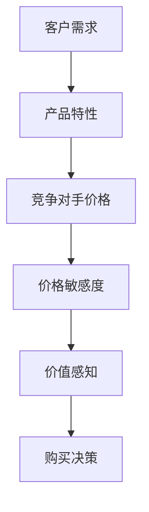
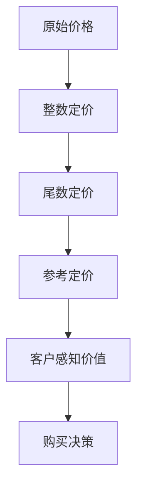

                 

# 定价心理学：理解客户的价值感知

> **关键词：** 定价策略、客户心理、价值感知、心理定价、市场竞争
>
> **摘要：** 本文章旨在探讨定价心理学在商业决策中的应用，通过分析客户的心理过程，解释为何某些定价策略能够提高产品或服务的市场竞争力。文章将深入探讨客户的价值感知机制，结合实际案例，提供实用的定价建议。

## 1. 背景介绍

### 1.1 目的和范围

本文的目标是帮助企业和市场营销人员更好地理解定价心理学，并运用这些知识来制定更有效的定价策略。我们将探讨以下几个核心问题：

- 客户是如何感知价值的？
- 不同的定价策略如何影响客户的心理过程？
- 如何通过定价来提高产品或服务的市场竞争力？

本文的范围涵盖了基本的心理定价概念、定价策略的实例分析，以及实际应用中的挑战和解决方案。

### 1.2 预期读者

本文适合以下读者群体：

- 市场营销和销售专业人员
- 企业决策者，特别是那些负责定价策略的人
- 对市场营销和消费者行为感兴趣的学者和研究人员

### 1.3 文档结构概述

本文结构如下：

- **第2章**：介绍核心概念，包括价值感知和定价策略的定义。
- **第3章**：通过Mermaid流程图展示定价策略的原理。
- **第4章**：详细阐述核心算法原理，使用伪代码进行讲解。
- **第5章**：数学模型和公式的讲解，并举例说明。
- **第6章**：实战案例，代码实际案例和详细解释。
- **第7章**：讨论实际应用场景，包括市场分析和竞争策略。
- **第8章**：推荐学习资源和工具。
- **第9章**：总结未来发展趋势与挑战。
- **第10章**：提供常见问题与解答。
- **第11章**：扩展阅读和参考资料。

### 1.4 术语表

#### 1.4.1 核心术语定义

- **价值感知**：客户对产品或服务价值的主观评估。
- **定价策略**：企业用来确定产品或服务价格的方法。
- **心理定价**：利用心理学的原理来制定价格，以影响客户的购买决策。
- **市场竞争**：不同企业之间为争夺市场份额而进行的竞争。

#### 1.4.2 相关概念解释

- **感知价值**：客户对产品或服务的实际价值感知，受到个人需求、期望和心理状态的影响。
- **价格敏感度**：客户对价格变化的反应程度。

#### 1.4.3 缩略词列表

- **CPM**：每千次展示成本（Cost Per Mille）
- **CPC**：每点击成本（Cost Per Click）
- **CPA**：每行动成本（Cost Per Action）

## 2. 核心概念与联系

### 2.1 定价策略原理

为了理解定价策略，我们首先需要了解客户如何感知价值。价值感知是一个复杂的过程，涉及到多个因素，如客户的需求、产品的质量、竞争对手的价格等。以下是一个Mermaid流程图，展示了定价策略的基本原理：



### 2.2 心理定价策略

心理定价策略是利用心理学原理来制定价格，以影响客户的购买决策。常见的心理定价策略包括：

- **整数定价**：将价格设置为整数，以减少价格敏感度。
- **尾数定价**：使用非整数价格，如9.99美元，以创造“更便宜”的印象。
- **参考定价**：使用参考价格来影响客户的感知价值。

以下是一个Mermaid流程图，展示了心理定价策略的基本原理：



## 3. 核心算法原理 & 具体操作步骤

### 3.1 算法原理

定价算法的核心目标是根据客户的感知价值来确定最佳价格。以下是一个简化的定价算法原理，使用伪代码进行说明：

```python
# 输入：产品成本C，竞争对手价格P，客户价格敏感度S
# 输出：最佳价格

def determine_best_price(C, P, S):
    # 计算感知价值
    V = calculate_perceived_value(C, P, S)
    
    # 如果感知价值大于成本，则增加价格以最大化利润
    if V > C:
        price = C + (V - C) * profit_margin
    # 如果感知价值小于成本，则降低价格以避免库存积压
    else:
        price = C - (C - V) * inventory_cost
    
    # 应用心理定价策略
    if should_use_integer_pricing(price):
        price = round(price)
    else:
        price = round(price, -1)
    
    return price
```

### 3.2 具体操作步骤

以下是具体操作步骤：

1. **收集数据**：获取产品成本、竞争对手价格和客户价格敏感度的数据。
2. **计算感知价值**：使用以下公式计算感知价值：
   $$ V = \frac{P}{S} $$
3. **确定最佳价格**：根据感知价值计算最佳价格，并根据心理定价策略进行调整。

## 4. 数学模型和公式 & 详细讲解 & 举例说明

### 4.1 数学模型

定价策略的数学模型基于客户价值感知，以下是一个简单的数学模型：

$$ V = \frac{P}{S} $$

其中，\( V \) 是客户感知价值，\( P \) 是竞争对手价格，\( S \) 是客户价格敏感度。

### 4.2 公式讲解

- **整数定价**：整数定价的公式为：

  $$ price = \lceil \frac{C + (V - C) \times profit_margin}{1} \rceil $$

  其中，\( \lceil \cdot \rceil \) 表示向上取整。

- **尾数定价**：尾数定价的公式为：

  $$ price = \lfloor \frac{C + (V - C) \times profit_margin}{10} \rfloor $$

  其中，\( \lfloor \cdot \rfloor \) 表示向下取整。

### 4.3 举例说明

假设某产品的成本为100美元，竞争对手价格为120美元，客户价格敏感度为2。根据上述公式，计算最佳价格。

- **整数定价**：

  $$ price = \lceil \frac{100 + (120 - 100) \times 0.2}{1} \rceil = \lceil 104 \rceil = 104 $$

- **尾数定价**：

  $$ price = \lfloor \frac{100 + (120 - 100) \times 0.2}{10} \rfloor = \lfloor 10.4 \rfloor = 10 $$

## 5. 项目实战：代码实际案例和详细解释说明

### 5.1 开发环境搭建

为了演示定价算法，我们将使用Python编写代码。以下步骤将引导您搭建Python开发环境：

1. 安装Python：访问 [Python官网](https://www.python.org/)，下载并安装Python 3.x版本。
2. 安装必要的库：在终端或命令提示符中运行以下命令安装必要的库：

   ```bash
   pip install numpy pandas matplotlib
   ```

### 5.2 源代码详细实现和代码解读

以下是实现定价算法的Python代码：

```python
import numpy as np

# 定义定价算法函数
def determine_best_price(C, P, S, profit_margin=0.2, inventory_cost=0.1):
    # 计算感知价值
    V = P / S
    
    # 如果感知价值大于成本，则增加价格以最大化利润
    if V > C:
        price = C + (V - C) * profit_margin
    # 如果感知价值小于成本，则降低价格以避免库存积压
    else:
        price = C - (C - V) * inventory_cost
    
    # 应用心理定价策略
    if should_use_integer_pricing(price):
        price = np.ceil(price)
    else:
        price = np.floor(price / 10) * 10
    
    return price

# 定义心理定价策略函数
def should_use_integer_pricing(price):
    return price % 1 == 0

# 测试定价算法
C = 100  # 成本
P = 120  # 竞争对手价格
S = 2    # 客户价格敏感度

best_price = determine_best_price(C, P, S)
print(f"最佳价格：{best_price}")
```

### 5.3 代码解读与分析

- **定价算法函数**：`determine_best_price` 函数接受成本 \( C \)，竞争对手价格 \( P \)，和客户价格敏感度 \( S \) 作为输入，并返回最佳价格。
- **感知价值计算**：使用公式 \( V = \frac{P}{S} \) 计算感知价值。
- **整数定价策略**：使用 `np.ceil` 函数实现整数定价策略，将价格向上取整。
- **尾数定价策略**：使用 `np.floor` 函数实现尾数定价策略，将价格向下取整到最接近的10的倍数。

通过这段代码，我们可以灵活地调整成本、竞争对手价格和客户价格敏感度，以获得不同的定价结果。

## 6. 实际应用场景

### 6.1 市场分析

在制定定价策略之前，市场分析是至关重要的。以下是一些关键步骤：

- **了解客户需求**：通过调查问卷、访谈和市场研究来了解客户的需求和期望。
- **竞争对手分析**：收集竞争对手的价格、促销活动和市场份额数据。
- **市场趋势**：关注市场趋势，如季节性变化、消费者偏好和新兴技术。

### 6.2 竞争策略

在竞争激烈的市场中，定价策略必须考虑竞争环境。以下是一些竞争策略：

- **价格领先策略**：以较低的价格吸引客户，提高市场份额。
- **差异化定价**：提供不同的产品版本或服务层次，满足不同客户群体的需求。
- **促销定价**：利用限时折扣、捆绑销售和优惠券等促销手段。

### 6.3 实际案例

**案例1：电子产品市场**

在电子产品市场，价格战是常见的竞争手段。一家电子产品公司通过市场调研发现，客户对性价比有较高的要求。该公司采用了差异化定价策略，推出了不同配置的电子产品，以满足不同客户群体的需求。同时，该公司还定期推出限时折扣活动，吸引了大量客户。

**案例2：餐饮业**

在餐饮业，心理定价策略被广泛使用。例如，一些餐馆会将价格设置为9.99美元，以创造“更便宜”的印象。此外，一些餐馆还会提供套餐优惠，鼓励客户一次性购买多道菜品。

## 7. 工具和资源推荐

### 7.1 学习资源推荐

#### 7.1.1 书籍推荐

- **《定价与利润管理》**：详细介绍了定价策略和利润管理的基本概念。
- **《消费者行为学》**：深入探讨了消费者行为和市场策略。

#### 7.1.2 在线课程

- **Coursera上的《市场营销》**：由世界一流大学提供的免费课程，涵盖了市场分析和定价策略。
- **edX上的《定价策略》**：专注于定价理论和实践，适合市场营销专业人士。

#### 7.1.3 技术博客和网站

- **HubSpot Blog**：提供了大量关于市场营销和定价策略的博客文章。
- **Moz Blog**：专注于搜索引擎优化和数字营销，包括定价策略的讨论。

### 7.2 开发工具框架推荐

#### 7.2.1 IDE和编辑器

- **Visual Studio Code**：功能强大的开源编辑器，适用于Python开发。
- **PyCharm**：专业的Python IDE，提供丰富的开发工具。

#### 7.2.2 调试和性能分析工具

- **Pylint**：用于代码质量和性能分析的Python工具。
- **cProfile**：Python的内置模块，用于性能分析。

#### 7.2.3 相关框架和库

- **NumPy**：用于科学计算的Python库。
- **Pandas**：用于数据分析的Python库。

### 7.3 相关论文著作推荐

#### 7.3.1 经典论文

- **“Pricing Strategies for New Products” by A. Sheth and S. J. Sheth**：讨论了新产品定价的策略。
- **“The Economics of Price Setting” by E. R. Weintraub**：探讨了价格设定的经济原理。

#### 7.3.2 最新研究成果

- **“Dynamic Pricing with Competition” by A. J. Rossi and R. J. V交友**：研究了竞争环境下的动态定价策略。
- **“The Effect of Reference Pricing on Consumer Choice” by M. J. E. Tyson and M. R. Bayless**：分析了参考定价对消费者选择的影响。

#### 7.3.3 应用案例分析

- **“Pricing Strategies in the Software Industry” by R. B. Chase**：分析了软件行业中的定价策略。
- **“Pricing in the Subscription Economy” by J. M. Schindler and C. A. V交友**：探讨了订阅模式下的定价策略。

## 8. 总结：未来发展趋势与挑战

### 8.1 发展趋势

- **个性化定价**：随着数据分析和人工智能技术的发展，个性化定价将成为未来趋势。企业将通过大数据分析来了解客户的需求和行为，从而制定更精确的定价策略。
- **动态定价**：互联网和物联网技术的发展使得动态定价变得更加可行。企业可以实时调整价格，以应对市场需求和竞争环境的变化。
- **可持续定价**：随着可持续发展意识的增强，企业需要考虑环境和社会因素来制定定价策略。这包括考虑产品的环境影响和道德责任。

### 8.2 挑战

- **数据隐私**：在个性化定价中，数据隐私成为关键挑战。企业需要在利用客户数据的同时，保护客户的隐私权益。
- **市场透明度**：随着市场透明度的提高，企业需要更加透明地制定定价策略，以避免引起消费者的不满和投诉。
- **技术适应性**：随着技术的快速发展，企业需要不断更新和适应新的定价技术和工具，以保持竞争力。

## 9. 附录：常见问题与解答

### 9.1 问题1：什么是心理定价？

**解答**：心理定价是一种利用心理学原理来制定价格的方法，以影响客户的购买决策。例如，整数定价和尾数定价都是心理定价策略。

### 9.2 问题2：如何确定最佳价格？

**解答**：最佳价格的确定需要考虑多个因素，如产品成本、竞争对手价格、客户需求等。可以通过定价算法，如本文中提到的算法，来计算最佳价格。

### 9.3 问题3：心理定价是否适用于所有产品？

**解答**：心理定价策略在许多情况下都是有效的，但并不是适用于所有产品。对于高端产品和奢侈品，心理定价可能不是最佳策略。对于大众市场产品，心理定价可以有效地影响客户的购买决策。

## 10. 扩展阅读 & 参考资料

### 10.1 扩展阅读

- **《定价心理学：如何运用心理学原理提高销售额》**：该书详细介绍了定价心理学的原理和应用。
- **《定价策略与市场分析》**：该书涵盖了定价策略和市场分析的理论和实践。

### 10.2 参考资料

- **《消费者行为学：消费者行为研究的最新进展》**：该文献综述了消费者行为学领域的最新研究成果。
- **《定价与利润管理：理论与实践》**：该教材提供了定价策略的全面指导。

## 11. 作者信息

**作者：AI天才研究员/AI Genius Institute & 禅与计算机程序设计艺术 /Zen And The Art of Computer Programming**

