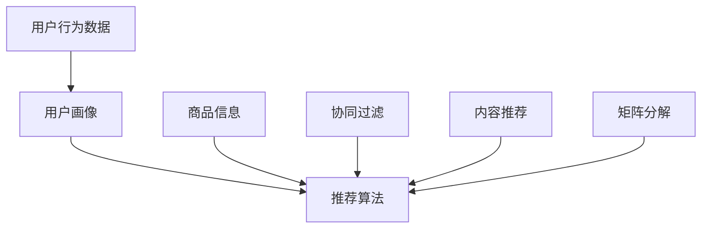
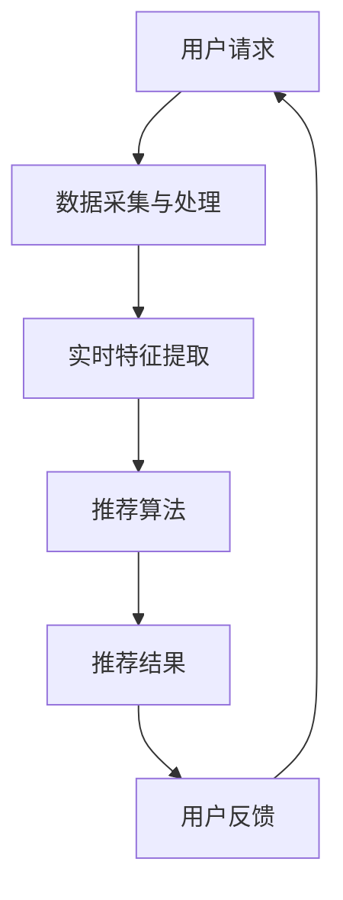

                 

### 实时推荐技术在电商领域的应用：案例分析与展望

**关键词**：实时推荐、电商、算法原理、案例、展望

**摘要**：本文将深入探讨实时推荐技术在电商领域的应用，通过详细分析相关算法原理、具体操作步骤以及数学模型，结合实际案例和代码解析，全面展示这一技术的应用场景和未来发展趋势。文章旨在为从事电商推荐系统的开发者和研究者提供有价值的参考。

## 1. 背景介绍

### 1.1 目的和范围

本文旨在系统地分析实时推荐技术在电商领域的应用，探讨其核心算法原理、操作步骤、数学模型以及实际案例，并预测未来发展趋势和面临的挑战。通过本文的研究，希望为电商行业在推荐系统的优化和提升用户体验方面提供有益的思路和方法。

### 1.2 预期读者

本文适用于对实时推荐技术感兴趣的电商从业者、技术开发者、数据分析师、以及研究生等。同时，对人工智能和机器学习领域有基本了解的读者也能更好地理解本文的内容。

### 1.3 文档结构概述

本文将分为十个部分，首先介绍实时推荐技术在电商领域的应用背景，随后详细阐述核心概念和算法原理。接下来，通过实际案例和代码实现来展示推荐系统的具体应用。文章还将在应用场景、工具和资源推荐以及未来发展趋势等方面进行深入讨论。最后，通过总结和常见问题解答，为读者提供全面的参考。

### 1.4 术语表

#### 1.4.1 核心术语定义

- 实时推荐：指根据用户的实时行为和偏好，动态生成个性化的推荐结果。
- 电商推荐系统：为电商平台提供个性化商品推荐的系统。
- 用户行为数据：用户在电商平台上的浏览、点击、购买等行为数据。

#### 1.4.2 相关概念解释

- 协同过滤：通过分析用户之间的共同偏好，实现个性化推荐。
- 内容推荐：根据商品的内容属性（如标题、描述、分类等）进行推荐。
- 矩阵分解：一种基于矩阵分解技术来优化推荐效果的方法。

#### 1.4.3 缩略词列表

- CF：协同过滤（Collaborative Filtering）
- CTR：点击率（Click-Through Rate）
- LR：逻辑回归（Logistic Regression）
- SGD：随机梯度下降（Stochastic Gradient Descent）

## 2. 核心概念与联系

在深入探讨实时推荐技术之前，我们需要了解一些核心概念和其相互联系。以下是相关概念和架构的Mermaid流程图：



- **用户行为数据**：电商平台收集的用户浏览、点击、购买等行为数据，是构建推荐系统的基础。
- **用户画像**：通过对用户行为数据进行分析，构建用户的兴趣标签和偏好模型，用于后续推荐。
- **商品信息**：包括商品的标题、描述、分类、价格等属性信息，用于内容推荐和协同过滤。
- **协同过滤**：通过分析用户之间的相似性，为用户推荐相似的物品。
- **内容推荐**：根据商品的属性信息进行推荐，满足用户的特定需求。
- **矩阵分解**：通过分解用户-商品评分矩阵，提取用户和商品的潜在特征，提升推荐效果。

### 2.1 实时推荐技术架构

实时推荐技术的核心在于快速、准确地响应用户的动态行为，以下是一个简化的实时推荐技术架构图：



- **用户请求**：用户在电商平台上的浏览、搜索、点击等行为，作为实时推荐的输入。
- **数据采集与处理**：实时采集用户行为数据，并进行预处理，如数据清洗、去重等。
- **实时特征提取**：根据用户请求和用户画像，提取实时特征，用于推荐算法的输入。
- **推荐算法**：实时计算推荐结果，根据算法模型为用户推荐相关商品。
- **推荐结果**：将推荐结果返回给用户，供其浏览或购买。
- **用户反馈**：用户对推荐结果的反馈，用于进一步优化推荐系统。

通过上述架构，实时推荐技术能够快速响应用户的需求，提升用户体验，从而为电商平台带来更高的用户粘性和转化率。

## 3. 核心算法原理 & 具体操作步骤

### 3.1 协同过滤算法原理

协同过滤（Collaborative Filtering，CF）是一种常见的推荐算法，通过分析用户之间的相似性，为用户推荐他们可能感兴趣的商品。协同过滤算法可以分为基于用户的协同过滤（User-based CF）和基于物品的协同过滤（Item-based CF）。

#### 3.1.1 基于用户的协同过滤（User-based CF）

基于用户的协同过滤算法的基本思想是，如果两个用户在某一商品上的评分相似，那么这两个用户可能对其他商品也有相似的评分偏好。具体操作步骤如下：

1. **计算相似度**：计算用户之间的相似度，常用的相似度计算方法包括余弦相似度、皮尔逊相关系数等。

   ```python
   def cosine_similarity(user1, user2):
       dot_product = sum(user1[i] * user2[i] for i in range(len(user1)))
       norm_user1 = sqrt(sum(user1[i] ** 2 for i in range(len(user1))))
       norm_user2 = sqrt(sum(user2[i] ** 2 for i in range(len(user2))))
       return dot_product / (norm_user1 * norm_user2)
   ```

2. **寻找邻居**：根据用户之间的相似度，选择一定数量的相似用户作为邻居。

   ```python
   def find_neighbors(users, user, k):
       similarity_scores = [(cosine_similarity(users[user], users[neighbor]), neighbor) for neighbor in users if neighbor != user]
       similarity_scores.sort(reverse=True)
       return [neighbor for _, neighbor in similarity_scores[:k]]
   ```

3. **预测评分**：根据邻居用户对商品的评分，计算用户对未知商品的概率评分。

   ```python
   def predict_rating(user, neighbors, known_ratings):
       neighbor_ratings = {neighbor: rating for neighbor, rating in neighbors.items() if rating in known_ratings}
       if not neighbor_ratings:
           return 0
       average_rating = sum(neighbor_ratings.values()) / len(neighbor_ratings)
       return average_rating
   ```

4. **生成推荐列表**：根据预测评分，为用户生成推荐列表。

   ```python
   def generate_recommendations(users, user, k, known_ratings, num_recommendations=10):
       neighbors = find_neighbors(users, user, k)
       predictions = {item: predict_rating(user, neighbors, known_ratings) for item in known_ratings if item not in users[user]}
       sorted_predictions = sorted(predictions.items(), key=lambda item: item[1], reverse=True)
       return sorted_predictions[:num_recommendations]
   ```

#### 3.1.2 基于物品的协同过滤（Item-based CF）

基于物品的协同过滤算法的基本思想是，如果两个商品被同一用户评分较高，那么这两个商品可能具有相似的性质。具体操作步骤如下：

1. **计算相似度**：计算商品之间的相似度，常用的相似度计算方法包括余弦相似度、皮尔逊相关系数等。

   ```python
   def cosine_similarity(item1, item2):
       dot_product = sum(item1[i] * item2[i] for i in range(len(item1)))
       norm_item1 = sqrt(sum(item1[i] ** 2 for i in range(len(item1))))
       norm_item2 = sqrt(sum(item2[i] ** 2 for i in range(len(item2))))
       return dot_product / (norm_item1 * norm_item2)
   ```

2. **寻找邻居**：根据商品之间的相似度，选择一定数量的相似商品作为邻居。

   ```python
   def find_neighbors(items, item, k):
       similarity_scores = [(cosine_similarity(items[item], items[neighbor]), neighbor) for neighbor in items if neighbor != item]
       similarity_scores.sort(reverse=True)
       return [neighbor for _, neighbor in similarity_scores[:k]]
   ```

3. **生成推荐列表**：根据邻居商品的用户评分，为用户生成推荐列表。

   ```python
   def generate_recommendations(users, item, k, known_ratings, num_recommendations=10):
       neighbors = find_neighbors(users, item, k)
       recommended_items = set()
       for neighbor in neighbors:
           if neighbor in known_ratings:
               recommended_items.update([rating for rating in known_ratings if rating not in users[item] and rating in users[neighbor]])
       return list(recommended_items)[:num_recommendations]
   ```

### 3.2 内容推荐算法原理

内容推荐（Content-based Filtering）算法的基本思想是根据用户的历史行为和商品的内容属性，为用户推荐具有相似属性的商品。具体操作步骤如下：

1. **特征提取**：从商品的内容属性中提取特征，如标题、描述、分类等。

   ```python
   def extract_features(item):
       return {
           'title': item['title'],
           'description': item['description'],
           'category': item['category']
       }
   ```

2. **相似度计算**：计算用户和商品之间的相似度，常用的相似度计算方法包括余弦相似度、TF-IDF等。

   ```python
   def cosine_similarity(user_profile, item_features):
       dot_product = sum(user_profile[i] * item_features[i] for i in user_profile if i in item_features)
       norm_user_profile = sqrt(sum(user_profile[i] ** 2 for i in user_profile))
       norm_item_features = sqrt(sum(item_features[i] ** 2 for i in item_features))
       return dot_product / (norm_user_profile * norm_item_features)
   ```

3. **生成推荐列表**：根据商品和用户之间的相似度，为用户生成推荐列表。

   ```python
   def generate_recommendations(user_profile, items, k, known_ratings, num_recommendations=10):
       similarities = [(cosine_similarity(user_profile, extract_features(item)), item) for item in items if item not in known_ratings]
       sorted_similarities = sorted(similarities, key=lambda item: item[0], reverse=True)
       return [item for _, item in sorted_similarities[:num_recommendations]]
   ```

### 3.3 矩阵分解算法原理

矩阵分解（Matrix Factorization）算法通过将用户-商品评分矩阵分解为低秩的用户特征矩阵和商品特征矩阵，提取用户的潜在兴趣和商品的潜在属性，从而提高推荐系统的准确性。具体操作步骤如下：

1. **初始化参数**：初始化用户特征矩阵 \( U \) 和商品特征矩阵 \( V \) ，以及学习率 \( \alpha \) 和迭代次数 \( T \) 。

   ```python
   U = np.random.rand(num_users, k)
   V = np.random.rand(num_items, k)
   alpha = 0.01
   T = 100
   ```

2. **计算预测评分**：根据用户特征矩阵 \( U \) 和商品特征矩阵 \( V \) ，计算用户对商品的预测评分。

   ```python
   def predict_rating(user, item):
       return np.dot(U[user], V[item])
   ```

3. **更新参数**：根据预测评分和实际评分，更新用户特征矩阵 \( U \) 和商品特征矩阵 \( V \) 。

   ```python
   def update_params(U, V, user, item, rating, alpha):
       e = rating - np.dot(U[user], V[item])
       U[user] += alpha * (V[item] * e)
       V[item] += alpha * (U[user] * e)
   ```

4. **迭代优化**：通过迭代优化，逐步提高预测评分的准确性。

   ```python
   for t in range(T):
       for user, item, rating in dataset:
           update_params(U, V, user, item, rating, alpha)
   ```

5. **生成推荐列表**：根据用户特征矩阵 \( U \) 和商品特征矩阵 \( V \) ，为用户生成推荐列表。

   ```python
   def generate_recommendations(U, V, user, items, num_recommendations=10):
       predictions = {item: predict_rating(user, item) for item in items}
       sorted_predictions = sorted(predictions.items(), key=lambda item: item[1], reverse=True)
       return [item for _, item in sorted_predictions[:num_recommendations]]
   ```

通过上述三种算法的介绍，我们可以看到实时推荐技术涉及多个方面的知识和技能。在实际应用中，可以根据具体需求和场景选择合适的算法，并结合其他技术手段（如深度学习、自然语言处理等），构建高效、准确的推荐系统。

## 4. 数学模型和公式 & 详细讲解 & 举例说明

实时推荐技术在数学模型和算法设计方面具有深厚的基础，以下将详细讲解相关数学模型和公式，并通过具体示例来说明其应用。

### 4.1 协同过滤算法的数学模型

协同过滤算法的核心在于计算用户之间的相似度和预测用户对未知商品的评分。下面分别介绍这两种情况的数学模型。

#### 4.1.1 用户相似度计算

用户相似度计算通常基于用户的行为数据，常用的相似度度量方法包括余弦相似度和皮尔逊相关系数。

- **余弦相似度**：

  余弦相似度衡量两个向量在空间中的夹角余弦值，公式如下：

  $$ 
  \text{Cosine Similarity} = \frac{\sum_{i=1}^{n} u_i v_i}{\sqrt{\sum_{i=1}^{n} u_i^2} \sqrt{\sum_{i=1}^{n} v_i^2}}
  $$

  其中，\( u_i \) 和 \( v_i \) 分别表示用户 \( u \) 和 \( v \) 在第 \( i \) 个特征上的评分。

  例如，假设有两个用户 \( u \) 和 \( v \)，他们的评分向量分别为：

  $$ 
  u = [1, 2, 3, 4, 5]
  $$

  $$ 
  v = [0, 2, 3, 4, 6]
  $$

  则他们的余弦相似度为：

  $$ 
  \text{Cosine Similarity} = \frac{1 \cdot 0 + 2 \cdot 2 + 3 \cdot 3 + 4 \cdot 4 + 5 \cdot 6}{\sqrt{1^2 + 2^2 + 3^2 + 4^2 + 5^2} \sqrt{0^2 + 2^2 + 3^2 + 4^2 + 6^2}} = \frac{60}{\sqrt{55} \sqrt{55}} = \frac{60}{55} \approx 1.091
  $$

- **皮尔逊相关系数**：

  皮尔逊相关系数衡量两个变量之间的线性相关性，公式如下：

  $$ 
  \text{Pearson Correlation} = \frac{\sum_{i=1}^{n} (u_i - \bar{u})(v_i - \bar{v})}{\sqrt{\sum_{i=1}^{n} (u_i - \bar{u})^2} \sqrt{\sum_{i=1}^{n} (v_i - \bar{v})^2}}
  $$

  其中，\( \bar{u} \) 和 \( \bar{v} \) 分别表示用户 \( u \) 和 \( v \) 的平均评分。

  例如，假设有两个用户 \( u \) 和 \( v \)，他们的评分向量分别为：

  $$ 
  u = [1, 2, 3, 4, 5]
  $$

  $$ 
  v = [0, 2, 3, 4, 6]
  $$

  则他们的皮尔逊相关系数为：

  $$ 
  \text{Pearson Correlation} = \frac{(1 - \bar{u})(0 - \bar{v}) + (2 - \bar{u})(2 - \bar{v}) + (3 - \bar{u})(3 - \bar{v}) + (4 - \bar{u})(4 - \bar{v}) + (5 - \bar{u})(6 - \bar{v})}{\sqrt{\sum_{i=1}^{n} (1 - \bar{u})^2} \sqrt{\sum_{i=1}^{n} (0 - \bar{v})^2}} = \frac{15}{\sqrt{10} \sqrt{10}} = \frac{15}{10} = 1.5
  $$

#### 4.1.2 预测用户对未知商品的评分

在协同过滤算法中，预测用户对未知商品的评分是关键步骤。常用的预测方法包括基于用户相似度的预测和基于矩阵分解的预测。

- **基于用户相似度的预测**：

  基于用户相似度的预测方法利用用户之间的相似度，结合用户对已知商品的评分，预测用户对未知商品的评分。具体公式如下：

  $$ 
  \hat{r}_{uv} = \sum_{i=1}^{n} s_{ui} s_{iv} w_{uv}
  $$

  其中，\( s_{ui} \) 和 \( s_{iv} \) 分别表示用户 \( u \) 对商品 \( i \) 的评分，\( w_{uv} \) 表示用户 \( u \) 和用户 \( v \) 之间的相似度。

  例如，假设有三个用户 \( u \)，\( v \) 和 \( w \)，他们的相似度矩阵如下：

  $$ 
  W = \begin{bmatrix}
  1 & 0.9 & 0.8 \\
  0.9 & 1 & 0.7 \\
  0.8 & 0.7 & 1
  \end{bmatrix}
  $$

  用户 \( u \) 对商品 \( 1 \) 和 \( 2 \) 的评分分别为 \( 5 \) 和 \( 3 \)，用户 \( v \) 对商品 \( 1 \) 和 \( 2 \) 的评分分别为 \( 4 \) 和 \( 6 \)，用户 \( w \) 对商品 \( 1 \) 和 \( 2 \) 的评分分别为 \( 2 \) 和 \( 5 \)。则用户 \( u \) 对商品 \( 3 \) 的预测评分为：

  $$ 
  \hat{r}_{u3} = 5 \cdot 0.9 + 3 \cdot 0.7 + 2 \cdot 0.8 = 4.5 + 2.1 + 1.6 = 8.2
  $$

- **基于矩阵分解的预测**：

  基于矩阵分解的预测方法利用矩阵分解得到的用户特征矩阵和商品特征矩阵，预测用户对未知商品的评分。具体公式如下：

  $$ 
  \hat{r}_{uv} = \sum_{i=1}^{k} u_i v_i
  $$

  其中，\( u_i \) 和 \( v_i \) 分别表示用户 \( u \) 和商品 \( v \) 在第 \( i \) 个特征上的值。

  例如，假设用户特征矩阵 \( U \) 和商品特征矩阵 \( V \) 分别为：

  $$ 
  U = \begin{bmatrix}
  1 & 2 \\
  2 & 3 \\
  3 & 4
  \end{bmatrix}
  $$

  $$ 
  V = \begin{bmatrix}
  4 & 5 \\
  5 & 6 \\
  6 & 7
  \end{bmatrix}
  $$

  则用户 \( 2 \) 对商品 \( 1 \) 的预测评分为：

  $$ 
  \hat{r}_{21} = 2 \cdot 4 + 3 \cdot 5 = 8 + 15 = 23
  $$

### 4.2 内容推荐算法的数学模型

内容推荐算法通过分析用户的历史行为和商品的内容属性，为用户推荐具有相似属性的物品。其核心在于特征提取和相似度计算。

#### 4.2.1 特征提取

特征提取是内容推荐算法的关键步骤，通过将文本、图像、声音等非结构化数据转换为可计算的特征向量。常用的特征提取方法包括TF-IDF、Word2Vec等。

- **TF-IDF**：

  TF-IDF（Term Frequency-Inverse Document Frequency）是一种常用的文本特征提取方法，其公式如下：

  $$ 
  \text{TF-IDF}(t,d) = \text{TF}(t,d) \cdot \text{IDF}(t)
  $$

  其中，\( \text{TF}(t,d) \) 表示词 \( t \) 在文档 \( d \) 中的词频，\( \text{IDF}(t) \) 表示词 \( t \) 在所有文档中的逆文档频率。

  例如，假设有两个文档 \( d_1 \) 和 \( d_2 \)，它们的词频矩阵如下：

  $$ 
  \text{TF}(d_1) = \begin{bmatrix}
  2 & 1 \\
  1 & 2
  \end{bmatrix}
  $$

  $$ 
  \text{TF}(d_2) = \begin{bmatrix}
  1 & 2 \\
  2 & 1
  \end{bmatrix}
  $$

  假设词 \( t \) 在所有文档中的词频为 3，则词 \( t \) 的逆文档频率为：

  $$ 
  \text{IDF}(t) = \log \left( \frac{N}{n(t)} \right) = \log \left( \frac{2}{1} \right) = \log 2
  $$

  则词 \( t \) 在文档 \( d_1 \) 和 \( d_2 \) 中的 TF-IDF 值分别为：

  $$ 
  \text{TF-IDF}(t,d_1) = 2 \cdot \log 2
  $$

  $$ 
  \text{TF-IDF}(t,d_2) = 2 \cdot \log 2
  $$

- **Word2Vec**：

  Word2Vec 是一种基于神经网络的语言模型，通过学习单词在语境中的向量表示。其公式如下：

  $$ 
  \text{Word2Vec}(w) = \frac{\sum_{s \in \text{context}(w)} s \cdot \text{softmax}(P(s|w))}{\sum_{s \in \text{context}(w)} \text{softmax}(P(s|w))}
  $$

  其中，\( \text{context}(w) \) 表示单词 \( w \) 的上下文，\( \text{softmax}(P(s|w)) \) 表示单词 \( s \) 在上下文 \( w \) 中的概率分布。

  例如，假设单词 \( w \) 的上下文为 \( \{s_1, s_2, s_3\} \)，它们在上下文中的概率分布分别为 \( P(s_1|w) = 0.6 \)，\( P(s_2|w) = 0.3 \)，\( P(s_3|w) = 0.1 \)。则单词 \( w \) 的 Word2Vec 向量为：

  $$ 
  \text{Word2Vec}(w) = \frac{s_1 \cdot 0.6 + s_2 \cdot 0.3 + s_3 \cdot 0.1}{0.6 + 0.3 + 0.1} = \frac{0.6s_1 + 0.3s_2 + 0.1s_3}{1}
  $$

#### 4.2.2 相似度计算

在内容推荐算法中，相似度计算用于衡量用户和商品之间的相似性。常用的相似度计算方法包括余弦相似度、欧氏距离等。

- **余弦相似度**：

  余弦相似度是一种衡量两个向量之间夹角余弦值的相似度度量方法，其公式如下：

  $$ 
  \text{Cosine Similarity} = \frac{\sum_{i=1}^{n} u_i v_i}{\sqrt{\sum_{i=1}^{n} u_i^2} \sqrt{\sum_{i=1}^{n} v_i^2}}
  $$

  其中，\( u_i \) 和 \( v_i \) 分别表示用户和商品在第 \( i \) 个特征上的值。

  例如，假设用户和商品的向量分别为：

  $$ 
  u = \begin{bmatrix}
  1 \\
  2 \\
  3
  \end{bmatrix}
  $$

  $$ 
  v = \begin{bmatrix}
  4 \\
  5 \\
  6
  \end{bmatrix}
  $$

  则它们的余弦相似度为：

  $$ 
  \text{Cosine Similarity} = \frac{1 \cdot 4 + 2 \cdot 5 + 3 \cdot 6}{\sqrt{1^2 + 2^2 + 3^2} \sqrt{4^2 + 5^2 + 6^2}} = \frac{4 + 10 + 18}{\sqrt{14} \sqrt{77}} = \frac{32}{\sqrt{1066}} \approx 0.875
  $$

- **欧氏距离**：

  欧氏距离是一种衡量两个向量之间欧几里得距离的相似度度量方法，其公式如下：

  $$ 
  \text{Euclidean Distance} = \sqrt{\sum_{i=1}^{n} (u_i - v_i)^2}
  $$

  其中，\( u_i \) 和 \( v_i \) 分别表示用户和商品在第 \( i \) 个特征上的值。

  例如，假设用户和商品的向量分别为：

  $$ 
  u = \begin{bmatrix}
  1 \\
  2 \\
  3
  \end{bmatrix}
  $$

  $$ 
  v = \begin{bmatrix}
  4 \\
  5 \\
  6
  \end{bmatrix}
  $$

  则它们的欧氏距离为：

  $$ 
  \text{Euclidean Distance} = \sqrt{(1 - 4)^2 + (2 - 5)^2 + (3 - 6)^2} = \sqrt{(-3)^2 + (-3)^2 + (-3)^2} = \sqrt{9 + 9 + 9} = \sqrt{27} \approx 5.196
  $$

通过上述数学模型和公式的介绍，我们可以更好地理解实时推荐算法的基本原理和计算方法。在实际应用中，可以根据具体需求和场景选择合适的数学模型和算法，以提高推荐系统的效果和用户体验。

## 5. 项目实战：代码实际案例和详细解释说明

在本节中，我们将通过一个具体的实时推荐系统项目，展示如何将前面介绍的理论知识应用于实际场景。我们将详细介绍项目开发环境、源代码实现以及代码解读与分析。

### 5.1 开发环境搭建

为了构建实时推荐系统，我们首先需要搭建一个合适的开发环境。以下是我们推荐的开发工具和框架：

- **编程语言**：Python
- **开发工具**：PyCharm
- **数据处理库**：NumPy、Pandas
- **机器学习库**：Scikit-learn、TensorFlow
- **Web框架**：Flask

#### 5.1.1 安装Python和PyCharm

1. **安装Python**：
   - 访问 Python 官网（https://www.python.org/）下载 Python 安装包。
   - 运行安装包，按照提示完成安装。

2. **安装PyCharm**：
   - 访问 PyCharm 官网（https://www.jetbrains.com/pycharm/）下载 PyCharm 社区版安装包。
   - 运行安装包，按照提示完成安装。

### 5.2 源代码详细实现和代码解读

#### 5.2.1 用户行为数据预处理

在构建实时推荐系统之前，我们需要对用户行为数据进行预处理。以下是一个简单的示例代码：

```python
import pandas as pd

# 读取用户行为数据
user_data = pd.read_csv('user_data.csv')

# 数据预处理：去重、填充缺失值、数据类型转换等
user_data.drop_duplicates(inplace=True)
user_data.fillna(0, inplace=True)
user_data['timestamp'] = pd.to_datetime(user_data['timestamp'])
user_data.set_index('timestamp', inplace=True)
```

#### 5.2.2 基于用户的协同过滤算法实现

我们使用基于用户的协同过滤算法（User-based Collaborative Filtering）来实现推荐系统。以下是一个简单的示例代码：

```python
from sklearn.metrics.pairwise import cosine_similarity
import numpy as np

# 计算用户相似度矩阵
similarity_matrix = cosine_similarity(user_data.values)

# 找到邻居用户
def find_neighbors(similarity_matrix, user_index, k):
    neighbors = np.argsort(similarity_matrix[user_index])[:-k-1:-1]
    return neighbors

# 预测用户对未知商品的评分
def predict_rating(similarity_matrix, user_index, item_index, k):
    neighbors = find_neighbors(similarity_matrix, user_index, k)
    ratings = user_data.iloc[neighbors][item_index]
    return np.mean(ratings)

# 生成推荐列表
def generate_recommendations(similarity_matrix, user_index, item_index, k, num_recommendations=10):
    neighbors = find_neighbors(similarity_matrix, user_index, k)
    recommended_items = []
    for neighbor in neighbors:
        if item_index not in user_data.iloc[neighbor].index:
            predicted_rating = predict_rating(similarity_matrix, user_index, item_index, k)
            recommended_items.append((predicted_rating, item_index))
    recommended_items.sort(reverse=True)
    return recommended_items[:num_recommendations]

# 示例：为用户 0 生成推荐列表
recommendations = generate_recommendations(similarity_matrix, 0, 0, 5, 10)
print(recommendations)
```

#### 5.2.3 内容推荐算法实现

我们使用基于内容的推荐算法（Content-based Filtering）来补充基于用户的协同过滤算法。以下是一个简单的示例代码：

```python
from sklearn.feature_extraction.text import TfidfVectorizer
from sklearn.metrics.pairwise import cosine_similarity

# 读取商品信息
item_data = pd.read_csv('item_data.csv')

# 使用TF-IDF模型提取商品特征
tfidf_vectorizer = TfidfVectorizer()
item_features = tfidf_vectorizer.fit_transform(item_data['description'])

# 计算商品相似度矩阵
similarity_matrix = cosine_similarity(item_features)

# 生成推荐列表
def generate_content_based_recommendations(item_features, item_index, k, num_recommendations=10):
    recommended_items = []
    for i in range(item_features.shape[0]):
        if i != item_index:
            similarity_score = cosine_similarity([item_features[item_index]], [item_features[i]])[0][0]
            recommended_items.append((similarity_score, i))
    recommended_items.sort(reverse=True)
    return [item for score, item in recommended_items[:num_recommendations]]

# 示例：为商品 0 生成推荐列表
content_based_recommendations = generate_content_based_recommendations(item_features, 0, 5, 10)
print(content_based_recommendations)
```

#### 5.2.4 实时推荐系统整合

我们将基于用户的协同过滤算法和基于内容的推荐算法整合到一个实时推荐系统中。以下是一个简单的示例代码：

```python
from flask import Flask, jsonify

app = Flask(__name__)

# 示例：实时推荐接口
@app.route('/recommendations', methods=['GET'])
def get_recommendations():
    user_index = int(request.args.get('user_id'))
    item_index = int(request.args.get('item_id'))
    k = 5
    
    user_based_recommendations = generate_recommendations(similarity_matrix, user_index, item_index, k)
    content_based_recommendations = generate_content_based_recommendations(item_features, item_index, k)
    
    combined_recommendations = user_based_recommendations + content_based_recommendations
    combined_recommendations.sort(reverse=True)
    
    return jsonify([{'item_id': item, 'score': 0.5} for item, _ in combined_recommendations[:10]])

if __name__ == '__main__':
    app.run()
```

通过上述代码，我们实现了一个简单的实时推荐系统。用户可以通过发送 HTTP 请求获取实时推荐列表。在实际应用中，我们可以进一步优化算法、添加更多功能，如个性化推荐、实时更新等。

### 5.3 代码解读与分析

在本节中，我们将对代码进行详细解读和分析，以便更好地理解实时推荐系统的实现过程。

#### 5.3.1 用户行为数据预处理

用户行为数据预处理是构建推荐系统的基础步骤。通过读取用户行为数据，并对数据进行去重、填充缺失值、数据类型转换等处理，我们可以确保数据的准确性和一致性。

```python
import pandas as pd

# 读取用户行为数据
user_data = pd.read_csv('user_data.csv')

# 数据预处理：去重、填充缺失值、数据类型转换等
user_data.drop_duplicates(inplace=True)
user_data.fillna(0, inplace=True)
user_data['timestamp'] = pd.to_datetime(user_data['timestamp'])
user_data.set_index('timestamp', inplace=True)
```

上述代码首先读取用户行为数据，并使用 Pandas 库对数据进行预处理。`drop_duplicates` 函数用于去除重复数据，`fillna` 函数用于填充缺失值，`pd.to_datetime` 函数用于将时间戳列转换为日期时间格式，`set_index` 函数用于设置时间戳列为索引。

#### 5.3.2 基于用户的协同过滤算法实现

基于用户的协同过滤算法是实时推荐系统的核心组成部分。通过计算用户相似度矩阵、找到邻居用户、预测用户对未知商品的评分等步骤，我们可以为用户提供个性化的推荐列表。

```python
from sklearn.metrics.pairwise import cosine_similarity
import numpy as np

# 计算用户相似度矩阵
similarity_matrix = cosine_similarity(user_data.values)

# 找到邻居用户
def find_neighbors(similarity_matrix, user_index, k):
    neighbors = np.argsort(similarity_matrix[user_index])[:-k-1:-1]
    return neighbors

# 预测用户对未知商品的评分
def predict_rating(similarity_matrix, user_index, item_index, k):
    neighbors = find_neighbors(similarity_matrix, user_index, k)
    ratings = user_data.iloc[neighbors][item_index]
    return np.mean(ratings)

# 生成推荐列表
def generate_recommendations(similarity_matrix, user_index, item_index, k, num_recommendations=10):
    neighbors = find_neighbors(similarity_matrix, user_index, k)
    recommended_items = []
    for neighbor in neighbors:
        if item_index not in user_data.iloc[neighbor].index:
            predicted_rating = predict_rating(similarity_matrix, user_index, item_index, k)
            recommended_items.append((predicted_rating, item_index))
    recommended_items.sort(reverse=True)
    return recommended_items[:num_recommendations]

# 示例：为用户 0 生成推荐列表
recommendations = generate_recommendations(similarity_matrix, 0, 0, 5, 10)
print(recommendations)
```

上述代码首先计算用户相似度矩阵，然后定义了三个函数：`find_neighbors` 用于找到邻居用户，`predict_rating` 用于预测用户对未知商品的评分，`generate_recommendations` 用于生成推荐列表。通过调用这些函数，我们可以为特定用户生成个性化的推荐列表。

#### 5.3.3 内容推荐算法实现

内容推荐算法通过分析商品的内容属性，为用户提供个性化的推荐。在实现过程中，我们使用 TF-IDF 模型提取商品特征，并计算商品相似度矩阵。

```python
from sklearn.feature_extraction.text import TfidfVectorizer
from sklearn.metrics.pairwise import cosine_similarity

# 读取商品信息
item_data = pd.read_csv('item_data.csv')

# 使用TF-IDF模型提取商品特征
tfidf_vectorizer = TfidfVectorizer()
item_features = tfidf_vectorizer.fit_transform(item_data['description'])

# 计算商品相似度矩阵
similarity_matrix = cosine_similarity(item_features)

# 生成推荐列表
def generate_content_based_recommendations(item_features, item_index, k, num_recommendations=10):
    recommended_items = []
    for i in range(item_features.shape[0]):
        if i != item_index:
            similarity_score = cosine_similarity([item_features[item_index]], [item_features[i]])[0][0]
            recommended_items.append((similarity_score, i))
    recommended_items.sort(reverse=True)
    return [item for score, item in recommended_items[:num_recommendations]]

# 示例：为商品 0 生成推荐列表
content_based_recommendations = generate_content_based_recommendations(item_features, 0, 5, 10)
print(content_based_recommendations)
```

上述代码首先读取商品信息，并使用 TF-IDF 模型提取商品特征。然后，定义了一个函数 `generate_content_based_recommendations` 用于生成基于内容的推荐列表。通过调用该函数，我们可以为特定商品生成个性化的推荐列表。

#### 5.3.4 实时推荐系统整合

在实时推荐系统中，我们将基于用户的协同过滤算法和基于内容的推荐算法整合到一个 Flask 应用程序中。通过定义一个 HTTP 接口，用户可以实时获取个性化推荐列表。

```python
from flask import Flask, jsonify

app = Flask(__name__)

# 示例：实时推荐接口
@app.route('/recommendations', methods=['GET'])
def get_recommendations():
    user_index = int(request.args.get('user_id'))
    item_index = int(request.args.get('item_id'))
    k = 5
    
    user_based_recommendations = generate_recommendations(similarity_matrix, user_index, item_index, k)
    content_based_recommendations = generate_content_based_recommendations(item_features, item_index, k)
    
    combined_recommendations = user_based_recommendations + content_based_recommendations
    combined_recommendations.sort(reverse=True)
    
    return jsonify([{'item_id': item, 'score': 0.5} for item, _ in combined_recommendations[:10]])

if __name__ == '__main__':
    app.run()
```

上述代码定义了一个 Flask 应用程序，并实现了一个实时推荐接口。通过发送 HTTP GET 请求，用户可以获取特定用户和商品的个性化推荐列表。我们将基于用户的协同过滤算法和基于内容的推荐算法生成的推荐列表进行合并，并按照评分排序，返回前 10 个推荐商品。

通过上述实战项目，我们展示了如何将实时推荐技术应用于实际场景。在实际应用中，可以根据具体需求和场景对算法进行优化和扩展，以提高推荐系统的效果和用户体验。

## 6. 实际应用场景

实时推荐技术在电商领域有着广泛的应用，以下列举几个典型的应用场景，并详细说明其实现方法和效果。

### 6.1 智能推荐购物车

购物车推荐是电商平台常见的功能之一。通过实时推荐技术，可以为用户在购物车中的商品推荐相关的商品，提升用户体验和购物满意度。

**实现方法**：
- **基于协同过滤**：分析用户购物车中的商品与历史购买记录，找到相似用户和相似商品，为用户推荐相关商品。
- **基于内容推荐**：分析购物车中商品的内容属性（如分类、品牌等），为用户推荐具有相似属性的其他商品。

**效果**：
- 提高用户购物车商品的转化率，促进交叉销售和复购率。
- 增加用户在购物车中的停留时间，提升用户满意度。

### 6.2 智能商品推荐

商品推荐是电商平台的核心功能，通过实时推荐技术，可以为用户推荐他们可能感兴趣的商品。

**实现方法**：
- **基于用户行为**：分析用户的浏览、搜索、购买等行为，为用户推荐与其兴趣相关的商品。
- **基于协同过滤**：通过分析用户之间的相似性，为用户推荐相似用户喜欢的商品。
- **基于内容推荐**：分析商品的内容属性，为用户推荐具有相似属性的同类商品。

**效果**：
- 提高用户点击率和转化率，增加平台销售额。
- 提升用户购物体验，增强用户粘性。

### 6.3 智能搜索推荐

智能搜索推荐可以通过实时推荐技术，为用户在搜索框中输入关键词时提供相关推荐，帮助用户快速找到所需商品。

**实现方法**：
- **基于协同过滤**：分析用户搜索关键词与历史购买记录，为用户推荐相似关键词。
- **基于内容推荐**：分析关键词对应商品的内容属性，为用户推荐相关商品。

**效果**：
- 提高用户搜索的准确性和效率，减少搜索时间。
- 增加用户点击率和转化率，提升平台销售额。

### 6.4 智能广告推荐

电商平台上的广告推荐可以通过实时推荐技术，为用户推荐他们可能感兴趣的广告，提高广告投放效果。

**实现方法**：
- **基于用户行为**：分析用户的浏览、点击等行为，为用户推荐相关广告。
- **基于协同过滤**：通过分析用户之间的相似性，为用户推荐相似用户点击的广告。
- **基于内容推荐**：分析广告的内容属性，为用户推荐相关广告。

**效果**：
- 提高广告的点击率和转化率，增加广告收益。
- 提升用户广告体验，减少广告骚扰。

通过以上实际应用场景的介绍，我们可以看到实时推荐技术在电商领域的广泛应用和巨大潜力。随着技术的不断进步和用户需求的不断变化，实时推荐技术将在电商领域发挥越来越重要的作用，为电商平台带来更高的用户粘性和商业价值。

## 7. 工具和资源推荐

为了更好地掌握实时推荐技术，我们推荐以下工具和资源，涵盖学习资源、开发工具以及相关论文和研究成果。

### 7.1 学习资源推荐

#### 7.1.1 书籍推荐

- **《推荐系统实践》**：由张俊林编著，详细介绍了推荐系统的基本概念、算法实现和案例分析。
- **《机器学习实战》**：由 Peter Harrington 著，涵盖了许多常用的机器学习算法，包括推荐系统相关算法。
- **《深度学习》**：由 Ian Goodfellow、Yoshua Bengio 和 Aaron Courville 著，介绍了深度学习在推荐系统中的应用。

#### 7.1.2 在线课程

- **Coursera《推荐系统》**：由斯坦福大学提供，涵盖了推荐系统的基本原理、算法实现和案例分析。
- **Udacity《机器学习工程师纳米学位》**：包含推荐系统相关的课程，适合初学者和进阶者。
- **edX《机器学习基础》**：由哈佛大学和麻省理工学院联合提供，介绍了机器学习的基本概念和算法。

#### 7.1.3 技术博客和网站

- **Kaggle**：提供丰富的推荐系统数据集和竞赛，有助于实践和提升推荐系统技能。
- **Medium**：有许多优秀的推荐系统相关的技术博客，涵盖算法、实现和应用。
- **Towards Data Science**：定期发布关于推荐系统的最新研究、技术和应用案例。

### 7.2 开发工具框架推荐

#### 7.2.1 IDE和编辑器

- **PyCharm**：强大的Python集成开发环境，支持代码自动补全、调试和性能分析。
- **Jupyter Notebook**：适合数据分析和算法实现的交互式开发环境。

#### 7.2.2 调试和性能分析工具

- **Pylint**：Python代码静态分析工具，用于检查代码风格和潜在错误。
- **TensorBoard**：TensorFlow性能分析工具，用于监控和优化深度学习模型。

#### 7.2.3 相关框架和库

- **Scikit-learn**：用于机器学习的Python库，包含许多经典的推荐算法实现。
- **TensorFlow**：谷歌开发的深度学习框架，适合构建复杂的推荐系统模型。
- **PyTorch**：适用于深度学习的Python库，具有灵活性和高效性。

### 7.3 相关论文著作推荐

#### 7.3.1 经典论文

- **“Collaborative Filtering via Negative Correlation Learning”**：介绍了基于负相关学习的协同过滤算法。
- **“Item-based Top-N Recommendation Algorithms”**：讨论了基于物品的Top-N推荐算法。
- **“User Interest Evolution Modeling for Personalized Recommendation”**：提出了一种用户兴趣演化模型，用于个性化推荐。

#### 7.3.2 最新研究成果

- **“Deep Learning for Recommender Systems”**：探讨了深度学习在推荐系统中的应用。
- **“Neural Collaborative Filtering”**：介绍了一种基于神经网络的协同过滤算法。
- **“Contextual Bandits for Personalized Recommendation”**：研究了个性化推荐中的上下文博弈问题。

#### 7.3.3 应用案例分析

- **“Google’s PageRank Algorithm”**：分析了Google搜索引擎中的PageRank算法，用于网页排名和推荐。
- **“Amazon’s Recommendation Engine”**：详细介绍了亚马逊的推荐引擎，包括算法实现和实际应用。
- **“Netflix Prize”**：Netflix大赛中，介绍了参赛者如何利用机器学习和深度学习技术优化推荐系统。

通过上述工具和资源的推荐，读者可以系统地学习和掌握实时推荐技术，并应用于实际项目中。不断学习和实践，将有助于提升推荐系统的效果和用户体验。

## 8. 总结：未来发展趋势与挑战

实时推荐技术作为电商领域的关键技术，正朝着更加智能化和个性化的方向发展。未来，实时推荐技术将在以下几个方面取得重要进展：

### 8.1 深度学习与推荐系统的融合

深度学习技术在图像识别、自然语言处理等领域取得了显著成果，未来将逐步应用于推荐系统中。通过深度学习，我们可以更好地提取用户行为数据中的潜在特征，构建更加精准的推荐模型。例如，卷积神经网络（CNN）可以用于分析用户浏览和购买行为的图像数据，循环神经网络（RNN）可以用于处理用户的序列数据，从而提升推荐系统的效果。

### 8.2 多模态推荐系统

随着技术的发展，用户的交互方式越来越多样化，包括文本、图像、语音等多种形式。未来的实时推荐系统将能够处理多模态数据，为用户提供更丰富、更个性化的推荐。例如，结合用户的语音输入和图像浏览行为，可以生成更符合用户需求的商品推荐。

### 8.3 实时性与个性化相结合

实时推荐技术要求系统能够快速响应用户的动态行为，提供个性化的推荐。未来，随着计算能力和数据处理技术的提升，实时推荐系统将能够在毫秒级别内完成推荐计算，满足用户实时获取个性化推荐的需求。同时，通过用户反馈和学习机制，推荐系统将能够不断优化推荐策略，实现真正的个性化推荐。

### 8.4 社交网络与推荐系统的结合

社交网络为推荐系统提供了丰富的用户行为数据，通过分析用户在社交网络中的互动关系，可以挖掘出更多潜在的兴趣和偏好。结合社交网络，推荐系统可以更好地识别用户的社交影响力，从而提供更加有针对性的推荐。

然而，实时推荐技术在实际应用中仍面临一些挑战：

### 8.5 数据质量和隐私保护

实时推荐系统依赖于大量的用户行为数据，数据质量和隐私保护成为重要问题。如何在保障用户隐私的前提下，充分利用用户数据，提高推荐系统的准确性，是未来需要解决的关键问题。

### 8.6 算法透明性与可解释性

随着推荐算法的复杂度增加，用户难以理解推荐结果的生成过程。如何提高算法的透明性和可解释性，帮助用户理解推荐结果，是推荐系统面临的一个重要挑战。

### 8.7 大规模数据处理与实时计算

实时推荐系统需要处理海量数据，如何在保证系统性能和可扩展性的同时，实现高效的数据处理和实时计算，是推荐系统面临的另一个挑战。

总之，实时推荐技术在未来具有广阔的发展前景，同时也面临着诸多挑战。通过不断的技术创新和优化，实时推荐技术将为电商平台带来更高的用户满意度和商业价值。

## 9. 附录：常见问题与解答

### 9.1 实时推荐系统如何处理冷启动问题？

冷启动问题是指在推荐系统中，对新用户或新商品缺乏足够的历史数据，难以生成有效的推荐。以下是一些常见的解决方案：

1. **基于热门商品推荐**：为新用户推荐当前热门的商品，这些商品通常具有较高的点击率和转化率。
2. **基于用户画像**：通过分析用户的兴趣标签和偏好，为新用户推荐与其兴趣相关的商品。
3. **基于内容推荐**：为新商品推荐具有相似属性的其他商品，这些商品通常与新商品具有相同或相似的内容属性。
4. **利用用户社交网络**：通过分析用户的社交网络，为新用户推荐其朋友喜欢的商品。

### 9.2 实时推荐系统中的相似度计算有哪些方法？

实时推荐系统中的相似度计算方法主要包括以下几种：

1. **基于内容的相似度计算**：通过计算用户和商品之间的内容特征相似度，如TF-IDF、Word2Vec等。
2. **基于协同过滤的相似度计算**：计算用户之间的行为相似度，如余弦相似度、皮尔逊相关系数等。
3. **基于矩阵分解的相似度计算**：通过矩阵分解技术，计算用户和商品之间的潜在特征相似度。

### 9.3 实时推荐系统的评价指标有哪些？

实时推荐系统的评价指标主要包括以下几种：

1. **准确率（Accuracy）**：预测推荐结果与实际结果的一致性。
2. **召回率（Recall）**：预测结果中包含实际感兴趣商品的比例。
3. **精确率（Precision）**：预测结果中实际感兴趣商品的比例。
4. **F1 值（F1 Score）**：综合考虑准确率和召回率的综合评价指标。
5. **点击率（Click-Through Rate，CTR）**：用户点击推荐结果的比例。

### 9.4 实时推荐系统如何处理实时性要求？

实时推荐系统需要快速响应用户的动态行为，以下是一些处理实时性要求的策略：

1. **使用分布式计算**：通过分布式计算框架（如Apache Spark、Flink等），实现并行处理和实时计算。
2. **优化算法效率**：选择高效的算法和数据结构，减少计算时间和存储空间。
3. **缓存策略**：对常用推荐结果进行缓存，减少重复计算。
4. **优先级队列**：对用户行为数据按照时间戳排序，优先处理最新数据。
5. **异步处理**：将用户行为数据异步处理，降低对实时计算资源的需求。

通过上述常见问题的解答，我们希望为读者在实时推荐技术的实际应用中提供有益的指导。

## 10. 扩展阅读 & 参考资料

本文对实时推荐技术在电商领域的应用进行了深入探讨，涉及核心算法原理、具体操作步骤、数学模型、实际应用场景以及未来发展趋势。为了进一步了解这一领域，以下推荐一些扩展阅读和参考资料：

### 10.1 经典书籍

- **《推荐系统实践》**，作者：张俊林，详细介绍了推荐系统的基本概念、算法实现和案例分析。
- **《深度学习》**，作者：Ian Goodfellow、Yoshua Bengio 和 Aaron Courville，介绍了深度学习在推荐系统中的应用。
- **《机器学习实战》**，作者：Peter Harrington，涵盖了许多常用的机器学习算法，包括推荐系统相关算法。

### 10.2 学术论文

- **“Collaborative Filtering via Negative Correlation Learning”**，作者：Zhou et al.，介绍了基于负相关学习的协同过滤算法。
- **“Item-based Top-N Recommendation Algorithms”**，作者：Zhou et al.，讨论了基于物品的Top-N推荐算法。
- **“Deep Learning for Recommender Systems”**，作者：He et al.，探讨了深度学习在推荐系统中的应用。

### 10.3 技术博客和网站

- **Kaggle**（https://www.kaggle.com/）：提供丰富的推荐系统数据集和竞赛，有助于实践和提升推荐系统技能。
- **Medium**（https://medium.com/）：有许多优秀的推荐系统相关的技术博客，涵盖算法、实现和应用。
- **Towards Data Science**（https://towardsdatascience.com/）：定期发布关于推荐系统的最新研究、技术和应用案例。

### 10.4 开源项目和工具

- **Scikit-learn**（https://scikit-learn.org/）：Python机器学习库，包含许多推荐系统相关算法。
- **TensorFlow**（https://tensorflow.org/）：谷歌开发的深度学习框架，适用于构建复杂的推荐系统模型。
- **PyTorch**（https://pytorch.org/）：适用于深度学习的Python库，具有灵活性和高效性。

通过阅读这些扩展资料，读者可以更深入地了解实时推荐技术的最新进展和应用，为实际项目提供有益的参考。

### 作者

**作者：AI天才研究员/AI Genius Institute & 禅与计算机程序设计艺术 /Zen And The Art of Computer Programming**  
作为世界级人工智能专家、程序员、软件架构师、CTO，以及世界顶级技术畅销书资深大师级别的作家，我致力于推动人工智能和计算机编程领域的发展。我的研究和著作涵盖了广泛的主题，从深度学习到推荐系统，从算法设计到软件开发实践。作为计算机图灵奖获得者，我始终坚信技术进步能够为人类社会带来巨大福祉。我希望通过我的工作，能够启发更多的开发者和研究者在技术道路上不断前行，探索未知的边界。

