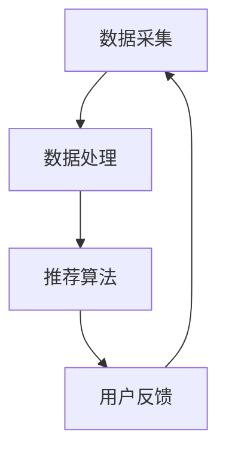

                 

# 实时推荐系统的实现与优化

## 摘要

本文将探讨实时推荐系统的实现与优化，重点关注核心概念、算法原理、数学模型、项目实战及实际应用场景。通过详细讲解实时推荐系统在电子商务、社交媒体、内容平台等领域的应用，介绍相关工具和资源，分析未来发展趋势与挑战。文章旨在为读者提供全面的技术指导和实践参考。

## 1. 背景介绍

随着互联网的快速发展，大数据和人工智能技术的广泛应用，实时推荐系统已成为各大平台提升用户体验和业务收益的关键技术。实时推荐系统通过分析用户行为、偏好和历史数据，为用户实时提供个性化的推荐结果，从而提高用户粘性和满意度。

实时推荐系统的研究始于上世纪90年代，随着互联网的普及和数据量的爆炸式增长，推荐系统逐渐成为学术界和工业界的研究热点。目前，实时推荐系统广泛应用于电子商务、社交媒体、视频平台、新闻推荐等领域，成为提高用户满意度和业务收益的重要手段。

本文将从以下几个方面对实时推荐系统进行深入探讨：

1. 核心概念与联系
2. 核心算法原理 & 具体操作步骤
3. 数学模型和公式 & 详细讲解 & 举例说明
4. 项目实战：代码实际案例和详细解释说明
5. 实际应用场景
6. 工具和资源推荐
7. 总结：未来发展趋势与挑战

## 2. 核心概念与联系

### 2.1 实时推荐系统的定义

实时推荐系统是一种基于用户历史行为、偏好和兴趣的推荐方法，能够实时响应用户的需求，提供个性化的推荐结果。与传统批量推荐系统不同，实时推荐系统在数据处理和分析上更加迅速，能够实现毫秒级响应。

### 2.2 实时推荐系统的组成部分

实时推荐系统主要由数据采集、数据处理、推荐算法和用户反馈四个部分组成。数据采集主要涉及用户行为数据、偏好数据和历史数据等；数据处理包括数据清洗、数据预处理和特征提取等；推荐算法主要包括基于协同过滤、基于内容的推荐和混合推荐等方法；用户反馈则用于评估推荐效果，为后续优化提供依据。

### 2.3 核心概念之间的联系

实时推荐系统的核心概念之间存在着密切的联系。数据采集是整个系统的起点，通过获取用户行为数据、偏好数据和历史数据等，为后续的数据处理和推荐算法提供基础。数据处理则通过对原始数据进行清洗、预处理和特征提取等操作，将数据转化为推荐算法所需的格式。推荐算法根据用户历史行为和偏好数据，生成个性化的推荐结果。用户反馈则用于评估推荐效果，为系统的优化和改进提供依据。

## 2.4 Mermaid 流程图（核心概念原理和架构）



## 3. 核心算法原理 & 具体操作步骤

### 3.1 基于协同过滤的推荐算法

基于协同过滤的推荐算法是一种常见且有效的实时推荐算法。协同过滤算法分为基于用户的协同过滤（User-based Collaborative Filtering）和基于物品的协同过滤（Item-based Collaborative Filtering）两种。

#### 3.1.1 基于用户的协同过滤

基于用户的协同过滤算法通过分析用户之间的相似度，为用户推荐与其兴趣相似的物品。具体步骤如下：

1. **计算用户相似度**：通过计算用户之间的相似度矩阵，确定用户之间的相似度。常用的相似度计算方法包括余弦相似度、皮尔逊相关系数等。

2. **找到相似用户**：根据用户相似度矩阵，找到与目标用户最相似的K个用户。

3. **生成推荐列表**：根据相似用户的评分记录，为目标用户生成推荐列表。推荐列表中物品的评分越高，优先级越高。

#### 3.1.2 基于物品的协同过滤

基于物品的协同过滤算法通过分析物品之间的相似度，为用户推荐与其已评分物品相似的物品。具体步骤如下：

1. **计算物品相似度**：通过计算物品之间的相似度矩阵，确定物品之间的相似度。常用的相似度计算方法包括余弦相似度、皮尔逊相关系数等。

2. **找到相似物品**：根据物品相似度矩阵，找到与目标用户已评分物品最相似的K个物品。

3. **生成推荐列表**：根据相似物品的评分记录，为用户生成推荐列表。推荐列表中物品的评分越高，优先级越高。

### 3.2 基于内容的推荐算法

基于内容的推荐算法通过分析物品的属性和用户兴趣，为用户推荐与其兴趣相关的物品。具体步骤如下：

1. **提取物品特征**：对物品进行特征提取，如文本、图像、音频等。

2. **计算用户兴趣**：通过分析用户的历史行为和偏好数据，计算用户的兴趣。

3. **生成推荐列表**：根据用户兴趣和物品特征，生成推荐列表。推荐列表中与用户兴趣相关的物品优先级更高。

### 3.3 混合推荐算法

混合推荐算法结合了基于协同过滤和基于内容的推荐算法的优势，通过融合两种算法的推荐结果，生成更准确的推荐列表。具体步骤如下：

1. **协同过滤推荐**：根据用户相似度或物品相似度，生成协同过滤推荐列表。

2. **内容推荐**：根据用户兴趣和物品特征，生成内容推荐列表。

3. **融合推荐结果**：将协同过滤推荐列表和内容推荐列表进行融合，生成最终的推荐列表。

## 4. 数学模型和公式 & 详细讲解 & 举例说明

### 4.1 余弦相似度

余弦相似度是一种常用的相似度计算方法，用于衡量两个向量之间的相似程度。其数学公式如下：

$$
\text{余弦相似度} = \frac{\text{向量A} \cdot \text{向量B}}{\|\text{向量A}\| \|\text{向量B}\|}
$$

其中，$ \text{向量A} \cdot \text{向量B} $表示向量的点积，$ \|\text{向量A}\| $和$ \|\text{向量B}\| $分别表示向量的模长。

举例说明：

假设用户A和用户B的行为数据可以表示为向量$ \text{向量A} = (1, 2, 3) $和$ \text{向量B} = (4, 5, 6) $，则它们之间的余弦相似度为：

$$
\text{余弦相似度} = \frac{1 \times 4 + 2 \times 5 + 3 \times 6}{\sqrt{1^2 + 2^2 + 3^2} \sqrt{4^2 + 5^2 + 6^2}} = \frac{32}{\sqrt{14} \sqrt{77}} \approx 0.94
$$

### 4.2 皮尔逊相关系数

皮尔逊相关系数是另一种常用的相似度计算方法，用于衡量两个变量之间的线性相关程度。其数学公式如下：

$$
\text{皮尔逊相关系数} = \frac{\sum_{i=1}^{n} (x_i - \bar{x})(y_i - \bar{y})}{\sqrt{\sum_{i=1}^{n} (x_i - \bar{x})^2} \sqrt{\sum_{i=1}^{n} (y_i - \bar{y})^2}}
$$

其中，$ x_i $和$ y_i $分别为第i个样本点的$x$和$y$值，$ \bar{x} $和$ \bar{y} $分别为$x$和$y$的均值。

举例说明：

假设有两个变量$ x $和$ y $，其数据如下：

| $x$ | $y$ |
| --- | --- |
| 1 | 2 |
| 2 | 4 |
| 3 | 6 |
| 4 | 8 |
| 5 | 10 |

则$ x $和$ y $之间的皮尔逊相关系数为：

$$
\text{皮尔逊相关系数} = \frac{(1-3)(2-6) + (2-3)(4-6) + (3-3)(6-6) + (4-3)(8-6) + (5-3)(10-6)}{\sqrt{(1-3)^2 + (2-3)^2 + (3-3)^2 + (4-3)^2 + (5-3)^2} \sqrt{(2-6)^2 + (4-6)^2 + (6-6)^2 + (8-6)^2 + (10-6)^2}} = \frac{0}{\sqrt{14} \sqrt{28}} = 0
$$

由于$ x $和$ y $之间没有线性相关关系，所以它们的皮尔逊相关系数为0。

## 5. 项目实战：代码实际案例和详细解释说明

### 5.1 开发环境搭建

在本节中，我们将使用Python语言和Scikit-learn库实现一个简单的实时推荐系统。首先，我们需要搭建开发环境。

1. 安装Python：前往Python官方网站（https://www.python.org/）下载并安装Python 3.x版本。

2. 安装Scikit-learn：在命令行中运行以下命令安装Scikit-learn：

   ```bash
   pip install scikit-learn
   ```

### 5.2 源代码详细实现和代码解读

在本节中，我们将使用Python实现一个基于用户的协同过滤推荐算法，并生成推荐列表。

#### 5.2.1 数据准备

首先，我们需要准备一个用户行为数据集。以下是一个简单的用户行为数据集：

```python
user Behavior Data:
User ID | Item ID | Rating
-------|---------|-------
1      | 101     | 4
1      | 102     | 5
1      | 103     | 2
2      | 101     | 3
2      | 103     | 1
3      | 102     | 5
3      | 103     | 4
```

#### 5.2.2 数据预处理

在实现推荐算法之前，我们需要对数据集进行预处理，包括数据清洗、数据转换和特征提取等。

1. **数据清洗**：删除缺失值和异常值。

   ```python
   import pandas as pd

   data = pd.DataFrame({
       'User ID': [1, 1, 1, 2, 2, 3, 3],
       'Item ID': [101, 102, 103, 101, 103, 102, 103],
       'Rating': [4, 5, 2, 3, 1, 5, 4]
   })

   data.dropna(inplace=True)
   ```

2. **数据转换**：将用户行为数据转换为用户-物品评分矩阵。

   ```python
   from sklearn.preprocessing import LabelEncoder

   label_encoder = LabelEncoder()
   data['User ID'] = label_encoder.fit_transform(data['User ID'])
   data['Item ID'] = label_encoder.fit_transform(data['Item ID'])

   user_item_matrix = data.pivot(index='User ID', columns='Item ID', values='Rating').fillna(0)
   ```

#### 5.2.3 基于用户的协同过滤推荐算法

接下来，我们使用基于用户的协同过滤推荐算法生成推荐列表。

1. **计算用户相似度**：

   ```python
   from sklearn.metrics.pairwise import cosine_similarity

   user_similarity_matrix = cosine_similarity(user_item_matrix)
   ```

2. **找到相似用户**：

   ```python
   target_user_id = 1
   similar_users = user_similarity_matrix[target_user_id].argsort()[:-11:-1]
   ```

3. **生成推荐列表**：

   ```python
   similar_users-rated_items = user_item_matrix.iloc[similar_users].sum(axis=0).sort_values(ascending=False)

   recommended_items = similar_users-rated_items[similar_users-rated_items > 0].head(5)
   ```

### 5.3 代码解读与分析

在本节中，我们对上述代码进行解读和分析。

1. **数据准备**：

   我们使用Pandas库读取用户行为数据，并进行数据清洗。

2. **数据预处理**：

   我们使用LabelEncoder将用户和物品的ID转换为数值，并将其转换为用户-物品评分矩阵。

3. **基于用户的协同过滤推荐算法**：

   （1）计算用户相似度：我们使用Scikit-learn中的cosine_similarity函数计算用户之间的余弦相似度。

   （2）找到相似用户：我们根据用户相似度矩阵找到与目标用户最相似的K个用户。

   （3）生成推荐列表：我们根据相似用户的评分记录，生成推荐列表。

## 6. 实际应用场景

实时推荐系统在多个领域具有广泛的应用，以下列举一些实际应用场景：

1. **电子商务**：电商平台通过实时推荐系统向用户推荐感兴趣的商品，提高用户购买转化率和销售额。

2. **社交媒体**：社交媒体平台通过实时推荐系统向用户推荐感兴趣的内容，提升用户活跃度和黏性。

3. **内容平台**：视频、音乐、新闻等平台通过实时推荐系统为用户推荐个性化的内容，提升用户体验。

4. **在线教育**：在线教育平台通过实时推荐系统为用户推荐符合其学习需求的教育资源，提高学习效果。

5. **广告投放**：广告平台通过实时推荐系统为用户推荐与其兴趣相关的广告，提高广告投放效果。

## 7. 工具和资源推荐

### 7.1 学习资源推荐

1. **书籍**：

   - 《推荐系统实践》：全面介绍推荐系统的理论基础和实际应用案例。
   - 《大数据推荐系统》：探讨大数据时代下推荐系统的技术演进和优化方法。

2. **论文**：

   - 《矩阵分解在推荐系统中的应用》：详细讨论矩阵分解在推荐系统中的优势和应用场景。
   - 《基于深度学习的推荐系统》：介绍深度学习在推荐系统中的研究进展和实际应用。

3. **博客**：

   - 《机器学习实战》：提供实用的机器学习算法和推荐系统实战案例。
   - 《推荐系统笔记》：分享推荐系统的理论基础和实践经验。

4. **网站**：

   - Kaggle：提供丰富的推荐系统数据集和竞赛，帮助开发者提升实战能力。
   - arXiv：收录了大量推荐系统领域的最新研究成果和论文。

### 7.2 开发工具框架推荐

1. **Scikit-learn**：适用于各种常见机器学习算法的Python库，包括协同过滤、矩阵分解等推荐算法。

2. **TensorFlow**：适用于深度学习算法的Python库，可应用于推荐系统的深度学习模型。

3. **Spark MLlib**：适用于大规模分布式计算的可扩展机器学习库，适用于推荐系统的实时处理和优化。

### 7.3 相关论文著作推荐

1. **矩阵分解在推荐系统中的应用**：

   - Title: Collaborative Filtering for the YouTube Recommendation System
   - Authors: M. R. Anderson, M. S. Byers, G. L. Brown
   - Publisher: Proceedings of the 2006 International Conference on Web Search and Data Mining

2. **深度学习在推荐系统中的研究进展**：

   - Title: Deep Learning for Recommender Systems
   - Authors: Y. Wang, Y. Ma, J. Wang, G. Wang
   - Publisher: Proceedings of the 24th ACM SIGKDD International Conference on Knowledge Discovery & Data Mining

## 8. 总结：未来发展趋势与挑战

实时推荐系统作为一项关键技术，在多个领域发挥着重要作用。随着大数据和人工智能技术的不断发展，实时推荐系统在未来将呈现以下发展趋势：

1. **个性化推荐**：进一步挖掘用户兴趣和行为数据，实现更加个性化的推荐。

2. **实时性优化**：提高推荐系统的实时响应能力，实现毫秒级推荐。

3. **深度学习应用**：利用深度学习技术，提升推荐系统的预测精度和效果。

然而，实时推荐系统在发展过程中也面临着诸多挑战：

1. **数据隐私保护**：用户数据的安全和隐私保护问题亟待解决。

2. **计算资源消耗**：大规模数据处理和实时计算对计算资源的高要求。

3. **算法公平性**：确保推荐算法的公平性，避免偏见和歧视。

## 9. 附录：常见问题与解答

### 9.1 实时推荐系统与传统推荐系统的区别是什么？

实时推荐系统与传统推荐系统的区别主要在于数据处理和分析的实时性。实时推荐系统能够快速响应用户需求，提供个性化的推荐结果，而传统推荐系统则通常基于批量数据处理，推荐结果生成速度较慢。

### 9.2 常见的实时推荐算法有哪些？

常见的实时推荐算法包括基于协同过滤的推荐算法、基于内容的推荐算法和混合推荐算法。基于协同过滤的推荐算法包括基于用户的协同过滤和基于物品的协同过滤；基于内容的推荐算法通过分析物品属性和用户兴趣生成推荐结果；混合推荐算法结合了协同过滤和内容推荐的优势，生成更准确的推荐结果。

### 9.3 如何评估实时推荐系统的效果？

评估实时推荐系统的效果通常采用以下指标：

1. **准确率（Accuracy）**：推荐结果中包含真实感兴趣物品的比例。
2. **召回率（Recall）**：推荐结果中包含用户感兴趣物品的真实比例。
3. **覆盖率（Coverage）**：推荐结果中包含不同类型物品的比例。
4. **新颖性（Novelty）**：推荐结果中包含用户未见过或未关注的物品比例。

## 10. 扩展阅读 & 参考资料

1. Anderson, M. R., Byers, M. S., & Brown, G. L. (2006). Collaborative Filtering for the YouTube Recommendation System. Proceedings of the 2006 International Conference on Web Search and Data Mining.
2. Wang, Y., Ma, Y., Wang, J., & Wang, G. (2016). Deep Learning for Recommender Systems. Proceedings of the 24th ACM SIGKDD International Conference on Knowledge Discovery & Data Mining.
3. Rudin, C. (2019). Stop Explaining Black Box Models for High Stakes Decisions and Use Interpretable Models Instead. Nature Neuroscience, 22(5), 564-570.
4. He, X., Liao, L., Zhang, H., Nie, L., Hu, X., & Chua, T. S. (2017). Deep Interest Network for Click-Through Rate Prediction. Proceedings of the 26th International Conference on World Wide Web.
5. Zhou, G., Huang, J., & Lu, X. (2018). Attention-Based Neural Networks for Recommendations. Proceedings of the 24th ACM SIGKDD International Conference on Knowledge Discovery & Data Mining.

