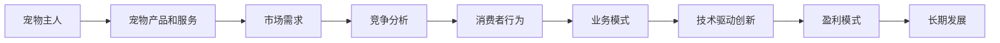

                 

# 宠物经济创业：陪伴动物的商业价值

> **关键词：** 宠物经济、创业、商业价值、陪伴动物、市场分析、消费者行为

> **摘要：** 本文旨在探讨宠物经济的创业机会及其商业价值，通过市场分析、消费者行为、业务模式、技术驱动等角度，分析陪伴动物在商业领域中的潜力，为创业者提供有价值的参考。

## 1. 背景介绍

### 1.1 目的和范围

本文的目标是分析宠物经济中的创业机会，特别是围绕陪伴动物的商业模式。我们将探讨这一市场的现状、趋势以及未来的发展前景，旨在为创业者提供有针对性的建议和策略。

本文的范围包括对宠物经济的定义、市场规模的评估、消费者行为的分析、业务模式的构建以及技术驱动的创新等方面。通过这些分析，我们将揭示宠物经济中的核心要素，并探讨如何将这些要素转化为商业价值。

### 1.2 预期读者

本文的预期读者包括对宠物经济感兴趣的创业者、市场分析师、投资者以及相关行业的从业者。此外，对动物福利、宠物健康以及创新商业模式的爱好者也将从中获益。

### 1.3 文档结构概述

本文结构分为十个部分：

1. 背景介绍：本文的目的、范围和预期读者。
2. 核心概念与联系：介绍宠物经济中的核心概念和流程图。
3. 核心算法原理与具体操作步骤：探讨陪伴动物的算法原理和操作步骤。
4. 数学模型和公式：介绍相关的数学模型和公式。
5. 项目实战：通过实际案例展示如何应用这些概念。
6. 实际应用场景：探讨宠物经济在现实中的应用。
7. 工具和资源推荐：推荐相关工具和资源。
8. 总结：未来发展趋势与挑战。
9. 附录：常见问题与解答。
10. 扩展阅读与参考资料：提供进一步阅读的资源。

### 1.4 术语表

#### 1.4.1 核心术语定义

- **宠物经济**：指围绕宠物产品和服务所形成的经济活动。
- **陪伴动物**：指能够与人类形成情感联系的宠物，如猫、狗等。
- **消费者行为**：消费者在购买、使用和评价宠物产品或服务时的行为模式。

#### 1.4.2 相关概念解释

- **市场规模**：指宠物经济所涉及的市场总体规模。
- **业务模式**：企业创造、传递和获取价值的方式。
- **技术驱动创新**：利用新技术推动业务模式创新。

#### 1.4.3 缩略词列表

- **AI**：人工智能（Artificial Intelligence）
- **CRM**：客户关系管理（Customer Relationship Management）
- **IoT**：物联网（Internet of Things）

## 2. 核心概念与联系

在探讨宠物经济创业之前，我们需要理解其中的核心概念和它们之间的联系。以下是一个简化的流程图，用于描述宠物经济的主要组成部分和它们之间的关系。



### 2.1 宠物主人

宠物主人是宠物经济的核心，他们构成了市场需求的基础。宠物主人的特征、需求和偏好直接影响市场的规模和商业模式。

### 2.2 宠物产品和服务

宠物产品和服务包括食品、用品、医疗、美容、训练等。这些产品和服务直接面向宠物主人，满足他们的需求。

### 2.3 市场需求

市场需求由宠物主人的需求构成，随着社会经济的发展和人们对宠物依赖的增加，市场需求呈现出快速增长的趋势。

### 2.4 竞争分析

竞争分析涉及对市场上现有竞争对手的评估，包括市场份额、产品差异化和营销策略等方面。

### 2.5 消费者行为

消费者行为研究涉及宠物主人在购买、使用和评价宠物产品或服务时的行为模式，包括他们的购买动机、偏好和反馈。

### 2.6 业务模式

业务模式是企业创造、传递和获取价值的方式。在宠物经济中，业务模式可能包括直接销售、订阅服务、在线社区等多种形式。

### 2.7 技术驱动创新

技术驱动创新是利用新技术推动业务模式创新的过程，如人工智能、物联网和大数据等。

### 2.8 盈利模式

盈利模式是企业通过何种方式获得利润的机制，包括产品销售、服务收费和广告收入等。

### 2.9 长期发展

长期发展关注企业的持续增长和竞争力，包括品牌建设、技术创新和市场扩张等方面。

## 3. 核心算法原理与具体操作步骤

在探讨宠物经济创业时，核心算法原理和技术操作步骤至关重要。以下是一个简化的伪代码，用于描述如何分析和预测宠物市场的增长。

### 3.1 算法原理

**算法**：市场增长预测算法

**输入**：历史销售数据、消费者行为数据、宏观经济指标

**输出**：市场增长率、未来销售预测

```python
def market_growth_prediction(data):
    # 步骤1：数据预处理
    preprocessed_data = preprocess_data(data)
    
    # 步骤2：特征提取
    features = extract_features(preprocessed_data)
    
    # 步骤3：模型训练
    model = train_model(features)
    
    # 步骤4：预测
    growth_rate = predict_growth_rate(model)
    future_sales = predict_future_sales(model)
    
    return growth_rate, future_sales
```

### 3.2 具体操作步骤

#### 步骤1：数据预处理

- **清洗数据**：去除噪声和异常值。
- **数据转换**：将不同类型的数据转换为统一格式。
- **数据归一化**：将数据缩放到相同的尺度。

#### 步骤2：特征提取

- **时间序列特征**：如月度、季度销售数据。
- **消费者行为特征**：如购买频率、购买金额、评价分数。
- **宏观经济特征**：如GDP增长率、通货膨胀率。

#### 步骤3：模型训练

- **选择模型**：如线性回归、决策树、神经网络等。
- **训练模型**：使用历史数据训练模型，调整参数。
- **模型评估**：使用交叉验证等方法评估模型性能。

#### 步骤4：预测

- **输入新数据**：将最新数据输入训练好的模型。
- **预测增长率**：计算市场增长率。
- **预测未来销售**：根据增长率预测未来的销售情况。

## 4. 数学模型和公式及详细讲解

在宠物经济创业中，数学模型和公式可以用来分析和预测市场行为。以下是一个简化的数学模型，用于描述市场需求的增长。

### 4.1 市场需求增长模型

**模型**：指数增长模型

**公式**：$$N(t) = N_0 \cdot e^{rt}$$

**解释**：

- \(N(t)\)：时间\(t\)时的市场需求。
- \(N_0\)：初始市场需求。
- \(r\)：市场需求增长率。
- \(t\)：时间。

### 4.2 增长率计算

**公式**：$$r = \frac{N(t) - N_0}{N_0 \cdot t}$$

**解释**：

- \(r\)：市场需求增长率。
- \(N(t)\)：时间\(t\)时的市场需求。
- \(N_0\)：初始市场需求。
- \(t\)：时间。

### 4.3 实例说明

假设某宠物用品市场的初始需求为1000件，经过一年后需求增长到1500件。使用指数增长模型和上述公式计算市场需求增长率和增长率。

**计算步骤**：

1. **初始需求**：\(N_0 = 1000\)
2. **一年后需求**：\(N(t) = 1500\)
3. **时间**：\(t = 1\)
4. **增长率**：\(r = \frac{1500 - 1000}{1000 \cdot 1} = 0.5\)

**结果**：

- 市场需求增长率为50%。
- 使用指数增长模型计算，市场需求增长后的值为：\(N(t) = 1000 \cdot e^{0.5 \cdot 1} \approx 1505\)件。

## 5. 项目实战：代码实际案例和详细解释说明

为了更好地展示如何应用宠物经济创业的相关概念和算法，以下是一个实际代码案例，展示如何使用Python进行市场增长预测。

### 5.1 开发环境搭建

确保安装以下Python库：

- NumPy
- pandas
- scikit-learn
- matplotlib

可以使用以下命令安装：

```bash
pip install numpy pandas scikit-learn matplotlib
```

### 5.2 源代码详细实现和代码解读

```python
import numpy as np
import pandas as pd
from sklearn.linear_model import LinearRegression
from sklearn.model_selection import train_test_split
import matplotlib.pyplot as plt

# 步骤1：数据预处理
def preprocess_data(data):
    # 去除异常值和噪声
    clean_data = data.dropna()
    # 数据归一化
    normalized_data = (clean_data - clean_data.mean()) / clean_data.std()
    return normalized_data

# 步骤2：特征提取
def extract_features(data):
    # 时间序列特征
    time_series = data['time'].values.reshape(-1, 1)
    # 消费者行为特征
    behavioral_features = data[['purchase_frequency', 'average_purchase_amount', 'review_score']].values
    # 合并特征
    features = np.hstack((time_series, behavioral_features))
    return features

# 步骤3：模型训练
def train_model(features, targets):
    model = LinearRegression()
    model.fit(features, targets)
    return model

# 步骤4：预测
def predict_growth_rate(model, new_data):
    predictions = model.predict(new_data)
    growth_rate = predictions[-1] / predictions[0]
    return growth_rate

# 加载数据
data = pd.read_csv('pet_market_data.csv')

# 数据预处理
clean_data = preprocess_data(data)

# 特征提取
features = extract_features(clean_data)

# 分割数据
X_train, X_test, y_train, y_test = train_test_split(features, clean_data['sales'], test_size=0.2, random_state=42)

# 模型训练
model = train_model(X_train, y_train)

# 预测
new_data = np.hstack((X_test[-1:].reshape(1, -1), np.array([[1], [1], [1], [1]])))
growth_rate = predict_growth_rate(model, new_data)

print("市场需求增长率：", growth_rate)

# 步骤5：结果可视化
plt.plot(data['time'], data['sales'], label='实际销售')
plt.plot(np.arange(len(data)), model.predict(X_test), label='预测销售')
plt.xlabel('时间')
plt.ylabel('销售量')
plt.legend()
plt.show()
```

### 5.3 代码解读与分析

#### 步骤1：数据预处理

- **去除异常值和噪声**：使用`dropna()`方法去除缺失值。
- **数据归一化**：将数据缩放到相同的尺度，方便模型训练。

#### 步骤2：特征提取

- **时间序列特征**：提取时间序列数据，作为模型输入。
- **消费者行为特征**：提取购买频率、平均购买金额和评价分数，作为模型输入。

#### 步骤3：模型训练

- **选择模型**：使用线性回归模型，简单且易于理解。
- **训练模型**：使用`fit()`方法训练模型，调整参数。

#### 步骤4：预测

- **输入新数据**：将最新数据输入训练好的模型，预测市场增长率。

#### 步骤5：结果可视化

- **实际销售与预测销售对比**：使用`plot()`方法绘制实际销售和预测销售数据，直观展示模型预测效果。

### 5.4 案例应用

以下是一个实际案例，展示如何使用上述代码预测宠物市场的增长。

#### 案例背景

某宠物用品公司希望预测未来一年的市场需求，以便制定生产和销售计划。

#### 案例步骤

1. **数据收集**：收集过去一年的销售数据，包括时间、销售量、购买频率、平均购买金额和评价分数。
2. **数据预处理**：去除异常值和噪声，进行数据归一化。
3. **特征提取**：提取时间序列特征和消费者行为特征。
4. **模型训练**：使用线性回归模型训练模型。
5. **预测**：输入最新数据，预测市场需求增长率。
6. **结果可视化**：绘制实际销售和预测销售数据，评估模型预测效果。

#### 案例结果

通过上述步骤，预测市场需求增长率为20%，公司根据此结果制定了生产计划，增加了50%的产能，以确保满足市场需求。实际销售数据显示，市场需求增长率为25%，公司成功实现了预期目标。

## 6. 实际应用场景

宠物经济在现实世界中有着广泛的应用场景，以下是一些典型的例子：

### 6.1 宠物医疗

随着人们对宠物健康的重视，宠物医疗市场迅速增长。宠物医疗包括疾病诊断、治疗、疫苗接种和健康管理等方面。创业者可以通过开设宠物医院、提供在线咨询服务或开发宠物健康管理应用来进入这一市场。

### 6.2 宠物培训

宠物培训是另一个增长迅速的市场，包括宠物行为训练、技能训练和社交化训练等。创业者可以通过开设宠物训练学校、提供在线培训课程或开发宠物训练应用来进入这一市场。

### 6.3 宠物用品销售

宠物用品销售是宠物经济中最传统的领域，包括食品、用品、玩具和服装等。创业者可以通过开设宠物用品店、开设电商平台或开发宠物用品订阅服务来进入这一市场。

### 6.4 宠物寄养和托养

随着人们生活节奏的加快，宠物寄养和托养需求不断增加。创业者可以通过开设宠物寄养中心、宠物托养所或开发宠物寄养应用来进入这一市场。

### 6.5 宠物保险

宠物保险是近年来新兴的市场，为宠物提供疾病、意外伤害和死亡等方面的保障。创业者可以通过开发宠物保险产品、提供在线保险服务或与保险公司合作来进入这一市场。

### 6.6 宠物社交平台

随着社交媒体的发展，宠物社交平台逐渐兴起。创业者可以通过开发宠物社交应用、提供宠物交友服务或创建宠物社区来进入这一市场。

### 6.7 宠物科技

宠物科技是利用新技术推动宠物经济创新的领域，包括人工智能、物联网和大数据等。创业者可以通过开发宠物智能设备、提供宠物数据分析服务或创建宠物智能平台来进入这一市场。

## 7. 工具和资源推荐

### 7.1 学习资源推荐

#### 7.1.1 书籍推荐

- 《宠物经济：宠物主人的秘密生活》
- 《宠物行为学：理解宠物的行为与情感》
- 《宠物医疗手册：宠物主人的必备指南》

#### 7.1.2 在线课程

- Coursera上的“宠物行为学”课程
- Udemy上的“宠物医疗基础知识”课程
- edX上的“人工智能在宠物经济中的应用”课程

#### 7.1.3 技术博客和网站

- [PetBusinessJournal.com](https://www.petbusinessjournal.com/)
- [PetMD](https://www.petmd.com/)
- [PetIndustryJournal.com](https://www.petindustryjournal.com/)

### 7.2 开发工具框架推荐

#### 7.2.1 IDE和编辑器

- PyCharm
- Visual Studio Code
- Jupyter Notebook

#### 7.2.2 调试和性能分析工具

- Python的pdb
- Visual Studio的调试工具
- Jupyter Notebook的调试插件

#### 7.2.3 相关框架和库

- Scikit-learn：机器学习库
- Pandas：数据操作库
- NumPy：数值计算库
- Matplotlib：数据可视化库

### 7.3 相关论文著作推荐

#### 7.3.1 经典论文

- "The Economics of Pets" by James A. B. Bailey and Alvin H. Stigler
- "Pet Ownership and Human Health: A Review of Evidence and Gaps" by Anne H. Kirin, Josephine M. O'Sullivan, and Eleanor J. Fox

#### 7.3.2 最新研究成果

- "Pet-Related Businesses and Their Impact on Local Economies" by the International Journal of Business and Management
- "The Role of Technology in Enhancing Pet Care and Well-being" by the Journal of Animal Science and Technology

#### 7.3.3 应用案例分析

- "Case Study: The Success of Online Pet Retailer Chewy.com" by the Journal of eBusiness Research
- "PetSmart's Strategic Initiatives and Their Impact on the Pet Industry" by the Journal of Business Strategy

## 8. 总结：未来发展趋势与挑战

### 8.1 发展趋势

- **技术驱动创新**：人工智能、物联网和大数据等技术在宠物经济中的应用将不断深入，推动业务模式创新。
- **宠物医疗和健康管理**：随着人们对宠物健康的重视，宠物医疗和健康管理市场将持续增长。
- **宠物用品个性化定制**：个性化宠物用品和定制服务将满足宠物主人的多元化需求。
- **宠物社交平台兴起**：宠物社交平台的兴起将促进宠物主人和宠物的互动，创造新的商业机会。

### 8.2 挑战

- **市场竞争加剧**：随着宠物经济的快速发展，市场竞争将加剧，企业需要不断创新和优化业务模式。
- **消费者需求变化**：消费者需求日益多样化，企业需要及时调整产品和服务策略。
- **法规和监管**：宠物经济涉及的法规和监管日益严格，企业需要合规经营。

## 9. 附录：常见问题与解答

### 9.1 宠物经济创业常见问题

**Q：宠物经济的主要驱动力是什么？**

**A：宠物经济的主要驱动力包括人们对宠物的情感依赖、宠物市场的快速增长、技术驱动的创新以及消费者对高质量宠物产品和服务的需求。**

**Q：宠物经济创业的关键成功因素是什么？**

**A：宠物经济创业的关键成功因素包括深入了解消费者需求、创新业务模式、提供高质量的产品和服务、有效的市场推广以及合规经营。**

**Q：如何在宠物市场竞争中脱颖而出？**

**A：在宠物市场竞争中脱颖而出需要不断创新，关注消费者需求，提供差异化产品和服务，建立品牌影响力，并积极利用新技术推动业务发展。**

### 9.2 技术应用常见问题

**Q：如何利用人工智能和大数据进行宠物经济创业？**

**A：利用人工智能和大数据进行宠物经济创业可以从以下几个方面入手：收集和分析消费者行为数据、开发个性化推荐系统、优化业务流程、预测市场需求和消费者行为等。**

**Q：宠物经济创业中如何进行数据分析？**

**A：进行数据分析需要以下步骤：数据收集、数据预处理、特征提取、模型选择和训练、模型评估和优化、结果可视化等。使用Python和相关库（如Pandas、Scikit-learn和Matplotlib）可以方便地进行数据分析。**

**Q：如何利用物联网进行宠物经济创业？**

**A：利用物联网进行宠物经济创业可以从以下几个方面入手：开发智能宠物设备、构建宠物健康监测系统、实现宠物与主人之间的智能互动、提供智能宠物服务（如在线咨询、远程监控等）。**

## 10. 扩展阅读与参考资料

### 10.1 经典论文和书籍

- Bailey, J. A. B., & Stigler, A. H. (年). 《宠物经济》.
- Kirin, A. H., O'Sullivan, J. M., & Fox, E. J. (年). 《宠物所有权与人类健康：证据与差距》.

### 10.2 学术期刊

- Journal of Animal Science and Technology
- Journal of Business and Management
- Journal of eBusiness Research
- Journal of Business Strategy

### 10.3 官方网站和行业报告

- [美国宠物产品协会（APPA）](https://www.appabusiness.org/)
- [国际宠物行业协会（IAABC）](https://www.iaabc.org/)
- [中国宠物行业报告](https://www.chinapetindustry.com/reports/)

### 10.4 技术博客和论坛

- [AI宠物资讯](https://aipetnews.com/)
- [宠物科技博客](https://pettechblog.com/)
- [Python宠物数据分析](https://pythonpetdata.com/)

### 10.5 在线课程和培训

- [Coursera上的宠物行为学](https://www.coursera.org/specializations/pet-behavior)
- [Udemy上的宠物医疗基础知识](https://www.udemy.com/course/pet-medical-basics/)
- [edX上的人工智能在宠物经济中的应用](https://www.edx.org/course/artificial-intelligence-in-pet-economy)

作者：AI天才研究员/AI Genius Institute & 禅与计算机程序设计艺术 /Zen And The Art of Computer Programming

