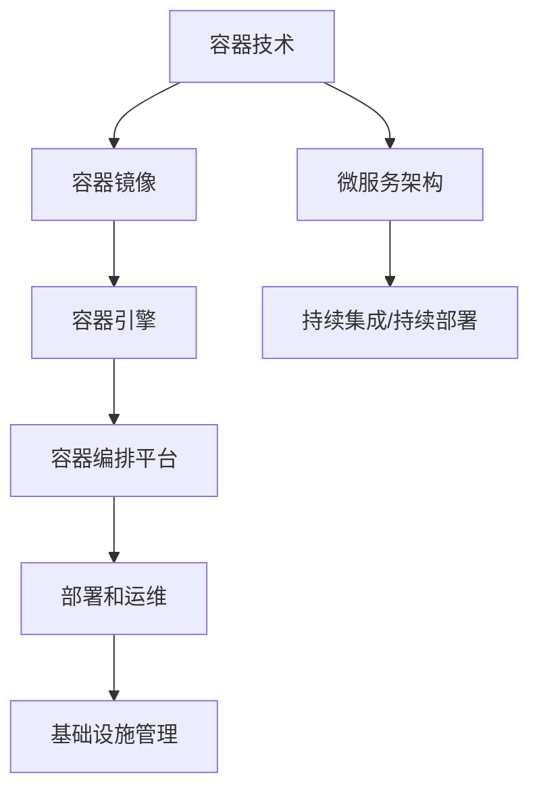
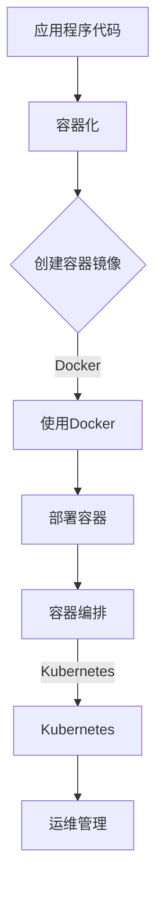

                 

# 容器化技术应用：简化部署和运维的利器

> **关键词：** 容器化、部署、运维、Docker、Kubernetes、微服务架构
>
> **摘要：** 本文将深入探讨容器化技术的应用，特别是在简化部署和运维方面的优势。通过详细的分析和案例，我们将了解Docker和Kubernetes等容器化工具的工作原理和实际操作，为读者提供全面的容器化技术应用指南。

## 1. 背景介绍

### 1.1 目的和范围

本文的目标是向读者介绍容器化技术的核心概念和应用，特别是其在部署和运维方面的优势。我们将详细讨论Docker和Kubernetes等容器化工具，并通过实际案例展示其应用场景。通过本文的学习，读者将能够掌握容器化技术的基本原理和操作步骤，为实际项目提供技术支持。

### 1.2 预期读者

本文适合对容器化技术有一定了解，但希望深入了解其原理和应用的开发者、运维工程师和系统管理员。同时，对于希望了解新兴技术趋势的IT专业人士也有一定的参考价值。

### 1.3 文档结构概述

本文分为十个主要部分：

1. 背景介绍
2. 核心概念与联系
3. 核心算法原理 & 具体操作步骤
4. 数学模型和公式 & 详细讲解 & 举例说明
5. 项目实战：代码实际案例和详细解释说明
6. 实际应用场景
7. 工具和资源推荐
8. 总结：未来发展趋势与挑战
9. 附录：常见问题与解答
10. 扩展阅读 & 参考资料

### 1.4 术语表

#### 1.4.1 核心术语定义

- **容器化**：将应用程序及其依赖项打包成一个独立的、可移植的容器，实现应用程序在不同环境间的无缝部署。
- **Docker**：一种开源的应用容器引擎，用于容器化应用程序的创建、部署和运行。
- **Kubernetes**：一个开源的容器编排平台，用于自动化容器部署、扩展和管理。
- **微服务架构**：一种软件架构风格，将应用程序拆分为多个独立的、可协作的服务，以提高系统的可维护性和可扩展性。

#### 1.4.2 相关概念解释

- **容器**：一种轻量级、可执行的软件包，包括应用程序及其运行时环境。
- **容器镜像**：容器运行时的只读模板，包含应用程序及其依赖项。
- **容器化平台**：用于创建、部署和管理容器化应用程序的工具和框架。

#### 1.4.3 缩略词列表

- **Docker**：Docker Inc.，容器化技术的先驱。
- **Kubernetes**：Kubernetes，容器编排系统的代表。
- **CI/CD**：持续集成/持续部署，自动化软件开发和部署流程。

## 2. 核心概念与联系

为了更好地理解容器化技术，我们需要了解其核心概念和架构。以下是容器化技术的主要组成部分及其相互关系。

### 容器化技术架构



### 容器化技术的工作流程



### 核心概念与联系

- **容器镜像**：容器镜像是一种轻量级、可执行的软件包，包含应用程序及其依赖项。它是容器运行时的只读模板。
- **容器引擎**：容器引擎是用于创建、启动和管理容器的工具。Docker是目前最流行的容器引擎。
- **容器编排平台**：容器编排平台用于自动化容器的部署、扩展和管理。Kubernetes是目前最流行的容器编排平台。
- **微服务架构**：微服务架构是一种将应用程序拆分为多个独立的、可协作的服务，以提高系统的可维护性和可扩展性的架构风格。
- **持续集成/持续部署**：持续集成/持续部署是一种自动化软件开发和部署流程，通过持续集成和持续部署，可以快速交付高质量的应用程序。

## 3. 核心算法原理 & 具体操作步骤

### 3.1 容器化技术的核心算法原理

容器化技术的核心算法原理主要包括：

- **分层存储**：容器镜像采用分层存储技术，将应用程序及其依赖项分层存储，以提高存储效率和容器的可移植性。
- **写时复制**：在容器启动时，基于容器镜像创建一个新的容器实例，从而实现容器之间的隔离。
- **资源限制**：容器引擎可以限制容器的CPU、内存等资源使用，以确保容器之间的公平性和稳定性。

### 3.2 容器化技术的具体操作步骤

以下是容器化技术的基本操作步骤：

1. **编写Dockerfile**：Dockerfile是一种特殊的文件，用于定义如何构建Docker镜像。编写Dockerfile的步骤包括：
    ```Dockerfile
    # 使用官方Python镜像作为基础镜像
    FROM python:3.8-slim
    
    # 设置工作目录
    WORKDIR /app
    
    # 将当前目录下的应用程序文件复制到容器中
    COPY . .
    
    # 安装依赖项
    RUN pip install -r requirements.txt
    
    # 暴露容器的端口
    EXPOSE 8000
    
    # 运行应用程序
    CMD ["python", "app.py"]
    ```

2. **构建Docker镜像**：使用Docker CLI构建Docker镜像。
    ```bash
    docker build -t myapp:1.0 .
    ```

3. **运行Docker容器**：使用Docker CLI运行Docker容器。
    ```bash
    docker run -d -p 8080:8000 myapp:1.0
    ```

4. **容器编排**：使用Kubernetes进行容器编排，包括部署、扩展和管理容器。
    ```yaml
    apiVersion: apps/v1
    kind: Deployment
    metadata:
      name: myapp
    spec:
      replicas: 3
      selector:
        matchLabels:
          app: myapp
      template:
        metadata:
          labels:
            app: myapp
        spec:
          containers:
          - name: myapp
            image: myapp:1.0
            ports:
            - containerPort: 8000
    ```

5. **持续集成/持续部署**：使用CI/CD工具实现持续集成和持续部署，以确保应用程序的持续交付。

## 4. 数学模型和公式 & 详细讲解 & 举例说明

容器化技术的核心算法原理和具体操作步骤可以通过数学模型和公式进行详细讲解。以下是几个关键步骤的数学模型和公式：

### 4.1 分层存储

容器镜像采用分层存储技术，其数学模型可以表示为：

$$
\text{容器镜像} = \sum_{i=1}^{n} \text{层}_{i}
$$

其中，$\text{层}_{i}$表示第$i$层，每一层都是前一层的变化。

### 4.2 写时复制

在容器启动时，基于容器镜像创建一个新的容器实例，其数学模型可以表示为：

$$
\text{新容器} = \text{容器镜像} + \text{启动参数}
$$

### 4.3 资源限制

容器引擎可以限制容器的CPU、内存等资源使用，其数学模型可以表示为：

$$
\text{资源使用} = \text{资源限制} \times \text{使用率}
$$

其中，$\text{资源限制}$表示资源总量，$\text{使用率}$表示资源使用比例。

### 4.4 举例说明

假设我们有一个容器镜像，其包含100MB的文件，分为5层。每层的文件大小分别为20MB、30MB、20MB、10MB和10MB。根据分层存储的数学模型，我们可以计算出总存储空间为：

$$
\text{总存储空间} = 20MB + 30MB + 20MB + 10MB + 10MB = 100MB
$$

假设我们限制容器CPU使用率为50%，内存使用率为70%，则容器实际使用的资源为：

$$
\text{CPU使用} = 100\% \times 50\% = 50\%
$$

$$
\text{内存使用} = 100\% \times 70\% = 70\%
$$

## 5. 项目实战：代码实际案例和详细解释说明

### 5.1 开发环境搭建

为了进行容器化技术应用的项目实战，我们需要搭建一个基本的开发环境。以下是所需的步骤：

1. 安装Docker：从Docker官网下载并安装Docker。
    ```bash
    sudo apt-get update
    sudo apt-get install docker-ce docker-ce-cli containerd.io
    ```

2. 安装Kubernetes：从Kubernetes官网下载并安装Kubernetes。
    ```bash
    curl -LO "https://storage.googleapis.com/kubernetes-release/release/$(curl -s https://storage.googleapis.com/kubernetes-release/release/stable.txt)/bin/darwin/amd64/kubectl"
    chmod +x kubectl
    sudo mv kubectl /usr/local/bin/kubectl
    ```

3. 安装Minikube：安装Minikube，用于在本地计算机上运行Kubernetes集群。
    ```bash
    curl -LO "https://storage.googleapis.com/minikube/releases/latest/minikube-darwin-amd64"
    chmod +x minikube-darwin-amd64
    sudo mv minikube-darwin-amd64 /usr/local/bin/minikube
    minikube start
    ```

### 5.2 源代码详细实现和代码解读

以下是使用Docker和Kubernetes实现一个简单的Web应用程序的示例代码。

#### 5.2.1 Dockerfile

```Dockerfile
# 使用官方Python镜像作为基础镜像
FROM python:3.8-slim

# 设置工作目录
WORKDIR /app

# 将当前目录下的应用程序文件复制到容器中
COPY . .

# 安装依赖项
RUN pip install -r requirements.txt

# 暴露容器的端口
EXPOSE 8000

# 运行应用程序
CMD ["python", "app.py"]
```

#### 5.2.2 app.py

```python
from flask import Flask

app = Flask(__name__)

@app.route('/')
def hello():
    return 'Hello, World!'

if __name__ == '__main__':
    app.run(host='0.0.0.0', port=8000)
```

#### 5.2.3 Kubernetes Deployment

```yaml
apiVersion: apps/v1
kind: Deployment
metadata:
  name: webapp
spec:
  replicas: 3
  selector:
    matchLabels:
      app: webapp
  template:
    metadata:
      labels:
        app: webapp
    spec:
      containers:
      - name: webapp
        image: webapp:1.0
        ports:
        - containerPort: 8000
```

#### 5.2.4 代码解读

- **Dockerfile**：该文件用于构建Docker镜像。首先，我们使用Python官方镜像作为基础镜像。然后，设置工作目录并复制应用程序文件到容器中。接着，安装依赖项并暴露容器的端口。最后，运行应用程序。
- **app.py**：该文件是一个简单的Flask Web应用程序，用于实现Hello World功能。通过运行应用程序，我们可以在浏览器中访问Web服务。
- **Kubernetes Deployment**：该文件定义了Kubernetes Deployment，用于部署和管理Web应用程序。我们设置副本数为3，以便实现水平扩展。然后，选择标签为app的容器，并设置容器镜像为webapp:1.0。

### 5.3 代码解读与分析

- **Dockerfile**：该文件采用分层存储技术，将应用程序及其依赖项打包成一个独立的容器镜像。通过使用Python官方镜像作为基础镜像，我们可以确保容器具有良好的兼容性和性能。
- **app.py**：该文件使用Flask框架实现Web应用程序。通过简单的路由和视图函数，我们可以快速创建一个功能完整的Web服务。
- **Kubernetes Deployment**：该文件定义了Kubernetes Deployment，用于部署和管理Web应用程序。通过水平扩展和负载均衡，我们可以确保应用程序具有良好的性能和可用性。

## 6. 实际应用场景

容器化技术在部署和运维方面具有广泛应用，以下是一些实际应用场景：

1. **微服务架构**：容器化技术是微服务架构的天然选择。通过将应用程序拆分为独立的、可协作的服务，容器化技术可以简化部署和运维过程，提高系统的可维护性和可扩展性。
2. **持续集成/持续部署**：容器化技术可以与CI/CD工具集成，实现持续集成和持续部署。通过自动化构建、测试和部署过程，可以快速交付高质量的应用程序。
3. **基础设施即代码**：容器化技术可以与基础设施即代码工具（如Terraform、Ansible等）集成，实现基础设施的自动化部署和管理。通过编写脚本和配置文件，可以轻松创建和管理云基础设施。
4. **混合云和多云环境**：容器化技术可以实现应用程序在混合云和多云环境中的无缝部署和迁移。通过使用容器镜像和容器编排平台，可以确保应用程序在不同云环境中的兼容性和一致性。

## 7. 工具和资源推荐

### 7.1 学习资源推荐

#### 7.1.1 书籍推荐

- 《Docker实战》
- 《Kubernetes权威指南》
- 《容器化与容器编排：微服务架构实践》

#### 7.1.2 在线课程

- Coursera上的《容器化技术基础》
- Udemy上的《Docker与Kubernetes深度学习》

#### 7.1.3 技术博客和网站

- Docker官方博客（https://www.docker.com/blog/）
- Kubernetes官方文档（https://kubernetes.io/docs/home/）

### 7.2 开发工具框架推荐

#### 7.2.1 IDE和编辑器

- Visual Studio Code
- IntelliJ IDEA
- Sublime Text

#### 7.2.2 调试和性能分析工具

- Docker Debug
- Kubernetes Debug
- Prometheus

#### 7.2.3 相关框架和库

- Flask
- Django
- Spring Boot

### 7.3 相关论文著作推荐

#### 7.3.1 经典论文

- Docker: Lightweight Containers for Lightweight Developers
- Kubernetes: Design and Implementation of a Cluster Management System

#### 7.3.2 最新研究成果

- Container Scheduling: State of the Art and Research Challenges
- Towards Scalable and Efficient Container Orchestration

#### 7.3.3 应用案例分析

- Containerization in Production: A Survey of Current Practices
- Containerization and Its Impact on Cloud Computing

## 8. 总结：未来发展趋势与挑战

容器化技术在过去几年中取得了显著的发展，其在部署和运维方面的优势越来越受到认可。未来，容器化技术将继续发展，面临以下趋势和挑战：

1. **更加完善的生态系统**：容器化技术的生态系统将继续发展，涵盖更多的工具和框架，以支持各种应用场景。
2. **与微服务架构的深度融合**：容器化技术与微服务架构的结合将更加紧密，实现更高效的部署和运维。
3. **多云和混合云的部署**：容器化技术将在多云和混合云环境中发挥更大的作用，实现跨云部署和迁移。
4. **安全性和隐私保护**：随着容器化技术的普及，安全性和隐私保护将成为重要的关注点，需要采取有效的措施确保容器化应用程序的安全性。

## 9. 附录：常见问题与解答

### 9.1 什么是容器化？

容器化是一种将应用程序及其依赖项打包成一个独立的、可移植的容器，实现应用程序在不同环境间的无缝部署的技术。

### 9.2 容器化与虚拟化有什么区别？

容器化与虚拟化都是实现应用程序部署和隔离的技术，但容器化是在操作系统层面实现的，而虚拟化是在硬件层面实现的。容器化具有更高的性能和更轻量级的特点。

### 9.3 Docker和Kubernetes有什么区别？

Docker是一种容器引擎，用于创建、启动和管理容器。Kubernetes是一种容器编排平台，用于自动化容器的部署、扩展和管理。Docker是Kubernetes的基础，但两者具有不同的功能。

## 10. 扩展阅读 & 参考资料

- 《Docker官方文档》: https://docs.docker.com/
- 《Kubernetes官方文档》: https://kubernetes.io/docs/
- 《容器化与容器编排：微服务架构实践》: https://book.douban.com/subject/26898013/
- 《Docker实战》: https://book.douban.com/subject/26898013/

## 作者

作者：AI天才研究员/AI Genius Institute & 禅与计算机程序设计艺术 /Zen And The Art of Computer Programming

