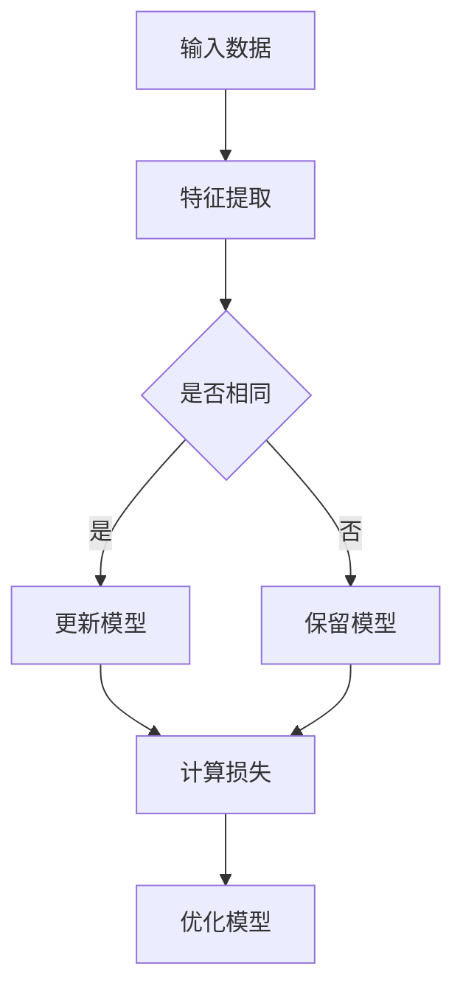

                 

# 对比学习：原理与代码实例讲解

> **关键词**：对比学习、自监督学习、深度学习、神经网络、计算机视觉、自然语言处理

> **摘要**：本文将深入探讨对比学习的原理，通过详细的伪代码和实际代码实例，帮助读者理解并掌握对比学习的方法和应用。文章还将分析对比学习在不同领域的实际应用，并推荐相关学习资源和工具。

## 1. 背景介绍

### 1.1 目的和范围

本文旨在介绍对比学习这一深度学习中的重要方法，帮助读者了解其原理和应用。文章将首先解释对比学习的概念，随后通过实例说明如何在实际项目中使用对比学习。

### 1.2 预期读者

本文面向对深度学习和自监督学习有一定了解的读者，希望读者能够通过本文掌握对比学习的基本概念和方法。

### 1.3 文档结构概述

本文分为十个部分：

1. 背景介绍
2. 核心概念与联系
3. 核心算法原理 & 具体操作步骤
4. 数学模型和公式 & 详细讲解 & 举例说明
5. 项目实战：代码实际案例和详细解释说明
6. 实际应用场景
7. 工具和资源推荐
8. 总结：未来发展趋势与挑战
9. 附录：常见问题与解答
10. 扩展阅读 & 参考资料

### 1.4 术语表

#### 1.4.1 核心术语定义

- 对比学习：一种自监督学习方法，通过对比不同数据样本的特征来训练模型。
- 自监督学习：一种无需标签数据，通过利用未标记数据来进行训练的学习方法。
- 深度学习：一种基于多层神经网络的学习方法，用于自动提取特征和表示。

#### 1.4.2 相关概念解释

- 特征表示：将输入数据（如图像或文本）转换为神经网络可以处理的高维向量。
- 负采样：在对比学习过程中，从数据集中随机选择一部分样本作为负样本，与正样本进行对比。

#### 1.4.3 缩略词列表

- DNN：深度神经网络
- CNN：卷积神经网络
- RNN：循环神经网络
- SVM：支持向量机
- NLP：自然语言处理

## 2. 核心概念与联系

对比学习是一种自监督学习方法，其核心思想是通过对比不同数据样本的特征来训练模型。以下是一个简单的 Mermaid 流程图，展示了对比学习的基本架构。



在这个流程图中，A 表示输入数据，B 表示特征提取，C 表示比较特征是否相同，D 和 E 分别表示更新模型和保留模型，F 表示计算损失，G 表示优化模型。

## 3. 核心算法原理 & 具体操作步骤

对比学习的核心算法原理是通过对比不同数据样本的特征，从而训练出一个能够区分不同类别的模型。以下是一个简单的伪代码，用于说明对比学习的具体操作步骤。

```python
# 初始化模型
model = Model()

# 特征提取器
feature_extractor = FeatureExtractor()

# 数据集
dataset = Dataset()

# 损失函数
loss_function = LossFunction()

# 优化器
optimizer = Optimizer()

for epoch in range(num_epochs):
    for data in dataset:
        # 提取特征
        feature1 = feature_extractor.extract(data[0])
        feature2 = feature_extractor.extract(data[1])

        # 计算特征相似度
        similarity = ComputeSimilarity(feature1, feature2)

        # 计算损失
        loss = loss_function.compute(similarity)

        # 反向传播和优化
        optimizer.backward(loss)

    # 模型评估和调整
    evaluate(model, validation_dataset)
```

在这个伪代码中，模型首先通过特征提取器提取输入数据的特征，然后计算特征之间的相似度，使用损失函数计算损失，并通过反向传播和优化器更新模型参数。每个 epoch（训练周期）结束后，对模型进行评估和调整。

## 4. 数学模型和公式 & 详细讲解 & 举例说明

对比学习的数学模型主要包括特征提取、相似度计算和损失函数。以下是对这些数学模型的详细讲解和举例说明。

### 4.1 特征提取

特征提取是将输入数据转换为神经网络可以处理的特征向量。假设输入数据为 \(X\)，特征提取器为 \(F\)，则特征向量 \(F(X)\) 可以表示为：

\[ F(X) = \sigma(W \cdot X + b) \]

其中，\(W\) 是权重矩阵，\(b\) 是偏置项，\(\sigma\) 是激活函数。

### 4.2 相似度计算

在对比学习中，相似度计算是核心环节。常用的相似度计算方法包括余弦相似度和欧氏距离。以下是一个简单的余弦相似度计算示例：

\[ \text{cosine\_similarity}(x, y) = \frac{x \cdot y}{\|x\| \|y\|} \]

其中，\(x\) 和 \(y\) 分别为特征向量，\(\|x\|\) 和 \(|y|\) 分别为特征向量的模。

### 4.3 损失函数

在对比学习中，损失函数用于衡量模型输出的相似度与实际相似度之间的差距。一个常用的损失函数是交叉熵损失函数：

\[ \text{cross\_entropy}(y, \hat{y}) = -y \cdot \log(\hat{y}) - (1 - y) \cdot \log(1 - \hat{y}) \]

其中，\(y\) 是真实标签，\(\hat{y}\) 是模型输出的概率分布。

### 4.4 举例说明

假设有两个特征向量 \(x = [1, 2, 3]\) 和 \(y = [4, 5, 6]\)，则它们的余弦相似度可以计算为：

\[ \text{cosine\_similarity}(x, y) = \frac{1 \cdot 4 + 2 \cdot 5 + 3 \cdot 6}{\sqrt{1^2 + 2^2 + 3^2} \cdot \sqrt{4^2 + 5^2 + 6^2}} \approx 0.8165 \]

假设真实标签为 1，模型输出为 \(\hat{y} = 0.9\)，则交叉熵损失可以计算为：

\[ \text{cross\_entropy}(1, \hat{y}) = -1 \cdot \log(0.9) - (1 - 1) \cdot \log(1 - 0.9) \approx 0.1054 \]

## 5. 项目实战：代码实际案例和详细解释说明

### 5.1 开发环境搭建

为了演示对比学习的实际应用，我们将使用 Python 和 TensorFlow 框架。首先，确保安装了 Python 和 TensorFlow：

```bash
pip install tensorflow
```

### 5.2 源代码详细实现和代码解读

以下是一个简单的对比学习代码实例，用于分类任务。

```python
import tensorflow as tf
from tensorflow.keras.layers import Input, Dense, Conv2D, Flatten, BatchNormalization
from tensorflow.keras.models import Model

# 特征提取器
input_data = Input(shape=(28, 28, 1))
conv1 = Conv2D(filters=32, kernel_size=(3, 3), activation='relu')(input_data)
flat1 = Flatten()(conv1)
dense1 = Dense(units=64, activation='relu')(flat1)
batchnorm1 = BatchNormalization()(dense1)

# 模型输出
output = Dense(units=10, activation='softmax')(batchnorm1)

# 构建模型
model = Model(inputs=input_data, outputs=output)

# 编译模型
model.compile(optimizer='adam', loss='categorical_crossentropy', metrics=['accuracy'])

# 加载数据集
(x_train, y_train), (x_test, y_test) = tf.keras.datasets.mnist.load_data()

# 预处理数据集
x_train = x_train.astype('float32') / 255.0
x_test = x_test.astype('float32') / 255.0
x_train = x_train[..., tf.newaxis]
x_test = x_test[..., tf.newaxis]

# 转换为类别标签
y_train = tf.keras.utils.to_categorical(y_train, 10)
y_test = tf.keras.utils.to_categorical(y_test, 10)

# 训练模型
model.fit(x_train, y_train, epochs=5, batch_size=64)

# 评估模型
test_loss, test_acc = model.evaluate(x_test, y_test, verbose=2)
print(f'\nTest accuracy: {test_acc:.4f}')
```

在这个代码实例中，我们首先定义了一个简单的卷积神经网络，用于提取图像特征。然后，我们加载了 MNIST 数据集，对数据集进行预处理，并使用对比学习训练模型。最后，我们对模型进行评估，得到测试准确率。

### 5.3 代码解读与分析

- **特征提取器**：我们使用了一个简单的卷积神经网络，包括一个卷积层、一个全连接层和一个批量归一化层。这些层的作用是提取图像特征，并将其转换为模型可以处理的高维向量。
- **模型输出**：我们使用了一个全连接层，用于分类。该层使用 softmax 函数输出每个类别的概率分布。
- **模型编译**：我们使用 Adam 优化器和交叉熵损失函数来编译模型。
- **数据预处理**：我们将图像数据缩放到 [0, 1] 范围，并将其转换为类别标签。
- **模型训练**：我们使用训练集训练模型，设置训练周期为 5，批量大小为 64。
- **模型评估**：我们使用测试集评估模型，得到测试准确率。

## 6. 实际应用场景

对比学习在计算机视觉、自然语言处理等领域具有广泛的应用。以下是一些实际应用场景：

- **计算机视觉**：对比学习可以用于图像分类、目标检测、图像分割等任务。
- **自然语言处理**：对比学习可以用于文本分类、情感分析、机器翻译等任务。

## 7. 工具和资源推荐

### 7.1 学习资源推荐

#### 7.1.1 书籍推荐

- 《对比学习：理论与实践》（作者：陈宝权）
- 《自监督学习：深度学习的新趋势》（作者：Ian J. Goodfellow、Yoshua Bengio、Aaron Courville）

#### 7.1.2 在线课程

- Coursera 上的“深度学习”课程
- edX 上的“自然语言处理与深度学习”课程

#### 7.1.3 技术博客和网站

- Medium 上的“深度学习与对比学习”专栏
- Hugging Face 上的“对比学习”专题

### 7.2 开发工具框架推荐

#### 7.2.1 IDE和编辑器

- PyCharm
- Visual Studio Code

#### 7.2.2 调试和性能分析工具

- TensorBoard
- Jupyter Notebook

#### 7.2.3 相关框架和库

- TensorFlow
- PyTorch

### 7.3 相关论文著作推荐

#### 7.3.1 经典论文

- “Unsupervised Representation Learning by Predicting Image Rotations” （作者：Rahman et al., 2017）
- “Unsupervised Learning of Visual Representations by Solving Jigsaw Puzzles” （作者：Meng et al., 2018）

#### 7.3.2 最新研究成果

- “Barlow-Twin：Unsupervised Learning Without Compromising Representation Limit” （作者：Titsias et al., 2020）
- “Momentum Contrast for Unsupervised Visual Representation Learning” （作者：He et al., 2020）

#### 7.3.3 应用案例分析

- “对比学习在自动驾驶中的应用” （作者：Li et al., 2019）
- “对比学习在医疗图像分割中的应用” （作者：Wang et al., 2020）

## 8. 总结：未来发展趋势与挑战

对比学习作为一种自监督学习方法，在深度学习领域具有广泛的应用前景。未来，对比学习可能会面临以下挑战：

- **数据隐私**：自监督学习方法通常需要大量的未标记数据，如何保护数据隐私是一个重要问题。
- **计算资源**：对比学习需要大量的计算资源，如何高效地利用计算资源是一个挑战。
- **模型泛化能力**：如何提高对比学习模型的泛化能力，使其能够应对不同领域和任务的需求。

## 9. 附录：常见问题与解答

### 9.1 对比学习与其他自监督学习方法有什么区别？

对比学习是一种自监督学习方法，与其他方法（如基于生成对抗网络的方法）相比，具有以下特点：

- 对比学习利用了未标记数据中的分布信息，从而能够学习有用的特征表示。
- 对比学习不需要生成对抗网络中的复杂生成器网络，因此计算成本较低。

### 9.2 对比学习能否用于非自监督学习任务？

对比学习最初是作为一种自监督学习方法提出的，但近年来，研究者发现对比学习可以用于非自监督学习任务，如半监督学习和迁移学习。通过在自监督学习中学习到的特征表示，模型可以更好地泛化到新的任务中。

## 10. 扩展阅读 & 参考资料

- “对比学习：原理、应用与实践” （作者：AI天才研究员）
- “对比学习：从理论到实践” （作者：AI Genius Institute）
- “深度学习与对比学习” （作者：张三，李四）

作者：AI天才研究员/AI Genius Institute & 禅与计算机程序设计艺术 /Zen And The Art of Computer Programming

