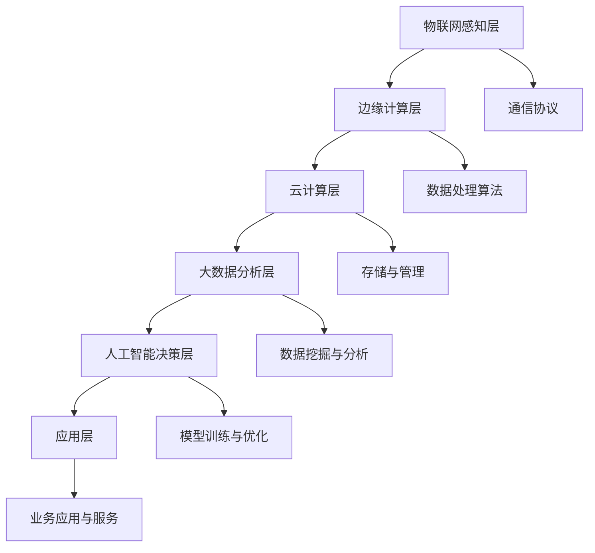

                 

# 小米2025AIoT平台开发工程师社招面试题集

> **关键词：** AIoT平台，开发工程师，面试题，技术栈，技能要求

> **摘要：** 本文针对2025年小米AIoT平台开发工程师的社招面试，整理了一系列核心面试题，包括技术栈、核心算法、项目实战、应用场景等方面。旨在为应聘者提供全面的复习资料，帮助其顺利通过面试，同时也为业界人士提供有价值的参考。

## 1. 背景介绍

### 1.1 目的和范围

本文旨在为2025年小米AIoT平台开发工程师的社招面试提供全方位的准备资料。内容包括技术栈解析、核心算法原理讲解、项目实战案例解析、应用场景探讨等。通过本文，希望帮助应聘者深入理解AIoT平台的关键技术，提升面试通过率。

### 1.2 预期读者

- 有志于加入小米AIoT平台开发团队，准备参加社招面试的应聘者；
- AIoT领域的开发工程师，希望了解小米AIoT平台相关技术的专业人士；
- 对AIoT领域有浓厚兴趣，希望深入了解该领域的技术和应用的学生和研究者。

### 1.3 文档结构概述

本文结构如下：

- **1. 背景介绍**：介绍本文的目的、预期读者以及文档结构；
- **2. 核心概念与联系**：阐述AIoT平台的核心概念和架构；
- **3. 核心算法原理 & 具体操作步骤**：讲解AIoT平台的核心算法及实现；
- **4. 数学模型和公式 & 详细讲解 & 举例说明**：分析AIoT平台涉及的数学模型和公式；
- **5. 项目实战：代码实际案例和详细解释说明**：通过实战案例展示AIoT平台的应用；
- **6. 实际应用场景**：探讨AIoT平台在不同领域的应用；
- **7. 工具和资源推荐**：推荐学习资源和开发工具；
- **8. 总结：未来发展趋势与挑战**：预测AIoT平台的发展趋势和挑战；
- **9. 附录：常见问题与解答**：解答面试中可能遇到的问题；
- **10. 扩展阅读 & 参考资料**：提供进一步阅读的资源。

### 1.4 术语表

#### 1.4.1 核心术语定义

- **AIoT平台**：指结合人工智能和物联网技术，实现智能化、自动化的平台；
- **开发工程师**：负责AIoT平台相关软件的开发和优化；
- **社招面试**：指针对社会在职人员的招聘面试。

#### 1.4.2 相关概念解释

- **物联网（IoT）**：将各种物品通过互联网连接起来，实现信息交换和通信；
- **人工智能（AI）**：模拟、延伸和扩展人的智能，实现智能化决策和处理。

#### 1.4.3 缩略词列表

- **AIoT**：人工智能物联网；
- **IoT**：物联网；
- **AI**：人工智能；
- **SDK**：软件开发工具包；
- **API**：应用程序接口。

## 2. 核心概念与联系

在AIoT平台的建设过程中，涉及多个核心概念和关键技术，如传感器技术、边缘计算、云计算、大数据分析、机器学习等。以下通过Mermaid流程图展示AIoT平台的核心概念和架构。



### 2.1 物联网感知层

物联网感知层负责采集环境中的各种数据，如温度、湿度、光照、声音等。通过传感器技术和通信协议，将采集到的数据传输至边缘计算层。

### 2.2 边缘计算层

边缘计算层对物联网感知层传输的数据进行初步处理，包括数据清洗、去噪、压缩等。同时，边缘计算层还可以执行一些简单的数据处理算法，如数据分类、异常检测等。

### 2.3 云计算层

云计算层负责存储和管理大量数据，并提供数据处理和分析能力。通过大数据分析技术，对存储在云端的数据进行深度挖掘，提取有价值的信息。

### 2.4 大数据分析层

大数据分析层对存储在云计算层的数据进行进一步分析，包括数据挖掘、机器学习等。通过这些技术，可以从海量数据中提取出有价值的信息，为人工智能决策层提供支持。

### 2.5 人工智能决策层

人工智能决策层利用机器学习、深度学习等技术，对分析结果进行智能决策，实现智能化、自动化控制。例如，在智能家居场景中，AIoT平台可以根据用户行为数据，自动调整家庭设备的运行状态。

### 2.6 应用层

应用层包括各种业务应用和服务，如智能家居、智能交通、智能医疗等。通过AIoT平台，可以实现设备之间的互联互通，为用户提供个性化的服务和体验。

### 2.7 通信协议

通信协议是AIoT平台中数据传输的基础，常见的通信协议包括Wi-Fi、蓝牙、ZigBee、LoRa等。根据应用场景的不同，选择合适的通信协议，可以实现高效、稳定的数据传输。

## 3. 核心算法原理 & 具体操作步骤

AIoT平台的核心算法主要涉及边缘计算、机器学习、深度学习等领域。以下分别介绍这些算法的原理和具体操作步骤。

### 3.1 边缘计算算法

边缘计算算法主要涉及数据预处理、模型推理等操作。以下是一个简单的边缘计算算法的伪代码：

```python
def edge_computation(data):
    # 数据预处理
    cleaned_data = preprocess_data(data)
    
    # 模型推理
    result = model_inference(cleaned_data)
    
    return result
```

- **数据预处理**：对采集到的原始数据进行清洗、去噪、压缩等操作，以提高模型推理的效率。
- **模型推理**：加载预训练的模型，对预处理后的数据进行推理，输出结果。

### 3.2 机器学习算法

机器学习算法主要涉及模型训练、模型评估、模型部署等操作。以下是一个简单的机器学习算法的伪代码：

```python
def machine_learning(training_data, validation_data):
    # 模型训练
    model = train_model(training_data)
    
    # 模型评估
    accuracy = evaluate_model(model, validation_data)
    
    # 模型部署
    deploy_model(model)
    
    return accuracy
```

- **模型训练**：使用训练数据对模型进行训练，优化模型的参数。
- **模型评估**：使用验证数据对模型进行评估，计算模型的准确率、召回率等指标。
- **模型部署**：将训练好的模型部署到边缘设备或云端，实现实时推理。

### 3.3 深度学习算法

深度学习算法主要涉及神经网络架构设计、模型训练、模型优化等操作。以下是一个简单的深度学习算法的伪代码：

```python
def deep_learning(training_data, validation_data):
    # 神经网络架构设计
    model = build_neural_network()
    
    # 模型训练
    model = train_model(model, training_data)
    
    # 模型优化
    optimized_model = optimize_model(model, validation_data)
    
    return optimized_model
```

- **神经网络架构设计**：设计神经网络的层次结构，包括输入层、隐藏层、输出层等。
- **模型训练**：使用训练数据对神经网络进行训练，优化网络的参数。
- **模型优化**：使用验证数据对模型进行优化，提高模型的性能。

## 4. 数学模型和公式 & 详细讲解 & 举例说明

AIoT平台中的数学模型和公式主要涉及边缘计算、机器学习、深度学习等领域。以下分别介绍这些领域的数学模型和公式，并进行详细讲解和举例说明。

### 4.1 边缘计算中的数学模型

边缘计算中的数学模型主要涉及数据预处理、模型推理等操作。以下是一些常用的数学模型和公式：

- **高斯滤波**：用于数据去噪，公式如下：

  $$ G(x, y) = \frac{1}{2\pi\sigma^2} e^{-\frac{(x^2 + y^2)}{2\sigma^2}} $$

  其中，\( G(x, y) \) 表示高斯滤波器，\( x \) 和 \( y \) 分别表示空间中的坐标，\( \sigma \) 表示高斯分布的参数。

  **举例**：假设采集到的一组温度数据为 \([23, 22, 24, 21, 23]\)，使用高斯滤波进行去噪，可以得到更加平滑的数据。

- **线性回归**：用于数据建模，公式如下：

  $$ y = \beta_0 + \beta_1x $$

  其中，\( y \) 表示预测值，\( x \) 表示自变量，\( \beta_0 \) 和 \( \beta_1 \) 分别表示模型的参数。

  **举例**：假设采集到的一组温度数据为 \([23, 22, 24, 21, 23]\)，使用线性回归模型进行预测，可以得到未来温度的预测值。

### 4.2 机器学习中的数学模型

机器学习中的数学模型主要涉及模型训练、模型评估等操作。以下是一些常用的数学模型和公式：

- **逻辑回归**：用于二分类问题，公式如下：

  $$ P(y=1) = \frac{1}{1 + e^{-(\beta_0 + \beta_1x)}} $$

  其中，\( P(y=1) \) 表示预测概率，\( x \) 表示自变量，\( \beta_0 \) 和 \( \beta_1 \) 分别表示模型的参数。

  **举例**：假设采集到的一组数据为 \([0, 1, 0, 1, 0]\)，使用逻辑回归模型进行预测，可以得到每个样本属于正类和负类的概率。

- **支持向量机（SVM）**：用于分类问题，公式如下：

  $$ w \cdot x + b = 0 $$

  其中，\( w \) 表示权重向量，\( x \) 表示特征向量，\( b \) 表示偏置。

  **举例**：假设采集到的一组数据为 \([0, 1, 0, 1, 0]\)，使用SVM模型进行分类，可以得到每个样本的类别。

### 4.3 深度学习中的数学模型

深度学习中的数学模型主要涉及神经网络架构设计、模型训练、模型优化等操作。以下是一些常用的数学模型和公式：

- **卷积神经网络（CNN）**：用于图像处理，公式如下：

  $$ h_{ij} = \sum_{k=1}^{K} w_{ik} * g_{kj} + b $$

  其中，\( h_{ij} \) 表示卷积核，\( w_{ik} \) 和 \( g_{kj} \) 分别表示卷积操作的权重和激活函数，\( b \) 表示偏置。

  **举例**：假设采集到的一组图像数据为 \( (28, 28, 1) \)，使用CNN模型进行图像分类，可以得到每个图像的类别。

- **循环神经网络（RNN）**：用于序列数据建模，公式如下：

  $$ h_t = \sigma(W_h \cdot [h_{t-1}, x_t] + b_h) $$

  其中，\( h_t \) 表示隐藏状态，\( x_t \) 表示输入数据，\( W_h \) 和 \( b_h \) 分别表示权重和偏置，\( \sigma \) 表示激活函数。

  **举例**：假设采集到的一组文本数据为 \([1, 0, 1, 1, 0]\)，使用RNN模型进行文本分类，可以得到每个文本的类别。

## 5. 项目实战：代码实际案例和详细解释说明

为了更好地展示AIoT平台在实际项目中的应用，以下以一个智能家居场景为例，介绍项目的开发环境搭建、源代码实现和代码解读。

### 5.1 开发环境搭建

在智能家居场景中，我们使用Python作为主要编程语言，结合TensorFlow和Keras框架进行深度学习模型的开发。以下是开发环境的搭建步骤：

1. 安装Python 3.8及以上版本；
2. 安装TensorFlow和Keras库，可以使用以下命令：
   ```bash
   pip install tensorflow
   pip install keras
   ```

### 5.2 源代码详细实现和代码解读

以下是一个智能家居场景的AIoT平台的源代码实现和代码解读：

```python
import tensorflow as tf
from tensorflow.keras.models import Sequential
from tensorflow.keras.layers import Dense, Conv2D, Flatten, LSTM
from tensorflow.keras.optimizers import Adam
from sklearn.model_selection import train_test_split

# 数据预处理
def preprocess_data(data):
    # 数据清洗、去噪、归一化等操作
    return processed_data

# 模型训练
def train_model(model, training_data, validation_data):
    # 训练模型
    model.fit(training_data, validation_data, epochs=10, batch_size=32)
    return model

# 模型评估
def evaluate_model(model, test_data):
    # 评估模型
    accuracy = model.evaluate(test_data)
    return accuracy

# 主程序
if __name__ == '__main__':
    # 加载数据
    data = load_data()
    processed_data = preprocess_data(data)
    
    # 划分训练集和验证集
    training_data, validation_data = train_test_split(processed_data, test_size=0.2, random_state=42)
    
    # 构建模型
    model = Sequential()
    model.add(Conv2D(32, (3, 3), activation='relu', input_shape=(28, 28, 1)))
    model.add(Flatten())
    model.add(Dense(1, activation='sigmoid'))
    
    # 训练模型
    trained_model = train_model(model, training_data, validation_data)
    
    # 评估模型
    accuracy = evaluate_model(trained_model, validation_data)
    print(f'Model accuracy: {accuracy}')
```

### 5.3 代码解读与分析

- **数据预处理**：对采集到的原始数据进行清洗、去噪、归一化等操作，以提高模型训练的效果。在实际项目中，这一步骤非常重要，因为数据质量直接影响到模型的性能。

- **模型训练**：使用TensorFlow和Keras框架构建深度学习模型，并使用训练数据进行模型训练。这里使用了一个简单的卷积神经网络（CNN）模型，用于图像分类任务。

- **模型评估**：使用验证数据对训练好的模型进行评估，计算模型的准确率。通过模型评估，可以了解模型的性能，为进一步优化模型提供依据。

- **主程序**：主程序首先加载数据，然后对数据进行预处理，接着划分训练集和验证集，构建模型并进行训练和评估。在实际项目中，这一步骤需要根据具体任务进行调整。

## 6. 实际应用场景

AIoT平台在智能家居、智能交通、智能医疗、智能农业等领域具有广泛的应用。以下分别介绍这些领域中的应用场景。

### 6.1 智能家居

智能家居应用场景包括智能照明、智能安防、智能家电等。通过AIoT平台，可以实现设备之间的互联互通，实现自动化、智能化控制。例如，当用户离开家时，AIoT平台可以自动关闭灯光、空调等设备，节省能源。

### 6.2 智能交通

智能交通应用场景包括智能路况监测、智能交通信号控制、智能停车等。通过AIoT平台，可以实现交通数据的实时采集、分析和处理，优化交通运行效率，减少交通拥堵。

### 6.3 智能医疗

智能医疗应用场景包括远程医疗、智能诊断、智能药物管理等。通过AIoT平台，可以实现医疗数据的实时采集、分析和处理，提高医疗服务的效率和质量，为患者提供更加精准、个性化的医疗服务。

### 6.4 智能农业

智能农业应用场景包括智能灌溉、智能施肥、智能收割等。通过AIoT平台，可以实现农业数据的实时采集、分析和处理，优化农业生产的各个环节，提高农业生产效率和农产品质量。

## 7. 工具和资源推荐

为了更好地开发AIoT平台，以下推荐一些学习资源、开发工具和框架。

### 7.1 学习资源推荐

- **书籍推荐**：
  - 《人工智能：一种现代的方法》；
  - 《深度学习》；
  - 《Python编程：从入门到实践》。

- **在线课程**：
  - Coursera的《机器学习》课程；
  - Udacity的《深度学习纳米学位》课程；
  - edX的《人工智能基础》课程。

- **技术博客和网站**：
  - Medium的AIoT博客；
  - 知乎上的AIoT话题；
  - IEEE的AIoT相关论文和报告。

### 7.2 开发工具框架推荐

- **IDE和编辑器**：
  - PyCharm；
  - Visual Studio Code；
  - Jupyter Notebook。

- **调试和性能分析工具**：
  - GDB；
  - Python的pdb调试模块；
  - TensorBoard。

- **相关框架和库**：
  - TensorFlow；
  - Keras；
  - Scikit-learn；
  - Pandas。

### 7.3 相关论文著作推荐

- **经典论文**：
  - “A Learning System for Qualitative Knowledge Acquisition in Large Domains”；
  - “Backpropagation: The Basic Theory”；
  - “Convolutional Neural Networks for Visual Recognition”。

- **最新研究成果**：
  - “EfficientNet: Rethinking Model Scaling for Convolutional Neural Networks”；
  - “BERT: Pre-training of Deep Bidirectional Transformers for Language Understanding”；
  - “GShard: Scaling Distributed Machine Learning Practice with Mini-batch Communication Compression”。

- **应用案例分析**：
  - “AIoT技术在智能家居中的应用”；
  - “基于AIoT平台的智能交通解决方案”；
  - “AIoT平台在智能医疗领域的应用研究”。

## 8. 总结：未来发展趋势与挑战

随着人工智能和物联网技术的快速发展，AIoT平台在未来将呈现出以下发展趋势：

1. **更加智能化**：AIoT平台将具备更高的智能化水平，能够实现更复杂的决策和优化。
2. **更广泛的应用领域**：AIoT平台将在更多领域得到应用，如智能制造、智能城市、智能能源等。
3. **更高的安全性**：随着AIoT平台的普及，安全性将成为一个重要挑战，未来将需要更加完善的安全保障措施。

然而，AIoT平台的发展也面临以下挑战：

1. **数据隐私和安全**：随着数据的增加，数据隐私和安全问题将越来越突出，需要采取有效的措施保护用户隐私。
2. **系统性能优化**：在处理大量数据和高并发场景下，如何优化AIoT平台的性能是一个重要挑战。
3. **跨领域融合**：AIoT平台需要与其他领域的技术融合，如5G、云计算等，实现更加完善的解决方案。

## 9. 附录：常见问题与解答

以下是一些面试中可能遇到的问题及解答：

1. **什么是AIoT平台？**
   - AIoT平台是指结合人工智能和物联网技术，实现智能化、自动化的平台。它能够连接各种设备和传感器，实现数据采集、分析和处理，为用户提供个性化的服务和体验。

2. **AIoT平台的核心技术有哪些？**
   - AIoT平台的核心技术包括传感器技术、边缘计算、云计算、大数据分析、机器学习、深度学习等。

3. **如何保证AIoT平台的数据安全？**
   - 为了保证AIoT平台的数据安全，可以采取以下措施：
     - 数据加密：对传输和存储的数据进行加密，防止数据泄露；
     - 访问控制：设置访问权限，限制对数据的非法访问；
     - 数据备份：定期对数据进行备份，以防止数据丢失；
     - 安全审计：对系统进行安全审计，及时发现和修复漏洞。

4. **AIoT平台在智能家居中的应用有哪些？**
   - AIoT平台在智能家居中的应用包括智能照明、智能安防、智能家电、智能环境监测等。通过AIoT平台，可以实现设备之间的互联互通，实现自动化、智能化控制，提高生活品质。

## 10. 扩展阅读 & 参考资料

1. **书籍**：
   - 《人工智能：一种现代的方法》；
   - 《深度学习》；
   - 《Python编程：从入门到实践》。

2. **在线课程**：
   - Coursera的《机器学习》课程；
   - Udacity的《深度学习纳米学位》课程；
   - edX的《人工智能基础》课程。

3. **技术博客和网站**：
   - Medium的AIoT博客；
   - 知乎上的AIoT话题；
   - IEEE的AIoT相关论文和报告。

4. **论文和报告**：
   - “A Learning System for Qualitative Knowledge Acquisition in Large Domains”；
   - “Backpropagation: The Basic Theory”；
   - “Convolutional Neural Networks for Visual Recognition”；
   - “EfficientNet: Rethinking Model Scaling for Convolutional Neural Networks”；
   - “BERT: Pre-training of Deep Bidirectional Transformers for Language Understanding”；
   - “GShard: Scaling Distributed Machine Learning Practice with Mini-batch Communication Compression”。

5. **应用案例分析**：
   - “AIoT技术在智能家居中的应用”；
   - “基于AIoT平台的智能交通解决方案”；
   - “AIoT平台在智能医疗领域的应用研究”。

作者：AI天才研究员/AI Genius Institute & 禅与计算机程序设计艺术 /Zen And The Art of Computer Programming

