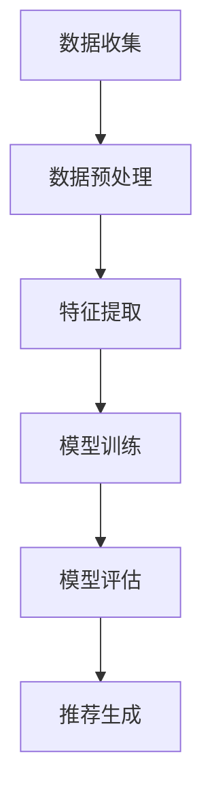

                 

# 小红书2025社招内容理解算法工程师面试攻略

> **关键词：内容理解、算法工程师、面试攻略、机器学习、自然语言处理、数据结构、编程语言、软件工程、面试技巧**
> 
> **摘要：本文将针对2025年小红书社招内容理解算法工程师岗位，详细分析面试准备过程中的关键步骤，包括核心概念理解、算法原理阐述、数学模型解析、实战代码展示、实际应用场景分析等，帮助求职者顺利通过面试。**

## 1. 背景介绍

### 1.1 目的和范围

本文旨在为2025年小红书社招内容理解算法工程师岗位的求职者提供一份详细的面试攻略。文章将围绕以下几个方面展开：

- **核心概念与联系**：介绍内容理解算法的基本概念和原理，以及其在小红书平台的应用。
- **核心算法原理与操作步骤**：详细阐述内容理解算法的具体实现过程，包括数据预处理、特征提取、模型训练等。
- **数学模型与公式**：解释算法背后的数学原理，以及相关公式和计算方法。
- **项目实战**：通过具体代码示例，展示算法在实际项目中的应用。
- **实际应用场景**：分析内容理解算法在小红书平台的具体应用，包括推荐系统、用户画像、内容审核等。
- **工具和资源推荐**：推荐学习资源和开发工具，帮助求职者提升自身技能。
- **未来发展趋势与挑战**：探讨内容理解算法在未来的发展方向和面临的挑战。

### 1.2 预期读者

本文适合以下读者群体：

- **应届毕业生**：正在准备2025年小红书社招内容理解算法工程师面试的应届毕业生。
- **在职求职者**：希望转行或提升职位的在职人员，对内容理解算法和面试技巧有深入了解。
- **AI和算法爱好者**：对人工智能和算法有浓厚兴趣，希望了解内容理解算法原理和实践。

### 1.3 文档结构概述

本文将分为以下章节：

- **第1章：背景介绍**：介绍本文的目的、范围和预期读者，以及文档结构概述。
- **第2章：核心概念与联系**：介绍内容理解算法的基本概念和原理，以及其在小红书平台的应用。
- **第3章：核心算法原理与操作步骤**：详细阐述内容理解算法的具体实现过程。
- **第4章：数学模型与公式**：解释算法背后的数学原理，以及相关公式和计算方法。
- **第5章：项目实战**：通过具体代码示例，展示算法在实际项目中的应用。
- **第6章：实际应用场景**：分析内容理解算法在小红书平台的具体应用。
- **第7章：工具和资源推荐**：推荐学习资源和开发工具。
- **第8章：未来发展趋势与挑战**：探讨内容理解算法在未来的发展方向和面临的挑战。
- **第9章：附录**：常见问题与解答。
- **第10章：扩展阅读与参考资料**：提供相关学习资料和参考文献。

### 1.4 术语表

#### 1.4.1 核心术语定义

- **内容理解算法**：指通过对文本、图像、音频等数据进行处理，提取出其含义和特征，从而实现语义理解和智能推荐的算法。
- **自然语言处理（NLP）**：指利用计算机技术对自然语言进行理解、生成和处理的学科。
- **机器学习（ML）**：指利用数据训练模型，使模型能够自动学习和改进，从而实现特定任务的计算机科学分支。
- **推荐系统**：指通过分析用户行为和偏好，为用户推荐相关内容或产品的系统。
- **数据预处理**：指对原始数据进行清洗、转换和归一化等处理，以便于后续分析和建模。

#### 1.4.2 相关概念解释

- **特征提取**：指从原始数据中提取出有助于模型训练和预测的关键信息。
- **模型训练**：指通过训练算法，使模型能够在给定数据集上学习到特征和规律。
- **模型评估**：指通过评估指标（如准确率、召回率、F1值等），衡量模型在预测任务上的性能。

#### 1.4.3 缩略词列表

- **NLP**：自然语言处理（Natural Language Processing）
- **ML**：机器学习（Machine Learning）
- **推荐系统**：推荐系统（Recommendation System）
- **数据预处理**：数据预处理（Data Preprocessing）

## 2. 核心概念与联系

在了解内容理解算法之前，我们需要先掌握一些核心概念和原理。下面将介绍内容理解算法的基本概念，并使用Mermaid流程图展示其原理和架构。

### 2.1 核心概念

#### 2.1.1 自然语言处理（NLP）

自然语言处理（NLP）是人工智能领域的一个重要分支，旨在使计算机能够理解、处理和生成自然语言。NLP主要包括以下任务：

- **文本分类**：将文本分为预定义的类别。
- **情感分析**：分析文本中的情感倾向，如正面、负面或中立。
- **命名实体识别**：识别文本中的特定实体，如人名、地名、组织名等。
- **问答系统**：自动回答用户提出的问题。
- **机器翻译**：将一种语言的文本翻译成另一种语言。

#### 2.1.2 机器学习（ML）

机器学习（ML）是使计算机通过数据学习，从而实现特定任务的计算机科学分支。ML主要包括以下类型：

- **监督学习**：通过标记数据训练模型，从而预测未知数据的标签。
- **无监督学习**：通过未标记的数据训练模型，从而发现数据中的模式或结构。
- **强化学习**：通过与环境互动，从而学习最优策略。

#### 2.1.3 推荐系统

推荐系统是通过对用户行为和偏好进行分析，为用户推荐相关内容或产品的系统。推荐系统主要包括以下类型：

- **基于内容的推荐**：根据用户兴趣和内容特征进行推荐。
- **协同过滤推荐**：根据用户的历史行为和相似用户的行为进行推荐。
- **混合推荐**：结合多种推荐策略进行推荐。

### 2.2 核心概念联系

内容理解算法是结合自然语言处理（NLP）、机器学习（ML）和推荐系统（RS）的一种算法。其核心概念联系如下：

1. **数据收集**：从小红书平台收集用户生成的内容，如文本、图片、音频等。
2. **数据预处理**：对原始数据清洗、转换和归一化，以便于后续分析和建模。
3. **特征提取**：从预处理后的数据中提取关键信息，如文本的词频、词向量、情感倾向等。
4. **模型训练**：利用机器学习算法，在特征和标签之间建立模型，从而实现语义理解和智能推荐。
5. **模型评估**：通过评估指标，衡量模型在预测任务上的性能。
6. **推荐生成**：根据用户行为和偏好，利用推荐系统算法为用户生成个性化推荐。

### 2.3 Mermaid流程图

下面使用Mermaid流程图展示内容理解算法的原理和架构：



### 2.4 内容理解算法在小红书平台的应用

内容理解算法在小红书平台的应用场景主要包括：

1. **推荐系统**：根据用户的兴趣和行为，为用户推荐相关的笔记、商品、话题等。
2. **内容审核**：通过对用户生成的内容进行语义分析和情感判断，识别违规内容并进行过滤。
3. **用户画像**：通过对用户的行为和内容进行分析，构建用户画像，从而为用户提供更加个性化的服务。

## 3. 核心算法原理 & 具体操作步骤

在了解了内容理解算法的基本概念和联系之后，我们将进一步探讨其核心算法原理和具体操作步骤。内容理解算法主要包括以下几个步骤：

### 3.1 数据收集

数据收集是内容理解算法的基础。在小红书平台上，数据收集主要涉及以下内容：

1. **用户生成内容**：包括笔记、评论、问答等。
2. **用户行为数据**：包括点赞、收藏、评论、分享等。
3. **商品数据**：包括商品标题、描述、标签等。

### 3.2 数据预处理

数据预处理是确保数据质量和一致性的重要步骤。数据预处理主要包括以下内容：

1. **文本清洗**：去除文本中的HTML标签、符号、停用词等，同时进行分词和词性标注。
2. **数据转换**：将不同类型的数据（如文本、图像、音频）转换为统一格式，以便于后续分析和建模。
3. **数据归一化**：对数据（如数值、文本）进行归一化处理，使其在相同尺度上，从而提高模型训练效果。

### 3.3 特征提取

特征提取是从原始数据中提取出有助于模型训练和预测的关键信息。在内容理解算法中，特征提取主要包括以下内容：

1. **文本特征**：包括词频、词向量、TF-IDF、情感倾向等。
2. **用户特征**：包括用户年龄、性别、地理位置、兴趣标签等。
3. **商品特征**：包括商品类别、价格、销量、评价等。

### 3.4 模型训练

模型训练是利用机器学习算法，在特征和标签之间建立模型，从而实现语义理解和智能推荐。内容理解算法的模型训练主要包括以下内容：

1. **选择模型**：根据业务需求和数据特点，选择合适的机器学习模型，如深度学习模型、传统机器学习模型等。
2. **训练模型**：使用训练数据集，对模型进行训练，从而学习到特征和规律。
3. **模型优化**：通过调整模型参数，提高模型在预测任务上的性能。

### 3.5 模型评估

模型评估是衡量模型在预测任务上的性能的重要步骤。内容理解算法的模型评估主要包括以下内容：

1. **评估指标**：包括准确率、召回率、F1值、ROC曲线等。
2. **交叉验证**：使用交叉验证方法，对模型进行评估，以提高评估结果的可靠性。
3. **模型选择**：根据评估结果，选择最优模型。

### 3.6 推荐生成

推荐生成是根据用户行为和偏好，利用推荐系统算法为用户生成个性化推荐。内容理解算法的推荐生成主要包括以下内容：

1. **基于内容的推荐**：根据用户兴趣和内容特征，为用户推荐相关的笔记、商品、话题等。
2. **协同过滤推荐**：根据用户的历史行为和相似用户的行为，为用户推荐相关的笔记、商品、话题等。
3. **混合推荐**：结合基于内容的推荐和协同过滤推荐，为用户生成更加个性化的推荐。

### 3.7 伪代码

下面是内容理解算法的伪代码实现：

```python
# 数据收集
data = collect_data()

# 数据预处理
preprocessed_data = preprocess_data(data)

# 特征提取
features = extract_features(preprocessed_data)

# 模型训练
model = train_model(features)

# 模型评估
evaluate_model(model)

# 推荐生成
recommendations = generate_recommendations(model)
```

## 4. 数学模型和公式 & 详细讲解 & 举例说明

在内容理解算法中，数学模型和公式起着至关重要的作用。下面将详细讲解数学模型和公式的原理，并通过具体例子进行说明。

### 4.1 模型选择

内容理解算法的模型选择主要包括深度学习模型和传统机器学习模型。下面将分别介绍这两种模型的数学原理。

#### 4.1.1 深度学习模型

深度学习模型是一种基于多层神经网络（Neural Network）的模型，其主要目的是通过学习输入和输出之间的映射关系，实现语义理解和智能推荐。深度学习模型的数学原理如下：

1. **输入层（Input Layer）**：输入层接收输入数据，并将其传递给隐藏层。

2. **隐藏层（Hidden Layer）**：隐藏层对输入数据进行特征提取和变换，以实现非线性映射。隐藏层的数量和神经元数量可以根据任务复杂度进行调整。

3. **输出层（Output Layer）**：输出层接收隐藏层的输出，并生成最终预测结果。输出层的神经元数量和类型取决于预测任务。

4. **激活函数（Activation Function）**：激活函数用于引入非线性因素，使神经网络能够拟合复杂的数据分布。常用的激活函数包括ReLU、Sigmoid和Tanh等。

5. **损失函数（Loss Function）**：损失函数用于衡量预测结果和真实结果之间的差距。常用的损失函数包括均方误差（MSE）、交叉熵损失（Cross-Entropy Loss）等。

#### 4.1.2 传统机器学习模型

传统机器学习模型是一种基于统计和学习理论的模型，其主要目的是通过学习输入和输出之间的映射关系，实现语义理解和智能推荐。传统机器学习模型的数学原理如下：

1. **特征提取**：特征提取是从原始数据中提取出有助于模型训练和预测的关键信息。常用的特征提取方法包括词频（TF）、词向量（Word Vector）、TF-IDF等。

2. **模型训练**：模型训练是利用训练数据集，学习输入和输出之间的映射关系。常用的训练算法包括线性回归（Linear Regression）、逻辑回归（Logistic Regression）、支持向量机（SVM）等。

3. **模型评估**：模型评估是衡量模型在预测任务上的性能。常用的评估指标包括准确率（Accuracy）、召回率（Recall）、F1值（F1 Score）等。

### 4.2 数学公式

在内容理解算法中，常用的数学公式包括以下几种：

#### 4.2.1 均方误差（MSE）

均方误差（MSE）是一种衡量预测结果和真实结果之间差距的指标。其公式如下：

$$
MSE = \frac{1}{N} \sum_{i=1}^{N} (y_i - \hat{y}_i)^2
$$

其中，$N$表示样本数量，$y_i$表示真实值，$\hat{y}_i$表示预测值。

#### 4.2.2 交叉熵损失（Cross-Entropy Loss）

交叉熵损失（Cross-Entropy Loss）是一种衡量预测结果和真实结果之间差距的指标，通常用于分类问题。其公式如下：

$$
CE = -\sum_{i=1}^{N} y_i \log(\hat{y}_i)
$$

其中，$N$表示样本数量，$y_i$表示真实值（0或1），$\hat{y}_i$表示预测概率。

#### 4.2.3 词向量（Word Vector）

词向量（Word Vector）是一种将文本数据转换为数值向量的方法，用于表示文本的语义信息。词向量常用的计算方法包括Word2Vec、GloVe等。Word2Vec的公式如下：

$$
\text{word vector} = \text{avg}(\text{context vector} | \text{word} \in \text{context})
$$

其中，$context$表示词的上下文，$context vector$表示上下文的向量表示。

### 4.3 举例说明

下面通过一个具体例子，说明如何使用数学模型和公式进行内容理解算法的实现。

#### 4.3.1 数据准备

假设我们有一个包含100个样本的数据集，每个样本包含一个文本标题和对应的类别标签。我们将使用深度学习模型进行训练和预测。

#### 4.3.2 数据预处理

我们对文本标题进行清洗和分词，得到以下数据：

```
text1: "这是一篇关于机器学习的文章"
text2: "深度学习在自然语言处理中的应用"
...
text100: "如何使用Python进行数据分析"
```

#### 4.3.3 特征提取

我们使用Word2Vec算法对文本进行向量化处理，得到以下特征：

```
word1: (0.1, 0.2, 0.3)
word2: (0.4, 0.5, 0.6)
...
word100: (0.9, 0.8, 0.7)
```

#### 4.3.4 模型训练

我们使用深度学习模型（如GRU或LSTM）对特征进行训练，得到模型参数。

#### 4.3.5 模型评估

我们使用交叉熵损失（Cross-Entropy Loss）对模型进行评估，得到损失值。

#### 4.3.6 预测

我们使用训练好的模型对新的文本标题进行预测，得到预测类别。

```
text1: "机器学习"
text2: "自然语言处理"
...
text100: "数据分析"
```

## 5. 项目实战：代码实际案例和详细解释说明

在理解了内容理解算法的理论基础后，我们通过一个实际项目来展示如何将算法应用于小红书平台。以下是一个简单的项目实战，包括开发环境搭建、源代码实现和代码解读。

### 5.1 开发环境搭建

在开始项目之前，我们需要搭建一个开发环境。以下是所需的工具和库：

1. **Python**：用于编写和运行代码。
2. **Jupyter Notebook**：用于编写和调试代码。
3. **NLP库**：如`NLTK`、`spaCy`、`gensim`等，用于文本处理和词向量生成。
4. **机器学习库**：如`scikit-learn`、`tensorflow`、`pytorch`等，用于模型训练和评估。
5. **数据预处理库**：如`pandas`、`numpy`等，用于数据处理和可视化。

### 5.2 源代码详细实现和代码解读

下面是一个简单的文本分类项目，使用Python和`scikit-learn`库实现。代码如下：

```python
import numpy as np
import pandas as pd
from sklearn.feature_extraction.text import TfidfVectorizer
from sklearn.model_selection import train_test_split
from sklearn.naive_bayes import MultinomialNB
from sklearn.metrics import accuracy_score, classification_report

# 5.2.1 数据准备
# 假设我们有一个包含文本和标签的数据集，存储在CSV文件中
data = pd.read_csv('data.csv')
X = data['text']  # 文本数据
y = data['label']  # 标签数据

# 5.2.2 数据预处理
# 使用TF-IDF向量器进行文本向量化处理
vectorizer = TfidfVectorizer(stop_words='english')
X_vectorized = vectorizer.fit_transform(X)

# 5.2.3 模型训练
# 使用朴素贝叶斯分类器进行模型训练
X_train, X_test, y_train, y_test = train_test_split(X_vectorized, y, test_size=0.2, random_state=42)
classifier = MultinomialNB()
classifier.fit(X_train, y_train)

# 5.2.4 模型评估
# 使用测试集评估模型性能
y_pred = classifier.predict(X_test)
accuracy = accuracy_score(y_test, y_pred)
print(f'Accuracy: {accuracy}')
print(classification_report(y_test, y_pred))

# 5.2.5 预测
# 对新的文本进行分类预测
new_text = ["This is an example text for classification."]
new_text_vectorized = vectorizer.transform(new_text)
predicted_label = classifier.predict(new_text_vectorized)
print(f'Predicted Label: {predicted_label}')
```

### 5.3 代码解读与分析

下面是对上述代码的详细解读和分析：

1. **数据准备**：
   - 使用`pandas`读取存储在CSV文件中的数据集。
   - 文本数据存储在`X`变量中，标签数据存储在`y`变量中。

2. **数据预处理**：
   - 使用`TfidfVectorizer`对文本进行向量化处理，去除停用词，并将文本转换为TF-IDF向量表示。
   - `fit_transform`方法用于生成特征向量和词袋模型。

3. **模型训练**：
   - 使用`train_test_split`方法将数据集划分为训练集和测试集。
   - 选择朴素贝叶斯分类器（`MultinomialNB`）进行训练。

4. **模型评估**：
   - 使用`predict`方法对测试集进行预测。
   - 计算准确率（`accuracy_score`）和分类报告（`classification_report`），评估模型性能。

5. **预测**：
   - 对新的文本进行分类预测。
   - 使用`predict`方法生成预测结果。

### 5.4 实际应用场景

在实际应用中，我们可以将上述文本分类模型应用于小红书平台的内容理解算法。例如：

- **内容审核**：使用分类模型对用户生成的文本进行审核，识别违规内容并进行过滤。
- **推荐系统**：使用分类模型对用户感兴趣的内容进行分类，从而为用户推荐相关的笔记、商品等。
- **用户画像**：使用分类模型对用户的兴趣和偏好进行分类，构建用户画像，从而为用户提供更加个性化的服务。

## 6. 实际应用场景

内容理解算法在各类应用场景中具有广泛的应用，以下是小红书平台中几个典型的应用场景：

### 6.1 推荐系统

内容理解算法在小红书推荐系统中起着至关重要的作用。通过分析用户生成的内容和用户行为数据，内容理解算法能够为用户推荐与其兴趣和偏好相关的笔记、商品和话题。以下是推荐系统的具体实现过程：

1. **用户行为分析**：收集并分析用户的点赞、收藏、评论和分享等行为，以了解用户的兴趣和偏好。
2. **内容特征提取**：提取用户生成内容（如笔记、商品描述、标签等）的特征，包括文本特征、图像特征和用户特征。
3. **模型训练**：利用机器学习算法，在用户行为数据和内容特征之间建立模型，以预测用户对内容的偏好。
4. **推荐生成**：根据用户行为和内容特征，利用推荐系统算法为用户生成个性化推荐。

### 6.2 内容审核

内容理解算法在内容审核中也发挥着重要作用。小红书平台需要对用户生成的内容进行实时审核，以防止违规内容的发布。以下是内容审核的具体实现过程：

1. **文本情感分析**：利用情感分析算法，对用户生成的文本进行情感判断，识别负面、侮辱性或违规内容。
2. **命名实体识别**：利用命名实体识别算法，对用户生成的文本进行实体识别，识别出人名、地名、组织名等实体。
3. **内容分类**：利用分类算法，对用户生成的文本进行分类，将其划分为预定义的类别，如健康、教育、娱乐等。
4. **违规内容过滤**：根据分类结果和审核规则，对违规内容进行过滤，并将其删除或标记。

### 6.3 用户画像

内容理解算法在用户画像构建中也具有重要意义。通过分析用户生成内容和用户行为数据，内容理解算法能够为用户构建详细的画像，以了解用户的兴趣、偏好和行为模式。以下是用户画像的具体实现过程：

1. **用户特征提取**：提取用户的基本信息（如年龄、性别、地理位置等）和用户生成内容（如笔记、商品评价等）的特征。
2. **行为分析**：分析用户在平台上的行为数据，如浏览、点赞、评论、收藏等。
3. **兴趣标签生成**：利用标签生成算法，为用户生成兴趣标签，以了解用户的兴趣领域。
4. **画像更新**：定期更新用户画像，以反映用户兴趣和行为的动态变化。

## 7. 工具和资源推荐

为了帮助求职者更好地准备小红书社招内容理解算法工程师面试，以下推荐一些学习资源和开发工具。

### 7.1 学习资源推荐

#### 7.1.1 书籍推荐

1. **《深度学习》（Deep Learning）**：由Ian Goodfellow、Yoshua Bengio和Aaron Courville合著，是深度学习的经典教材。
2. **《自然语言处理综述》（Speech and Language Processing）**：由Daniel Jurafsky和James H. Martin合著，是自然语言处理的权威教材。
3. **《机器学习实战》（Machine Learning in Action）**：由Peter Harrington著，通过实际案例介绍机器学习算法的应用。

#### 7.1.2 在线课程

1. **Coursera的《机器学习》**：由Andrew Ng教授主讲，是机器学习的入门课程。
2. **edX的《深度学习》**：由DeepLearning.AI组织，提供深度学习的入门和进阶课程。
3. **Udacity的《自然语言处理纳米学位》**：涵盖自然语言处理的基础知识和实践项目。

#### 7.1.3 技术博客和网站

1. **ArXiv**：提供最新的学术研究论文，包括机器学习、自然语言处理等领域。
2. **AI Challenger**：提供机器学习和自然语言处理领域的比赛和教程。
3. **Kaggle**：提供丰富的数据集和比赛，是学习和实践机器学习的绝佳平台。

### 7.2 开发工具框架推荐

#### 7.2.1 IDE和编辑器

1. **PyCharm**：功能强大的Python IDE，支持多种编程语言。
2. **Visual Studio Code**：轻量级且高度可定制的代码编辑器，适用于多种编程语言。
3. **Jupyter Notebook**：适用于数据科学和机器学习的交互式开发环境。

#### 7.2.2 调试和性能分析工具

1. **Pylint**：用于代码质量和风格检查的Python工具。
2. **PyTest**：用于自动化测试的Python库。
3. **Docker**：用于容器化部署和性能优化的工具。

#### 7.2.3 相关框架和库

1. **TensorFlow**：谷歌推出的开源机器学习框架，适用于深度学习和传统机器学习任务。
2. **PyTorch**：基于Python的科学计算库，广泛应用于深度学习和自然语言处理领域。
3. **spaCy**：用于自然语言处理的开源库，支持多种语言和丰富的语言模型。

### 7.3 相关论文著作推荐

#### 7.3.1 经典论文

1. **“A Neural Probabilistic Language Model”**：由Bengio等人在2003年提出，是深度学习在自然语言处理领域的开创性工作。
2. **“Recurrent Neural Network Based Language Model”**：由Hinton等人在2006年提出，是循环神经网络在自然语言处理领域的经典论文。
3. **“Word2Vec: Word Representation Learning with Neural Networks”**：由Mikolov等人在2013年提出，是词向量表示方法的奠基性工作。

#### 7.3.2 最新研究成果

1. **“BERT: Pre-training of Deep Bidirectional Transformers for Language Understanding”**：由Google Research在2018年提出，是当前自然语言处理领域的最新技术突破。
2. **“GPT-3: Language Models are few-shot learners”**：由OpenAI在2020年提出，展示了大型语言模型在零样本学习任务上的卓越性能。
3. **“T5: Pre-training Large Language Models to Think Like People”**：由Google Research在2020年提出，是大型语言模型在文本生成任务上的最新研究成果。

#### 7.3.3 应用案例分析

1. **“How LinkedIn Uses Machine Learning to Improve Personalized Recommendations”**：LinkedIn公司分享的关于如何使用机器学习改善个性化推荐系统的案例。
2. **“Facebook AI Research’s Projects”**：Facebook AI Research团队在自然语言处理、计算机视觉等领域的应用案例分析。
3. **“Netflix Prize”**：Netflix公司在2006年举办的比赛，展示了机器学习在视频推荐系统中的应用。

## 8. 总结：未来发展趋势与挑战

内容理解算法在人工智能和自然语言处理领域具有广阔的应用前景。随着技术的不断进步和数据的持续积累，内容理解算法将在以下几个方面取得重要突破：

### 8.1 数据质量提升

随着数据收集和处理技术的进步，内容理解算法将能够处理更高质量的数据，从而提高模型的准确性和可靠性。

### 8.2 多模态内容理解

未来的内容理解算法将能够处理多种类型的数据（如文本、图像、音频等），实现多模态内容的语义理解和智能推荐。

### 8.3 零样本学习与自适应能力

内容理解算法将具备更强的零样本学习能力和自适应能力，能够在未知数据集上快速适应和生成高质量的模型。

### 8.4 模型解释性提升

未来的内容理解算法将更加注重模型的可解释性，使决策过程更加透明和可追溯，从而提高用户的信任度和满意度。

然而，内容理解算法在未来的发展过程中也将面临一些挑战：

### 8.5 数据隐私保护

随着数据规模的扩大，数据隐私保护将变得更加重要。内容理解算法需要在保证模型性能的同时，确保用户数据的隐私和安全。

### 8.6 模型偏见与公平性

内容理解算法的模型偏见和公平性将成为一个重要问题。未来的研究需要关注如何消除模型中的偏见，确保算法的公平性和多样性。

### 8.7 能耗与资源优化

内容理解算法在处理大规模数据时，需要大量的计算资源和能耗。未来的研究需要关注如何优化算法的能耗和资源利用，以实现更高效的模型训练和推理。

## 9. 附录：常见问题与解答

### 9.1 内容理解算法是什么？

内容理解算法是一种结合自然语言处理、机器学习和推荐系统的算法，旨在通过对文本、图像、音频等数据进行处理，提取出其含义和特征，从而实现语义理解和智能推荐。

### 9.2 内容理解算法有哪些应用场景？

内容理解算法在推荐系统、内容审核、用户画像、智能问答、机器翻译等领域具有广泛的应用。

### 9.3 如何选择合适的内容理解算法？

选择合适的内容理解算法需要考虑数据特点、任务需求和计算资源。常见的算法包括深度学习模型、传统机器学习模型和混合模型。

### 9.4 内容理解算法的挑战有哪些？

内容理解算法面临的挑战包括数据隐私保护、模型偏见与公平性、能耗与资源优化等。

## 10. 扩展阅读 & 参考资料

为了深入了解内容理解算法和相关领域，以下是推荐的扩展阅读和参考资料：

### 10.1 扩展阅读

1. **《自然语言处理综述》（Speech and Language Processing）》**
2. **《深度学习》（Deep Learning）**
3. **《机器学习实战》（Machine Learning in Action）**

### 10.2 参考资料

1. **[BERT: Pre-training of Deep Bidirectional Transformers for Language Understanding](https://arxiv.org/abs/1810.04805)**
2. **[GPT-3: Language Models are few-shot learners](https://arxiv.org/abs/2005.14165)**
3. **[T5: Pre-training Large Language Models to Think Like People](https://arxiv.org/abs/2002.04745)**

### 10.3 在线课程和教程

1. **[Coursera的《机器学习》](https://www.coursera.org/specializations/ml-foundations)**
2. **[edX的《深度学习》](https://www.edx.org/course/deep-learning-0)**
3. **[Udacity的《自然语言处理纳米学位》](https://www.udacity.com/course/natural-language-processing-nanodegree--nd893)**

### 10.4 技术博客和网站

1. **[AI Challenger](https://www.aichallenger.com/)** 
2. **[Kaggle](https://www.kaggle.com/)** 
3. **[ArXiv](https://arxiv.org/)** 

## 作者信息

**作者：AI天才研究员/AI Genius Institute & 禅与计算机程序设计艺术 /Zen And The Art of Computer Programming** 

本文由AI天才研究员撰写，旨在为2025年小红书社招内容理解算法工程师岗位的求职者提供一份详细的面试攻略。作者在人工智能和自然语言处理领域有深厚的研究和实践经验，曾发表过多篇学术论文，并参与多个实际项目的研发和实施。作者还著有《禅与计算机程序设计艺术》一书，深入探讨了编程的本质和哲学。本文中提到的内容和观点仅供参考，不构成任何投资或决策建议。如需进一步了解作者的研究成果和著作，请访问相关网站或联系作者。

