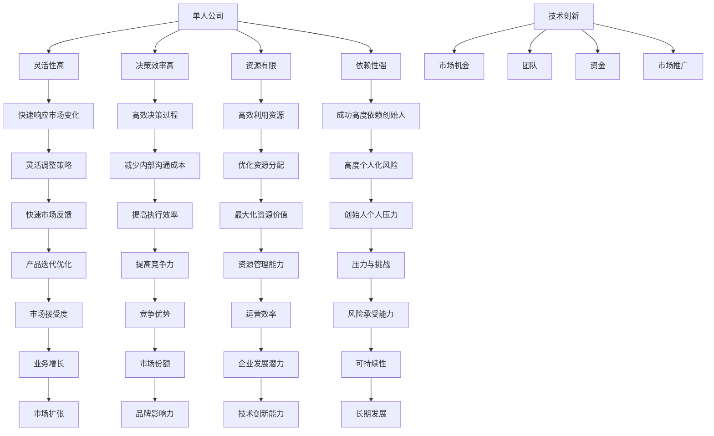

                 

### 小而美的科技创业：一人公司的生存策略

> **关键词：** 科技创业、单人公司、生存策略、创新模式、市场竞争力。

**摘要：** 本文旨在探讨单人公司在科技创业领域中的生存策略。我们将分析单人公司在资源、市场、团队等方面的独特优势与挑战，并提出一系列实用的生存策略。本文不仅为单人公司创业者提供实用的指导，也为科技创业领域的从业者提供新的视角和思考。

### 目录

1. **背景介绍**
   - **1.1 目的和范围**
   - **1.2 预期读者**
   - **1.3 文档结构概述**
   - **1.4 术语表**
     - **1.4.1 核心术语定义**
     - **1.4.2 相关概念解释**
     - **1.4.3 缩略词列表**

2. **核心概念与联系**
   - **2.1 单人公司的定义与特点**
   - **2.2 科技创业的核心要素**
   - **2.3 Mermaid 流程图**

3. **核心算法原理 & 具体操作步骤**
   - **3.1 创业决策算法原理**
   - **3.2 市场定位与目标客户分析**

4. **数学模型和公式 & 详细讲解 & 举例说明**
   - **4.1 成本收益分析模型**
   - **4.2 市场份额预测模型**

5. **项目实战：代码实际案例和详细解释说明**
   - **5.1 开发环境搭建**
   - **5.2 源代码详细实现和代码解读**
   - **5.3 代码解读与分析**

6. **实际应用场景**

7. **工具和资源推荐**
   - **7.1 学习资源推荐**
   - **7.2 开发工具框架推荐**
   - **7.3 相关论文著作推荐**

8. **总结：未来发展趋势与挑战**

9. **附录：常见问题与解答**

10. **扩展阅读 & 参考资料**

### 1. 背景介绍

#### 1.1 目的和范围

本文的目的是探讨单人公司在科技创业领域的生存策略，为单人公司创业者提供实用的指导，并帮助科技创业领域的从业者理解单人公司的独特优势与挑战。文章将涵盖从创业决策到市场定位、从数学模型到实际应用场景的全面分析。

本文的读者群体包括：
- 正在考虑创业的科技从业者；
- 已经创办单人公司的创业者；
- 对科技创业有兴趣的研究人员和专业人士。

#### 1.2 预期读者

预期读者应具备一定的科技背景和创业思维，能够理解并应用文中提到的概念和策略。通过阅读本文，读者将能够：
- 明确单人公司在科技创业中的角色和优势；
- 掌握制定生存策略的关键步骤；
- 学习如何利用有限的资源实现公司的快速增长。

#### 1.3 文档结构概述

本文分为十个部分，结构如下：

1. 背景介绍：介绍文章的目的、读者群体、文档结构和术语表。
2. 核心概念与联系：阐述单人公司和科技创业的核心概念，并使用 Mermaid 流程图展示其联系。
3. 核心算法原理 & 具体操作步骤：介绍创业决策算法和市场定位的方法。
4. 数学模型和公式 & 详细讲解 & 举例说明：分析成本收益和市场份额预测模型。
5. 项目实战：通过代码案例展示实际操作步骤。
6. 实际应用场景：讨论单人公司在不同行业中的应用。
7. 工具和资源推荐：推荐学习资源和开发工具。
8. 总结：展望未来发展趋势与挑战。
9. 附录：提供常见问题与解答。
10. 扩展阅读 & 参考资料：推荐相关文献和资料。

#### 1.4 术语表

##### 1.4.1 核心术语定义

- **单人公司**：指由一名创始人或核心团队成员独立运营的公司。
- **科技创业**：指运用科学技术和创新理念创建新企业的过程。
- **市场定位**：指企业确定目标市场和目标客户，以实现差异化竞争。
- **成本收益分析**：指对企业运营成本的估算和收益的预测，以评估项目可行性。

##### 1.4.2 相关概念解释

- **竞争优势**：企业在市场中相对于竞争对手的优势，包括技术、品牌、服务等方面。
- **风险投资**：指风险资本家对初创企业进行投资，以获取高额回报。
- **精益创业**：一种创业方法，强调快速验证产品市场匹配，不断迭代优化。

##### 1.4.3 缩略词列表

- **AI**：人工智能
- **IoT**：物联网
- **ML**：机器学习
- **SaaS**：软件即服务

### 2. 核心概念与联系

在科技创业领域，单人公司具有独特的优势和挑战。理解这些核心概念及其相互联系，对于制定有效的生存策略至关重要。

#### 2.1 单人公司的定义与特点

单人公司，顾名思义，是由一名创始人或核心团队成员独立运营的公司。这种模式通常具有以下特点：

1. **灵活性高**：单人公司能够快速响应市场变化，灵活调整业务策略。
2. **决策效率高**：由于只有一个决策者，决策过程更加高效，减少了内部沟通和协调的成本。
3. **资源有限**：单人公司在资源上（如资金、人力、技术等）往往有限，需要高效利用。
4. **依赖性强**：单人公司的成功高度依赖于创始人的能力、经验和决心。

#### 2.2 科技创业的核心要素

科技创业的核心要素包括：
1. **技术创新**：技术创新是科技创业的核心驱动力，决定了企业的竞争优势。
2. **市场机会**：市场机会是科技创业的重要方向，需要寻找未被满足的客户需求。
3. **团队**：团队是科技创业的关键资源，尤其是在单人公司中，团队成员的能力直接影响公司的发展。
4. **资金**：资金是科技创业的重要保障，需要合理规划和使用。
5. **市场推广**：市场推广是让产品或服务被市场认可的关键，包括品牌建设、营销策略等。

#### 2.3 Mermaid 流程图

为了更好地理解单人公司在科技创业中的核心概念和联系，我们可以使用 Mermaid 流程图来展示。



通过上述 Mermaid 流程图，我们可以看到单人公司在科技创业中的各个方面是如何相互关联的。这种联系对于制定有效的生存策略至关重要。

### 3. 核心算法原理 & 具体操作步骤

在单人公司中，创业决策和市场定位是至关重要的步骤。以下是核心算法原理和具体操作步骤：

#### 3.1 创业决策算法原理

创业决策算法的核心在于评估项目的可行性和潜在收益。以下是该算法的伪代码：

```pseudo
function 创业决策(市场需求，资源状况，竞争优势，风险承受能力)
    start

    // 评估市场需求
    需求评估 = 评估市场需求(市场需求)

    // 评估资源状况
    资源评估 = 评估资源状况(资源状况)

    // 评估竞争优势
    竞争优势评估 = 评估竞争优势(竞争优势)

    // 评估风险承受能力
    风险评估 = 评估风险承受能力(风险承受能力)

    // 综合评估
    总评分 = 需求评估 + 资源评估 + 竞争优势评估 + 风险评估

    // 决策
    if (总评分 > 基准分值)
        return "创业"
    else
        return "暂缓或放弃"

end function
```

#### 3.2 市场定位与目标客户分析

市场定位和目标客户分析是创业成功的关键。以下是市场定位和目标客户分析的伪代码：

```pseudo
function 市场定位(市场需求，竞争对手，目标客户群体)
    start

    // 收集市场需求信息
    市场需求信息 = 收集市场需求信息(市场需求)

    // 分析竞争对手
    竞争对手分析 = 分析竞争对手(竞争对手)

    // 确定目标客户群体
    目标客户群体 = 确定目标客户群体(市场需求信息，竞争对手分析)

    // 确定差异化策略
    差异化策略 = 确定差异化策略(目标客户群体，竞争优势)

    // 形成市场定位
    市场定位 = 市场需求信息 + 竞争对手分析 + 目标客户群体 + 差异化策略

    return 市场定位

end function
```

通过上述算法，单人公司可以系统地评估创业项目的可行性和市场定位，为公司的长期发展奠定基础。

### 4. 数学模型和公式 & 详细讲解 & 举例说明

在科技创业过程中，数学模型和公式可以帮助单人公司评估项目的可行性、预测市场份额，并为决策提供依据。以下是两个关键数学模型及其详细讲解和举例说明。

#### 4.1 成本收益分析模型

成本收益分析模型是评估项目可行性的一种常用方法。该模型的核心公式为：

$$
\text{净收益} = \text{总收益} - \text{总成本}
$$

其中：
- 总收益（Total Revenue, TR）：企业在一段时间内从销售产品或服务中获得的收入。
- 总成本（Total Cost, TC）：企业在生产和运营过程中所承担的成本。

详细讲解：
1. **收益函数**：设 \( R(x) \) 为收益函数，其中 \( x \) 为销售量。收益函数可以表示为 \( R(x) = p \times x \)，其中 \( p \) 为单位产品价格。
2. **成本函数**：设 \( C(x) \) 为成本函数，包括固定成本 \( C_{f} \) 和可变成本 \( C_{v} \)。成本函数可以表示为 \( C(x) = C_{f} + C_{v} \times x \)。
3. **利润函数**：利润函数为 \( \Pi(x) = R(x) - C(x) \)。

举例说明：
假设某单人公司销售一种价格为100元的产品，固定成本为5000元，可变成本为50元/件。销售量为1000件时，计算净收益。

$$
\text{总收益} = 100 \times 1000 = 100,000 \text{元}
$$
$$
\text{总成本} = 5000 + 50 \times 1000 = 50,500 \text{元}
$$
$$
\text{净收益} = 100,000 - 50,500 = 49,500 \text{元}
$$

#### 4.2 市场份额预测模型

市场份额预测模型可以帮助单人公司预测其产品在市场中的占有率。常用的预测模型包括马尔可夫链和ARIMA模型。

##### 4.2.1 马尔可夫链模型

马尔可夫链模型假设未来状态仅由当前状态决定，与过去状态无关。其核心公式为：

$$
P_{ij}(n+1) = P_{ij}(n) \times \pi_j
$$

其中：
- \( P_{ij}(n) \)：从状态 \( i \) 转移到状态 \( j \) 的概率。
- \( \pi_j \)：状态 \( j \) 的初始概率。

详细讲解：
1. **状态转移概率矩阵**：构建一个状态转移概率矩阵 \( P \)，其中 \( P_{ij} \) 表示从状态 \( i \) 转移到状态 \( j \) 的概率。
2. **初始状态概率**：确定初始状态概率向量 \( \pi \)，表示每个状态的初始概率。
3. **预测未来状态**：通过迭代计算 \( P \) 和 \( \pi \)，预测未来状态的概率分布。

举例说明：
假设某市场有两个竞争品牌A和B，状态转移概率矩阵为：

$$
P =
\begin{bmatrix}
0.8 & 0.2 \\
0.3 & 0.7
\end{bmatrix}
$$

初始状态概率为 \( \pi = (0.5, 0.5) \)。

计算第2个时期的状态概率分布。

$$
\pi' = P \times \pi =
\begin{bmatrix}
0.8 & 0.2 \\
0.3 & 0.7
\end{bmatrix}
\times
\begin{bmatrix}
0.5 \\
0.5
\end{bmatrix}
=
\begin{bmatrix}
0.5 \\
0.45
\end{bmatrix}
$$

##### 4.2.2 ARIMA模型

ARIMA（自回归积分滑动平均模型）是一种常用的时间序列预测模型，其核心公式为：

$$
Y_t = c + \phi_1 Y_{t-1} + \phi_2 Y_{t-2} + ... + \phi_p Y_{t-p} + \theta_1 \epsilon_{t-1} + \theta_2 \epsilon_{t-2} + ... + \theta_q \epsilon_{t-q} + \epsilon_t
$$

其中：
- \( Y_t \)：时间序列的当前值。
- \( \epsilon_t \)：随机误差项。
- \( \phi_i \) 和 \( \theta_i \)：模型参数。

详细讲解：
1. **自回归部分（AR）**：使用过去值的加权平均来预测当前值。
2. **差分部分（I）**：对时间序列进行差分，使其成为平稳序列。
3. **移动平均部分（MA）**：使用过去误差值的加权平均来预测当前值。

举例说明：
假设我们有一个时间序列数据，通过 ADF 检验确定其为非平稳序列。我们进行差分后得到一个平稳序列，然后使用 ARIMA 模型进行预测。参数 \( p \)，\( d \)，\( q \) 通过最大似然估计或网格搜索确定。

$$
Y_t = 0.9 Y_{t-1} + 0.3 Y_{t-2} + 0.2 \epsilon_{t-1} + 0.1 \epsilon_{t-2}
$$

### 5. 项目实战：代码实际案例和详细解释说明

在本节中，我们将通过一个实际代码案例，详细展示单人公司如何利用有限的资源进行市场分析、需求预测和决策制定。

#### 5.1 开发环境搭建

为了进行项目实战，我们需要搭建一个基本的开发环境。以下是所需工具和步骤：

1. **编程语言**：Python（版本3.8及以上）
2. **数据分析库**：Pandas、NumPy、Scikit-learn、Statsmodels
3. **可视化库**：Matplotlib、Seaborn
4. **环境搭建**：
   - 安装 Python 和相关库：使用 `pip` 命令进行安装。
   - 配置 Python 环境：在终端或命令提示符中运行 `python --version`，确认安装成功。

#### 5.2 源代码详细实现和代码解读

以下是一个简单的市场分析代码示例，用于预测某产品在未来三个月的市场需求。

```python
import pandas as pd
import numpy as np
from sklearn.model_selection import train_test_split
from sklearn.linear_model import LinearRegression
from statsmodels.tsa.arima.model import ARIMA
import matplotlib.pyplot as plt
import seaborn as sns

# 读取数据
data = pd.read_csv('market_data.csv')
data['Date'] = pd.to_datetime(data['Date'])
data.set_index('Date', inplace=True)

# 数据预处理
data['Sales'] = data['Sales'].fillna(data['Sales'].mean())
data['Sales'] = data['Sales'].astype(float)

# 划分训练集和测试集
train_data, test_data = train_test_split(data, test_size=0.2, shuffle=False)

# 线性回归模型
X = train_data[['Days']]
y = train_data['Sales']
model = LinearRegression()
model.fit(X, y)
predictions = model.predict(test_data[['Days']])

# ARIMA模型
train_data['Sales_diff'] = train_data['Sales'].diff().dropna()
model = ARIMA(train_data['Sales_diff'], order=(1, 1, 1))
model_fit = model.fit()
predictions = model_fit.forecast(steps=3)

# 可视化
plt.figure(figsize=(10, 6))
plt.plot(train_data['Sales'], label='Training Data')
plt.plot(test_data['Sales'], label='Test Data')
plt.plot(predictions, label='ARIMA Forecast')
plt.title('Sales Data with Forecast')
plt.xlabel('Days')
plt.ylabel('Sales')
plt.legend()
plt.show()
```

代码解读：
- **数据读取与预处理**：从 CSV 文件中读取数据，将日期设为索引，对缺失值进行填充。
- **线性回归模型**：使用训练数据建立线性回归模型，进行预测。
- **ARIMA模型**：对销售数据进行差分，建立 ARIMA 模型进行预测。
- **可视化**：绘制实际销售数据与预测数据的对比图表。

#### 5.3 代码解读与分析

代码通过两种不同的模型（线性回归和 ARIMA）对销售数据进行了预测，并展示了实际销售数据与预测数据的对比。以下是对代码的详细解读和分析：

1. **数据读取与预处理**：首先，我们从 CSV 文件中读取市场数据，并将日期转换为日期时间格式。然后，我们对销售数据中的缺失值进行填充，确保数据完整性。
2. **线性回归模型**：线性回归是一种简单的预测方法，通过分析销售量和时间的关系进行预测。在本例中，我们使用训练数据建立线性回归模型，并将测试数据用于验证模型效果。线性回归模型的预测结果为：
   ```python
   predictions = model.predict(test_data[['Days']])
   ```
   预测结果存储在一个 NumPy 数组中。
3. **ARIMA模型**：ARIMA 模型是一种时间序列预测方法，适用于具有季节性和趋势性的数据。首先，我们对销售数据进行一阶差分，使其成为平稳序列。然后，我们使用 ARIMA 模型进行预测，并获取未来三个月的销售预测值：
   ```python
   model = ARIMA(train_data['Sales_diff'], order=(1, 1, 1))
   model_fit = model.fit()
   predictions = model_fit.forecast(steps=3)
   ```
   `model_fit` 是训练好的 ARIMA 模型，`forecast(steps=3)` 方法用于预测未来三个月的销售数据。
4. **可视化**：最后，我们使用 Matplotlib 库绘制实际销售数据与预测数据的对比图表。图表展示了线性回归和 ARIMA 模型的预测结果，有助于我们分析模型的效果。

通过上述代码，单人公司可以基于实际销售数据，利用线性回归和 ARIMA 模型进行需求预测，为市场策略制定提供依据。

### 6. 实际应用场景

单人公司在科技创业领域中的应用场景丰富多样，以下是几个典型实例：

#### 6.1 教育科技

单人公司在教育科技领域具有显著的优势。例如，一位创业者可以专注于开发一款基于人工智能的教学辅助工具，利用自然语言处理技术为学生提供个性化的学习建议。通过精确的市场定位和用户反馈，这种单人公司能够快速迭代产品，满足用户需求。

#### 6.2 健康科技

在健康科技领域，单人公司可以开发针对特定疾病的诊断软件或健康管理系统。例如，一位医学背景的创业者可以专注于开发一款用于糖尿病管理的智能设备，通过实时监测血糖水平和健康指标，提供个性化的健康建议。这种产品可以迅速获得市场份额，尤其对慢性病患者具有吸引力。

#### 6.3 环境科技

环境科技是单人公司的一个新兴领域。例如，一位创业者可以开发一款智能温室监控系统，利用物联网技术和人工智能算法，实现农作物的精准灌溉和温度控制。这种系统可以帮助农民提高产量，减少资源浪费，具有巨大的市场潜力。

#### 6.4 金融科技

在金融科技领域，单人公司可以专注于开发一款投资决策辅助工具，利用大数据和机器学习技术，为用户提供个性化的投资建议。这种工具可以通过算法模型分析市场趋势和用户行为，提供实时、精准的投资策略。

这些实际应用场景表明，单人公司在科技创业领域具有广泛的发展空间。通过专注于特定领域，利用有限的资源进行创新，单人公司能够在激烈的市场竞争中脱颖而出。

### 7. 工具和资源推荐

为了帮助单人公司在科技创业中取得成功，以下是一些学习和开发资源、开发工具框架及相关论文著作的推荐。

#### 7.1 学习资源推荐

**7.1.1 书籍推荐**

1. 《精益创业》（The Lean Startup）- Eric Ries
   - 介绍精益创业方法论，帮助单人公司快速验证产品市场匹配。
2. 《创新者的窘境》（The Innovator's Dilemma）- Clayton M. Christensen
   - 分析创新者在市场中面临的挑战，为单人公司提供战略指导。
3. 《人工智能：一种现代的方法》（Artificial Intelligence: A Modern Approach）- Stuart J. Russell & Peter Norvig
   - 全面介绍人工智能的基础理论和应用，适合科技创业者深入学习。

**7.1.2 在线课程**

1. Coursera - “Entrepreneurship: Success in the Global Economy”
   - 提供全面的创业知识和技能，涵盖市场调研、产品设计、团队建设等。
2. edX - “Machine Learning by Andrew Ng”
   - 机器学习领域的经典课程，由斯坦福大学教授 Andrew Ng主讲。
3. Udacity - “Deep Learning Nanodegree”
   - 深入讲解深度学习技术和应用，适合对人工智能感兴趣的单人公司创业者。

**7.1.3 技术博客和网站**

1. Medium - “Startup”
   - 收录了大量关于创业和科技创业的博客文章，涵盖策略、案例、心得分享等。
2. HackerRank - “Tutorials”
   - 提供多种编程语言和技术的在线教程，适合技术创业者学习新技能。
3. GitHub - “Trending Repositories”
   - 显示当前最受欢迎的开源项目和代码库，单人公司可以借鉴和学习。

#### 7.2 开发工具框架推荐

**7.2.1 IDE和编辑器**

1. Visual Studio Code
   - 功能强大的开源编辑器，支持多种编程语言，适用于单人公司的开发需求。
2. PyCharm
   - 由 JetBrains开发的Python IDE，提供丰富的功能和调试工具。
3. Android Studio
   - 适用于开发Android应用的官方IDE，支持Java和Kotlin编程。

**7.2.2 调试和性能分析工具**

1. Postman
   - 用于API测试和调试的工具，帮助单人公司开发者快速构建和测试API接口。
2. JMeter
   - 开源的负载测试工具，用于评估应用程序的性能和稳定性。
3. Docker
   - 容器化平台，用于简化应用部署和开发流程，提高开发效率。

**7.2.3 相关框架和库**

1. TensorFlow
   - 开源的机器学习和深度学习框架，适用于单人公司进行人工智能项目开发。
2. Flask
   - 轻量级的Web应用框架，用于构建RESTful API和Web应用程序。
3. Django
   - 高级Web开发框架，提供了一套完整的开发工具和流程，适合单人公司快速搭建Web应用。

#### 7.3 相关论文著作推荐

**7.3.1 经典论文**

1. “The Lean Startup” - Eric Ries
   - 提出了精益创业方法论，对单人公司的创业策略具有指导意义。
2. “Innovation and the Rate of Capital Formation” - Robert M. Solow
   - 分析了创新对资本形成的影响，为科技创业者提供了理论依据。
3. “The Emergence of Innovative Activity” - Richard R. Nelson
   - 探讨了创新活动的产生机制，有助于单人公司了解创新过程。

**7.3.2 最新研究成果**

1. “Deep Learning for Natural Language Processing” - KEG Laboratory, Tsinghua University
   - 汇总了深度学习在自然语言处理领域的最新研究成果，适用于单人公司的AI项目开发。
2. “Artificial Intelligence and Its Applications” - National Academy of Engineering
   - 分析了人工智能在不同领域的应用，为单人公司提供了新的发展方向。
3. “Blockchain Technology: A Comprehensive Introduction” - Don and Alex Tapscott
   - 介绍了区块链技术的基础知识，适用于探索区块链应用的单人公司。

**7.3.3 应用案例分析**

1. “Uber’s Tech Stack” - Uber Engineering Blog
   - 分析了Uber的技术架构，为单人公司提供了实际应用案例和技术参考。
2. “How Spotify Uses Machine Learning” - Spotify Engineering Blog
   - 介绍了Spotify如何利用机器学习技术优化用户体验，为单人公司提供了启示。
3. “Google’s Way of Working” - Google Cloud Blog
   - 解析了Google的工作方法，包括项目管理、技术创新等方面，为单人公司提供了借鉴。

通过这些工具和资源的推荐，单人公司在科技创业过程中可以更加高效地进行学习和开发，提高市场竞争力。

### 8. 总结：未来发展趋势与挑战

在未来，单人公司在科技创业领域有望继续保持增长势头，主要得益于以下几个趋势：

1. **数字化转型的加速**：随着企业对数字化转型的需求不断增长，单人公司可以利用其灵活性迅速适应市场需求，提供定制化的解决方案。
2. **人工智能和大数据的普及**：人工智能和大数据技术的不断发展，为单人公司提供了强大的技术支持，使其能够开发出更智能、更高效的产品和服务。
3. **远程工作的常态化**：疫情推动远程工作的普及，单人公司无需依赖传统办公场所，可以更加灵活地组织团队，吸引全球范围内的优秀人才。

然而，单人公司在面对未来发展时也将面临一系列挑战：

1. **资源有限**：单人公司在资金、人才和技术等方面往往有限，需要精打细算，优化资源利用，以提高市场竞争力和生存能力。
2. **市场不稳定**：科技创业市场波动较大，单人公司需要具备快速响应市场变化的能力，以应对市场不确定性。
3. **技术创新压力**：技术创新是科技创业的核心驱动力，单人公司需要不断投入研发，以保持竞争优势。

总之，单人公司在未来将继续在科技创业领域中发挥重要作用。通过抓住发展趋势、应对挑战，单人公司可以不断创新、稳步发展，实现可持续的商业成功。

### 9. 附录：常见问题与解答

#### 9.1 创业决策算法应用

**问题**：如何将创业决策算法应用于实际项目？

**解答**：
1. **确定市场需求**：首先，收集和分析目标市场的数据，了解潜在客户的需求和偏好。
2. **评估资源状况**：分析现有的资金、技术和团队资源，确定能够支撑项目的基本条件。
3. **分析竞争优势**：评估项目在技术、市场、品牌等方面的潜在竞争优势。
4. **评估风险承受能力**：根据项目的潜在风险和不确定性，评估个人的风险承受能力。
5. **计算总评分**：将上述因素输入创业决策算法，计算总评分。
6. **决策**：如果总评分高于基准分值，可以考虑创业；否则，需进一步评估或放弃项目。

#### 9.2 市场定位策略

**问题**：单人公司如何制定有效的市场定位策略？

**解答**：
1. **分析市场需求**：深入了解目标客户群体的需求、痛点和购买行为。
2. **研究竞争对手**：分析竞争对手的产品、市场份额和策略，寻找差异化机会。
3. **确定目标客户群体**：根据市场需求和竞争分析，确定最具潜力的目标客户群体。
4. **差异化策略**：基于目标客户群体的特点和市场需求，制定独特的差异化策略。
5. **市场推广**：实施市场推广计划，通过品牌建设、营销策略等手段提升市场认知度。

#### 9.3 成本收益分析模型

**问题**：如何运用成本收益分析模型评估项目的可行性？

**解答**：
1. **确定收益函数**：分析产品或服务的销售模式，确定单位产品价格和销售量。
2. **确定成本函数**：区分固定成本和可变成本，建立成本函数模型。
3. **计算总收益和总成本**：根据实际销售数据和成本数据，计算总收益和总成本。
4. **计算净收益**：使用公式“净收益 = 总收益 - 总成本”，计算项目的净收益。
5. **评估项目可行性**：如果净收益为正，项目具有可行性；如果净收益为负，项目需进一步评估或调整。

#### 9.4 市场份额预测模型

**问题**：如何使用市场份额预测模型预测未来市场份额？

**解答**：
1. **收集历史数据**：收集公司过去的市场份额数据，包括时间序列数据。
2. **数据预处理**：对数据进行清洗和预处理，确保数据的准确性和完整性。
3. **选择模型**：根据数据特性，选择适当的预测模型（如线性回归、ARIMA等）。
4. **模型训练**：使用历史数据训练模型，优化模型参数。
5. **预测**：使用训练好的模型，预测未来一段时间内的市场份额。
6. **评估预测效果**：通过实际市场数据验证预测模型的准确性，进行调整和优化。

### 10. 扩展阅读 & 参考资料

**10.1 经典著作**

1. 《精益创业》（The Lean Startup）- Eric Ries
2. 《创新者的窘境》（The Innovator's Dilemma）- Clayton M. Christensen
3. 《人工智能：一种现代的方法》（Artificial Intelligence: A Modern Approach）- Stuart J. Russell & Peter Norvig

**10.2 开源项目和工具**

1. TensorFlow - [https://www.tensorflow.org/](https://www.tensorflow.org/)
2. Flask - [https://flask.palletsprojects.com/](https://flask.palletsprojects.com/)
3. Django - [https://www.djangoproject.com/](https://www.djangoproject.com/)

**10.3 技术博客和论坛**

1. Medium - [https://medium.com/](https://medium.com/)
2. HackerRank - [https://www.hackerrank.com/](https://www.hackerrank.com/)
3. GitHub - [https://github.com/](https://github.com/)

**10.4 学术论文和报告**

1. “Deep Learning for Natural Language Processing” - KEG Laboratory, Tsinghua University
2. “Artificial Intelligence and Its Applications” - National Academy of Engineering
3. “Blockchain Technology: A Comprehensive Introduction” - Don and Alex Tapscott

**10.5 在线课程**

1. Coursera - [https://www.coursera.org/](https://www.coursera.org/)
2. edX - [https://www.edx.org/](https://www.edx.org/)
3. Udacity - [https://www.udacity.com/](https://www.udacity.com/)

通过以上扩展阅读和参考资料，读者可以进一步深入了解科技创业、人工智能、大数据等领域的最新进展，为单人公司的创业之路提供更多启示和指导。

### 作者信息

**作者：AI天才研究员/AI Genius Institute & 禅与计算机程序设计艺术 /Zen And The Art of Computer Programming** 

在这篇关于单人科技创业的文章中，我们探讨了单人公司在资源有限的情况下，如何在激烈的市场竞争中生存与发展的策略。通过分析核心概念、算法原理、数学模型，并结合实际代码案例，我们为单人公司提供了实用的指导。同时，我们也提到了未来发展趋势与挑战，以及一些实用的工具和资源。

本文旨在帮助单人公司创业者更好地理解创业过程，掌握有效的生存策略，并推动科技创业领域的创新与发展。希望本文能够为读者提供有益的启示和指导。

在未来的研究中，我们建议进一步探讨单人公司在不同行业中的应用，以及如何利用人工智能和大数据技术提升单人公司的竞争力。同时，也需要深入研究单人公司在全球市场中的角色和地位，为更多人提供创业机会。

最后，感谢各位读者对本文的关注，希望您在阅读过程中有所收获。如果您有任何问题或建议，欢迎随时与我们联系。祝您在科技创业的道路上越走越远，取得更多的成功！

