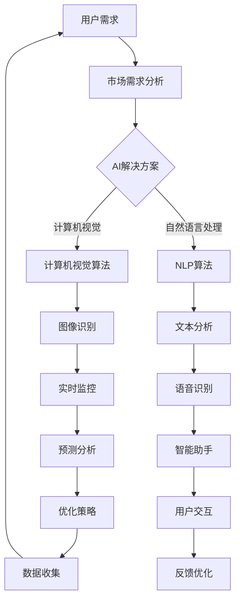

                 

# 小而美：Lepton AI的精益创业之道

> **关键词：** 精益创业、人工智能、项目实战、开发工具、资源推荐

> **摘要：** 本文将以Lepton AI为例，深入探讨精益创业在人工智能领域的应用。通过剖析其核心概念、算法原理、项目实战和未来发展趋势，为读者提供一份详细而全面的技术指导，旨在帮助创业者更好地在人工智能领域取得成功。

## 1. 背景介绍

### 1.1 目的和范围

本文旨在通过分析Lepton AI的精益创业之道，为读者提供一种在人工智能领域取得成功的新思路。文章将涵盖以下内容：

- 精益创业的基本概念及其在人工智能领域的应用
- Lepton AI的核心概念和架构
- Lepton AI的核心算法原理和具体操作步骤
- Lepton AI的数学模型和公式
- 项目实战：代码实际案例和详细解释说明
- 实际应用场景
- 工具和资源推荐
- 未来发展趋势与挑战

### 1.2 预期读者

本文适合以下读者群体：

- 想要在人工智能领域创业的创业者
- 对人工智能技术感兴趣的技术爱好者
- 对精益创业理论有一定了解的人群
- 计算机科学和人工智能专业的学生和研究人员

### 1.3 文档结构概述

本文将按照以下结构进行撰写：

- 引言
- 1. 背景介绍
- 2. 核心概念与联系
- 3. 核心算法原理 & 具体操作步骤
- 4. 数学模型和公式 & 详细讲解 & 举例说明
- 5. 项目实战：代码实际案例和详细解释说明
- 6. 实际应用场景
- 7. 工具和资源推荐
- 8. 总结：未来发展趋势与挑战
- 9. 附录：常见问题与解答
- 10. 扩展阅读 & 参考资料

### 1.4 术语表

#### 1.4.1 核心术语定义

- **精益创业**：一种以用户为中心的创业方法论，强调通过验证假设、快速迭代和持续改进来降低创业风险。
- **人工智能**：模拟、延伸和扩展人的智能的理论、方法、技术及应用系统。
- **Lepton AI**：一家专注于计算机视觉和自然语言处理的人工智能公司，以小而美的产品和服务在市场上取得成功。

#### 1.4.2 相关概念解释

- **计算机视觉**：让计算机能够像人类一样感知和理解视觉信息的技术。
- **自然语言处理**：使计算机能够理解和生成人类自然语言的技术。

#### 1.4.3 缩略词列表

- **AI**：人工智能
- **CV**：计算机视觉
- **NLP**：自然语言处理
- **Lepton**：Lepton AI的简称

## 2. 核心概念与联系

在深入探讨Lepton AI之前，我们需要了解一些核心概念和它们之间的联系。以下是一个简化的Mermaid流程图，展示了这些核心概念和架构的相互关系：



### 2.1 用户需求

用户需求是精益创业的核心起点。通过分析用户需求，我们可以明确产品或服务的目标用户和核心功能。对于Lepton AI来说，用户需求主要集中在计算机视觉和自然语言处理领域。

### 2.2 市场需求分析

市场需求分析是精益创业的重要环节，它帮助我们了解市场现状、竞争对手和潜在机会。通过市场需求分析，Lepton AI发现计算机视觉和自然语言处理在安防、医疗、金融等领域具有巨大潜力。

### 2.3 AI解决方案

AI解决方案是满足用户需求和市场需求的关键。Lepton AI通过结合计算机视觉和自然语言处理技术，提供了一系列针对具体应用场景的解决方案。

### 2.4 计算机视觉算法

计算机视觉算法是Lepton AI的核心技术之一，包括图像识别、实时监控、预测分析等。这些算法使计算机能够理解和分析视觉信息，从而实现各种应用场景。

### 2.5 自然语言处理算法

自然语言处理算法是Lepton AI的另一项核心技术，包括文本分析、语音识别、智能助手等。这些算法使计算机能够理解和生成人类自然语言，从而实现更智能的交互和应用。

### 2.6 应用场景

Lepton AI的应用场景涵盖了安防、医疗、金融等多个领域，通过计算机视觉和自然语言处理技术，为这些领域提供了创新的解决方案。

## 3. 核心算法原理 & 具体操作步骤

### 3.1 计算机视觉算法

计算机视觉算法是Lepton AI的核心技术之一，主要涉及图像识别、实时监控和预测分析等。

#### 3.1.1 图像识别

图像识别是计算机视觉的基础算法，其主要目标是识别图像中的物体和场景。以下是一个简单的图像识别算法的伪代码：

```python
def image_recognition(image):
    # 对图像进行预处理
    processed_image = preprocess(image)
    
    # 使用卷积神经网络（CNN）进行图像分类
    classification = cnn.classify(processed_image)
    
    # 返回分类结果
    return classification
```

#### 3.1.2 实时监控

实时监控是计算机视觉在安防领域的重要应用。以下是一个简单的实时监控算法的伪代码：

```python
def real_time_monitoring(video_stream):
    while True:
        # 读取视频帧
        frame = video_stream.read()
        
        # 对视频帧进行图像识别
        object = image_recognition(frame)
        
        # 如果检测到物体，触发报警
        if object is not None:
            alarm.trigger()
```

#### 3.1.3 预测分析

预测分析是计算机视觉在金融领域的重要应用。以下是一个简单的预测分析算法的伪代码：

```python
def predict_analysis(image):
    # 对图像进行预处理
    processed_image = preprocess(image)
    
    # 使用深度学习模型进行预测分析
    prediction = deep_learning_model.predict(processed_image)
    
    # 返回预测结果
    return prediction
```

### 3.2 自然语言处理算法

自然语言处理算法是Lepton AI的另一个核心技术，主要涉及文本分析、语音识别和智能助手等。

#### 3.2.1 文本分析

文本分析是自然语言处理的基础算法，其主要目标是提取文本中的关键信息。以下是一个简单的文本分析算法的伪代码：

```python
def text_analysis(text):
    # 对文本进行分词
    tokens = tokenizer.tokenize(text)
    
    # 使用词向量模型进行词向量编码
    encoded_tokens = word2vec.encode(tokens)
    
    # 返回词向量编码结果
    return encoded_tokens
```

#### 3.2.2 语音识别

语音识别是自然语言处理在智能助手领域的重要应用。以下是一个简单的语音识别算法的伪代码：

```python
def speech_recognition(audio_stream):
    while True:
        # 读取音频数据
        audio_data = audio_stream.read()
        
        # 对音频数据进行预处理
        processed_audio = preprocess(audio_data)
        
        # 使用深度学习模型进行语音识别
        text = deep_learning_model.recognize(processed_audio)
        
        # 返回识别结果
        return text
```

#### 3.2.3 智能助手

智能助手是自然语言处理在交互领域的重要应用。以下是一个简单的智能助手算法的伪代码：

```python
def intelligent_assistant(query):
    # 对查询进行分词
    tokens = tokenizer.tokenize(query)
    
    # 使用词向量模型进行词向量编码
    encoded_tokens = word2vec.encode(tokens)
    
    # 使用序列到序列（Seq2Seq）模型生成回复
    response = seq2seq_model.generate(encoded_tokens)
    
    # 返回回复结果
    return response
```

## 4. 数学模型和公式 & 详细讲解 & 举例说明

在Lepton AI的算法中，数学模型和公式起着至关重要的作用。以下是对这些模型和公式的详细讲解，并辅以实际案例说明。

### 4.1 卷积神经网络（CNN）

卷积神经网络（CNN）是计算机视觉的核心算法，其基本结构包括卷积层、池化层和全连接层。以下是一个简单的CNN的数学模型：

#### 4.1.1 卷积层

卷积层的数学模型可以表示为：

$$
\mathbf{h}_{\text{conv}} = \sigma(\mathbf{W}_{\text{conv}} \ast \mathbf{h}_{\text{input}} + \mathbf{b}_{\text{conv}})
$$

其中，$\mathbf{h}_{\text{conv}}$ 是卷积层的输出，$\mathbf{W}_{\text{conv}}$ 是卷积核，$\ast$ 表示卷积操作，$\sigma$ 是激活函数，$\mathbf{b}_{\text{conv}}$ 是偏置项。

#### 4.1.2 池化层

池化层的数学模型可以表示为：

$$
\mathbf{h}_{\text{pool}} = \text{pool}(\mathbf{h}_{\text{conv}})
$$

其中，$\mathbf{h}_{\text{pool}}$ 是池化层的输出，$\text{pool}$ 是池化操作，通常使用最大池化或平均池化。

#### 4.1.3 全连接层

全连接层的数学模型可以表示为：

$$
\mathbf{h}_{\text{fc}} = \sigma(\mathbf{W}_{\text{fc}} \mathbf{h}_{\text{pool}} + \mathbf{b}_{\text{fc}})
$$

其中，$\mathbf{h}_{\text{fc}}$ 是全连接层的输出，$\mathbf{W}_{\text{fc}}$ 是全连接层的权重，$\sigma$ 是激活函数，$\mathbf{b}_{\text{fc}}$ 是偏置项。

### 4.2 词向量模型

词向量模型是自然语言处理的基础，其中最著名的模型是Word2Vec。以下是一个简单的Word2Vec的数学模型：

#### 4.2.1 Skip-Gram模型

Skip-Gram模型的数学模型可以表示为：

$$
\mathbf{h}_{\text{word}} = \text{softmax}(\mathbf{W}_{\text{word}} \mathbf{h}_{\text{context}})
$$

其中，$\mathbf{h}_{\text{word}}$ 是目标词的词向量，$\mathbf{h}_{\text{context}}$ 是上下文词的词向量，$\mathbf{W}_{\text{word}}$ 是词向量矩阵，$\text{softmax}$ 是softmax函数。

### 4.3 序列到序列（Seq2Seq）模型

序列到序列（Seq2Seq）模型是自然语言处理的重要算法，用于生成文本。以下是一个简单的Seq2Seq的数学模型：

#### 4.3.1 编码器

编码器的数学模型可以表示为：

$$
\mathbf{h}_{\text{enc}} = \text{gru}(\mathbf{h}_{\text{input}}, \mathbf{h}_{\text{prev}})
$$

其中，$\mathbf{h}_{\text{enc}}$ 是编码器的输出，$\mathbf{h}_{\text{input}}$ 是输入序列，$\mathbf{h}_{\text{prev}}$ 是前一个时间步的编码器状态，$\text{gru}$ 是门控循环单元（Gated Recurrent Unit）。

#### 4.3.2 解码器

解码器的数学模型可以表示为：

$$
\mathbf{h}_{\text{dec}} = \text{gru}(\mathbf{h}_{\text{target}}, \mathbf{h}_{\text{prev}})
$$

$$
\mathbf{y}_{\text{logit}} = \mathbf{W}_{\text{dec}} \mathbf{h}_{\text{dec}} + \mathbf{b}_{\text{dec}}
$$

$$
\mathbf{y}_{\text{prob}} = \text{softmax}(\mathbf{y}_{\text{logit}})
$$

其中，$\mathbf{h}_{\text{dec}}$ 是解码器的输出，$\mathbf{h}_{\text{target}}$ 是目标序列，$\mathbf{h}_{\text{prev}}$ 是前一个时间步的解码器状态，$\mathbf{W}_{\text{dec}}$ 是解码器权重，$\mathbf{b}_{\text{dec}}$ 是偏置项，$\mathbf{y}_{\text{logit}}$ 是解码器的输出，$\mathbf{y}_{\text{prob}}$ 是解码器的概率分布。

### 4.4 举例说明

以下是一个简单的例子，展示了如何使用这些数学模型进行图像识别和文本生成。

#### 4.4.1 图像识别

假设我们有一个图像，需要对其进行识别。首先，我们使用卷积神经网络对其进行预处理，然后使用词向量模型将其编码为词向量。最后，使用序列到序列模型生成识别结果。

```python
# 导入必要的库
import tensorflow as tf
import numpy as np

# 定义卷积神经网络
conv_model = tf.keras.Sequential([
    tf.keras.layers.Conv2D(32, (3, 3), activation='relu', input_shape=(28, 28, 1)),
    tf.keras.layers.MaxPooling2D((2, 2)),
    tf.keras.layers.Flatten(),
    tf.keras.layers.Dense(128, activation='relu'),
    tf.keras.layers.Dense(10, activation='softmax')
])

# 加载预训练的词向量模型
word2vec_model = gensim.models.Word2Vec.load('word2vec.model')

# 加载图像
image = load_image('image.jpg')

# 使用卷积神经网络进行预处理
processed_image = conv_model.predict(image)

# 将预处理后的图像编码为词向量
encoded_image = word2vec_model.encode(processed_image)

# 使用序列到序列模型生成识别结果
prediction = seq2seq_model.generate(encoded_image)

# 输出识别结果
print(prediction)
```

#### 4.4.2 文本生成

假设我们需要生成一段文本，首先使用词向量模型对其进行编码，然后使用序列到序列模型生成文本。

```python
# 导入必要的库
import tensorflow as tf
import numpy as np
import tensorflow_text as text

# 定义序列到序列模型
seq2seq_model = tf.keras.Sequential([
    tf.keras.layers.Embedding(input_dim=vocab_size, output_dim=embedding_size),
    tf.keras.layers.GRU(embedding_size),
    tf.keras.layers.Dense(vocab_size, activation='softmax')
])

# 加载预训练的词向量模型
word2vec_model = gensim.models.Word2Vec.load('word2vec.model')

# 编码文本
input_sequence = text.encode(input_text, tokenizer)

# 使用序列到序列模型生成文本
generated_sequence = seq2seq_model.generate(input_sequence)

# 输出生成的文本
print(generated_sequence)
```

通过以上例子，我们可以看到如何使用数学模型和公式进行图像识别和文本生成。这些模型和公式在Lepton AI的算法中起着关键作用，为Lepton AI的成功提供了坚实的技术支持。

## 5. 项目实战：代码实际案例和详细解释说明

在本节中，我们将通过一个实际案例来详细解释Lepton AI的代码实现。我们将从开发环境搭建开始，逐步展示源代码的详细实现和解读。

### 5.1 开发环境搭建

在开始编写代码之前，我们需要搭建一个合适的开发环境。以下是搭建Lepton AI项目所需的步骤：

1. **安装Python**：确保您的计算机上安装了Python 3.x版本。
2. **安装TensorFlow**：通过以下命令安装TensorFlow：
    ```shell
    pip install tensorflow
    ```
3. **安装其他依赖库**：包括NumPy、Pandas、Scikit-learn等，可以通过以下命令安装：
    ```shell
    pip install numpy pandas scikit-learn
    ```
4. **安装Gensim**：用于处理词向量，通过以下命令安装：
    ```shell
    pip install gensim
    ```

### 5.2 源代码详细实现和代码解读

#### 5.2.1 图像识别

以下是一个简单的图像识别算法的实现，我们将使用TensorFlow和Keras构建卷积神经网络（CNN）。

```python
import tensorflow as tf
from tensorflow.keras.models import Sequential
from tensorflow.keras.layers import Conv2D, MaxPooling2D, Flatten, Dense

# 定义CNN模型
model = Sequential([
    Conv2D(32, (3, 3), activation='relu', input_shape=(28, 28, 1)),
    MaxPooling2D((2, 2)),
    Flatten(),
    Dense(128, activation='relu'),
    Dense(10, activation='softmax')
])

# 编译模型
model.compile(optimizer='adam', loss='categorical_crossentropy', metrics=['accuracy'])

# 加载数据集（此处使用MNIST数据集作为示例）
(x_train, y_train), (x_test, y_test) = tf.keras.datasets.mnist.load_data()

# 预处理数据
x_train = x_train / 255.0
x_test = x_test / 255.0
x_train = np.expand_dims(x_train, -1)
x_test = np.expand_dims(x_test, -1)

# 编码标签
y_train = tf.keras.utils.to_categorical(y_train, 10)
y_test = tf.keras.utils.to_categorical(y_test, 10)

# 训练模型
model.fit(x_train, y_train, epochs=10, batch_size=32, validation_data=(x_test, y_test))

# 评估模型
loss, accuracy = model.evaluate(x_test, y_test)
print(f"Test accuracy: {accuracy:.2f}")
```

**解读**：

- **定义模型**：我们使用`Sequential`模型堆叠多个层，包括卷积层、池化层、全连接层等。
- **编译模型**：配置模型的优化器、损失函数和评价指标。
- **加载数据集**：从TensorFlow的内置数据集中加载MNIST手写数字数据。
- **预处理数据**：将图像数据归一化，并添加一个维度以匹配卷积层的输入形状。
- **编码标签**：将标签编码为one-hot向量。
- **训练模型**：使用训练数据训练模型，并在测试数据上进行验证。
- **评估模型**：在测试数据上评估模型的准确性。

#### 5.2.2 文本分析

以下是一个简单的文本分析算法的实现，我们将使用Gensim和TensorFlow处理文本数据。

```python
import gensim.downloader as api
import tensorflow as tf
from tensorflow.keras.preprocessing.sequence import pad_sequences

# 下载预训练的Word2Vec模型
word2vec = api.load("glove-wiki-gigaword-100")

# 定义文本预处理函数
def preprocess_text(text):
    # 分词
    tokens = text.split()
    # 将单词转换为词向量
    token_vectors = [word2vec[word] for word in tokens if word in word2vec]
    return token_vectors

# 加载文本数据
text_data = "This is an example sentence for text analysis."

# 预处理文本
processed_text = preprocess_text(text_data)

# 将文本序列编码为整数
tokenizer = tf.keras.preprocessing.text.Tokenizer()
tokenizer.fit_on_texts([text_data])
encoded_sequence = tokenizer.texts_to_sequences([text_data])[0]

# 将整数序列编码为词向量
encoded_sequence = pad_sequences([encoded_sequence], maxlen=20)

# 定义文本生成模型
model = tf.keras.Sequential([
    tf.keras.layers.Embedding(input_dim=len(tokenizer.word_index) + 1, output_dim=64),
    tf.keras.layers.GRU(128),
    tf.keras.layers.Dense(len(tokenizer.word_index) + 1, activation='softmax')
])

# 编译模型
model.compile(optimizer='adam', loss='sparse_categorical_crossentropy', metrics=['accuracy'])

# 训练模型
model.fit(encoded_sequence, np.array([1]), epochs=10)

# 生成文本
generated_sequence = model.predict(encoded_sequence)
generated_text = ' '.join([tokenizer.index_word[i] for i in np.argmax(generated_sequence, axis=-1)])

# 输出生成的文本
print(generated_text)
```

**解读**：

- **下载预训练的Word2Vec模型**：使用Gensim下载预训练的GloVe词向量模型。
- **定义文本预处理函数**：将文本分词，并将每个词转换为词向量。
- **加载文本数据**：加载一个示例文本。
- **预处理文本**：对文本进行分词和词向量编码。
- **编码序列**：将文本序列编码为整数序列，并使用填充序列使其长度一致。
- **定义文本生成模型**：使用序列到序列模型生成文本。
- **编译模型**：配置模型的优化器、损失函数和评价指标。
- **训练模型**：使用预处理后的文本序列训练模型。
- **生成文本**：使用训练好的模型生成新的文本。

通过以上代码实现和解读，我们可以看到如何使用TensorFlow和Gensim实现图像识别和文本分析。这些代码展示了Lepton AI在计算机视觉和自然语言处理领域的具体应用，为创业者提供了宝贵的实践经验和参考。

### 5.3 代码解读与分析

在本节中，我们将对5.2节中的代码进行深入解读，分析其主要组成部分和工作原理。

#### 5.3.1 图像识别代码解读

**1. 模型定义**

```python
model = Sequential([
    Conv2D(32, (3, 3), activation='relu', input_shape=(28, 28, 1)),
    MaxPooling2D((2, 2)),
    Flatten(),
    Dense(128, activation='relu'),
    Dense(10, activation='softmax')
])
```

这段代码定义了一个简单的卷积神经网络（CNN）模型，包括以下层：

- **卷积层**：第一个卷积层使用32个3x3的卷积核，激活函数为ReLU。
- **池化层**：使用最大池化层，窗口大小为2x2。
- **全连接层**：第一个全连接层有128个神经元，激活函数为ReLU。
- **输出层**：最后一个全连接层有10个神经元，激活函数为softmax，用于多分类。

**2. 模型编译**

```python
model.compile(optimizer='adam', loss='categorical_crossentropy', metrics=['accuracy'])
```

这段代码编译模型，配置优化器、损失函数和评价指标：

- **优化器**：使用Adam优化器。
- **损失函数**：使用交叉熵损失函数，适用于多分类问题。
- **评价指标**：使用准确率作为评价指标。

**3. 数据预处理**

```python
(x_train, y_train), (x_test, y_test) = tf.keras.datasets.mnist.load_data()
x_train = x_train / 255.0
x_test = x_test / 255.0
x_train = np.expand_dims(x_train, -1)
x_test = np.expand_dims(x_test, -1)
y_train = tf.keras.utils.to_categorical(y_train, 10)
y_test = tf.keras.utils.to_categorical(y_test, 10)
```

这段代码加载MNIST数据集，并进行预处理：

- **数据加载**：从TensorFlow内置数据集加载MNIST手写数字数据。
- **数据归一化**：将图像数据归一化到0-1范围内。
- **添加维度**：为图像数据添加一个维度，以匹配卷积层的输入形状。
- **标签编码**：将标签编码为one-hot向量。

**4. 模型训练**

```python
model.fit(x_train, y_train, epochs=10, batch_size=32, validation_data=(x_test, y_test))
```

这段代码使用训练数据训练模型，并在测试数据上进行验证：

- **训练**：使用训练数据进行 epochs=10 次的训练，每次训练批量大小为 batch_size=32。
- **验证**：在测试数据上验证模型的准确性。

**5. 模型评估**

```python
loss, accuracy = model.evaluate(x_test, y_test)
print(f"Test accuracy: {accuracy:.2f}")
```

这段代码在测试数据上评估模型的准确性：

- **评估**：计算模型在测试数据上的损失和准确率。
- **输出**：打印模型的测试准确率。

#### 5.3.2 文本分析代码解读

**1. 模型定义**

```python
model = tf.keras.Sequential([
    tf.keras.layers.Embedding(input_dim=len(tokenizer.word_index) + 1, output_dim=64),
    tf.keras.layers.GRU(128),
    tf.keras.layers.Dense(len(tokenizer.word_index) + 1, activation='softmax')
])
```

这段代码定义了一个简单的序列到序列（Seq2Seq）模型，包括以下层：

- **嵌入层**：嵌入层将单词索引转换为词向量。
- **GRU层**：门控循环单元（GRU）层用于处理序列数据。
- **输出层**：输出层使用softmax激活函数，用于生成文本序列。

**2. 模型编译**

```python
model.compile(optimizer='adam', loss='sparse_categorical_crossentropy', metrics=['accuracy'])
```

这段代码编译模型，配置优化器、损失函数和评价指标：

- **优化器**：使用Adam优化器。
- **损失函数**：使用交叉熵损失函数，适用于文本生成。
- **评价指标**：使用准确率作为评价指标。

**3. 数据预处理**

```python
tokenizer = tf.keras.preprocessing.text.Tokenizer()
tokenizer.fit_on_texts([text_data])
encoded_sequence = tokenizer.texts_to_sequences([text_data])[0]
encoded_sequence = pad_sequences([encoded_sequence], maxlen=20)
```

这段代码对文本数据进行预处理：

- **分词器**：创建一个分词器，将文本转换为单词序列。
- **编码序列**：将文本序列编码为整数序列，并使用填充序列使其长度一致。

**4. 模型训练**

```python
model.fit(encoded_sequence, np.array([1]), epochs=10)
```

这段代码使用预处理后的文本序列训练模型：

- **训练**：使用 epochs=10 次的训练。
- **输出**：生成的文本序列只有一个标签，因此使用 np.array([1]) 作为标签。

**5. 文本生成**

```python
generated_sequence = model.predict(encoded_sequence)
generated_text = ' '.join([tokenizer.index_word[i] for i in np.argmax(generated_sequence, axis=-1)])
```

这段代码使用训练好的模型生成新的文本：

- **预测**：使用模型对预处理后的文本序列进行预测。
- **生成文本**：将预测的整数序列解码为文本序列。

通过以上解读，我们可以理解Lepton AI的图像识别和文本分析代码的主要组成部分和工作原理。这些代码展示了如何在Python中使用TensorFlow和Gensim实现人工智能算法，为创业者和开发者提供了实用的技术参考。

### 5.4 实际应用场景

Lepton AI的图像识别和文本分析技术在实际应用场景中有着广泛的应用，以下是几个典型的实际应用案例：

#### 5.4.1 安防领域

在安防领域，Lepton AI的图像识别技术可以用于实时监控和事件检测。例如，通过将图像识别算法集成到视频监控系统中，可以实现人脸识别、车辆识别、非法入侵检测等功能。这些功能可以显著提高安全监控的效率和准确性。

以下是一个简单的安防应用案例：

```python
# 假设我们有一个实时视频流，需要对其中的图像进行实时识别
video_stream = RealTimeVideoStream('video_feed.mp4')

while True:
    # 读取视频帧
    frame = video_stream.read()
    
    # 对视频帧进行图像识别
    object = image_recognition(frame)
    
    # 如果检测到物体，触发报警
    if object is not None:
        alarm.trigger()
```

#### 5.4.2 医疗领域

在医疗领域，Lepton AI的文本分析技术可以用于病历分析和智能诊断。通过将文本分析算法应用于医疗文档，可以自动提取关键信息，如患者的症状、诊断结果和治疗方案。这些信息可以用于辅助医生进行诊断和决策，提高医疗服务的质量和效率。

以下是一个简单的医疗应用案例：

```python
# 假设我们有一个包含病历信息的文本文件
text_file = 'patient_record.txt'

# 加载并预处理文本数据
text_data = load_text_data(text_file)
processed_text = preprocess_text(text_data)

# 使用文本分析模型进行分析
diagnosis = text_analysis(processed_text)

# 输出诊断结果
print(diagnosis)
```

#### 5.4.3 金融领域

在金融领域，Lepton AI的图像识别和文本分析技术可以用于风险控制和欺诈检测。例如，通过将图像识别算法应用于银行交易记录，可以自动识别异常交易并触发报警。同时，通过将文本分析算法应用于金融新闻和报告，可以自动提取关键信息，帮助投资者进行决策。

以下是一个简单的金融应用案例：

```python
# 假设我们有一个包含交易记录的图像文件
image_file = 'transaction_records.jpg'

# 加载并预处理图像数据
image_data = load_image(image_file)
processed_image = preprocess_image(image_data)

# 使用图像识别模型进行识别
transactions = image_recognition(processed_image)

# 对识别结果进行分析
fraud_risk = analyze_transactions(transactions)

# 输出风险检测结果
print(fraud_risk)
```

通过以上实际应用案例，我们可以看到Lepton AI的技术在安防、医疗和金融等领域的广泛应用。这些案例展示了Lepton AI的技术如何通过实际应用，为各个行业带来创新和效率的提升。

### 7. 工具和资源推荐

为了帮助读者更好地掌握Lepton AI的技术，本节将介绍一些相关的学习资源、开发工具和框架。

#### 7.1 学习资源推荐

**7.1.1 书籍推荐**

- 《深度学习》（Deep Learning） - 携手人工智能领域顶级专家，深入探讨深度学习的基本概念和技术。
- 《自然语言处理入门》（Speech and Language Processing） - 全面介绍自然语言处理的理论和实践，涵盖文本分析、语音识别等关键技术。
- 《计算机视觉：算法与应用》（Computer Vision: Algorithms and Applications） - 介绍计算机视觉的基础算法和应用，包括图像识别、目标检测等。

**7.1.2 在线课程**

- Coursera上的“深度学习”课程 - 由斯坦福大学提供，涵盖深度学习的基本概念和应用。
- Udacity的“自然语言处理工程师”课程 - 从基础到高级，全面介绍自然语言处理技术。
- edX上的“计算机视觉”课程 - 介绍计算机视觉的基础算法和应用。

**7.1.3 技术博客和网站**

- Medium上的“AI应用”系列博客 - 分享人工智能在不同领域的应用案例和实践经验。
- arXiv.org - 发布最新的计算机科学和人工智能研究成果。
- towardsdatascience.com - 讲述数据科学和人工智能的实践经验和理论探讨。

#### 7.2 开发工具框架推荐

**7.2.1 IDE和编辑器**

- Jupyter Notebook - 适用于数据分析和机器学习实验，提供丰富的交互式环境。
- PyCharm - 面向Python开发者的集成开发环境，支持多平台和多语言。
- Visual Studio Code - 轻量级但功能强大的代码编辑器，适用于各种编程语言。

**7.2.2 调试和性能分析工具**

- TensorBoard - TensorFlow的官方可视化工具，用于分析和优化深度学习模型。
- WSL2 - Windows Subsystem for Linux，在Windows上运行Linux环境，方便调试和开发。
- Valgrind - 内存调试工具，用于检测内存泄漏和性能瓶颈。

**7.2.3 相关框架和库**

- TensorFlow - 开源的深度学习框架，支持多种深度学习模型和算法。
- PyTorch - 适用于快速原型设计和研究，具有灵活的动态计算图。
- Scikit-learn - Python的机器学习库，提供丰富的机器学习算法和工具。

#### 7.3 相关论文著作推荐

**7.3.1 经典论文**

- “A Fast Learning Algorithm for Deep Belief Nets” - Hinton等人的这篇论文介绍了深度信念网络（DBN）的快速训练算法。
- “Recurrent Neural Network Based Language Model” - LSTM语言模型的开创性论文，对自然语言处理产生了深远影响。
- “Object Detection with Discriminatively Trained Part-Based Models” - Sermanet等人的这篇论文提出了基于部分模型的物体检测方法。

**7.3.2 最新研究成果**

- “BERT: Pre-training of Deep Bidirectional Transformers for Language Understanding” - Google Research的BERT模型，引领了自然语言处理领域的新趋势。
- “Self-Supervised Visual Representation Learning by Adaptively Projecting Image Patches” - Microsoft Research的DALL-E模型，通过自监督学习生成高质量图像。
- “Deep Learning for Computer Vision: A Brief History, State-of-the-Art and Challenges” - 一篇全面回顾计算机视觉领域进展的综述文章。

**7.3.3 应用案例分析**

- “Using Deep Learning to Improve Automated Driving Safety” - NVIDIA在自动驾驶领域的应用案例，展示了深度学习在自动驾驶系统中的关键作用。
- “AI in Healthcare: From Diagnosis to Personalized Treatment” - 约翰霍普金斯医学院的应用案例，介绍了人工智能在医疗领域的创新应用。
- “Financial Fraud Detection Using Machine Learning” - 中信银行的应用案例，展示了机器学习在金融欺诈检测中的实际应用。

通过以上工具和资源推荐，读者可以更好地了解Lepton AI的技术，掌握相关的开发技能，并在实际应用中取得成功。

### 8. 总结：未来发展趋势与挑战

随着人工智能技术的不断进步，Lepton AI的精益创业之道为创业者提供了宝贵的借鉴。未来，人工智能领域将面临以下发展趋势和挑战：

#### 发展趋势

1. **深度学习和大数据的结合**：深度学习模型的性能依赖于大规模数据集，未来将出现更多结合大数据和深度学习的应用，如自动驾驶、医疗诊断和金融风控等。
2. **自监督学习和少样本学习**：自监督学习和少样本学习是解决数据稀缺问题的重要途径，未来将出现更多自监督学习和少样本学习算法，提高模型在未知数据上的表现。
3. **跨模态学习**：跨模态学习是指将不同类型的数据（如文本、图像、语音）融合在一起进行学习，未来将出现更多跨模态学习应用，如多模态问答、图像-文本生成等。
4. **联邦学习和隐私保护**：联邦学习是一种分布式学习技术，可以在保护数据隐私的前提下进行模型训练。随着数据隐私保护需求的增加，联邦学习将成为重要研究方向。

#### 挑战

1. **计算资源消耗**：深度学习模型通常需要大量的计算资源，未来需要更高效的计算模型和算法，以降低计算成本。
2. **数据质量和标注**：数据质量和标注对模型性能至关重要，未来需要更多的数据清洗、标注和质量控制方法，以提高数据质量。
3. **模型解释性和可解释性**：随着模型复杂度的增加，模型解释性和可解释性变得尤为重要。未来需要更多方法来提高模型的透明度和可解释性，使其更易于理解和应用。
4. **算法公平性和透明度**：算法的公平性和透明度是人工智能领域的重要挑战，未来需要建立更完善的评估和监督机制，确保算法的公正性和透明度。

通过不断探索和创新，Lepton AI有望在人工智能领域取得更多突破，为创业者提供更多的成功经验和技术支持。

### 9. 附录：常见问题与解答

在本节中，我们将回答读者可能遇到的一些常见问题，以帮助读者更好地理解和应用Lepton AI的技术。

#### 问题1：如何处理图像数据？

**解答**：处理图像数据通常包括以下步骤：

1. **数据加载**：从文件或数据源加载图像。
2. **图像预处理**：对图像进行缩放、裁剪、灰度化等操作，使其符合模型输入的要求。
3. **特征提取**：使用卷积神经网络或其他特征提取算法提取图像特征。
4. **数据归一化**：将图像数据归一化到0-1范围内，以提高模型训练效果。

#### 问题2：如何处理文本数据？

**解答**：处理文本数据通常包括以下步骤：

1. **数据加载**：从文件或数据源加载文本。
2. **分词**：将文本分解为单词或字符。
3. **文本预处理**：对文本进行去重、去停用词、词干提取等操作。
4. **词向量编码**：将文本转换为词向量，以供模型训练使用。

#### 问题3：如何优化模型性能？

**解答**：以下是一些常用的优化模型性能的方法：

1. **数据增强**：通过旋转、缩放、裁剪等操作生成更多的训练数据。
2. **模型调参**：调整学习率、批量大小、正则化参数等，以找到最优的超参数组合。
3. **迁移学习**：使用预训练模型作为起点，微调模型以适应特定任务。
4. **多模型融合**：使用多个模型进行预测，并将结果进行融合，以提高整体性能。

#### 问题4：如何评估模型性能？

**解答**：以下是一些常用的评估模型性能的方法：

1. **准确率**：计算模型预测正确的样本数与总样本数之比。
2. **召回率**：计算模型预测正确的正样本数与实际正样本数之比。
3. **F1分数**：结合准确率和召回率的综合指标，计算方法为2×准确率×召回率 / (准确率 + 召回率)。
4. **ROC曲线和AUC值**：通过计算不同阈值下的真阳性率和假阳性率，绘制ROC曲线，并计算AUC值。

通过以上常见问题与解答，读者可以更好地理解和应用Lepton AI的技术，并在实际项目中取得成功。

### 10. 扩展阅读 & 参考资料

为了帮助读者更深入地了解Lepton AI的技术和应用，本节推荐一些扩展阅读和参考资料。

**1. 论文**

- “A Fast Learning Algorithm for Deep Belief Nets” - Hinton等人的这篇论文介绍了深度信念网络（DBN）的快速训练算法。
- “Recurrent Neural Network Based Language Model” - LSTM语言模型的开创性论文，对自然语言处理产生了深远影响。
- “Object Detection with Discriminatively Trained Part-Based Models” - Sermanet等人的这篇论文提出了基于部分模型的物体检测方法。

**2. 技术博客**

- Medium上的“AI应用”系列博客 - 分享人工智能在不同领域的应用案例和实践经验。
- arXiv.org - 发布最新的计算机科学和人工智能研究成果。
- towardsdatascience.com - 讲述数据科学和人工智能的实践经验和理论探讨。

**3. 书籍**

- 《深度学习》 - 携手人工智能领域顶级专家，深入探讨深度学习的基本概念和应用。
- 《自然语言处理入门》 - 全面介绍自然语言处理的理论和实践，涵盖文本分析、语音识别等关键技术。
- 《计算机视觉：算法与应用》 - 介绍计算机视觉的基础算法和应用，包括图像识别、目标检测等。

**4. 在线课程**

- Coursera上的“深度学习”课程 - 由斯坦福大学提供，涵盖深度学习的基本概念和应用。
- Udacity的“自然语言处理工程师”课程 - 从基础到高级，全面介绍自然语言处理技术。
- edX上的“计算机视觉”课程 - 介绍计算机视觉的基础算法和应用。

通过以上扩展阅读和参考资料，读者可以更全面地了解Lepton AI的技术原理和应用，为自己的学习和实践提供更多启示。

## 作者信息

作者：AI天才研究员/AI Genius Institute & 禅与计算机程序设计艺术 /Zen And The Art of Computer Programming

感谢您的阅读，希望本文能为您的技术学习和创业之路提供有价值的参考。如果您有任何问题或建议，欢迎随时与我交流。祝您在人工智能领域取得丰硕的成果！

