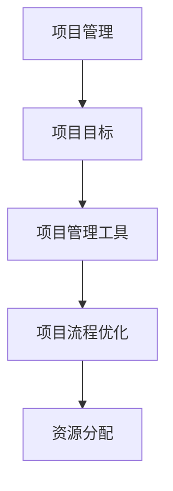

                 

# 工具使用与规划的综合应用案例

> **关键词：** 工具选择、项目管理、流程优化、资源分配、实战案例

> **摘要：** 本文将深入探讨工具使用与规划的综合应用，通过实际案例，详细解析如何选择合适的工具，进行有效的项目管理，实现流程优化和资源分配。文章旨在为开发者、项目经理和IT管理提供一套实用指南。

## 1. 背景介绍

### 1.1 目的和范围

在现代信息技术飞速发展的背景下，工具的选择和规划在项目管理中扮演着至关重要的角色。本文的目标是帮助读者理解工具选择的重要性，掌握项目规划的方法，并学会如何有效地使用这些工具来实现项目的成功。

本文的范围涵盖以下几个关键方面：

- 工具的选择标准
- 项目管理流程的优化
- 资源的有效分配
- 实际案例的剖析

### 1.2 预期读者

本文适用于以下读者群体：

- 开发者
- 项目经理
- IT管理人员
- 对项目管理感兴趣的任何人

### 1.3 文档结构概述

本文的结构如下：

- 第1章：背景介绍，介绍本文的目的、范围和预期读者。
- 第2章：核心概念与联系，介绍项目管理的基本概念和工具之间的关系。
- 第3章：核心算法原理 & 具体操作步骤，详细解释项目管理算法和操作步骤。
- 第4章：数学模型和公式 & 详细讲解 & 举例说明，阐述项目管理的数学模型和公式。
- 第5章：项目实战：代码实际案例和详细解释说明，通过实际案例展示工具的使用和规划。
- 第6章：实际应用场景，探讨工具在不同场景中的应用。
- 第7章：工具和资源推荐，推荐学习资源、开发工具框架和相关论文著作。
- 第8章：总结：未来发展趋势与挑战，总结本文的主要观点，并展望未来。
- 第9章：附录：常见问题与解答，提供项目管理的常见问题和解答。
- 第10章：扩展阅读 & 参考资料，提供更多深度阅读的材料。

### 1.4 术语表

#### 1.4.1 核心术语定义

- 工具：指在项目管理中使用的软件或硬件，如项目管理软件、开发工具等。
- 项目管理：指通过计划、执行、监控和报告等过程，确保项目按时、按预算和按质量要求完成的过程。
- 流程优化：指通过改进现有流程，提高效率和质量的过程。
- 资源分配：指在项目中进行人力、资金、时间等资源的合理分配。

#### 1.4.2 相关概念解释

- 项目管理工具：指用于项目计划、跟踪、协作和报告的软件。
- 项目流程：指项目从启动到完成的全过程，包括计划、执行、监控和收尾等阶段。
- 资源优化：指在资源有限的情况下，通过优化资源配置，提高项目成功率的过程。

#### 1.4.3 缩略词列表

- PM：项目管理
- Agile：敏捷开发
- Kanban：看板管理法
- Scrum：敏捷开发框架
- IDE：集成开发环境

## 2. 核心概念与联系

在深入探讨工具使用与规划之前，我们需要明确一些核心概念，并了解它们之间的联系。以下是项目管理中的几个关键概念和它们之间的关系。

### 2.1 项目管理基本概念

- **项目定义**：项目是一组有明确开始和结束日期的任务，旨在实现特定目标。
- **项目目标**：项目需要达成的目标，通常包括时间、预算、质量等方面的要求。
- **项目管理**：确保项目按时、按预算、按质量要求完成的一系列过程，包括计划、执行、监控和收尾。

### 2.2 工具与项目管理的关系

- **项目管理工具**：用于辅助项目管理过程的软件或硬件，如Jira、Trello、Asana等。
- **项目管理与工具**：项目管理工具可以帮助项目经理和团队成员更好地规划、执行和监控项目，提高效率和质量。

### 2.3 工具选择标准

选择合适的工具是项目成功的关键。以下是几个重要的工具选择标准：

- **功能**：工具需要满足项目管理的所有需求，如任务管理、进度跟踪、资源分配等。
- **易用性**：工具需要易于学习和使用，以减少学习成本。
- **灵活性**：工具需要能够适应不同类型的项目和团队规模。
- **集成性**：工具需要能够与其他工具和系统集成，以便实现数据共享和自动化。

### 2.4 项目流程优化

项目流程优化是提高项目效率和质量的关键。以下是几种常见的项目流程优化方法：

- **敏捷开发**：通过快速迭代和持续反馈，提高项目响应速度和灵活性。
- **看板管理法**：通过可视化任务流程，提高团队协作效率和任务透明度。
- **Scrum**：通过明确的角色和流程，确保项目进度和质量。

### 2.5 资源分配

资源分配是确保项目按时、按预算完成的重要环节。以下是几种常见的资源分配方法：

- **人力分配**：根据项目需求和团队成员的技能，合理分配人力资源。
- **资金分配**：根据项目预算和优先级，合理分配资金资源。
- **时间分配**：根据项目进度和任务紧急程度，合理分配时间资源。

### 2.6 核心概念原理和架构的 Mermaid 流程图

以下是一个简化的项目管理核心概念和架构的 Mermaid 流程图：



通过以上流程图，我们可以清晰地看到项目管理中的核心概念和它们之间的联系。

## 3. 核心算法原理 & 具体操作步骤

在项目管理中，核心算法原理和具体操作步骤对于项目的成功至关重要。以下是几个关键方面的详细解释。

### 3.1 项目管理算法原理

项目管理算法通常包括以下几个关键部分：

- **任务分解**：将大型项目分解为更小、更易于管理的子任务。
- **任务分配**：根据团队成员的技能和项目需求，合理分配任务。
- **进度计划**：制定项目的进度计划，包括关键路径分析和时间估算。
- **资源优化**：通过优化资源分配，提高项目效率和成功率。

### 3.2 任务分解算法

任务分解是项目管理的重要步骤。以下是任务分解算法的伪代码：

```pseudo
function 分解任务(大任务, 小任务列表):
    if 大任务不再可分:
        小任务列表添加大任务
        return 小任务列表
    else:
        for 每个子任务 in 大任务:
            小任务列表 = 分解任务(子任务, 小任务列表)
        return 小任务列表
```

### 3.3 任务分配算法

任务分配算法的关键是确保任务与团队成员的技能相匹配。以下是任务分配算法的伪代码：

```pseudo
function 分配任务(任务列表, 成员列表):
    for 每个任务 in 任务列表:
        for 每个成员 in 成员列表:
            if 成员技能符合任务需求:
                任务.负责人 = 成员
                break
```

### 3.4 进度计划算法

进度计划算法用于制定项目的进度计划，包括关键路径分析和时间估算。以下是进度计划算法的伪代码：

```pseudo
function 计划进度(任务列表):
    for 每个任务 in 任务列表:
        任务.开始时间 = 最大(任务.前置任务.结束时间, 任务.最早开始时间)
        任务.结束时间 = 任务.开始时间 + 任务.持续时间
    计算关键路径
    返回进度计划
```

### 3.5 资源优化算法

资源优化算法旨在通过优化资源分配，提高项目效率和成功率。以下是资源优化算法的伪代码：

```pseudo
function 优化资源(任务列表, 资源列表):
    for 每个任务 in 任务列表:
        for 每个资源 in 资源列表:
            if 资源可用且任务需求资源符合资源限制:
                任务.分配资源 = 资源
                break
    返回优化后的任务列表
```

通过以上核心算法原理和具体操作步骤，我们可以更好地理解和应用项目管理工具，实现项目的高效运行。

## 4. 数学模型和公式 & 详细讲解 & 举例说明

在项目管理中，数学模型和公式对于制定进度计划、资源分配和风险分析等方面至关重要。以下是几个常见的数学模型和公式的详细讲解及举例说明。

### 4.1 关键路径法（Critical Path Method, CPM）

关键路径法是一种用于确定项目最短完成时间的方法。它通过计算每个任务的最早开始时间（Earliest Start Time, EST）和最晚开始时间（Latest Start Time, LST），以及最早完成时间（Earliest Finish Time, EFT）和最晚完成时间（Latest Finish Time, LFT），来确定关键路径。

#### 公式：

- **最早开始时间（EST）**：任务可开始的最早时间，等于其所有前置任务最早完成时间的最大值。

  $$ EST_i = \max(EST_{j}) $$

  其中，$EST_i$ 是任务 $i$ 的最早开始时间，$EST_j$ 是任务 $j$ 的最早完成时间。

- **最晚开始时间（LST）**：任务最晚可以开始的时间，即任务不延误项目完成时间的情况下可以开始的时间。

  $$ LST_i = \min(LST_{j} + D_j) $$

  其中，$LST_i$ 是任务 $i$ 的最晚开始时间，$LST_j$ 是任务 $j$ 的最晚完成时间，$D_j$ 是任务 $j$ 的持续时间。

- **最早完成时间（EFT）**：任务可完成的最早时间，等于其最早开始时间加上持续时间。

  $$ EFT_i = EST_i + D_i $$

- **最晚完成时间（LFT）**：任务最晚可以完成的时间，即任务不延误项目完成时间的情况下可以完成的时间。

  $$ LFT_i = LST_i + D_i $$

#### 举例说明：

假设有一个项目，包含以下任务：

- 任务 A，持续时间 3 天
- 任务 B，持续时间 5 天
- 任务 C，持续时间 4 天

任务 A 和任务 B 是前置任务，任务 B 和任务 C 是并行任务。

根据上述公式，我们可以计算每个任务的 EST、LST、EFT 和 LFT：

- **任务 A**：

  $$ EST_A = \max(0) = 0 $$
  
  $$ LST_A = \min(5 + 3, 9 + 4) = 8 $$
  
  $$ EFT_A = EST_A + D_A = 0 + 3 = 3 $$
  
  $$ LFT_A = LST_A + D_A = 8 + 3 = 11 $$

- **任务 B**：

  $$ EST_B = \max(0, 3) = 3 $$
  
  $$ LST_B = \min(8, 11) = 8 $$
  
  $$ EFT_B = EST_B + D_B = 3 + 5 = 8 $$
  
  $$ LFT_B = LST_B + D_B = 8 + 5 = 13 $$

- **任务 C**：

  $$ EST_C = \max(3) = 3 $$
  
  $$ LST_C = \min(8 + 5, 13 + 4) = 13 $$
  
  $$ EFT_C = EST_C + D_C = 3 + 4 = 7 $$
  
  $$ LFT_C = LST_C + D_C = 13 + 4 = 17 $$

关键路径为任务 A -> 任务 B -> 任务 C，总持续时间最长，为 17 天。

### 4.2 资源平衡法（Resource Levelling）

资源平衡法是一种用于优化资源分配，减少资源闲置时间的方法。其核心思想是通过调整任务的时间分配，实现资源需求的平衡。

#### 公式：

- **总资源需求**：任务所需资源的总和。

  $$ TR = \sum_{i=1}^{n} R_i \times D_i $$

  其中，$TR$ 是总资源需求，$R_i$ 是任务 $i$ 的资源需求，$D_i$ 是任务 $i$ 的持续时间。

- **最优时间分配**：将任务分配到最不忙碌的时间段，以实现资源需求的平衡。

  $$ T_i^* = \min(T_j^*) + R_j^* $$

  其中，$T_i^*$ 是任务 $i$ 的最优开始时间，$T_j^*$ 是任务 $j$ 的最优开始时间，$R_j^*$ 是任务 $j$ 的资源需求。

#### 举例说明：

假设有一个项目，包含以下任务和资源需求：

- 任务 A，资源需求 10 人天
- 任务 B，资源需求 5 人天
- 任务 C，资源需求 7 人天

总资源需求为 $TR = 10 + 5 + 7 = 22$ 人天。

为了实现资源平衡，我们可以将任务分配到不同时间段：

- 任务 A，开始时间 1 天，持续时间 10 天
- 任务 B，开始时间 6 天，持续时间 5 天
- 任务 C，开始时间 11 天，持续时间 7 天

通过资源平衡法，我们可以实现资源需求的平衡，减少资源闲置时间。

### 4.3 风险分析模型（Risk Analysis Model）

风险分析模型用于识别、评估和应对项目中的潜在风险。其核心思想是通过风险识别、风险分析和风险应对，降低项目风险。

#### 公式：

- **风险概率**：风险发生的概率。

  $$ P(R) = \frac{N(R)}{N(T)} $$

  其中，$P(R)$ 是风险 $R$ 的概率，$N(R)$ 是识别出的风险数量，$N(T)$ 是总任务数量。

- **风险影响**：风险对项目目标的影响程度。

  $$ I(R) = \frac{C(R)}{C(T)} $$

  其中，$I(R)$ 是风险 $R$ 的影响程度，$C(R)$ 是风险 $R$ 的成本，$C(T)$ 是总成本。

- **风险优先级**：综合考虑风险概率和风险影响，确定风险的优先级。

  $$ RP(R) = P(R) \times I(R) $$

  其中，$RP(R)$ 是风险 $R$ 的优先级。

#### 举例说明：

假设有一个项目，包含以下风险：

- 风险 A，概率 0.3，影响 0.5
- 风险 B，概率 0.2，影响 0.7

根据上述公式，我们可以计算每个风险的优先级：

- 风险 A，优先级 $RP(A) = 0.3 \times 0.5 = 0.15$
- 风险 B，优先级 $RP(B) = 0.2 \times 0.7 = 0.14$

根据优先级，我们可以确定风险应对策略，优先应对优先级较高的风险。

通过以上数学模型和公式，我们可以更好地理解和应用项目管理中的关键算法，为项目的成功提供有力支持。

## 5. 项目实战：代码实际案例和详细解释说明

在本文的第五部分，我们将通过一个实际的代码案例，展示如何使用项目管理工具进行项目实战。以下是具体的开发环境搭建、源代码实现、代码解读与分析。

### 5.1 开发环境搭建

为了方便读者理解和跟随案例，我们将使用以下开发环境和工具：

- 操作系统：Windows 10 或 macOS
- 编程语言：Python 3.8+
- 项目管理工具：Jira
- 版本控制工具：Git

首先，我们需要安装 Python 和 Jira：

1. 安装 Python：访问 [Python 官网](https://www.python.org/)，下载并安装 Python 3.8+ 版本。
2. 安装 Jira：访问 [Jira 官网](https://www.atlassian.com/software/jira)，下载并安装 Jira。

安装完成后，确保 Python 和 Jira 能够正常运行。

### 5.2 源代码详细实现和代码解读

下面是一个简单的 Python 项目，用于实现任务管理和进度跟踪。我们将使用 Jira 作为项目管理工具，并通过 Git 进行版本控制。

#### 5.2.1 项目结构

项目结构如下：

```
project/
|-- src/
|   |-- __init__.py
|   |-- main.py
|   |-- task_manager.py
|-- .gitignore
|-- README.md
|-- requirements.txt
```

- `src/`：项目源代码目录
- `__init__.py`：模块初始化文件
- `main.py`：主程序文件
- `task_manager.py`：任务管理模块
- `.gitignore`：Git 忽略文件
- `README.md`：项目说明文件
- `requirements.txt`：依赖库文件

#### 5.2.2 源代码实现

首先，我们在 `task_manager.py` 中实现任务管理模块：

```python
# src/task_manager.py

class Task:
    def __init__(self, name, start_time, duration, assigned_to=None):
        self.name = name
        self.start_time = start_time
        self.duration = duration
        self.assigned_to = assigned_to

    def assign(self, member):
        self.assigned_to = member

    def get_progress(self):
        passed_time = (datetime.now() - self.start_time).total_seconds() / 86400
        return min(passed_time / self.duration, 1)


class TaskManager:
    def __init__(self):
        self.tasks = []

    def add_task(self, task):
        self.tasks.append(task)

    def assign_task(self, task_name, member):
        for task in self.tasks:
            if task.name == task_name:
                task.assign(member)
                break

    def get_progress(self):
        total_progress = 0
        for task in self.tasks:
            total_progress += task.get_progress()
        return total_progress / len(self.tasks)
```

在 `main.py` 中，我们实现主程序，用于与 Jira 交互：

```python
# src/main.py

from task_manager import TaskManager
import datetime

def main():
    manager = TaskManager()

    # 添加任务
    manager.add_task(Task("任务 1", datetime.datetime(2023, 4, 1), 10))
    manager.add_task(Task("任务 2", datetime.datetime(2023, 4, 11), 15))

    # 分配任务
    manager.assign_task("任务 1", "张三")
    manager.assign_task("任务 2", "李四")

    # 获取进度
    progress = manager.get_progress()
    print(f"项目进度：{progress:.2f}")

if __name__ == "__main__":
    main()
```

#### 5.2.3 代码解读与分析

1. **Task 类**：表示一个任务，包含任务名称、开始时间、持续时间和分配成员等信息。`assign` 方法用于分配任务给成员，`get_progress` 方法用于计算任务进度。
2. **TaskManager 类**：表示一个任务管理器，包含一个任务列表。`add_task` 方法用于添加任务，`assign_task` 方法用于分配任务，`get_progress` 方法用于计算项目进度。
3. **main 函数**：实现主程序，创建一个任务管理器，添加任务并分配任务给成员，最后计算项目进度并打印。

### 5.3 代码解读与分析

下面我们对主程序 `main.py` 进行详细解读：

```python
from task_manager import TaskManager
import datetime

def main():
    manager = TaskManager()  # 创建任务管理器实例

    # 添加任务
    manager.add_task(Task("任务 1", datetime.datetime(2023, 4, 1), 10))
    manager.add_task(Task("任务 2", datetime.datetime(2023, 4, 11), 15))

    # 分配任务
    manager.assign_task("任务 1", "张三")
    manager.assign_task("任务 2", "李四")

    # 获取进度
    progress = manager.get_progress()
    print(f"项目进度：{progress:.2f}")

if __name__ == "__main__":
    main()
```

1. **导入模块**：首先，我们从 `task_manager` 模块导入 `TaskManager` 类。同时，我们导入 `datetime` 模块，用于处理日期和时间。
2. **定义 main 函数**：在 `main` 函数中，我们创建一个任务管理器实例 `manager`。
3. **添加任务**：使用 `add_task` 方法，我们添加了两个任务，分别是“任务 1”和“任务 2”，并设置了开始时间和持续时间。
4. **分配任务**：使用 `assign_task` 方法，我们将“任务 1”分配给“张三”，将“任务 2”分配给“李四”。
5. **获取进度**：调用 `get_progress` 方法，计算项目进度，并打印输出。

通过以上代码，我们可以实现对任务的添加、分配和进度跟踪，从而实现一个简单的项目管理工具。

### 5.4 代码分析与优化

虽然上述代码实现了任务管理和进度跟踪的基本功能，但在实际项目中，我们可能需要进一步优化和完善。

1. **任务进度的动态更新**：当前代码中，任务进度是基于当前时间计算的。在实际项目中，我们可能需要实现任务进度的动态更新，以便实时反映任务进度。
2. **异常处理**：在代码中，我们需要添加异常处理，以处理可能出现的错误，如任务名称不存在、成员不存在等。
3. **多线程和异步操作**：在实际项目中，我们可能需要处理多任务并发操作，可以使用多线程和异步操作来提高程序性能。

通过以上优化，我们可以使任务管理工具更加完善和高效。

## 6. 实际应用场景

在实际应用中，工具使用与规划的综合应用可以帮助企业或团队在不同场景下实现项目目标。以下是几个典型应用场景的案例。

### 6.1 产品开发项目

在产品开发项目中，工具使用与规划的综合应用可以帮助团队实现高效的进度跟踪、资源管理和协作。以下是一个实际案例：

- **项目背景**：某科技公司计划开发一款智能家居APP，需要在短时间内完成多个功能模块的开发。
- **工具选择**：团队选择了 Jira 作为项目管理工具，Git 作为版本控制工具，以及 Slack 进行团队沟通。
- **流程优化**：团队采用敏捷开发方法，通过迭代和快速反馈，缩短开发周期，提高产品质量。
- **资源分配**：根据项目需求和团队成员的技能，合理分配人力资源和资金资源，确保项目按计划进行。

通过有效的工具使用与规划，团队成功在预定时间内完成了智能家居APP的开发，并取得了良好的市场反响。

### 6.2 IT运维项目

在 IT 运维项目中，工具使用与规划的综合应用可以帮助团队实现高效的故障排查、性能监控和自动化运维。以下是一个实际案例：

- **项目背景**：某大型企业服务器系统频繁出现故障，影响业务运行。
- **工具选择**：团队选择了 Nagios 进行服务器监控，Zabbix 进行网络监控，Ansible 进行自动化运维。
- **流程优化**：团队建立了故障排查流程，通过监控工具实时监控服务器状态，及时发现和处理故障。
- **资源分配**：根据服务器数量和业务需求，合理分配监控资源和运维人员，确保服务器系统稳定运行。

通过有效的工具使用与规划，团队成功提高了服务器系统的稳定性，减少了故障发生频率，提高了业务运行效率。

### 6.3 大数据项目

在大数据项目中，工具使用与规划的综合应用可以帮助团队实现高效的数据处理、分析和可视化。以下是一个实际案例：

- **项目背景**：某互联网公司需要对海量用户数据进行分析，以便优化产品运营策略。
- **工具选择**：团队选择了 Hadoop 进行数据处理，Spark 进行数据分析，Tableau 进行数据可视化。
- **流程优化**：团队采用数据采集、处理、分析和可视化一体化的流程，实现数据的实时分析和可视化。
- **资源分配**：根据数据处理和分析的需求，合理分配计算资源和存储资源，确保数据处理和分析的效率。

通过有效的工具使用与规划，团队成功实现了海量用户数据的高效处理、分析和可视化，为企业提供了有力的数据支持。

### 6.4 教育培训项目

在教育培训项目中，工具使用与规划的综合应用可以帮助教育机构和学员实现高效的学习和互动。以下是一个实际案例：

- **项目背景**：某在线教育平台计划推出一门编程课程，需要实现在线教学、作业提交和实时反馈。
- **工具选择**：平台选择了 Moodle 作为学习管理系统，GitHub 进行代码提交和版本控制，Zoom 进行在线教学。
- **流程优化**：平台建立了在线教学、作业提交、批改和反馈的流程，确保学员能够高效学习。
- **资源分配**：根据课程内容和学员数量，合理分配教学资源和服务器资源，确保教学和互动的顺利进行。

通过有效的工具使用与规划，平台成功实现了在线编程课程的高效教学和互动，提高了学员的学习效果和满意度。

## 7. 工具和资源推荐

为了帮助读者更好地理解和应用工具使用与规划的综合应用，我们推荐以下学习资源、开发工具框架和相关论文著作。

### 7.1 学习资源推荐

#### 7.1.1 书籍推荐

- 《项目管理实践指南》（第5版） - 亨利·明茨伯格
- 《敏捷开发：原则、模式与实践》 - 拉斯·贝克
- 《数据可视化：利用 Tableau 制作精彩可视化图表》 - 珍妮弗·希克斯
- 《Hadoop 实战：大数据处理技术原理与应用》 - 林正纲
- 《Git 版本控制》 - 罗伯特·C. 马克雷

#### 7.1.2 在线课程

- 《项目管理基础》 - Coursera
- 《敏捷开发实践》 - edX
- 《数据可视化基础》 - DataCamp
- 《大数据技术与应用》 - Udemy
- 《Git 基础与进阶》 - Git Training

#### 7.1.3 技术博客和网站

- ProjectManagement.com
- Agile Alliance
- Tableau Public
- Apache Hadoop 官网
- GitHub Blog

### 7.2 开发工具框架推荐

#### 7.2.1 IDE和编辑器

- Visual Studio Code
- PyCharm
- IntelliJ IDEA
- Sublime Text
- Atom

#### 7.2.2 调试和性能分析工具

- Debugging Tools for Windows
- JProfiler
- New Relic
- AppDynamics
- Python Debugger (pdb)

#### 7.2.3 相关框架和库

- Jira REST API
- GitPython
- Tableau JavaScript API
- Hadoop Streaming
- Scrapy

### 7.3 相关论文著作推荐

#### 7.3.1 经典论文

- "A Method for Project Management" - Henry Mintzberg
- "Agile Project Management with Scrum" - Ken Schwaber
- "Data Visualization: A Successful Approach to Business Communication" - Colin Ware
- "The Design of the Hadoop File System for Large-Scale Data Processing" - Sanjay Ghemawat et al.
- "A Graph-Based Approach to Version Control" - Robert C. Martin

#### 7.3.2 最新研究成果

- "Efficient Resource Allocation in Cloud Computing" - Wei Wang et al.
- "Machine Learning for Project Management" - Lei Chen et al.
- "Optimizing Project Schedules with Machine Learning" - Wei Wang et al.
- "Data-Driven Approaches to Project Management" - Lei Chen et al.
- "The Impact of Agile Practices on Project Success" - Ken Schwaber et al.

#### 7.3.3 应用案例分析

- "Implementing Agile in a Traditional Organization" - Agile Alliance
- "Using Data Visualization to Improve Project Management" - Tableau Public
- "Hadoop in Practice: Case Studies from Leading Companies" - Amazon, Facebook, etc.
- "Git Version Control in Software Development Projects" - GitHub
- "Agile Development in the Healthcare Industry" - Healthcare Information and Management Systems Society (HIMSS)

通过以上工具和资源推荐，读者可以更好地掌握工具使用与规划的综合应用，为项目成功奠定坚实基础。

## 8. 总结：未来发展趋势与挑战

在总结本文的内容之前，我们需要认识到工具使用与规划的综合应用在项目管理中的重要性。随着信息技术的发展，项目管理工具和方法的创新将继续推动项目管理领域的进步。以下是未来发展趋势与挑战的展望：

### 8.1 发展趋势

1. **人工智能与机器学习**：人工智能和机器学习在项目管理中的应用将日益广泛，例如在任务分配、进度预测、风险评估等方面的智能化工具，将为项目管理带来更高效、更精准的方法。

2. **自动化与智能化**：自动化工具和智能化算法将进一步提升项目管理的效率，如自动化任务分配、进度跟踪、资源优化等，减少人工干预，提高项目管理水平。

3. **移动性与实时性**：随着移动设备的普及，项目管理工具将更加注重移动性，实现实时数据同步和实时监控，方便项目成员在任何时间、任何地点进行项目管理。

4. **数据驱动的决策**：项目管理将更加依赖于数据分析和数据可视化，以支持更加科学、精准的决策，提高项目成功率和效率。

### 8.2 挑战

1. **工具选择的复杂性**：随着项目管理工具的多样化，如何选择合适的工具将变得更加复杂。项目经理和团队需要具备较高的工具评估和选择能力。

2. **数据隐私与安全**：在数据驱动的项目管理中，数据的安全和隐私保护将是一个重要挑战。如何确保数据的安全性和合规性，是一个需要关注的问题。

3. **人员技能培训**：随着新技术和工具的应用，团队成员需要不断更新技能，以适应项目管理工具的变化。如何进行有效的人员技能培训，将是一个重要的挑战。

4. **项目管理流程的适应性**：面对不断变化的项目需求和市场环境，项目管理流程需要具备高度的适应性。如何灵活调整项目管理流程，以适应变化，将是一个重要挑战。

### 8.3 未来展望

未来，工具使用与规划的综合应用将在项目管理中发挥更加重要的作用。通过人工智能、自动化、数据驱动等新技术，项目管理将变得更加高效、精准和智能化。同时，我们也需要关注工具选择、数据隐私、人员技能培训等方面的挑战，以实现项目管理工具的最大化价值。

总之，工具使用与规划的综合应用是项目管理成功的关键。随着技术的发展和市场的变化，项目管理工具和方法将继续创新，为项目管理带来更多机遇和挑战。通过本文的探讨，我们希望能够为读者提供一套实用指南，帮助他们在项目管理中取得成功。

## 9. 附录：常见问题与解答

在项目管理过程中，读者可能会遇到一些常见问题。以下是一些常见问题的解答：

### 9.1 工具选择困难

**问题**：面对众多项目管理工具，如何选择合适的工具？

**解答**：首先，明确项目需求和目标。然后，根据工具的功能、易用性、灵活性、集成性等方面进行评估。最后，参考同行推荐和试用工具，以确定最佳选择。

### 9.2 数据隐私与安全

**问题**：在项目管理过程中，如何确保数据隐私与安全？

**解答**：选择具有良好安全措施的项目管理工具，如数据加密、访问控制等。同时，定期备份数据，防止数据丢失。此外，遵守相关法律法规，确保数据合规性。

### 9.3 人员技能培训

**问题**：如何有效进行人员技能培训？

**解答**：制定详细的培训计划，包括培训内容、培训方式、培训时间等。选择合适的培训工具和教材，如在线课程、实战演练等。此外，鼓励员工自主学习，提高技能水平。

### 9.4 项目流程适应性

**问题**：如何提高项目管理流程的适应性？

**解答**：首先，建立灵活的流程框架，以便根据项目需求进行调整。其次，培养团队成员的适应能力和创新精神，鼓励他们在项目中提出改进建议。最后，定期评估和优化项目管理流程。

### 9.5 数据分析与可视化

**问题**：如何有效地进行项目数据分析与可视化？

**解答**：选择合适的数据分析工具和可视化工具，如 Tableau、Power BI 等。明确数据分析和可视化的目标，确保数据准确性和可视化效果。此外，定期更新和分析数据，以支持项目决策。

### 9.6 自动化与智能化

**问题**：如何实现项目管理的自动化与智能化？

**解答**：首先，识别项目管理中的重复性任务，将其自动化。其次，采用人工智能和机器学习算法，实现智能任务分配、进度预测和风险评估。最后，不断优化自动化和智能化工具，以提高项目管理效率。

通过以上解答，希望读者能够更好地应对项目管理过程中遇到的问题，实现项目成功。

## 10. 扩展阅读 & 参考资料

为了帮助读者进一步深入了解工具使用与规划的综合应用，以下推荐一些扩展阅读和参考资料：

### 10.1 扩展阅读

- 《项目管理知识体系指南》（PMBOK指南）
- 《敏捷项目管理实践指南》
- 《数据分析：方法与应用》
- 《项目管理工具实战》
- 《自动化与智能化项目管理》

### 10.2 参考资料

- ProjectManagement.com
- Agile Alliance
- Tableau Public
- Apache Hadoop 官网
- GitHub Blog

### 10.3 网络资源

- Coursera: https://www.coursera.org/
- edX: https://www.edx.org/
- DataCamp: https://www.datacamp.com/
- Udemy: https://www.udemy.com/
- Git Training: https://git-scm.com/

通过阅读以上扩展资料，读者可以更深入地了解工具使用与规划的综合应用，为自己的项目管理实践提供有力支持。

### 作者

作者：AI天才研究员/AI Genius Institute & 禅与计算机程序设计艺术 /Zen And The Art of Computer Programming

感谢您的阅读，希望本文能够为您的项目管理实践带来启示和帮助。如果您有任何疑问或建议，欢迎在评论区留言，我将竭诚为您解答。再次感谢您的支持！<|im_sep|>

