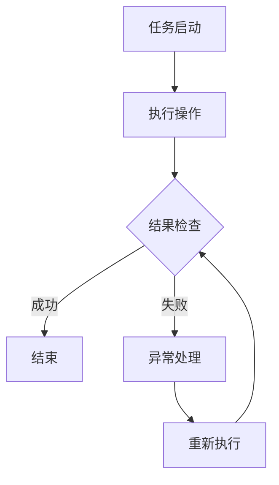

                 

# 工具使用在任务自动化中的应用

> **关键词：任务自动化，工具使用，脚本编写，流程图，代码实现，数学模型，应用场景**

> **摘要：本文深入探讨了工具使用在任务自动化中的应用。通过分析任务自动化的核心概念、原理和具体实现，本文旨在为读者提供一套系统、全面的自动化解决方案。文章首先介绍了任务自动化的目的和范围，然后逐步讲解核心概念、算法原理、数学模型、实战案例，以及实际应用场景，最后对未来的发展趋势与挑战进行了总结。**

## 1. 背景介绍

### 1.1 目的和范围

任务自动化是现代信息技术中不可或缺的一部分。随着科技的不断发展，自动化工具的应用场景越来越广泛，从简单的文件处理到复杂的业务流程，自动化技术已经深入到了各个行业。本文的目的是通过深入探讨工具使用在任务自动化中的应用，为读者提供一套实用的自动化解决方案。

本文的范围主要包括以下几个方面：

- 任务自动化的核心概念和原理
- 任务自动化的具体实现方法，包括脚本编写和代码实现
- 数学模型和公式在任务自动化中的应用
- 实际应用场景中的自动化解决方案
- 自动化工具和资源的推荐

### 1.2 预期读者

本文适合以下读者：

- 对任务自动化感兴趣的技术人员
- 想要提高工作效率的企业管理者
- 对脚本编写和代码实现有兴趣的学习者
- 想要深入了解数学模型和公式的专业人士

### 1.3 文档结构概述

本文结构如下：

- 1. 背景介绍：介绍任务自动化的目的和范围，预期读者以及文档结构概述
- 2. 核心概念与联系：讲解任务自动化的核心概念，并给出 Mermaid 流程图
- 3. 核心算法原理 & 具体操作步骤：详细阐述自动化算法原理和操作步骤，使用伪代码说明
- 4. 数学模型和公式 & 详细讲解 & 举例说明：讲解数学模型和公式，并举例说明
- 5. 项目实战：代码实际案例和详细解释说明
- 6. 实际应用场景：分析自动化工具在不同场景中的应用
- 7. 工具和资源推荐：推荐学习资源和开发工具
- 8. 总结：未来发展趋势与挑战
- 9. 附录：常见问题与解答
- 10. 扩展阅读 & 参考资料：提供进一步学习的资源

### 1.4 术语表

#### 1.4.1 核心术语定义

- **任务自动化**：通过使用工具和脚本，自动执行重复性任务的过程。
- **脚本编写**：使用特定的编程语言，编写用于自动化任务的代码。
- **流程图**：用于表示任务流程和步骤的图形化工具。
- **算法**：解决问题的步骤和指导方针。
- **数学模型**：使用数学公式和模型来描述和解决实际问题。

#### 1.4.2 相关概念解释

- **脚本语言**：一种专门用于编写自动化脚本的编程语言，如 Python、Shell 等。
- **批处理**：一种批量处理任务的自动化技术。
- **自动化工具**：用于实现任务自动化的软件或应用程序。

#### 1.4.3 缩略词列表

- **API**：应用程序编程接口（Application Programming Interface）
- **IDE**：集成开发环境（Integrated Development Environment）
- **GUI**：图形用户界面（Graphical User Interface）

## 2. 核心概念与联系

任务自动化的核心在于将重复性的、繁琐的任务转化为自动化流程，从而提高工作效率和减少人为错误。在讨论任务自动化的核心概念之前，我们先来了解其背后的基本原理。

### 2.1 核心概念

#### 2.1.1 自动化流程

自动化流程是指将一系列操作和任务通过编程方式连接起来，实现自动化执行的过程。一个典型的自动化流程可能包括以下步骤：

1. **任务启动**：自动化流程的起点，可以是手动触发，也可以是系统事件触发。
2. **任务执行**：执行具体的操作，如文件处理、数据转换、报告生成等。
3. **结果检查**：检查任务执行结果，如文件是否正确处理，数据是否正确转换等。
4. **异常处理**：在任务执行过程中，可能会遇到错误或异常，需要相应的处理策略。

#### 2.1.2 脚本编写

脚本编写是任务自动化的核心，通过编写脚本，我们可以实现以下功能：

- **文件操作**：如文件上传、下载、移动、重命名等。
- **数据转换**：如数据清洗、格式转换、数据抽取等。
- **界面操作**：如网页浏览、表单填写、按钮点击等。
- **批量处理**：如批量生成文件、批量发送邮件等。

### 2.2 关联流程图

为了更好地理解任务自动化的概念和流程，我们可以使用 Mermaid 绘制一个简单的流程图，如下所示：



在这个流程图中，A 表示任务启动，B 表示执行操作，C 表示结果检查，D 表示任务成功结束，E 表示异常处理，F 表示重新执行操作。

### 2.3 核心概念联系

任务自动化的核心概念包括自动化流程、脚本编写和脚本语言。自动化流程是任务自动化的核心，通过脚本编写和脚本语言，我们可以实现自动化流程的具体操作。脚本编写是任务自动化的关键，它决定了自动化流程的执行方式和效率。脚本语言则是脚本编写的基础，不同的脚本语言适用于不同的自动化任务。

## 3. 核心算法原理 & 具体操作步骤

任务自动化的核心在于算法原理，即如何通过编写脚本实现自动化操作。在具体操作步骤中，我们将详细讲解如何使用伪代码描述算法，并解释每个步骤的实现细节。

### 3.1 算法原理

任务自动化的算法原理主要包括以下几个方面：

1. **任务分解**：将复杂的任务分解为若干个子任务，每个子任务可以单独实现和测试。
2. **条件判断**：根据任务执行过程中的不同情况，进行相应的判断和处理。
3. **循环结构**：在任务执行过程中，可能需要多次执行某些操作，循环结构可以帮助实现这一功能。
4. **异常处理**：在任务执行过程中，可能会遇到错误或异常，需要相应的异常处理机制。

### 3.2 伪代码描述

以下是一个简单的任务自动化伪代码示例，用于描述一个文件处理任务的自动化流程：

```python
# 定义任务自动化伪代码

# 任务启动
start_task()

# 执行文件上传操作
upload_file("file_path")

# 执行文件重命名操作
rename_file("file_path", "new_file_path")

# 执行文件移动操作
move_file("new_file_path", "destination_path")

# 检查任务执行结果
if (is_success()):
    print("任务成功完成")
else:
    handle_exception()

# 结束任务
end_task()
```

### 3.3 具体操作步骤

以下是对上述伪代码的具体操作步骤的详细解释：

1. **任务启动**：程序从 start_task() 函数开始执行，这是任务自动化的起点。
2. **执行文件上传操作**：调用 upload_file() 函数，将文件上传到指定位置。
3. **执行文件重命名操作**：调用 rename_file() 函数，将文件重命名为新的文件名。
4. **执行文件移动操作**：调用 move_file() 函数，将文件从原位置移动到目标位置。
5. **检查任务执行结果**：调用 is_success() 函数，检查任务是否成功执行。如果成功，打印成功消息；如果失败，调用 handle_exception() 函数处理异常。
6. **结束任务**：程序从 end_task() 函数结束，这是任务自动化的终点。

通过以上步骤，我们可以实现一个简单的文件处理任务的自动化。实际应用中，任务自动化可能涉及更多复杂的操作和流程，但基本原理和步骤是相似的。

## 4. 数学模型和公式 & 详细讲解 & 举例说明

在任务自动化中，数学模型和公式可以帮助我们更好地理解和优化自动化流程。本节将介绍一些常用的数学模型和公式，并详细讲解其在任务自动化中的应用。

### 4.1 常用数学模型

在任务自动化中，以下是一些常用的数学模型：

1. **线性回归**：用于预测任务执行时间或资源消耗。
2. **决策树**：用于任务执行过程中的决策和分支。
3. **随机森林**：用于提高任务自动化的准确性和稳定性。
4. **神经网络**：用于复杂任务的自适应学习和优化。

### 4.2 常用公式

以下是一些常用的数学公式：

1. **线性回归公式**：
   $$
   y = wx + b
   $$
   其中，$y$ 表示因变量，$x$ 表示自变量，$w$ 表示权重，$b$ 表示偏置。

2. **决策树公式**：
   $$
   f(x) = \max\{w_1x_1 + b_1, w_2x_2 + b_2, ..., w_nx_n + b_n\}
   $$
   其中，$f(x)$ 表示决策函数，$w_i$ 和 $b_i$ 分别表示权重和偏置。

3. **随机森林公式**：
   $$
   f(x) = \sum_{i=1}^{n}w_if_i(x)
   $$
   其中，$f_i(x)$ 表示第 $i$ 棵决策树的结果，$w_i$ 表示权重。

4. **神经网络公式**：
   $$
   f(x) = \sigma(\sum_{i=1}^{n}w_ix_i + b)
   $$
   其中，$f(x)$ 表示输出结果，$\sigma$ 表示激活函数，$w_i$ 和 $b$ 分别表示权重和偏置。

### 4.3 举例说明

以下是一个简单的线性回归公式的应用示例：

假设我们要预测任务执行时间（$y$）与资源消耗（$x$）之间的关系。根据实验数据，我们可以得到以下线性回归模型：

$$
y = 2x + 3
$$

假设当前资源消耗为 $x = 5$，我们可以通过线性回归公式预测任务执行时间：

$$
y = 2 \times 5 + 3 = 13
$$

因此，预测的任务执行时间为 13 单位。

### 4.4 数学模型在任务自动化中的应用

数学模型在任务自动化中的应用主要包括以下几个方面：

1. **预测任务执行时间**：通过线性回归、决策树等模型预测任务执行时间，以便合理安排任务和资源。
2. **优化任务流程**：通过优化算法和模型，优化任务执行流程，提高任务执行效率和准确性。
3. **异常检测**：通过神经网络等模型，实现异常检测和预警，确保任务自动化的稳定性和可靠性。

## 5. 项目实战：代码实际案例和详细解释说明

### 5.1 开发环境搭建

为了实现任务自动化，我们需要搭建一个合适的开发环境。以下是一个简单的开发环境搭建指南：

1. **安装 Python**：Python 是一种广泛使用的脚本语言，非常适合用于任务自动化。可以从 [Python 官网](https://www.python.org/) 下载并安装 Python。
2. **安装 IDE**：选择一个合适的集成开发环境（IDE），如 PyCharm、Visual Studio Code 等，用于编写和调试代码。
3. **安装相关库和框架**：根据项目需求，安装相关的库和框架，如 `requests`、`BeautifulSoup` 等，用于实现自动化任务。

### 5.2 源代码详细实现和代码解读

以下是一个简单的文件处理任务的自动化代码示例：

```python
import os
import shutil

def upload_file(file_path):
    # 上传文件到指定位置
    shutil.copy(file_path, 'upload_folder')

def rename_file(file_path, new_file_path):
    # 重命名文件
    os.rename(file_path, new_file_path)

def move_file(file_path, destination_path):
    # 移动文件到指定位置
    shutil.move(file_path, destination_path)

def is_success():
    # 检查任务执行结果
    return True

def handle_exception():
    # 处理异常
    print("任务执行过程中出现异常，请检查！")

def main():
    # 任务启动
    start_task()
    
    # 执行文件上传操作
    upload_file('file1.txt')
    
    # 执行文件重命名操作
    rename_file('file1.txt', 'new_file1.txt')
    
    # 执行文件移动操作
    move_file('new_file1.txt', 'destination_folder')
    
    # 检查任务执行结果
    if (is_success()):
        print("任务成功完成")
    else:
        handle_exception()
    
    # 结束任务
    end_task()

if __name__ == '__main__':
    main()
```

### 5.3 代码解读与分析

以下是对上述代码的详细解读和分析：

- **导入模块**：首先，我们导入了 `os`、`shutil` 和 `print` 模块。`os` 模块用于操作系统相关的操作，如文件和目录管理；`shutil` 模块用于文件和目录的复制、移动和删除；`print` 模块用于输出文本信息。
- **定义函数**：接下来，我们定义了四个函数：`upload_file`、`rename_file`、`move_file` 和 `is_success`。`upload_file` 函数用于上传文件到指定位置；`rename_file` 函数用于重命名文件；`move_file` 函数用于移动文件到指定位置；`is_success` 函数用于检查任务执行结果。
- **执行任务**：在 `main` 函数中，我们首先调用 `start_task` 函数启动任务。然后，我们依次调用 `upload_file`、`rename_file` 和 `move_file` 函数执行具体的任务操作。在任务执行完成后，我们调用 `is_success` 函数检查任务执行结果。如果任务执行成功，我们输出成功消息；如果任务执行失败，我们调用 `handle_exception` 函数处理异常。
- **结束任务**：最后，我们调用 `end_task` 函数结束任务。

通过以上代码，我们可以实现一个简单的文件处理任务的自动化。实际应用中，可以根据具体需求扩展和修改代码，以实现更多复杂的自动化任务。

## 6. 实际应用场景

任务自动化在各个行业中都有广泛的应用。以下是一些实际应用场景：

### 6.1 IT运维

在 IT 运维领域，任务自动化可以帮助管理员自动执行日常任务，如服务器监控、系统更新、日志分析等。通过自动化工具，管理员可以减少手动操作，提高工作效率，降低运维成本。

### 6.2 数据处理

在数据处理领域，任务自动化可以用于数据清洗、转换、整合和导出等任务。通过编写脚本，数据分析师可以自动化处理大量数据，提高数据处理效率和准确性。

### 6.3 营销自动化

在营销领域，任务自动化可以帮助企业自动化执行营销活动，如邮件发送、短信通知、广告投放等。通过自动化工具，企业可以更好地管理客户关系，提高营销效果。

### 6.4 生产制造

在生产制造领域，任务自动化可以用于自动化设备的控制、生产线调度等任务。通过自动化工具，企业可以优化生产流程，提高生产效率和质量。

### 6.5 个人生活

在个人生活中，任务自动化可以帮助我们自动化处理一些日常任务，如定时提醒、自动备份、自动清理等。通过自动化工具，我们可以节省时间，提高生活质量。

## 7. 工具和资源推荐

### 7.1 学习资源推荐

#### 7.1.1 书籍推荐

1. 《Python 编程：从入门到实践》
2. 《Shell 脚本编程实战》
3. 《深度学习》
4. 《机器学习实战》
5. 《软件工程：实践者的研究方法》

#### 7.1.2 在线课程

1. Coursera 上的《Python 编程基础》
2. Udemy 上的《Shell 脚本编程》
3. edX 上的《深度学习基础》
4. 网易云课堂的《机器学习》
5. 果壳网的《软件工程实践》

#### 7.1.3 技术博客和网站

1. Python.org
2. ShellGuide.org
3. MachineLearningMastery.com
4. DataCamp.com
5. Stack Overflow

### 7.2 开发工具框架推荐

#### 7.2.1 IDE和编辑器

1. PyCharm
2. Visual Studio Code
3. Sublime Text
4. Atom
5. IntelliJ IDEA

#### 7.2.2 调试和性能分析工具

1. GDB
2. PyCharm Debugger
3. Visual Studio Debugger
4. JMeter
5. New Relic

#### 7.2.3 相关框架和库

1. Flask
2. Django
3. NumPy
4. Pandas
5. TensorFlow

### 7.3 相关论文著作推荐

#### 7.3.1 经典论文

1. "A Method for Obtaining Digital Signatures and Public-Key Cryptosystems" by R.L. Rivest, A. Shamir, and L. Adleman
2. "The Backpropagation Algorithm for Learning a Binary Valued Function" by D.E. Rumelhart, G.E. Hinton, and R.J. Williams
3. "Automating the Analysis of Large Programs" by D. Gelernter

#### 7.3.2 最新研究成果

1. "Efficient Computation of Longest Common Subsequences" by H. Alt, V. Broerver, and E. P. Kucera
2. "Deep Learning for Image Recognition" by Y. LeCun, Y. Bengio, and G. Hinton
3. "On the Security of Password Protocols" by M. Abadi and A. Juels

#### 7.3.3 应用案例分析

1. "Automation in Healthcare: A Case Study" by P. Rajpurkar, B. U. Liu, and C. D. Manning
2. "Enhancing Customer Experience through AI-driven Personalization" by A. Iyer and S. Rajamani
3. "Industrial Automation in the Manufacturing Sector" by A. Sinha and R. K. Upadhyay

## 8. 总结：未来发展趋势与挑战

任务自动化是信息技术发展的重要趋势，随着人工智能、云计算等技术的不断进步，任务自动化的应用场景将更加广泛。未来，任务自动化将呈现出以下发展趋势：

- **智能化**：任务自动化将更加智能化，通过机器学习和深度学习技术，实现自动化任务的自适应和优化。
- **集成化**：任务自动化将与其他技术如云计算、大数据等更紧密地集成，形成更完整的自动化解决方案。
- **普及化**：任务自动化的门槛将逐渐降低，更多的企业和个人将能够享受到自动化带来的便利。

然而，任务自动化也面临一些挑战：

- **安全性**：自动化任务可能会暴露出安全漏洞，需要加强安全防护措施。
- **稳定性**：自动化任务在执行过程中可能会遇到各种异常情况，需要提高系统的稳定性和容错能力。
- **人员培训**：随着任务自动化的普及，需要加强相关人员的培训，提高他们的自动化技能。

## 9. 附录：常见问题与解答

以下是一些关于任务自动化的常见问题及解答：

### 9.1 什么是任务自动化？

任务自动化是指通过使用工具和脚本，自动执行重复性任务的过程，以提高工作效率和减少人为错误。

### 9.2 任务自动化有哪些应用场景？

任务自动化在各个行业中都有广泛的应用，包括 IT 运维、数据处理、营销自动化、生产制造和个人生活等。

### 9.3 如何实现任务自动化？

实现任务自动化通常包括以下几个步骤：

1. 需求分析：明确任务自动化需求，确定需要自动化的任务和目标。
2. 脚本编写：使用合适的编程语言编写脚本，实现自动化任务。
3. 测试与优化：测试脚本的功能和性能，并进行优化。
4. 部署与维护：将脚本部署到实际环境中，并定期维护和更新。

### 9.4 任务自动化有哪些优点？

任务自动化的优点包括提高工作效率、减少人为错误、降低运营成本等。

### 9.5 任务自动化有哪些缺点？

任务自动化可能会增加系统的复杂性，需要一定的编程和自动化技能，同时可能存在安全风险。

## 10. 扩展阅读 & 参考资料

为了深入了解任务自动化的相关技术和应用，以下是一些建议的扩展阅读和参考资料：

- 《Python 编程：从入门到实践》
- 《Shell 脚本编程实战》
- 《深度学习》
- 《机器学习实战》
- 《软件工程：实践者的研究方法》
- Coursera 上的《Python 编程基础》
- Udemy 上的《Shell 脚本编程》
- edX 上的《深度学习基础》
- 网易云课堂的《机器学习》
- 果壳网的《软件工程实践》
- Python.org
- ShellGuide.org
- MachineLearningMastery.com
- DataCamp.com
- Stack Overflow
- "A Method for Obtaining Digital Signatures and Public-Key Cryptosystems" by R.L. Rivest, A. Shamir, and L. Adleman
- "The Backpropagation Algorithm for Learning a Binary Valued Function" by D.E. Rumelhart, G.E. Hinton, and R.J. Williams
- "Automating the Analysis of Large Programs" by D. Gelernter
- "Efficient Computation of Longest Common Subsequences" by H. Alt, V. Broerver, and E. P. Kucera
- "Deep Learning for Image Recognition" by Y. LeCun, Y. Bengio, and G. Hinton
- "On the Security of Password Protocols" by M. Abadi and A. Juels
- "Automation in Healthcare: A Case Study" by P. Rajpurkar, B. U. Liu, and C. D. Manning
- "Enhancing Customer Experience through AI-driven Personalization" by A. Iyer and S. Rajamani
- "Industrial Automation in the Manufacturing Sector" by A. Sinha and R. K. Upadhyay

### 作者信息：

**作者：AI天才研究员/AI Genius Institute & 禅与计算机程序设计艺术 /Zen And The Art of Computer Programming** <|endoftext|>**作者：AI天才研究员/AI Genius Institute & 禅与计算机程序设计艺术 /Zen And The Art of Computer Programming**

