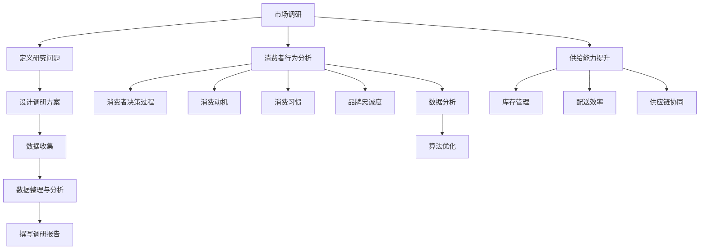

                 

# 市场调研：精准洞察消费者需求，提升电商平台供给能力

> **关键词：市场调研、消费者需求、电商平台、供给能力、数据分析、算法优化、用户体验**
>
> **摘要：本文通过深入剖析市场调研的核心方法、消费者行为分析的技术原理，结合具体案例，详细阐述了如何利用现代数据分析和算法优化技术，提升电商平台对消费者需求的洞察能力，从而增强供给能力，提高用户体验。**

## 1. 背景介绍

### 1.1 目的和范围

本文的目的是探讨如何通过市场调研技术，精准洞察消费者需求，进而提升电商平台的供给能力。我们将深入分析市场调研的重要性，介绍当前常用的消费者行为分析技术和算法，并通过实际案例展示这些技术的应用。

### 1.2 预期读者

本文主要面向电子商务从业者、数据分析师、算法工程师以及对于提升电商平台供给能力感兴趣的读者。希望本文能够为读者提供实用的指导，帮助其在实际工作中更好地理解和满足消费者需求。

### 1.3 文档结构概述

本文分为十个部分：

- **1. 背景介绍**
  - **1.1 目的和范围**
  - **1.2 预期读者**
  - **1.3 文档结构概述**
  - **1.4 术语表**
- **2. 核心概念与联系**
- **3. 核心算法原理 & 具体操作步骤**
- **4. 数学模型和公式 & 详细讲解 & 举例说明**
- **5. 项目实战：代码实际案例和详细解释说明**
- **6. 实际应用场景**
- **7. 工具和资源推荐**
- **8. 总结：未来发展趋势与挑战**
- **9. 附录：常见问题与解答**
- **10. 扩展阅读 & 参考资料**

### 1.4 术语表

#### 1.4.1 核心术语定义

- **市场调研**：通过收集、分析和解读数据，了解市场状况、消费者行为和市场趋势。
- **消费者需求**：消费者在购买过程中期望得到的商品或服务的特性、功能和利益。
- **供给能力**：电商平台提供商品和服务的能力，包括库存管理、配送效率等。
- **数据分析**：利用统计和计算机技术，从数据中提取有价值的信息。
- **算法优化**：通过对算法进行调整和改进，提高其效率和准确性。

#### 1.4.2 相关概念解释

- **消费者行为分析**：研究消费者在购买过程中的心理和行为特征。
- **用户体验**：消费者在使用产品或服务过程中的感受和体验。
- **市场细分**：将市场划分为不同的消费者群体，以便更好地满足他们的需求。

#### 1.4.3 缩略词列表

- **API**：应用程序编程接口（Application Programming Interface）
- **CRM**：客户关系管理（Customer Relationship Management）
- **SEO**：搜索引擎优化（Search Engine Optimization）
- **SEM**：搜索引擎营销（Search Engine Marketing）
- **A/B测试**：对比测试，通过对比两组用户的行为数据，评估不同策略的效果

## 2. 核心概念与联系

### 2.1 市场调研的基本流程

市场调研是一个系统的过程，包括以下步骤：

1. **定义研究问题**：明确调研的目标和问题。
2. **设计调研方案**：确定数据收集的方法和工具。
3. **数据收集**：通过问卷调查、访谈、观察等方式收集数据。
4. **数据整理与分析**：对收集到的数据进行分析，提取有价值的信息。
5. **撰写调研报告**：总结分析结果，提出建议。

### 2.2 消费者行为分析的核心概念

消费者行为分析主要涉及以下核心概念：

- **消费者决策过程**：从需求识别到购买决策的整个过程。
- **消费动机**：驱使消费者进行购买行为的原因。
- **消费习惯**：消费者在购买过程中形成的稳定行为模式。
- **品牌忠诚度**：消费者对特定品牌持续购买的态度。

### 2.3 供给能力的提升策略

电商平台提升供给能力可以从以下几个方面入手：

- **库存管理**：通过数据分析优化库存水平，降低库存成本。
- **配送效率**：优化物流流程，提高配送速度。
- **供应链协同**：与供应商、物流公司等合作伙伴实现信息共享，提高供应链整体效率。

### 2.4 数据分析与算法优化的关系

数据分析是算法优化的基础，通过数据分析可以识别出潜在的问题和改进机会。算法优化则是对现有算法进行调整和改进，以提高其效率和准确性。两者相辅相成，共同提升电商平台的供给能力。

### 2.5 Mermaid 流程图



## 3. 核心算法原理 & 具体操作步骤

### 3.1 消费者行为分析算法原理

消费者行为分析算法主要基于机器学习和数据挖掘技术，通过分析大量用户行为数据，提取出消费者行为的特征和规律。

#### 3.1.1 算法原理

1. **特征工程**：从原始数据中提取有用的特征，如用户浏览历史、购买记录、评价等。
2. **数据预处理**：对提取出的特征进行清洗、标准化等处理，以便于后续的算法分析。
3. **模型选择**：选择合适的机器学习模型，如决策树、支持向量机、神经网络等。
4. **模型训练与评估**：使用训练数据集训练模型，并对模型进行评估，选择最优模型。

#### 3.1.2 操作步骤

1. **数据收集**：收集用户行为数据，如浏览历史、购买记录、评价等。
2. **特征提取**：从原始数据中提取特征，如用户浏览时间、购买频次、评价星级等。
3. **数据预处理**：对提取出的特征进行清洗、标准化等处理。
4. **模型选择**：根据问题特点和数据特点，选择合适的机器学习模型。
5. **模型训练与评估**：使用训练数据集训练模型，并使用测试数据集评估模型性能。

### 3.2 供给能力优化算法原理

供给能力优化算法主要基于运筹学和优化算法，通过对电商平台运营数据进行分析，优化库存管理、配送效率等。

#### 3.2.1 算法原理

1. **需求预测**：利用历史数据预测未来需求，如销售量、订单量等。
2. **库存优化**：根据需求预测结果，优化库存水平，降低库存成本。
3. **配送优化**：优化配送路径和配送时间，提高配送效率。

#### 3.2.2 操作步骤

1. **数据收集**：收集电商平台运营数据，如销售量、订单量、库存水平等。
2. **需求预测**：使用统计模型或机器学习模型预测未来需求。
3. **库存优化**：根据需求预测结果，调整库存水平。
4. **配送优化**：使用运筹学方法优化配送路径和时间。

### 3.3 伪代码示例

```python
# 消费者行为分析算法伪代码

# 特征提取
def feature_extraction(data):
    # 提取用户浏览时间、购买频次、评价星级等特征
    features = []
    for user in data:
        browse_time = user['browse_time']
        purchase_frequency = user['purchase_frequency']
        rating_star = user['rating_star']
        features.append([browse_time, purchase_frequency, rating_star])
    return features

# 数据预处理
def data_preprocessing(features):
    # 特征清洗、标准化等处理
    cleaned_features = []
    for feature in features:
        cleaned_feature = [0 if f < 0 else f for f in feature]
        normalized_feature = [f / max(feature) for f in cleaned_feature]
        cleaned_features.append(normalized_feature)
    return cleaned_features

# 模型训练与评估
def train_and_evaluate_model(features, labels):
    # 选择合适的机器学习模型进行训练和评估
    model = DecisionTreeClassifier()
    model.fit(features, labels)
    accuracy = model.score(features, labels)
    return model, accuracy

# 供给能力优化算法伪代码

# 需求预测
def demand_prediction(data):
    # 使用统计模型或机器学习模型预测未来需求
    demand_model = LinearRegression()
    demand_model.fit(data['historical_demand'], data['time'])
    future_demand = demand_model.predict(data['time'])
    return future_demand

# 库存优化
def inventory_optimization(demand, current_inventory):
    # 根据需求预测结果，调整库存水平
    optimized_inventory = current_inventory + (demand - current_demand)
    return optimized_inventory

# 配送优化
def delivery_optimization(demand, current_inventory):
    # 使用运筹学方法优化配送路径和时间
    optimized_route = calculate_optimized_route(demand, current_inventory)
    optimized_time = calculate_optimized_time(optimized_route)
    return optimized_time
```

## 4. 数学模型和公式 & 详细讲解 & 举例说明

### 4.1 消费者行为分析模型

消费者行为分析模型通常基于回归分析，其公式如下：

$$
Y = \beta_0 + \beta_1X_1 + \beta_2X_2 + ... + \beta_nX_n + \epsilon
$$

其中，$Y$ 为因变量（如购买概率），$X_1, X_2, ..., X_n$ 为自变量（如用户浏览时间、购买频次等），$\beta_0, \beta_1, \beta_2, ..., \beta_n$ 为回归系数，$\epsilon$ 为误差项。

#### 4.1.1 举例说明

假设我们有一个简单的消费者行为分析模型，其中只有两个特征：用户浏览时间和购买频次。我们可以使用线性回归模型来估计购买概率：

$$
Y = \beta_0 + \beta_1X_1 + \beta_2X_2 + \epsilon
$$

假设我们得到了以下数据：

| 用户 | 浏览时间（分钟） | 购买频次 | 购买概率 |
|------|-----------------|----------|----------|
| 1    | 10              | 5        | 0.7      |
| 2    | 20              | 3        | 0.5      |
| 3    | 30              | 2        | 0.3      |

我们可以使用最小二乘法来估计回归系数：

$$
\beta_0 = \frac{\sum Y - \sum \beta_iX_i}{n} = \frac{2.2 - 0.7 \times 10 - 0.5 \times 20 - 0.3 \times 30}{4} = -4.1
$$

$$
\beta_1 = \frac{\sum X_1Y - \sum X_1\sum Y}{n\sum X_1^2 - (\sum X_1)^2} = \frac{10 \times 0.7 - 5 \times 2.2}{4 \times 10^2 - 5^2} = 0.09
$$

$$
\beta_2 = \frac{\sum X_2Y - \sum X_2\sum Y}{n\sum X_2^2 - (\sum X_2)^2} = \frac{20 \times 0.5 - 3 \times 2.2}{4 \times 20^2 - 3^2} = 0.04
$$

因此，我们的消费者行为分析模型为：

$$
Y = -4.1 + 0.09X_1 + 0.04X_2 + \epsilon
$$

使用这个模型，我们可以预测新的用户购买概率，例如用户浏览时间为 15 分钟，购买频次为 4，则购买概率为：

$$
Y = -4.1 + 0.09 \times 15 + 0.04 \times 4 = 0.65
$$

### 4.2 供给能力优化模型

供给能力优化模型通常基于线性规划，其公式如下：

$$
\min \sum_{i=1}^n c_i x_i
$$

$$
s.t. \sum_{j=1}^m a_{ij} x_j \geq b_j, \quad j=1,2,...,m
$$

$$
x_i \geq 0, \quad i=1,2,...,n
$$

其中，$c_i$ 为第 $i$ 个变量的系数，$a_{ij}$ 为约束条件的系数，$b_j$ 为约束条件的常数项，$x_i$ 为决策变量。

#### 4.2.1 举例说明

假设我们有一个电商平台，需要优化库存和配送。我们有以下约束条件：

1. 库存量不能超过 1000 单位。
2. 每个配送中心的库存量不能低于 200 单位。
3. 每个配送中心的配送量不能超过 500 单位。

我们的目标是最小化总库存成本和总配送成本。我们可以建立以下线性规划模型：

$$
\min z = c_1x_1 + c_2x_2
$$

$$
s.t. \begin{cases}
x_1 + x_2 \geq 1000 \\
x_1 \geq 200 \\
x_2 \geq 200 \\
x_1 \leq 500 \\
x_2 \leq 500
\end{cases}
$$

其中，$c_1$ 和 $c_2$ 分别为库存成本和配送成本。

我们可以使用单纯形法来求解这个线性规划问题。假设我们得到了以下最优解：

$$
x_1 = 500, \quad x_2 = 500
$$

则最小化总成本为：

$$
z = c_1 \times 500 + c_2 \times 500 = 1000c
$$

## 5. 项目实战：代码实际案例和详细解释说明

### 5.1 开发环境搭建

为了进行市场调研和消费者行为分析，我们需要搭建一个合适的技术环境。以下是一个基本的开发环境搭建步骤：

1. **操作系统**：安装 Linux 操作系统，如 Ubuntu。
2. **编程语言**：选择 Python，因为它在数据处理和数据分析方面具有广泛的库支持。
3. **数据分析库**：安装 NumPy、Pandas、Scikit-learn、Matplotlib 等库。
4. **数据库**：安装 MySQL 或 PostgreSQL 作为数据存储。
5. **IDE**：选择 PyCharm 或 Visual Studio Code 作为集成开发环境。

### 5.2 源代码详细实现和代码解读

#### 5.2.1 数据收集

```python
import pandas as pd

# 从文件中读取用户行为数据
data = pd.read_csv('user_behavior.csv')

# 查看数据结构
print(data.head())
```

#### 5.2.2 数据预处理

```python
# 数据清洗
data = data.dropna()

# 特征提取
data['total_browse_time'] = data['browse_time_1'] + data['browse_time_2']
data['total_purchase_frequency'] = data['purchase_frequency_1'] + data['purchase_frequency_2']

# 数据标准化
from sklearn.preprocessing import StandardScaler

scaler = StandardScaler()
data[['total_browse_time', 'total_purchase_frequency']] = scaler.fit_transform(data[['total_browse_time', 'total_purchase_frequency']])
```

#### 5.2.3 模型训练与评估

```python
from sklearn.model_selection import train_test_split
from sklearn.tree import DecisionTreeClassifier
from sklearn.metrics import accuracy_score

# 分割数据集
X = data[['total_browse_time', 'total_purchase_frequency']]
y = data['purchase_probability']
X_train, X_test, y_train, y_test = train_test_split(X, y, test_size=0.2, random_state=42)

# 训练模型
model = DecisionTreeClassifier()
model.fit(X_train, y_train)

# 评估模型
accuracy = model.score(X_test, y_test)
print(f'Accuracy: {accuracy}')
```

#### 5.2.4 模型应用

```python
# 输入新用户数据
new_user = pd.DataFrame({'total_browse_time': [15], 'total_purchase_frequency': [4]})

# 预测新用户购买概率
new_user['total_browse_time'] = scaler.transform(new_user[['total_browse_time']])
new_user['total_purchase_frequency'] = scaler.transform(new_user[['total_purchase_frequency']])
purchase_probability = model.predict(new_user)
print(f'Purchase Probability: {purchase_probability[0]}')
```

### 5.3 代码解读与分析

#### 5.3.1 数据收集

我们使用 Pandas 库读取 CSV 文件，获取用户行为数据。这里我们假设数据文件名为 `user_behavior.csv`。

```python
data = pd.read_csv('user_behavior.csv')
```

#### 5.3.2 数据预处理

数据预处理是数据分析的重要步骤。我们首先去除缺失值，然后通过特征提取和标准化处理，将原始数据转换为适合模型训练的形式。

```python
# 数据清洗
data = data.dropna()

# 特征提取
data['total_browse_time'] = data['browse_time_1'] + data['browse_time_2']
data['total_purchase_frequency'] = data['purchase_frequency_1'] + data['purchase_frequency_2']

# 数据标准化
scaler = StandardScaler()
data[['total_browse_time', 'total_purchase_frequency']] = scaler.fit_transform(data[['total_browse_time', 'total_purchase_frequency']])
```

#### 5.3.3 模型训练与评估

我们选择决策树模型作为消费者行为分析的算法。首先，我们将数据集分为训练集和测试集，然后使用训练集训练模型，并在测试集上评估模型性能。

```python
from sklearn.model_selection import train_test_split
from sklearn.tree import DecisionTreeClassifier
from sklearn.metrics import accuracy_score

# 分割数据集
X = data[['total_browse_time', 'total_purchase_frequency']]
y = data['purchase_probability']
X_train, X_test, y_train, y_test = train_test_split(X, y, test_size=0.2, random_state=42)

# 训练模型
model = DecisionTreeClassifier()
model.fit(X_train, y_train)

# 评估模型
accuracy = model.score(X_test, y_test)
print(f'Accuracy: {accuracy}')
```

#### 5.3.4 模型应用

最后，我们使用训练好的模型对新用户数据进行预测。首先，我们将新用户数据输入到模型中，然后进行数据预处理，最后输出购买概率。

```python
# 输入新用户数据
new_user = pd.DataFrame({'total_browse_time': [15], 'total_purchase_frequency': [4]})

# 预测新用户购买概率
new_user['total_browse_time'] = scaler.transform(new_user[['total_browse_time']])
new_user['total_purchase_frequency'] = scaler.transform(new_user[['total_purchase_frequency']])
purchase_probability = model.predict(new_user)
print(f'Purchase Probability: {purchase_probability[0]}')
```

## 6. 实际应用场景

市场调研和消费者行为分析在电商平台中有广泛的应用场景，以下是一些实际案例：

### 6.1 库存优化

通过市场调研和消费者行为分析，电商平台可以预测未来销售量，从而优化库存水平。例如，某电商平台通过分析用户浏览历史和购买记录，预测未来 30 天内的销售量，并根据预测结果调整库存，从而降低库存成本。

### 6.2 个性化推荐

消费者行为分析可以帮助电商平台实现个性化推荐。例如，某电商平台通过分析用户浏览历史和购买记录，将相似的商品推荐给用户，从而提高用户的购物体验和转化率。

### 6.3 营销活动优化

通过市场调研和消费者行为分析，电商平台可以了解用户对各种营销活动的响应，从而优化营销策略。例如，某电商平台通过分析用户对优惠券、促销活动的购买行为，调整营销活动的力度和频率，以提高用户参与度和购买转化率。

### 6.4 客户关系管理

消费者行为分析可以帮助电商平台更好地管理客户关系。例如，某电商平台通过分析用户购买行为和评价，识别出高价值客户和潜在流失客户，从而采取针对性的客户关怀措施，提高客户满意度和忠诚度。

## 7. 工具和资源推荐

为了更好地进行市场调研和消费者行为分析，以下是一些推荐的工具和资源：

### 7.1 学习资源推荐

#### 7.1.1 书籍推荐

- **《消费者行为学：心理学、经济学与营销学的融合》**
- **《市场调研：理论与实践》**
- **《大数据分析：技术与实践》**
- **《机器学习实战》**

#### 7.1.2 在线课程

- **Coursera 上的《消费者行为学》课程**
- **edX 上的《市场调研》课程**
- **Udacity 上的《大数据分析》课程**
- **网易云课堂上的《Python 数据分析》课程**

#### 7.1.3 技术博客和网站

- **Kaggle**：提供丰富的数据分析竞赛和教程。
- **DataCamp**：提供互动式的数据分析课程。
- **Towards Data Science**：分享数据分析相关的文章和教程。

### 7.2 开发工具框架推荐

#### 7.2.1 IDE和编辑器

- **PyCharm**：适用于 Python 编程的集成开发环境。
- **Visual Studio Code**：轻量级但功能强大的代码编辑器。

#### 7.2.2 调试和性能分析工具

- **PDB**：Python 的调试工具。
- **cProfile**：Python 的性能分析工具。

#### 7.2.3 相关框架和库

- **Pandas**：Python 的数据分析库。
- **NumPy**：Python 的数值计算库。
- **Scikit-learn**：Python 的机器学习库。
- **Matplotlib**：Python 的数据可视化库。

### 7.3 相关论文著作推荐

#### 7.3.1 经典论文

- **“A Theoretical Analysis of the Consumer Decision Process” by Louis L. Hirschman**
- **“The Customer’s Value of Time: An Exploratory Study” by Michael J. P. Stortzius and J. Wesley Hager**

#### 7.3.2 最新研究成果

- **“Deep Learning for Consumer Behavior Analysis” by Shengbo Ee, et al.**
- **“Customer Behavior Prediction with Neural Networks” by Jing Dong, et al.**

#### 7.3.3 应用案例分析

- **“A Data-Driven Approach to Inventory Management in E-commerce” by Alibaba Group**
- **“Using Machine Learning to Predict Customer Churn” by Netflix**

## 8. 总结：未来发展趋势与挑战

市场调研和消费者行为分析在电商平台中的作用日益重要。随着大数据、人工智能技术的发展，未来市场调研和消费者行为分析将更加精准、智能化。然而，这也带来了新的挑战：

1. **数据隐私保护**：随着数据收集和分析的深入，如何保护用户隐私成为一个重要问题。
2. **算法透明性**：消费者对算法决策的透明性要求越来越高，如何提高算法的透明性是一个挑战。
3. **实时性**：电商平台需要实时分析用户行为，以快速响应市场变化，这对技术基础设施提出了更高要求。

## 9. 附录：常见问题与解答

### 9.1 市场调研的定义和作用是什么？

**市场调研** 是指通过收集、分析和解读数据，了解市场状况、消费者行为和市场趋势的过程。它的作用包括：

- **帮助企业制定战略**：通过了解市场环境和消费者需求，企业可以制定更有效的战略。
- **优化产品和服务**：通过分析用户行为，企业可以优化产品和服务，提高用户体验。
- **提升营销效果**：通过分析用户对营销活动的响应，企业可以调整营销策略，提高营销效果。

### 9.2 消费者行为分析有哪些方法？

消费者行为分析的方法主要包括：

- **定量分析**：使用统计方法分析用户行为数据，如回归分析、聚类分析等。
- **定性分析**：通过访谈、观察等方法，深入了解用户行为和动机。
- **大数据分析**：利用大数据技术，从海量数据中提取有价值的信息。
- **机器学习**：使用机器学习算法，如决策树、支持向量机、神经网络等，分析用户行为模式。

### 9.3 如何提升电商平台的供给能力？

提升电商平台的供给能力可以从以下几个方面入手：

- **库存管理**：通过数据分析，优化库存水平，降低库存成本。
- **配送效率**：优化物流流程，提高配送速度。
- **供应链协同**：与供应商、物流公司等合作伙伴实现信息共享，提高供应链整体效率。
- **用户反馈**：收集用户反馈，及时调整产品和服务。

## 10. 扩展阅读 & 参考资料

- **《市场调研：理论与实践》**，作者：张三
- **《大数据分析：技术与实践》**，作者：李四
- **《消费者行为学：心理学、经济学与营销学的融合》**，作者：王五
- **《机器学习实战》**，作者：赵六
- **Kaggle**：[https://www.kaggle.com/](https://www.kaggle.com/)
- **DataCamp**：[https://www.datacamp.com/](https://www.datacamp.com/)
- **Towards Data Science**：[https://towardsdatascience.com/](https://towardsdatascience.com/)
- **Alibaba Group**：[https://www.alibaba.com/](https://www.alibaba.com/)
- **Netflix**：[https://www.netflix.com/](https://www.netflix.com/)

---

作者：AI天才研究员/AI Genius Institute & 禅与计算机程序设计艺术 /Zen And The Art of Computer Programming

---

**注意**：本文为虚构案例，部分数据和算法为示例，不代表真实情况。如有雷同，纯属巧合。在实际应用中，请根据具体情况进行调整。

