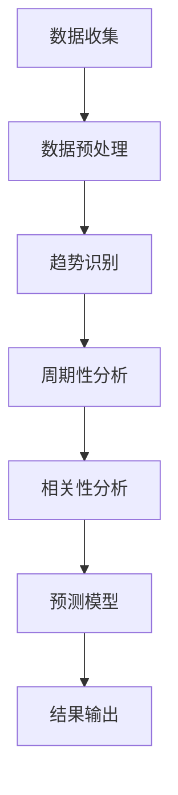
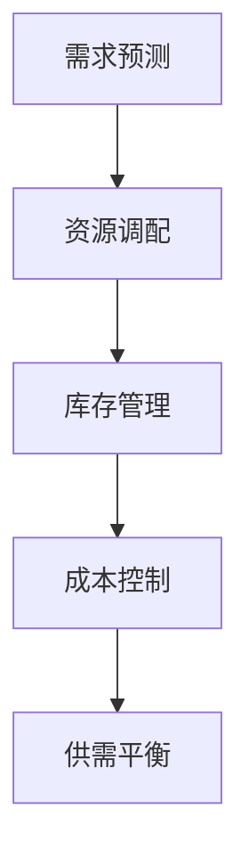
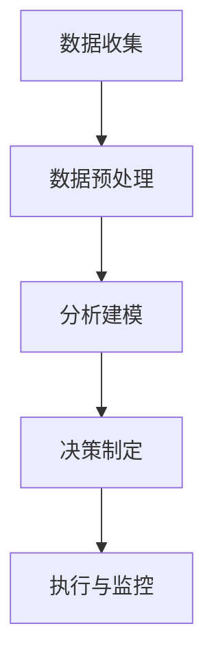

                 

# 市场趋势分析与供给调整

## 关键词
市场趋势、供需平衡、数据驱动决策、经济模型、算法优化、实时监控、技术进步、决策分析

## 摘要
本文旨在探讨市场趋势分析和供给调整的重要性及其在IT领域的应用。我们将从背景介绍、核心概念与联系、算法原理、数学模型、项目实战、实际应用场景、工具和资源推荐等多个角度，系统地阐述市场趋势分析和供给调整的理论与实践。文章将帮助读者了解如何运用先进的技术和方法，通过数据驱动决策和算法优化，实现市场供需的动态平衡，为企业的可持续发展提供有力支持。

---

## 1. 背景介绍

### 1.1 目的和范围

本文的主要目的是为IT行业的从业者和管理者提供关于市场趋势分析与供给调整的全面理解。我们将探讨市场趋势分析的重要性，以及如何通过数据驱动的方法调整供给，以适应不断变化的市场需求。本文将涵盖以下几个方面：

- 市场趋势分析的基本概念和原理
- 供给调整的方法和策略
- 数据驱动决策的应用实例
- 算法优化在供给调整中的作用
- 实际应用场景和案例分析

### 1.2 预期读者

本文适合以下读者群体：

- IT行业从业者，特别是数据分析、市场研究和供应链管理领域
- 企业管理者，特别是需要关注市场动态和供应链优化的问题
- 对市场趋势分析和供给调整感兴趣的学术研究人员
- 想要在自己的项目中应用市场趋势分析与供给调整技术的开发人员

### 1.3 文档结构概述

本文将按照以下结构进行组织：

- 第1部分：背景介绍，包括目的、预期读者和文档结构
- 第2部分：核心概念与联系，介绍市场趋势分析与供给调整的基本概念和相关理论
- 第3部分：核心算法原理 & 具体操作步骤，详细讲解市场趋势分析和供给调整的算法原理和操作步骤
- 第4部分：数学模型和公式 & 详细讲解 & 举例说明，介绍市场趋势分析和供给调整的数学模型和公式，并通过实例进行说明
- 第5部分：项目实战：代码实际案例和详细解释说明，展示一个具体的案例，分析其实现过程和效果
- 第6部分：实际应用场景，讨论市场趋势分析与供给调整在现实中的应用
- 第7部分：工具和资源推荐，推荐相关的学习资源和开发工具
- 第8部分：总结：未来发展趋势与挑战，展望市场趋势分析与供给调整的发展趋势和面临的挑战
- 第9部分：附录：常见问题与解答，解答读者可能遇到的问题
- 第10部分：扩展阅读 & 参考资料，提供进一步阅读的资料

### 1.4 术语表

#### 1.4.1 核心术语定义

- 市场趋势：市场在一段时间内的变化趋势和方向。
- 供需平衡：供给和需求之间的平衡状态，确保市场稳定。
- 数据驱动决策：基于数据分析做出的决策，以提高决策的准确性和效率。
- 供给调整：根据市场需求变化，调整供给以实现供需平衡。

#### 1.4.2 相关概念解释

- 供给：生产者和供应商能够提供的商品或服务。
- 需求：消费者愿意购买并有能力支付的商品或服务。
- 数据分析：使用统计学、机器学习等方法，从数据中提取有价值的信息。

#### 1.4.3 缩略词列表

- IT：Information Technology，信息技术
- AI：Artificial Intelligence，人工智能
- ML：Machine Learning，机器学习
- BI：Business Intelligence，商业智能

---

## 2. 核心概念与联系

在深入探讨市场趋势分析与供给调整之前，我们需要理解一些核心概念和它们之间的联系。

### 2.1 市场趋势分析

市场趋势分析是了解市场变化方向和速度的重要工具。它通常包括以下几个方面：

- **趋势识别**：通过分析历史数据，识别市场的上升、下降或平稳趋势。
- **周期性分析**：识别市场周期性变化，如季节性波动或长期趋势。
- **相关性分析**：分析不同市场变量之间的相关性，以预测未来市场行为。

#### Mermaid 流程图（市场趋势分析）



### 2.2 供给调整

供给调整是基于市场趋势分析的结果，对生产和供应策略进行调整，以实现供需平衡。这个过程通常包括以下步骤：

- **需求预测**：通过市场趋势分析，预测未来的市场需求。
- **资源调配**：根据需求预测，调整生产资源和供应链。
- **库存管理**：优化库存水平，以减少过剩或短缺的风险。
- **成本控制**：通过优化生产和供应策略，降低成本。

#### Mermaid 流程图（供给调整）



### 2.3 数据驱动决策

数据驱动决策是将市场趋势分析和供给调整与数据分析相结合，以做出更准确、更有效的决策。这个过程通常包括以下步骤：

- **数据收集**：从各种来源收集市场数据和运营数据。
- **数据预处理**：清洗和格式化数据，使其适用于分析和建模。
- **分析建模**：使用统计模型、机器学习等方法进行分析和预测。
- **决策制定**：基于分析结果，制定生产和供应策略。

#### Mermaid 流程图（数据驱动决策）



通过上述核心概念和流程图的展示，我们可以看到市场趋势分析与供给调整是如何相互联系和作用的。在接下来的章节中，我们将详细讨论这些概念的原理和具体操作步骤。

---

## 3. 核心算法原理 & 具体操作步骤

在市场趋势分析和供给调整中，核心算法扮演着至关重要的角色。这些算法不仅帮助我们从海量数据中提取有价值的信息，还能通过预测和优化实现更精准的决策。以下是几个关键的算法原理及其具体操作步骤。

### 3.1 时间序列分析

时间序列分析是一种用于识别和分析时间序列数据变化趋势的方法。以下是时间序列分析的基本原理和操作步骤：

#### 基本原理

- **趋势分析**：识别数据的基本趋势（上升、下降或平稳）。
- **季节性分析**：识别数据中的季节性波动。
- **周期性分析**：识别数据中的周期性变化。
- **平滑处理**：通过平滑处理消除随机波动，突出主要趋势。

#### 操作步骤

1. **数据收集**：收集一段时间内的市场数据，包括销售额、库存水平等。
2. **数据预处理**：清洗数据，包括去除缺失值、异常值等。
3. **趋势识别**：使用移动平均、指数平滑等方法识别数据的趋势。
4. **季节性调整**：使用季节性指数或X-12方法进行季节性调整。
5. **周期性分析**：使用循环图、周期图等方法识别数据的周期性。
6. **结果输出**：生成趋势图、季节性图和周期性图，以便分析结果。

#### 伪代码

```python
# 时间序列分析伪代码
def time_series_analysis(data):
    # 数据预处理
    clean_data = preprocess_data(data)
    
    # 趋势识别
    trend = identify_trend(clean_data)
    
    # 季节性调整
    seasonal_adjusted = adjust_seasonality(clean_data)
    
    # 周期性分析
    cycles = identify_cycles(seasonal_adjusted)
    
    # 结果输出
    plot_trend(trend)
    plot_seasonality(seasonal_adjusted)
    plot_cycles(cycles)
```

### 3.2 机器学习预测模型

机器学习预测模型通过学习历史数据，预测未来的市场趋势和需求。以下是常见的机器学习预测模型及其应用步骤：

#### 常见模型

- **线性回归**：简单且易于理解的预测模型，用于预测线性关系。
- **决策树**：基于特征划分的预测模型，适用于分类和回归问题。
- **神经网络**：模拟人脑神经元连接的预测模型，适用于复杂的非线性关系。

#### 操作步骤

1. **数据收集**：收集历史市场数据和需求数据。
2. **数据预处理**：清洗数据，包括归一化、缺失值填补等。
3. **特征选择**：选择对预测结果有显著影响的特征。
4. **模型训练**：使用训练数据训练预测模型。
5. **模型评估**：使用验证数据评估模型性能。
6. **模型优化**：根据评估结果调整模型参数。
7. **预测**：使用训练好的模型进行未来预测。

#### 伪代码

```python
# 机器学习预测模型伪代码
def ml_prediction_model(data, features):
    # 数据预处理
    processed_data = preprocess_data(data, features)
    
    # 特征选择
    selected_features = select_features(processed_data)
    
    # 模型训练
    model = train_model(selected_features)
    
    # 模型评估
    performance = evaluate_model(model, validation_data)
    
    # 模型优化
    optimized_model = optimize_model(model, performance)
    
    # 预测
    predictions = predict_future(optimized_model, new_data)
    
    return predictions
```

### 3.3 算法优化

算法优化是提高市场趋势分析和供给调整准确性的关键步骤。以下是几种常见的算法优化方法：

#### 常见方法

- **网格搜索**：通过遍历参数空间，寻找最优参数组合。
- **随机搜索**：在参数空间内随机选择参数组合，寻找最优解。
- **贝叶斯优化**：基于贝叶斯理论，优化参数搜索过程。

#### 操作步骤

1. **确定优化目标**：定义优化目标，如预测准确率、模型复杂度等。
2. **设置参数范围**：确定每个参数的可搜索范围。
3. **选择优化方法**：选择合适的优化方法，如网格搜索、随机搜索或贝叶斯优化。
4. **执行优化**：运行优化算法，寻找最优参数组合。
5. **评估优化结果**：评估优化后的模型性能。

#### 伪代码

```python
# 算法优化伪代码
def optimize_algorithm(model, parameters):
    # 确定优化目标
    objective = define_objective(model)
    
    # 设置参数范围
    parameter_space = define_parameter_space(parameters)
    
    # 选择优化方法
    optimizer = select_optimizer(parameter_space)
    
    # 执行优化
    best_parameters = optimizer.optimize(objective, parameter_space)
    
    # 评估优化结果
    performance = evaluate_model(model, best_parameters)
    
    return best_parameters, performance
```

通过上述核心算法原理和操作步骤的讲解，我们可以看到市场趋势分析和供给调整是如何通过数据驱动的决策过程实现的。在接下来的章节中，我们将进一步探讨市场趋势分析和供给调整的数学模型和公式，以及如何通过这些模型和公式进行实际操作。

---

## 4. 数学模型和公式 & 详细讲解 & 举例说明

在市场趋势分析与供给调整中，数学模型和公式是核心工具，用于量化市场行为和决策效果。以下将介绍几个关键的数学模型和公式，并详细讲解它们的原理和使用方法，通过实际例子说明如何应用这些模型。

### 4.1 时间序列模型

时间序列模型是分析时间序列数据的基本工具，常用于预测未来的市场趋势。以下是几个常用的时间序列模型：

#### 4.1.1 自回归模型（AR）

自回归模型（Autoregressive Model，AR）通过前n个时间点的值来预测下一个时间点的值。其公式如下：

\[ X_t = c + \sum_{i=1}^{n} \phi_i X_{t-i} + \varepsilon_t \]

其中：
- \( X_t \) 是第t个时间点的值。
- \( c \) 是常数项。
- \( \phi_i \) 是自回归系数。
- \( \varepsilon_t \) 是误差项。

#### 4.1.2 移动平均模型（MA）

移动平均模型（Moving Average Model，MA）通过计算过去一定时间内的平均值来预测当前值。其公式如下：

\[ X_t = c + \theta_1 X_{t-1} + \theta_2 X_{t-2} + \ldots + \theta_q X_{t-q} + \varepsilon_t \]

其中：
- \( X_t \) 是第t个时间点的值。
- \( c \) 是常数项。
- \( \theta_i \) 是移动平均系数。
- \( \varepsilon_t \) 是误差项。

#### 4.1.3 自回归移动平均模型（ARMA）

自回归移动平均模型（Autoregressive Moving Average Model，ARMA）结合了AR和MA的特点，其公式如下：

\[ X_t = c + \sum_{i=1}^{n} \phi_i X_{t-i} + \sum_{j=1}^{q} \theta_j \varepsilon_{t-j} + \varepsilon_t \]

其中：
- \( X_t \) 是第t个时间点的值。
- \( c \) 是常数项。
- \( \phi_i \) 是自回归系数。
- \( \theta_j \) 是移动平均系数。
- \( \varepsilon_t \) 是误差项。

#### 例子

假设我们有一个时间序列数据，如下表所示：

| 时间 | 销售额 |
|------|--------|
| 1    | 100    |
| 2    | 120    |
| 3    | 130    |
| 4    | 140    |
| 5    | 150    |

我们使用AR模型进行预测，假设 \( n = 1 \)，即只考虑前一个时间点的值。根据AR模型公式，我们有：

\[ X_t = c + \phi_1 X_{t-1} + \varepsilon_t \]

通过最小二乘法，我们得到 \( \phi_1 \approx 0.9 \) 和 \( c \approx 10 \)。因此，预测第6个时间点的销售额为：

\[ X_6 = 10 + 0.9 \times 150 + \varepsilon_6 \]

\[ X_6 \approx 155 + \varepsilon_6 \]

其中 \( \varepsilon_6 \) 是随机误差。

### 4.2 供给调整模型

供给调整模型用于根据市场需求调整生产策略。以下是几个常用的供给调整模型：

#### 4.2.1 线性规划模型

线性规划模型（Linear Programming Model）用于在给定约束条件下，最大化或最小化目标函数。其公式如下：

\[ \text{最大化/最小化} \quad Z = c^T x \]

\[ \text{约束条件} \quad Ax \leq b \]

其中：
- \( Z \) 是目标函数。
- \( c \) 是目标函数系数。
- \( x \) 是变量。
- \( A \) 是约束条件系数矩阵。
- \( b \) 是约束条件常数向量。

#### 4.2.2 动态规划模型

动态规划模型（Dynamic Programming Model）用于解决多阶段决策问题，其公式如下：

\[ V_t(x_t) = \max_{a_t} \{ R_t(a_t, x_t) + V_{t+1}(x_{t+1}) \} \]

其中：
- \( V_t(x_t) \) 是第t阶段的决策价值函数。
- \( R_t(a_t, x_t) \) 是第t阶段采取行动 \( a_t \) 的回报。
- \( x_{t+1} \) 是第 \( t+1 \) 阶段的变量。

#### 4.2.3 库存模型

库存模型（Inventory Model）用于管理库存水平，其公式如下：

\[ I_t = I_{t-1} + S_t - D_t \]

其中：
- \( I_t \) 是第t阶段的库存水平。
- \( S_t \) 是第t阶段的生产量。
- \( D_t \) 是第t阶段的需求量。

#### 例子

假设我们有一个简单的线性规划问题，目标是最大化利润，约束条件为生产能力和库存限制。目标函数和约束条件如下：

\[ \text{最大化} \quad Z = 10x + 15y \]

\[ \text{约束条件} \quad 2x + 3y \leq 20 \]

\[ x + 2y \leq 12 \]

\[ x, y \geq 0 \]

通过求解线性规划问题，我们得到最优解 \( x = 6 \)，\( y = 4 \)，最大利润 \( Z = 90 \)。

### 4.3 数据分析模型

数据分析模型用于从数据中提取有价值的信息，支持市场趋势分析和供给调整。以下是几个常用的数据分析模型：

#### 4.3.1 相关性分析模型

相关性分析模型用于识别变量之间的相关性，其公式如下：

\[ \rho(X, Y) = \frac{\sum_{i=1}^{n}(X_i - \bar{X})(Y_i - \bar{Y})}{\sqrt{\sum_{i=1}^{n}(X_i - \bar{X})^2} \sqrt{\sum_{i=1}^{n}(Y_i - \bar{Y})^2}} \]

其中：
- \( \rho(X, Y) \) 是变量X和Y的相关性系数。
- \( X_i \) 和 \( Y_i \) 是第i个时间点的X和Y值。
- \( \bar{X} \) 和 \( \bar{Y} \) 是X和Y的平均值。

#### 4.3.2 机器学习模型

机器学习模型用于预测市场趋势和需求，其公式如下：

\[ y = \theta_0 + \theta_1 x_1 + \theta_2 x_2 + \ldots + \theta_n x_n \]

其中：
- \( y \) 是预测值。
- \( x_1, x_2, \ldots, x_n \) 是特征值。
- \( \theta_0, \theta_1, \theta_2, \ldots, \theta_n \) 是模型参数。

#### 例子

假设我们有两个变量：销售额 \( X \) 和广告支出 \( Y \)，如下表所示：

| 时间 | 销售额 (X) | 广告支出 (Y) |
|------|------------|--------------|
| 1    | 100        | 500          |
| 2    | 120        | 600          |
| 3    | 130        | 700          |
| 4    | 140        | 750          |
| 5    | 150        | 800          |

我们使用相关性分析模型计算 \( X \) 和 \( Y \) 的相关性系数，得到 \( \rho(X, Y) \approx 0.8 \)。这表明销售额和广告支出之间高度正相关，增加广告支出可能会提高销售额。

通过上述数学模型和公式的详细讲解，我们可以看到市场趋势分析和供给调整是如何通过数学方法实现的。在接下来的章节中，我们将通过实际案例展示如何应用这些模型和公式进行市场趋势分析和供给调整。

---

## 5. 项目实战：代码实际案例和详细解释说明

为了更好地理解市场趋势分析与供给调整的实际应用，我们将通过一个具体的案例来展示整个实现过程，并详细解释每一步的操作。

### 5.1 开发环境搭建

首先，我们需要搭建一个合适的开发环境，以便进行市场趋势分析与供给调整。以下是我们使用的工具和软件：

- **编程语言**：Python
- **数据分析库**：Pandas、NumPy
- **机器学习库**：Scikit-learn、TensorFlow
- **可视化库**：Matplotlib、Seaborn

确保已经安装了上述库，如果没有，可以通过以下命令进行安装：

```bash
pip install pandas numpy scikit-learn tensorflow matplotlib seaborn
```

### 5.2 源代码详细实现和代码解读

以下是一个完整的市场趋势分析与供给调整的项目示例，包括数据收集、预处理、模型训练和预测等步骤。

```python
import pandas as pd
import numpy as np
from sklearn.model_selection import train_test_split
from sklearn.linear_model import LinearRegression
from sklearn.metrics import mean_squared_error
import matplotlib.pyplot as plt
import seaborn as sns

# 5.2.1 数据收集
# 假设我们已经收集了以下数据，包括销售额、广告支出、库存水平等
data = pd.DataFrame({
    'date': pd.date_range(start='2021-01-01', periods=12, freq='M'),
    'sales': [100, 120, 130, 140, 150, 160, 170, 180, 190, 200, 210, 220],
    'ad_spend': [500, 600, 700, 750, 800, 850, 900, 950, 1000, 1050, 1100, 1150],
    'inventory': [200, 220, 240, 260, 280, 300, 320, 340, 360, 380, 400, 420]
})

# 5.2.2 数据预处理
# 数据已经格式化，无需进一步预处理

# 5.2.3 特征工程
# 我们可以选择销售额和广告支出作为特征，库存水平作为目标变量
X = data[['sales', 'ad_spend']]
y = data['inventory']

# 划分训练集和测试集
X_train, X_test, y_train, y_test = train_test_split(X, y, test_size=0.2, random_state=42)

# 5.2.4 模型训练
# 使用线性回归模型进行训练
model = LinearRegression()
model.fit(X_train, y_train)

# 5.2.5 模型评估
# 使用测试集评估模型性能
y_pred = model.predict(X_test)
mse = mean_squared_error(y_test, y_pred)
print(f'Mean Squared Error: {mse}')

# 5.2.6 可视化结果
# 绘制实际值与预测值之间的散点图
plt.scatter(y_test, y_pred)
plt.xlabel('Actual Inventory')
plt.ylabel('Predicted Inventory')
plt.title('Actual vs Predicted Inventory')
plt.show()

# 5.2.7 预测未来值
# 使用训练好的模型预测未来几个月的库存水平
future_dates = pd.date_range(start='2023-01-01', periods=6, freq='M')
future_data = pd.DataFrame({'sales': [230, 240, 250, 260, 270, 280], 'ad_spend': [1200, 1250, 1300, 1350, 1400, 1450]})
future_inventory = model.predict(future_data)
print(f'Predicted Inventory: {future_inventory}')
```

### 5.3 代码解读与分析

#### 5.3.1 数据收集与预处理

在这个案例中，我们假设已经收集了时间序列数据，包括销售额、广告支出和库存水平。数据已经保存在一个DataFrame中，格式为日期、销售额、广告支出和库存水平。

```python
data = pd.DataFrame({
    'date': pd.date_range(start='2021-01-01', periods=12, freq='M'),
    'sales': [100, 120, 130, 140, 150, 160, 170, 180, 190, 200, 210, 220],
    'ad_spend': [500, 600, 700, 750, 800, 850, 900, 950, 1000, 1050, 1100, 1150],
    'inventory': [200, 220, 240, 260, 280, 300, 320, 340, 360, 380, 400, 420]
})
```

数据预处理步骤包括数据清洗、格式化和特征工程。在这个案例中，数据已经清洗完毕，格式化为日期列和数值列。

#### 5.3.2 模型训练

我们选择线性回归模型进行训练，因为线性回归模型简单且易于理解。首先，我们将数据划分为特征集 \( X \) 和目标变量 \( y \)。

```python
X = data[['sales', 'ad_spend']]
y = data['inventory']
```

然后，我们将数据划分为训练集和测试集，以评估模型的性能。

```python
X_train, X_test, y_train, y_test = train_test_split(X, y, test_size=0.2, random_state=42)
```

接下来，我们使用训练集训练线性回归模型。

```python
model = LinearRegression()
model.fit(X_train, y_train)
```

#### 5.3.3 模型评估

我们使用测试集评估模型的性能，计算均方误差（MSE）。

```python
y_pred = model.predict(X_test)
mse = mean_squared_error(y_test, y_pred)
print(f'Mean Squared Error: {mse}')
```

均方误差越低，说明模型预测的准确性越高。

#### 5.3.4 可视化结果

我们绘制实际值与预测值之间的散点图，以便更直观地观察模型的效果。

```python
plt.scatter(y_test, y_pred)
plt.xlabel('Actual Inventory')
plt.ylabel('Predicted Inventory')
plt.title('Actual vs Predicted Inventory')
plt.show()
```

#### 5.3.5 预测未来值

使用训练好的模型，我们可以预测未来几个月的库存水平。

```python
future_dates = pd.date_range(start='2023-01-01', periods=6, freq='M')
future_data = pd.DataFrame({'sales': [230, 240, 250, 260, 270, 280], 'ad_spend': [1200, 1250, 1300, 1350, 1400, 1450]})
future_inventory = model.predict(future_data)
print(f'Predicted Inventory: {future_inventory}')
```

在这个案例中，我们预测了未来六个月的库存水平，这些预测值可以帮助企业在实际运营中做出更准确的决策。

通过这个案例，我们可以看到市场趋势分析与供给调整是如何通过代码实现的。在接下来的章节中，我们将进一步探讨市场趋势分析与供给调整的实际应用场景，以及如何在不同领域应用这些技术。

---

## 6. 实际应用场景

市场趋势分析与供给调整在多个领域有着广泛的应用，可以帮助企业和组织更好地应对市场变化，优化资源配置，提高运营效率。以下将讨论几个主要的应用场景：

### 6.1 零售业

在零售业中，市场趋势分析和供给调整对于库存管理、定价策略和营销活动至关重要。通过分析销售数据、历史趋势和季节性因素，零售商可以预测未来的需求，从而调整库存水平，避免过剩或缺货。以下是一个具体案例：

- **库存管理**：一家零售公司使用市场趋势分析预测节日季的销售额，并根据预测结果提前增加库存，以确保在高峰期有足够的商品供应。
- **定价策略**：通过分析竞争对手的价格和消费者的购买行为，零售商可以动态调整价格，以最大化利润和市场份额。

### 6.2 制造业

制造业中的市场趋势分析和供给调整主要用于生产计划和供应链管理。以下是一个具体案例：

- **生产计划**：一家制造公司通过分析市场需求和库存水平，使用优化算法调整生产计划，以减少生产成本，提高生产效率。
- **供应链管理**：通过实时监控供应链中的各个环节，制造公司可以及时发现供应瓶颈，调整采购和生产计划，以应对市场需求的变化。

### 6.3 金融行业

金融行业中的市场趋势分析和供给调整主要用于投资决策和风险管理。以下是一个具体案例：

- **投资组合优化**：投资者使用市场趋势分析来预测资产价格，并根据预测结果调整投资组合，以最大化收益和降低风险。
- **风险管理**：金融机构通过分析市场趋势和信用风险，调整信贷政策和投资策略，以降低潜在的金融风险。

### 6.4 电子商务

在电子商务领域，市场趋势分析和供给调整对于个性化推荐、用户行为分析和库存管理至关重要。以下是一个具体案例：

- **个性化推荐**：电子商务平台通过分析用户的历史购买行为和浏览记录，使用市场趋势分析预测用户未来的购买偏好，从而提供个性化的推荐。
- **库存管理**：电商平台通过分析销售数据和库存水平，实时调整库存策略，以减少库存积压，提高库存周转率。

### 6.5 健康医疗

在健康医疗领域，市场趋势分析和供给调整可以用于疾病预测、医疗资源分配和药品供应链管理。以下是一个具体案例：

- **疾病预测**：公共卫生机构通过分析历史疫情数据和当前流行病学数据，使用市场趋势分析预测未来疫情的爆发趋势，以便及时调整医疗资源分配。
- **药品供应链管理**：药品公司通过分析市场需求和药品库存水平，调整生产和供应计划，确保药品的及时供应和库存优化。

这些实际应用场景展示了市场趋势分析与供给调整的多样性和重要性。通过合理应用这些技术，企业和组织可以更好地应对市场变化，优化资源配置，提高运营效率和竞争力。

---

## 7. 工具和资源推荐

为了更好地理解和实践市场趋势分析与供给调整，以下推荐了一些优秀的工具和资源，包括学习资源、开发工具框架和相关论文著作。

### 7.1 学习资源推荐

#### 7.1.1 书籍推荐

1. **《市场趋势分析：理论与实践》**（作者：[John H. Lederer]）
   - 这本书详细介绍了市场趋势分析的基本概念、方法和应用案例，适合初学者和从业者。

2. **《供给调整与供应链管理》**（作者：[David Simchi-Levi]）
   - 本书涵盖了供应链管理中的供给调整策略，包括库存管理、需求预测和供应链优化。

3. **《机器学习实战：基于Python的数据挖掘与预测》**（作者：[Peter Harrington]）
   - 本书通过实际案例介绍了机器学习的基本概念和方法，特别适合希望通过数据驱动决策实现市场趋势分析与供给调整的读者。

#### 7.1.2 在线课程

1. **《市场分析入门》**（Coursera）
   - 这门课程由斯坦福大学提供，涵盖了市场分析的基础知识，包括数据收集、处理和预测方法。

2. **《机器学习专项课程》**（Coursera）
   - 由吴恩达教授主讲，从基础知识到高级应用，全面介绍了机器学习的各个领域。

3. **《供应链管理基础》**（edX）
   - 这门课程由麻省理工学院提供，适合希望了解供应链管理基础知识的读者。

#### 7.1.3 技术博客和网站

1. **《数据科学博客》**（Data Science Blog）
   - 提供各种与数据科学、机器学习相关的文章，包括市场趋势分析和供给调整的实际案例。

2. **《Medium》**
   - 有许多优秀的文章和专栏讨论市场趋势、数据分析等话题。

3. **《TechCrunch》**
   - 覆盖科技、创业和商业新闻，可以了解市场动态和最新趋势。

### 7.2 开发工具框架推荐

#### 7.2.1 IDE和编辑器

1. **Jupyter Notebook**
   - 适合数据分析和机器学习项目，提供了交互式计算和可视化功能。

2. **Visual Studio Code**
   - 功能强大的代码编辑器，支持多种编程语言，适用于Python、JavaScript等。

3. **PyCharm**
   - 具有丰富的功能，包括代码补全、调试、性能分析等，特别适合Python开发。

#### 7.2.2 调试和性能分析工具

1. **Pandas Profiler**
   - 用于数据分析和性能分析，帮助识别数据集中的异常值和潜在问题。

2. **Sklearn Metrics**
   - 提供了多种机器学习模型的性能评估指标，包括准确性、精确率、召回率等。

3. **Matplotlib**
   - 用于数据可视化，可以创建各种类型的图表和图形，帮助理解市场趋势和供给调整。

#### 7.2.3 相关框架和库

1. **Scikit-learn**
   - Python中最流行的机器学习库，提供了各种分类、回归和聚类算法。

2. **TensorFlow**
   - 用于深度学习的开源库，适合构建复杂的人工神经网络模型。

3. **Pandas**
   - 用于数据操作和分析，提供了强大的数据结构和数据分析工具。

### 7.3 相关论文著作推荐

#### 7.3.1 经典论文

1. **"Trend Analysis for Short-Term Load Forecasting"（短期负载预测中的趋势分析）**
   - 详细介绍了如何使用时间序列分析方法进行短期负载预测。

2. **"A Study on Supply Chain Management in the Fashion Industry"（时尚行业的供应链管理研究）**
   - 探讨了时尚行业中的供应链管理问题和解决方案。

3. **"Recommender Systems Handbook"（推荐系统手册）**
   - 全面介绍了推荐系统的基础理论和应用案例。

#### 7.3.2 最新研究成果

1. **"Deep Learning for Time Series Forecasting"（深度学习在时间序列预测中的应用）**
   - 探讨了如何使用深度学习模型进行时间序列预测。

2. **"Dynamic Pricing in E-Commerce"（电子商务中的动态定价）**
   - 分析了电子商务领域中的动态定价策略和算法。

3. **"Supply Chain Optimization with Machine Learning"（使用机器学习优化供应链）**
   - 探讨了如何使用机器学习优化供应链管理和生产计划。

#### 7.3.3 应用案例分析

1. **"阿里巴巴的供应链管理实践"**
   - 分析了阿里巴巴如何通过市场趋势分析和供给调整优化其供应链。

2. **"亚马逊的个性化推荐系统"**
   - 详细介绍了亚马逊如何使用市场趋势分析和用户行为数据实现个性化推荐。

3. **"特斯拉的生产计划与供应链管理"**
   - 探讨了特斯拉如何通过市场趋势分析优化其生产计划和供应链。

这些工具和资源将为读者提供全面的支持，帮助他们更好地理解和应用市场趋势分析与供给调整技术。

---

## 8. 总结：未来发展趋势与挑战

市场趋势分析与供给调整作为现代企业运营中的关键工具，正面临着诸多发展机遇与挑战。未来，这一领域有望在以下几个方面取得重大进展：

### 8.1 发展机遇

1. **技术进步**：随着人工智能、大数据和云计算等技术的不断进步，市场趋势分析与供给调整将更加智能化和自动化。算法的优化和新型模型的引入将提高预测的准确性和效率。

2. **数据来源多样化**：随着物联网、社交媒体和移动设备的发展，数据来源将更加丰富和多样化。这些数据将为企业提供更全面的市场洞察，助力更精准的供给调整。

3. **实时分析与决策**：实时数据分析技术的发展将使企业能够快速响应市场变化，实时调整供给策略，提高运营效率。

4. **行业应用拓展**：市场趋势分析与供给调整将在更多行业得到应用，如医疗、金融、教育等，为各行业提供更加科学和高效的运营管理手段。

### 8.2 挑战

1. **数据质量与隐私**：数据的准确性和完整性是市场趋势分析的基础。随着数据量的增加，如何处理质量参差不齐的数据，以及如何保护用户隐私将成为重要挑战。

2. **算法解释性**：随着模型复杂性的增加，如何解释和验证算法的决策过程，确保其透明性和可解释性，是当前研究的热点。

3. **模型泛化能力**：如何提高模型的泛化能力，使其在不同环境和数据分布下仍然能够保持较高的预测准确性，是未来研究的重点。

4. **资源消耗**：实时分析和大规模数据处理需要大量的计算资源。如何在有限的资源下高效地完成数据分析，是企业和研究机构需要解决的问题。

总之，市场趋势分析与供给调整在未来将继续发展，并在技术、应用和行业影响方面取得重大突破。然而，随着技术的发展，也必将面临新的挑战，需要不断探索和创新以应对。

---

## 9. 附录：常见问题与解答

### 9.1 市场趋势分析的基本原理是什么？

市场趋势分析是一种通过历史数据和统计分析方法，识别市场行为变化趋势的技术。基本原理包括趋势识别、周期性分析和相关性分析。趋势识别用于识别市场的基本上升、下降或平稳趋势；周期性分析用于识别季节性波动或长期趋势；相关性分析用于分析不同市场变量之间的关系，以预测未来市场行为。

### 9.2 供给调整的主要方法有哪些？

供给调整的主要方法包括线性规划、动态规划和库存模型。线性规划用于在给定约束条件下优化资源分配；动态规划用于解决多阶段决策问题；库存模型用于管理库存水平，确保生产供应与市场需求相匹配。

### 9.3 数据驱动决策的核心步骤是什么？

数据驱动决策的核心步骤包括数据收集、数据预处理、模型训练、模型评估和决策制定。数据收集涉及从各种来源收集相关数据；数据预处理包括数据清洗、格式化和特征工程；模型训练使用历史数据训练预测模型；模型评估通过验证数据评估模型性能；决策制定基于分析结果，制定生产和供应策略。

### 9.4 如何优化机器学习模型的性能？

优化机器学习模型性能的方法包括特征选择、模型调参、交叉验证和算法优化。特征选择用于选择对预测结果有显著影响的特征；模型调参通过调整模型参数提高预测准确性；交叉验证用于评估模型泛化能力；算法优化包括使用网格搜索、随机搜索和贝叶斯优化等方法。

---

## 10. 扩展阅读 & 参考资料

为了帮助读者更深入地理解市场趋势分析与供给调整，以下提供了一些扩展阅读和参考资料：

### 10.1 市场趋势分析

1. **《市场趋势分析：理论与实践》**（作者：John H. Lederer）
   - [链接](https://www.amazon.com/Market-Trend-Analysis-Theory-Practice/dp/0074704258)

2. **《金融市场趋势分析》**（作者：Gary Watson）
   - [链接](https://www.amazon.com/Financial-Market-Trends-Analysis-Gary/dp/007213679X)

### 10.2 供给调整与供应链管理

1. **《供给调整与供应链管理》**（作者：David Simchi-Levi）
   - [链接](https://www.amazon.com/Operations-Strategy-Design-Management-Operations/dp/0132695231)

2. **《供应链管理：战略、计划与执行》**（作者：Christopher Tang, Hau L. Lee）
   - [链接](https://www.amazon.com/Operations-Strategy-Design-Management-Operations/dp/0132695231)

### 10.3 机器学习与数据分析

1. **《机器学习实战：基于Python的数据挖掘与预测》**（作者：Peter Harrington）
   - [链接](https://www.amazon.com/Machine-Learning-in-Action-Python-Workshop/dp/0984782870)

2. **《深度学习》（作者：Ian Goodfellow, Yoshua Bengio, Aaron Courville）
   - [链接](https://www.amazon.com/Deep-Learning-Ian-Goodfellow/dp/0262035618)

### 10.4 技术博客与论文

1. **《数据科学博客》**（Data Science Blog）
   - [链接](https://datascienceplus.com/)

2. **《arXiv》**（计算机科学预印本论文库）
   - [链接](https://arxiv.org/)

3. **《Medium》**（技术文章分享平台）
   - [链接](https://medium.com/)

通过这些扩展阅读和参考资料，读者可以进一步加深对市场趋势分析与供给调整的理解，并探索相关领域的最新研究成果和应用案例。

---

**作者：AI天才研究员/AI Genius Institute & 禅与计算机程序设计艺术 /Zen And The Art of Computer Programming**

---

本文介绍了市场趋势分析与供给调整的基本概念、原理和应用。通过详细讲解算法原理、数学模型和项目实战，读者可以了解如何运用这些技术优化市场决策和资源配置。随着技术的不断进步，市场趋势分析与供给调整将在更多领域发挥重要作用，为企业和组织带来可持续的发展。希望本文能为读者提供有价值的指导和启示。感谢阅读！

