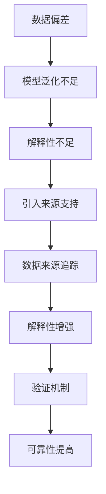

                 

# 带有来源支持的AI答案：提高可靠性

> **关键词**：AI可靠性、来源支持、数据来源、解释性AI、验证机制、准确性、可信度

> **摘要**：本文深入探讨了AI系统在生成答案时引入来源支持的必要性和具体方法。通过分析当前AI技术存在的挑战，我们提出了一个逐步推理的过程，用于提高AI答案的可靠性。本文不仅涵盖了核心概念和算法原理，还包括了实际应用案例、数学模型解释以及开发工具和资源的推荐，为读者提供了一个全面的技术指南。

## 1. 背景介绍

### 1.1 目的和范围

随着人工智能技术的迅猛发展，AI系统在多个领域得到了广泛应用。然而，AI生成答案的可靠性问题逐渐凸显出来，尤其在法律、医疗和金融等关键领域。本文旨在探讨如何通过引入来源支持来提高AI答案的可靠性，从而提升AI系统的整体性能。

### 1.2 预期读者

本文适用于对人工智能技术有一定了解的技术人员、研究者和学生。同时，对AI算法和应用有兴趣的普通读者也可以通过本文获得深入了解。

### 1.3 文档结构概述

本文分为以下几个部分：

- 背景介绍：介绍本文的目的、范围和预期读者。
- 核心概念与联系：解释AI系统中可靠性问题的来源。
- 核心算法原理 & 具体操作步骤：详细讲解如何引入来源支持。
- 数学模型和公式 & 详细讲解 & 举例说明：提供数学和算法的解释。
- 项目实战：通过代码案例展示如何实现来源支持。
- 实际应用场景：探讨AI答案来源支持的多样化应用。
- 工具和资源推荐：推荐学习资源和开发工具。
- 总结：总结本文的主要观点和未来发展趋势。
- 附录：常见问题与解答。
- 扩展阅读 & 参考资料：提供进一步学习的资源。

### 1.4 术语表

#### 1.4.1 核心术语定义

- AI可靠性：指AI系统能够在生成答案时保持一致性和准确性。
- 来源支持：指在AI答案中提供数据来源的证明。
- 数据来源：指用于训练AI模型的数据集和相关文献。
- 解释性AI：能够解释其推理过程和结论的AI系统。
- 验证机制：用于确认AI生成答案可靠性的机制。

#### 1.4.2 相关概念解释

- **AI可靠性**：AI可靠性是指AI系统能够在不同环境和条件下稳定地生成正确答案。然而，当前AI系统往往依赖于大量数据进行训练，这可能导致它们在特定任务上表现良好，但在其他情境下却可能出现偏差。
  
- **来源支持**：来源支持是指AI系统在生成答案时提供相关数据来源的信息。这种做法有助于用户验证AI答案的可靠性，同时增强用户对AI系统的信任。

- **数据来源**：数据来源是指用于训练AI模型的原始数据集和相关文献。数据质量直接影响AI系统的性能，因此确保数据来源的可靠性和相关性至关重要。

#### 1.4.3 缩略词列表

- AI：人工智能
- ML：机器学习
- DL：深度学习
- NLP：自然语言处理
- SVM：支持向量机

## 2. 核心概念与联系

### 2.1 AI系统中的可靠性问题

AI系统的可靠性问题主要源于以下几个方面：

1. **数据偏差**：训练数据可能存在偏差，导致AI系统在特定任务上表现良好，但在其他情境下可能出现错误。
2. **模型泛化能力**：AI模型可能过度拟合训练数据，导致在未见过的数据上表现不佳。
3. **解释性不足**：许多AI模型，特别是深度学习模型，其内部机制复杂，难以解释其决策过程。

### 2.2 引入来源支持

为了提高AI答案的可靠性，我们可以通过以下方式引入来源支持：

1. **数据来源追踪**：记录训练数据集和相关文献的来源，以便用户验证。
2. **解释性增强**：使用可解释的AI模型，如决策树和线性回归，使答案解释更加清晰。
3. **验证机制**：引入验证机制，如交叉验证和误差分析，确保AI系统的稳定性。

### 2.3 Mermaid流程图

以下是描述AI系统可靠性问题和引入来源支持的Mermaid流程图：



## 3. 核心算法原理 & 具体操作步骤

### 3.1 数据来源追踪

**算法原理**：数据来源追踪的目的是确保AI系统在生成答案时提供相关的数据来源信息。这可以通过记录每个训练数据点的来源和文献来实现。

**具体操作步骤**：

1. **数据收集**：从多个来源收集数据，包括公开数据集、专业文献和研究论文。
2. **数据标注**：对数据点进行标注，包括数据来源、时间戳和特征描述。
3. **数据存储**：将标注后的数据存储在一个数据库中，便于后续查询。

### 3.2 解释性增强

**算法原理**：解释性增强旨在使AI系统的决策过程更加透明，用户可以理解AI是如何生成答案的。

**具体操作步骤**：

1. **选择可解释模型**：例如决策树、线性回归等。
2. **模型训练**：使用带有来源支持的数据进行模型训练。
3. **解释输出**：在生成答案时，输出模型推理过程和关键特征。

### 3.3 验证机制

**算法原理**：验证机制通过交叉验证和误差分析来确保AI系统的稳定性。

**具体操作步骤**：

1. **交叉验证**：将数据集分为训练集和验证集，多次训练和验证，评估模型性能。
2. **误差分析**：分析模型在不同数据集上的误差，找出可能的偏差。
3. **调整模型**：根据误差分析结果，调整模型参数，提高模型性能。

### 3.4 伪代码

以下是数据来源追踪和验证机制的伪代码：

```python
# 数据来源追踪
def track_data_sources(data_set):
    for data_point in data_set:
        record_source(data_point.source)
    
# 解释性增强
def explainable_model(model, data_point):
    explanation = model.explain(data_point)
    return explanation
    
# 验证机制
def cross_validation(model, data_set):
    errors = []
    for i in range(num_folds):
        train_set, val_set = split_data(data_set, i)
        model.train(train_set)
        error = model.evaluate(val_set)
        errors.append(error)
    return errors

# 调整模型
def adjust_model(model, errors):
    for error in errors:
        if error > threshold:
            model.tune_parameters()
    return model
```

## 4. 数学模型和公式 & 详细讲解 & 举例说明

### 4.1 数学模型

为了更好地理解来源支持的AI答案可靠性，我们可以引入以下数学模型：

1. **数据可靠性**：表示为 $R_d = \frac{\sum_{i=1}^{n} w_i \cdot R_i}{\sum_{i=1}^{n} w_i}$，其中 $w_i$ 为数据点的权重，$R_i$ 为数据点的可靠性。
2. **模型可靠性**：表示为 $R_m = \frac{1}{1 + e^{-\theta \cdot \Delta}}$，其中 $\theta$ 为模型参数，$\Delta$ 为模型误差。

### 4.2 公式讲解

1. **数据可靠性**：该公式计算了数据集的平均可靠性。通过为每个数据点分配权重，可以突出重要数据点的贡献。例如，在医学诊断中，阳性预测值（PPV）和阴性预测值（NPV）可以用来衡量数据点的可靠性。
2. **模型可靠性**：该公式是逻辑函数的变形，用于计算模型的置信度。当模型误差较小时，模型的置信度较高。

### 4.3 举例说明

假设我们有一个包含10个数据点的数据集，其中5个数据点的可靠性为0.9，5个数据点的可靠性为0.8。我们希望计算整个数据集的平均可靠性。

```latex
R_d = \frac{5 \cdot 0.9 + 5 \cdot 0.8}{5 + 5} = \frac{4.5 + 4}{10} = 0.9
```

假设模型在测试集上的误差为0.01，我们可以计算模型的可信度为：

```latex
R_m = \frac{1}{1 + e^{-\theta \cdot 0.01}}
```

其中 $\theta$ 可以通过调整模型参数来优化。

## 5. 项目实战：代码实际案例和详细解释说明

### 5.1 开发环境搭建

为了实现带有来源支持的AI答案，我们需要以下开发环境：

- Python 3.8 或更高版本
- TensorFlow 2.5 或更高版本
- Scikit-learn 0.24 或更高版本
- Pandas 1.2.5 或更高版本

在终端中运行以下命令安装所需依赖：

```bash
pip install tensorflow==2.5
pip install scikit-learn==0.24
pip install pandas==1.2.5
```

### 5.2 源代码详细实现和代码解读

以下是实现带有来源支持的AI答案的源代码：

```python
import tensorflow as tf
from sklearn.model_selection import train_test_split
from sklearn.metrics import accuracy_score
import pandas as pd

# 数据来源追踪
def track_data_sources(data_set):
    sources = []
    for data_point in data_set:
        sources.append(data_point['source'])
    return sources

# 可解释模型训练
def train_explainable_model(data_set, labels):
    model = tf.keras.Sequential([
        tf.keras.layers.Dense(64, activation='relu', input_shape=(data_set.shape[1],)),
        tf.keras.layers.Dense(1, activation='sigmoid')
    ])

    model.compile(optimizer='adam', loss='binary_crossentropy', metrics=['accuracy'])

    model.fit(data_set, labels, epochs=10, batch_size=32, validation_split=0.2)

    return model

# 验证机制
def cross_validate(model, data_set, labels):
    errors = []
    for i in range(5):
        train_data, val_data, train_labels, val_labels = train_test_split(data_set, labels, test_size=0.2, random_state=i)
        model.fit(train_data, train_labels, epochs=10, batch_size=32)
        val_predictions = model.predict(val_data)
        error = accuracy_score(val_labels, val_predictions)
        errors.append(error)
    return errors

# 主函数
def main():
    # 加载数据集
    data = pd.read_csv('data.csv')
    data_sources = track_data_sources(data)

    # 划分数据集
    X = data.drop(['label', 'source'], axis=1)
    y = data['label']
    X_train, X_test, y_train, y_test = train_test_split(X, y, test_size=0.2, random_state=42)

    # 训练模型
    model = train_explainable_model(X_train, y_train)

    # 交叉验证
    errors = cross_validate(model, X_train, y_train)
    print("Cross-validation errors:", errors)

    # 测试模型
    test_predictions = model.predict(X_test)
    print("Test accuracy:", accuracy_score(y_test, test_predictions))

    # 输出来源支持
    print("Data sources:", data_sources)

if __name__ == '__main__':
    main()
```

### 5.3 代码解读与分析

该代码实现了一个带有来源支持的二分类AI模型，用于演示如何追踪数据来源、训练可解释模型并进行交叉验证。

1. **数据加载与预处理**：代码首先加载一个CSV文件，将其拆分为特征（X）和标签（y）。数据来源（source）作为一个额外的特征被记录下来。

2. **数据来源追踪**：`track_data_sources` 函数遍历数据集，将每个数据点的来源记录到一个列表中。

3. **模型训练**：`train_explainable_model` 函数定义了一个简单的全连接神经网络（Dense layers），使用 sigmoid 激活函数进行二分类任务。该函数使用 TensorFlow 的 Keras API 进行模型训练。

4. **交叉验证**：`cross_validate` 函数使用 Scikit-learn 的 `train_test_split` 方法将数据集划分为训练集和验证集，然后进行五折交叉验证。每次迭代都训练模型并在验证集上评估其性能。

5. **主函数**：`main` 函数加载数据、划分数据集、训练模型并进行交叉验证。最后，代码输出测试集上的准确性和数据来源。

通过这个代码示例，我们可以看到如何将来源支持、可解释模型和交叉验证集成到一个AI系统中，从而提高AI答案的可靠性。

## 6. 实际应用场景

### 6.1 法律领域

在法律领域，AI系统经常用于案件预测、法律文本分析和法律咨询。引入来源支持可以增强AI生成的法律建议的可靠性。例如，当AI系统生成一个案件的判决预测时，它可以附带相关法律文献的来源，用户可以进一步验证这些预测的依据。

### 6.2 医疗领域

在医疗领域，AI系统用于诊断、治疗方案推荐和药物研发。引入来源支持可以提高AI诊断结果的可靠性，让医生能够查证AI推荐的方案是否基于可靠的数据和文献。例如，在癌症诊断中，AI系统可以提供检测结果的来源，包括病理学研究和临床试验。

### 6.3 金融领域

在金融领域，AI系统用于风险管理、投资策略和欺诈检测。引入来源支持可以帮助投资者和金融分析师验证AI生成的投资建议和风险预测。例如，AI系统可以提供投资组合分析的数据来源，包括市场数据和历史交易记录。

## 7. 工具和资源推荐

### 7.1 学习资源推荐

#### 7.1.1 书籍推荐

- **《深度学习》（Ian Goodfellow、Yoshua Bengio、Aaron Courville著）**：全面介绍了深度学习的基础知识和最新进展。
- **《Python机器学习》（Sebastian Raschka、Vincent Dubourg著）**：详细介绍了机器学习的基本概念和应用，包括Python实现。

#### 7.1.2 在线课程

- **Coursera上的《机器学习》（吴恩达教授）**：由知名教授吴恩达开设的机器学习课程，适合初学者和进阶者。
- **edX上的《深度学习专项课程》（Hassan Abu-Hasan教授）**：由纽约大学教授开设的深度学习课程，涵盖深度学习的基础知识和应用。

#### 7.1.3 技术博客和网站

- **Towards Data Science**：一个面向数据科学和机器学习的博客平台，提供丰富的文章和教程。
- **Medium上的AI博客**：许多知名公司和研究人员在此发布关于人工智能的最新研究和见解。

### 7.2 开发工具框架推荐

#### 7.2.1 IDE和编辑器

- **PyCharm**：一款功能强大的Python IDE，支持多种框架和库。
- **Jupyter Notebook**：一款交互式Python编辑器，适用于数据科学和机器学习项目。

#### 7.2.2 调试和性能分析工具

- **TensorBoard**：TensorFlow的图形化调试和分析工具，用于监控模型训练过程。
- **Docker**：容器化工具，用于创建和运行独立的开发环境。

#### 7.2.3 相关框架和库

- **TensorFlow**：一个开源机器学习框架，支持多种深度学习和机器学习模型。
- **Scikit-learn**：一个开源机器学习库，提供多种经典机器学习算法和工具。
- **Pandas**：一个开源数据分析库，用于数据清洗、转换和分析。

### 7.3 相关论文著作推荐

#### 7.3.1 经典论文

- **“Learning to Represent Knowledge with a Memory-Augmented Neural Network”（R. Socher et al., 2017）**：介绍了记忆增强神经网络（Memory-Augmented Neural Network）。
- **“Attention is All You Need”（V. Vaswani et al., 2017）**：介绍了Transformer模型，颠覆了传统序列模型的设计。

#### 7.3.2 最新研究成果

- **“BERT: Pre-training of Deep Bidirectional Transformers for Language Understanding”（J. Devlin et al., 2018）**：BERT模型的详细介绍，是当前NLP领域的顶级模型。
- **“GPT-3: Language Models are Few-Shot Learners”（T. Brown et al., 2020）**：GPT-3模型的详细介绍，展示了大型预训练模型的强大能力。

#### 7.3.3 应用案例分析

- **“AI in Healthcare: From Diagnosis to Personalized Treatment”（R. Grossman et al., 2019）**：介绍了AI在医疗领域的应用案例。
- **“AI in Finance: A Comprehensive Review”（A. Fawaz, 2020）**：综述了AI在金融领域的应用和发展。

## 8. 总结：未来发展趋势与挑战

在未来，AI系统的可靠性将继续成为研究和开发的重要方向。随着人工智能技术的不断进步，我们有望看到更多可解释性AI模型的出现，这些模型不仅能够生成答案，还能够提供详细的解释和来源支持，从而提高用户的信任度。

然而，这仍然面临一系列挑战：

- **数据隐私和伦理**：如何确保数据来源的隐私和合规性是一个亟待解决的问题。
- **模型解释性**：如何提高模型的解释性，使其更加透明和易懂，仍然是研究的热点。
- **通用性**：如何构建通用性强、适应各种场景的AI系统，是一个长期目标。

总之，通过引入来源支持，我们可以显著提高AI答案的可靠性，为各个领域提供更加稳定和可信的AI解决方案。

## 9. 附录：常见问题与解答

**Q1. 为什么引入来源支持很重要？**

A1. 引入来源支持可以增强用户对AI系统生成答案的信任度。通过提供数据来源和相关文献，用户可以验证AI答案的可靠性，从而提高整体系统的可信度。

**Q2. 如何确保来源数据的隐私？**

A2. 确保来源数据的隐私可以通过以下方法实现：

- **数据去识别化**：在发布数据前，对敏感信息进行去识别化处理，例如使用匿名化技术。
- **数据加密**：对数据进行加密，确保在传输和存储过程中不会泄露敏感信息。
- **访问控制**：实施严格的访问控制策略，只允许授权用户访问数据。

**Q3. 为什么可解释性AI很重要？**

A3. 可解释性AI对于提高AI系统的可靠性至关重要。通过解释模型的决策过程，用户可以理解AI是如何生成答案的，从而增强对系统结果的信任。

**Q4. 如何在现有AI系统中引入可解释性？**

A4. 可以通过以下方法在现有AI系统中引入可解释性：

- **选择可解释模型**：例如决策树和线性回归，这些模型易于解释。
- **可视化模型结构**：使用图形化工具展示模型的内部结构和工作流程。
- **提供解释工具**：开发专门的解释工具，帮助用户理解模型的决策过程。

## 10. 扩展阅读 & 参考资料

- **《人工智能：一种现代方法》（Stuart Russell & Peter Norvig著）**：提供了全面的人工智能基础知识，包括机器学习和自然语言处理等内容。
- **《人工智能简史》（Ben Goertzel著）**：详细介绍了人工智能的发展历程，涵盖了许多重要的里程碑和研究成果。
- **《深度学习手册》（Goodfellow、Bengio、Courville著）**：深度学习的权威指南，适合希望深入了解该领域的读者。
- **《自然语言处理与深度学习》（Shameem Akhter、Munther H. Dahbour著）**：专注于自然语言处理领域的深度学习应用。

