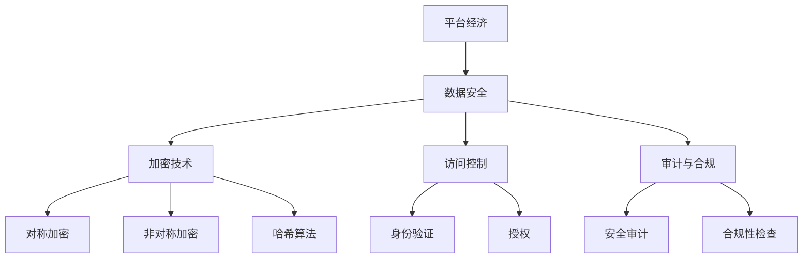

                 

# 平台经济的数据安全技术体系：如何构建安全体系？

> **关键词：**平台经济、数据安全、安全技术体系、安全架构、隐私保护、加密技术

> **摘要：**本文旨在探讨平台经济中的数据安全技术体系构建，分析其核心概念、算法原理、数学模型，并结合实际案例进行深入讲解，最终探讨未来发展趋势与挑战。

## 1. 背景介绍

### 1.1 目的和范围

随着互联网和信息技术的迅猛发展，平台经济已经成为全球经济增长的重要引擎。在这种经济模式中，数据是核心资产，数据安全成为企业和用户关注的焦点。本文将重点讨论平台经济中的数据安全技术体系，包括其核心概念、算法原理、数学模型以及实际应用场景。

### 1.2 预期读者

本文适合对平台经济和数据安全有一定了解的读者，包括信息安全工程师、数据科学家、软件开发人员以及企业高管等。

### 1.3 文档结构概述

本文分为以下几个部分：

1. 背景介绍：阐述平台经济的定义、现状以及数据安全的重要性。
2. 核心概念与联系：介绍平台经济中的核心概念和相互关系。
3. 核心算法原理 & 具体操作步骤：讲解数据安全技术中的核心算法原理和具体操作步骤。
4. 数学模型和公式 & 详细讲解 & 举例说明：阐述数据安全中的数学模型和公式，并进行举例说明。
5. 项目实战：提供代码实际案例和详细解释说明。
6. 实际应用场景：分析数据安全技术在不同场景下的应用。
7. 工具和资源推荐：推荐相关学习资源和开发工具。
8. 总结：展望未来发展趋势与挑战。
9. 附录：常见问题与解答。
10. 扩展阅读 & 参考资料：提供进一步学习和研究的资料。

### 1.4 术语表

#### 1.4.1 核心术语定义

- 平台经济：基于互联网和信息技术，通过搭建平台连接供需双方，实现资源高效配置和交易的经济模式。
- 数据安全：保护数据在存储、传输、处理等过程中不受未授权访问、篡改、泄露等威胁的能力。
- 数据加密：将数据转换为不可读形式，只有授权用户才能解读的技术。
- 安全架构：确保数据安全的一系列策略、技术和流程。

#### 1.4.2 相关概念解释

- **隐私保护**：保护用户个人隐私，防止其数据被滥用。
- **加密技术**：使用密码学原理保护数据安全的技术。
- **零知识证明**：一种加密技术，证明某件事为真，但不透露具体信息。

#### 1.4.3 缩略词列表

- **PKI**：公共密钥基础设施（Public Key Infrastructure）
- **SSL**：安全套接层（Secure Sockets Layer）
- **TLS**：传输层安全（Transport Layer Security）

## 2. 核心概念与联系

在平台经济中，数据安全技术体系的构建至关重要。以下是一个简化的 Mermaid 流程图，展示了平台经济中的核心概念和相互关系。



### 2.1 平台经济的定义与特点

平台经济是指基于互联网和信息技术，通过搭建平台连接供需双方，实现资源高效配置和交易的经济模式。其特点包括：

- **去中心化**：平台经济通常采用去中心化的架构，使得信息和服务可以自由流通。
- **高效率**：通过平台，供需双方可以快速匹配，减少中间环节，提高交易效率。
- **透明性**：平台经济中，信息通常是公开透明的，有助于市场参与者做出决策。
- **全球化**：平台经济不受地理限制，可以跨越国界，实现全球范围内的资源配置。

### 2.2 数据安全的定义与重要性

数据安全是指保护数据在存储、传输、处理等过程中不受未授权访问、篡改、泄露等威胁的能力。在平台经济中，数据安全的重要性体现在以下几个方面：

- **用户信任**：数据安全是用户对平台信任的基础，如果数据泄露或被滥用，将严重影响用户的信任。
- **商业价值**：数据是平台经济的核心资产，数据安全直接关系到平台的商业价值和竞争力。
- **法律法规**：随着数据保护法律法规的不断完善，数据安全已经成为企业和平台的法定义务。

### 2.3 安全架构的组成部分

安全架构是确保数据安全的一系列策略、技术和流程。其主要组成部分包括：

- **加密技术**：包括对称加密、非对称加密和哈希算法，用于保护数据在存储、传输和处理过程中的安全。
- **访问控制**：包括身份验证、授权和审计，用于控制对数据的访问权限。
- **安全审计与合规**：对平台的安全状况进行定期审计，确保符合相关法律法规要求。

## 3. 核心算法原理 & 具体操作步骤

### 3.1 加密技术

加密技术是数据安全的核心，主要包括对称加密、非对称加密和哈希算法。

#### 3.1.1 对称加密

对称加密是指加密和解密使用相同的密钥。其基本原理如下：

```python
# 对称加密算法伪代码

def symmetric_encrypt(plaintext, key):
    # 将明文文本转换为字节序列
    plaintext_bytes = str_to_bytes(plaintext)
    # 使用密钥进行加密
    ciphertext_bytes = encrypt_bytes(plaintext_bytes, key)
    # 将密文转换为字符串
    ciphertext = bytes_to_str(ciphertext_bytes)
    return ciphertext

def symmetric_decrypt(ciphertext, key):
    # 将密文转换为字节序列
    ciphertext_bytes = str_to_bytes(ciphertext)
    # 使用密钥进行解密
    plaintext_bytes = decrypt_bytes(ciphertext_bytes, key)
    # 将明文字节序列转换为字符串
    plaintext = bytes_to_str(plaintext_bytes)
    return plaintext
```

#### 3.1.2 非对称加密

非对称加密是指加密和解密使用不同的密钥。其基本原理如下：

```python
# 非对称加密算法伪代码

def asymmetric_encrypt(plaintext, public_key):
    # 将明文文本转换为字节序列
    plaintext_bytes = str_to_bytes(plaintext)
    # 使用公钥进行加密
    ciphertext_bytes = encrypt_bytes(plaintext_bytes, public_key)
    # 将密文转换为字符串
    ciphertext = bytes_to_str(ciphertext_bytes)
    return ciphertext

def asymmetric_decrypt(ciphertext, private_key):
    # 将密文转换为字节序列
    ciphertext_bytes = str_to_bytes(ciphertext)
    # 使用私钥进行解密
    plaintext_bytes = decrypt_bytes(ciphertext_bytes, private_key)
    # 将明文字节序列转换为字符串
    plaintext = bytes_to_str(plaintext_bytes)
    return plaintext
```

#### 3.1.3 哈希算法

哈希算法是一种将任意长度的输入数据转换成固定长度输出数据的算法，通常用于数据的完整性校验和数字签名。常用的哈希算法包括MD5、SHA-1、SHA-256等。

```python
# 哈希算法伪代码

def hash_function(plaintext):
    # 将明文文本转换为字节序列
    plaintext_bytes = str_to_bytes(plaintext)
    # 计算哈希值
    hash_value = calculate_hash(plaintext_bytes)
    # 将哈希值转换为字符串
    hash_str = bytes_to_str(hash_value)
    return hash_str
```

### 3.2 访问控制

访问控制是确保数据安全的重要措施，包括身份验证、授权和审计。

#### 3.2.1 身份验证

身份验证是指确认用户身份的过程，常用的方法包括用户名和密码、双因素认证等。

```python
# 身份验证伪代码

def authenticate(username, password):
    # 检查用户名和密码是否匹配
    if check_credentials(username, password):
        return True
    else:
        return False
```

#### 3.2.2 授权

授权是指确定用户对数据的访问权限。常用的授权策略包括基于角色的访问控制（RBAC）和基于属性的访问控制（ABAC）。

```python
# 授权伪代码

def authorize(user, resource):
    # 检查用户是否有访问资源的权限
    if check_permission(user, resource):
        return True
    else:
        return False
```

#### 3.2.3 审计与合规

审计与合规是指对平台的安全状况进行定期检查，确保符合相关法律法规要求。常用的审计方法包括日志分析、漏洞扫描和合规性检查。

```python
# 审计与合规伪代码

def audit_platform():
    # 检查平台是否符合安全标准和法律法规要求
    if check_compliance():
        return True
    else:
        return False
```

## 4. 数学模型和公式 & 详细讲解 & 举例说明

在数据安全中，数学模型和公式起着至关重要的作用。以下是一些常见的数学模型和公式，并进行详细讲解和举例说明。

### 4.1 加密算法的数学模型

#### 4.1.1 对称加密算法

对称加密算法的数学模型通常是一个二元组 $(E, D)$，其中 $E$ 是加密函数，$D$ 是解密函数。加密函数和

