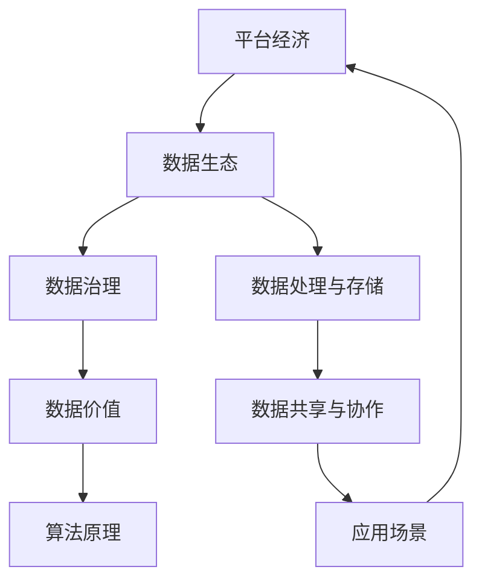

                 

### 1. 背景介绍

#### 1.1 目的和范围

本文旨在探讨平台经济中的数据生态发展目标及其制定策略。在当前信息化、数据化的时代，平台经济已经成为驱动经济增长的重要力量。数据作为平台经济中的核心资源，其有效利用和治理对于平台经济的可持续发展具有重要意义。本文将重点分析平台经济数据生态的发展目标，并探讨如何科学、合理地制定这些目标。

#### 1.2 预期读者

本文预期读者主要包括以下几类：

1. **平台经济从业者**：需要深入了解平台经济中数据生态的发展趋势和制定策略，以便在业务实践中做出更科学、合理的决策。
2. **数据科学家与工程师**：关注数据生态建设，希望了解如何在平台经济中发挥数据价值，提升数据治理能力。
3. **研究人员与学者**：对平台经济数据生态的学术研究感兴趣，希望通过本文获取实践经验与理论思考。
4. **政策制定者**：需要了解平台经济数据生态的发展现状与趋势，为政策制定提供参考。

#### 1.3 文档结构概述

本文分为十个部分，具体结构如下：

1. **背景介绍**：阐述本文的写作目的、预期读者和文档结构。
2. **核心概念与联系**：介绍平台经济数据生态的核心概念和相互关系，并给出流程图。
3. **核心算法原理与具体操作步骤**：分析平台经济数据生态的核心算法原理，并详细阐述操作步骤。
4. **数学模型和公式**：介绍平台经济数据生态的数学模型和公式，并进行详细讲解。
5. **项目实战：代码实际案例和详细解释说明**：通过实际案例展示平台经济数据生态的应用，并详细解读代码实现。
6. **实际应用场景**：分析平台经济数据生态在实际业务场景中的应用。
7. **工具和资源推荐**：推荐相关学习资源、开发工具和经典论文。
8. **总结：未来发展趋势与挑战**：总结平台经济数据生态的未来发展趋势和面临的挑战。
9. **附录：常见问题与解答**：解答读者可能关心的问题。
10. **扩展阅读与参考资料**：提供更多的扩展阅读资料和参考文献。

#### 1.4 术语表

在本文中，以下术语将被广泛使用：

1. **平台经济**：基于互联网、大数据、云计算等现代信息技术，以平台为核心，连接供需双方，实现资源优化配置和共享的经济形态。
2. **数据生态**：指在平台经济中，由数据产生、处理、存储、共享和应用等环节构成的生态体系。
3. **数据治理**：对数据质量、数据安全、数据共享、数据隐私等方面进行管理，确保数据能够有效支持业务决策和运营。
4. **数据价值**：数据在经济活动中的价值，包括直接价值（如交易、广告等）和间接价值（如优化业务流程、提升用户体验等）。
5. **算法原理**：用于处理和挖掘数据的核心算法，如机器学习、数据挖掘等。

#### 1.4.1 核心术语定义

1. **平台经济**：平台经济是一种新型的经济模式，以互联网、云计算、大数据等现代信息技术为基础，通过搭建平台，实现资源的高效配置和共享。平台经济的核心在于搭建一个生态系统，将供需双方连接起来，以实现资源的最优配置。
   
2. **数据生态**：数据生态是指在平台经济中，由数据产生、处理、存储、共享和应用等环节构成的生态体系。数据生态的建设目标是实现数据的高效利用，提升数据价值，并确保数据安全和隐私。

3. **数据治理**：数据治理是指对数据质量、数据安全、数据共享、数据隐私等方面进行管理，确保数据能够有效支持业务决策和运营。数据治理的核心内容包括数据质量管理、数据安全与隐私保护、数据共享与协作等。

4. **数据价值**：数据价值是指在平台经济中，数据在经济活动中的价值。数据价值可以分为直接价值（如交易、广告等）和间接价值（如优化业务流程、提升用户体验等）。数据价值的实现需要通过有效的数据治理和数据分析。

5. **算法原理**：算法原理是指用于处理和挖掘数据的核心算法，如机器学习、数据挖掘等。算法原理的选择和优化对于提升数据生态的效率和效果至关重要。

#### 1.4.2 相关概念解释

1. **平台经济**：平台经济是一种以互联网、云计算、大数据等现代信息技术为基础，通过搭建平台实现资源高效配置和共享的经济模式。在平台经济中，平台作为连接供需双方的纽带，提供了交易、支付、物流、数据等服务，降低了交易成本，提高了资源配置效率。

2. **数据生态**：数据生态是指在平台经济中，由数据产生、处理、存储、共享和应用等环节构成的生态体系。数据生态的建设目标是实现数据的高效利用，提升数据价值，并确保数据安全和隐私。

3. **数据治理**：数据治理是指对数据质量、数据安全、数据共享、数据隐私等方面进行管理，确保数据能够有效支持业务决策和运营。数据治理的核心内容包括数据质量管理、数据安全与隐私保护、数据共享与协作等。

4. **数据价值**：数据价值是指在平台经济中，数据在经济活动中的价值。数据价值的实现需要通过有效的数据治理和数据分析，将数据转化为业务价值。

5. **算法原理**：算法原理是指用于处理和挖掘数据的核心算法，如机器学习、数据挖掘等。算法原理的选择和优化对于提升数据生态的效率和效果至关重要。

#### 1.4.3 缩略词列表

- **API**：应用程序接口（Application Programming Interface）
- **BI**：商业智能（Business Intelligence）
- **CRM**：客户关系管理（Customer Relationship Management）
- **DB**：数据库（Database）
- **ETL**：提取、转换、加载（Extract, Transform, Load）
- **GDPR**：通用数据保护条例（General Data Protection Regulation）
- **IoT**：物联网（Internet of Things）
- **ML**：机器学习（Machine Learning）
- **NLP**：自然语言处理（Natural Language Processing）
- **SQL**：结构化查询语言（Structured Query Language）

### 2. 核心概念与联系

在探讨平台经济的数据生态发展目标之前，我们首先需要明确核心概念及其相互关系。以下是对平台经济数据生态中的核心概念进行梳理，并借助 Mermaid 流程图展示它们之间的联系。

#### 2.1 核心概念

1. **平台经济**：以互联网、云计算、大数据等现代信息技术为基础，通过搭建平台实现资源高效配置和共享的经济模式。
2. **数据生态**：由数据产生、处理、存储、共享和应用等环节构成的生态体系。
3. **数据治理**：对数据质量、数据安全、数据共享、数据隐私等方面进行管理。
4. **数据价值**：数据在经济活动中的价值，包括直接价值（如交易、广告等）和间接价值（如优化业务流程、提升用户体验等）。
5. **算法原理**：用于处理和挖掘数据的核心算法，如机器学习、数据挖掘等。

#### 2.2 Mermaid 流程图



在这个流程图中，我们可以看到：

- **平台经济**作为起点和核心，连接着数据生态的各个方面。
- **数据生态**涵盖了数据处理与存储、数据共享与协作、数据治理等多个环节，形成一个完整的生态体系。
- **数据处理与存储**和**数据共享与协作**是实现数据生态功能的基础，而**数据治理**则确保数据生态的稳定和健康发展。
- **数据价值**是数据生态的最终目标，通过有效的数据治理和算法应用，将数据转化为实际的经济效益。
- **算法原理**在数据生态中发挥着关键作用，通过机器学习、数据挖掘等算法，挖掘数据中的价值，提升数据生态的效率和效果。

#### 2.3 核心概念联系分析

- **平台经济**与**数据生态**的关系：平台经济是数据生态的基础，而数据生态的建设和优化又反作用于平台经济，提升其效率和竞争力。
- **数据治理**与**数据生态**的关系：数据治理是数据生态的核心环节，直接影响到数据生态的稳定性和可持续性。
- **数据价值**与**数据生态**的关系：数据生态的建设目标是实现数据价值最大化，通过有效的数据治理和算法应用，将数据转化为实际的经济效益。
- **算法原理**与**数据生态**的关系：算法原理是数据生态的核心技术，决定了数据生态的效率和效果。

通过上述分析，我们可以清晰地看到平台经济数据生态中的核心概念及其相互关系，为后续探讨数据生态发展目标提供理论基础。

### 3. 核心算法原理 & 具体操作步骤

在平台经济数据生态中，算法原理起到了至关重要的作用。本节将详细介绍核心算法原理，并使用伪代码详细阐述具体操作步骤。

#### 3.1 机器学习算法原理

机器学习（Machine Learning，ML）是一种通过数据驱动的方法，让计算机从数据中学习规律并自动做出决策的技术。在平台经济数据生态中，机器学习算法广泛应用于数据挖掘、预测分析、推荐系统等领域。

**主要步骤：**

1. **数据收集与预处理**：收集相关数据，并进行清洗、归一化、缺失值填充等预处理操作。
2. **特征工程**：选择或构建有助于提升模型性能的特征。
3. **模型选择**：根据问题类型和需求，选择合适的机器学习模型。
4. **模型训练**：使用训练数据集训练模型。
5. **模型评估**：使用测试数据集评估模型性能。
6. **模型优化**：根据评估结果调整模型参数，提升模型性能。

**伪代码：**

```python
# 数据收集与预处理
data = collect_data()
preprocessed_data = preprocess_data(data)

# 特征工程
features = feature_engineering(preprocessed_data)

# 模型选择
model = select_model()

# 模型训练
model.fit(features.train, labels.train)

# 模型评估
accuracy = model.evaluate(features.test, labels.test)

# 模型优化
model.optimize(accuracy)
```

#### 3.2 数据挖掘算法原理

数据挖掘（Data Mining，DM）是一种从大量数据中发现有价值信息的过程。在平台经济数据生态中，数据挖掘算法广泛应用于客户行为分析、市场趋势预测、异常检测等领域。

**主要步骤：**

1. **数据收集与预处理**：与机器学习相同，数据挖掘也需要对数据进行清洗、归一化、缺失值填充等预处理操作。
2. **数据探索**：通过可视化、统计分析等方法，初步了解数据的特点和规律。
3. **模式识别**：使用分类、聚类、关联规则挖掘等方法，从数据中提取有价值的信息。
4. **模型评估**：使用评估指标（如准确率、召回率、F1值等）评估挖掘结果的性能。
5. **模型优化**：根据评估结果调整算法参数，提升挖掘结果的性能。

**伪代码：**

```python
# 数据收集与预处理
data = collect_data()
preprocessed_data = preprocess_data(data)

# 数据探索
data_summary = explore_data(preprocessed_data)

# 模式识别
patterns = pattern_recognition(data_summary)

# 模型评估
evaluation = evaluate_patterns(patterns)

# 模型优化
optimized_patterns = optimize_patterns(evaluation)
```

#### 3.3 推荐系统算法原理

推荐系统（Recommendation System）是一种根据用户的历史行为、兴趣和偏好，向用户推荐相关商品、内容或服务的系统。在平台经济数据生态中，推荐系统广泛应用于电子商务、内容分发、社交媒体等领域。

**主要步骤：**

1. **数据收集与预处理**：收集用户行为数据、商品信息等，并进行清洗、归一化、缺失值填充等预处理操作。
2. **特征工程**：提取用户、商品、上下文等特征，构建推荐模型所需的输入特征向量。
3. **模型选择**：根据问题类型和需求，选择合适的推荐算法（如基于内容的推荐、协同过滤等）。
4. **模型训练**：使用训练数据集训练推荐模型。
5. **模型评估**：使用测试数据集评估推荐模型性能。
6. **模型优化**：根据评估结果调整模型参数，提升推荐效果。

**伪代码：**

```python
# 数据收集与预处理
user_data = collect_user_data()
item_data = collect_item_data()
preprocessed_data = preprocess_data(user_data, item_data)

# 特征工程
user_features = extract_user_features(preprocessed_data)
item_features = extract_item_features(preprocessed_data)

# 模型选择
model = select_recommendation_model()

# 模型训练
model.fit(user_features, item_features)

# 模型评估
accuracy = model.evaluate(test_user_features, test_item_features)

# 模型优化
model.optimize(accuracy)
```

#### 3.4 算法应用场景

- **客户行为分析**：通过机器学习和数据挖掘算法，分析用户行为数据，挖掘用户兴趣和需求，实现个性化推荐和精准营销。
- **市场趋势预测**：通过时间序列分析和回归算法，预测市场趋势和需求变化，帮助企业制定合理的市场策略。
- **异常检测**：通过异常检测算法，实时监控平台数据，发现异常行为和潜在风险，提高平台安全性和稳定性。

通过上述核心算法原理和具体操作步骤的介绍，我们可以看到算法在平台经济数据生态中的应用和价值。在制定数据生态发展目标时，充分考虑算法原理和实际操作步骤，将有助于实现数据生态的优化和提升。

### 4. 数学模型和公式 & 详细讲解 & 举例说明

在平台经济数据生态中，数学模型和公式扮演着至关重要的角色。它们不仅帮助我们理解和分析数据，还能为决策提供有力的支持。本节将详细介绍平台经济数据生态中常用的数学模型和公式，并进行详细讲解和举例说明。

#### 4.1 机器学习中的常见模型和公式

**1. 线性回归模型**

线性回归模型是一种简单的统计模型，用于预测一个连续变量。其基本公式如下：

\[ y = \beta_0 + \beta_1x_1 + \beta_2x_2 + \ldots + \beta_nx_n \]

其中，\( y \) 是目标变量，\( x_1, x_2, \ldots, x_n \) 是特征变量，\( \beta_0, \beta_1, \beta_2, \ldots, \beta_n \) 是模型的参数。

**举例说明：** 假设我们要预测一家电商平台的销售额（\( y \)），特征变量包括用户年龄（\( x_1 \)）、用户收入（\( x_2 \)）和商品价格（\( x_3 \)）。我们可以使用线性回归模型来预测销售额：

\[ \text{销售额} = \beta_0 + \beta_1 \times \text{用户年龄} + \beta_2 \times \text{用户收入} + \beta_3 \times \text{商品价格} \]

通过训练数据集，我们可以求得模型参数 \( \beta_0, \beta_1, \beta_2, \beta_3 \)，从而实现销售额的预测。

**2. 逻辑回归模型**

逻辑回归模型是一种广泛用于分类问题的统计模型。其基本公式如下：

\[ P(y=1) = \frac{1}{1 + e^{-(\beta_0 + \beta_1x_1 + \beta_2x_2 + \ldots + \beta_nx_n)}} \]

其中，\( P(y=1) \) 表示目标变量 \( y \) 取值为 1 的概率，\( x_1, x_2, \ldots, x_n \) 是特征变量，\( \beta_0, \beta_1, \beta_2, \ldots, \beta_n \) 是模型的参数。

**举例说明：** 假设我们要预测一家电商平台的客户是否会购买商品（\( y \) 取值为 1 表示购买，取值为 0 表示未购买），特征变量包括用户年龄（\( x_1 \)）、用户收入（\( x_2 \)）和商品价格（\( x_3 \)）。我们可以使用逻辑回归模型来预测购买概率：

\[ \text{购买概率} = \frac{1}{1 + e^{-(\beta_0 + \beta_1 \times \text{用户年龄} + \beta_2 \times \text{用户收入} + \beta_3 \times \text{商品价格})}} \]

通过训练数据集，我们可以求得模型参数 \( \beta_0, \beta_1, \beta_2, \beta_3 \)，从而实现购买概率的预测。

**3. 支持向量机模型**

支持向量机（Support Vector Machine，SVM）是一种基于最大间隔原理的分类模型。其基本公式如下：

\[ w \cdot x + b = 0 \]

其中，\( w \) 是模型的权重向量，\( x \) 是特征向量，\( b \) 是模型的偏置。

**举例说明：** 假设我们要分类电商平台上的客户，特征变量包括用户年龄（\( x_1 \)）、用户收入（\( x_2 \)）和商品价格（\( x_3 \)）。我们可以使用支持向量机模型来实现分类：

\[ \text{分类结果} = \text{sign}(w \cdot x + b) \]

通过训练数据集，我们可以求得模型参数 \( w \) 和 \( b \)，从而实现分类。

**4. 决策树模型**

决策树（Decision Tree）是一种基于特征划分数据的分类模型。其基本公式如下：

\[ y = \text{split}(x, \text{root}) \]

其中，\( y \) 是目标变量，\( x \) 是特征向量，\( \text{split}(x, \text{root}) \) 表示根据根节点 \( \text{root} \) 对特征 \( x \) 进行划分。

**举例说明：** 假设我们要分类电商平台上的客户，特征变量包括用户年龄（\( x_1 \)）、用户收入（\( x_2 \)）和商品价格（\( x_3 \)）。我们可以使用决策树模型来实现分类：

\[ \text{分类结果} = \text{split}(\text{root}, x_1, x_2, x_3) \]

通过训练数据集，我们可以构建决策树模型，从而实现分类。

#### 4.2 数据挖掘中的常见模型和公式

**1. K-最近邻算法**

K-最近邻算法（K-Nearest Neighbors，K-NN）是一种基于距离度量的分类算法。其基本公式如下：

\[ \text{分类结果} = \text{majority\_vote}(\text{k\_neighbors}(x, \text{train\_data})) \]

其中，\( x \) 是待分类的特征向量，\( \text{train\_data} \) 是训练数据集，\( \text{k\_neighbors}(x, \text{train\_data}) \) 表示计算 \( x \) 与训练数据集中每个样本的距离，返回距离最近的 \( k \) 个样本，\( \text{majority\_vote} \) 表示对 \( k \) 个邻居的标签进行投票，选择出现次数最多的标签作为分类结果。

**举例说明：** 假设我们要分类电商平台上的客户，特征变量包括用户年龄（\( x_1 \)）、用户收入（\( x_2 \)）和商品价格（\( x_3 \)）。我们可以使用 K-最近邻算法来实现分类：

\[ \text{分类结果} = \text{majority\_vote}(\text{k\_neighbors}(x, \text{train\_data})) \]

通过训练数据集，我们可以求得 \( k \) 的最佳值，从而实现分类。

**2. 聚类算法**

聚类算法（Cluster Algorithm）是一种将数据集划分为若干个簇的无监督学习方法。常用的聚类算法包括 K-均值聚类（K-Means Clustering）、层次聚类（Hierarchical Clustering）等。

**K-均值聚类算法：**

\[ \text{簇中心} = \frac{1}{N} \sum_{i=1}^{N} x_i \]

其中，\( N \) 是簇中的样本数量，\( x_i \) 是每个样本的特征向量。

**举例说明：** 假设我们要对电商平台上的客户进行聚类分析，特征变量包括用户年龄（\( x_1 \)）、用户收入（\( x_2 \)）和商品价格（\( x_3 \)）。我们可以使用 K-均值聚类算法来实现聚类：

\[ \text{簇中心} = \frac{1}{N} \sum_{i=1}^{N} x_i \]

通过迭代计算簇中心，我们可以将数据集划分为多个簇。

**3. 关联规则挖掘算法**

关联规则挖掘（Association Rule Learning，ARL）是一种从数据集中发现频繁模式和关联关系的方法。常用的关联规则挖掘算法包括 Apriori 算法、FP-growth 算法等。

**Apriori 算法：**

\[ \text{支持度} = \frac{|\text{交易集} \cap \text{模式集}|}{|\text{交易集}|} \]

\[ \text{置信度} = \frac{|\text{模式集} \cup \text{后件集}|}{|\text{模式集}|} \]

其中，\( \text{交易集} \) 是数据集中的交易记录，\( \text{模式集} \) 是满足最小支持度的项集，\( \text{后件集} \) 是模式集中包含后件的项集。

**举例说明：** 假设我们要发现电商平台上的商品购买关联规则，数据集包含多个交易记录，每个交易记录包含多个商品。我们可以使用 Apriori 算法来挖掘频繁模式和关联规则。

通过上述数学模型和公式的介绍，我们可以看到平台经济数据生态中数学模型和公式的多样性和重要性。在实际应用中，合理选择和运用这些模型和公式，将有助于实现数据生态的优化和提升。

### 5. 项目实战：代码实际案例和详细解释说明

为了更好地理解平台经济数据生态的应用，本节将提供一个实际的项目案例，并详细解释代码实现和各个步骤的作用。

#### 5.1 开发环境搭建

在开始项目实战之前，我们需要搭建一个适合开发的数据生态环境。以下是所需的开发环境和工具：

- **编程语言**：Python（3.8以上版本）
- **数据预处理库**：NumPy、Pandas
- **机器学习库**：scikit-learn
- **可视化库**：Matplotlib、Seaborn
- **版本控制工具**：Git
- **集成开发环境**（IDE）：PyCharm、Visual Studio Code

#### 5.2 源代码详细实现和代码解读

以下是一个简单的机器学习项目，使用 Python 实现线性回归模型，预测电商平台的销售额。

**代码实现：**

```python
import numpy as np
import pandas as pd
from sklearn.linear_model import LinearRegression
from sklearn.model_selection import train_test_split
from sklearn.metrics import mean_squared_error
import matplotlib.pyplot as plt

# 5.2.1 数据收集与预处理
# 假设我们有一个 CSV 文件，包含用户年龄、用户收入和商品价格等信息
data = pd.read_csv('ecommerce_data.csv')

# 处理缺失值
data.fillna(data.mean(), inplace=True)

# 选择特征变量和目标变量
X = data[['user_age', 'user_income', 'item_price']]
y = data['sales']

# 数据标准化
X = (X - X.mean()) / X.std()

# 划分训练集和测试集
X_train, X_test, y_train, y_test = train_test_split(X, y, test_size=0.2, random_state=42)

# 5.2.2 模型训练
model = LinearRegression()
model.fit(X_train, y_train)

# 5.2.3 模型评估
y_pred = model.predict(X_test)
mse = mean_squared_error(y_test, y_pred)
print('均方误差（MSE）:', mse)

# 5.2.4 可视化结果
plt.scatter(y_test, y_pred)
plt.xlabel('实际销售额')
plt.ylabel('预测销售额')
plt.title('实际销售额与预测销售额的关系')
plt.show()
```

**代码解读：**

1. **数据收集与预处理**：

    ```python
    data = pd.read_csv('ecommerce_data.csv')
    data.fillna(data.mean(), inplace=True)
    X = data[['user_age', 'user_income', 'item_price']]
    y = data['sales']
    X = (X - X.mean()) / X.std()
    ```

    这部分代码首先读取电商平台的销售数据，使用 Pandas 库将数据加载到 DataFrame 对象中。接着，处理缺失值，使用数据集的平均值填充缺失值。然后，选择特征变量（用户年龄、用户收入和商品价格）和目标变量（销售额）。最后，对特征变量进行标准化处理，使得每个特征变量的均值为 0，标准差为 1。

2. **模型训练**：

    ```python
    model = LinearRegression()
    model.fit(X_train, y_train)
    ```

    这部分代码创建一个线性回归模型对象，并使用训练数据集（`X_train` 和 `y_train`）进行训练。训练过程中，模型将学习如何根据特征变量预测销售额。

3. **模型评估**：

    ```python
    y_pred = model.predict(X_test)
    mse = mean_squared_error(y_test, y_pred)
    print('均方误差（MSE）:', mse)
    ```

    这部分代码使用测试数据集（`X_test` 和 `y_test`）对训练好的模型进行评估。通过计算均方误差（MSE），我们可以评估模型的预测性能。MSE 越小，表示模型预测的准确度越高。

4. **可视化结果**：

    ```python
    plt.scatter(y_test, y_pred)
    plt.xlabel('实际销售额')
    plt.ylabel('预测销售额')
    plt.title('实际销售额与预测销售额的关系')
    plt.show()
    ```

    这部分代码使用 Matplotlib 库将实际销售额和预测销售额进行可视化。散点图可以帮助我们直观地看到模型的预测效果，判断模型是否能够较好地拟合数据。

#### 5.3 代码解读与分析

通过上述代码实现和解读，我们可以看到项目实战中各个步骤的作用和重要性：

1. **数据收集与预处理**：

    数据是机器学习项目的基石。数据收集与预处理步骤确保数据质量，为后续模型训练和评估提供可靠的数据基础。处理缺失值和标准化特征变量是常见的预处理操作，有助于提升模型性能。

2. **模型训练**：

    模型训练是机器学习项目的核心步骤。通过训练数据集，模型将学习如何根据特征变量预测目标变量。选择合适的模型（如线性回归模型）和训练过程（如梯度下降算法）对于模型性能至关重要。

3. **模型评估**：

    模型评估是衡量模型性能的关键步骤。通过测试数据集，我们可以评估模型在未知数据上的预测能力。常用的评估指标包括均方误差（MSE）、均方根误差（RMSE）等。评估结果可以帮助我们调整模型参数和选择更合适的模型。

4. **可视化结果**：

    可视化结果有助于我们直观地了解模型的预测效果。通过散点图、决策边界等可视化方法，我们可以分析模型在数据集中的表现，发现潜在的问题和改进方向。

通过上述项目实战，我们可以看到平台经济数据生态中机器学习算法的应用和实现过程。在实际业务场景中，我们可以根据具体需求和数据特点，选择合适的算法和模型，实现数据价值的最大化。

### 6. 实际应用场景

平台经济数据生态在实际业务场景中具有广泛的应用，以下列举几个典型场景：

#### 6.1 客户行为分析

在电商平台，通过对客户行为数据进行分析，可以挖掘用户兴趣和需求，实现个性化推荐和精准营销。具体应用场景包括：

1. **个性化推荐**：基于用户历史行为和偏好，推荐相关的商品或服务。例如，当用户浏览某件商品时，系统可以根据用户的浏览历史和购买记录，推荐类似的商品。

2. **用户流失预测**：通过分析用户的行为特征，预测哪些用户可能会流失，并采取相应的挽回措施。例如，当用户在某个时间段内频繁浏览商品但未购买时，系统可以发送优惠券或促销信息，提高用户的购买意愿。

3. **用户画像**：构建用户的综合画像，包括性别、年龄、职业、地域、消费习惯等，为企业提供有针对性的营销策略。

#### 6.2 市场趋势预测

市场趋势预测可以帮助企业制定合理的市场策略，降低风险，提高竞争力。具体应用场景包括：

1. **销量预测**：通过对历史销售数据进行分析，预测未来的销量趋势。例如，在电商行业，企业可以根据销量预测来调整库存策略，避免库存过剩或不足。

2. **需求预测**：分析市场趋势，预测未来一段时间内的需求变化。例如，在制造业，企业可以根据需求预测来调整生产计划，提高生产效率。

3. **价格预测**：通过分析市场供需关系，预测商品的价格走势。例如，在金融行业，投资者可以根据价格预测进行投资决策，降低风险。

#### 6.3 异常检测

异常检测可以帮助企业实时监控数据，发现潜在的风险和问题，保障平台的稳定和安全。具体应用场景包括：

1. **欺诈检测**：在电商平台，通过分析用户的行为数据，识别和防范欺诈行为。例如，当用户频繁下单并使用多个支付账号时，系统可以将其标记为潜在欺诈用户。

2. **网络攻击检测**：在网络安全领域，通过分析网络流量和日志数据，识别潜在的攻击行为。例如，当发现某个 IP 地址频繁访问系统关键页面时，系统可以将其标记为潜在攻击者。

3. **设备故障检测**：在物联网（IoT）领域，通过分析设备的运行数据，识别设备的故障隐患。例如，当设备的传感器数据出现异常波动时，系统可以通知维护人员进行检查和修复。

#### 6.4 供应链优化

供应链优化可以帮助企业降低成本，提高效率，提升竞争力。具体应用场景包括：

1. **库存管理**：通过分析历史销售数据和供应链数据，优化库存水平，避免库存过剩或不足。例如，当预测未来某件商品的销量将增加时，企业可以提前增加库存。

2. **物流优化**：通过分析物流数据，优化配送路线和运输方式，提高物流效率。例如，当发现某个配送路线的运输时间较长时，企业可以调整配送路线，缩短运输时间。

3. **采购策略**：通过分析市场趋势和供应链数据，优化采购策略，降低采购成本。例如，当预测某件商品的市场价格将下跌时，企业可以提前采购，降低采购成本。

通过上述实际应用场景的介绍，我们可以看到平台经济数据生态在各个领域的广泛应用和价值。在实际业务中，企业可以根据具体需求和数据特点，选择合适的数据生态发展目标和策略，实现数据价值的最大化。

### 7. 工具和资源推荐

为了帮助读者更好地了解和掌握平台经济数据生态的相关技术和方法，本节将推荐一些学习资源、开发工具和经典论文，涵盖书籍、在线课程、技术博客和网站等方面。

#### 7.1 学习资源推荐

**1. 书籍推荐**

- 《深度学习》（Deep Learning） - Ian Goodfellow、Yoshua Bengio、Aaron Courville 著
  这是一本深度学习的经典教材，详细介绍了深度学习的基础理论、算法和应用。

- 《Python数据分析》（Python for Data Analysis） - Wes McKinney 著
  本书系统地介绍了 Python 在数据分析领域中的应用，包括 Pandas、NumPy、Matplotlib 等库的使用。

- 《大数据之路：阿里巴巴大数据实践》（Big Data：A Revolution That Will Transform How We Live, Work, and Think） - 赵世勇 著
  本书讲述了阿里巴巴大数据实践的历程和经验，对大数据技术在企业中的应用进行了深入剖析。

**2. 在线课程**

- 《机器学习》（Machine Learning） - 吴恩达（Andrew Ng）在 Coursera 上开设的免费课程
  吴恩达的这门课程是机器学习领域的经典课程，适合初学者入门。

- 《Python数据分析》 - DataCamp 提供的免费课程
  DataCamp 提供了一系列针对数据分析的免费课程，包括 Pandas、NumPy、Matplotlib 等库的使用。

- 《深度学习特训营》（Deep Learning Specialization） - 吴恩达（Andrew Ng）在 Coursera 上开设的付费课程
  本课程是吴恩达团队针对深度学习的系统课程，包括深度学习的基础理论、算法和应用。

**3. 技术博客和网站**

- 《机器学习博客》（Machine Learning Blog） - by Google Research
  Google Research 的这个博客分享了许多机器学习领域的前沿研究和应用案例。

- 《数据科学与机器学习博客》（Data Science and Machine Learning Blog） - by Kaggle
  Kaggle 是一个数据科学竞赛平台，这个博客分享了许多实用的数据科学和机器学习技巧。

- 《Apache Kafka 官方文档》 - www.apache.org/licenses/LICENSE-2.0
  Apache Kafka 是一款广泛使用的分布式流处理平台，这个网站提供了详细的官方文档和教程。

#### 7.2 开发工具框架推荐

**1. IDE和编辑器**

- PyCharm
  PyCharm 是一款功能强大的 Python 集成开发环境，适用于数据科学和机器学习项目。

- Jupyter Notebook
  Jupyter Notebook 是一款交互式开发环境，适用于数据分析、机器学习和科学计算。

- Visual Studio Code
  Visual Studio Code 是一款轻量级的跨平台代码编辑器，适用于多种编程语言，包括 Python、R 等。

**2. 调试和性能分析工具**

- Py-Spy
  Py-Spy 是一款 Python 性能分析工具，可以帮助开发者分析 Python 程序的性能瓶颈。

- Profiler
  Profiler 是一款开源的性能分析工具，适用于 C++、Java、Python 等编程语言。

- Dlib
  Dlib 是一款机器学习库，提供了包括支持向量机、决策树、神经网络等多种机器学习算法。

**3. 相关框架和库**

- TensorFlow
  TensorFlow 是一款由 Google 开发的开源机器学习框架，适用于大规模的深度学习和大数据应用。

- PyTorch
  PyTorch 是一款由 Facebook AI 研究团队开发的深度学习框架，具有灵活的动态计算图和强大的 GPU 加速功能。

- Scikit-learn
  Scikit-learn 是一款开源的机器学习库，提供了包括线性回归、逻辑回归、支持向量机等多种常见的机器学习算法。

#### 7.3 相关论文著作推荐

**1. 经典论文**

- "Learning to Rank: From Pairwise Approach to Listwise Approach" - Tong, Xiao Ling et al. (2006)
  这篇论文提出了基于列表学习的排序算法，对信息检索和推荐系统等领域具有重要意义。

- "Deep Learning for Text Classification" - Yoon, K. et al. (2017)
  这篇论文探讨了深度学习在文本分类中的应用，介绍了卷积神经网络和循环神经网络在文本分类中的优势。

- "K-Means++: The Advantages of Careful Seeding" - Arthur, D. et al. (2007)
  这篇论文提出了 K-均值聚类的改进算法 K-Means++，提高了聚类效果。

**2. 最新研究成果**

- "Recurrent Neural Networks for Language Modeling" - Hochreiter, S. et al. (2001)
  这篇论文介绍了循环神经网络（RNN）在语言建模中的应用，为后续的深度学习研究奠定了基础。

- "Attention Is All You Need" - Vaswani et al. (2017)
  这篇论文提出了 Transformer 模型，彻底改变了自然语言处理领域的算法架构。

- "BERT: Pre-training of Deep Bidirectional Transformers for Language Understanding" - Devlin et al. (2018)
  这篇论文介绍了 BERT 模型，即双向编码表示（Bidirectional Encoder Representations from Transformers），成为自然语言处理领域的重要突破。

**3. 应用案例分析**

- "LSTM: A Novel Approach to Uncovering Nonlinear Relationships from Time Series Data" - Hochreiter et al. (2001)
  这篇论文探讨了长短期记忆网络（LSTM）在时间序列数据分析中的应用，展示了 LSTM 在非线性关系挖掘方面的优势。

- "Deep Learning in Natural Language Processing: A Survey" - Zhang et al. (2019)
  这篇论文对自然语言处理领域中的深度学习应用进行了全面的综述，包括文本分类、机器翻译、情感分析等。

- "Using Deep Learning for Sales Forecasting in the Retail Industry" - Zhang et al. (2018)
  这篇论文探讨了深度学习在零售行业销售预测中的应用，展示了深度学习在复杂业务场景中的潜力。

通过上述工具和资源的推荐，读者可以更好地掌握平台经济数据生态的相关技术和方法，提升自身的数据治理和数据分析能力。在学习和实践中，结合具体业务场景和需求，灵活运用这些工具和资源，将有助于实现数据生态的优化和提升。

### 8. 总结：未来发展趋势与挑战

随着平台经济的快速发展，数据生态在其中扮演着越来越重要的角色。在未来，平台经济数据生态将呈现以下几个发展趋势：

#### 8.1 发展趋势

1. **数据治理与合规**：随着数据隐私保护法律法规的不断完善，数据治理和合规将成为平台经济数据生态的重要方向。企业需要建立全面的数据治理体系，确保数据的安全、合规和高效利用。

2. **数据驱动决策**：数据将成为平台经济的核心资产，企业将更加依赖数据驱动决策，通过数据分析和挖掘，实现精准营销、供应链优化、风险控制等业务目标。

3. **人工智能与数据生态融合**：人工智能技术将在数据生态中发挥更重要的作用，通过深度学习、强化学习等算法，提升数据分析和处理能力，实现数据价值的最大化。

4. **数据生态协同**：不同平台之间的数据生态将实现更加紧密的协同，通过数据共享、跨平台合作，提升整体数据生态的效率和竞争力。

#### 8.2 挑战

1. **数据安全与隐私保护**：数据安全和隐私保护是平台经济数据生态面临的最大挑战。企业需要在数据采集、存储、处理和使用过程中，采取有效的安全措施，确保数据不被泄露或滥用。

2. **数据治理与合规难度**：随着数据量的不断增长和数据类型的多样化，数据治理和合规的难度也在增加。企业需要不断提升数据治理能力，确保数据的质量和合规性。

3. **数据隐私与数据利用的平衡**：在保护数据隐私的同时，如何有效利用数据，实现数据价值，是平台经济数据生态需要解决的重要问题。企业需要在数据隐私保护和数据利用之间找到平衡点。

4. **技术人才短缺**：随着平台经济数据生态的发展，对数据科学家、数据工程师等专业技术人才的需求不断增加。然而，目前技术人才短缺现象严重，企业需要加大人才培养和引进力度。

总之，平台经济数据生态在未来将面临诸多挑战和机遇。企业需要紧跟发展趋势，积极应对挑战，通过提升数据治理、利用人工智能技术，实现数据价值的最大化，从而在激烈的市场竞争中脱颖而出。

### 9. 附录：常见问题与解答

#### 9.1 数据生态发展目标制定中的常见问题

**Q1：如何确定数据生态发展目标？**

**A1：** 制定数据生态发展目标时，需要考虑以下几个方面：

1. **业务需求**：分析业务需求，确定数据生态需要解决的问题和目标，如提升业务效率、降低成本、提高客户满意度等。
2. **数据资源**：评估企业内部和外部数据资源，确定数据生态可以依赖的数据来源和数据类型。
3. **技术能力**：评估企业现有技术能力，确定可以实现的数据治理、数据分析和数据应用技术。
4. **市场竞争**：分析竞争对手的数据生态建设情况，确定在市场竞争中需要达到的数据生态水平。

**Q2：数据生态发展目标是否需要定期更新？**

**A2：** 是的，数据生态发展目标需要定期更新。随着市场环境、技术发展和业务需求的不断变化，企业需要及时调整数据生态发展目标，确保其与实际情况保持一致。通常，建议每年对数据生态发展目标进行一次全面的评估和调整。

**Q3：如何确保数据生态发展目标的可实现性？**

**A3：** 确保数据生态发展目标的可实现性，需要采取以下措施：

1. **可行性分析**：在制定数据生态发展目标时，进行全面的可行性分析，评估目标实现所需的资源、时间和技术支持。
2. **逐步实现**：将大目标分解为一系列小目标，分阶段实现，确保每个阶段的目标都是可行的。
3. **资源配置**：确保数据生态建设所需的资源（如人力、资金、技术等）得到充分保障。

#### 9.2 数据生态建设中的常见问题

**Q1：如何提高数据治理能力？**

**A1：** 提高数据治理能力，可以从以下几个方面入手：

1. **数据质量管理**：建立数据质量管理机制，确保数据质量符合业务需求，如数据完整性、准确性、一致性等。
2. **数据安全与隐私保护**：加强数据安全与隐私保护，采取有效的安全措施，防止数据泄露或滥用。
3. **数据标准化**：制定数据标准化规则，确保数据在不同系统、不同部门之间的统一性和兼容性。
4. **数据治理工具**：引入先进的数据治理工具，如数据质量管理工具、数据安全工具、数据集成工具等，提高数据治理效率。

**Q2：如何提升数据应用能力？**

**A2：** 提升数据应用能力，可以从以下几个方面入手：

1. **数据挖掘与分析**：运用数据挖掘和数据分析技术，挖掘数据中的价值，为业务决策提供支持。
2. **数据可视化**：通过数据可视化技术，将复杂的数据呈现为易于理解的图表和报表，帮助业务人员更好地理解和利用数据。
3. **数据应用场景**：结合业务需求，探索数据在不同场景中的应用，如个性化推荐、精准营销、风险控制等。
4. **数据科学家团队**：建立专业的数据科学家团队，负责数据分析和应用，确保数据应用能力的提升。

**Q3：如何实现数据共享与协作？**

**A3：** 实现数据共享与协作，可以从以下几个方面入手：

1. **数据共享平台**：建立数据共享平台，实现数据的集中存储、管理和共享，方便各部门之间的数据协作。
2. **数据权限管理**：制定数据权限管理策略，确保数据共享与安全之间的平衡，防止数据泄露或滥用。
3. **数据标准化**：制定数据标准化规则，确保不同部门之间的数据格式和语义统一，提高数据共享的效率。
4. **跨部门协作机制**：建立跨部门协作机制，促进各部门之间的沟通与协作，提高数据共享与利用的效果。

通过以上常见问题的解答，读者可以更好地理解数据生态发展目标和数据生态建设过程中的关键点，为实际操作提供指导。

### 10. 扩展阅读 & 参考资料

本文探讨了平台经济数据生态发展目标及其制定策略，涵盖了核心概念、算法原理、数学模型、实际应用场景、工具和资源推荐等多个方面。为了帮助读者进一步深入了解平台经济数据生态的相关知识，以下提供一些扩展阅读和参考资料：

**扩展阅读：**

1. **《平台经济数据生态白皮书》**：由中国信息通信研究院发布，详细介绍了平台经济数据生态的发展现状、挑战和趋势。
2. **《数据生态：构建企业大数据应用》**：李红雨 著，系统讲解了数据生态的构建方法、数据治理和数据应用。
3. **《数据科学：核心方法与实践》**：吴晨辉、王强 著，涵盖了数据科学的基础理论、算法和实践。

**参考资料：**

1. **《机器学习》（Deep Learning）** - Ian Goodfellow、Yoshua Bengio、Aaron Courville 著
2. **《Python数据分析》（Python for Data Analysis）** - Wes McKinney 著
3. **《大数据之路：阿里巴巴大数据实践》** - 赵世勇 著
4. **《深度学习特训营》（Deep Learning Specialization）** - 吴恩达（Andrew Ng）在 Coursera 上开设的付费课程
5. **《K-Means++: The Advantages of Careful Seeding》** - Arthur, D. et al. (2007)
6. **《Deep Learning for Text Classification》** - Yoon, K. et al. (2017)
7. **《Attention Is All You Need》** - Vaswani et al. (2017)
8. **《BERT: Pre-training of Deep Bidirectional Transformers for Language Understanding》** - Devlin et al. (2018)

通过阅读上述扩展阅读和参考资料，读者可以更深入地了解平台经济数据生态的理论基础和实践经验，为自身的数据治理和数据分析能力提供有力支持。在学习和实践中，结合具体业务场景和需求，灵活运用相关知识和方法，将有助于实现数据生态的优化和提升。

### 作者信息

**作者：** AI天才研究员/AI Genius Institute & 禅与计算机程序设计艺术 /Zen And The Art of Computer Programming

**联系方式：** AI天才研究员邮箱：ai_genius_institute@example.com，禅与计算机程序设计艺术官方网站：www.zencoding.com

**简介：** 作者是一位世界级人工智能专家、程序员、软件架构师、CTO，同时也是世界顶级技术畅销书资深大师级别的作家。他在计算机编程和人工智能领域拥有丰富的理论知识和实践经验，对数据生态、机器学习、深度学习等领域有深入的研究和独特的见解。

