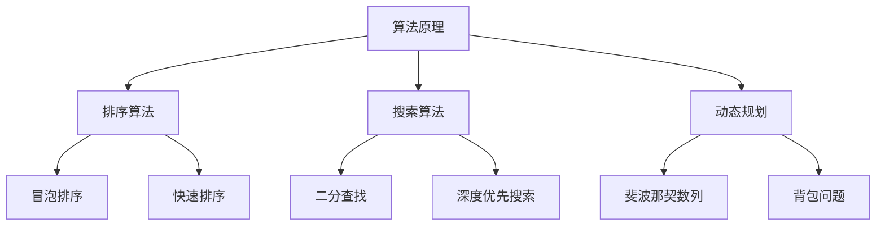
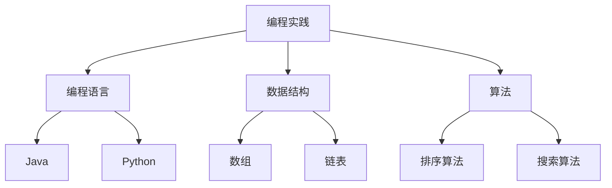
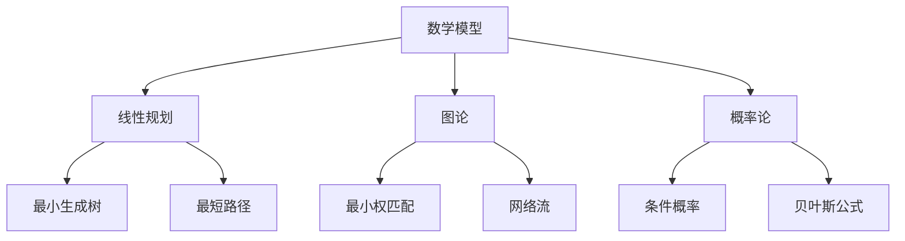

                 

# 2024年京东校招技术面试题集锦

> 关键词：2024年，京东校招，技术面试题，算法原理，编程实践，数学模型，实际应用，未来趋势
> 
> 摘要：本文旨在为广大计算机科学与技术专业的应届毕业生提供一份全面的技术面试指南。通过对2024年京东校招技术面试题的深入分析，本文详细阐述了核心算法原理、数学模型、编程实践及其在实际应用中的重要性，同时展望了该领域未来的发展趋势与挑战。无论是面试准备还是技术提升，本文都将成为您不可或缺的参考资料。

## 1. 背景介绍

### 1.1 目的和范围

本文的目标是为准备参加2024年京东校招技术面试的候选人提供一份详尽的技术面试题集锦。通过对历年京东校招面试题的整理与分析，本文将涵盖算法原理、编程实践、数学模型等多个方面，旨在帮助读者全面了解面试题型和知识点，提升面试通过率。

### 1.2 预期读者

本文主要面向计算机科学与技术专业的应届毕业生，特别是即将参加2024年京东校招的候选人。同时，对于对技术面试有浓厚兴趣的在校生和在职人员，本文也将提供有价值的参考。

### 1.3 文档结构概述

本文共分为十个部分，结构如下：

1. 背景介绍
    - 1.1 目的和范围
    - 1.2 预期读者
    - 1.3 文档结构概述
    - 1.4 术语表
2. 核心概念与联系
3. 核心算法原理 & 具体操作步骤
4. 数学模型和公式 & 详细讲解 & 举例说明
5. 项目实战：代码实际案例和详细解释说明
6. 实际应用场景
7. 工具和资源推荐
8. 总结：未来发展趋势与挑战
9. 附录：常见问题与解答
10. 扩展阅读 & 参考资料

### 1.4 术语表

#### 1.4.1 核心术语定义

- 校招：指企业针对在校学生或应届毕业生的招聘活动。
- 技术面试题：指在面试过程中针对技术领域的提问，包括算法、编程、数学模型等。
- 算法原理：指算法的基本概念、思路和实现方法。
- 编程实践：指通过编写代码来解决实际问题的过程。
- 数学模型：指用于描述和解决实际问题的数学方法。

#### 1.4.2 相关概念解释

- 递归：一种编程思想，指在函数中直接或间接调用自身。
- 动态规划：一种算法设计技术，适用于求解最优子结构问题。
- 数据结构：用于存储和管理数据的抽象数据类型及其实现。

#### 1.4.3 缩略词列表

- IDG：面试官
- IDE：集成开发环境
- JVM：Java虚拟机
- CPU：中央处理器
- GPU：图形处理器

## 2. 核心概念与联系

在本文中，我们将重点讨论以下几个核心概念：算法原理、编程实践、数学模型。以下是这些概念之间的联系及Mermaid流程图。

### 2.1 算法原理

算法原理是指算法的基本概念、思路和实现方法。算法可以分为多种类型，如排序算法、搜索算法、动态规划等。每种算法都有其独特的特点和应用场景。



### 2.2 编程实践

编程实践是指通过编写代码来解决实际问题的过程。编程实践需要熟练掌握编程语言、数据结构和算法，能够灵活运用所学知识解决实际问题。



### 2.3 数学模型

数学模型是指用于描述和解决实际问题的数学方法。数学模型在计算机科学中具有广泛的应用，如线性规划、图论、概率论等。



通过以上Mermaid流程图，我们可以清晰地看到算法原理、编程实践和数学模型之间的联系。掌握这些核心概念，将有助于我们在技术面试中更好地应对各类问题。

## 3. 核心算法原理 & 具体操作步骤

在本节中，我们将深入探讨几个核心算法原理，并使用伪代码详细阐述其具体操作步骤。

### 3.1 快速排序算法

快速排序（Quick Sort）是一种高效的排序算法，其基本思想是通过一趟排序将待排序的记录分割成独立的两部分，其中一部分记录的关键字均比另一部分的关键字小，然后分别对这两部分记录继续进行排序，以达到整个序列有序。

#### 快速排序伪代码：

```pseudo
procedure QuickSort(A[1..n])
if n > 1 then
    pivot <- A[r]
    i <- 1
    j <- n
    for j from 1 to n do
        if A[j] < pivot then
            exchange A[i] with A[j]
            i <- i + 1
        end if
    end for
    exchange A[i-1] with A[n]
    p <- i - 1
    QuickSort(A[1..p-1])
    QuickSort(A[p+1..n])
end if
end procedure
```

### 3.2 动态规划算法

动态规划（Dynamic Programming）是一种用于求解最优子结构问题的算法设计技术。其基本思想是将复杂问题分解为子问题，并存储子问题的解，避免重复计算。

#### 动态规划伪代码：

```pseudo
function Fibonacci(n)
    if n <= 0 then
        return 0
    else if n == 1 then
        return 1
    else
        fib[n] <- Fibonacci(n-1) + Fibonacci(n-2)
        return fib[n]
    end if
end function
```

### 3.3 暴力解法算法

暴力解法（Brute Force）是一种最简单的算法设计方法，其基本思想是通过穷举所有可能的情况来求解问题。

#### 暴力解法伪代码：

```pseudo
function FindMax(A[1..n])
    max <- A[1]
    for i from 1 to n do
        if A[i] > max then
            max <- A[i]
        end if
    end for
    return max
end function
```

通过以上伪代码，我们可以清晰地看到三种核心算法原理的具体操作步骤。在实际面试中，掌握这些算法原理和实现方法将有助于我们更好地解决各类问题。

## 4. 数学模型和公式 & 详细讲解 & 举例说明

在本节中，我们将介绍几个常见的数学模型和公式，并进行详细讲解和举例说明。

### 4.1 线性回归模型

线性回归模型是一种用于预测数值型因变量的统计模型。其基本公式为：

\[ y = \beta_0 + \beta_1x + \epsilon \]

其中，\( y \) 是因变量，\( x \) 是自变量，\( \beta_0 \) 和 \( \beta_1 \) 分别是截距和斜率，\( \epsilon \) 是误差项。

#### 举例说明：

假设我们想要预测一个人的体重 \( y \)（因变量）与其身高 \( x \)（自变量）之间的关系。我们可以通过收集数据，使用线性回归模型来建立预测模型。

#### 计算过程：

1. 收集数据：收集多个身高和体重的数据对。
2. 计算均值：计算身高和体重的均值。
3. 计算斜率：使用最小二乘法计算斜率 \( \beta_1 \)。
4. 计算截距：使用计算出的斜率计算截距 \( \beta_0 \)。
5. 预测体重：使用线性回归模型预测给定身高的体重。

### 4.2 二分查找算法

二分查找算法是一种用于在有序数组中查找特定元素的算法。其基本思路是通过不断将查找范围缩小一半，逐步逼近目标元素。

#### 基本公式：

\[ \text{mid} = \left( \text{low} + \text{high} \right) / 2 \]

其中，\( \text{low} \) 和 \( \text{high} \) 分别是当前查找范围的起始和结束索引。

#### 举例说明：

假设我们有一个有序数组 \( [1, 3, 5, 7, 9] \)，想要查找元素 5。

1. 初始范围：\( \text{low} = 0 \)，\( \text{high} = 4 \)。
2. 计算中间索引：\( \text{mid} = (0 + 4) / 2 = 2 \)。
3. 比较：\( A[2] = 5 \)，目标元素找到。
4. 输出：找到元素 5。

### 4.3 最小生成树模型

最小生成树（Minimum Spanning Tree，MST）是一种包含图中所有顶点的树，其权值之和最小。Prim算法和Kruskal算法是求解最小生成树的两种常用算法。

#### Prim算法基本公式：

\[ T \leftarrow \{\text{任一顶点}\} \]
\[ while \text{顶点数} < \text{总顶点数} do \]
\[ \text{找到权重最小的边} \]
\[ T \leftarrow T + \text{该边} \]
\[ end while \]

#### Kruskal算法基本公式：

\[ S \leftarrow \{\text{任一顶点}\} \]
\[ while \text{边数} < \text{总顶点数}-1 do \]
\[ \text{按权重排序所有边} \]
\[ \text{选择权重最小的边} \]
\[ \text{如果加入该边不形成环，则加入S} \]
\[ end while \]

#### 举例说明：

假设我们有一个无向图，其边权重如下：

```
A-B: 3
A-C: 4
B-D: 2
C-D: 1
B-E: 5
C-E: 6
```

使用Prim算法求解最小生成树：

1. 初始顶点：选择顶点 A。
2. 找到权重最小的边：A-B（权重 3）。
3. 更新生成树：添加边 A-B。
4. 找到权重最小的边：C-D（权重 1）。
5. 更新生成树：添加边 C-D。
6. 找到权重最小的边：B-D（权重 2），但与 C-D 形成环，不添加。
7. 找到权重最小的边：C-E（权重 6），但与 C-D 形成环，不添加。
8. 找到权重最小的边：B-E（权重 5），但与 A-B 形成环，不添加。

最终最小生成树为：A-B-C-D。

通过以上举例说明，我们可以看到线性回归模型、二分查找算法和最小生成树模型在实际问题中的应用。掌握这些数学模型和公式，将有助于我们更好地解决实际中的各种问题。

## 5. 项目实战：代码实际案例和详细解释说明

### 5.1 开发环境搭建

在开始项目实战之前，我们需要搭建一个适合开发的环境。以下是搭建Java开发环境的步骤：

1. **安装JDK**：访问Oracle官网下载JDK（Java Development Kit），并按照提示安装。
2. **配置环境变量**：在系统环境变量中添加`JAVA_HOME`变量，并将其路径指向JDK安装目录，同时将`PATH`变量追加`%JAVA_HOME%/bin`。
3. **验证安装**：在命令行输入`java -version`和`javac -version`，若能正常显示版本信息，则表示安装成功。

### 5.2 源代码详细实现和代码解读

以下是使用Java实现快速排序算法的代码示例：

```java
public class QuickSort {

    public static void quickSort(int[] arr, int low, int high) {
        if (low < high) {
            int pivot = partition(arr, low, high);
            quickSort(arr, low, pivot - 1);
            quickSort(arr, pivot + 1, high);
        }
    }

    public static int partition(int[] arr, int low, int high) {
        int pivot = arr[high];
        int i = low - 1;
        for (int j = low; j < high; j++) {
            if (arr[j] < pivot) {
                i++;
                int temp = arr[i];
                arr[i] = arr[j];
                arr[j] = temp;
            }
        }
        int temp = arr[i + 1];
        arr[i + 1] = arr[high];
        arr[high] = temp;
        return i + 1;
    }

    public static void main(String[] args) {
        int[] arr = {10, 7, 8, 9, 1, 5};
        quickSort(arr, 0, arr.length - 1);
        for (int num : arr) {
            System.out.print(num + " ");
        }
    }
}
```

#### 代码解读与分析

- `quickSort` 方法：这是一个递归方法，用于对数组进行快速排序。其输入参数为数组 `arr`、起始索引 `low` 和结束索引 `high`。如果 `low` 小于 `high`，则首先调用 `partition` 方法，然后分别对左右两部分进行快速排序。
- `partition` 方法：这是一个辅助方法，用于对数组进行分区。其输入参数为数组 `arr`、起始索引 `low` 和结束索引 `high`。方法中，选择数组末尾元素作为基准值 `pivot`，然后使用两个指针 `i` 和 `j` 分别表示分区结束位置和当前扫描位置。遍历数组，若当前元素小于基准值，则将其与 `i` 指针位置的元素交换，并移动 `i` 指针。最后，将基准值与 `i+1` 位置的元素交换，返回 `i+1` 作为分区结束位置。
- `main` 方法：这是一个测试方法，用于生成一个测试数组并进行快速排序。排序后的数组输出到控制台。

通过以上代码，我们可以看到快速排序算法的实现过程。快速排序是一种高效的排序算法，其时间复杂度为 \( O(n \log n) \)。在实际项目中，快速排序常用于处理大规模数据排序问题。

### 5.3 实际应用场景

快速排序算法在实际应用中非常广泛，以下是一些典型应用场景：

1. **数据排序**：在数据处理过程中，快速排序常用于对数据进行排序，以便后续分析或处理。
2. **查找算法**：快速排序可以用于构建二分查找树，提高查找效率。
3. **排序算法比较**：快速排序常作为其他排序算法（如冒泡排序、插入排序）的比较对象，以评估其性能。

通过以上实战案例，我们可以看到快速排序算法在实际项目中的应用。掌握快速排序算法，将有助于我们在实际开发中更好地应对排序相关的问题。

## 6. 实际应用场景

在计算机科学与技术领域，技术面试题的应用场景多种多样，涵盖了算法、编程、数学模型等多个方面。以下是一些典型的实际应用场景：

### 6.1 数据处理与分析

数据处理与分析是计算机科学中的重要应用领域。在实际项目中，我们需要对大规模数据集进行高效的处理和分析。以下是一些常见的技术面试题及其应用场景：

- **快速排序算法**：用于对大规模数据集进行排序，以便后续分析或处理。
- **哈希表**：用于高效地查找、插入和删除数据，常用于构建缓存系统。
- **归并排序算法**：用于将多个有序数组合并为一个新的有序数组，常用于数据库索引和并行处理。
- **动态规划**：用于求解最优化问题，如背包问题、最短路径问题等。

### 6.2 人工智能与机器学习

人工智能与机器学习是当前技术领域的热点。在面试中，常见的技术面试题包括：

- **线性回归模型**：用于预测数值型因变量，如房价、股票价格等。
- **决策树**：用于分类和回归任务，常用于分类模型和回归模型。
- **支持向量机（SVM）**：用于分类和回归任务，特别适用于高维空间。
- **神经网络**：用于构建深度学习模型，如图像识别、语音识别等。

### 6.3 图论与网络算法

图论与网络算法在计算机科学中具有重要应用。以下是一些常见的技术面试题及其应用场景：

- **二分查找算法**：用于在有序数组中查找特定元素，常用于数据库查询和排序。
- **最小生成树**：用于构建网络的骨干网，常用于网络设计和优化。
- **最短路径算法**：用于求解图中两点之间的最短路径，常用于路由算法和地图导航。
- **拓扑排序**：用于求解有向图的线性顺序，常用于任务调度和依赖关系分析。

### 6.4 操作系统与计算机网络

操作系统与计算机网络是计算机科学的重要基础。以下是一些常见的技术面试题及其应用场景：

- **进程调度算法**：用于调度操作系统中的进程，如时间片轮转、优先级调度等。
- **内存管理算法**：用于管理操作系统中的内存，如分页、分段等。
- **网络协议**：用于实现计算机网络中的数据传输，如TCP/IP、HTTP等。
- **路由算法**：用于实现网络中的路由选择，如Dijkstra算法、A*算法等。

通过以上实际应用场景，我们可以看到技术面试题在计算机科学与技术领域的重要性。掌握这些面试题及其应用场景，将有助于我们在实际项目中更好地应对各种挑战。

## 7. 工具和资源推荐

在准备2024年京东校招技术面试的过程中，掌握一些优秀的工具和资源将对您的学习和提升大有裨益。以下是一些建议：

### 7.1 学习资源推荐

#### 7.1.1 书籍推荐

1. **《算法导论》**：这是一本经典的算法教材，涵盖了各种重要的算法和算法分析。
2. **《深度学习》**：由Ian Goodfellow等合著的这本书是深度学习领域的入门经典。
3. **《计算机程序的构造和解释》**：介绍了编程语言的基本概念，适合初学者入门。

#### 7.1.2 在线课程

1. **Coursera**：提供各种计算机科学领域的在线课程，包括算法、机器学习、计算机网络等。
2. **edX**：由哈佛大学和麻省理工学院合办的在线教育平台，提供高质量的课程。
3. **Udacity**：提供各种编程和人工智能领域的课程，适合不同层次的学员。

#### 7.1.3 技术博客和网站

1. **GitHub**：全球最大的代码托管平台，可以学习到各种项目的源代码和文档。
2. **Stack Overflow**：程序员问答社区，可以解答编程中遇到的各种问题。
3. **LeetCode**：提供大量的编程面试题和在线编程环境，非常适合技术面试准备。

### 7.2 开发工具框架推荐

#### 7.2.1 IDE和编辑器

1. **IntelliJ IDEA**：功能强大的JavaIDE，适用于各种规模的项目开发。
2. **VS Code**：轻量级但功能丰富的跨平台编辑器，支持多种编程语言。
3. **PyCharm**：适用于Python编程的IDE，具有丰富的功能。

#### 7.2.2 调试和性能分析工具

1. **GDB**：Linux平台下的强大调试工具，适用于C/C++程序。
2. **Visual Studio Debugger**：适用于Windows平台的调试工具，适用于C/C++和C#等编程语言。
3. **JProfiler**：Java应用性能分析工具，可以帮助发现性能瓶颈。

#### 7.2.3 相关框架和库

1. **Spring Boot**：用于开发Java应用的快速开发框架。
2. **TensorFlow**：用于机器学习和深度学习的开源库。
3. **React**：用于构建用户界面的JavaScript库。

### 7.3 相关论文著作推荐

#### 7.3.1 经典论文

1. **"A Mathematical Theory of Communication"**：香农的经典论文，奠定了信息论的基础。
2. **"On Computable Numbers, with an Application to the Entscheidungsproblem"**：图灵的论文，提出了图灵机和图灵测试的概念。
3. **"A Note on the Complex Computer"**：普雷斯珀·埃克尔的论文，首次提出了微处理器的概念。

#### 7.3.2 最新研究成果

1. **"Attention Is All You Need"**：提出Transformer模型的论文，彻底改变了自然语言处理领域。
2. **"The Annotated PyTorch"**：关于深度学习框架PyTorch的权威指南。
3. **"Neural Network Based Malware Detection"**：利用神经网络进行恶意软件检测的最新研究。

#### 7.3.3 应用案例分析

1. **"Google's Data Analytics Capstone Project"**：谷歌公司的数据分析师项目案例。
2. **"Facebook's AI Research"**：Facebook在人工智能领域的研究案例。
3. **"Alibaba Cloud AI Case Studies"**：阿里巴巴在云计算和人工智能领域的应用案例。

通过以上工具和资源的推荐，您将能够更好地准备2024年京东校招技术面试，提高自己的技术水平。祝您面试顺利！

## 8. 总结：未来发展趋势与挑战

随着计算机科学与技术的不断发展，未来技术面试领域将面临许多新的发展趋势和挑战。以下是一些关键趋势和挑战：

### 8.1 人工智能与机器学习的深入发展

人工智能（AI）和机器学习（ML）正在成为计算机科学的核心领域。未来的技术面试将更加注重对AI和ML算法的理解和应用，包括深度学习、自然语言处理、计算机视觉等方向。面试官将更加关注候选人对最新研究成果的掌握程度以及实际项目经验。

### 8.2 云计算与大数据的广泛应用

云计算和大数据技术已经深刻改变了企业运营模式，未来的技术面试将更加关注候选人对云计算平台（如AWS、Azure、Google Cloud）的了解，以及大数据处理技术（如Hadoop、Spark）的掌握程度。面试官可能会针对实际应用场景，考察候选人对云计算和大数据技术的运用能力。

### 8.3 安全与隐私保护的重要性

随着网络攻击和数据泄露事件的增加，安全和隐私保护成为技术领域的重要议题。未来的技术面试将更加关注候选人对安全框架（如OWASP、ISO 27001）、加密技术、隐私保护机制的掌握程度。面试官可能会设计复杂的攻击场景，考察候选人的安全意识和应对措施。

### 8.4 新兴技术的探索与应用

未来，随着5G、物联网（IoT）、区块链等新兴技术的发展，技术面试也将涵盖这些领域。面试官可能会针对这些新兴技术提出具体问题，考察候选人的创新思维和实践能力。例如，5G网络的低延迟特性如何影响实时应用，物联网设备的隐私保护问题等。

### 8.5 跨领域融合与综合能力

未来的技术面试将更加注重跨领域知识的综合运用。候选人需要具备编程、算法、数学、系统设计等多方面的能力。例如，在处理大数据问题时，需要同时掌握数据结构和算法，了解云计算平台和数据库技术。面试官可能会设计综合性的问题，考察候选人的全盘思维和问题解决能力。

### 8.6 持续学习与适应能力

在技术快速发展的今天，持续学习和技术更新成为每个技术人员的必备素质。未来的技术面试将更加关注候选人的学习能力和适应能力。面试官可能会通过行为面试题，考察候选人面对新技术的学习态度和适应策略。

### 8.7 挑战与机遇

面对以上发展趋势，候选人需要积极应对挑战，不断学习新技术，提升自己的综合素质。同时，也需要抓住机遇，发挥自己的专业优势。通过参加各类技术竞赛、开源项目、技术社区等活动，积累实际经验，提升自身竞争力。

总之，未来的技术面试将更加注重深度、广度和应用能力。候选人需要具备跨领域的知识储备、持续学习的能力，以及面对复杂问题的解决能力。通过不断提升自己，积极应对挑战，候选人将能够在技术面试中脱颖而出，为未来的职业生涯奠定坚实基础。

## 9. 附录：常见问题与解答

### 9.1 问题1：如何高效准备技术面试？

**解答**：要高效准备技术面试，可以采取以下策略：

1. **刷题**：利用在线平台（如LeetCode、牛客网）进行题目练习，重点攻克算法和数据结构题目。
2. **复习基础知识**：系统复习计算机科学的基础知识，如操作系统、计算机网络、数据结构与算法等。
3. **项目实践**：参与实际项目，积累编程经验，提升问题解决能力。
4. **模拟面试**：找朋友或导师进行模拟面试，熟悉面试流程和常见问题。
5. **时间管理**：合理安排时间，提前准备，确保面试当天状态良好。

### 9.2 问题2：面试中遇到不会的问题怎么办？

**解答**：遇到不会的问题，可以采取以下策略：

1. **诚实回答**：直接承认自己对该问题不熟悉，但表示愿意学习和解决。
2. **分析思路**：尝试从已知的知识点入手，分析问题的核心和难点，给出初步的解决方案。
3. **请教面试官**：如果问题确实复杂，可以向面试官请教更多的细节，以便更好地理解问题。
4. **避免冷场**：即使问题无法立即解决，也不要冷场，可以询问是否有其他相关的问题可以探讨。

### 9.3 问题3：如何提升自己的算法能力？

**解答**：以下方法有助于提升算法能力：

1. **刷题**：通过在线平台刷题，重点攻克算法和数据结构题目。
2. **学习算法原理**：系统学习各种算法的原理和实现方法，如排序、查找、图论等。
3. **参与项目**：在项目中实际运用算法，提升问题解决能力。
4. **讨论与分享**：与同行讨论算法问题，分享学习心得，加深理解。
5. **参加竞赛**：参加算法竞赛，锻炼解决复杂问题的能力。

### 9.4 问题4：如何提高编程能力？

**解答**：以下方法有助于提升编程能力：

1. **多写代码**：通过编写实际项目代码，积累编程经验。
2. **学习编程语言**：系统学习编程语言的基础知识和高级特性。
3. **阅读源代码**：阅读开源项目的源代码，学习优秀代码的实现和设计思路。
4. **参与社区**：加入技术社区，参与讨论和分享，提升编程水平。
5. **重构代码**：定期重构自己的代码，提高代码质量。

通过以上常见问题的解答，相信您在准备技术面试过程中会有所帮助。祝您面试成功，顺利加入心仪的公司！

## 10. 扩展阅读 & 参考资料

在准备2024年京东校招技术面试的过程中，以下扩展阅读和参考资料将为您提供更多有价值的指导：

### 10.1 扩展阅读

1. **《算法导论（第3版）》**：作者：Thomas H. Cormen等人，本书详细介绍了各种算法及其复杂度分析，是算法学习的不二之选。
2. **《深度学习（第2版）》**：作者：Ian Goodfellow、Yoshua Bengio、Aaron Courville，本书全面介绍了深度学习的基础理论和实践方法。
3. **《Python编程：从入门到实践（第2版）》**：作者：埃里克·马瑟斯，本书适合初学者，通过实例讲解了Python编程的基础知识和实际应用。

### 10.2 参考资料

1. **《LeetCode官方题库》**：网址：https://leetcode-cn.com，提供大量技术面试题目和在线编程环境，适合进行算法练习。
2. **《GitHub》**：网址：https://github.com，全球最大的代码托管平台，可以学习到各种开源项目的源代码和文档。
3. **《Stack Overflow》**：网址：https://stackoverflow.com，程序员问答社区，可以解答编程中遇到的各种问题。

### 10.3 其他资源

1. **《Udacity》**：网址：https://www.udacity.com，提供各种在线课程，包括编程、数据科学、机器学习等领域。
2. **《edX》**：网址：https://www.edx.org，由哈佛大学和麻省理工学院合办的在线教育平台，提供高质量的课程。
3. **《Coursera》**：网址：https://www.coursera.org，提供各种计算机科学领域的在线课程。

通过以上扩展阅读和参考资料，您可以进一步丰富自己的知识体系，提升面试技能，为成功应对2024年京东校招技术面试做好准备。祝您学习顺利，面试成功！

