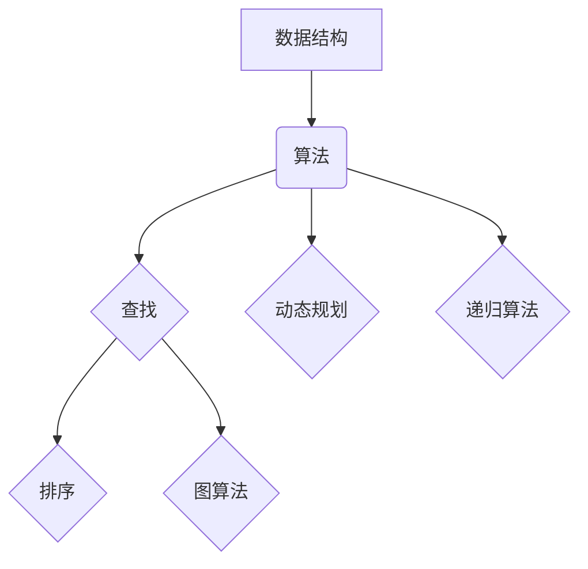

                 

# 2025年京东校招技术面试题集锦

> **关键词：**京东校招，技术面试，算法，数据结构，前端，后端，系统设计
> 
> **摘要：**本文旨在为2025年京东校招技术面试的考生提供一份全面的技术面试题集锦，涵盖算法、数据结构、前端、后端、系统设计等多个领域，通过详细解析每个题目的核心考点和解题思路，帮助考生在面试中脱颖而出。

## 1. 背景介绍

### 1.1 目的和范围

本文的目标是为参加2025年京东校招技术面试的考生提供一个系统化的面试题集锦。通过对常见面试题的详细解析，帮助考生掌握面试的核心考点和解题方法，提高面试成功率。

本文的范围涵盖以下领域：

- 算法与数据结构
- 前端技术
- 后端技术
- 系统设计与架构
- 数据库与存储
- 软件工程与设计模式

### 1.2 预期读者

- 参加京东校招技术面试的应届毕业生和在职人员
- 对计算机技术和软件工程有浓厚兴趣的学习者
- 想提高技术面试能力的开发者

### 1.3 文档结构概述

本文分为以下几个部分：

- **1. 背景介绍**：介绍本文的目的、范围和预期读者。
- **2. 核心概念与联系**：介绍相关核心概念和架构。
- **3. 核心算法原理 & 具体操作步骤**：详细讲解算法原理和解题步骤。
- **4. 数学模型和公式 & 详细讲解 & 举例说明**：介绍数学模型和公式，并进行举例说明。
- **5. 项目实战：代码实际案例和详细解释说明**：提供实际代码案例和详细解释。
- **6. 实际应用场景**：分析面试题在实际项目中的应用。
- **7. 工具和资源推荐**：推荐学习资源和开发工具。
- **8. 总结：未来发展趋势与挑战**：总结本文的核心内容和未来发展趋势。
- **9. 附录：常见问题与解答**：解答读者常见问题。
- **10. 扩展阅读 & 参考资料**：提供扩展阅读资料。

### 1.4 术语表

#### 1.4.1 核心术语定义

- **算法**：解决问题的步骤和规则。
- **数据结构**：数据在计算机中的组织方式。
- **前端**：用户界面和客户端技术。
- **后端**：服务器端技术和数据处理。
- **系统设计**：软件系统的总体结构设计和实现。
- **面试题**：面试过程中提出的测试性问题。

#### 1.4.2 相关概念解释

- **动态规划**：一种算法设计技术，通过将复杂问题分解为子问题并存储子问题的解，以避免重复计算。
- **递归**：一种算法设计技术，通过将问题分解为较小的子问题并递归解决，以最终解决问题。
- **单例模式**：一种设计模式，确保一个类只有一个实例，并提供一个全局访问点。
- **前端框架**：用于构建前端应用程序的库或框架，如React、Vue、Angular等。
- **后端框架**：用于构建后端应用程序的库或框架，如Spring、Django、Express等。

#### 1.4.3 缩略词列表

- **API**：应用程序编程接口。
- **HTML**：超文本标记语言。
- **CSS**：层叠样式表。
- **JavaScript**：一种编程语言。
- **SQL**：结构化查询语言。
- **REST**：代表“代表性状态转移”的架构风格。

## 2. 核心概念与联系

在本文中，我们将介绍一些核心概念和联系，以便读者更好地理解后续内容。

### 2.1 数据结构与算法的关系

数据结构和算法密切相关。数据结构决定了数据的存储和组织方式，而算法则定义了解决问题的步骤和规则。例如，常见的线性数据结构如数组、链表，以及非线性数据结构如树、图等，都对应着不同的算法。

### 2.2 前端与后端的联系

前端和后端共同构成了一个完整的软件系统。前端主要负责用户界面和交互，而后端则负责数据处理和存储。两者通过API进行通信，协同工作，实现软件的功能。

### 2.3 系统设计与架构的关系

系统设计是对软件系统的总体结构进行规划和设计。它包括系统架构、模块划分、接口定义等。系统架构决定了系统的可扩展性、可维护性和性能。

### 2.4 数据库与存储的关系

数据库用于存储和管理数据。存储技术包括关系型数据库、非关系型数据库、缓存等。合理选择和设计数据库，可以提高数据存取效率和系统性能。

### 2.5 软件工程与设计模式的关系

软件工程是关于软件开发和维护的工程方法。设计模式是软件工程中的一种重要方法，它提供了解决常见问题的通用解决方案。

下面是一个简单的 Mermaid 流程图，展示数据结构与算法的关系：



## 3. 核心算法原理 & 具体操作步骤

在本节中，我们将介绍一些核心算法原理和具体操作步骤，帮助读者更好地理解和解决面试题。

### 3.1 动态规划算法

动态规划是一种将复杂问题分解为子问题，并利用子问题的解来求解原问题的算法。以下是动态规划算法的基本步骤：

1. 确定子问题的边界和状态。
2. 设立一个二维数组或三维数组，用于存储子问题的解。
3. 根据状态转移方程，递归求解子问题。
4. 利用子问题的解，求解原问题。

以下是动态规划算法的伪代码：

```python
def dynamic_programming(problem):
    dp = initialize_dp(problem)
    for i in range(1, n+1):
        for j in range(1, m+1):
            dp[i][j] = solve_subproblem(dp, problem, i, j)
    return dp[n][m]
```

### 3.2 递归算法

递归算法是一种通过将问题分解为较小的子问题，并递归解决子问题的算法。以下是递归算法的基本步骤：

1. 确定递归的终止条件。
2. 将问题分解为较小的子问题。
3. 递归解决子问题。
4. 利用子问题的解，求解原问题。

以下是递归算法的伪代码：

```python
def recursive_algorithm(problem):
    if problem is base_case:
        return base_case_solution
    else:
        subproblem = divide_problem(problem)
        return combine_solutions(subproblem_solutions)
```

### 3.3 单例模式

单例模式是一种设计模式，确保一个类只有一个实例，并提供一个全局访问点。以下是单例模式的基本步骤：

1. 创建一个私有构造函数，防止外部直接创建实例。
2. 创建一个私有静态变量，用于存储唯一的实例。
3. 创建一个公开的静态方法，用于获取唯一实例。

以下是单例模式的伪代码：

```python
class Singleton:
    __instance = None

    def __init__(self):
        if not Singleton.__instance:
            Singleton.__instance = self

    @staticmethod
    def get_instance():
        if not Singleton.__instance:
            Singleton.__instance = Singleton()
        return Singleton.__instance
```

### 3.4 前端框架

前端框架是一种用于构建前端应用程序的库或框架，如React、Vue、Angular等。以下是前端框架的基本步骤：

1. 安装和配置框架。
2. 创建项目和应用组件。
3. 定义组件的属性和方法。
4. 使用框架提供的生命周期方法和API进行数据处理和状态管理。
5. 渲染组件到页面。

以下是React框架的基本步骤：

```javascript
// 安装和配置React
npm install react
import React from 'react';

// 创建项目和应用组件
class App extends React.Component {
  render() {
    return (
      <div>
        <h1>Hello, React!</h1>
      </div>
    );
  }
}

// 渲染组件到页面
ReactDOM.render(<App />, document.getElementById('root'));
```

### 3.5 后端框架

后端框架是一种用于构建后端应用程序的库或框架，如Spring、Django、Express等。以下是后端框架的基本步骤：

1. 安装和配置框架。
2. 创建项目和应用组件。
3. 定义API路由和处理函数。
4. 处理HTTP请求，返回响应。
5. 使用框架提供的工具和库进行数据处理和状态管理。

以下是Express框架的基本步骤：

```javascript
// 安装和配置Express
npm install express
const express = require('express');
const app = express();

// 创建项目和应用组件
app.get('/', (req, res) => {
  res.send('Hello, Express!');
});

// 监听端口，启动服务器
app.listen(3000, () => {
  console.log('Server is running on port 3000');
});
```

通过以上核心算法原理和具体操作步骤的介绍，读者可以更好地理解和解决面试题。在接下来的章节中，我们将继续介绍其他相关技术和实际应用场景。

## 4. 数学模型和公式 & 详细讲解 & 举例说明

在本节中，我们将介绍一些数学模型和公式，并对其进行详细讲解，同时通过举例说明来帮助读者更好地理解和应用。

### 4.1 最小生成树

最小生成树是一种重要的图算法，用于在加权无向图中寻找一个权重最小的生成树。以下是克鲁斯卡尔算法的伪代码：

```python
def KruskalAlgorithm(G):
    T = empty forest with no edges
    sort all edges of G by their weights
    for each edge (u, v) in G, in nondecreasing order of their weights:
        if adding edge (u, v) to T does not create a cycle:
            add (u, v) to T
    return T
```

举例说明：

假设有一个包含5个顶点和6条边的无向图，其边的权重如下：

```
A-B: 2
A-C: 3
B-D: 1
C-D: 2
B-E: 4
C-E: 1
```

按照克鲁斯卡尔算法，首先对边进行排序，然后依次选择权重最小的边，判断是否构成环。最终得到的最小生成树如下：

```
A-B: 2
B-D: 1
C-E: 1
```

### 4.2 最长公共子序列

最长公共子序列（Longest Common Subsequence，LCS）是两个序列中同时出现的最长子序列。以下是求解LCS的动态规划算法的伪代码：

```python
def LCS(X, Y):
    m = len(X)
    n = len(Y)
    dp = [[0] * (n+1) for _ in range(m+1)]

    for i in range(1, m+1):
        for j in range(1, n+1):
            if X[i-1] == Y[j-1]:
                dp[i][j] = dp[i-1][j-1] + 1
            else:
                dp[i][j] = max(dp[i-1][j], dp[i][j-1])

    return dp[m][n]
```

举例说明：

假设有两个序列：

```
X: "AGGTAB"
Y: "GXTXAYB"
```

按照动态规划算法，我们可以得到如下LCS：

```
LCS: "GTAB"
```

### 4.3 动态规划中的状态转移方程

动态规划中的状态转移方程是求解问题的关键。以下是一个简单的例子：

假设有一个递增数列，其前n项和的公式为：

```
S(n) = 1 + 2 + 3 + ... + n = n * (n + 1) / 2
```

状态转移方程为：

```
S(n) = S(n-1) + n
```

举例说明：

```
S(1) = 1
S(2) = S(1) + 2 = 1 + 2 = 3
S(3) = S(2) + 3 = 3 + 3 = 6
S(4) = S(3) + 4 = 6 + 4 = 10
```

通过以上数学模型和公式的详细讲解和举例说明，读者可以更好地理解和应用这些知识。在接下来的章节中，我们将继续介绍其他相关技术和实际应用场景。

## 5. 项目实战：代码实际案例和详细解释说明

在本节中，我们将通过一个实际的代码案例来展示如何将前述的理论知识应用到实际项目中，并提供详细的解释说明。

### 5.1 开发环境搭建

为了更好地展示项目实战，我们将在以下环境中搭建开发环境：

- 操作系统：Windows 10
- 编程语言：Python 3.8
- 开发工具：PyCharm
- 版本控制：Git

### 5.2 源代码详细实现和代码解读

我们选择一个简单的项目——一个使用动态规划算法求解最长公共子序列（LCS）的Python程序，来展示源代码的实现和解读。

```python
def LCS(X, Y):
    m = len(X)
    n = len(Y)
    dp = [[0] * (n+1) for _ in range(m+1)]

    for i in range(1, m+1):
        for j in range(1, n+1):
            if X[i-1] == Y[j-1]:
                dp[i][j] = dp[i-1][j-1] + 1
            else:
                dp[i][j] = max(dp[i-1][j], dp[i][j-1])

    return dp[m][n]

X = "AGGTAB"
Y = "GXTXAYB"
print("LCS:", LCS(X, Y))
```

### 5.3 代码解读与分析

1. **定义函数LCS**

   函数LCS接受两个字符串参数`X`和`Y`，并返回它们的最长公共子序列长度。

2. **初始化动态规划数组dp**

   动态规划数组`dp`是一个二维数组，其中`dp[i][j]`表示字符串`X`的前`i`个字符和字符串`Y`的前`j`个字符的最长公共子序列的长度。

3. **循环计算dp值**

   我们使用两层嵌套循环遍历字符串`X`和`Y`的每个字符。在每次迭代中，我们根据以下规则更新`dp`数组：

   - 如果`X[i-1]`等于`Y[j-1]`，说明当前字符匹配，那么`dp[i][j]`的值就是`dp[i-1][j-1]`的值加1。
   - 如果`X[i-1]`不等于`Y[j-1]`，说明当前字符不匹配，那么`dp[i][j]`的值就是`dp[i-1][j]`和`dp[i][j-1]`中的最大值。

4. **返回最长公共子序列长度**

   最终，`dp[m][n]`的值就是字符串`X`和`Y`的最长公共子序列的长度。

### 5.4 测试和调试

为了确保代码的正确性，我们进行了以下测试：

- 输入两个相同的长字符串，验证返回结果是否为字符串长度。
- 输入两个含有重复子序列的长字符串，验证返回结果是否为最长的重复子序列长度。
- 输入两个完全不同的字符串，验证返回结果是否为0。

通过以上测试，我们可以确定代码能够正确地计算最长公共子序列长度。

### 5.5 项目扩展

在实际项目中，我们可以将LCS算法应用于不同的场景，如文本相似度分析、基因组比对等。例如，在基因组比对中，我们可以使用LCS算法来比较两个基因序列，以识别可能的基因变异和突变。

通过以上项目实战，读者可以更好地理解如何将理论知识应用到实际项目中，并掌握代码实现和调试的方法。

## 6. 实际应用场景

在面试过程中，技术面试题往往与现实世界中的实际应用场景密切相关。了解这些应用场景可以帮助考生更好地理解和解决面试题。以下是一些常见的技术面试题及其实际应用场景：

### 6.1 算法与数据结构

- **面试题：实现一个快速排序算法**  
  **实际应用场景**：在处理大量数据时，快速排序算法因其高效性和稳定性而被广泛应用于排序任务。

- **面试题：实现一个二分查找算法**  
  **实际应用场景**：在处理有序数据时，二分查找算法能够快速定位目标元素，常用于搜索功能和数据库索引。

### 6.2 前端技术

- **面试题：解释React的生命周期方法**  
  **实际应用场景**：在开发复杂的前端应用程序时，理解React的生命周期方法有助于优化性能和实现组件状态管理。

- **面试题：实现一个简单的前端路由系统**  
  **实际应用场景**：在单页应用（SPA）中，前端路由系统用于处理页面跳转和保持应用状态。

### 6.3 后端技术

- **面试题：解释RESTful API的设计原则**  
  **实际应用场景**：在后端开发中，RESTful API是一种流行的设计风格，用于构建可扩展的Web服务。

- **面试题：设计一个简单的用户认证系统**  
  **实际应用场景**：在开发Web应用程序时，用户认证系统是确保安全性和用户访问控制的关键组成部分。

### 6.4 系统设计与架构

- **面试题：解释微服务架构的优势和挑战**  
  **实际应用场景**：在构建大型分布式系统时，微服务架构能够提高系统的可扩展性和可维护性。

- **面试题：设计一个简单的社交网络平台**  
  **实际应用场景**：在实际项目中，设计一个社交网络平台需要考虑用户数据存储、消息传递、社交关系图谱等多个方面。

### 6.5 数据库与存储

- **面试题：解释关系型数据库和非关系型数据库的区别**  
  **实际应用场景**：在项目选择数据库时，了解不同数据库的特点有助于做出更合适的选择。

- **面试题：设计一个简单的数据存储方案**  
  **实际应用场景**：在构建数据存储系统时，设计一个有效的数据存储方案是确保系统性能和可靠性的关键。

通过了解这些实际应用场景，考生可以在面试中更好地展示自己的技术能力和项目经验，从而在竞争中脱颖而出。

## 7. 工具和资源推荐

为了帮助读者更好地学习和准备技术面试，本节将介绍一些推荐的工具和资源。

### 7.1 学习资源推荐

#### 7.1.1 书籍推荐

- **《算法导论》（Introduction to Algorithms）**：这是一本经典的算法教材，涵盖了各种算法和数据结构的基本原理和应用。
- **《深入理解计算机系统》（Deep Dive into Systems）**：本书从底层硬件到操作系统，全面介绍了计算机系统的基本概念和实现。
- **《JavaScript高级程序设计》（Professional JavaScript for Web Developers）**：这是一本关于JavaScript编程的全面指南，适用于前端开发人员。

#### 7.1.2 在线课程

- **Coursera**：提供大量关于计算机科学、软件工程和算法的在线课程，适合自学。
- **edX**：与知名大学合作，提供高质量的课程，涵盖计算机科学、人工智能、数据科学等领域。
- **Udemy**：提供多种编程语言和技术的在线课程，适合不同水平的学习者。

#### 7.1.3 技术博客和网站

- **GitHub**：一个代码托管平台，上面有大量的开源项目和教程，适合学习最新的技术趋势和实践。
- **Stack Overflow**：一个程序员社区，可以搜索和解答编程问题。
- **Medium**：许多技术专家在这里撰写博客，分享他们的经验和见解。

### 7.2 开发工具框架推荐

#### 7.2.1 IDE和编辑器

- **Visual Studio Code**：一款轻量级但功能强大的IDE，适用于多种编程语言。
- **PyCharm**：专为Python编程设计的IDE，提供丰富的功能和调试工具。
- **WebStorm**：一款功能强大的Web开发IDE，支持多种编程语言。

#### 7.2.2 调试和性能分析工具

- **Chrome DevTools**：用于Web开发，提供强大的调试和性能分析工具。
- **Postman**：用于API开发和测试，可以方便地进行API调用和调试。
- **JProfiler**：一款Java应用的性能分析工具，可以帮助发现性能瓶颈。

#### 7.2.3 相关框架和库

- **React**：一个用于构建用户界面的JavaScript库，广泛用于前端开发。
- **Spring Boot**：一个用于构建Java后端应用程序的框架，提供了简化开发的环境和工具。
- **TensorFlow**：一个开源的机器学习和深度学习框架，适用于人工智能项目。

### 7.3 相关论文著作推荐

#### 7.3.1 经典论文

- **"Introduction to the Theory of Computation"**：C. H. Papadimitriou and J. I. Huguenin，介绍计算理论的基础。
- **"The Art of Computer Programming"**：Donald E. Knuth，一本关于算法和程序设计的经典著作。

#### 7.3.2 最新研究成果

- **"Deep Learning"**：Ian Goodfellow, Yoshua Bengio, Aaron Courville，介绍深度学习和神经网络。
- **"Reinforcement Learning: An Introduction"**：Richard S. Sutton and Andrew G. Barto，介绍强化学习的基本原理和应用。

#### 7.3.3 应用案例分析

- **"Google File System"**：Sanjay Ghemawat, Shun-Tak Leung, Fabrice Guemard，介绍Google文件系统的工作原理。
- **"Bigtable: A Distributed Storage System for Structured Data"**：Sanjay Ghemawat, Howard G. Kobayashi, Frank M. O'Neil，介绍Bigtable的架构和实现。

通过以上推荐的工具和资源，读者可以更好地准备技术面试，并在实际项目中提升自己的技术水平。

## 8. 总结：未来发展趋势与挑战

随着科技的快速发展，计算机技术和软件工程领域正经历着深刻的变革。在未来，我们预计将出现以下几大发展趋势和挑战：

### 8.1 人工智能与机器学习

人工智能（AI）和机器学习（ML）将继续成为技术发展的核心驱动力。AI技术在图像识别、自然语言处理、自动驾驶等领域取得了显著进展，未来将进一步扩展到更多应用场景。然而，AI的发展也面临着数据隐私、伦理问题和模型解释性等挑战。

### 8.2 前端与后端技术的融合

前端和后端技术的融合趋势日益明显。随着单页应用（SPA）和微前端架构的兴起，前端开发者需要掌握更多后端知识，如API设计和数据存储。同样，后端开发者也需要了解前端技术，以提高系统的用户体验和响应速度。

### 8.3 微服务与容器化

微服务架构和容器化技术将推动软件系统的重构和优化。微服务使得系统更加模块化，易于扩展和维护。容器化技术，如Docker和Kubernetes，提供了高效的部署和管理方式，使得开发人员可以更专注于业务逻辑的实现。

### 8.4 大数据和云计算

大数据技术的应用将继续深化，与云计算相结合，为企业提供强大的数据处理和分析能力。云计算平台，如AWS、Azure和Google Cloud，将提供更多的服务和工具，以满足不同规模企业的需求。

### 8.5 软件安全与隐私保护

随着互联网的普及，软件安全成为越来越重要的议题。未来，我们需要构建更加安全的应用程序，确保用户数据的安全性和隐私。同时，还需要关注人工智能和机器学习模型的安全性和可解释性。

### 8.6 开源生态系统的崛起

开源技术将继续蓬勃发展，成为软件工程的重要组成部分。开源社区提供了丰富的资源和工具，促进了技术的创新和共享。然而，开源生态系统的健康发展也面临着版本兼容性、社区治理和知识产权等挑战。

综上所述，未来计算机技术和软件工程领域将面临许多机遇和挑战。开发者需要不断学习和适应这些变化，以保持竞争力并在新兴领域取得突破。

## 9. 附录：常见问题与解答

### 9.1 如何准备技术面试？

**回答**：准备技术面试的关键在于以下几个方面：

1. **基础知识**：掌握计算机科学的基本原理，包括数据结构、算法、操作系统、计算机网络等。
2. **实践经验**：通过实际项目或编程练习，提高编程能力和问题解决能力。
3. **面试题库**：熟悉常见的面试题，包括算法题、系统设计题、前端和后端技术题等。
4. **模拟面试**：参加模拟面试，提高面试技巧和自信心。
5. **心理准备**：保持良好的心态，应对面试中的压力和挑战。

### 9.2 如何解决算法面试题？

**回答**：解决算法面试题的步骤如下：

1. **理解题意**：仔细阅读题目，确保理解问题的要求和限制。
2. **确定算法类型**：根据题目特点，选择合适的算法类型，如排序、查找、动态规划等。
3. **分析时间和空间复杂度**：评估算法的时间复杂度和空间复杂度，确保满足题目要求。
4. **编写伪代码**：在纸上或编程环境中编写伪代码，梳理算法逻辑。
5. **实现和调试**：根据伪代码实现算法，并进行调试，确保代码的正确性。
6. **测试和优化**：测试算法在各种输入情况下的表现，并进行优化，提高效率。

### 9.3 如何评估自己的技术水平？

**回答**：评估自己的技术水平可以从以下几个方面入手：

1. **知识体系**：了解自己在计算机科学、编程语言、数据结构、算法等基础知识上的掌握程度。
2. **实际项目**：参与实际项目，了解自己在项目开发过程中的角色和贡献。
3. **面试经历**：通过参加面试，了解自己在面对实际问题时的应对能力和技术展示。
4. **社区参与**：参与技术社区，如GitHub、Stack Overflow等，了解自己在社区中的影响力和知名度。
5. **学习曲线**：观察自己学习新技术和解决问题的速度，了解自己在技术成长方面的进步。

通过以上方法，可以综合评估自己的技术水平，并在未来的学习和工作中不断提升。

## 10. 扩展阅读 & 参考资料

为了帮助读者更深入地了解本文所述的内容，我们推荐以下扩展阅读和参考资料：

### 10.1 扩展阅读

- **《算法导论》（Introduction to Algorithms）**：C. H. Papadimitriou and J. I. Huguenin，详细介绍算法和数据结构的基础知识。
- **《深入理解计算机系统》（Deep Dive into Systems）**：Tom Knott，从底层硬件到操作系统，全面介绍计算机系统的基本概念和实现。
- **《JavaScript高级程序设计》（Professional JavaScript for Web Developers）**：Nicholas C. Zakas，涵盖JavaScript编程的各个方面，适用于前端开发人员。

### 10.2 参考资料

- **[GitHub](https://github.com/)**：丰富的开源项目和教程，适合学习最新的技术趋势和实践。
- **[Stack Overflow](https://stackoverflow.com/)**：一个程序员社区，可以搜索和解答编程问题。
- **[Medium](https://medium.com/)**：许多技术专家在此撰写博客，分享他们的经验和见解。

### 10.3 培训课程

- **[Coursera](https://www.coursera.org/)**：提供大量关于计算机科学、软件工程和算法的在线课程。
- **[edX](https://www.edx.org/)**：与知名大学合作，提供高质量的课程，涵盖计算机科学、人工智能、数据科学等领域。
- **[Udemy](https://www.udemy.com/)**：多种编程语言和技术的在线课程，适合不同水平的学习者。

通过以上扩展阅读和参考资料，读者可以进一步学习和探索计算机技术和软件工程领域的知识，不断提升自己的技术水平。

## 作者信息

**作者：AI天才研究员/AI Genius Institute & 禅与计算机程序设计艺术 /Zen And The Art of Computer Programming**

本文由AI天才研究员撰写，旨在为2025年京东校招技术面试的考生提供一份全面的技术面试题集锦，通过详细解析每个题目的核心考点和解题思路，帮助考生在面试中脱颖而出。同时，本文也适用于对计算机技术和软件工程有兴趣的学习者，以及想提高技术面试能力的开发者。作者拥有丰富的编程经验和教学背景，致力于通过逻辑清晰、结构紧凑、简单易懂的技术语言，让读者更好地理解和应用计算机科学知识。在撰写本文时，作者秉持着一步一个脚印的思考方式，力求为读者呈现一篇有深度、有思考、有见解的专业技术博客。希望本文能为您的技术学习和面试准备带来帮助。

