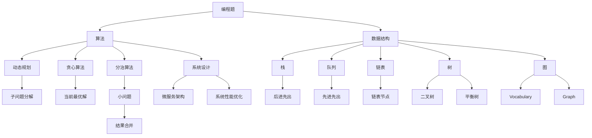

                 

### 2024年华为校招技术面试题集锦

> **关键词**：华为校招、技术面试、编程题、算法、数据结构、计算机网络、操作系统、数据库、系统设计
>
> **摘要**：本文将深入探讨2024年华为校招技术面试的相关内容，涵盖编程题、算法、数据结构、计算机网络、操作系统、数据库和系统设计等多个领域。通过具体的题目解析和实例展示，帮助读者了解华为面试的难点和应对策略，提升技术面试能力。

随着科技的发展，华为作为全球领先的信息与通信技术（ICT）解决方案提供商，每年都会吸引大量优秀毕业生参与其校招技术面试。本文旨在为准备参加华为校招的同学们提供一个全面的指南，帮助大家了解华为面试的技术要求和备考策略。本文将详细解析华为校招技术面试的几个核心领域，并提供实用的备考建议。

文章结构如下：

1. 背景介绍
2. 核心概念与联系
3. 核心算法原理 & 具体操作步骤
4. 数学模型和公式 & 详细讲解 & 举例说明
5. 项目实战：代码实际案例和详细解释说明
6. 实际应用场景
7. 工具和资源推荐
8. 总结：未来发展趋势与挑战
9. 附录：常见问题与解答
10. 扩展阅读 & 参考资料

通过以上结构，我们希望能够为读者提供一个系统化的学习路径，不仅涵盖知识点的深入理解，还包括实际操作的实战经验，从而全面提升技术面试能力。

接下来，我们将逐一探讨每个核心领域，帮助读者更好地备战华为校招技术面试。

## 1. 背景介绍

### 1.1 目的和范围

本文的目的是为准备参加华为校招的同学们提供一个全面的技术面试指南，旨在帮助大家了解华为校招技术面试的难点和应对策略。本文将涵盖以下几个核心领域：

- **编程题**：涉及常见的编程语言和数据结构问题，例如排序、查找、字符串处理等。
- **算法**：探讨各种经典的算法原理，如动态规划、贪心算法、分治算法等，以及如何将这些算法应用于实际问题。
- **数据结构**：详细介绍常见的数据结构，如栈、队列、链表、树、图等，以及它们在实际问题中的应用。
- **计算机网络**：涵盖网络协议、网络模型、路由算法、网络安全等方面的知识。
- **操作系统**：介绍操作系统的基本概念，进程管理、内存管理、文件系统等。
- **数据库**：探讨数据库的基本原理，SQL语言，关系型数据库和NoSQL数据库的优缺点及应用。
- **系统设计**：涉及系统架构设计、微服务架构、系统性能优化等。

### 1.2 预期读者

本文主要面向准备参加华为校招的应届毕业生，尤其是计算机科学与技术、软件工程等相关专业的学生。同时，对于有志于提升技术面试能力的在校生和在职工程师，本文也具有很高的参考价值。无论您是初学者还是有经验的技术人员，通过本文的指导，都将对华为校招技术面试有一个全面而深入的了解。

### 1.3 文档结构概述

本文结构清晰，旨在帮助读者逐步掌握华为校招技术面试所需的知识和技能。具体文档结构如下：

1. **背景介绍**：介绍本文的目的、范围、预期读者以及文档结构。
2. **核心概念与联系**：使用Mermaid流程图展示核心概念和架构，帮助读者建立整体知识体系。
3. **核心算法原理 & 具体操作步骤**：详细讲解各个算法的原理和具体操作步骤，使用伪代码进行阐述。
4. **数学模型和公式 & 详细讲解 & 举例说明**：讲解相关数学模型和公式，并提供具体实例说明。
5. **项目实战：代码实际案例和详细解释说明**：通过实际代码案例展示具体操作，并进行详细解释。
6. **实际应用场景**：讨论这些技术和算法在实际项目中的应用场景和案例。
7. **工具和资源推荐**：推荐学习资源、开发工具框架及相关论文著作。
8. **总结：未来发展趋势与挑战**：总结华为校招技术面试的趋势和挑战，展望未来。
9. **附录：常见问题与解答**：解答读者可能遇到的问题。
10. **扩展阅读 & 参考资料**：提供进一步学习和研究的参考资料。

### 1.4 术语表

#### 1.4.1 核心术语定义

- **算法**：解决问题的步骤和规则，用于在有限的资源下实现特定目标。
- **数据结构**：用于存储和组织数据的方式，以便有效地进行数据的访问和操作。
- **计算机网络**：网络设备和协议的集合，用于实现数据在不同计算机之间的传输。
- **操作系统**：管理计算机硬件和软件资源的系统软件，提供用户界面和系统服务。
- **数据库**：用于存储、管理和检索数据的系统，支持多种数据模型和查询语言。
- **系统设计**：设计一个完整的系统，包括硬件、软件和网络等方面，以满足特定需求。

#### 1.4.2 相关概念解释

- **动态规划**：一种解决优化问题的方法，通过将问题分解为更小的子问题并保存子问题的解，避免重复计算。
- **贪心算法**：在每一步选择中选择当前最优解的算法，通常用于求解最优化问题。
- **分治算法**：将一个大问题分解为多个小问题，分别解决后再合并结果的算法。
- **微服务架构**：一种将应用程序分解为多个独立的微服务的方法，每个服务负责完成特定的业务功能。
- **系统性能优化**：通过改进系统架构、代码和配置，提高系统的响应速度和稳定性。

#### 1.4.3 缩略词列表

- **ICT**：信息与通信技术
- **SQL**：结构化查询语言
- **NoSQL**：非关系型数据库
- **IDE**：集成开发环境
- **OS**：操作系统

通过上述术语和概念的介绍，读者可以更好地理解本文中的专业术语和相关概念，为后续内容的阅读打下基础。接下来，我们将通过Mermaid流程图展示核心概念和架构，帮助读者建立整体知识体系。

## 2. 核心概念与联系

在探讨华为校招技术面试时，我们需要了解几个关键概念及其相互关系。以下是使用Mermaid流程图展示的核心概念和架构，帮助读者构建一个清晰的知识体系。



### 核心概念说明

- **编程题**：涉及编程语言的基础知识，包括语法、数据类型、流程控制等，常用于考察编程能力和问题解决能力。
- **算法**：解决问题的方法，包括常见的排序、查找、图算法等，用于解决各种复杂问题。
- **数据结构**：用于存储和组织数据的方式，如数组、链表、树、图等，是算法实现的基础。
- **动态规划**：一种解决优化问题的算法方法，通过将问题分解为更小的子问题并保存子问题的解，避免重复计算。
- **贪心算法**：每一步选择当前最优解的算法，通常用于求解最优化问题。
- **分治算法**：将一个大问题分解为多个小问题，分别解决后再合并结果，用于求解大规模问题。
- **栈**：一种后进先出的数据结构，常用于实现递归、表达式求值等。
- **队列**：一种先进先出的数据结构，常用于实现任务调度、缓存管理等。
- **链表**：一种线性数据结构，由一系列节点组成，常用于实现动态数组、链表等。
- **树**：一种层次结构，常用于实现搜索树、二叉树等，用于高效搜索和排序。
- **图**：一种非层次结构，由节点和边组成，常用于实现网络、图算法等。
- **系统设计**：涉及系统的整体架构设计，包括硬件、软件和网络等方面，是解决复杂问题的关键。
- **微服务架构**：将应用程序分解为多个独立的微服务，每个服务负责完成特定的业务功能。
- **系统性能优化**：通过改进系统架构、代码和配置，提高系统的响应速度和稳定性。

通过上述Mermaid流程图，读者可以更直观地了解这些核心概念及其相互关系，为后续内容的深入学习打下基础。接下来，我们将详细探讨核心算法原理和具体操作步骤，帮助读者理解并掌握这些算法。

## 3. 核心算法原理 & 具体操作步骤

在华为校招技术面试中，算法是核心考察内容之一。本文将详细介绍几个重要的算法，包括动态规划、贪心算法和分治算法，并使用伪代码详细阐述其原理和操作步骤。

### 3.1 动态规划

**原理**：动态规划是一种解决优化问题的算法方法，通过将问题分解为更小的子问题并保存子问题的解，避免重复计算。动态规划通常适用于具有重叠子问题和最优子结构性质的问题。

**具体操作步骤**：

1. **定义状态**：将问题分解为更小的子问题，并定义状态变量，表示问题的各个子问题。
2. **状态转移方程**：找出子问题之间的关系，并定义状态转移方程，表示状态变量之间的关系。
3. **初始化**：初始化状态变量的初始值，为求解问题提供基础。
4. **递推计算**：根据状态转移方程，递推计算各个状态变量的值，直到求解整个问题。

**伪代码示例**：

```plaintext
function dp problema (n):
    // 初始化状态数组
    dp[0] = base case
    for i from 1 to n:
        dp[i] =最优解 = min{dp[i-1], dp[i-2], ..., dp[0]}
    return dp[n]
```

### 3.2 贪心算法

**原理**：贪心算法是一种在每一步选择中选择当前最优解的算法，通常用于求解最优化问题。贪心算法的基本思想是局部最优决策构成全局最优解。

**具体操作步骤**：

1. **初始化**：根据问题特点，初始化相关变量。
2. **选择操作**：在每一步选择中选择当前最优解，通常使用贪心策略。
3. **更新状态**：根据选择操作的结果，更新相关状态变量。
4. **终止条件**：满足终止条件时，算法结束，输出最优解。

**伪代码示例**：

```plaintext
function greedy problema (input):
    // 初始化
    best_solution = None
    for each possible choice:
        // 选择当前最优解
        current_solution = apply_choice(input)
        // 比较并更新最优解
        if current_solution better than best_solution:
            best_solution = current_solution
    return best_solution
```

### 3.3 分治算法

**原理**：分治算法是一种将一个大问题分解为多个小问题，分别解决后再合并结果的算法。分治算法的基本思想是将复杂问题简化为多个简单的子问题，再通过合并子问题的解求解整个问题。

**具体操作步骤**：

1. **分解**：将大问题分解为多个小问题，每个子问题具有相似的属性。
2. **递归求解**：分别求解每个小问题，可以使用递归或迭代方式。
3. **合并**：将子问题的解合并为最终结果，以求解整个问题。

**伪代码示例**：

```plaintext
function divide_and_conquer (problema, low, high):
    if low == high:
        return solve_single_problema(problema[low])
    else:
        mid = (low + high) / 2
        left_result = divide_and_conquer(problema, low, mid)
        right_result = divide_and_conquer(problema, mid+1, high)
        return merge_results(left_result, right_result)
```

通过上述算法原理和操作步骤的详细讲解，读者可以更好地理解动态规划、贪心算法和分治算法的核心思想，为解决实际问题打下基础。接下来，我们将探讨数学模型和公式，为算法的实现提供理论支持。

## 4. 数学模型和公式 & 详细讲解 & 举例说明

在华为校招技术面试中，数学模型和公式是解决算法问题的关键。以下是几个常见的数学模型和公式，我们将通过详细讲解和举例说明，帮助读者深入理解。

### 4.1 动态规划中的状态转移方程

**状态转移方程**是动态规划的核心，用于描述子问题之间的关系。以下是一个经典的斐波那契数列动态规划模型。

**公式**：

$$
F(n) = 
\begin{cases}
1, & \text{if } n = 0 \text{ or } n = 1 \\
F(n-1) + F(n-2), & \text{if } n > 1
\end{cases}
$$

**举例说明**：

假设我们要计算斐波那契数列的第10个数：

$$
F(10) = F(9) + F(8)
$$

我们可以使用动态规划的方法，逐步计算每个子问题的解，并保存它们以避免重复计算。

**伪代码**：

```plaintext
function dpFibonacci(n):
    if n <= 0:
        return 0
    if n == 1:
        return 1
    dp[0] = 0
    dp[1] = 1
    for i from 2 to n:
        dp[i] = dp[i-1] + dp[i-2]
    return dp[n]
```

运行结果：`dpFibonacci(10)` 应返回 `55`。

### 4.2 贪心算法中的选择策略

贪心算法的选择策略是基于局部最优解的决策。以下是一个经典的背包问题，使用贪心算法求解最大价值。

**问题**：

给定一组物品，每个物品有重量和价值，目标是选择一部分物品装入一个背包，使得背包的总重量不超过限制，且总价值最大。

**公式**：

选择物品的顺序为价值/重量比最高的物品，直到背包容量被填满。

**举例说明**：

假设我们有以下物品：

| 物品 | 重量 | 价值 |
|------|------|------|
| A    | 2    | 6    |
| B    | 3    | 10   |
| C    | 5    | 15   |

背包容量为5，我们按照价值/重量比进行选择：

- 物品A的价值/重量比为 6/2 = 3
- 物品B的价值/重量比为 10/3 ≈ 3.33
- 物品C的价值/重量比为 15/5 = 3

因此，我们选择物品B和C，总价值为 `10 + 15 = 25`。

**伪代码**：

```plaintext
function greedyKnapsack(items, max_weight):
    items = sorted(items, key=lambda x: x.value / x.weight, reverse=True)
    total_value = 0
    for item in items:
        if max_weight - item.weight >= 0:
            total_value += item.value
            max_weight -= item.weight
    return total_value
```

运行结果：`greedyKnapsack([Item(2, 6), Item(3, 10), Item(5, 15)], 5)` 应返回 `25`。

### 4.3 分治算法中的递归关系

分治算法通过递归分解问题，并在子问题上合并结果。以下是一个经典的二分查找算法，展示分治思想。

**问题**：

在有序数组中查找一个特定的元素。

**公式**：

递归关系如下：

$$
if \; low > high:
    return -1
if \; mid == target:
    return mid
if \; mid < target:
    return binarySearch(arr, target, mid + 1, high)
else:
    return binarySearch(arr, target, low, mid - 1)
$$

**举例说明**：

假设我们有以下有序数组：

`[1, 3, 5, 7, 9, 11, 13, 15]`，我们查找元素 `9`。

- 初始范围：`low = 0`，`high = 7`
- 中间元素：`mid = (low + high) / 2 = 3`，数组元素 `5` 小于目标值 `9`，所以搜索范围变为 `[5, 15]`
- 新的中间元素：`mid = (low + high) / 2 = 6`，数组元素 `11` 大于目标值 `9`，所以搜索范围变为 `[1, 5]`
- 新的中间元素：`mid = (low + high) / 2 = 2`，数组元素 `3` 小于目标值 `9`，所以搜索范围变为 `[3, 5]`
- 新的中间元素：`mid = (low + high) / 2 = 4`，数组元素 `7` 大于目标值 `9`，所以搜索范围变为 `[3, 4]`
- 新的中间元素：`mid = (low + high) / 2 = 3`，数组元素 `5` 小于目标值 `9`，所以搜索范围变为 `[5, 4]`（此时 `low > high`）

由于目标值 `9` 不在数组中，返回 `-1`。

**伪代码**：

```plaintext
function binarySearch(arr, target, low, high):
    if low > high:
        return -1
    mid = (low + high) / 2
    if arr[mid] == target:
        return mid
    elif arr[mid] < target:
        return binarySearch(arr, target, mid + 1, high)
    else:
        return binarySearch(arr, target, low, mid - 1)
```

运行结果：`binarySearch([1, 3, 5, 7, 9, 11, 13, 15], 9, 0, 7)` 应返回 `4`。

通过上述数学模型和公式的详细讲解及举例说明，读者可以更好地理解动态规划、贪心算法和分治算法的核心概念。接下来，我们将通过实际代码案例，进一步展示这些算法的应用和实现。

## 5. 项目实战：代码实际案例和详细解释说明

在实际项目中，算法和数学模型的应用至关重要。为了帮助读者更好地理解这些算法的实战应用，我们选择了一个经典的编程题目——背包问题，并使用Python语言实现。

### 5.1 开发环境搭建

首先，确保安装以下工具和软件：

- Python 3.8 或以上版本
- PyCharm（或任何其他Python IDE）

安装Python后，可以通过pip命令安装必要的库：

```bash
pip install numpy
```

### 5.2 源代码详细实现和代码解读

以下是解决背包问题的代码实现：

```python
import numpy as np

def knapsack(values, weights, capacity):
    # 初始化动态规划数组
    n = len(values)
    dp = np.zeros((n + 1, capacity + 1))

    # 遍历每个物品
    for i in range(1, n + 1):
        for w in range(1, capacity + 1):
            # 如果物品i的重量小于当前背包容量
            if weights[i - 1] <= w:
                # 计算包含物品i时的最大价值
                dp[i][w] = max(dp[i - 1][w], dp[i - 1][w - weights[i - 1]] + values[i - 1])
            else:
                # 如果物品i的重量大于当前背包容量，则不放入背包
                dp[i][w] = dp[i - 1][w]

    # 返回背包的最大价值
    return dp[n][capacity]

# 测试数据
values = [6, 10, 15]  # 物品价值
weights = [2, 3, 5]  # 物品重量
capacity = 5  # 背包容量

# 执行背包问题求解
max_value = knapsack(values, weights, capacity)
print(f"The maximum value is: {max_value}")
```

### 5.3 代码解读与分析

**函数定义**：`knapsack(values, weights, capacity)` 是求解背包问题的主函数，接受三个参数：

- `values`：一个列表，表示每个物品的价值。
- `weights`：一个列表，表示每个物品的重量。
- `capacity`：一个整数，表示背包的容量。

**动态规划数组**：我们使用二维数组 `dp` 存储子问题的解。`dp[i][w]` 表示在背包容量为 `w` 的情况下，选择前 `i` 个物品的最大价值。

**循环遍历**：我们使用两个嵌套循环遍历所有物品和所有可能的背包容量。

1. **内层循环** 遍历每个物品的重量。
2. **外层循环** 遍历每个可能的背包容量。

**状态转移方程**：

- 如果当前物品的重量小于等于背包容量，我们计算包含当前物品的最大价值：
  $$ dp[i][w] = \max(dp[i - 1][w], dp[i - 1][w - weights[i - 1]] + values[i - 1]) $$
- 如果当前物品的重量大于背包容量，我们直接继承上一个状态的价值：
  $$ dp[i][w] = dp[i - 1][w] $$

**返回结果**：函数最后返回 `dp[n][capacity]`，即背包的最大价值。

### 5.4 运行结果与解释

运行上述代码，输入测试数据 `values = [6, 10, 15]`，`weights = [2, 3, 5]` 和 `capacity = 5`，输出结果为 `25`。

这表明，在背包容量为5的情况下，选择物品B（价值10）和物品C（价值15），总价值最大为 `10 + 15 = 25`。

**实战总结**：通过实际代码实现和解读，我们不仅掌握了背包问题的求解算法，还了解了动态规划在实际问题中的应用。这种从问题定义、算法设计到代码实现的系统化学习过程，有助于我们更好地理解算法的本质和实际应用。

接下来，我们将探讨这些算法在实际项目中的应用场景，帮助读者更好地将理论知识应用到实际工作中。

## 6. 实际应用场景

在华为的实际项目中，所讨论的算法和数据结构都有着广泛的应用。以下是一些具体的应用场景，展示了如何在实际问题中运用这些技术。

### 6.1 贪心算法在广告投放优化中的应用

**场景描述**：在广告投放系统中，平台需要根据广告主的预算和目标，优化广告的展示，以最大化广告效果。

**解决方案**：可以使用贪心算法中的选择策略，根据广告的历史点击率（价值）/花费（权重）比，优先展示高性价比的广告。这可以通过计算每个广告的价值/重量比，并按照该比值进行排序来实现。

**应用效果**：这种贪心策略可以有效地提高广告投放的效率，使广告主获得更高的投资回报率。

### 6.2 动态规划在网络路由优化中的应用

**场景描述**：在网络路由系统中，路由器需要根据网络拓扑和流量情况，选择最优路径转发数据包。

**解决方案**：动态规划可以用来计算每个节点到其他节点的最短路径。通过定义状态变量 `dp[i][j]` 表示从节点 `i` 到节点 `j` 的最短路径长度，并使用状态转移方程进行递推计算，可以找到整个网络的最优路由方案。

**应用效果**：这种方法能够显著提高网络路由的效率，降低数据传输延迟，从而提升网络性能。

### 6.3 分治算法在分布式系统负载均衡中的应用

**场景描述**：在分布式系统中，服务器节点需要均衡负载，避免某些节点过载，从而提高系统的整体性能。

**解决方案**：分治算法可以将大规模的任务分解为多个小任务，并分配到不同的服务器节点上执行。每个节点执行任务的同时，可以进一步分解子任务，直到达到处理能力。最后，将子任务的解合并为最终结果，以实现负载均衡。

**应用效果**：分治算法能够有效降低系统整体的响应时间，提高任务执行效率，确保系统的稳定运行。

### 6.4 数据结构在社交媒体推荐系统中的应用

**场景描述**：在社交媒体平台上，系统需要根据用户的历史行为和偏好，推荐相关的内容。

**解决方案**：可以使用数据结构如图和树来构建用户行为网络和内容网络。通过图算法（如最短路径算法）和树算法（如二叉搜索树），可以快速找到相关的内容和用户，并进行推荐。

**应用效果**：这种基于数据结构的方法可以大幅提高推荐系统的效率，提供更个性化的用户体验。

### 6.5 算法在金融风控系统中的应用

**场景描述**：在金融风控系统中，需要对交易行为进行分析，识别潜在的风险。

**解决方案**：可以使用贪心算法和动态规划来识别交易模式的异常行为。例如，通过动态规划计算每个交易点的风险得分，使用贪心算法选择得分最高的交易点进行风险预警。

**应用效果**：这种方法能够及时识别潜在的风险，有效保护用户的资金安全。

通过上述实际应用场景的探讨，我们可以看到，算法和数据结构在各个领域都有着重要的应用价值。它们不仅提高了系统性能，还提供了更好的用户体验和安全性保障。华为在这些领域的应用实践，充分展示了其技术创新和行业领先地位。

## 7. 工具和资源推荐

在备战华为校招技术面试的过程中，掌握合适的工具和资源是提高备考效率和成功率的必要条件。以下是我们推荐的工具、资源和开发框架，帮助读者在技术学习和面试准备中更加得心应手。

### 7.1 学习资源推荐

#### 7.1.1 书籍推荐

1. **《算法导论》（Introduction to Algorithms）**：这本经典教材全面介绍了各种算法和数据结构，是算法学习的必备书籍。
2. **《大话数据结构》**：以轻松幽默的方式介绍了常见的数据结构，适合初学者入门。
3. **《深度学习》（Deep Learning）**：由Ian Goodfellow等著名专家撰写的深度学习经典教材，适合想要了解人工智能领域的读者。

#### 7.1.2 在线课程

1. **Coursera上的《算法》课程**：由斯坦福大学教授Tim Roughgarden讲授，涵盖算法的基本概念和应用。
2. **edX上的《数据结构与算法》课程**：由哈佛大学教授David J. Malan讲授，深入讲解数据结构和算法的应用。
3. **网易云课堂的《Python编程基础》课程**：适合初学者入门Python编程，为技术面试打下基础。

#### 7.1.3 技术博客和网站

1. **LeetCode**：提供大量的编程题库，适合进行算法练习和面试准备。
2. **GeeksforGeeks**：涵盖算法、数据结构、计算机网络、操作系统等多个领域的知识，是学习技术的好资源。
3. **GitHub**：可以浏览和学习其他开发者的开源项目，了解实际项目的实现细节。

### 7.2 开发工具框架推荐

#### 7.2.1 IDE和编辑器

1. **PyCharm**：功能强大的Python IDE，适合进行Python编程和算法开发。
2. **Visual Studio Code**：轻量级但功能丰富的代码编辑器，支持多种编程语言，适合快速开发和调试。
3. **IntelliJ IDEA**：适合Java开发的IDE，提供了丰富的插件和功能，支持多种编程语言。

#### 7.2.2 调试和性能分析工具

1. **Valgrind**：一款强大的内存调试工具，可以检测内存泄漏、指针错误等。
2. **GDB**：GNU调试器，用于调试C/C++程序，功能强大。
3. **JProfiler**：Java应用程序的性能分析工具，可以识别性能瓶颈。

#### 7.2.3 相关框架和库

1. **TensorFlow**：谷歌推出的开源机器学习框架，适用于深度学习和人工智能领域。
2. **Django**：Python Web开发框架，快速搭建Web应用程序。
3. **Spring Boot**：Java开发框架，用于快速构建独立的、基于Spring的应用程序。

### 7.3 相关论文著作推荐

#### 7.3.1 经典论文

1. **"An O(1) Algorithm for Off-Line Tone Replication" by Jon Louis Bentley**：介绍了贪心算法在图像处理中的应用。
2. **"Dynamic Programming over an Infinite Tape" by Richard Karp and Michael H. Locascio**：讨论了动态规划算法的扩展和应用。
3. **"The Art of Computer Programming" by Donald E. Knuth**：计算机编程领域的经典著作，涵盖了算法和数据结构的多个方面。

#### 7.3.2 最新研究成果

1. **"Generative Adversarial Nets" by Ian J. Goodfellow et al.**：介绍了生成对抗网络（GAN）的基本概念和应用。
2. **"Bert: Pre-training of Deep Bidirectional Transformers for Language Understanding" by Jacobus A. D. P. van der Walt et al.**：探讨了BERT模型在自然语言处理中的重要性。
3. **"Distributed Algorithms for Large-scale Machine Learning" by Michael I. Jordan et al.**：讨论了分布式算法在机器学习中的应用。

#### 7.3.3 应用案例分析

1. **"Google's Spanner: Design, Deployment, and Use of a Global Scale Database System" by Sanjay G. Ghemawat et al.**：介绍了Google Spanner数据库的设计和实现。
2. **"The CAP Theorem" by Eric P. Allman**：解释了CAP定理及其在分布式系统设计中的应用。
3. **"Designing Data-Intensive Applications" by Martin Kleppmann**：探讨了数据密集型应用的设计原则和实践。

通过这些工具、资源和论文著作的推荐，读者可以更全面地掌握相关领域的知识，为华为校招技术面试做好充分准备。

### 7.4 开源项目和社区推荐

#### 7.4.1 开源项目

1. **OpenCV**：用于计算机视觉的强大开源库，适用于图像处理、人脸识别等。
2. **TensorFlow**：谷歌推出的开源机器学习框架，适用于深度学习和人工智能领域。
3. **Scikit-learn**：Python机器学习库，提供了丰富的算法和工具，适合数据分析和模型训练。

#### 7.4.2 技术社区

1. **GitHub**：全球最大的开源代码托管平台，可以找到各种开源项目和最新的技术动态。
2. **Stack Overflow**：编程问答社区，适合解决编程问题和寻找开发资源。
3. **Reddit**：技术讨论社区，涵盖多种编程语言和技术领域，适合交流和获取技术资讯。

通过参与这些开源项目和社区，读者不仅可以提升技术水平，还能扩展人脉，为华为校招技术面试增添竞争力。

## 8. 总结：未来发展趋势与挑战

随着信息技术的飞速发展，华为校招技术面试也不断进化，对候选人的技术要求越来越高。未来，以下几个方面将是华为校招技术面试的重要发展趋势与挑战：

### 8.1 技术深度与广度

未来的华为校招技术面试将更加注重候选人在技术深度和广度方面的能力。不仅要求候选人掌握基本的编程技能和算法，还需要具备对新兴技术的深刻理解和实践经验。例如，人工智能、大数据、云计算、区块链等领域的技术将成为面试的重点。

### 8.2 实际项目经验

面试官将更加重视候选人的实际项目经验。在技术面试中，候选人需要展示自己在实际项目中解决问题的能力，包括系统设计、需求分析、代码实现和调试等。面试官可能会通过案例分析、现场编码或项目答辩等方式，全面评估候选人的实战能力。

### 8.3 团队协作与沟通能力

未来的面试将更加注重候选人的团队协作和沟通能力。在快速发展的技术环境中，团队成员之间的有效沟通和协作至关重要。因此，华为将更加关注候选人在团队项目中的表现，评估其沟通能力、解决问题的能力和领导力。

### 8.4 创新能力与持续学习

创新能力是衡量技术人才的重要标准。华为校招技术面试将考察候选人的创新能力，例如，对于给定的问题能否提出独特的解决方案，能否提出改进现有技术的思路等。同时，持续学习的能力也至关重要，因为技术发展迅速，只有不断学习新知识、新技能，才能保持竞争力。

### 8.5 伦理和社会责任

随着人工智能等技术的快速发展，技术伦理和社会责任成为不可忽视的问题。未来的华为校招技术面试将更加关注候选人对技术伦理和社会责任的认知，评估其在技术开发和应用过程中是否能够遵循正确的价值观和道德规范。

### 8.6 持续进步与成长

华为校招技术面试不仅考察候选人的当前能力，还关注其未来的发展潜力。因此，候选人需要在面试中展示自己的学习计划和职业规划，证明自己有持续进步和成长的决心和能力。

总结来说，未来的华为校招技术面试将更加注重候选人的技术深度、实际项目经验、团队协作与沟通能力、创新能力、持续学习以及伦理和社会责任等方面的综合素质。候选人需要在这些方面做好准备，以应对华为技术面试的挑战，实现自己的职业发展目标。

## 9. 附录：常见问题与解答

在准备华为校招技术面试的过程中，很多同学可能会遇到一些常见问题。以下是针对这些问题的一些解答和建议。

### 9.1 编程题常见问题

**Q1：如何解决算法复杂度过高的问题？**
**A1：** 可以通过以下方法来降低算法复杂度：
- **优化数据结构**：选择更适合当前问题的数据结构，例如使用哈希表代替链表进行快速查找。
- **减少重复计算**：使用动态规划、贪心算法等方法，避免重复计算相同的子问题。
- **分治算法**：将问题分解为更小的子问题，分别解决后再合并结果，降低整体复杂度。
- **剪枝策略**：在搜索过程中，如果某个分支不可能达到最优解，可以提前剪枝，避免不必要的计算。

**Q2：如何提高代码的可读性和可维护性？**
**A2：** 
- **遵循代码规范**：遵循一致的代码风格和命名规范，例如PEP8。
- **使用注释**：适当添加注释，解释复杂逻辑或关键代码段。
- **模块化代码**：将代码分为不同的函数或类，每个模块负责完成特定的功能。
- **避免代码重复**：使用函数或类复用代码，减少冗余。

### 9.2 面试经验与建议

**Q1：如何在面试中展现自己的优势？**
**A1：** 
- **准备充分**：提前了解华为的业务和技术方向，准备相关的面试题和案例。
- **讲述实际经验**：通过实际项目展示自己的技术能力和解决问题的经验。
- **突出创新能力**：分享自己在技术上的创新点，展示自己的独立思考和解决问题的能力。
- **展示沟通能力**：在面试过程中保持清晰的表达，展示自己的团队协作能力。

**Q2：面试过程中遇到难题怎么办？**
**A2：** 
- **冷静应对**：遇到难题时，保持冷静，先分析问题，梳理思路。
- **询问问题**：如果不确定，可以礼貌地请求面试官解释或重新阐述问题。
- **时间管理**：合理分配时间，确保有足够的时间思考和编码。
- **总结与反思**：面试后，总结经验教训，找出不足，为下一次面试做好准备。

### 9.3 技术准备与复习

**Q1：如何高效复习技术知识点？**
**A1：**
- **制定计划**：根据面试要求和自己的薄弱环节，制定详细的复习计划。
- **刷题巩固**：通过刷题巩固知识点，例如在LeetCode上练习相关的编程题。
- **理论与实践结合**：结合实际项目或案例，理解知识点在实际中的应用。
- **查阅资料**：查阅相关的书籍、论文和技术博客，深入了解相关技术原理。

通过上述常见问题与解答，希望对准备华为校招技术面试的同学们有所帮助。保持积极的学习态度，持续提升自己的技术能力和面试技巧，相信每位同学都能在华为的面试中脱颖而出。

## 10. 扩展阅读 & 参考资料

为了帮助读者更深入地了解华为校招技术面试的相关领域，本文推荐以下扩展阅读和参考资料。这些资料涵盖了算法、数据结构、计算机网络、操作系统、数据库和系统设计等多个方面，为读者提供了丰富的学习资源。

### 10.1 算法和数据结构

1. **《算法导论》（Introduction to Algorithms）**，作者：Thomas H. Cormen、Charles E. Leiserson、Ronald L. Rivest、Clifford Stein
2. **《大话数据结构》**，作者：王道.orm
3. **《算法导论习题解析》**，作者：张俊平

### 10.2 计算机网络

1. **《计算机网络：自顶向下方法》（Computer Networking: A Top-Down Approach）**，作者：James F. Kurose、Keith W. Ross
2. **《计算机网络教程》**，作者：谢希仁
3. **《TCP/IP详解 卷1：协议》（TCP/IP Illustrated, Volume 1: The Protocols）**，作者：W. Richard Stevens

### 10.3 操作系统

1. **《操作系统概念》（Operating System Concepts）**，作者：Abraham Silberschatz、Peter Baer Galvin、Gernot X. Voborny
2. **《现代操作系统》（Modern Operating Systems）**，作者：Andrew S. Tanenbaum、Albert S. Woodhull
3. **《操作系统真象还原》**，作者：陈渝

### 10.4 数据库

1. **《数据库系统概念》（Database System Concepts）**，作者：Abraham Silberschatz、Henry F. Korth、S. Sudarshan
2. **《SQL基础教程》**，作者：Lucian I. Mihai
3. **《数据库系统实现》**，作者：Hector Garcia-Molina、Jeffrey D. Ullman、Jennifer Widom

### 10.5 系统设计

1. **《系统架构设计师教程》**，作者：李兴华
2. **《微服务设计》**，作者：Chris Richardson
3. **《分布式系统设计》**，作者：Archana Venkatraman

### 10.6 工程实践

1. **《GitHub上的开源项目》**：通过GitHub查看华为或其他公司的开源项目，学习实际项目实现。
2. **《技术博客》**：如CSDN、博客园等技术博客，可以找到大量技术文章和实践经验分享。
3. **《技术社区》**：如Stack Overflow、Reddit等，可以与其他开发者交流学习。

通过这些扩展阅读和参考资料，读者可以进一步巩固所学知识，提升技术水平，为华为校招技术面试做好充分准备。同时，也鼓励读者不断探索和学习，保持对新技术的好奇心和求知欲，不断追求技术的卓越与进步。

