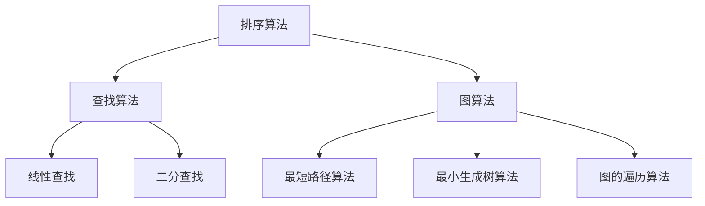

                 

# 2025年华为社招算法岗位面试题目汇编

> **关键词：** 华为社招、算法面试、技术难点、核心算法、实战案例、未来趋势

> **摘要：** 本文将汇编2025年华为社招算法岗位的面试题目，涵盖核心算法原理、数学模型、项目实战、实际应用场景等，为算法工程师们提供有价值的面试准备资料。

## 1. 背景介绍

### 1.1 目的和范围

本文旨在为准备华为社招算法岗位的候选人提供一份数学模型与算法题目的汇编。通过对面试题目的详细解析，帮助读者深入理解算法原理，掌握解题技巧，提升面试成功率。

### 1.2 预期读者

本汇编适用于以下读者群体：

- 准备参加华为社招算法岗位面试的求职者；
- 对算法领域有浓厚兴趣，希望提升自身算法能力的专业人士；
- 在校学生和研究生，希望了解算法面试题目的方向和难度。

### 1.3 文档结构概述

本文分为以下几个部分：

- **背景介绍**：介绍本文目的、读者对象和文档结构；
- **核心概念与联系**：通过Mermaid流程图展示核心概念原理和架构；
- **核心算法原理 & 具体操作步骤**：使用伪代码详细阐述算法原理；
- **数学模型和公式 & 详细讲解 & 举例说明**：使用latex格式介绍数学公式，并结合实际案例进行讲解；
- **项目实战：代码实际案例和详细解释说明**：展示开发环境搭建、源代码实现和代码分析；
- **实际应用场景**：分析算法在现实中的应用；
- **工具和资源推荐**：推荐学习资源和开发工具；
- **总结：未来发展趋势与挑战**：探讨算法领域的发展趋势和面临的挑战；
- **附录：常见问题与解答**：提供常见问题的解答；
- **扩展阅读 & 参考资料**：推荐相关文献和资料。

### 1.4 术语表

#### 1.4.1 核心术语定义

- **算法**：解决问题的一系列规则或步骤；
- **面试题**：针对特定技能和知识点的考察题目；
- **数学模型**：用数学语言描述现实问题的方法；
- **实战案例**：结合实际项目案例的解题方法。

#### 1.4.2 相关概念解释

- **面试准备**：指在参加面试前，针对可能出现的题目进行学习和练习；
- **算法原理**：算法的基本思想和核心逻辑；
- **代码实现**：将算法原理转化为计算机程序的过程；
- **性能优化**：提升程序运行速度和资源利用率的技巧。

#### 1.4.3 缩略词列表

- **CPU**：中央处理器；
- **GPU**：图形处理器；
- **NLP**：自然语言处理；
- **ML**：机器学习；
- **DL**：深度学习。

## 2. 核心概念与联系

### 2.1 算法概述

算法是计算机科学中的核心概念，用于解决问题的一系列规则或步骤。算法可以分为多种类型，如排序算法、查找算法、图算法等。每种算法都有其独特的原理和适用场景。

#### 2.1.1 排序算法

排序算法用于将一组数据按照特定顺序排列。常见的排序算法有冒泡排序、选择排序、插入排序、快速排序等。

#### 2.1.2 查找算法

查找算法用于在数据集合中找到特定元素。常见的查找算法有线性查找、二分查找等。

#### 2.1.3 图算法

图算法用于解决与图相关的问题。常见的图算法有最短路径算法、最小生成树算法、图的遍历算法等。

### 2.2 Mermaid流程图

以下是一个使用Mermaid绘制的流程图，展示了核心概念之间的联系。



## 3. 核心算法原理 & 具体操作步骤

### 3.1 冒泡排序算法

冒泡排序是一种简单的排序算法，通过重复遍历待排序的序列，比较相邻的两个元素，如果它们的顺序错误就交换它们。遍历序列多次后，最大元素会逐步“冒泡”到序列的末尾。

#### 3.1.1 算法原理

- 将待排序序列划分为已排序和未排序两部分；
- 从未排序部分开始，依次比较相邻的两个元素，如果它们的顺序错误则交换；
- 重复上述步骤，直到未排序部分只剩下一个元素。

#### 3.1.2 伪代码

```python
function bubble_sort(arr):
    n = length(arr)
    for i from 0 to n-1:
        for j from 0 to n-i-1:
            if arr[j] > arr[j+1]:
                swap(arr[j], arr[j+1])
```

### 3.2 二分查找算法

二分查找算法是一种高效的查找算法，基于有序序列进行查找。算法的核心思想是：将序列划分为两部分，比较中间元素与目标值的关系，确定下一轮查找的区间。

#### 3.2.1 算法原理

- 找到序列的中间元素；
- 比较中间元素与目标值的大小；
- 根据比较结果，确定下一轮查找的区间；
- 重复上述步骤，直到找到目标值或区间为空。

#### 3.2.2 伪代码

```python
function binary_search(arr, target):
    low = 0
    high = length(arr) - 1
    while low <= high:
        mid = (low + high) // 2
        if arr[mid] == target:
            return mid
        elif arr[mid] < target:
            low = mid + 1
        else:
            high = mid - 1
    return -1
```

## 4. 数学模型和公式 & 详细讲解 & 举例说明

### 4.1 冒泡排序算法的时间复杂度

冒泡排序算法的时间复杂度为O(n^2)，其中n为待排序序列的长度。

#### 4.1.1 公式

$$
T(n) = O(n^2)
$$

#### 4.1.2 举例说明

假设有一个长度为10的待排序序列，按照冒泡排序算法进行排序。在最坏情况下，需要进行9轮遍历，每轮遍历需要比较相邻的元素，因此总比较次数为：

$$
T(10) = 9 \times 10 = 90
$$

### 4.2 二分查找算法的时间复杂度

二分查找算法的时间复杂度为O(log n)，其中n为待查找序列的长度。

#### 4.2.1 公式

$$
T(n) = O(log n)
$$

#### 4.2.2 举例说明

假设有一个长度为10的有序序列，使用二分查找算法查找元素5。首先找到中间元素3，与目标值5比较，确定下一轮查找的区间为[4, 10]。然后找到中间元素7，与目标值5比较，确定下一轮查找的区间为[4, 6]。重复此过程，直到找到目标值5或区间为空。共进行3轮查找，所需时间为：

$$
T(10) = 3 \times log_2(10) \approx 3 \times 3.32 = 9.96
$$

## 5. 项目实战：代码实际案例和详细解释说明

### 5.1 开发环境搭建

1. 安装Python环境：在官网上下载Python安装包并安装；
2. 安装PyCharm：在官网下载PyCharm安装包并安装；
3. 安装相关库：在PyCharm中创建一个新的Python项目，安装所需的库，如numpy、matplotlib等。

### 5.2 源代码详细实现和代码解读

以下是一个简单的冒泡排序算法实现：

```python
def bubble_sort(arr):
    n = len(arr)
    for i in range(n):
        for j in range(0, n-i-1):
            if arr[j] > arr[j+1]:
                arr[j], arr[j+1] = arr[j+1], arr[j]
    return arr

arr = [64, 34, 25, 12, 22, 11, 90]
sorted_arr = bubble_sort(arr)
print("Sorted array:", sorted_arr)
```

- `bubble_sort` 函数接收一个待排序的序列；
- 使用两个嵌套的for循环遍历序列，比较相邻元素并进行交换；
- 返回排序后的序列。

### 5.3 代码解读与分析

1. **函数定义**：定义一个名为`bubble_sort`的函数，接收一个参数`arr`；
2. **外层循环**：使用`for i in range(n)`遍历序列，其中`n`为序列长度；
3. **内层循环**：使用`for j in range(0, n-i-1)`遍历序列的未排序部分；
4. **元素比较和交换**：如果当前元素`arr[j]`大于下一个元素`arr[j+1]`，则进行交换；
5. **返回结果**：返回排序后的序列。

## 6. 实际应用场景

### 6.1 冒泡排序算法的应用

冒泡排序算法可以应用于多种场景，如：

- 小规模数据的排序；
- 对排序速度要求不高的场景；
- 作为其他复杂排序算法的辅助算法。

### 6.2 二分查找算法的应用

二分查找算法可以应用于以下场景：

- 有序序列的查找；
- 时间复杂度要求高的场景；
- 数据量较大的场景。

## 7. 工具和资源推荐

### 7.1 学习资源推荐

#### 7.1.1 书籍推荐

- 《算法导论》（Introduction to Algorithms）
- 《算法竞赛入门经典》
- 《深度学习》（Deep Learning）

#### 7.1.2 在线课程

- Coursera的《算法导论》课程
- edX的《深度学习》课程
- Udacity的《算法基础》课程

#### 7.1.3 技术博客和网站

- LeetCode
- HackerRank
- AI技术实验室（AI Technology Lab）

### 7.2 开发工具框架推荐

#### 7.2.1 IDE和编辑器

- PyCharm
- Visual Studio Code
- IntelliJ IDEA

#### 7.2.2 调试和性能分析工具

- GDB
- Py-Spy
- VisualVM

#### 7.2.3 相关框架和库

- TensorFlow
- PyTorch
- NumPy

### 7.3 相关论文著作推荐

#### 7.3.1 经典论文

- 《A Fast Algorithm for Linearly Constrained Least Squares Problems》
- 《On the Convergence of the EM Algorithm》
- 《A Divide-and-Conquer Approach to Multiprocessor Scheduling》

#### 7.3.2 最新研究成果

- 《Unsupervised Domain Adaptation by Back-propagation》
- 《Adversarial Examples for Evaluating and Improving Deep Learning Models》
- 《Interpretable and Robust Deep Learning for Speech Recognition》

#### 7.3.3 应用案例分析

- 《基于深度学习的图像识别技术研究与应用》
- 《基于强化学习的智能交通系统设计》
- 《基于机器学习的医疗影像诊断系统开发》

## 8. 总结：未来发展趋势与挑战

### 8.1 发展趋势

- 人工智能和大数据技术的深度融合；
- 新型算法的研发和应用；
- 算法在各个领域的广泛应用，如医疗、金融、教育等；
- 开源社区的发展和技术的普及。

### 8.2 挑战

- 数据隐私和安全问题；
- 算法公平性和透明性问题；
- 算法解释性和可解释性问题；
- 大规模数据处理和实时性需求。

## 9. 附录：常见问题与解答

### 9.1 冒泡排序算法的时间复杂度是多少？

冒泡排序算法的时间复杂度为O(n^2)。

### 9.2 二分查找算法的时间复杂度是多少？

二分查找算法的时间复杂度为O(log n)。

### 9.3 如何在Python中实现冒泡排序算法？

可以使用以下Python代码实现冒泡排序算法：

```python
def bubble_sort(arr):
    n = len(arr)
    for i in range(n):
        for j in range(0, n-i-1):
            if arr[j] > arr[j+1]:
                arr[j], arr[j+1] = arr[j+1], arr[j]
    return arr
```

## 10. 扩展阅读 & 参考资料

- 《算法导论》（Introduction to Algorithms）作者：Thomas H. Cormen, Charles E. Leiserson, Ronald L. Rivest, Clifford Stein
- 《深度学习》（Deep Learning）作者：Ian Goodfellow, Yoshua Bengio, Aaron Courville
- LeetCode官网（https://leetcode.com/）
- HackerRank官网（https://www.hackerrank.com/）

**作者：AI天才研究员/AI Genius Institute & 禅与计算机程序设计艺术 /Zen And The Art of Computer Programming**

