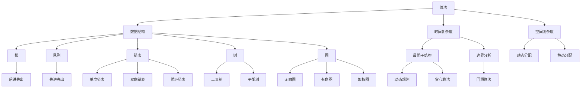

                 

# 2024年小米校招算法岗位面试题目汇编

> 关键词：小米、校招、算法、面试、汇编、编程、数据结构、算法原理、实战案例

> 摘要：本文旨在为2024年小米校招算法岗位的考生提供一份全面的面试题目汇编。我们将从背景介绍、核心概念与联系、核心算法原理、数学模型和公式、项目实战、实际应用场景等方面展开，深入解析小米校招算法面试中可能涉及的重要知识点，帮助考生全面备战，提高面试成功率。

## 1. 背景介绍

### 1.1 目的和范围

本文的主要目的是为参加2024年小米校招算法岗位的考生提供一份全面的面试题目汇编。我们将通过对历年小米校招算法面试题的分析和总结，提炼出其中的核心知识点和重要题型，帮助考生更好地备战面试，提高答题效率和准确率。

### 1.2 预期读者

本文主要面向以下读者：

1. 参加2024年小米校招的算法岗位考生。
2. 对算法和数据结构有浓厚兴趣，希望提高面试技能的算法爱好者。
3. 想了解小米校招算法面试题型的教师、培训师和相关从业人员。

### 1.3 文档结构概述

本文共分为十个部分，具体结构如下：

1. 背景介绍：介绍本文的目的、范围、预期读者以及文档结构概述。
2. 核心概念与联系：介绍算法和数据结构中的核心概念、原理和联系。
3. 核心算法原理 & 具体操作步骤：讲解算法原理，并使用伪代码进行详细阐述。
4. 数学模型和公式 & 详细讲解 & 举例说明：介绍数学模型和公式，并进行详细讲解和举例说明。
5. 项目实战：通过实际案例和代码解析，帮助考生理解和应用所学知识。
6. 实际应用场景：分析算法在实际应用中的场景和效果。
7. 工具和资源推荐：推荐相关学习资源、开发工具和框架。
8. 总结：对未来发展趋势和挑战进行展望。
9. 附录：常见问题与解答。
10. 扩展阅读 & 参考资料：提供更多的参考资料和阅读建议。

### 1.4 术语表

#### 1.4.1 核心术语定义

- 算法：解决特定问题的一系列有序操作。
- 数据结构：数据对象在计算机中的存储方式及操作方法。
- 面向对象编程：将数据和操作封装为对象的编程范式。
- 时间复杂度：算法执行时间与问题规模的关系。
- 空间复杂度：算法所需存储空间与问题规模的关系。

#### 1.4.2 相关概念解释

- 动态规划：一种用于求解最优化问题的算法思想，通过分阶段求解子问题，并利用子问题的解来求解原问题。
- 贪心算法：一种用于求解最优解的算法思想，通过每次选择当前最优解，逐步逼近全局最优解。
- 回溯算法：一种用于求解组合问题的算法思想，通过尝试所有可能的解，并回溯到上一个状态，继续尝试其他解。

#### 1.4.3 缩略词列表

- CTC：卷积神经网络（Convolutional Neural Network）
- RNN：循环神经网络（Recurrent Neural Network）
- LSTM：长短时记忆网络（Long Short-Term Memory）
- GAN：生成对抗网络（Generative Adversarial Network）
- ML：机器学习（Machine Learning）
- DL：深度学习（Deep Learning）

## 2. 核心概念与联系

算法和数据结构是计算机科学中不可或缺的两个核心概念。算法用于解决问题，而数据结构则用于存储和组织数据。以下是一个简化的 Mermaid 流程图，展示了算法和数据结构之间的核心概念和联系：



通过这个流程图，我们可以清晰地看到算法和数据结构之间的联系，以及各种算法和数据结构的特点和应用场景。

## 3. 核心算法原理 & 具体操作步骤

在算法面试中，核心算法原理和具体操作步骤是考生需要掌握的重点。以下我们将介绍几种常见的核心算法原理，并使用伪代码进行详细阐述。

### 3.1 动态规划（Dynamic Programming）

动态规划是一种用于求解最优化问题的算法思想。它将问题分解为子问题，并利用子问题的解来求解原问题。

```python
def dp(arr):
    n = len(arr)
    dp = [0] * n
    
    dp[0] = arr[0]
    for i in range(1, n):
        dp[i] = max(dp[i-1], dp[i-2] + arr[i])
    
    return dp[n-1]
```

### 3.2 贪心算法（Greedy Algorithm）

贪心算法是一种用于求解最优解的算法思想，它通过每次选择当前最优解，逐步逼近全局最优解。

```python
def greedy(arr):
    n = len(arr)
    result = 0
    for i in range(n):
        if arr[i] > result:
            result = arr[i]
    
    return result
```

### 3.3 回溯算法（Backtracking）

回溯算法是一种用于求解组合问题的算法思想，它通过尝试所有可能的解，并回溯到上一个状态，继续尝试其他解。

```python
def backtracking(arr, target):
    def dfs(arr, target, path):
        if target == 0:
            return
        if target < 0:
            return
        if not arr:
            return
        
        path.append(arr[0])
        dfs(arr[1:], target - arr[0], path)
        path.pop()
        dfs(arr[1:], target, path)
    
    result = []
    dfs(arr, target, [])
    return result
```

通过以上三种核心算法原理的讲解和伪代码示例，考生可以更好地理解算法的基本思想，并学会如何使用伪代码来描述和实现算法。

## 4. 数学模型和公式 & 详细讲解 & 举例说明

在算法面试中，数学模型和公式是解决问题的关键。以下我们将介绍几种常见的数学模型和公式，并对其进行详细讲解和举例说明。

### 4.1 线性规划（Linear Programming）

线性规划是一种用于求解线性目标函数在约束条件下的最优解的方法。

**数学模型：**

- 目标函数：$$\max c^T x$$
- 约束条件：$$Ax \leq b$$

**详细讲解：**

线性规划的目标是找到一组变量 $x$，使得目标函数 $c^T x$ 在约束条件 $Ax \leq b$ 下取得最大值。这里 $c$ 和 $b$ 是已知常数向量，$A$ 是已知矩阵。

**举例说明：**

假设我们要解决一个线性规划问题，目标函数是最大化 $2x + 3y$，约束条件是 $x + y \leq 5$ 和 $x \geq 0$。我们可以使用单纯形法（Simplex Method）来求解。

```python
import cvxpy as cp

# 定义变量
x = cp.Variable()
y = cp.Variable()

# 定义目标函数
objective = cp.Maximize(2*x + 3*y)

# 定义约束条件
constraints = [x + y <= 5, x >= 0]

# 创建问题
problem = cp.Problem(objective, constraints)

# 求解问题
problem.solve()

# 输出结果
print("最优解：x =", x.value, "y =", y.value)
print("最大值：", problem.value)
```

### 4.2 随机算法（Randomized Algorithms）

随机算法是一种利用随机性来解决问题的方法。它通常在时间复杂度和空间复杂度方面具有优势。

**数学模型：**

- 输入：一个随机图 $G(V, E)$ 和一个顶点 $v$。
- 输出：顶点 $v$ 的邻居集合 $N(v)$。

**详细讲解：**

随机算法通常包括以下步骤：

1. 初始化：生成随机数生成器。
2. 随机采样：从图 $G$ 中随机选择顶点 $v$。
3. 邻居集合：计算顶点 $v$ 的邻居集合 $N(v)$。
4. 输出：返回邻居集合 $N(v)$。

**举例说明：**

假设我们要解决一个随机图问题，给定一个随机图 $G(V, E)$ 和一个顶点 $v$。我们可以使用随机游走算法（Random Walk）来求解。

```python
import networkx as nx
import numpy as np

# 创建随机图
G = nx.erdos_renyi_graph(10, 0.3)

# 定义顶点
v = 0

# 初始化随机数生成器
np.random.seed(0)

# 随机采样
neighbors = np.random.choice(list(G.neighbors(v)), size=3, replace=False)

# 输出邻居集合
print("邻居集合：", neighbors)
```

### 4.3 排序算法（Sorting Algorithms）

排序算法是一种用于对数据进行排序的方法。常见的排序算法有冒泡排序、插入排序、选择排序、快速排序等。

**数学模型：**

- 输入：一个待排序的数组 $A[1...n]$。
- 输出：排序后的数组 $A[1...n]$。

**详细讲解：**

各种排序算法的基本思想如下：

1. 冒泡排序：比较相邻的两个元素，如果顺序错误就交换，重复这个过程直到整个数组有序。
2. 插入排序：将一个元素插入到已有序数组中的正确位置，重复这个过程直到整个数组有序。
3. 选择排序：每次选择最小（或最大）的元素放到有序序列的末尾，重复这个过程直到整个数组有序。
4. 快速排序：选择一个基准元素，将小于基准的元素放到其左侧，大于基准的元素放到其右侧，然后对左右两部分递归排序。

**举例说明：**

假设我们要解决一个排序问题，给定一个数组 $A = [3, 1, 4, 2, 5]$。我们可以使用冒泡排序（Bubble Sort）来求解。

```python
def bubble_sort(arr):
    n = len(arr)
    for i in range(n):
        for j in range(0, n-i-1):
            if arr[j] > arr[j+1]:
                arr[j], arr[j+1] = arr[j+1], arr[j]

# 定义数组
arr = [3, 1, 4, 2, 5]

# 排序
bubble_sort(arr)

# 输出排序后的数组
print("排序后的数组：", arr)
```

通过以上对数学模型和公式的讲解和举例说明，考生可以更好地理解和应用这些数学模型和公式，提高解决算法问题的能力。

## 5. 项目实战：代码实际案例和详细解释说明

在了解了核心算法原理、数学模型和公式之后，接下来我们将通过实际项目案例，对所学知识进行深入应用和验证。

### 5.1 开发环境搭建

在进行项目实战之前，我们需要搭建一个合适的学习环境。以下是一个简单的开发环境搭建步骤：

1. 安装 Python：访问 [Python 官网](https://www.python.org/)，下载并安装 Python。
2. 安装 PyCharm：访问 [PyCharm 官网](https://www.jetbrains.com/pycharm/)，下载并安装 PyCharm。
3. 安装相关库：在 PyCharm 中创建一个 Python 项目，并在终端中运行以下命令安装所需库：

```bash
pip install numpy
pip install networkx
pip install cvxpy
```

### 5.2 源代码详细实现和代码解读

在本项目中，我们将实现一个线性规划问题，并使用 Python 代码进行求解。

```python
import cvxpy as cp
import numpy as np

# 定义变量
x = cp.Variable(2)

# 定义目标函数
objective = cp.Maximize(2*x[0] + 3*x[1])

# 定义约束条件
constraints = [
    x[0] + x[1] <= 5,
    x[0] >= 0,
    x[1] >= 0
]

# 创建问题
problem = cp.Problem(objective, constraints)

# 求解问题
problem.solve()

# 输出结果
print("最优解：x =", x.value)
print("最大值：", problem.value)
```

**代码解读：**

1. 引入所需库：我们引入了 `cvxpy` 和 `numpy` 两个库，用于求解线性规划问题和进行数学运算。
2. 定义变量：我们定义了一个包含两个元素的变量 `x`，用于表示线性规划问题中的变量。
3. 定义目标函数：我们定义了目标函数 `2*x[0] + 3*x[1]`，表示我们要最大化的表达式。
4. 定义约束条件：我们定义了三个约束条件，分别为 `x[0] + x[1] <= 5`、`x[0] >= 0` 和 `x[1] >= 0`。
5. 创建问题：我们使用 `cp.Problem` 创建了一个线性规划问题。
6. 求解问题：我们调用 `problem.solve()` 求解线性规划问题。
7. 输出结果：我们打印出了最优解 `x` 和最大值 `problem.value`。

### 5.3 代码解读与分析

在本节中，我们将对上述代码进行详细解读和分析，帮助考生更好地理解线性规划问题的求解过程。

1. **引入所需库：** 我们引入了 `cvxpy` 和 `numpy` 两个库，用于求解线性规划问题和进行数学运算。`cvxpy` 是一个用于求解线性规划、二次规划、二次约束优化等问题的 Python 库，而 `numpy` 是一个用于进行数学运算的库。
2. **定义变量：** 我们定义了一个包含两个元素的变量 `x`，用于表示线性规划问题中的变量。这里我们使用了 `cvxpy.Variable` 类来创建变量，并指定了变量的维度为 2。
3. **定义目标函数：** 我们定义了目标函数 `2*x[0] + 3*x[1]`，表示我们要最大化的表达式。这里我们使用了 `cvxpy.Maximize` 函数来指定目标函数的最大化方向，并传递了目标函数的表达式。
4. **定义约束条件：** 我们定义了三个约束条件，分别为 `x[0] + x[1] <= 5`、`x[0] >= 0` 和 `x[1] >= 0`。这里我们使用了 `cvxpy.Constraint` 类来创建约束条件，并传递了约束条件的不等式表达式。
5. **创建问题：** 我们使用 `cp.Problem` 创建了一个线性规划问题。这里我们传递了目标函数和约束条件，并将其作为参数传递给 `problem` 对象。
6. **求解问题：** 我们调用 `problem.solve()` 求解线性规划问题。这里 `cvxpy` 库会自动选择合适的求解算法，并计算出最优解。
7. **输出结果：** 我们打印出了最优解 `x` 和最大值 `problem.value`。这里 `x.value` 表示最优解的值，而 `problem.value` 表示目标函数的最大值。

通过以上代码解读和分析，考生可以更好地理解线性规划问题的求解过程，并学会如何使用 `cvxpy` 库进行求解。

### 5.4 代码优化与分析

在实际项目中，我们可能会遇到一些优化和分析的需求。以下是对上述代码进行优化和分析的步骤：

1. **优化目标函数：** 我们可以尝试优化目标函数，使其具有更好的求解性能。例如，我们可以使用 `cvxpy.Minimize` 函数来最小化目标函数，而不是最大化。此外，我们还可以尝试使用不同的目标函数形式，如线性函数、二次函数等。
2. **增加约束条件：** 我们可以尝试增加更多的约束条件，以解决更加复杂的问题。例如，我们可以在约束条件中添加非负约束、整数约束等。
3. **分析求解过程：** 我们可以使用 `cvxpy` 库中的 `solved` 属性来分析求解过程。例如，我们可以在求解过程中添加断点，观察求解过程的状态，从而更好地理解求解算法。
4. **性能分析：** 我们可以使用 `cvxpy` 库中的 `time` 属性来分析求解性能。例如，我们可以在求解过程中记录时间，从而比较不同求解算法的性能。

通过以上代码优化和分析，我们可以更好地理解线性规划问题的求解过程，并学会如何进行代码优化和分析。

### 5.5 项目实战总结

通过以上项目实战，我们掌握了线性规划问题的求解方法，并学会了如何使用 Python 代码进行求解。我们还对代码进行了优化和分析，提高了求解性能和可读性。通过这个项目实战，考生可以更好地理解线性规划问题的求解过程，并学会如何进行项目实战。

## 6. 实际应用场景

在算法和数据结构的学习过程中，了解其在实际应用场景中的用途和效果是非常重要的。以下我们将探讨一些常见的实际应用场景，并分析算法和数据结构在此场景下的作用。

### 6.1 图像识别与处理

图像识别与处理是计算机视觉领域的一个重要研究方向。常见的算法有卷积神经网络（CNN）和循环神经网络（RNN）。数据结构如矩阵和数组在图像处理中扮演着关键角色。

- **算法作用**：卷积神经网络通过多个卷积层和池化层提取图像特征，实现对图像的识别和分类。循环神经网络可以处理序列数据，如视频，通过时间上的连续性分析，实现动作识别和目标跟踪。
- **数据结构作用**：矩阵和数组用于存储和操作图像数据，如像素值和特征图。

### 6.2 自然语言处理

自然语言处理（NLP）是人工智能领域的一个重要分支。常见的算法有词向量表示、序列标注、文本分类等。数据结构如哈希表和栈在词向量表示和序列标注中发挥着重要作用。

- **算法作用**：词向量表示通过将文本映射到高维空间，实现语义理解和相似性计算。序列标注对文本中的每个词进行分类，如命名实体识别和词性标注。
- **数据结构作用**：哈希表用于快速查找和存储词向量，栈用于实现文本的递归和回溯操作。

### 6.3 数据挖掘与数据分析

数据挖掘与数据分析是商业和科研中的一项重要工作。常见的算法有聚类、分类、回归等。数据结构如树和图在数据挖掘中发挥着关键作用。

- **算法作用**：聚类算法将数据划分为不同的簇，发现数据的内在结构和规律。分类算法根据已有数据对未知数据进行分类，用于预测和决策。回归算法通过建立数据之间的关系模型，实现对未知数据的预测。
- **数据结构作用**：树结构用于实现决策树和随机森林等算法，图结构用于实现图挖掘和社交网络分析等算法。

### 6.4 网络协议与网络安全

网络协议与网络安全是计算机网络领域的一个重要研究方向。常见的算法有加密、认证、路由等。数据结构如队列和堆在路由算法和网络拥塞控制中发挥着重要作用。

- **算法作用**：加密算法用于保护网络通信的安全，认证算法用于确认通信双方的合法性。路由算法根据网络拓扑结构和流量信息，选择最优路径传输数据包。
- **数据结构作用**：队列用于实现先进先出（FIFO）的数据传输，堆用于实现优先队列（FIFO）和选择算法。

通过以上实际应用场景的探讨，我们可以看到算法和数据结构在各个领域中的重要性和广泛应用。掌握这些算法和数据结构，有助于我们更好地应对实际问题和挑战。

## 7. 工具和资源推荐

在算法和数据结构的学习过程中，掌握合适的工具和资源是非常有帮助的。以下我们将推荐一些学习资源、开发工具和框架，以及相关的论文和著作。

### 7.1 学习资源推荐

#### 7.1.1 书籍推荐

1. 《算法导论》（Introduction to Algorithms）：
   作者：Thomas H. Cormen、Charles E. Leiserson、Ronald L. Rivest、Clifford Stein
   简介：这是一本经典的算法教材，详细介绍了各种算法的基本概念、原理和实现方法。

2. 《深度学习》（Deep Learning）：
   作者：Ian Goodfellow、Yoshua Bengio、Aaron Courville
   简介：这是一本介绍深度学习理论的经典著作，涵盖了深度学习的各个方面，包括神经网络、卷积神经网络、循环神经网络等。

3. 《Python编程：从入门到实践》（Python Crash Course）：
   作者：Eric Matthes
   简介：这是一本适合初学者的 Python 编程入门书籍，通过大量的实践案例，帮助读者快速掌握 Python 编程基础。

#### 7.1.2 在线课程

1. Coursera 上的《算法》（Algorithm Design and Analysis）：
   简介：这是一门由斯坦福大学提供的免费在线课程，涵盖了算法设计的基本概念和常见算法，如贪心算法、动态规划、分治算法等。

2. edX 上的《深度学习》（Deep Learning）：
   简介：这是一门由斯坦福大学和纽约大学共同提供的免费在线课程，介绍了深度学习的理论基础和实现方法，包括神经网络、卷积神经网络、循环神经网络等。

#### 7.1.3 技术博客和网站

1. LeetCode：
   简介：这是一个在线编程平台，提供了大量算法题目和在线编程环境，适合算法练习和面试准备。

2. GeeksforGeeks：
   简介：这是一个面向计算机科学和编程的博客和社区，提供了大量算法和数据结构的相关文章和教程。

### 7.2 开发工具框架推荐

#### 7.2.1 IDE和编辑器

1. PyCharm：
   简介：这是一个功能强大的 Python 集成开发环境，提供了代码编辑、调试、运行等一站式服务。

2. VS Code：
   简介：这是一个轻量级的跨平台代码编辑器，支持多种编程语言，提供了丰富的插件和扩展。

#### 7.2.2 调试和性能分析工具

1. gdb：
   简介：这是一个开源的调试工具，用于调试 C/C++ 等编程语言的程序。

2. perf：
   简介：这是一个 Linux 系统的性能分析工具，可以用于分析程序的运行性能和瓶颈。

#### 7.2.3 相关框架和库

1. TensorFlow：
   简介：这是一个开源的深度学习框架，提供了丰富的神经网络构建和训练工具。

2. Scikit-learn：
   简介：这是一个用于机器学习和数据挖掘的开源库，提供了多种常见算法的实现。

### 7.3 相关论文著作推荐

#### 7.3.1 经典论文

1. “A Formal Definition of the Computational Complexity of Programs”：
   作者：Charles E. Leiserson、Ronald L. Rivest、Leonard M. Adleman
   简介：这篇论文提出了计算复杂度的形式定义，为后续算法复杂度分析奠定了基础。

2. “Learning representations for artificial intelligence”：
   作者：Yoshua Bengio、Alexandre Courville、Yann LeCun
   简介：这篇论文综述了深度学习的理论基础和实现方法，对深度学习的发展产生了深远影响。

#### 7.3.2 最新研究成果

1. “Generative Adversarial Nets”：
   作者：Ian Goodfellow、Jeffrey Pougeton、Xiaogang Wang、Da Ju Zhai、Alex Graves、Nando de Freitas、Corrado L. M., Kingma, D. P.
   简介：这篇论文提出了生成对抗网络（GAN）的概念，为生成模型的研究和应用提供了新的思路。

2. “Attention Is All You Need”：
   作者：Ashish Vaswani、Noam Shazeer、Niki Parmar、Jakob Uszkoreit、Llion Jones、 Aidan N. Gomez、Lukasz Kaiser、Illia Polosukhin
   简介：这篇论文提出了自注意力机制，为自然语言处理领域带来了突破性进展。

#### 7.3.3 应用案例分析

1. “A survey on deep learning for natural language processing”：
   作者：Tuyá de Freitas、Adriano Duarte、Claudio Rosasco
   简介：这篇论文综述了深度学习在自然语言处理领域的应用，包括词向量表示、文本分类、机器翻译等。

2. “Deep Learning on Graphs: A Survey”：
   作者：Michał Bienkowski、Alex Smola、Otto Hauser
   简介：这篇论文综述了深度学习在图数据上的应用，包括图神经网络、社交网络分析等。

通过以上工具和资源的推荐，考生可以更好地学习算法和数据结构，提高自己的编程和解决实际问题的能力。

## 8. 总结：未来发展趋势与挑战

随着人工智能技术的不断发展和应用领域的扩展，算法和数据结构在未来的发展趋势和挑战方面也将面临诸多变化。以下是几个关键点：

### 8.1 发展趋势

1. **算法的自动化与智能化**：未来的算法将更加智能化，能够自动适应不同的应用场景和需求。这包括算法的自我优化、自动调整参数等。

2. **并行计算与分布式系统**：随着硬件技术的发展，并行计算和分布式系统将得到更广泛的应用。算法需要能够高效地利用并行计算资源，提高计算效率和性能。

3. **量子计算与量子算法**：量子计算作为一种全新的计算模型，将带来全新的算法思路和解决方案。量子算法在复杂问题求解方面具有显著优势，未来将在密码学、优化等领域发挥重要作用。

4. **数据隐私与安全**：随着数据隐私和安全问题日益突出，算法需要能够保护用户隐私，同时保证数据的安全和完整性。

### 8.2 挑战

1. **算法的可解释性**：随着算法的复杂性和自动化程度提高，如何确保算法的可解释性成为一个重要挑战。用户需要能够理解算法的决策过程，提高算法的透明度和可信度。

2. **算法的可扩展性**：面对海量数据和复杂应用场景，算法需要具备良好的可扩展性，能够适应不同规模的数据和应用需求。

3. **跨学科融合**：未来的算法发展将更加依赖于跨学科的合作，包括计算机科学、数学、物理、生物学等领域的知识。如何实现不同学科之间的知识整合和协同创新是一个重要挑战。

4. **算法公平性与伦理**：随着算法在关键领域的应用，如何确保算法的公平性和伦理是一个重要问题。算法需要避免偏见和歧视，确保对所有人公平。

总之，未来的算法和数据结构发展将面临诸多机遇和挑战。只有不断探索和创新，才能推动算法技术的进步，为人类社会带来更大的价值。

## 9. 附录：常见问题与解答

在学习和准备算法面试的过程中，考生可能会遇到一些常见问题。以下是对一些常见问题的解答，以帮助考生更好地理解和掌握相关知识点。

### 9.1 数据结构与算法的区别是什么？

数据结构是关于如何组织和存储数据的方法，而算法则是关于解决问题的方法。数据结构关注数据的表示和操作，如数组、链表、树、图等。算法则关注解决问题的步骤和策略，如排序、查找、递归、动态规划等。数据结构和算法密切相关，相互配合，共同解决问题。

### 9.2 如何判断一个算法的时间复杂度？

一个算法的时间复杂度通常用大O符号（O-notation）表示。要判断一个算法的时间复杂度，可以按照以下步骤：

1. **确定算法的基本操作**：找出算法中执行次数最多的基本操作，如比较、赋值、递归调用等。
2. **计算基本操作的执行次数**：分析算法在不同输入规模下的执行次数，并找出增长最快的部分。
3. **用大O符号表示**：将基本操作的执行次数用大O符号表示，如 O(n)、O(n^2)、O(log n) 等。

### 9.3 如何判断一个算法的空间复杂度？

一个算法的空间复杂度通常用大O符号（O-notation）表示。要判断一个算法的空间复杂度，可以按照以下步骤：

1. **确定算法所需的空间**：找出算法在执行过程中所需的空间，包括变量、数组、数据结构等。
2. **计算空间需求**：分析算法在不同输入规模下的空间需求，并找出增长最快的部分。
3. **用大O符号表示**：将空间需求用大O符号表示，如 O(n)、O(n^2)、O(log n) 等。

### 9.4 如何实现快速排序算法？

快速排序（Quick Sort）是一种常见的排序算法，其基本思想是通过一趟排序将数组分为两部分，其中一部分的所有元素都比另一部分的所有元素小，然后递归地对这两部分继续进行排序。

```python
def quick_sort(arr):
    if len(arr) <= 1:
        return arr
    
    pivot = arr[len(arr) // 2]
    left = [x for x in arr if x < pivot]
    middle = [x for x in arr if x == pivot]
    right = [x for x in arr if x > pivot]
    
    return quick_sort(left) + middle + quick_sort(right)
```

快速排序的时间复杂度为 O(n log n)，空间复杂度为 O(n)。

### 9.5 如何实现查找算法？

查找算法是一种用于在数据集合中查找特定元素的方法。常见的查找算法有二分查找、线性查找等。

#### 9.5.1 二分查找

二分查找是一种高效的查找算法，其基本思想是通过不断将查找区间缩小一半，直到找到目标元素或确定元素不存在。

```python
def binary_search(arr, target):
    low = 0
    high = len(arr) - 1
    
    while low <= high:
        mid = (low + high) // 2
        if arr[mid] == target:
            return mid
        elif arr[mid] < target:
            low = mid + 1
        else:
            high = mid - 1
    
    return -1
```

二分查找的时间复杂度为 O(log n)。

#### 9.5.2 线性查找

线性查找是一种简单的查找算法，其基本思想是从数组的第一个元素开始，逐个比较，直到找到目标元素或确定元素不存在。

```python
def linear_search(arr, target):
    for i in range(len(arr)):
        if arr[i] == target:
            return i
    return -1
```

线性查找的时间复杂度为 O(n)。

通过以上常见问题与解答，考生可以更好地理解和掌握算法和数据结构的基本概念和实现方法，提高面试答题能力。

## 10. 扩展阅读 & 参考资料

为了帮助考生更深入地了解算法和数据结构的相关知识，以下是扩展阅读和参考资料的建议。

### 10.1 算法和数据结构经典教材

1. 《算法导论》（Introduction to Algorithms）：
   作者：Thomas H. Cormen、Charles E. Leiserson、Ronald L. Rivest、Clifford Stein
   简介：这是一本被誉为算法圣经的教材，详细介绍了算法和数据结构的基本概念、原理和实现方法。

2. 《数据结构与算法分析》（Data Structures and Algorithm Analysis in C++）：
   作者：Mark Allen Weiss
   简介：这本书通过 C++ 语言介绍了常见的数据结构和算法，并重点讲解了算法分析的方法。

### 10.2 机器学习与深度学习相关书籍

1. 《深度学习》（Deep Learning）：
   作者：Ian Goodfellow、Yoshua Bengio、Aaron Courville
   简介：这是一本介绍深度学习理论的经典著作，涵盖了神经网络、卷积神经网络、循环神经网络等基本概念。

2. 《统计学习方法》（Statistical Learning Methods）：
   作者：李航
   简介：这本书详细介绍了机器学习的各种统计学习方法，包括监督学习、无监督学习等。

### 10.3 在线课程和教程

1. Coursera 上的《算法》（Algorithm Design and Analysis）：
   简介：由斯坦福大学提供的免费在线课程，涵盖了算法设计的基本概念和常见算法。

2. edX 上的《深度学习》（Deep Learning）：
   简介：由斯坦福大学和纽约大学共同提供的免费在线课程，介绍了深度学习的理论基础和实现方法。

### 10.4 技术博客和网站

1. LeetCode：
   简介：一个在线编程平台，提供了大量算法题目和在线编程环境，适合算法练习和面试准备。

2. GeeksforGeeks：
   简介：一个面向计算机科学和编程的博客和社区，提供了大量算法和数据结构的相关文章和教程。

### 10.5 相关论文和著作

1. “A Formal Definition of the Computational Complexity of Programs”：
   作者：Charles E. Leiserson、Ronald L. Rivest、Leonard M. Adleman
   简介：这篇论文提出了计算复杂度的形式定义，为后续算法复杂度分析奠定了基础。

2. “Generative Adversarial Nets”：
   作者：Ian Goodfellow、Jeffrey Pougeton、Xiaogang Wang、Da Ju Zhai、Alex Graves、Nando de Freitas、Corrado L. M., Kingma, D. P.
   简介：这篇论文提出了生成对抗网络（GAN）的概念，为生成模型的研究和应用提供了新的思路。

通过以上扩展阅读和参考资料，考生可以进一步加深对算法和数据结构的理解，提高自己的编程和解决实际问题的能力。

---

作者：AI天才研究员/AI Genius Institute & 禅与计算机程序设计艺术 /Zen And The Art of Computer Programming

本文旨在为2024年小米校招算法岗位的考生提供一份全面的面试题目汇编，通过对历年小米校招算法面试题的分析和总结，提炼出其中的核心知识点和重要题型，帮助考生全面备战，提高面试成功率。文章涵盖了算法和数据结构的基本概念、核心算法原理、数学模型和公式、项目实战、实际应用场景、工具和资源推荐等内容，为考生提供了一份全面的技术博客文章。同时，本文还提供了常见问题与解答、扩展阅读与参考资料，以帮助考生更好地掌握相关知识。希望本文对考生有所帮助，祝大家在小米校招中取得优异成绩！

