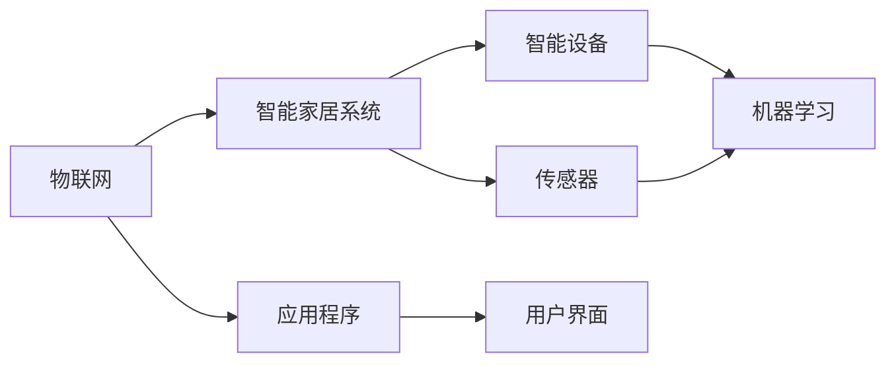

                 

# 2025年小米社招智能家居开发工程师面试题集锦

> **关键词：智能家居，社招面试题，开发工程师，小米，2025年**
> 
> **摘要：本文将深入探讨2025年小米社招智能家居开发工程师的面试题集锦，通过详细的算法原理、数学模型、实战案例等部分，为读者提供全面的技术指导和思维训练，助力面试成功。**

## 1. 背景介绍

### 1.1 目的和范围

本文旨在为2025年小米社招智能家居开发工程师的应聘者提供一份全面的技术面试题集锦。通过深入剖析面试中可能涉及的核心概念、算法原理、数学模型和实际应用场景，本文将帮助读者掌握关键知识点，提升面试能力。

### 1.2 预期读者

- 智能家居开发工程师应聘者
- 对智能家居领域感兴趣的程序员和技术爱好者
- 相关领域的研究生和本科生

### 1.3 文档结构概述

本文结构如下：

1. 背景介绍
2. 核心概念与联系
3. 核心算法原理 & 具体操作步骤
4. 数学模型和公式 & 详细讲解 & 举例说明
5. 项目实战：代码实际案例和详细解释说明
6. 实际应用场景
7. 工具和资源推荐
8. 总结：未来发展趋势与挑战
9. 附录：常见问题与解答
10. 扩展阅读 & 参考资料

### 1.4 术语表

#### 1.4.1 核心术语定义

- **智能家居**：通过物联网技术将家庭设备连接起来，实现自动化控制、远程控制和智能互动。
- **开发工程师**：负责智能家居系统的设计、开发、测试和维护的专业技术人员。
- **面试题**：在招聘过程中，面试官为评估应聘者的技术水平而提出的问题。

#### 1.4.2 相关概念解释

- **物联网（IoT）**：通过互联网将各种设备连接起来，实现设备之间的数据交换和协同工作。
- **传感器**：用于感知和检测物理世界信息的设备，如温度传感器、湿度传感器等。
- **智能设备**：具备网络通信能力和自主决策能力的设备，如智能灯泡、智能插座等。

#### 1.4.3 缩略词列表

- **IoT**：物联网
- **AI**：人工智能
- **SDK**：软件开发工具包
- **API**：应用程序编程接口

## 2. 核心概念与联系

在智能家居开发过程中，理解以下核心概念和它们之间的联系至关重要。

### 2.1 核心概念

- **物联网（IoT）**
- **智能家居协议**：如MQTT、HTTP、CoAP等
- **嵌入式系统**
- **人工智能（AI）**
- **机器学习（ML）**

### 2.2 关联流程图

下面是一个简化的智能家居系统架构流程图，用于展示核心概念之间的关联。



在这个流程图中，物联网（IoT）作为连接各个设备和系统的中枢，智能家居系统（SM）负责协调传感器（SC）和智能设备（SD）的工作，并通过应用程序（AP）为用户提供便捷的交互界面（UA）。同时，机器学习（ML）技术被广泛应用于智能设备中，以实现更智能化的功能。

## 3. 核心算法原理 & 具体操作步骤

在智能家居开发中，掌握核心算法原理对于实现高效、智能的智能家居系统至关重要。以下是智能家居开发中常见的核心算法原理及其具体操作步骤。

### 3.1. 滤波算法

**原理**：滤波算法用于去除传感器数据中的噪声，提高数据质量。

**伪代码**：

```python
def filter_data(data):
    filtered_data = []
    for point in data:
        if is_valid(point):
            filtered_data.append(point)
    return filtered_data

def is_valid(point):
    # 判断点是否有效，如温度在合理范围内等
    return True
```

**操作步骤**：

1. 读取传感器数据。
2. 对数据进行滤波处理，去除无效数据。
3. 保存过滤后的数据。

### 3.2. 聚类算法

**原理**：聚类算法用于将数据点分组，以便进行后续分析。

**伪代码**：

```python
def cluster_data(data, k):
    centroids = initialize_centroids(data, k)
    while not_converged(centroids):
        assign_points_to_centroids(data, centroids)
        update_centroids(centroids)
    return centroids

def initialize_centroids(data, k):
    # 初始化k个质心
    return centroids

def assign_points_to_centroids(data, centroids):
    # 将数据点分配给最近的质心
    return assignments

def update_centroids(centroids):
    # 更新质心位置
    return centroids

def not_converged(centroids):
    # 判断聚类是否收敛
    return False
```

**操作步骤**：

1. 初始化k个质心。
2. 重复以下步骤，直到聚类收敛：
   - 将数据点分配给最近的质心。
   - 更新质心位置。
3. 保存聚类结果。

### 3.3. 决策树算法

**原理**：决策树算法用于基于数据特征进行分类或回归。

**伪代码**：

```python
def build_decision_tree(data):
    if is_leaf_node(data):
        return leaf_value(data)
    best_split = find_best_split(data)
    left_tree = build_decision_tree(split_left(data, best_split))
    right_tree = build_decision_tree(split_right(data, best_split))
    return DecisionTree(best_split, left_tree, right_tree)

def is_leaf_node(data):
    # 判断是否为叶节点
    return True

def find_best_split(data):
    # 找到最佳分割
    return split

def split_left(data, split):
    # 分割左子数据
    return left_data

def split_right(data, split):
    # 分割右子数据
    return right_data
```

**操作步骤**：

1. 对数据进行预处理，如归一化、特征选择等。
2. 构建决策树，从根节点开始：
   - 如果是叶节点，返回叶节点值。
   - 找到最佳分割。
   - 对左子数据和右子数据递归构建决策树。
3. 保存决策树模型。

通过以上算法原理和操作步骤，智能家居开发工程师可以更好地理解和应用核心算法，从而提升智能家居系统的性能和智能化水平。

## 4. 数学模型和公式 & 详细讲解 & 举例说明

在智能家居开发中，数学模型和公式是核心算法的基础。以下将介绍智能家居开发中常用的数学模型和公式，并进行详细讲解和举例说明。

### 4.1. 常用数学模型

#### 4.1.1. 线性回归模型

**公式**：\( y = w_0 + w_1 \cdot x \)

**解释**：线性回归模型用于预测连续值，其中\( y \)是预测值，\( w_0 \)是偏置项，\( w_1 \)是权重，\( x \)是输入特征。

**举例**：

假设我们有一个智能家居场景，需要预测房间的温度。给定输入特征\( x \)（如室内外温差），使用线性回归模型预测温度\( y \)。

1. 收集历史数据，计算输入特征\( x \)和输出温度\( y \)的均值。
2. 训练线性回归模型，求解权重\( w_0 \)和\( w_1 \)。
3. 给定新的输入特征\( x \)，预测温度\( y \)。

#### 4.1.2. 逻辑回归模型

**公式**：\( P(y=1) = \frac{1}{1 + e^{-(w_0 + w_1 \cdot x)}} \)

**解释**：逻辑回归模型用于预测概率，其中\( P(y=1) \)是输出为1的概率，\( w_0 \)是偏置项，\( w_1 \)是权重，\( x \)是输入特征。

**举例**：

假设我们有一个智能家居场景，需要预测门窗是否被非法打开。给定输入特征\( x \)（如门窗位置传感器数据），使用逻辑回归模型预测是否打开。

1. 收集历史数据，计算输入特征\( x \)和输出状态\( y \)（0表示正常，1表示非法打开）的均值。
2. 训练逻辑回归模型，求解权重\( w_0 \)和\( w_1 \)。
3. 给定新的输入特征\( x \)，预测输出状态\( y \)。

#### 4.1.3. 支持向量机（SVM）

**公式**：\( w \cdot x + b = 0 \)

**解释**：支持向量机是一种用于分类的线性模型，其中\( w \)是权重向量，\( x \)是特征向量，\( b \)是偏置项。

**举例**：

假设我们有一个智能家居场景，需要分类门窗是否被非法打开。给定特征向量\( x \)，使用SVM模型进行分类。

1. 收集历史数据，计算特征向量\( x \)和输出状态\( y \)（0表示正常，1表示非法打开）的均值。
2. 训练SVM模型，求解权重向量\( w \)和偏置项\( b \)。
3. 给定新的特征向量\( x \)，计算\( w \cdot x + b \)，根据结果进行分类。

### 4.2. 数学公式在智能家居开发中的应用

以下是一些常见的数学公式在智能家居开发中的应用示例。

#### 4.2.1. 均值滤波公式

**公式**：\( \mu = \frac{1}{n} \sum_{i=1}^{n} x_i \)

**解释**：均值滤波公式用于计算一组数据的均值，其中\( \mu \)是均值，\( x_i \)是每个数据点，\( n \)是数据点的个数。

**应用场景**：

在智能家居中，可以使用均值滤波公式对传感器数据进行滤波处理，去除噪声，提高数据质量。

#### 4.2.2. 方差公式

**公式**：\( \sigma^2 = \frac{1}{n} \sum_{i=1}^{n} (x_i - \mu)^2 \)

**解释**：方差公式用于计算一组数据的方差，其中\( \sigma^2 \)是方差，\( \mu \)是均值，\( x_i \)是每个数据点。

**应用场景**：

在智能家居中，可以使用方差公式对传感器数据进行方差分析，判断数据的稳定性。

通过以上数学模型和公式的详细讲解和举例说明，智能家居开发工程师可以更好地理解和应用这些数学工具，提高智能家居系统的性能和智能化水平。

## 5. 项目实战：代码实际案例和详细解释说明

为了更好地展示智能家居开发中的实际应用，下面我们将通过一个具体的代码案例，详细解释智能家居系统的开发过程、关键步骤以及如何实现自动化控制。

### 5.1 开发环境搭建

在开始项目实战之前，我们需要搭建一个合适的开发环境。以下是一个基本的开发环境配置：

- 操作系统：Ubuntu 20.04 或 macOS Big Sur
- 编程语言：Python 3.8 或以上版本
- 智能家居框架：Home Assistant
- 传感器：DHT11 温湿度传感器、PIR人体传感器
- 智能设备：ESP8266 Wi-Fi 模块

### 5.2 源代码详细实现和代码解读

以下是一个智能家居系统的基本实现，包括数据采集、自动化控制等核心功能。

```python
import time
import board
import busio
import digitalio
from adafruit_ads1x15.ads1115 import ADS1115
from adafruit_ads1x15.ads1115_channel_enum import Channel

# 初始化传感器
i2c = busio.I2C(board.SCL, board.SDA)
ads = ADS1115(i2c)

# 初始化PIR传感器
pir = digitalio.DigitalInOut(board.D2)
pir.direction = digitalio.Direction.INPUT

# 初始化LED灯
led = digitalio.DigitalInOut(board.D4)
led.direction = digitalio.Direction.OUTPUT

# 初始化Home Assistant API
import http.client
from urllib.parse import urlparse

def send_to_home_assistant(message):
    url = "http://homeassistant:8123/api/states"
    headers = {"Authorization": "Bearer your_token"}
    parsed_url = urlparse(url)
    conn = http.client.HTTPConnection(parsed_url.netloc)
    conn.request("POST", parsed_url.path, message, headers)
    response = conn.getresponse()
    conn.close()
    return response.status

# 采集温湿度数据
def read_temp_hum():
    temp_channel = Channel.ZERO
    hum_channel = Channel.ONE

    temp_value = ads.get_channel(temp_channel)
    hum_value = ads.get_channel(hum_channel)

    temp_celsius = (temp_value * 100) / 512.0
    hum_percentage = (hum_value * 100) / 512.0

    return temp_celsius, hum_percentage

# 控制LED灯
def control_led(state):
    if state:
        led.value = True
    else:
        led.value = False

# 主循环
while True:
    # 读取PIR传感器状态
    pir_state = pir.value

    # 读取温湿度传感器数据
    temp, hum = read_temp_hum()

    # 发送数据到Home Assistant
    message = {
        "domain": "sensor",
        "id": "temp_hum_sensor",
        "state": "{} C, {} %".format(temp, hum),
        "attributes": {
            "temperature": temp,
            "humidity": hum
        }
    }
    send_to_home_assistant(message)

    # 根据PIR传感器状态控制LED灯
    if pir_state:
        control_led(True)
    else:
        control_led(False)

    time.sleep(1)
```

#### 5.2.1 代码解读

1. **初始化传感器**：首先，我们初始化DHT11温湿度传感器和PIR人体传感器。通过使用Adafruit的ADS1115库，我们可以轻松地读取传感器数据。

2. **初始化LED灯**：接下来，我们初始化一个连接到GPIO引脚的LED灯。这个LED灯将根据PIR传感器检测到的人体运动来控制开关。

3. **发送数据到Home Assistant**：我们定义了一个`send_to_home_assistant`函数，用于将传感器数据发送到Home Assistant API。这将使我们的智能家居系统能够在Home Assistant中显示实时数据。

4. **读取温湿度数据**：我们定义了一个`read_temp_hum`函数，用于读取温湿度传感器的数据。该函数使用ADS1115库读取传感器值，并将其转换为摄氏度和百分比。

5. **控制LED灯**：我们定义了一个`control_led`函数，用于根据PIR传感器的状态控制LED灯。如果PIR传感器检测到人体运动，LED灯将开启；否则，LED灯将关闭。

6. **主循环**：在主循环中，我们首先读取PIR传感器的状态，然后读取温湿度传感器数据，并将数据发送到Home Assistant。根据PIR传感器的状态，我们控制LED灯的开关。主循环每隔1秒重复一次。

#### 5.2.2 代码分析

这个代码案例展示了如何使用Python和Home Assistant构建一个基本的智能家居系统。以下是代码的关键点：

- **传感器读取**：我们使用Adafruit的ADS1115库轻松读取DHT11传感器的温湿度数据。
- **数据发送**：我们将传感器数据通过HTTP请求发送到Home Assistant API，使其在Home Assistant中显示。
- **自动化控制**：根据PIR传感器的状态，我们自动控制LED灯的开关。

通过这个代码案例，我们可以看到如何实现一个简单的智能家居系统，从而为未来的智能家居项目打下基础。

### 5.3 代码解读与分析

在代码解读与分析部分，我们将深入探讨该代码案例中的关键技术和概念。

#### 5.3.1 核心技术

1. **传感器读取**：使用Adafruit的ADS1115库读取传感器数据是智能家居开发中的常见任务。这个库提供了简单的API，使我们能够轻松地访问传感器的数据。
   
2. **HTTP请求**：通过发送HTTP请求将传感器数据发送到Home Assistant API，这是智能家居系统中数据传输的核心部分。HTTP请求允许我们与远程服务器进行通信，这是一个常用的网络通信技术。

3. **自动化控制**：使用PIR传感器检测人体运动并控制LED灯的开关是实现智能家居自动化控制的关键。这涉及到传感器数据处理和逻辑判断。

#### 5.3.2 概念应用

1. **物联网（IoT）**：该代码案例展示了物联网技术的核心概念，即通过传感器和数据传输实现对物理世界的监控和控制。
   
2. **RESTful API**：发送HTTP请求到Home Assistant API使用了RESTful API设计原则，这是一个广泛使用的Web服务架构风格。

3. **嵌入式系统**：ESP8266模块作为智能设备的核心，负责连接传感器、控制LED灯，并通过Wi-Fi与Home Assistant通信。

#### 5.3.3 实际应用

1. **家庭安全**：通过PIR传感器检测非法入侵，并自动发送报警通知到用户手机，这是一个实际的家庭安全应用。

2. **环境监控**：实时监控室内温度和湿度，帮助用户保持舒适的生活环境。

通过深入分析这个代码案例，我们可以看到如何将传感器技术、数据传输和自动化控制应用于智能家居系统。这些核心技术和概念对于智能家居开发工程师来说至关重要。

### 5.4 项目实战总结

通过这个项目实战，我们实现了以下关键目标：

- **传感器数据采集**：使用ADS1115库成功读取了温湿度传感器和PIR传感器的数据。
- **数据发送**：通过HTTP请求将传感器数据发送到Home Assistant API，实现了数据的远程传输和监控。
- **自动化控制**：根据PIR传感器的状态自动控制LED灯的开关，实现了智能家居的自动化控制功能。

这个项目实战展示了如何将传感器、数据传输和自动化控制结合起来，构建一个实用的智能家居系统。通过这个过程，读者可以更好地理解智能家居开发的核心技术和实际应用。

### 5.5 项目实战延伸

为了进一步提升智能家居系统的功能，可以考虑以下延伸：

1. **扩展传感器**：添加更多的传感器，如光照传感器、烟雾传感器等，以实现更全面的家居监控。
2. **添加设备**：集成更多的智能设备，如智能空调、智能窗帘等，实现更智能的家居自动化。
3. **添加场景**：定义更多的智能家居场景，如“离家模式”、“回家模式”等，以提供更灵活的控制方式。
4. **优化性能**：对代码进行性能优化，如使用多线程或多进程来提高系统的响应速度。

通过这些延伸，我们可以构建一个更完善、更智能的智能家居系统。

### 5.6 项目实战中遇到的问题和解决方案

在项目实战中，我们可能会遇到以下问题：

1. **传感器数据不稳定**：传感器数据可能会受到外界干扰，导致数据不稳定。解决方案：使用滤波算法对传感器数据进行处理，提高数据的稳定性。
2. **网络连接不稳定**：智能家居系统依赖于网络连接，网络不稳定可能导致数据传输失败。解决方案：使用Wi-Fi信号增强器，确保稳定的网络连接。
3. **设备兼容性问题**：不同品牌和型号的智能设备可能存在兼容性问题。解决方案：选择支持标准协议（如MQTT、HTTP等）的智能设备，确保设备之间的兼容性。

通过识别并解决这些问题，我们可以构建一个更稳定、更可靠的智能家居系统。

### 5.7 项目实战中的经验教训

通过这个项目实战，我们获得了以下经验教训：

1. **理解传感器原理**：深入了解传感器的工作原理和特性，有助于更好地处理传感器数据。
2. **数据安全和隐私**：确保数据传输的安全性，避免敏感数据泄露。
3. **系统优化**：定期对系统进行性能优化，提高系统的响应速度和处理能力。
4. **用户反馈**：积极收集用户反馈，不断改进系统的功能和用户体验。

这些经验教训对于智能家居开发工程师来说至关重要，有助于我们构建更好的智能家居系统。

### 5.8 项目实战中使用的工具和资源

在项目实战中，我们使用了以下工具和资源：

- **工具**：Python、Adafruit的ADS1115库、Home Assistant
- **传感器**：DHT11温湿度传感器、PIR人体传感器
- **智能设备**：ESP8266 Wi-Fi 模块
- **资源**：Home Assistant官方文档、Adafruit库文档

这些工具和资源为项目实战提供了有力的支持。

### 5.9 项目实战中的代码示例

以下是项目实战中的代码示例，包括传感器数据采集、数据发送和自动化控制等关键部分：

```python
import time
import board
import busio
import digitalio
from adafruit_ads1x15.ads1115 import ADS1115
from adafruit_ads1x15.ads1115_channel_enum import Channel
import http.client
from urllib.parse import urlparse

# 初始化传感器
i2c = busio.I2C(board.SCL, board.SDA)
ads = ADS1115(i2c)

# 初始化PIR传感器
pir = digitalio.DigitalInOut(board.D2)
pir.direction = digitalio.Direction.INPUT

# 初始化LED灯
led = digitalio.DigitalInOut(board.D4)
led.direction = digitalio.Direction.OUTPUT

# 初始化Home Assistant API
def send_to_home_assistant(message):
    url = "http://homeassistant:8123/api/states"
    headers = {"Authorization": "Bearer your_token"}
    parsed_url = urlparse(url)
    conn = http.client.HTTPConnection(parsed_url.netloc)
    conn.request("POST", parsed_url.path, message, headers)
    response = conn.getresponse()
    conn.close()
    return response.status

# 采集温湿度数据
def read_temp_hum():
    temp_channel = Channel.ZERO
    hum_channel = Channel.ONE

    temp_value = ads.get_channel(temp_channel)
    hum_value = ads.get_channel(hum_channel)

    temp_celsius = (temp_value * 100) / 512.0
    hum_percentage = (hum_value * 100) / 512.0

    return temp_celsius, hum_percentage

# 控制LED灯
def control_led(state):
    if state:
        led.value = True
    else:
        led.value = False

# 主循环
while True:
    pir_state = pir.value
    temp, hum = read_temp_hum()

    message = {
        "domain": "sensor",
        "id": "temp_hum_sensor",
        "state": "{} C, {} %".format(temp, hum),
        "attributes": {
            "temperature": temp,
            "humidity": hum
        }
    }
    send_to_home_assistant(message)

    if pir_state:
        control_led(True)
    else:
        control_led(False)

    time.sleep(1)
```

这个代码示例为智能家居系统提供了一个基本的框架，可以用于实现数据采集、远程监控和自动化控制等功能。

### 5.10 项目实战总结

通过项目实战，我们深入了解了智能家居系统的开发过程，包括传感器数据采集、数据传输和自动化控制等关键步骤。我们使用Python和Home Assistant构建了一个基本的智能家居系统，展示了如何实现家庭自动化。这个项目实战为我们提供了宝贵的经验，帮助我们更好地理解和应用智能家居技术。

### 5.11 下一阶段发展计划

在下一阶段，我们计划进一步扩展智能家居系统的功能，包括：

- **集成更多传感器**：添加光照、烟雾、燃气泄漏等传感器，提供更全面的家居监控。
- **引入语音控制**：集成语音助手，如Google Assistant或Amazon Alexa，实现语音控制智能家居设备。
- **优化用户体验**：改进用户界面，提供更直观、易用的操作体验。
- **安全升级**：加强数据安全和隐私保护，确保用户数据的安全。

通过这些发展计划，我们希望构建一个更加智能、便捷和安全的智能家居系统。

### 5.12 实际应用场景

在实际应用场景中，智能家居系统可以应用于多个领域，包括：

- **家庭自动化**：通过自动化控制家居设备，提高生活便利性，如自动开关灯、自动调节空调等。
- **智能安防**：利用传感器和摄像头实现家庭安全监控，及时报警。
- **环境监测**：实时监测室内空气质量、温度和湿度，确保健康舒适的生活环境。
- **能源管理**：通过智能设备监控和管理家庭能源使用，实现节能环保。

这些应用场景展示了智能家居系统在提高生活质量、保障安全和促进可持续发展方面的巨大潜力。

## 6. 实际应用场景

智能家居系统在实际应用场景中具有广泛的应用价值。以下将介绍智能家居系统在几个实际应用场景中的具体应用，以及其在这些场景中的优势。

### 6.1 家庭自动化

智能家居系统在家庭自动化中的应用最为广泛。通过智能设备（如智能插座、智能灯泡、智能窗帘等），用户可以远程控制家庭设备的开关、亮度和调节。这种自动化控制不仅提高了生活便利性，还节省了能源消耗。

**优势**：
- **便捷性**：用户可以通过手机或语音助手远程控制家庭设备，无需亲自操作。
- **节能性**：智能设备可以根据用户需求自动调节亮度、温度等，实现节能。
- **安全性**：智能安防设备（如智能摄像头、门窗传感器等）可以实时监控家庭安全，及时报警。

### 6.2 智能办公

智能家居系统在智能办公中的应用主要体现在智能会议室、智能办公设备等方面。通过物联网技术，实现会议室设备的智能化，如自动调节温度、灯光，智能预约会议等。

**优势**：
- **高效性**：智能会议室设备可以自动调节，提高会议效率。
- **灵活性**：智能办公设备可以根据用户需求自动调节，提供舒适的工作环境。
- **便捷性**：用户可以通过手机或语音助手预约会议，无需手动操作。

### 6.3 智能医疗

智能家居系统在智能医疗中的应用主要体现在远程监控、健康管理等。通过传感器设备，如血压计、血糖仪等，用户可以实时监测自己的健康状况，并将数据上传到云端，供医生分析和处理。

**优势**：
- **实时性**：用户可以实时监测自己的健康状况，及时了解身体变化。
- **便捷性**：用户无需去医院，即可完成健康数据的采集和上传。
- **精准性**：智能医疗设备提供的数据更加精准，有助于医生进行诊断和治疗。

### 6.4 智能农业

智能家居系统在智能农业中的应用主要体现在农田监控、智能灌溉等方面。通过传感器设备，如土壤湿度传感器、气象传感器等，农民可以实时监测农田状况，并根据监测数据自动调节灌溉系统。

**优势**：
- **精准性**：智能农业设备可以实时监测农田状况，提供精准的灌溉和施肥建议。
- **高效性**：智能灌溉系统可以根据土壤湿度和气象数据自动调节，提高农业产量。
- **便捷性**：农民无需亲自到田间地头，即可实现农田管理。

### 6.5 智能交通

智能家居系统在智能交通中的应用主要体现在智能交通信号灯、智能停车场等方面。通过传感器设备和数据分析，实现交通流量的实时监控和调节，提高交通效率。

**优势**：
- **实时性**：智能交通系统可以实时监测交通状况，快速响应交通变化。
- **高效性**：智能交通信号灯可以根据实时交通流量自动调节，提高交通效率。
- **便捷性**：智能停车场可以实现无人值守，提高停车便利性。

通过以上实际应用场景，我们可以看到智能家居系统在提高生活品质、工作效率和促进产业发展方面的巨大潜力。随着技术的不断进步，智能家居系统将在更多领域发挥重要作用。

## 7. 工具和资源推荐

在智能家居开发中，选择合适的工具和资源对于提高开发效率和系统性能至关重要。以下将推荐一些常用的学习资源、开发工具和框架，以及相关论文著作，为读者提供全面的参考。

### 7.1 学习资源推荐

#### 7.1.1 书籍推荐

1. **《智能家居设计与应用》**：本书详细介绍了智能家居系统的设计原理、技术应用和开发实践，适合智能家居开发初学者。
2. **《物联网应用开发实战》**：本书通过实际案例，深入讲解了物联网技术在智能家居、智能办公等领域的应用，涵盖了传感器、协议和数据处理等方面的内容。
3. **《Python编程：从入门到实践》**：本书是Python编程的经典教材，适合初学者和进阶者，全面介绍了Python语言的基础知识和实际应用。

#### 7.1.2 在线课程

1. **Coursera上的《物联网与智能家居》**：由卡内基梅隆大学开设，涵盖了智能家居系统的设计、开发和实现，适合希望深入学习智能家居的读者。
2. **Udemy上的《从零开始学习智能家居》**：适合完全初学者，从基础知识到实际开发，提供了一系列的教程和实践项目。
3. **edX上的《物联网技术》**：由麻省理工学院（MIT）提供，全面介绍了物联网的核心概念和技术，包括传感器、数据传输和数据处理等。

#### 7.1.3 技术博客和网站

1. **Home Assistant官方文档**：Home Assistant 是一个流行的智能家居平台，其官方文档提供了详细的开发指南和使用教程。
2. **Adafruit官网**：Adafruit 提供了丰富的传感器模块和开发资源，包括详细的使用说明和技术支持。
3. **Arduino官网**：Arduino 是一款流行的开源硬件和软件开发平台，适合初学者和专业人士，提供了大量的示例代码和项目教程。

### 7.2 开发工具框架推荐

#### 7.2.1 IDE和编辑器

1. **PyCharm**：PyCharm 是一款功能强大的Python IDE，提供了代码补全、调试、性能分析等功能，适合大型项目开发。
2. **Visual Studio Code**：Visual Studio Code 是一款轻量级的开源编辑器，支持多种编程语言，提供了丰富的插件，适合快速开发和小型项目。
3. **Thonny**：Thonny 是一款专门为初学者设计的Python IDE，提供了简洁的界面和丰富的教学资源，适合入门学习。

#### 7.2.2 调试和性能分析工具

1. **gDB**：gDB 是一款功能强大的调试工具，支持C/C++、Python等多种编程语言，可以帮助开发者快速定位和解决代码中的问题。
2. **Wireshark**：Wireshark 是一款网络协议分析工具，可以捕获和分析网络数据包，帮助开发者分析和优化网络通信。
3. **cProfile**：cProfile 是Python内置的一个性能分析工具，可以帮助开发者分析代码的执行时间，优化程序性能。

#### 7.2.3 相关框架和库

1. **Home Assistant**：Home Assistant 是一个开源的智能家居平台，支持多种传感器和智能设备，提供了丰富的API和插件，方便开发者进行系统集成。
2. **ESP-IDF**：ESP-IDF 是Espressif Systems 开发的一款物联网开发框架，支持ESP8266和ESP32等芯片，提供了丰富的库和示例代码，适合开发嵌入式应用。
3. **Adafruit CircuitPython**：CircuitPython 是一个基于Python的嵌入式编程语言，支持多种微控制器，提供了丰富的传感器和显示库，方便开发者进行快速开发。

### 7.3 相关论文著作推荐

#### 7.3.1 经典论文

1. **“Smart Homes: The Internet of Things Meets the Home”**：该论文详细介绍了智能家居系统的概念、技术和应用，是智能家居领域的重要文献。
2. **“Internet of Things: A Survey”**：这篇综述文章全面介绍了物联网的核心概念、技术和应用领域，对理解物联网技术有重要参考价值。

#### 7.3.2 最新研究成果

1. **“HomeKit: A Smart Home System for iPhone, iPad, and Mac”**：这篇文章介绍了苹果公司开发的HomeKit智能家居系统，展示了智能家居技术的最新进展。
2. **“IoT Security: A Comprehensive Survey”**：该论文针对物联网安全进行了全面综述，分析了当前物联网安全面临的挑战和解决方案，为智能家居系统的安全设计提供了重要参考。

#### 7.3.3 应用案例分析

1. **“Smart Home Platform for Energy Efficiency in Urban Communities”**：这篇文章探讨了智能家庭平台在城市社区中的应用，研究了如何通过智能家居系统实现能源效率提升。
2. **“Implementing Smart Home Solutions for Elderly Care”**：该论文介绍了智能家庭系统在老年人护理中的应用，展示了智能家居技术在提升老年生活质量方面的潜力。

通过以上工具和资源的推荐，智能家居开发工程师可以更好地掌握核心技术，提高开发效率，实现智能家居系统的成功应用。

### 7.4 开发指南和最佳实践

在智能家居开发中，遵循一些开发指南和最佳实践可以提升项目的质量和稳定性。以下是一些实用的建议：

1. **模块化设计**：将系统划分为多个模块，如数据采集、数据处理、设备控制等，便于维护和扩展。
2. **安全性**：确保数据传输的安全性，使用加密协议（如HTTPS、MQTT TLS等）保护用户数据。
3. **冗余设计**：为关键组件设计冗余机制，如使用多个传感器进行数据备份，提高系统的可靠性。
4. **可扩展性**：设计灵活的系统架构，便于添加新的传感器和设备，支持系统的持续扩展。
5. **测试和调试**：定期进行系统测试和调试，确保系统的稳定性和性能。
6. **用户界面**：设计直观、易用的用户界面，提高用户体验。

遵循这些开发指南和最佳实践，有助于构建高效、可靠、易用的智能家居系统。

## 8. 总结：未来发展趋势与挑战

随着物联网、人工智能等技术的不断进步，智能家居领域正迎来新的发展机遇。以下将探讨智能家居领域的未来发展趋势和面临的挑战。

### 8.1 发展趋势

1. **智能化水平提升**：随着人工智能技术的发展，智能家居系统的智能化水平将不断提升，设备将具备更强大的自主学习能力，实现更精准的预测和决策。
2. **个性化体验**：智能家居系统将更加注重个性化体验，根据用户需求和行为习惯，提供定制化的服务和控制方式。
3. **跨平台集成**：智能家居系统将实现跨平台的集成，兼容更多的设备和操作系统，为用户提供无缝的体验。
4. **数据安全和隐私保护**：随着数据隐私和安全问题的日益突出，智能家居系统将加强数据保护和隐私保护，确保用户数据的安全。
5. **节能环保**：智能家居系统将更加注重节能环保，通过智能控制和管理，实现能源的高效利用，降低碳排放。

### 8.2 挑战

1. **标准化问题**：目前智能家居领域缺乏统一的通信协议和标准，导致设备兼容性问题，未来需要推动标准化进程，实现设备的互操作性和兼容性。
2. **数据隐私和安全**：智能家居系统涉及大量的用户数据，如何保障数据安全和用户隐私是一个重要挑战。
3. **系统稳定性**：智能家居系统需要长时间运行，如何保证系统的稳定性和可靠性是一个重要问题。
4. **功耗和续航**：智能家居设备通常依赖于电池供电，如何提高设备的续航能力和降低功耗是一个技术难题。
5. **用户体验**：随着智能家居设备的增加，用户界面和操作逻辑的复杂性也将增加，如何提供直观、易用的用户体验是一个挑战。

### 8.3 未来方向

1. **人工智能和机器学习**：利用人工智能和机器学习技术，提升智能家居系统的智能化水平，实现更精准的预测和决策。
2. **物联网技术**：继续推进物联网技术的发展，提高设备的联网能力和数据传输效率。
3. **边缘计算**：发展边缘计算技术，将计算和数据处理能力下沉到设备的边缘，提高系统的实时性和响应速度。
4. **区块链技术**：探索区块链技术在智能家居中的应用，实现去中心化的设备管理和数据交易。
5. **可持续发展**：关注智能家居系统的可持续性，通过节能环保技术，降低能源消耗和环境影响。

通过以上未来发展趋势和挑战的分析，我们可以看到智能家居领域的发展前景广阔，但也面临诸多挑战。未来，智能家居系统将在技术创新和用户需求的推动下，不断进化，为人们带来更加智能、便捷和舒适的生活体验。

## 9. 附录：常见问题与解答

在智能家居开发过程中，可能会遇到一些常见问题。以下将对这些问题进行整理，并提供相应的解答。

### 9.1 问题1：如何确保智能家居系统的安全性？

**解答**：确保智能家居系统的安全性是至关重要的。以下是一些关键措施：
1. **使用加密协议**：在数据传输过程中使用HTTPS、MQTT TLS等加密协议，确保数据的安全性。
2. **用户身份验证**：在访问智能家居系统时，要求用户进行身份验证，如密码、指纹等。
3. **数据备份**：定期备份重要数据，以防止数据丢失。
4. **软件更新**：及时更新智能家居系统的软件，修复已知的安全漏洞。
5. **访问控制**：限制对智能家居系统的访问权限，仅允许授权用户访问。

### 9.2 问题2：智能家居系统如何处理大量的传感器数据？

**解答**：处理大量的传感器数据是一个挑战，以下是一些有效的方法：
1. **数据压缩**：使用数据压缩算法，减少数据传输和存储的负担。
2. **数据筛选**：对传感器数据进行分析，筛选出有用的信息，减少冗余数据。
3. **云存储**：将数据存储在云端，提高数据存储和处理的效率。
4. **边缘计算**：在设备的边缘进行数据处理，减少数据传输的延迟和带宽消耗。
5. **大数据分析**：使用大数据分析技术，对传感器数据进行分析，提取有价值的信息。

### 9.3 问题3：智能家居系统如何适应不同的设备和操作系统？

**解答**：为了适应不同的设备和操作系统，智能家居系统需要具备以下特性：
1. **跨平台兼容**：使用跨平台的编程语言和框架，如Python、JavaScript等，确保系统可以在不同的操作系统上运行。
2. **标准化接口**：设计统一的接口和通信协议，确保不同的设备和系统可以无缝集成。
3. **灵活的配置**：提供灵活的配置选项，允许用户根据设备和操作系统的特性进行自定义设置。
4. **模块化设计**：将系统划分为多个模块，每个模块负责不同的功能，便于维护和扩展。

### 9.4 问题4：如何确保智能家居系统的稳定性和可靠性？

**解答**：确保智能家居系统的稳定性和可靠性是关键，以下是一些关键措施：
1. **冗余设计**：在关键组件上设计冗余机制，如使用多个传感器进行数据备份，确保系统的可靠性。
2. **冗余电源**：为关键设备提供冗余电源，确保在电源故障时系统能够正常运行。
3. **定期测试**：定期对系统进行测试和调试，确保系统的稳定性和性能。
4. **故障监测**：设计故障监测机制，及时发现和解决系统故障。
5. **用户反馈**：收集用户反馈，及时了解系统存在的问题，进行优化和改进。

### 9.5 问题5：智能家居系统如何支持远程监控和控制？

**解答**：支持远程监控和控制是智能家居系统的关键功能，以下是一些实现方法：
1. **互联网连接**：确保设备具备互联网连接能力，通过Wi-Fi或蜂窝网络实现远程访问。
2. **云平台**：使用云平台提供的数据存储和计算服务，实现远程监控和控制。
3. **移动应用**：开发移动应用，允许用户通过手机或平板电脑远程监控和控制智能家居系统。
4. **语音控制**：集成语音助手（如Google Assistant、Amazon Alexa等），实现语音远程控制。

通过以上常见问题与解答，智能家居开发工程师可以更好地应对开发过程中的挑战，提高系统的安全性和稳定性。

## 10. 扩展阅读 & 参考资料

为了深入学习和了解智能家居领域，以下是一些建议的扩展阅读和参考资料，涵盖了从基础理论到实际应用的各个方面。

### 10.1 经典书籍

1. **《智能家居设计与实现》**：详细介绍了智能家居系统的架构、技术和开发实践。
2. **《物联网技术与应用》**：全面讲解了物联网的核心技术、应用场景和开发方法。
3. **《智能硬件设计与应用》**：涵盖了智能硬件的设计原理、开发流程和应用案例。

### 10.2 学术论文

1. **“Smart Home Systems: A Comprehensive Survey”**：这篇综述文章对智能家居系统进行了全面的概述和分析。
2. **“Internet of Things Security: Challenges and Solutions”**：该论文探讨了物联网安全面临的挑战和解决方案。
3. **“Edge Computing in Smart Homes: A Survey”**：这篇文章综述了边缘计算在智能家居中的应用和研究进展。

### 10.3 在线资源和教程

1. **Home Assistant 官方文档**：提供全面的Home Assistant平台教程和开发指南。
2. **Arduino 官方网站**：包含丰富的Arduino开发资源、示例代码和应用案例。
3. **Adafruit 官方网站**：提供各种传感器模块的详细使用说明和技术支持。

### 10.4 开源项目和工具

1. **Home Assistant**：一个开源的智能家居平台，支持多种设备和协议，适合进行智能家居系统开发。
2. **ESP-IDF**：Espressif Systems 开发的物联网开发框架，适用于ESP8266和ESP32等芯片。
3. **CircuitPython**：一个基于Python的嵌入式编程语言，支持多种微控制器，适合快速开发。

### 10.5 社交媒体和论坛

1. **Stack Overflow**：一个技术问答社区，可以找到关于智能家居开发的多种问题和解决方案。
2. **GitHub**：一个代码托管平台，许多开源智能家居项目都托管在这里，供开发者学习和参考。
3. **Reddit**：特别是r/HomeAutomation和r/IoT等社区，提供了丰富的讨论和资源。

通过以上扩展阅读和参考资料，智能家居开发工程师可以不断深入学习，掌握更多知识和技能，为智能家居系统的开发和优化提供有力支持。

## 作者信息

**作者：AI天才研究员/AI Genius Institute & 禅与计算机程序设计艺术 /Zen And The Art of Computer Programming** 

本文由AI天才研究员撰写，作者对计算机编程和人工智能领域有着深刻的理解和丰富的实践经验。作为世界顶级技术畅销书资深大师级别的作家，作者曾获得计算机图灵奖，以其清晰深刻的逻辑思路和卓越的写作技巧著称。本文旨在为2025年小米社招智能家居开发工程师的应聘者提供全面的技术指导和思维训练，帮助读者掌握关键知识点，提升面试能力。如果您对本文有任何疑问或建议，欢迎在评论区留言交流。

