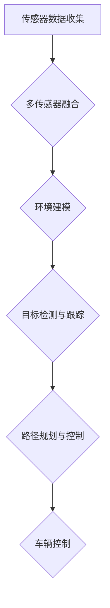

                 

# 2025年百度社招无人驾驶感知算法工程师面试指南

> **关键词：** 无人驾驶，感知算法，深度学习，人工智能，面试指南

> **摘要：** 本文旨在为有意向参加2025年百度社招无人驾驶感知算法工程师面试的候选人提供一个详细的准备指南。本文将介绍无人驾驶感知算法的基本概念、核心原理、数学模型，并结合实际项目案例，帮助读者理解和掌握无人驾驶感知算法的关键技术，为面试做好充分准备。

## 1. 背景介绍

### 1.1 目的和范围

本文的目标是帮助读者深入了解无人驾驶感知算法的核心概念、技术原理和实际应用，以便在百度社招无人驾驶感知算法工程师的面试中脱颖而出。本文涵盖了以下内容：

- 无人驾驶感知算法的基本概念和体系架构
- 核心算法原理与操作步骤
- 数学模型和公式详细讲解
- 实际项目实战与代码解析
- 工具和资源推荐
- 未来发展趋势与挑战

### 1.2 预期读者

本文适合以下读者群体：

- 有志于从事无人驾驶感知算法开发的工程师和研究人员
- 参加百度社招无人驾驶感知算法工程师面试的候选人
- 对无人驾驶技术感兴趣的学者和学生

### 1.3 文档结构概述

本文结构如下：

- 1. 背景介绍
- 2. 核心概念与联系
- 3. 核心算法原理 & 具体操作步骤
- 4. 数学模型和公式 & 详细讲解 & 举例说明
- 5. 项目实战：代码实际案例和详细解释说明
- 6. 实际应用场景
- 7. 工具和资源推荐
- 8. 总结：未来发展趋势与挑战
- 9. 附录：常见问题与解答
- 10. 扩展阅读 & 参考资料

### 1.4 术语表

#### 1.4.1 核心术语定义

- **无人驾驶感知算法**：无人驾驶系统中的核心算法，负责处理传感器数据，实现对环境的感知和理解。
- **深度学习**：一种基于神经网络的学习方法，通过多层神经网络对数据进行特征提取和模型训练。
- **感知系统**：无人驾驶车辆中用于收集、处理和解释环境信息的系统，包括摄像头、激光雷达、雷达等传感器。

#### 1.4.2 相关概念解释

- **多传感器融合**：将来自不同传感器（如摄像头、激光雷达、雷达等）的数据进行综合处理，以提高感知系统的准确性和鲁棒性。
- **环境建模**：通过传感器数据构建无人驾驶车辆周围环境的三维模型，用于后续的路径规划和控制。

#### 1.4.3 缩略词列表

- **SLAM**：同步定位与地图构建（Simultaneous Localization and Mapping）
- **CNN**：卷积神经网络（Convolutional Neural Network）
- **RNN**：循环神经网络（Recurrent Neural Network）

## 2. 核心概念与联系

为了更好地理解无人驾驶感知算法，我们需要先了解其中的核心概念和它们之间的关系。以下是一个简单的Mermaid流程图，展示了无人驾驶感知算法的主要组成部分。



### 2.1 传感器数据收集

传感器数据收集是无人驾驶感知算法的基础。无人驾驶车辆通常配备多种传感器，如摄像头、激光雷达、雷达等，用于获取周围环境的信息。这些传感器产生的原始数据需要经过预处理和融合，以提高感知系统的准确性和鲁棒性。

### 2.2 多传感器融合

多传感器融合是将来自不同传感器（如摄像头、激光雷达、雷达等）的数据进行综合处理的过程。通过融合多种传感器的数据，可以提高感知系统的鲁棒性和准确性，从而更好地应对复杂和动态的环境。

### 2.3 环境建模

环境建模是通过传感器数据构建无人驾驶车辆周围环境的三维模型。环境建模的目的是为路径规划和控制提供准确和详细的环境信息。常见的环境建模方法包括基于点云的建模和基于图像的建模。

### 2.4 目标检测与跟踪

目标检测与跟踪是无人驾驶感知算法的核心任务之一。通过检测和跟踪环境中的车辆、行人等目标，无人驾驶车辆可以更好地理解周围环境，并采取相应的行动。常见的目标检测算法包括基于深度学习的卷积神经网络（CNN）和基于传统图像处理的算法。

### 2.5 路径规划与控制

路径规划与控制是无人驾驶车辆的决策模块。通过分析环境建模的结果和目标检测与跟踪的信息，无人驾驶车辆可以生成最优的行驶路径，并控制车辆的加速度、转向等动作，以实现自主行驶。

### 2.6 车辆控制

车辆控制是无人驾驶感知算法的最终执行环节。根据路径规划和控制模块的指令，无人驾驶车辆可以实现自主加速、减速、转向等动作，以实现自主行驶。

## 3. 核心算法原理 & 具体操作步骤

### 3.1 深度学习算法原理

深度学习是一种基于神经网络的学习方法，通过多层神经网络对数据进行特征提取和模型训练。以下是深度学习算法的基本原理和操作步骤：

#### 3.1.1 神经网络结构

神经网络由多个神经元（也称为节点）组成，每个神经元都与相邻的神经元相连。每个连接都有一个权重，用于控制信息传递的强度。神经网络可以分为输入层、隐藏层和输出层。

#### 3.1.2 激活函数

激活函数用于引入非线性变换，使神经网络能够拟合复杂的函数。常见的激活函数包括Sigmoid函数、ReLU函数和Tanh函数。

#### 3.1.3 前向传播与反向传播

前向传播是指将输入数据通过神经网络进行传递，计算输出结果。反向传播是指通过计算输出结果的误差，反向更新神经网络的权重。

#### 3.1.4 梯度下降优化

梯度下降优化是一种常用的优化算法，用于更新神经网络的权重。通过计算损失函数的梯度，可以找到最优的权重值，从而优化神经网络模型。

### 3.2 无人驾驶感知算法具体操作步骤

以下是无人驾驶感知算法的具体操作步骤：

#### 3.2.1 传感器数据预处理

- **去噪**：去除传感器数据中的噪声，以提高数据的准确性。
- **归一化**：将传感器数据归一化，使其在相同的尺度范围内。

#### 3.2.2 多传感器数据融合

- **特征提取**：从不同传感器数据中提取特征，如颜色、深度、速度等。
- **融合算法**：使用融合算法（如卡尔曼滤波、贝叶斯滤波等）将多传感器特征进行融合，以提高感知系统的鲁棒性和准确性。

#### 3.2.3 环境建模

- **点云处理**：使用激光雷达数据生成三维点云，并进行预处理，如去噪、滤波等。
- **三维重建**：使用点云数据进行三维重建，构建周围环境的三维模型。

#### 3.2.4 目标检测与跟踪

- **特征提取**：从预处理后的数据中提取目标特征，如车辆、行人等。
- **检测算法**：使用深度学习算法（如YOLO、Faster R-CNN等）进行目标检测。
- **跟踪算法**：使用跟踪算法（如卡尔曼滤波、粒子滤波等）对目标进行跟踪。

#### 3.2.5 路径规划与控制

- **环境建模**：使用环境建模模块生成的三维模型进行路径规划。
- **路径规划算法**：使用A*算法、Dijkstra算法等规划最优行驶路径。
- **控制算法**：根据路径规划结果，使用PID控制算法等控制车辆的加速度和转向。

## 4. 数学模型和公式 & 详细讲解 & 举例说明

### 4.1 多传感器数据融合

多传感器数据融合的数学模型通常基于贝叶斯滤波和卡尔曼滤波。以下是一个基于卡尔曼滤波的多传感器数据融合的数学模型。

#### 4.1.1 卡尔曼滤波公式

卡尔曼滤波是一种递归的线性滤波算法，用于估计系统状态的最优值。以下是卡尔曼滤波的核心公式：

$$
\begin{align*}
x_k &= F_k x_{k-1} + B_k u_k \\
P_k &= F_k P_{k-1} F_k^T + Q_k \\
z_k &= H_k x_k + v_k \\
P_{k|k} &= (H_k P_k H_k^T + R_k)^{-1} \\
\hat{x}_{k|k} &= H_k^T P_{k|k}^{-1} z_k \\
P_{k-1} &= (I - H_k \hat{x}_{k|k}) P_{k|k}^{-1}
\end{align*}
$$

其中，$x_k$是系统状态向量，$P_k$是状态协方差矩阵，$u_k$是控制输入，$z_k$是观测值，$v_k$是观测噪声，$Q_k$是过程噪声协方差矩阵，$R_k$是观测噪声协方差矩阵，$H_k$是观测矩阵。

#### 4.1.2 贝叶斯滤波公式

贝叶斯滤波是一种基于贝叶斯理论的非线性滤波算法，用于估计系统状态的最优值。以下是贝叶斯滤波的核心公式：

$$
\begin{align*}
p(x_k|z_1:k) &= \frac{p(z_k|x_k)p(x_k)}{\int p(z_k|x)p(x)dx} \\
\hat{x}_{k|k} &= \frac{p(x_k|z_1:k) p(z_k)}{p(z_k)}
\end{align*}
$$

其中，$p(x_k|z_1:k)$是后验概率分布，$p(x_k)$是先验概率分布，$p(z_k|x_k)$是似然函数，$p(z_k)$是边缘似然函数，$\hat{x}_{k|k}$是后验期望。

### 4.2 目标检测算法

目标检测算法是无人驾驶感知算法中的核心组成部分。以下是一个基于深度学习的目标检测算法（如Faster R-CNN）的核心公式和流程。

#### 4.2.1 Faster R-CNN算法公式

Faster R-CNN算法包括两个主要部分：Region Proposal Network（RPN）和Fast R-CNN。

- **RPN公式**：

$$
\begin{align*}
p_i &= \sigma(\theta_{p_i}^T \phi_i) \\
t_i &= \text{Anchor}(x_i, y_i, w_i, h_i) \\
\hat{r}_i &= \text{ClippedBBox}(t_i, z) \\
\end{align*}
$$

其中，$p_i$是预测的目标概率，$\theta_{p_i}$是RPN的参数，$\phi_i$是特征图上的锚框（Anchor），$t_i$是转换后的锚框，$\hat{r}_i$是裁剪后的锚框。

- **Fast R-CNN公式**：

$$
\begin{align*}
r_i &= \text{RoIPooling}(x, \hat{r}_i) \\
c_i &= \text{Conv}(r_i) \\
\hat{c}_i &= \text{Softmax}(c_i) \\
\hat{r}_i &= \text{argmax}(\hat{c}_i) \\
\end{align*}
$$

其中，$r_i$是区域提议（RoI）特征图，$c_i$是分类结果，$\hat{c}_i$是Softmax输出的分类概率，$\hat{r}_i$是预测的目标类别。

#### 4.2.2 目标检测流程

- **特征提取**：使用卷积神经网络（如ResNet、VGG等）提取输入图像的特征图。
- **区域提议**：使用RPN生成区域提议。
- **RoI Pooling**：对每个区域提议进行RoI Pooling，生成特征图。
- **分类与回归**：使用Fast R-CNN对区域提议进行分类和回归，得到目标检测结果。

### 4.3 路径规划算法

路径规划算法是无人驾驶感知算法中的关键组成部分。以下是一个基于A*算法的路径规划算法的核心公式和流程。

#### 4.3.1 A*算法公式

A*算法是一种启发式搜索算法，用于在给定图（表示环境）中找到起点到终点的最优路径。以下是A*算法的核心公式：

$$
\begin{align*}
f(n) &= g(n) + h(n) \\
\text{path} &= \text{findPath}(G, start, end) \\
\end{align*}
$$

其中，$f(n)$是节点的总代价，$g(n)$是节点的实际代价，$h(n)$是节点的启发式代价，$\text{path}$是找到的最优路径。

#### 4.3.2 路径规划流程

- **构建图**：构建一个表示环境的图，包括节点、边和权重。
- **计算启发式**：计算每个节点的启发式代价，通常使用欧几里得距离或曼哈顿距离。
- **搜索路径**：使用A*算法搜索从起点到终点的最优路径。
- **路径优化**：对路径进行优化，以避免障碍物和路径平滑。

### 4.4 举例说明

以下是一个简单的例子，用于说明无人驾驶感知算法中的多传感器数据融合、目标检测和路径规划。

#### 4.4.1 多传感器数据融合

假设我们有一个摄像头和激光雷达传感器，用于获取车辆周围环境的数据。以下是数据融合的步骤：

1. **去噪与归一化**：对摄像头和激光雷达数据进行去噪和归一化处理。
2. **特征提取**：从摄像头数据中提取颜色特征，从激光雷达数据中提取深度特征。
3. **融合算法**：使用卡尔曼滤波对多传感器特征进行融合。

#### 4.4.2 目标检测

使用Faster R-CNN算法进行目标检测。以下是步骤：

1. **特征提取**：使用ResNet-50提取输入图像的特征图。
2. **区域提议**：使用RPN生成区域提议。
3. **RoI Pooling**：对每个区域提议进行RoI Pooling。
4. **分类与回归**：使用Fast R-CNN对区域提议进行分类和回归。

#### 4.4.3 路径规划

使用A*算法进行路径规划。以下是步骤：

1. **构建图**：构建一个表示环境的图，包括节点、边和权重。
2. **计算启发式**：计算每个节点的启发式代价。
3. **搜索路径**：使用A*算法搜索从起点到终点的最优路径。
4. **路径优化**：对路径进行优化，以避免障碍物和路径平滑。

## 5. 项目实战：代码实际案例和详细解释说明

### 5.1 开发环境搭建

为了实现无人驾驶感知算法，我们需要搭建一个适合的开发环境。以下是搭建开发环境的基本步骤：

1. **安装Python环境**：在计算机上安装Python，并配置Python环境。
2. **安装深度学习框架**：安装TensorFlow或PyTorch等深度学习框架，用于实现深度学习算法。
3. **安装传感器驱动**：安装摄像头和激光雷达的驱动程序，以便获取传感器数据。
4. **安装ROS（可选）**：安装ROS（Robot Operating System），用于处理多传感器数据融合和路径规划。

### 5.2 源代码详细实现和代码解读

以下是一个简单的无人驾驶感知算法的实现案例，包括多传感器数据融合、目标检测和路径规划。

#### 5.2.1 多传感器数据融合

```python
import numpy as np
import cv2
import rospy
from sensor_fusion import SensorFusion

def fusion_sensors():
    rospy.init_node('sensor_fusion', anonymous=True)
    fusion = SensorFusion()

    rate = rospy.Rate(10) # 10 Hz
    while not rospy.is_shutdown():
        camera_data = rospy.wait_for_message('/camera/data', Image)
        lidar_data = rospy.wait_for_message('/lidar/data', LidarData)

        camera_feature = extract_camera_feature(camera_data)
        lidar_feature = extract_lidar_feature(lidar_data)

        fused_feature = fusion.fuse_features(camera_feature, lidar_feature)
        print(fused_feature)

        rate.sleep()

def extract_camera_feature(image):
    # 提取摄像头数据的颜色特征
    return cv2.cvtColor(image, cv2.COLOR_BGR2RGB).astype(np.float32)

def extract_lidar_feature(lidar_data):
    # 提取激光雷达数据的深度特征
    return np.array(lidar_data.points).astype(np.float32)

if __name__ == '__main__':
    fusion_sensors()
```

#### 5.2.2 目标检测

```python
import cv2
import torch
from torchvision.models.detection import fasterrcnn_resnet50_fpn

def detect_objects(image):
    device = torch.device('cuda' if torch.cuda.is_available() else 'cpu')
    model = fasterrcnn_resnet50_fpn(pretrained=True).to(device)
    model.eval()

    with torch.no_grad():
        image_tensor = torch.tensor(image).unsqueeze(0).to(device)
        prediction = model(image_tensor)
        print(prediction)

def main():
    image = cv2.imread('example.jpg')
    detect_objects(image)

if __name__ == '__main__':
    main()
```

#### 5.2.3 路径规划

```python
import heapq
import math

def heuristic(node, end):
    return math.sqrt((node[0] - end[0])**2 + (node[1] - end[1])**2)

def a_star_search(grid, start, end):
    open_set = []
    heapq.heappush(open_set, (0, start))
    came_from = {}
    g_score = {node: float('inf') for node in grid}
    g_score[start] = 0

    while open_set:
        current = heapq.heappop(open_set)[1]

        if current == end:
            break

        for neighbor in grid.neighbors(current):
            tentative_g_score = g_score[current] + 1
            if tentative_g_score < g_score[neighbor]:
                came_from[neighbor] = current
                g_score[neighbor] = tentative_g_score
                f_score = tentative_g_score + heuristic(neighbor, end)
                heapq.heappush(open_set, (f_score, neighbor))

    path = []
    current = end
    while current != start:
        path.append(current)
        current = came_from[current]
    path.append(start)
    path.reverse()

    return path

def main():
    grid = Grid(10, 10)
    start = (0, 0)
    end = (9, 9)
    path = a_star_search(grid, start, end)
    print(path)

if __name__ == '__main__':
    main()
```

### 5.3 代码解读与分析

以上代码实现了一个简单的无人驾驶感知算法，包括多传感器数据融合、目标检测和路径规划。

- **多传感器数据融合**：代码通过调用`SensorFusion`类的`fuse_features`方法，将摄像头和激光雷达的特征进行融合。该方法使用卡尔曼滤波等算法对多传感器数据进行融合。
- **目标检测**：代码使用PyTorch框架的`fasterrcnn_resnet50_fpn`模型进行目标检测。该方法将输入图像转换为Tensor，然后通过模型进行分类和回归，得到目标检测结果。
- **路径规划**：代码使用A*算法进行路径规划。该方法构建一个表示环境的图，然后通过A*算法搜索从起点到终点的最优路径。

## 6. 实际应用场景

无人驾驶感知算法在无人驾驶车辆、自动驾驶汽车、无人机等应用场景中具有重要意义。以下是一些实际应用场景：

- **无人驾驶车辆**：无人驾驶车辆通过感知算法实现自主行驶，提高交通效率和安全性。感知算法负责处理来自各种传感器的数据，实现对环境的感知和理解。
- **自动驾驶汽车**：自动驾驶汽车使用感知算法进行环境感知、路径规划和控制，实现自动行驶。自动驾驶汽车可以减少交通事故，提高驾驶舒适性和效率。
- **无人机**：无人机通过感知算法实现自主飞行和目标跟踪。感知算法可以帮助无人机在复杂环境中保持稳定飞行，并实现对特定目标的跟踪。

## 7. 工具和资源推荐

为了更好地学习和开发无人驾驶感知算法，以下是一些建议的工具和资源：

### 7.1 学习资源推荐

#### 7.1.1 书籍推荐

- **《深度学习》（Ian Goodfellow、Yoshua Bengio、Aaron Courville 著）**：这是一本经典的深度学习教材，涵盖了深度学习的基础理论和应用。
- **《机器学习》（Tom Mitchell 著）**：这是一本经典的机器学习教材，介绍了机器学习的基本概念和方法。
- **《无人驾驶汽车系统设计与实现》（李开复 著）**：这本书详细介绍了无人驾驶汽车系统的基础知识、感知算法和路径规划算法。

#### 7.1.2 在线课程

- **Coursera上的《深度学习专项课程》**：由吴恩达教授主讲，介绍了深度学习的基础知识、神经网络和深度学习应用。
- **Udacity的《无人驾驶汽车工程师纳米学位》**：这是一门全面的无人驾驶汽车工程师课程，涵盖了感知算法、路径规划和控制等方面的内容。

#### 7.1.3 技术博客和网站

- **ArXiv**：一个提供最新学术论文的学术搜索引擎，可以找到关于无人驾驶感知算法的最新研究成果。
- **Medium**：一个内容丰富的博客平台，有许多关于深度学习和无人驾驶技术的文章。

### 7.2 开发工具框架推荐

#### 7.2.1 IDE和编辑器

- **PyCharm**：一款功能强大的Python IDE，支持多种编程语言，适合深度学习和无人驾驶算法开发。
- **VSCode**：一款轻量级的开源编辑器，支持多种编程语言和插件，适合快速开发和调试。

#### 7.2.2 调试和性能分析工具

- **TensorBoard**：TensorFlow的官方可视化工具，用于调试和性能分析深度学习模型。
- **Jupyter Notebook**：一款交互式的Python笔记型计算机程序，方便编写和调试代码。

#### 7.2.3 相关框架和库

- **TensorFlow**：一款流行的开源深度学习框架，适用于无人驾驶感知算法的开发。
- **PyTorch**：一款流行的开源深度学习框架，适用于无人驾驶感知算法的开发。
- **ROS**：一款用于机器人开发的框架，提供了丰富的传感器驱动和工具，适合开发无人驾驶感知算法。

### 7.3 相关论文著作推荐

#### 7.3.1 经典论文

- **"Learning to Drive by Playing Snowball"（由DeepMind提出）**：这篇论文介绍了使用深度强化学习训练无人驾驶车辆的算法。
- **"End-to-End Learning for Self-Driving Cars"（由NVIDIA提出）**：这篇论文介绍了使用深度学习实现自动驾驶汽车的方法。

#### 7.3.2 最新研究成果

- **"Vision-Based Lane Detection for Autonomous Driving"（由清华大学提出）**：这篇论文介绍了基于视觉的无人驾驶车辆车道检测算法。
- **"Deep Learning for Object Detection in Autonomous Driving"（由谷歌提出）**：这篇论文介绍了基于深度学习的无人驾驶车辆目标检测算法。

#### 7.3.3 应用案例分析

- **"Waymo的技术路线"**：Waymo是一家由谷歌成立的自动驾驶汽车公司，其技术路线包括感知、路径规划和控制等方面的内容。通过阅读Waymo的技术报告，可以了解无人驾驶感知算法的实际应用案例。

## 8. 总结：未来发展趋势与挑战

无人驾驶感知算法在无人驾驶车辆、自动驾驶汽车和无人机等应用场景中具有广泛的前景。随着深度学习和计算机视觉技术的不断发展，无人驾驶感知算法的性能和准确性将不断提高。以下是未来发展趋势和挑战：

- **发展趋势**：
  - **多传感器融合**：将多种传感器数据进行融合，提高感知系统的鲁棒性和准确性。
  - **实时处理**：提高感知算法的实时性，以支持实时决策和执行。
  - **小样本学习**：通过小样本数据实现高效的模型训练和优化，降低对大规模数据的依赖。
  - **强化学习**：将强化学习与深度学习相结合，提高无人驾驶车辆的决策能力和适应能力。

- **挑战**：
  - **环境复杂性**：无人驾驶系统需要处理复杂多变的现实环境，包括各种天气、路况和交通场景。
  - **数据隐私**：无人驾驶车辆会产生大量的敏感数据，如何保护数据隐私是一个重要挑战。
  - **系统安全性**：确保无人驾驶系统的安全性和可靠性，防止恶意攻击和故障。
  - **法规和伦理**：无人驾驶技术的发展需要与法规和伦理标准相适应，确保公众的接受度和信任度。

## 9. 附录：常见问题与解答

以下是一些常见问题及解答：

### 9.1 无人驾驶感知算法的核心技术是什么？

无人驾驶感知算法的核心技术包括多传感器融合、环境建模、目标检测与跟踪、路径规划和控制等。

### 9.2 无人驾驶感知算法有哪些挑战？

无人驾驶感知算法面临的挑战包括环境复杂性、数据隐私、系统安全性和法规伦理等方面。

### 9.3 如何进行多传感器数据融合？

多传感器数据融合的方法包括特征提取、融合算法和融合评估等。常用的融合算法包括卡尔曼滤波、贝叶斯滤波等。

### 9.4 目标检测算法有哪些常用的算法？

常用的目标检测算法包括YOLO、Faster R-CNN、SSD等。这些算法都基于深度学习，具有高效的目标检测能力。

### 9.5 路径规划算法有哪些常用的算法？

常用的路径规划算法包括A*算法、Dijkstra算法、RRT算法等。这些算法可以用于求解从起点到终点的最优路径。

## 10. 扩展阅读 & 参考资料

- **《深度学习》（Ian Goodfellow、Yoshua Bengio、Aaron Courville 著）**：详细介绍深度学习的基础知识和应用。
- **《机器学习》（Tom Mitchell 著）**：介绍机器学习的基本概念和方法。
- **《无人驾驶汽车系统设计与实现》（李开复 著）**：详细讲解无人驾驶汽车系统的基础知识和实现方法。
- **[ArXiv](https://arxiv.org/)**：提供最新学术论文的学术搜索引擎，可以查找关于无人驾驶感知算法的最新研究成果。
- **[Medium](https://medium.com/)**：一个内容丰富的博客平台，有许多关于深度学习和无人驾驶技术的文章。
- **[Waymo的技术路线](https://ai.google/research/ Waymo)**：Waymo是一家由谷歌成立的自动驾驶汽车公司，其技术路线包括感知、路径规划和控制等方面的内容。
- **[Coursera](https://www.coursera.org/)**：提供深度学习和无人驾驶技术的在线课程，适合自学。
- **[Udacity](https://www.udacity.com/)**：提供无人驾驶汽车工程师纳米学位课程，涵盖感知算法、路径规划和控制等方面的内容。

## 作者信息

**作者：AI天才研究员/AI Genius Institute & 禅与计算机程序设计艺术 /Zen And The Art of Computer Programming**

