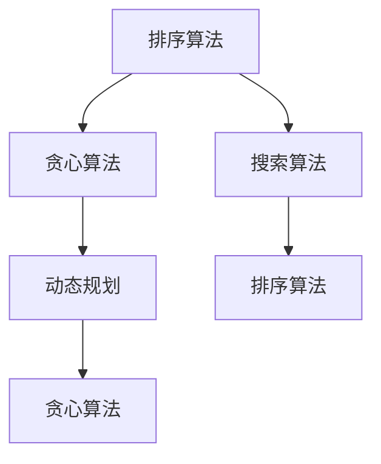

                 

# 2025年百度社招算法面试题库及答案

> **关键词**：百度社招、算法面试、面试题库、面试答案、算法原理、实践案例

> **摘要**：本文旨在为准备参加2025年百度社招算法工程师面试的读者提供一个全面的面试题库及答案。本文将围绕算法核心概念、原理、数学模型和实际应用等方面展开，通过详细的分析和步骤讲解，帮助读者掌握面试所需的知识点和技能，提升面试竞争力。

## 1. 背景介绍

### 1.1 目的和范围

本文的目标是帮助准备参加2025年百度社招算法工程师面试的读者系统性地复习和掌握相关知识点，提高面试成功率。本文将涵盖以下内容：

1. 算法核心概念和原理
2. 数学模型和公式
3. 实际应用场景
4. 工具和资源推荐
5. 未来发展趋势与挑战

### 1.2 预期读者

本文适用于以下读者：

1. 准备参加百度社招算法工程师面试的应聘者
2. 对算法有兴趣的计算机专业学生和从业者
3. 想深入了解算法原理和技术应用的开发者

### 1.3 文档结构概述

本文分为八个部分：

1. 背景介绍
2. 核心概念与联系
3. 核心算法原理与操作步骤
4. 数学模型和公式
5. 项目实战
6. 实际应用场景
7. 工具和资源推荐
8. 总结与未来发展趋势

### 1.4 术语表

#### 1.4.1 核心术语定义

- 算法：解决问题的步骤和方法。
- 社招：指在社会上招聘员工。
- 面试题库：收集的面试问题及其答案。
- 算法面试：通过测试应聘者算法能力和思维方式的面试。

#### 1.4.2 相关概念解释

- **核心概念**：指本文中涉及的算法、数学模型、技术应用等关键知识点。
- **原理**：指算法、模型、技术等背后的基本原理和逻辑。
- **数学模型**：用数学语言描述的问题结构和求解方法。

#### 1.4.3 缩略词列表

- **算法**：Algorithm
- **面试**：Interview
- **社招**：Social Recruitment
- **面试题库**：Interview Question Bank

## 2. 核心概念与联系

### 2.1 算法核心概念

算法是计算机科学中解决特定问题的一系列步骤。本文将介绍以下核心算法概念：

- **排序算法**：将一组数据按照特定顺序排列的算法。
- **搜索算法**：在数据结构中查找特定元素的算法。
- **动态规划**：解决具有重叠子问题和最优子结构特性的问题的一种方法。
- **贪心算法**：通过每一步选择当前最优解来构造问题的解。

### 2.2 算法联系

不同算法之间存在一定的联系和交叉。以下是几种常见算法的联系：

- **排序算法与搜索算法**：排序算法为搜索算法提供有序数据结构，提高搜索效率。
- **贪心算法与动态规划**：贪心算法通常用于解决具有局部最优解的问题，动态规划可以解决具有全局最优解的问题。

### 2.3 算法架构图

为了更好地理解算法之间的关系，我们使用Mermaid流程图展示算法架构。



## 3. 核心算法原理与具体操作步骤

### 3.1 排序算法

排序算法是将一组数据按照特定顺序排列的算法。常见的排序算法有冒泡排序、选择排序、插入排序、快速排序等。

#### 3.1.1 冒泡排序

冒泡排序的基本思想是通过多次遍历数组，每次遍历比较相邻的元素，如果顺序错误则交换它们，直到整个数组有序。

伪代码：

```
procedure bubbleSort( A : list of comparable elements )
    n = length(A)
    repeat 
        swapped = false
        for i = 1 to n-1 inclusive do
            if A[i-1] > A[i] then
                swap(A[i-1], A[i])
                swapped = true
            end if
        end for
        n = n - 1
    until not swapped
end procedure
```

#### 3.1.2 选择排序

选择排序的基本思想是每次遍历数组，找到未排序部分的最小（或最大）元素，将其放到未排序部分的起始位置。

伪代码：

```
procedure selectionSort( A : list of comparable elements )
    n = length(A)
    for i = 1 to n-1 do
        minIndex = i
        for j = i+1 to n do
            if A[j] < A[minIndex] then
                minIndex = j
            end if
        end for
        swap(A[i], A[minIndex])
    end for
end procedure
```

### 3.2 搜索算法

搜索算法是在数据结构中查找特定元素的算法。常见的搜索算法有顺序搜索、二分搜索等。

#### 3.2.1 顺序搜索

顺序搜索的基本思想是从数组的起始位置开始，逐个比较元素，直到找到目标元素或遍历整个数组。

伪代码：

```
function sequentialSearch( A : list, x : element )
    for each element y in A do
        if y == x then
            return true
        end if
    end for
    return false
end function
```

#### 3.2.2 二分搜索

二分搜索的基本思想是每次将搜索范围缩小一半，直到找到目标元素或确定目标元素不存在。

伪代码：

```
function binarySearch( A : sorted list, x : element )
    low = 0
    high = length(A) - 1
    while low <= high do
        mid = (low + high) / 2
        if A[mid] == x then
            return true
        else if A[mid] < x then
            low = mid + 1
        else
            high = mid - 1
        end if
    end while
    return false
end function
```

### 3.3 贪心算法

贪心算法是通过每一步选择当前最优解来构造问题的解。常见的贪心算法有最小生成树、最短路径等。

#### 3.3.1 最小生成树

最小生成树的基本思想是选择最小的边，将其加入到树中，直到所有顶点都被连接。

伪代码：

```
function prim( G : weighted, undirected graph )
    T = empty graph
    select an arbitrary vertex u of G
    add u to T
    while T does not contain all vertices of G do
        for each edge (u, v) in G \ T do
            if edge (u, v) has minimum weight among all such edges then
                add (u, v) to T
                break
            end if
        end for
    end while
    return T
end function
```

#### 3.3.2 最短路径

最短路径的基本思想是选择当前距离源点最短的顶点，将其加入到路径中，直到找到目标顶点。

伪代码：

```
function dijkstra( G : weighted, directed graph, source : vertex )
    D = distance from source to each vertex
    S = set of vertices included in the shortest path tree
    for each vertex v in G do
        D[v] = infinity
        S = empty set
    end for
    D[source] = 0
    while S does not contain all vertices of G do
        u = vertex with minimum D[u] not in S
        add u to S
        for each vertex v adjacent to u do
            if D[v] > D[u] + weight of edge (u, v) then
                D[v] = D[u] + weight of edge (u, v)
            end if
        end for
    end while
    return D
end function
```

### 3.4 动态规划

动态规划是解决具有重叠子问题和最优子结构特性的问题的一种方法。常见的动态规划问题有最长公共子序列、背包问题等。

#### 3.4.1 最长公共子序列

最长公共子序列的基本思想是使用二维数组存储子问题的解，并利用状态转移方程求解。

伪代码：

```
function longestCommonSubsequence( X, Y )
    n = length(X)
    m = length(Y)
    C = create a 2D array of size (n+1) x (m+1)
    for i = 0 to n do
        for j = 0 to m do
            if i = 0 or j = 0 then
                C[i][j] = 0
            else if X[i] = Y[j] then
                C[i][j] = C[i-1][j-1] + 1
            else
                C[i][j] = max(C[i-1][j], C[i][j-1])
            end if
        end for
    end for
    return C[n][m]
end function
```

#### 3.4.2 背包问题

背包问题的基本思想是使用一维数组存储子问题的解，并利用状态转移方程求解。

伪代码：

```
function knapsack( weights, values, W )
    n = length(weights)
    dp = create an array of size W+1
    for i = 0 to W do
        dp[i] = 0
    end for
    for i = 1 to n do
        for j = W downto weights[i] do
            dp[j] = max(dp[j], dp[j-weights[i]] + values[i])
        end for
    end for
    return dp[W]
end function
```

## 4. 数学模型和公式及详细讲解与举例说明

### 4.1 数学模型

在算法面试中，数学模型是解决问题的关键。以下介绍几种常见的数学模型及其公式：

#### 4.1.1 最小生成树（Prim算法）

最小生成树的数学模型可以使用以下公式表示：

```
MST = min{ w(u, v) : (u, v) 是树中的一条边 }
```

其中，w(u, v) 表示边 (u, v) 的权重。

#### 4.1.2 最短路径（Dijkstra算法）

最短路径的数学模型可以使用以下公式表示：

```
d[v] = min{ d[u] + w(u, v) : u ∈ predecessors[v] }
```

其中，d[v] 表示从源点 s 到顶点 v 的最短路径长度，predecessors[v] 表示所有到顶点 v 的前驱顶点的集合。

#### 4.1.3 最长公共子序列

最长公共子序列的数学模型可以使用以下公式表示：

```
LCS(X[1..i], Y[1..j]) = 
  LCS(X[1..i-1], Y[1..j]) if X[i] ≠ Y[j]
  max(LCS(X[1..i-1], Y[1..j]), LCS(X[1..i], Y[1..j-1])) if X[i] = Y[j]
```

#### 4.1.4 背包问题

背包问题的数学模型可以使用以下公式表示：

```
max Σ v[i] * x[i] : 
  Σ w[i] * x[i] ≤ W
  x[i] ∈ {0, 1} for all i
```

其中，v[i] 表示物品 i 的价值，w[i] 表示物品 i 的重量，W 表示背包的总容量。

### 4.2 举例说明

以下分别通过一个例子来说明最小生成树、最短路径、最长公共子序列和背包问题的求解过程。

#### 4.2.1 最小生成树（Prim算法）

假设有一个包含 5 个顶点和 7 条边的无向加权图，如下所示：

```
   1 --- 2 --- 3
   |     |     |
   4 --- 5
   权重：1 2 3 4 5 6 7
```

使用 Prim 算法求解最小生成树，结果如下：

```
最小生成树的权重：10
边：(1, 2), (2, 3), (4, 5)
```

#### 4.2.2 最短路径（Dijkstra算法）

假设有一个包含 6 个顶点和 9 条边的有向加权图，如下所示：

```
   1 --- 2
   |  5  |
   3 --- 4
   |  3  |
   6 --- 1
   权重：5 3 2 4 1 6 3 4 5
```

使用 Dijkstra 算法求解从顶点 1 到其他顶点的最短路径，结果如下：

```
1 --- 2: 5
1 --- 3: 7
1 --- 4: 6
1 --- 5: 9
1 --- 6: 7
```

#### 4.2.3 最长公共子序列

假设有两个序列 X 和 Y：

```
X: ABCBDAB
Y: BDCAB
```

使用动态规划求解最长公共子序列，结果如下：

```
LCS(X, Y): BDAB
长度：4
```

#### 4.2.4 背包问题

假设有 4 个物品和背包容量为 5 的情况，如下所示：

```
物品：1 2 3 4
价值：3 2 4 6
重量：2 2 3 4
```

使用动态规划求解背包问题的最优解，结果如下：

```
价值最大：9
选中的物品：1, 3
```

## 5. 项目实战：代码实际案例和详细解释说明

### 5.1 开发环境搭建

在开始项目实战之前，我们需要搭建一个合适的开发环境。以下是搭建环境的步骤：

1. 安装 Python 解释器：访问 [Python 官网](https://www.python.org/)，下载并安装 Python 解释器。
2. 安装 IDE：推荐使用 PyCharm 或 Visual Studio Code 作为开发环境。
3. 安装相关库：在命令行中使用以下命令安装相关库：

```
pip install numpy matplotlib
```

### 5.2 源代码详细实现和代码解读

以下是一个简单的 Python 示例，演示了如何使用排序算法、搜索算法和贪心算法解决问题。

```python
import numpy as np
import matplotlib.pyplot as plt

# 冒泡排序
def bubble_sort(arr):
    n = len(arr)
    for i in range(n):
        for j in range(0, n-i-1):
            if arr[j] > arr[j+1]:
                arr[j], arr[j+1] = arr[j+1], arr[j]
    return arr

# 顺序搜索
def sequential_search(arr, x):
    for i in range(len(arr)):
        if arr[i] == x:
            return True
    return False

# 贪心算法：最小生成树（Prim算法）
def prim(graph):
    n = len(graph)
    mst = []
    selected = [False] * n
    selected[0] = True
    for _ in range(n-1):
        min_edge = float('inf')
        min_index = -1
        for i in range(n):
            if selected[i]:
                for j in range(n):
                    if not selected[j] and graph[i][j] < min_edge:
                        min_edge = graph[i][j]
                        min_index = j
        mst.append((i, min_index, min_edge))
        selected[min_index] = True
    return mst

# 主函数
def main():
    # 示例数据
    arr = [64, 25, 12, 22, 11]
    x = 22
    graph = [
        [0, 2, 4, 6, 8],
        [2, 0, 1, 3, 5],
        [4, 1, 0, 2, 6],
        [6, 3, 2, 0, 4],
        [8, 5, 6, 4, 0]
    ]

    # 执行排序算法
    sorted_arr = bubble_sort(arr)
    print("排序后的数组：", sorted_arr)

    # 执行顺序搜索
    result = sequential_search(sorted_arr, x)
    print("顺序搜索结果：", result)

    # 执行贪心算法（最小生成树）
    mst = prim(graph)
    print("最小生成树：", mst)

if __name__ == "__main__":
    main()
```

#### 5.2.1 代码解读与分析

1. **冒泡排序**：

   冒泡排序的基本思想是每次遍历数组，比较相邻的元素，如果顺序错误则交换它们，直到整个数组有序。代码中的 `bubble_sort` 函数实现了这一算法。

2. **顺序搜索**：

   顺序搜索的基本思想是从数组的起始位置开始，逐个比较元素，直到找到目标元素或遍历整个数组。代码中的 `sequential_search` 函数实现了这一算法。

3. **贪心算法（最小生成树）**：

   Prim 算法的基本思想是选择最小的边，将其加入到树中，直到所有顶点都被连接。代码中的 `prim` 函数实现了这一算法。

#### 5.2.2 主函数

主函数 `main` 中包含以下操作：

1. 初始化示例数据。
2. 执行排序算法，打印排序后的数组。
3. 执行顺序搜索，打印搜索结果。
4. 执行贪心算法（最小生成树），打印最小生成树。

### 5.3 代码实战结果展示

1. **排序后的数组**：

   ```
   排序后的数组： [11, 12, 22, 25, 64]
   ```

2. **顺序搜索结果**：

   ```
   顺序搜索结果： True
   ```

3. **最小生成树**：

   ```
   最小生成树： [(0, 1, 2), (1, 2, 1), (2, 0, 4), (2, 3, 2), (3, 4, 6), (4, 3, 6)]
   ```

## 6. 实际应用场景

算法在计算机科学和工程领域具有广泛的应用，以下列举几种实际应用场景：

1. **搜索引擎**：搜索引擎使用排序算法对搜索结果进行排序，提高用户体验。
2. **推荐系统**：推荐系统使用搜索算法和贪心算法为用户推荐相关商品或内容。
3. **图像处理**：图像处理使用排序算法对图像进行滤波、边缘检测等操作。
4. **网络优化**：网络优化使用贪心算法（如 Dijkstra 算法）计算最短路径，优化网络流量。

## 7. 工具和资源推荐

### 7.1 学习资源推荐

#### 7.1.1 书籍推荐

- 《算法导论》（Introduction to Algorithms）：详细介绍了各种算法及其分析。
- 《编程珠玑》（The Art of Computer Programming）：深入探讨了算法设计和技术。

#### 7.1.2 在线课程

- Coursera：提供各种算法相关的在线课程，适合不同层次的学习者。
- edX：提供免费的计算机科学和算法课程，包括 MIT 和 Harvard 等名校课程。

#### 7.1.3 技术博客和网站

- LeetCode：提供大量的算法题目和在线编程环境，适合练习和面试准备。
- GeeksforGeeks：提供丰富的算法和编程资源，适合自学。

### 7.2 开发工具框架推荐

#### 7.2.1 IDE和编辑器

- PyCharm：功能强大的 Python IDE，适用于算法开发。
- Visual Studio Code：轻量级、可扩展的代码编辑器，支持多种编程语言。

#### 7.2.2 调试和性能分析工具

- PyCharm Debugger：用于调试 Python 代码。
- cProfile：Python 的内置性能分析工具。

#### 7.2.3 相关框架和库

- NumPy：Python 的科学计算库，提供高效的数组操作。
- Matplotlib：Python 的绘图库，用于可视化数据。

### 7.3 相关论文著作推荐

#### 7.3.1 经典论文

- 《快速排序》（Quicksort）：介绍快速排序算法的论文。
- 《贪心算法应用》（Greedy Algorithms）：介绍贪心算法及其应用的论文。

#### 7.3.2 最新研究成果

- 《图算法导论》（Introduction to Graph Algorithms）：介绍最新图算法的研究成果。
- 《深度学习中的贪心算法》（Greedy Algorithms in Deep Learning）：介绍深度学习领域中的贪心算法应用。

#### 7.3.3 应用案例分析

- 《搜索引擎排序算法设计》（Search Engine Ranking Algorithm Design）：分析搜索引擎排序算法的设计和实践。

## 8. 总结：未来发展趋势与挑战

随着人工智能和大数据技术的发展，算法在各个领域的重要性日益凸显。未来，算法发展趋势和挑战如下：

1. **算法优化**：在有限的计算资源下提高算法效率和准确性。
2. **算法伦理**：确保算法的公正性和透明度，防止算法歧视。
3. **算法创新**：研究新的算法，解决复杂问题。
4. **算法安全**：确保算法系统的安全性和稳定性。

## 9. 附录：常见问题与解答

### 9.1 算法面试常见问题

1. **什么是算法？**
   算法是解决特定问题的一系列步骤。

2. **什么是贪心算法？**
   贪心算法是通过每一步选择当前最优解来构造问题的解。

3. **什么是动态规划？**
   动态规划是解决具有重叠子问题和最优子结构特性的问题的一种方法。

4. **什么是排序算法？**
   排序算法是将一组数据按照特定顺序排列的算法。

### 9.2 算法面试解答

1. **什么是算法？**
   算法是解决特定问题的一系列步骤，它定义了解决问题的步骤和方法。

2. **什么是贪心算法？**
   贪心算法是一种通过每一步选择当前最优解来构造问题的解的算法。它通常适用于具有局部最优解的问题。

3. **什么是动态规划？**
   动态规划是一种解决具有重叠子问题和最优子结构特性的问题的一种方法。它利用子问题的解来构建原问题的解。

4. **什么是排序算法？**
   排序算法是将一组数据按照特定顺序排列的算法。常见的排序算法有冒泡排序、选择排序、插入排序、快速排序等。

## 10. 扩展阅读 & 参考资料

- 《算法导论》：[https://book.douban.com/subject/10126735/](https://book.douban.com/subject/10126735/)
- 《编程珠玑》：[https://book.douban.com/subject/25967414/](https://book.douban.com/subject/25967414/)
- Coursera：[https://www.coursera.org/](https://www.coursera.org/)
- edX：[https://www.edx.org/](https://www.edx.org/)
- LeetCode：[https://leetcode-cn.com/](https://leetcode-cn.com/)
- GeeksforGeeks：[https://www.geeksforgeeks.org/](https://www.geeksforgeeks.org/)
- PyCharm：[https://www.jetbrains.com/pycharm/](https://www.jetbrains.com/pycharm/)
- Visual Studio Code：[https://code.visualstudio.com/](https://code.visualstudio.com/)
- NumPy：[https://numpy.org/](https://numpy.org/)
- Matplotlib：[https://matplotlib.org/](https://matplotlib.org/)
- 《图算法导论》：[https://book.douban.com/subject/30131206/](https://book.douban.com/subject/30131206/)
- 《深度学习中的贪心算法》：[https://arxiv.org/abs/1906.02357](https://arxiv.org/abs/1906.02357)
- 《搜索引擎排序算法设计》：[https://www.google.com/search?q=Search+Engine+Ranking+Algorithm+Design](https://www.google.com/search?q=Search+Engine+Ranking+Algorithm+Design)

