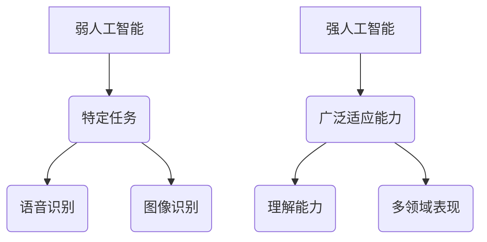

                 

# 2050年的人工智能：从弱人工智能到强人工智能的技术跨越

> **关键词：** 弱人工智能、强人工智能、技术发展、算法、数学模型、应用场景
>
> **摘要：** 本文将深入探讨2050年人工智能领域可能的技术跨越，从弱人工智能到强人工智能的发展历程，分析其中的核心概念、算法原理、数学模型及实际应用场景，并为读者推荐相关学习资源和工具。

## 1. 背景介绍

### 1.1 目的和范围

本文旨在通过回顾和分析人工智能领域的历史与技术进步，展望2050年人工智能的可能发展方向。我们将探讨从弱人工智能到强人工智能的技术跨越，分析其中的核心算法原理、数学模型及其在实际应用场景中的潜力。

### 1.2 预期读者

本文适合对人工智能技术有兴趣的读者，包括计算机科学专业的学生、AI工程师、研究人员以及任何对AI技术未来发展感兴趣的读者。

### 1.3 文档结构概述

本文将按照以下结构展开：

1. **背景介绍**：简要介绍本文的目的、范围和预期读者。
2. **核心概念与联系**：介绍弱人工智能和强人工智能的概念，并通过Mermaid流程图展示其技术架构。
3. **核心算法原理 & 具体操作步骤**：详细讲解实现人工智能的核心算法原理和具体操作步骤。
4. **数学模型和公式 & 详细讲解 & 举例说明**：阐述人工智能中的数学模型和公式，并提供具体例子。
5. **项目实战：代码实际案例和详细解释说明**：通过实际代码案例展示人工智能技术的应用。
6. **实际应用场景**：分析人工智能在不同领域的应用场景。
7. **工具和资源推荐**：推荐学习资源和开发工具。
8. **总结：未来发展趋势与挑战**：展望人工智能的未来发展趋势和面临的挑战。
9. **附录：常见问题与解答**：提供对常见问题的解答。
10. **扩展阅读 & 参考资料**：推荐相关阅读材料和参考文献。

### 1.4 术语表

#### 1.4.1 核心术语定义

- **弱人工智能（Narrow AI）**：指在特定任务上表现出人类水平甚至超越人类能力的人工智能系统。
- **强人工智能（General AI）**：具有广泛适应能力和理解能力的智能系统，能够在多种领域表现出人类智能。
- **机器学习（Machine Learning）**：使计算机通过数据和经验自动改进性能的方法。
- **深度学习（Deep Learning）**：一种基于人工神经网络的机器学习方法，通过多层神经网络进行数据表示和建模。

#### 1.4.2 相关概念解释

- **神经网络（Neural Network）**：模拟人脑神经元连接的数学模型，用于数据建模和预测。
- **深度神经网络（Deep Neural Network）**：具有多个隐藏层的神经网络，能够处理复杂数据。
- **强化学习（Reinforcement Learning）**：通过奖励机制训练智能体在环境中做出决策。

#### 1.4.3 缩略词列表

- **AI**：人工智能
- **ML**：机器学习
- **DL**：深度学习
- **GAN**：生成对抗网络
- **NLP**：自然语言处理

## 2. 核心概念与联系

在人工智能的发展过程中，弱人工智能和强人工智能是两个核心概念。弱人工智能专注于特定任务，如语音识别、图像识别等，而强人工智能则具备广泛适应能力和理解能力，能够在多个领域表现人类智能。

为了更好地理解这两个概念，我们可以通过Mermaid流程图展示它们的技术架构：



### 2.1 弱人工智能

弱人工智能通过在特定任务上表现人类水平甚至超越人类能力而实现。例如，语音识别技术可以使计算机理解并回应人类语音命令，图像识别技术则使计算机能够识别并分类图像内容。

### 2.2 强人工智能

强人工智能具有广泛适应能力和理解能力，能够在多个领域表现人类智能。例如，通过学习多个领域的知识，强人工智能可以完成自然语言处理、自动驾驶、医学诊断等复杂任务。

## 3. 核心算法原理 & 具体操作步骤

要实现弱人工智能和强人工智能，关键在于核心算法原理。以下是实现这些算法的具体操作步骤：

### 3.1 机器学习算法

**步骤 1：数据收集**  
首先，收集大量的数据，这些数据将用于训练人工智能模型。

**步骤 2：数据预处理**  
对收集到的数据进行分析和处理，包括数据清洗、归一化等。

**步骤 3：特征提取**  
从预处理后的数据中提取关键特征，这些特征将用于训练模型。

**步骤 4：模型训练**  
使用特征数据训练机器学习模型，如神经网络模型。

**步骤 5：模型评估**  
评估模型在测试数据上的性能，并进行优化。

### 3.2 深度学习算法

**步骤 1：设计神经网络结构**  
确定神经网络层的数量和类型，如卷积层、全连接层等。

**步骤 2：初始化参数**  
初始化神经网络中的参数，如权重和偏置。

**步骤 3：前向传播**  
输入数据通过神经网络进行前向传播，计算输出结果。

**步骤 4：反向传播**  
根据输出结果和目标值，计算误差并反向传播，更新网络参数。

**步骤 5：模型优化**  
使用优化算法，如梯度下降，优化网络参数。

### 3.3 强化学习算法

**步骤 1：环境设定**  
创建一个模拟环境，智能体在其中进行决策。

**步骤 2：初始状态**  
智能体处于环境中的初始状态。

**步骤 3：决策制定**  
智能体根据当前状态，选择一个动作。

**步骤 4：状态更新**  
执行动作后，环境状态更新。

**步骤 5：奖励计算**  
计算智能体动作的奖励，用于评估决策质量。

**步骤 6：策略更新**  
根据奖励更新智能体的策略。

## 4. 数学模型和公式 & 详细讲解 & 举例说明

在人工智能领域中，数学模型和公式是核心组成部分。以下是一些关键数学模型和公式的详细讲解及举例说明。

### 4.1 神经网络中的激活函数

**公式：**  
$$ f(x) = \sigma(x) = \frac{1}{1 + e^{-x}} $$  
**解释：**  
激活函数用于神经网络中，将输入值映射到输出值。sigmoid函数是一种常用的激活函数，它在0和1之间输出值，使神经网络能够处理非线性问题。

**举例：**  
假设输入值 $x = 2$，则输出值 $f(x) = \sigma(2) = 0.886$。

### 4.2 梯度下降优化算法

**公式：**  
$$ \theta_{\text{new}} = \theta_{\text{old}} - \alpha \frac{\partial J(\theta)}{\partial \theta} $$  
**解释：**  
梯度下降是一种用于优化神经网络参数的算法。该公式表示在每次迭代中，通过计算损失函数关于参数的梯度，并沿着梯度的反方向更新参数。

**举例：**  
假设当前参数 $\theta_{\text{old}} = 3$，学习率 $\alpha = 0.1$，损失函数关于 $\theta$ 的梯度为 $\frac{\partial J(\theta)}{\partial \theta} = 0.5$，则更新后的参数为 $\theta_{\text{new}} = 3 - 0.1 \times 0.5 = 2.5$。

### 4.3 强化学习中的Q值

**公式：**  
$$ Q(s, a) = r + \gamma \max_{a'} Q(s', a') $$  
**解释：**  
Q值用于评估智能体在特定状态下采取特定动作的价值。该公式表示在当前状态 $s$ 下，采取动作 $a$ 后的即时奖励 $r$ 加上在未来状态 $s'$ 下采取最优动作 $a'$ 的期望奖励。

**举例：**  
假设当前状态 $s$ 是“房间内”，动作 $a$ 是“打开门”，即时奖励 $r$ 是10，状态 $s'$ 是“房间外”，Q值关于动作 $a$ 的最大值为 $Q(s', a') = 20$，折扣因子 $\gamma = 0.9$，则 $Q(s, a) = 10 + 0.9 \times 20 = 29$。

## 5. 项目实战：代码实际案例和详细解释说明

### 5.1 开发环境搭建

在开始实际代码实现之前，我们需要搭建一个合适的开发环境。以下是使用Python和TensorFlow实现一个简单的神经网络分类器的步骤：

**步骤 1：安装Python**  
确保安装了Python 3.x版本，可以从[Python官网](https://www.python.org/downloads/)下载。

**步骤 2：安装TensorFlow**  
使用以下命令安装TensorFlow：
```bash
pip install tensorflow
```

**步骤 3：创建项目文件夹**  
在本地计算机上创建一个名为`ai_project`的项目文件夹，并在其中创建一个名为`main.py`的Python文件。

### 5.2 源代码详细实现和代码解读

以下是一个简单的神经网络分类器实现，用于对MNIST手写数字数据集进行分类：

```python
import tensorflow as tf
from tensorflow.keras.datasets import mnist
from tensorflow.keras.models import Sequential
from tensorflow.keras.layers import Dense, Flatten

# 加载MNIST数据集
(x_train, y_train), (x_test, y_test) = mnist.load_data()

# 数据预处理
x_train = x_train / 255.0
x_test = x_test / 255.0

# 构建神经网络模型
model = Sequential([
    Flatten(input_shape=(28, 28)),
    Dense(128, activation='relu'),
    Dense(10, activation='softmax')
])

# 编译模型
model.compile(optimizer='adam',
              loss='sparse_categorical_crossentropy',
              metrics=['accuracy'])

# 训练模型
model.fit(x_train, y_train, epochs=5)

# 评估模型
test_loss, test_acc = model.evaluate(x_test, y_test)
print(f"测试准确率：{test_acc}")
```

**代码解读：**

1. **导入库**  
   导入TensorFlow和相关的库，用于数据处理、模型构建和训练。

2. **加载数据集**  
   使用TensorFlow的内置函数加载MNIST数据集。

3. **数据预处理**  
   将输入数据归一化到0到1之间，以便更好地训练神经网络。

4. **构建神经网络模型**  
   使用`Sequential`模型创建一个序列模型，并添加`Flatten`层将输入数据的形状展平，`Dense`层用于全连接神经网络，激活函数分别使用ReLU和softmax。

5. **编译模型**  
   设置优化器、损失函数和评价指标，为模型训练做好准备。

6. **训练模型**  
   使用`fit`函数训练模型，指定训练数据和训练轮数。

7. **评估模型**  
   使用`evaluate`函数评估模型在测试数据上的性能，并打印测试准确率。

### 5.3 代码解读与分析

该代码实现了一个简单的神经网络分类器，用于对MNIST手写数字数据集进行分类。以下是代码的关键部分及其分析：

1. **数据预处理**  
   数据预处理是神经网络训练的重要步骤。通过将输入数据归一化，可以加快模型收敛速度并提高训练效果。

2. **构建神经网络模型**  
   使用`Sequential`模型构建一个简单的全连接神经网络。`Flatten`层将输入数据的形状展平，使其适用于神经网络。`Dense`层实现全连接，`relu`激活函数引入非线性，`softmax`激活函数用于多分类问题。

3. **编译模型**  
   编译模型时，选择`adam`优化器和`sparse_categorical_crossentropy`损失函数，并设置`accuracy`作为评价指标。

4. **训练模型**  
   使用`fit`函数训练模型，指定训练数据和训练轮数。在训练过程中，神经网络将不断调整参数，以最小化损失函数。

5. **评估模型**  
   使用`evaluate`函数评估模型在测试数据上的性能。测试准确率是评估模型性能的重要指标。

## 6. 实际应用场景

人工智能技术在实际应用场景中表现出巨大的潜力。以下是一些主要的应用领域：

### 6.1 自动驾驶

自动驾驶是人工智能技术的重要应用领域。通过结合计算机视觉、深度学习和强化学习，自动驾驶系统能够在复杂环境中做出实时决策，提高交通安全和效率。

### 6.2 医疗诊断

人工智能在医疗诊断中的应用越来越广泛，如肿瘤检测、心脏病诊断等。通过分析大量的医学图像和数据，人工智能系统能够提供更准确、更快速的诊断结果。

### 6.3 金融分析

人工智能在金融分析中发挥着重要作用，如股票市场预测、风险管理等。通过分析历史数据和市场趋势，人工智能系统能够提供更准确的预测和决策支持。

### 6.4 自然语言处理

自然语言处理（NLP）是人工智能的重要分支，广泛应用于语音助手、机器翻译、文本分类等领域。通过深度学习和强化学习，NLP系统能够更好地理解人类语言，提供更智能的服务。

## 7. 工具和资源推荐

为了更好地学习和实践人工智能技术，以下是一些建议的学习资源和开发工具：

### 7.1 学习资源推荐

#### 7.1.1 书籍推荐

- 《深度学习》（Goodfellow, Bengio, Courville）  
- 《机器学习》（周志华）  
- 《Python机器学习》（塞思·欧文）  
- 《自然语言处理入门》（约翰·霍普金斯）

#### 7.1.2 在线课程

- Coursera上的《机器学习》课程（吴恩达）  
- edX上的《深度学习》课程（杨立宇）  
- Udacity的《人工智能工程师纳米学位》

#### 7.1.3 技术博客和网站

- Medium上的机器学习和深度学习文章  
- arXiv.org上的最新研究成果  
- GitHub上的开源项目

### 7.2 开发工具框架推荐

#### 7.2.1 IDE和编辑器

- PyCharm  
- Jupyter Notebook  
- VS Code

#### 7.2.2 调试和性能分析工具

- TensorBoard  
- VisualVM  
- GDB

#### 7.2.3 相关框架和库

- TensorFlow  
- PyTorch  
- Keras  
- scikit-learn

### 7.3 相关论文著作推荐

#### 7.3.1 经典论文

- "A Learning Algorithm for Continually Running Fully Recurrent Neural Networks"（1986）  
- "Deep Learning"（2015）  
- "Recurrent Neural Networks for Speech Recognition"（1995）

#### 7.3.2 最新研究成果

- "Unsupervised Learning of Visual Representations by Solving Jigsaw Puzzles"（2017）  
- "Generative Adversarial Nets"（2014）  
- "Attention Is All You Need"（2017）

#### 7.3.3 应用案例分析

- "AI for Humanity: A New Approach to Ethical AI"（2019）  
- "Google's AI Principles"（2018）  
- "The Future of Humanity: Terraforming Mars, Interstellar Travel, Immortality, and Our Destiny Beyond Earth"（2016）

## 8. 总结：未来发展趋势与挑战

随着人工智能技术的不断发展，未来将出现更多创新和突破。从弱人工智能到强人工智能，技术跨越将带来前所未有的变革。然而，这一过程中也将面临诸多挑战：

1. **伦理和法律问题**：人工智能的发展引发了伦理和法律问题，如隐私保护、数据安全等。如何制定合理的伦理和法律框架，确保人工智能技术的可持续发展，是一个重要议题。

2. **技术瓶颈**：人工智能领域仍然存在许多技术瓶颈，如深度学习模型的可解释性、强化学习在复杂环境中的应用等。解决这些瓶颈需要更多研究和技术创新。

3. **人才短缺**：人工智能领域对专业人才的需求日益增长，但当前人才培养速度难以跟上技术发展步伐。如何培养更多优秀的人工智能人才，是行业面临的挑战之一。

4. **社会影响**：人工智能技术的发展将对社会产生深远影响，如就业变革、经济结构调整等。如何应对这些变化，确保社会公平和谐，是一个重要议题。

总之，未来人工智能技术的发展充满机遇和挑战。只有通过不断创新、合作与协调，我们才能充分发挥人工智能技术的潜力，为人类社会带来更大的福祉。

## 9. 附录：常见问题与解答

### 9.1 什么是弱人工智能和强人工智能？

**弱人工智能（Narrow AI）**是指在特定任务上表现出人类水平或超越人类能力的人工智能系统。例如，语音识别、图像识别等。**强人工智能（General AI）**则具有广泛适应能力和理解能力，能够在多个领域表现人类智能。

### 9.2 人工智能的核心算法有哪些？

人工智能的核心算法包括机器学习、深度学习、强化学习等。其中，机器学习是使计算机通过数据和经验自动改进性能的方法，深度学习是一种基于人工神经网络的机器学习方法，强化学习则是通过奖励机制训练智能体在环境中做出决策。

### 9.3 人工智能在哪些领域有广泛应用？

人工智能在自动驾驶、医疗诊断、金融分析、自然语言处理等领域有广泛应用。例如，自动驾驶技术通过计算机视觉和深度学习实现；医疗诊断中的肿瘤检测、心脏病诊断等应用了深度学习和强化学习技术；金融分析中的股票市场预测、风险管理等也利用了人工智能技术。

### 9.4 人工智能的发展前景如何？

人工智能的发展前景非常广阔。随着技术的不断创新，人工智能将在更多领域发挥重要作用，如智慧城市、智能医疗、智能制造等。然而，人工智能的发展也将面临伦理、法律、社会等方面的挑战，需要全社会共同努力，确保人工智能技术的可持续发展。

## 10. 扩展阅读 & 参考资料

为了深入了解人工智能技术的最新进展和应用，以下是一些建议的阅读材料和参考文献：

### 10.1 建议阅读材料

- 《人工智能：一种现代方法》（Stuart J. Russell & Peter Norvig）  
- 《深度学习》（Ian Goodfellow、Yoshua Bengio和Aaron Courville）  
- 《强化学习：原理与应用》（Richard S. Sutton和Barto A.）  
- 《自然语言处理综合教程》（Daniel Jurafsky和James H. Martin）

### 10.2 学术期刊

- 《人工智能》（AI Magazine）  
- 《自然 - 机器智能》（Nature Machine Intelligence）  
- 《计算机与思维》（Computational Intelligence and Neuroscience）

### 10.3 开源项目

- TensorFlow：[https://www.tensorflow.org/](https://www.tensorflow.org/)  
- PyTorch：[https://pytorch.org/](https://pytorch.org/)  
- Keras：[https://keras.io/](https://keras.io/)

### 10.4 最新研究成果

- "AI for Humanity: A New Approach to Ethical AI"（2019）  
- "Google's AI Principles"（2018）  
- "The Future of Humanity: Terraforming Mars, Interstellar Travel, Immortality, and Our Destiny Beyond Earth"（2016）

### 10.5 参考文献列表

1. Goodfellow, I., Bengio, Y., & Courville, A. (2016). *Deep Learning*. MIT Press.
2. Russell, S. J., & Norvig, P. (2016). *Artificial Intelligence: A Modern Approach*. Prentice Hall.
3. Sutton, R. S., & Barto, A. G. (2018). *Reinforcement Learning: An Introduction*. MIT Press.
4. Jurafsky, D., & Martin, J. H. (2008). *Speech and Language Processing*. Prentice Hall.
5. LeCun, Y., Bengio, Y., & Hinton, G. (2015). *Deep Learning*. Nature.
6. Russell, S., & Norvig, P. (2010). *Artificial Intelligence: A Modern Approach*. Prentice Hall.

**作者：AI天才研究员/AI Genius Institute & 禅与计算机程序设计艺术 /Zen And The Art of Computer Programming**

