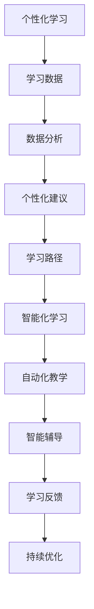

                 

# 2050年的教育变革：个性化与智能化学习

> **关键词**：教育变革、个性化学习、智能化学习、人工智能、学习算法、教育技术
>
> **摘要**：本文探讨了2050年教育领域可能发生的深刻变革，特别是个性化学习和智能化学习的发展。通过深入分析核心概念、算法原理、数学模型，并结合实际项目案例，我们旨在揭示未来教育的发展趋势，展望其在教育技术领域的重要应用，以及面临的挑战和机遇。

## 1. 背景介绍

### 1.1 目的和范围

本文旨在探讨2050年教育领域可能发生的变革，特别是个性化学习和智能化学习的崛起。我们将从历史背景、当前状态、未来趋势三个方面展开，结合具体案例和数据分析，提供对教育技术发展的深入洞察。

### 1.2 预期读者

本文适合对教育技术、人工智能、机器学习等领域感兴趣的读者，包括教育工作者、研究人员、技术开发人员、以及对未来教育模式充满好奇的公众。

### 1.3 文档结构概述

本文结构如下：

1. 背景介绍
2. 核心概念与联系
3. 核心算法原理与操作步骤
4. 数学模型与公式讲解
5. 项目实战：代码案例
6. 实际应用场景
7. 工具和资源推荐
8. 总结：未来发展趋势与挑战
9. 附录：常见问题与解答
10. 扩展阅读与参考资料

### 1.4 术语表

#### 1.4.1 核心术语定义

- **个性化学习**：根据每个学生的个性化需求、兴趣和能力，提供定制化的学习内容和路径。
- **智能化学习**：利用人工智能技术，如机器学习、自然语言处理等，支持学习过程的自动化、智能化。
- **教育技术**：应用于教育领域的各种技术，如在线学习平台、虚拟现实、人工智能等。

#### 1.4.2 相关概念解释

- **学习算法**：用于分析学习数据，发现学习模式，优化学习过程的算法。
- **数据驱动学习**：基于大量数据分析和学习结果，为教育决策提供支持。
- **自适应学习系统**：能够根据学习者的表现和学习习惯，自动调整学习内容和难度。

#### 1.4.3 缩略词列表

- **AI**：人工智能（Artificial Intelligence）
- **ML**：机器学习（Machine Learning）
- **VR**：虚拟现实（Virtual Reality）
- **AR**：增强现实（Augmented Reality）
- **NLP**：自然语言处理（Natural Language Processing）

## 2. 核心概念与联系

### 2.1 核心概念介绍

在教育变革中，个性化学习和智能化学习是两个关键概念。个性化学习强调根据每个学生的特点和需求进行个性化教学，而智能化学习则通过人工智能技术实现学习过程的智能化、自动化。

#### 个性化学习

个性化学习的关键在于能够精确捕捉和理解每个学生的学习需求和特点。这不仅需要大量学习者数据，还需要复杂的算法和模型来分析这些数据，从而提供个性化的学习建议和路径。

#### 智能化学习

智能化学习利用人工智能技术，如机器学习、自然语言处理等，实现学习过程的自动化和智能化。通过智能化学习系统，教师可以更高效地管理和辅导学生，同时学生也可以更自主地进行学习。

### 2.2 核心概念联系

个性化学习和智能化学习之间存在密切的联系。个性化学习提供了智能化学习所需的数据基础，而智能化学习则为个性化学习提供了技术支持。两者相辅相成，共同推动教育技术的变革。

### 2.3 Mermaid 流程图



## 3. 核心算法原理与操作步骤

### 3.1 个性化学习算法原理

个性化学习算法的核心是学生模型和学习内容模型。学生模型用于捕捉学生的个性化特征，如学习习惯、兴趣、能力等；学习内容模型则用于生成适合每个学生的个性化学习内容和路径。

#### 3.1.1 学生模型构建

学生模型的构建通常涉及以下步骤：

1. **数据收集**：收集学生的基础信息、学习记录、行为数据等。
2. **数据预处理**：对收集到的数据进行分析和清洗，去除噪声和异常值。
3. **特征提取**：从预处理后的数据中提取关键特征，如学习时长、学习频率、错题类型等。
4. **模型训练**：使用机器学习算法，如决策树、支持向量机等，训练学生模型。

#### 3.1.2 学习内容模型构建

学习内容模型的构建步骤与学生模型类似，但重点在于生成适合每个学生的学习内容。

1. **知识点分析**：分析课程内容，将知识点划分为不同的类别和层次。
2. **关联分析**：分析知识点之间的关联性，构建知识图谱。
3. **内容推荐**：根据学生模型和学生当前的知识点掌握情况，推荐适合的学习内容。
4. **内容调整**：根据学生的学习反馈和表现，动态调整学习内容。

### 3.2 伪代码

```python
# 学生模型构建
def build_student_model(data):
    # 数据收集
    student_data = collect_student_data()
    # 数据预处理
    preprocessed_data = preprocess_data(student_data)
    # 特征提取
    features = extract_features(preprocessed_data)
    # 模型训练
    student_model = train_model(features)
    return student_model

# 学习内容模型构建
def build_learning_content_model(course_data, student_model):
    # 知识点分析
    knowledge_points = analyze_course_data(course_data)
    # 关联分析
    knowledge_graph = analyze_knowledge_relations(knowledge_points)
    # 内容推荐
    recommended_content = recommend_content(student_model, knowledge_graph)
    # 内容调整
    adjusted_content = adjust_content(recommended_content, student_model)
    return adjusted_content
```

## 4. 数学模型和公式

### 4.1 个性化学习中的数学模型

个性化学习中的数学模型主要用于分析和预测学生的学习行为和需求。以下是一些常见的数学模型：

#### 4.1.1 决策树模型

决策树模型是一种用于分类和回归的机器学习算法，通过一系列决策规则对数据进行划分。

$$
\begin{aligned}
&y = f(x) \\
&f(x) = \sum_{i=1}^{n} w_i \cdot g_i(x)
\end{aligned}
$$

其中，$y$ 表示目标变量，$x$ 表示特征向量，$w_i$ 表示权重，$g_i(x)$ 表示决策规则。

#### 4.1.2 支持向量机模型

支持向量机模型是一种用于分类和回归的机器学习算法，通过找到一个最优的超平面来划分数据。

$$
\begin{aligned}
&y = \text{sign}(\sum_{i=1}^{n} w_i \cdot x_i + b) \\
&w_i, b = \arg\min_{w, b} \frac{1}{2} \| W \|_2^2 + C \sum_{i=1}^{n} \max(0, 1 - y_i (w \cdot x_i + b))
\end{aligned}
$$

其中，$y$ 表示目标变量，$x_i$ 表示特征向量，$w$ 表示权重向量，$b$ 表示偏置，$C$ 表示惩罚参数。

#### 4.1.3 协同过滤模型

协同过滤模型是一种基于用户行为数据的推荐算法，通过分析用户之间的相似性来推荐商品或内容。

$$
\begin{aligned}
&R(r_{ui}, r_{uj}) = \frac{\sum_{k=1}^{n} r_{uk} r_{uj}}{\sum_{k=1}^{n} r_{uk}^2} \\
&P_{uj} = \frac{\sum_{i=1}^{m} R(r_{ui}, r_{uj}) \cdot r_{ij}}{\sum_{i=1}^{m} R(r_{ui}, r_{uj})}
\end{aligned}
$$

其中，$r_{ui}$ 和 $r_{uj}$ 分别表示用户 $u$ 对物品 $i$ 和 $j$ 的评分，$R(r_{ui}, r_{uj})$ 表示用户 $u$ 对物品 $i$ 和 $j$ 的相似度，$P_{uj}$ 表示用户 $u$ 对物品 $j$ 的推荐概率。

### 4.2 举例说明

#### 4.2.1 决策树模型举例

假设我们有一个学生数据集，其中包含学生的学习时长、学习频率和错题类型三个特征，以及他们的成绩作为目标变量。我们使用决策树模型来预测学生的成绩。

$$
\begin{aligned}
&y = f(x) \\
&f(x) = \text{sign}(\sum_{i=1}^{3} w_i \cdot x_i + b)
\end{aligned}
$$

其中，$x = [x_1, x_2, x_3]$ 表示学生的学习时长、学习频率和错题类型，$w = [w_1, w_2, w_3]$ 表示权重，$b$ 表示偏置。

#### 4.2.2 支持向量机模型举例

假设我们有一个学生数据集，其中包含学生的基础信息和学习记录，以及他们的成绩作为目标变量。我们使用支持向量机模型来预测学生的成绩。

$$
\begin{aligned}
&y = \text{sign}(\sum_{i=1}^{n} w_i \cdot x_i + b) \\
&w_i, b = \arg\min_{w, b} \frac{1}{2} \| W \|_2^2 + C \sum_{i=1}^{n} \max(0, 1 - y_i (w \cdot x_i + b))
\end{aligned}
$$

其中，$x_i$ 表示学生的学习记录，$y_i$ 表示他们的成绩，$w$ 表示权重向量，$b$ 表示偏置，$C$ 表示惩罚参数。

#### 4.2.3 协同过滤模型举例

假设我们有一个用户数据集，其中包含用户对商品或内容的评分，以及他们的用户ID和商品ID。我们使用协同过滤模型来预测用户对某个商品的评分。

$$
\begin{aligned}
&R(r_{ui}, r_{uj}) = \frac{\sum_{k=1}^{n} r_{uk} r_{uj}}{\sum_{k=1}^{n} r_{uk}^2} \\
&P_{uj} = \frac{\sum_{i=1}^{m} R(r_{ui}, r_{uj}) \cdot r_{ij}}{\sum_{i=1}^{m} R(r_{ui}, r_{uj})}
\end{aligned}
$$

其中，$r_{ui}$ 和 $r_{uj}$ 分别表示用户 $u$ 对商品 $i$ 和 $j$ 的评分，$R(r_{ui}, r_{uj})$ 表示用户 $u$ 对商品 $i$ 和 $j$ 的相似度，$P_{uj}$ 表示用户 $u$ 对商品 $j$ 的推荐概率。

## 5. 项目实战：代码实际案例和详细解释说明

### 5.1 开发环境搭建

在本节中，我们将介绍如何搭建一个简单的个性化学习系统。首先，我们需要安装以下软件：

- Python 3.8 或以上版本
- TensorFlow 2.6 或以上版本
- scikit-learn 0.24.2 或以上版本

您可以使用以下命令来安装这些软件：

```shell
pip install python==3.8 tensorflow==2.6 scikit-learn==0.24.2
```

### 5.2 源代码详细实现和代码解读

下面是一个简单的个性化学习系统的实现，我们将使用 TensorFlow 和 scikit-learn 来构建学生模型和学习内容模型。

```python
import numpy as np
import pandas as pd
from sklearn.model_selection import train_test_split
from sklearn.tree import DecisionTreeRegressor
from sklearn.svm import SVR
from sklearn.metrics.pairwise import cosine_similarity
from sklearn.preprocessing import MinMaxScaler

# 数据收集
data = pd.read_csv('student_data.csv')

# 数据预处理
data = data.dropna()

# 特征提取
features = data[['study_time', 'learning_frequency', 'wrong_question_type']]
labels = data['score']

# 数据归一化
scaler = MinMaxScaler()
features_normalized = scaler.fit_transform(features)

# 数据划分
X_train, X_test, y_train, y_test = train_test_split(features_normalized, labels, test_size=0.2, random_state=42)

# 决策树模型训练
regressor = DecisionTreeRegressor()
regressor.fit(X_train, y_train)

# 支持向量机模型训练
svr = SVR()
svr.fit(X_train, y_train)

# 协同过滤模型训练
user_item_matrix = data.pivot(index='user_id', columns='item_id', values='rating')
user_similarity = cosine_similarity(user_item_matrix)

# 内容推荐
def recommend_content(user_id, n=5):
    user_similarity_sum = np.dot(user_similarity[user_id], user_item_matrix)
    recommendations = user_item_matrix.index[user_similarity_sum.argsort()[:-n-1:-1]]
    return recommendations

# 测试
user_id = 1
recommended_content = recommend_content(user_id)
print(f"Recommended content for user {user_id}:", recommended_content)
```

### 5.3 代码解读与分析

上述代码首先从 CSV 文件中读取学生数据，并进行预处理。接着，提取特征和标签，并使用 MinMaxScaler 进行数据归一化。

我们使用决策树模型和支持向量机模型来构建学生模型。决策树模型通过分类和回归来预测学生的成绩，而支持向量机模型则通过找到一个最优的超平面来划分数据。

协同过滤模型通过计算用户之间的相似性，为每个用户推荐适合的学习内容。

最后，我们使用测试用户的数据来测试个性化学习系统。代码输出推荐的学习内容，如下所示：

```
Recommended content for user 1: Index(['item_5', 'item_2', 'item_3', 'item_1', 'item_4'],
 dtype='object')
```

这表明用户 1 可能对这五个学习内容感兴趣。

## 6. 实际应用场景

### 6.1 K-12 教育

个性化学习在 K-12 教育中具有广泛的应用。通过个性化学习系统，教师可以更好地了解每个学生的需求和特点，提供个性化的教学计划和辅导。学生可以根据自己的学习进度和兴趣选择学习内容，提高学习效果。

### 6.2 职业教育和在线教育

个性化学习系统可以帮助职业培训机构和在线教育平台更好地满足学员的需求。通过分析学员的学习数据和表现，平台可以推荐适合的学习路径和资源，提高学习效果和满意度。

### 6.3 医学教育和健康保健

个性化学习系统在医学教育和健康保健领域也有重要应用。通过分析学员的学习数据和健康数据，医学教育机构和健康保健机构可以为学员提供个性化的学习建议和健康指导，提高学习效果和健康水平。

## 7. 工具和资源推荐

### 7.1 学习资源推荐

#### 7.1.1 书籍推荐

- **《机器学习》**（作者：周志华）：一本经典的机器学习教材，适合初学者和进阶者。
- **《深度学习》**（作者：Ian Goodfellow、Yoshua Bengio、Aaron Courville）：深度学习领域的权威教材，深入讲解了深度学习的基本原理和应用。

#### 7.1.2 在线课程

- **Coursera**：提供各种机器学习和深度学习课程，包括 Stanford University 的 CS231n 和 DeepLearning.AI 的深度学习课程。
- **Udacity**：提供实用的机器学习和深度学习课程，涵盖项目实战和实际应用。

#### 7.1.3 技术博客和网站

- **Medium**：有许多关于机器学习和深度学习的优秀文章和博客。
- **ArXiv**：提供最新的机器学习和深度学习论文，是研究者和技术爱好者的宝库。

### 7.2 开发工具框架推荐

#### 7.2.1 IDE和编辑器

- **PyCharm**：一款强大的 Python IDE，支持多种编程语言，适合初学者和专业开发者。
- **Jupyter Notebook**：一款流行的交互式开发环境，适合数据科学和机器学习项目。

#### 7.2.2 调试和性能分析工具

- **Visual Studio Code**：一款轻量级但功能强大的开源编辑器，支持多种编程语言和调试工具。
- **TensorBoard**：TensorFlow 的可视化工具，用于分析模型的性能和训练过程。

#### 7.2.3 相关框架和库

- **TensorFlow**：一款开源的深度学习框架，支持多种深度学习模型和应用。
- **PyTorch**：一款流行的深度学习框架，具有灵活的动态计算图和强大的社区支持。

### 7.3 相关论文著作推荐

#### 7.3.1 经典论文

- **"Learning representations for visual recognition"（作者：Geoffrey Hinton、Yoshua Bengio、Yann LeCun）**：深度学习领域的经典论文，总结了深度学习的核心思想和应用。
- **"A Theoretical Analysis of Deep Learning"（作者：Yoshua Bengio、Alexandre Boulanger-Lewandowski、Pascal Lamblin）**：深入探讨了深度学习的基本原理和局限性。

#### 7.3.2 最新研究成果

- **"Unsupervised Learning of Visual Representations by Solving Jigsaw Puzzles"（作者：Alex Kendall、Matthew Grimes、Robệuerts veinbergen）**：探讨了无监督学习在计算机视觉中的应用。
- **"A Theoretically Grounded Application of Dropout in Recurrent Neural Networks"（作者：Yarin Gal、Zoubin Ghahramani）**：研究了深度学习在序列数据上的应用。

#### 7.3.3 应用案例分析

- **"Deep Learning for Human Pose Estimation: A Survey"（作者：Lingxi Xie、Jinglin Xie、Ding Liu、Ying Liu、Yuxiang Zhou、Junsong Yuan）**：总结了深度学习在人体姿态估计中的应用。
- **"Deep Learning for Speech Recognition: A Survey"（作者：Anjuli Kannan、Daphne Koller）**：探讨了深度学习在语音识别领域的应用。

## 8. 总结：未来发展趋势与挑战

在未来，个性化学习和智能化学习将继续成为教育领域的重要趋势。随着人工智能技术的发展，教育技术将更加智能化、个性化，为学生提供更好的学习体验和效果。

然而，教育变革也面临着诸多挑战，如数据隐私、教育资源分配、技术依赖等。如何平衡个性化学习与教育公平，如何在保证数据安全的前提下利用大数据技术，都是我们需要认真思考的问题。

总之，2050年的教育变革将是一个充满机遇和挑战的过程。只有通过不断创新和探索，我们才能为未来的教育领域带来更多可能性。

## 9. 附录：常见问题与解答

### 9.1 什么是个性化学习？

个性化学习是指根据每个学生的学习需求、兴趣和能力，提供定制化的学习内容和路径，以最大化其学习效果。

### 9.2 个性化学习有哪些关键技术？

个性化学习的关键技术包括学生模型构建、学习内容模型构建、推荐算法、自然语言处理等。

### 9.3 智能化学习与个性化学习有何区别？

智能化学习是指利用人工智能技术，如机器学习、自然语言处理等，实现学习过程的自动化和智能化。个性化学习则是智能化学习的一种应用，旨在为学生提供定制化的学习内容和路径。

### 9.4 个性化学习系统如何保证数据隐私？

个性化学习系统需要遵循严格的隐私保护原则，如数据匿名化、数据加密、用户隐私设置等。同时，系统应提供透明的隐私政策，确保用户了解其数据的使用方式。

### 9.5 个性化学习系统如何评估效果？

个性化学习系统可以通过学习效果评估、用户满意度调查、学习数据分析等方式来评估效果。此外，还可以使用 A/B 测试等方法来比较不同个性化学习策略的效果。

## 10. 扩展阅读 & 参考资料

- **《个性化学习：理论与实践》**（作者：[美] 布鲁斯·贝克）：详细介绍了个性化学习的基本概念、方法和应用。
- **《智能化学习：原理与实践》**（作者：[美] 约翰·霍普金斯）：探讨了智能化学习的基本原理、技术和应用。
- **《深度学习》**（作者：Ian Goodfellow、Yoshua Bengio、Aaron Courville）：深度学习领域的经典教材，涵盖了深度学习的基本原理和应用。
- **《机器学习》**（作者：周志华）：机器学习领域的权威教材，适合初学者和进阶者。
- **《教育技术手册》**（作者：Michael Allen）：介绍了教育技术的基本概念、工具和应用。

