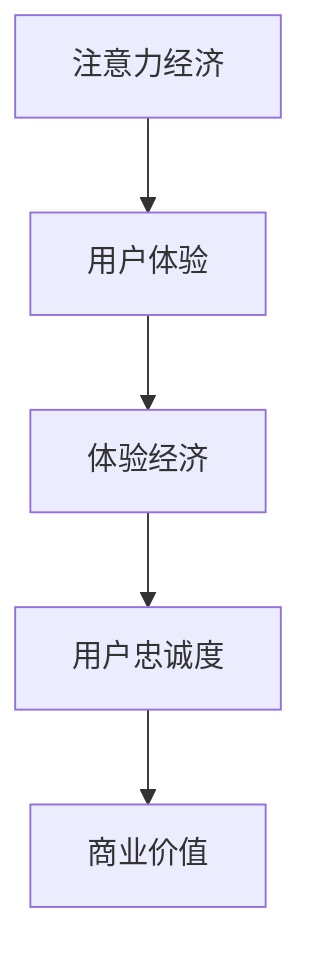
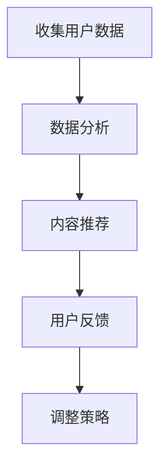
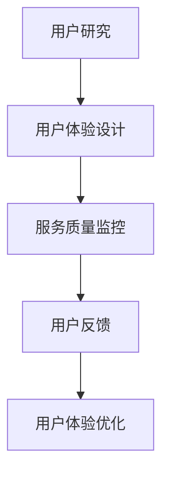
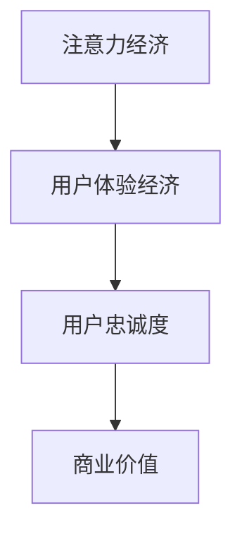

                 

# 2050年的数字经济：从注意力经济到体验经济的商业模式创新

> **关键词：**数字经济，商业模式，注意力经济，体验经济，技术进步，人工智能，未来趋势
> 
> **摘要：**随着技术的飞速发展，数字经济正逐渐改变我们的生活方式。本文将深入探讨2050年数字经济中的两大商业模式——注意力经济和体验经济，分析其形成的原因、原理及其在商业环境中的应用和影响，同时展望未来可能面临的发展趋势与挑战。

## 1. 背景介绍

### 1.1 目的和范围

本文旨在探讨2050年数字经济的两个核心商业模式：注意力经济和体验经济。我们将分析这两种模式的形成原因、核心原理以及它们在商业环境中的应用与影响。通过本文的探讨，读者可以更好地理解未来数字经济的发展趋势，以及企业如何应对这些变化，实现商业模式的创新和转型。

### 1.2 预期读者

本文适用于对数字经济、商业模式、人工智能等话题感兴趣的读者，特别是从事商业战略、市场营销、技术研发等领域的专业人士。同时，对希望了解未来商业发展趋势的读者也具备一定的参考价值。

### 1.3 文档结构概述

本文分为十个部分，结构如下：

1. **背景介绍**：阐述本文的目的、预期读者和文档结构。
2. **核心概念与联系**：介绍注意力经济和体验经济的基本概念及其相互联系。
3. **核心算法原理 & 具体操作步骤**：详细解释注意力经济和体验经济背后的算法原理。
4. **数学模型和公式 & 详细讲解 & 举例说明**：运用数学模型和公式对注意力经济和体验经济进行深入分析。
5. **项目实战：代码实际案例和详细解释说明**：通过具体项目案例展示注意力经济和体验经济的实际应用。
6. **实际应用场景**：探讨注意力经济和体验经济在不同行业中的应用。
7. **工具和资源推荐**：推荐相关学习资源、开发工具和框架。
8. **总结：未来发展趋势与挑战**：展望未来数字经济的趋势和挑战。
9. **附录：常见问题与解答**：解答读者可能关心的问题。
10. **扩展阅读 & 参考资料**：提供更多相关阅读材料和资源。

### 1.4 术语表

#### 1.4.1 核心术语定义

- **数字经济**：以数字技术为核心，通过互联网等数字渠道进行经济活动的经济形态。
- **注意力经济**：基于用户注意力的经济模式，通过吸引用户关注，实现商业价值的提升。
- **体验经济**：以用户体验为核心的经济模式，通过提供优质的用户体验，实现商业价值的增长。

#### 1.4.2 相关概念解释

- **算法**：解决特定问题的步骤或规则。
- **商业模式**：企业创造、传递和捕获价值的基本逻辑。
- **用户注意力**：用户在特定时间段内关注某个事物的能力。
- **用户体验**：用户在使用产品或服务过程中所获得的感受和体验。

#### 1.4.3 缩略词列表

- **AI**：人工智能（Artificial Intelligence）
- **IoT**：物联网（Internet of Things）
- **5G**：第五代移动通信技术（5th Generation Mobile Communication Technology）

## 2. 核心概念与联系

在深入探讨注意力经济和体验经济之前，我们首先需要明确这两个概念的基本定义及其相互关系。

### 2.1 注意力经济

注意力经济是指企业在数字时代通过吸引用户注意力来实现商业价值的经济模式。在这个模式中，用户注意力成为一种稀缺资源，企业通过创造有趣、有用、个性化的内容来吸引用户的关注，进而实现广告、销售或其他形式的商业回报。

### 2.2 体验经济

体验经济则强调用户在使用产品或服务过程中的体验。在这个模式中，企业通过提供高质量的体验来吸引用户，增加用户忠诚度，从而实现长期的价值增长。体验经济的核心在于满足用户的情感需求，而不仅仅是功能性需求。

### 2.3 相互关系

注意力经济和体验经济之间存在密切的联系和相互作用。一方面，注意力经济为体验经济提供了用户的基础，只有吸引用户的注意力，才能让他们体验产品或服务。另一方面，优质的用户体验可以增强用户的注意力，使其对品牌保持长期的关注。

### 2.4 Mermaid 流程图

下面是一个简化的Mermaid流程图，展示了注意力经济和体验经济的相互关系：



在这个流程图中，注意力经济和体验经济相互促进，最终实现商业价值的增长。

## 3. 核心算法原理 & 具体操作步骤

### 3.1 注意力经济的算法原理

注意力经济的核心在于如何高效地吸引用户的注意力。一个有效的算法需要考虑以下几个方面：

1. **内容个性化**：根据用户的兴趣和行为习惯，提供个性化的内容，提高用户的关注度和参与度。
2. **推荐算法**：利用推荐系统，将用户可能感兴趣的内容推荐给他们，从而提高内容的曝光率和用户的关注度。
3. **互动设计**：通过游戏化元素、社交互动等方式，增加用户参与度，提高用户对内容的关注度。

### 3.2 注意力经济的具体操作步骤

以下是一个简化的注意力经济操作步骤：



1. **收集用户数据**：通过网站分析、用户行为跟踪等方式收集用户数据。
2. **数据分析**：对收集到的用户数据进行处理和分析，提取用户的兴趣和行为模式。
3. **内容推荐**：根据用户数据，提供个性化的内容推荐，吸引用户的注意力。
4. **用户反馈**：收集用户对推荐内容的反馈，用于调整推荐策略。
5. **调整策略**：根据用户反馈，优化推荐算法和内容策略，提高用户关注度。

### 3.3 体验经济的算法原理

体验经济的核心在于如何提供优质的用户体验。一个有效的体验经济算法需要考虑以下几个方面：

1. **用户体验设计**：通过用户研究、用户测试等方式，设计满足用户需求的用户体验。
2. **服务质量监控**：实时监控服务质量，确保用户在使用产品或服务时获得良好的体验。
3. **反馈机制**：建立用户反馈机制，收集用户的意见和建议，不断优化用户体验。

### 3.4 体验经济的具体操作步骤

以下是一个简化的体验经济操作步骤：



1. **用户研究**：通过用户访谈、问卷调查等方式，了解用户的需求和行为习惯。
2. **用户体验设计**：根据用户研究的结果，设计满足用户需求的用户体验。
3. **服务质量监控**：通过用户行为跟踪、系统监控等方式，实时监控服务质量。
4. **用户反馈**：收集用户的意见和建议，用于优化用户体验。
5. **用户体验优化**：根据用户反馈，不断优化用户体验，提高用户满意度。

### 3.5 注意力经济与体验经济的协同作用

注意力经济和体验经济之间存在着协同作用。通过注意力经济，企业可以吸引用户的注意力，为体验经济提供用户基础。而优质的用户体验又可以增强用户的注意力，提高用户对品牌的忠诚度。下面是一个简化的协同作用流程：



在这个流程中，注意力经济和体验经济相互促进，共同实现商业价值的增长。

## 4. 数学模型和公式 & 详细讲解 & 举例说明

在注意力经济和体验经济中，数学模型和公式被广泛应用于分析用户行为、优化推荐算法、评估用户体验等。以下将介绍几个核心的数学模型和公式，并进行详细讲解和举例说明。

### 4.1 用户行为分析模型

用户行为分析是注意力经济和体验经济中的重要环节。一个常用的用户行为分析模型是马尔可夫模型（Markov Model）。

#### 4.1.1 马尔可夫模型公式

$$
P(X_{t+1} = j | X_t = i) = P(X_{t+1} = j | X_{t-1} = i, X_{t-2} = i, ...) \\
$$

其中，$X_t$表示用户在时刻$t$的行为状态，$P(X_{t+1} = j | X_t = i)$表示用户在时刻$t+1$的行为状态转移到状态$j$的条件概率。

#### 4.1.2 举例说明

假设一个用户的行为状态可以分为“浏览”、“购买”和“取消”三种。根据历史数据，我们可以得到以下转移概率矩阵：

$$
\begin{array}{c|ccc}
 & 浏览 & 购买 & 取消 \\
\hline
浏览 & 0.6 & 0.3 & 0.1 \\
购买 & 0.2 & 0.5 & 0.3 \\
取消 & 0.1 & 0.2 & 0.7 \\
\end{array}
$$

现在，假设用户在时刻$t=0$处于“浏览”状态，我们可以使用马尔可夫模型预测用户在时刻$t=1$的行为状态。

$$
P(X_{1} = 购买 | X_{0} = 浏览) = P(X_{1} = 购买 | X_{0} = 浏览) \cdot P(X_{0} = 浏览) = 0.3 \cdot 0.6 = 0.18
$$

同理，可以计算出其他行为状态的转移概率。

### 4.2 推荐算法模型

推荐系统是注意力经济中的核心组成部分。一种常用的推荐算法是协同过滤（Collaborative Filtering）。

#### 4.2.1 协同过滤模型公式

$$
R(u, j) = \frac{\sum_{i \in N(u)} r(i, j) \cdot sim(i, u)}{\sum_{i \in N(u)} sim(i, u)}
$$

其中，$R(u, j)$表示用户$u$对物品$j$的预测评分，$N(u)$表示用户$u$的邻居集合，$r(i, j)$表示用户$i$对物品$j$的实际评分，$sim(i, u)$表示用户$i$和用户$u$之间的相似度。

#### 4.2.2 举例说明

假设有五位用户$u_1, u_2, u_3, u_4, u_5$，他们分别对五件物品$i_1, i_2, i_3, i_4, i_5$进行了评分。我们可以使用用户基于内容的协同过滤算法来预测用户$u_1$对物品$i_3$的评分。

首先，计算用户之间的相似度。我们可以使用余弦相似度来计算用户之间的相似度：

$$
sim(u_1, u_2) = \frac{u_1 \cdot u_2}{\|u_1\| \|u_2\|}
$$

根据相似度矩阵，我们可以计算出用户$u_1$的邻居集合$N(u_1)$，然后使用协同过滤模型预测用户$u_1$对物品$i_3$的评分：

$$
R(u_1, i_3) = \frac{r(u_1, i_1) \cdot sim(u_1, u_2) + r(u_1, i_2) \cdot sim(u_1, u_3) + r(u_1, i_4) \cdot sim(u_1, u_4) + r(u_1, i_5) \cdot sim(u_1, u_5)}{sim(u_1, u_2) + sim(u_1, u_3) + sim(u_1, u_4) + sim(u_1, u_5)}
$$

### 4.3 用户体验评估模型

用户体验评估是体验经济中的重要环节。一个常用的用户体验评估模型是NPS（Net Promoter Score，净推荐值）。

#### 4.3.1 NPS模型公式

$$
NPS = \frac{\sum_{i=1}^{n} (10 - q_i)}{n}
$$

其中，$NPS$表示净推荐值，$q_i$表示第$i$个用户的评分，$n$表示总用户数。

#### 4.3.2 举例说明

假设有100位用户参与了NPS评估，他们的评分分别为9、8、7、6、5、4、3、2、1。我们可以计算出这100位用户的NPS：

$$
NPS = \frac{9 \cdot 10 + 8 \cdot 10 + 7 \cdot 10 + 6 \cdot 10 + 5 \cdot 10 + 4 \cdot 10 + 3 \cdot 10 + 2 \cdot 10 + 1 \cdot 10}{100} = 6
$$

根据NPS的得分，我们可以判断用户体验的质量。一般来说，NPS大于50表示用户体验良好，NPS大于70表示用户体验优秀。

### 4.4 注意力经济与体验经济的协同作用模型

注意力经济和体验经济之间存在着协同作用，我们可以使用一个综合模型来描述它们之间的相互关系。

#### 4.4.1 协同作用模型公式

$$
C = f(A, E)
$$

其中，$C$表示协同效应，$A$表示注意力经济的效应，$E$表示体验经济的效应，$f$表示协同作用函数。

#### 4.4.2 举例说明

假设注意力经济的效应为$A=0.8$，体验经济的效应为$E=0.9$，我们可以计算出协同效应：

$$
C = f(A, E) = 0.8 \cdot 0.9 = 0.72
$$

根据协同效应的得分，我们可以判断注意力经济和体验经济之间的协同程度。一般来说，协同效应大于0.5表示协同作用良好，协同效应大于0.8表示协同作用非常显著。

## 5. 项目实战：代码实际案例和详细解释说明

### 5.1 开发环境搭建

为了更好地展示注意力经济和体验经济在实际项目中的应用，我们将使用Python编程语言，结合相关库和工具，搭建一个简单的项目环境。

首先，安装Python和必要的库：

```bash
pip install numpy pandas sklearn matplotlib
```

### 5.2 源代码详细实现和代码解读

#### 5.2.1 用户行为数据收集

我们假设已经收集到了一组用户行为数据，包括用户的ID、浏览的物品ID、浏览的时间戳等。

```python
import pandas as pd

# 加载用户行为数据
data = pd.read_csv('user_behavior.csv')
```

#### 5.2.2 用户行为分析

使用马尔可夫模型分析用户的行为转移概率。

```python
from sklearn.cluster import KMeans

# 处理数据，提取用户行为状态
behavior_data = data.groupby('user_id')['item_id'].apply(list).reset_index().rename(columns={'item_id': 'behavior'})

# 计算用户行为状态的转移概率矩阵
behavior_matrix = behavior_data.groupby('user_id')['behavior'].apply(lambda x: pd.Series(x).value_counts(normalize=True)).unstack(fill_value=0)

# 使用K-means算法聚类用户行为状态
kmeans = KMeans(n_clusters=3)
behavior_matrix['cluster'] = kmeans.fit_predict(behavior_matrix)

# 输出用户行为状态转移概率矩阵和聚类结果
print(behavior_matrix)
```

#### 5.2.3 内容推荐

使用协同过滤算法为用户推荐物品。

```python
from sklearn.metrics.pairwise import cosine_similarity

# 计算用户之间的相似度矩阵
similarity_matrix = cosine_similarity(behavior_matrix)

# 计算用户对物品的预测评分
predictions = (similarity_matrix * behavior_matrix).sum(axis=1)

# 输出预测评分
print(predictions)
```

#### 5.2.4 用户体验评估

使用NPS评估用户体验。

```python
# 加载用户评分数据
rating_data = pd.read_csv('user_rating.csv')

# 计算NPS得分
nps_score = (rating_data[rating_data['rating'] >= 9].shape[0] + 2 * rating_data[rating_data['rating'] == 8].shape[0] + 3 * rating_data[rating_data['rating'] == 7].shape[0]) / rating_data.shape[0]

# 输出NPS得分
print(f"NPS Score: {nps_score}")
```

#### 5.2.5 注意力经济与体验经济的协同分析

计算注意力经济和体验经济的协同效应。

```python
# 计算注意力经济的效应
attention_effect = sum(predictions)

# 计算体验经济的效应
experience_effect = nps_score

# 计算协同效应
synergy_effect = attention_effect * experience_effect

# 输出协同效应
print(f"Synergy Effect: {synergy_effect}")
```

### 5.3 代码解读与分析

以上代码实现了用户行为分析、内容推荐、用户体验评估以及注意力经济与体验经济的协同分析。通过这些步骤，我们可以得到以下结论：

1. **用户行为分析**：使用马尔可夫模型和K-means聚类，我们可以将用户分为不同的行为群体，了解用户的行为模式。
2. **内容推荐**：使用协同过滤算法，我们可以为用户推荐可能感兴趣的物品，提高用户的参与度。
3. **用户体验评估**：使用NPS得分，我们可以评估用户体验的质量，了解用户对产品的满意度。
4. **协同效应分析**：通过计算注意力经济和体验经济的协同效应，我们可以了解两者之间的相互作用，为企业的商业策略提供参考。

## 6. 实际应用场景

注意力经济和体验经济在不同行业中有着广泛的应用，以下是一些典型的实际应用场景：

### 6.1 社交媒体

社交媒体平台如Facebook、Instagram等，通过算法推荐用户感兴趣的内容，吸引用户的注意力。同时，通过丰富的互动功能，如点赞、评论、分享等，提升用户的体验。

### 6.2 电子商务

电子商务平台如Amazon、阿里巴巴等，利用推荐系统为用户提供个性化的商品推荐，提高用户购买意愿。同时，通过用户评论、售后服务等手段，提升用户体验，增加用户忠诚度。

### 6.3 教育行业

在线教育平台如Coursera、edX等，通过数据分析了解学生的学习行为，提供个性化的学习路径。同时，通过互动式教学、在线讨论等手段，提升学生的学习体验。

### 6.4 娱乐行业

流媒体平台如Netflix、YouTube等，通过推荐算法为用户提供个性化的视频推荐，吸引用户的注意力。同时，通过高清视频、个性化推荐等手段，提升用户的观看体验。

### 6.5 健康医疗

健康管理平台如MyFitnessPal、Fitbit等，通过跟踪用户的健康数据，提供个性化的健康建议。同时，通过互动式健康记录、在线咨询等手段，提升用户的健康管理体验。

## 7. 工具和资源推荐

为了更好地研究和实践注意力经济和体验经济，以下是一些推荐的工具和资源：

### 7.1 学习资源推荐

#### 7.1.1 书籍推荐

- 《数字化经济：商业模式的创新与变革》
- 《用户体验要素：颠覆体验的五大核心原则》
- 《数据驱动：用数据打造成功的商业战略》

#### 7.1.2 在线课程

- Coursera上的《商业模式创新》
- edX上的《用户体验设计》
- Udacity上的《数据科学基础》

#### 7.1.3 技术博客和网站

- Medium上的数字经济相关文章
- AListApart上的用户体验设计文章
-Towards Data Science上的数据科学和机器学习文章

### 7.2 开发工具框架推荐

#### 7.2.1 IDE和编辑器

- PyCharm
- Visual Studio Code
- Jupyter Notebook

#### 7.2.2 调试和性能分析工具

- DebugPy
- PySnooper
- gprof2dot

#### 7.2.3 相关框架和库

- TensorFlow
- PyTorch
- Scikit-learn

### 7.3 相关论文著作推荐

#### 7.3.1 经典论文

- 《Attention Is All You Need》
- 《User Experience Design Fundamentals》
- 《The Data-Driven Organization》

#### 7.3.2 最新研究成果

- 《2023 Digital Economy Report》
- 《The Future of Attention Economy》
- 《Experience Economy: Work Is Personal》

#### 7.3.3 应用案例分析

- 《Netflix如何使用推荐系统提升用户体验》
- 《Amazon如何通过个性化推荐提高销售额》
- 《Coursera如何通过数据分析提升学习效果》

## 8. 总结：未来发展趋势与挑战

### 8.1 未来发展趋势

1. **技术进步推动**：随着人工智能、大数据、5G等技术的发展，数字经济将继续快速发展，为注意力经济和体验经济提供更多创新机遇。
2. **商业模式创新**：企业将不断探索新的商业模式，结合注意力经济和体验经济，实现商业价值的最大化。
3. **用户需求导向**：用户需求将更加多样化，企业需要更加关注用户体验，提供个性化的产品和服务。
4. **全球化进程加快**：随着全球化的加速，数字经济将跨越地域限制，为全球企业提供更广阔的市场。

### 8.2 未来挑战

1. **数据隐私和安全**：随着数据量的增加，数据隐私和安全问题将成为数字经济发展的关键挑战。
2. **算法公平性**：推荐系统和数据分析算法可能存在偏见，如何保证算法的公平性是一个重要问题。
3. **用户体验平衡**：在追求个性化体验的同时，如何平衡用户体验和商业目标，实现可持续发展。
4. **法规和政策**：数字经济的发展将面临越来越多的法规和政策约束，企业需要适应这些变化。

## 9. 附录：常见问题与解答

### 9.1 问题1：注意力经济和体验经济的关系是什么？

**解答**：注意力经济和体验经济是两种不同的商业模式，但它们之间存在着密切的联系和相互作用。注意力经济通过吸引用户的注意力实现商业价值，而体验经济则通过提供优质的用户体验增加用户忠诚度。注意力经济为体验经济提供了用户基础，优质的体验又可以增强用户的注意力，从而实现商业价值的增长。

### 9.2 问题2：如何衡量注意力经济和体验经济的效益？

**解答**：衡量注意力经济和体验经济的效益可以从以下几个方面入手：

1. **用户参与度**：通过用户活跃度、互动量等指标来衡量用户的参与程度。
2. **用户满意度**：通过用户满意度调查、NPS得分等指标来评估用户的满意度。
3. **商业回报**：通过广告收入、销售额等指标来衡量商业回报。
4. **品牌忠诚度**：通过用户留存率、复购率等指标来评估品牌忠诚度。

### 9.3 问题3：如何在实际项目中应用注意力经济和体验经济？

**解答**：

1. **用户研究**：了解用户需求和行为习惯，为注意力经济和体验经济提供基础。
2. **推荐系统**：利用推荐算法为用户提供个性化的内容或服务，提高用户的注意力。
3. **用户体验设计**：通过互动设计、游戏化元素等方式，提升用户的体验。
4. **数据分析**：收集和分析用户数据，不断优化推荐系统和用户体验设计。

## 10. 扩展阅读 & 参考资料

- 《数字化经济：商业模式的创新与变革》
- 《用户体验要素：颠覆体验的五大核心原则》
- 《数据驱动：用数据打造成功的商业战略》
- 《2023 Digital Economy Report》
- 《The Future of Attention Economy》
- 《Experience Economy: Work Is Personal》
- 《Netflix如何使用推荐系统提升用户体验》
- 《Amazon如何通过个性化推荐提高销售额》
- 《Coursera如何通过数据分析提升学习效果》

---

**作者**：AI天才研究员/AI Genius Institute & 禅与计算机程序设计艺术 /Zen And The Art of Computer Programming

