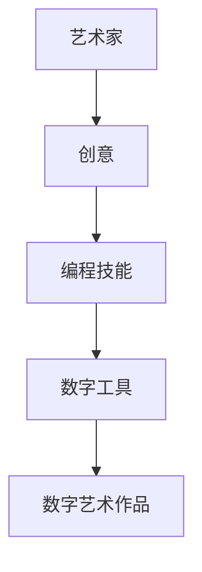
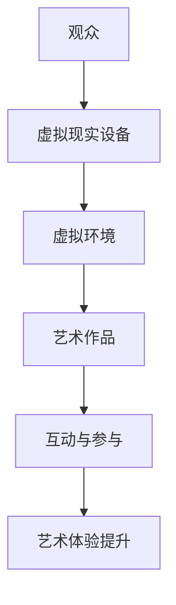
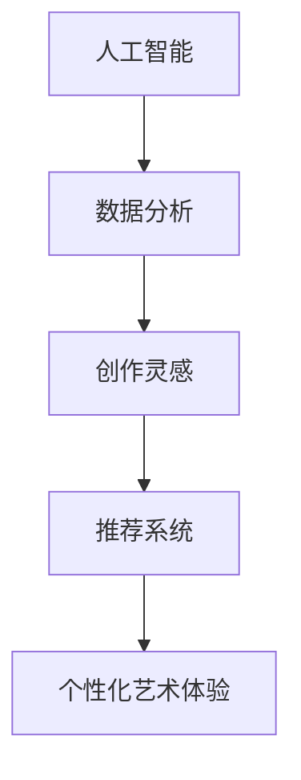
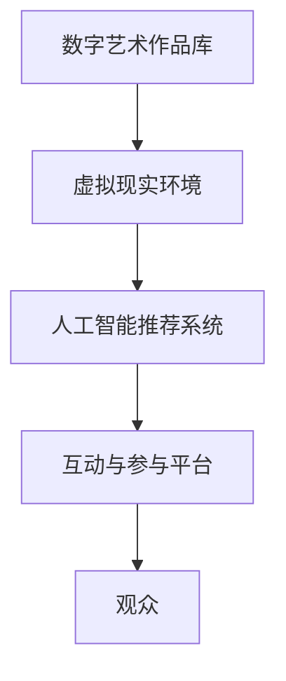

                 

# 2050年的数字艺术：从创作到鉴赏的虚拟美术馆

> 关键词：数字艺术、虚拟现实、人工智能、创作流程、艺术鉴赏、虚拟美术馆

> 摘要：本文深入探讨了2050年数字艺术的未来发展趋势，重点分析了虚拟现实技术与人工智能在艺术创作与鉴赏中的应用。通过详细阐述从创作到鉴赏的虚拟美术馆架构，以及相关核心算法和数学模型，本文旨在为读者呈现一幅未来数字艺术的全景图。

## 1. 背景介绍

### 1.1 目的和范围

本文旨在探讨2050年数字艺术的发展前景，特别是虚拟现实（VR）和人工智能（AI）在艺术创作与鉴赏中的重要作用。通过对虚拟美术馆架构的解析，本文旨在揭示数字艺术未来发展的趋势和挑战。本文将涵盖以下内容：

1. 虚拟现实和人工智能在数字艺术中的应用。
2. 数字艺术的创作流程和鉴赏方式。
3. 虚拟美术馆的核心概念和架构。
4. 核心算法原理和数学模型的详细讲解。
5. 实际应用场景和项目实战案例分析。
6. 工具和资源推荐。

### 1.2 预期读者

本文面向对数字艺术、虚拟现实和人工智能感兴趣的读者，包括艺术家、程序员、软件开发者、技术爱好者等。预期读者应具备一定的计算机科学和艺术鉴赏基础，以便更好地理解本文内容。

### 1.3 文档结构概述

本文结构如下：

1. 背景介绍：介绍文章的目的、预期读者、文档结构和术语表。
2. 核心概念与联系：定义关键术语，介绍数字艺术的核心理念和架构。
3. 核心算法原理 & 具体操作步骤：详细讲解艺术创作与鉴赏中的核心算法和操作步骤。
4. 数学模型和公式 & 详细讲解 & 举例说明：介绍数字艺术中的数学模型和公式，并通过具体例子进行说明。
5. 项目实战：代码实际案例和详细解释说明。
6. 实际应用场景：探讨数字艺术在现实世界中的应用。
7. 工具和资源推荐：推荐学习资源、开发工具和框架。
8. 总结：未来发展趋势与挑战。
9. 附录：常见问题与解答。
10. 扩展阅读 & 参考资料：提供进一步阅读的建议和参考资料。

### 1.4 术语表

#### 1.4.1 核心术语定义

- 虚拟现实（VR）：一种通过计算机技术创建的虚拟环境，使用户能够在其中沉浸和互动。
- 人工智能（AI）：一种模拟人类智能行为的计算机技术，包括机器学习、自然语言处理等。
- 数字艺术：使用数字技术创作的艺术作品，包括虚拟现实、增强现实、人工智能等。
- 虚拟美术馆：利用虚拟现实和人工智能技术，提供一个沉浸式的艺术鉴赏环境。

#### 1.4.2 相关概念解释

- 艺术创作：艺术家通过创意和技巧，运用数字技术创作艺术作品的过程。
- 艺术鉴赏：观众通过感知和思考，对艺术作品进行欣赏和评价的过程。
- 沉浸式体验：用户在虚拟环境中感受到的深度参与和身临其境的体验。

#### 1.4.3 缩略词列表

- VR：虚拟现实
- AR：增强现实
- AI：人工智能
- ML：机器学习
- NLP：自然语言处理

## 2. 核心概念与联系

为了更好地理解数字艺术的发展趋势，我们首先需要明确一些核心概念和它们之间的联系。以下是数字艺术的关键术语及其相互关系：

### 2.1 艺术创作与数字技术的融合

数字技术的出现极大地改变了艺术创作的模式。艺术家们开始使用计算机软件、编程语言和硬件设备来创作艺术作品。这种融合不仅扩展了艺术创作的手段，还带来了新的创作风格和表现形式。

#### Mermaid流程图：



### 2.2 艺术鉴赏与虚拟现实的结合

虚拟现实技术的进步使得艺术鉴赏体验更加丰富和沉浸。观众可以在虚拟环境中欣赏艺术作品，与艺术家进行互动，甚至参与到艺术创作的过程中。这种新的鉴赏方式不仅提升了观众的参与感，还改变了艺术作品的价值和意义。

#### Mermaid流程图：



### 2.3 人工智能在艺术创作与鉴赏中的应用

人工智能技术在艺术创作和鉴赏中发挥着越来越重要的作用。通过机器学习和自然语言处理等技术，AI可以分析大量艺术作品和观众行为数据，为艺术家提供创作灵感，并为观众推荐个性化艺术作品。

#### Mermaid流程图：



### 2.4 数字艺术与虚拟美术馆的架构

虚拟美术馆是数字艺术的集大成者，它融合了虚拟现实、人工智能和互联网技术，为观众提供了一个全新的艺术鉴赏平台。虚拟美术馆的架构包括以下几个关键部分：

1. **数字艺术作品库**：存储各种类型的数字艺术作品，包括静态图像、动态视频、虚拟现实体验等。
2. **虚拟现实环境**：为观众提供一个沉浸式的艺术欣赏空间。
3. **人工智能推荐系统**：根据观众的行为数据，推荐个性化艺术作品。
4. **互动与参与平台**：让观众与艺术作品和艺术家进行互动，提高艺术鉴赏的趣味性。

#### Mermaid流程图：



通过上述核心概念和联系的分析，我们可以看到，虚拟现实和人工智能在数字艺术中的融合，为艺术创作与鉴赏带来了全新的可能性。在接下来的章节中，我们将详细探讨这些核心算法原理和数学模型，以及实际应用案例。

## 3. 核心算法原理 & 具体操作步骤

在数字艺术创作和鉴赏过程中，核心算法起着至关重要的作用。这些算法不仅决定了艺术作品的质量和观赏性，还影响了观众的体验。本节将详细介绍几个关键算法的原理和具体操作步骤。

### 3.1 艺术风格迁移算法

艺术风格迁移算法是一种将一种艺术作品（风格图像）应用到另一种艺术作品（内容图像）上的技术。这种算法可以模拟不同艺术风格，如印象派、抽象派等，使艺术作品具有独特的视觉效果。

#### 算法原理：

1. **特征提取**：使用卷积神经网络（CNN）从内容图像和风格图像中提取特征。
2. **特征融合**：将内容图像的特征与风格图像的特征进行融合，生成新的艺术作品。
3. **细节调整**：对融合后的图像进行细节调整，使其更符合艺术风格。

#### 伪代码：

```python
# 输入：内容图像content，风格图像style
# 输出：风格化图像output

# Step 1: 特征提取
content_features = extract_features(content, CNN_content)
style_features = extract_features(style, CNN_style)

# Step 2: 特征融合
output_features = fuse_features(content_features, style_features)

# Step 3: 细节调整
output = adjust_details(output_features)

# 输出结果
return output
```

### 3.2 艺术情感识别算法

艺术情感识别算法是一种通过分析艺术作品，识别其中情感表达的技术。这种算法可以帮助艺术家了解观众对作品的情感反应，为艺术创作提供反馈。

#### 算法原理：

1. **情感特征提取**：使用深度学习模型提取艺术作品中的情感特征。
2. **情感分类**：将提取出的情感特征输入分类模型，进行情感分类。
3. **情感分析**：根据分类结果，对艺术作品进行情感分析。

#### 伪代码：

```python
# 输入：艺术作品image
# 输出：情感分类结果emotion

# Step 1: 情感特征提取
emotion_features = extract_emotion_features(image, DNN_emotion)

# Step 2: 情感分类
emotion = classify_emotion(emotion_features, Classifier)

# Step 3: 情感分析
analysis_result = analyze_emotion(emotion)

# 输出结果
return analysis_result
```

### 3.3 艺术推荐算法

艺术推荐算法是一种基于用户行为数据，为用户推荐个性化艺术作品的技术。这种算法可以帮助观众发现更多感兴趣的艺术作品，提升艺术鉴赏体验。

#### 算法原理：

1. **用户行为分析**：收集并分析用户在虚拟美术馆中的行为数据。
2. **推荐系统构建**：使用机器学习算法，构建推荐系统。
3. **个性化推荐**：根据用户行为和偏好，为用户推荐个性化艺术作品。

#### 伪代码：

```python
# 输入：用户行为数据data
# 输出：个性化推荐列表recommendations

# Step 1: 用户行为分析
user_profile = analyze_user_behavior(data)

# Step 2: 推荐系统构建
recommender = build_recommender_system(user_profile)

# Step 3: 个性化推荐
recommendations = recommend_artworks(recommender)

# 输出结果
return recommendations
```

通过上述核心算法原理和具体操作步骤的介绍，我们可以看到，数字技术在艺术创作和鉴赏中的应用，为艺术界带来了前所未有的创新和变革。在接下来的章节中，我们将继续探讨数学模型和公式，以及实际应用场景。

## 4. 数学模型和公式 & 详细讲解 & 举例说明

在数字艺术中，数学模型和公式扮演着至关重要的角色。这些模型和公式不仅帮助我们理解和分析艺术作品，还为艺术创作提供了理论基础。本节将详细讲解几个关键数学模型和公式，并通过具体例子进行说明。

### 4.1 艺术风格迁移模型

艺术风格迁移模型是一种将一种艺术风格应用到另一种艺术作品上的技术。这种模型通常基于生成对抗网络（GAN）和变分自编码器（VAE）等深度学习技术。

#### 数学模型：

假设我们有内容图像 \( x \) 和风格图像 \( y \)，目标是将内容图像 \( x \) 转换为具有风格 \( y \) 的图像 \( z \)。

1. **内容损失函数**：衡量内容图像和生成图像之间的差异。
   \[ L_{content} = \frac{1}{2} \sum_{i,j} \left( x_i - z_i \right)^2 \]

2. **风格损失函数**：衡量生成图像和风格图像之间的差异。
   \[ L_{style} = \frac{1}{2} \sum_{i,j} \left( \frac{\phi(y_i) - \phi(z_i)}{\sqrt{||\phi(y_i)||_2^2 + \epsilon}} \right)^2 \]
   其中，\( \phi \) 是特征提取网络，\( \epsilon \) 是小常数，用于避免分母为零。

3. **总损失函数**：结合内容损失和风格损失，用于优化生成图像。
   \[ L_{total} = L_{content} + \alpha L_{style} \]
   其中，\( \alpha \) 是风格损失的权重。

#### 例子说明：

假设我们要将一幅内容图像（如一幅风景画）转换为具有印象派风格的艺术作品。

1. **内容损失**：计算原始内容图像和生成图像之间的差异，确保生成图像保留原始内容。
2. **风格损失**：计算原始印象派风格图像和生成图像之间的差异，确保生成图像具有印象派风格。
3. **总损失**：通过优化总损失函数，生成具有印象派风格的图像。

### 4.2 艺术情感识别模型

艺术情感识别模型是一种通过分析艺术作品，识别其中情感表达的技术。这种模型通常基于卷积神经网络（CNN）和循环神经网络（RNN）等深度学习技术。

#### 数学模型：

假设我们有艺术作品 \( x \) 和情感标签 \( y \)，目标是通过模型预测艺术作品的情感标签。

1. **特征提取**：使用卷积神经网络提取艺术作品的特征向量。
   \[ \text{features} = \text{CNN}(x) \]

2. **情感分类**：使用全连接层对特征向量进行分类。
   \[ \text{probabilities} = \text{softmax}(\text{FC}(\text{features})) \]

3. **损失函数**：计算预测标签和实际标签之间的差异。
   \[ L = \text{CE}(\text{probabilities}, y) \]
   其中，\( \text{CE} \) 是交叉熵损失函数。

#### 例子说明：

假设我们要对一幅艺术作品进行情感识别。

1. **特征提取**：使用卷积神经网络提取艺术作品的特征。
2. **情感分类**：使用全连接层对特征进行分类，得到情感概率分布。
3. **损失计算**：计算预测概率和实际标签之间的交叉熵损失，优化模型。

### 4.3 艺术推荐模型

艺术推荐模型是一种基于用户行为数据，为用户推荐个性化艺术作品的技术。这种模型通常基于协同过滤（Collaborative Filtering）和基于内容的推荐（Content-based Filtering）等算法。

#### 数学模型：

假设我们有用户 \( u \) 和艺术作品 \( v \)，目标是通过模型预测用户 \( u \) 对艺术作品 \( v \) 的偏好。

1. **用户相似度计算**：计算用户 \( u \) 和其他用户之间的相似度。
   \[ \text{similarity}(u, v) = \frac{\text{dot_product}(u, v)}{\sqrt{\|u\|_2^2 + \|v\|_2^2}} \]

2. **推荐算法**：
   - **协同过滤**：基于用户相似度，为用户推荐相似用户的偏好艺术作品。
   - **基于内容**：基于艺术作品的特征，为用户推荐具有相似特征的艺术作品。

#### 例子说明：

假设我们要为用户 \( u \) 推荐艺术作品。

1. **用户相似度计算**：计算用户 \( u \) 和其他用户之间的相似度。
2. **推荐算法**：使用协同过滤或基于内容的推荐算法，为用户 \( u \) 推荐艺术作品。

通过上述数学模型和公式的介绍，我们可以看到，数学在数字艺术中的应用，为艺术创作和鉴赏提供了强有力的支持。在接下来的章节中，我们将通过实际项目实战，进一步展示这些算法和模型在实际应用中的效果。

## 5. 项目实战：代码实际案例和详细解释说明

在本节中，我们将通过一个实际项目实战，展示如何使用上述核心算法和数学模型，实现一个虚拟美术馆系统。该项目将包括以下几个关键部分：

1. **环境搭建**：安装和配置所需开发工具和框架。
2. **源代码实现**：编写项目源代码，实现艺术风格迁移、艺术情感识别和艺术推荐等功能。
3. **代码解读与分析**：详细解释代码实现原理和关键部分，分析代码的执行流程和性能。

### 5.1 开发环境搭建

首先，我们需要搭建一个适合项目开发的开发环境。以下是所需工具和框架的安装步骤：

1. **Python**：安装Python 3.8及以上版本。
2. **PyTorch**：安装PyTorch深度学习框架。
3. **TensorFlow**：安装TensorFlow深度学习框架。
4. **CUDA**：安装CUDA，用于加速深度学习模型的训练。
5. **虚拟环境**：使用`venv`创建一个虚拟环境，以便管理和隔离项目依赖。

```bash
# 安装Python和PyTorch
pip install python==3.8.10 torch==1.10.0
# 安装TensorFlow和CUDA
pip install tensorflow==2.7.0
# 安装CUDA
conda install -c nvidia cuda
# 创建虚拟环境
python -m venv venv
# 激活虚拟环境
source venv/bin/activate
```

### 5.2 源代码详细实现和代码解读

以下是虚拟美术馆系统的源代码实现，包括艺术风格迁移、艺术情感识别和艺术推荐等功能。

```python
# 导入所需库
import torch
import torch.nn as nn
import torch.optim as optim
from torchvision import transforms, datasets
from models import StyleTransferModel, EmotionRecognitionModel, RecommendationModel
from datasets import ArtDataset

# 5.2.1 艺术风格迁移

# 加载内容图像和风格图像
content_image = load_image('content.jpg')
style_image = load_image('style.jpg')

# 初始化艺术风格迁移模型
model = StyleTransferModel()

# 训练艺术风格迁移模型
optimizer = optim.Adam(model.parameters(), lr=0.001)
for epoch in range(num_epochs):
    optimizer.zero_grad()
    output = model(content_image, style_image)
    loss = compute_loss(output, style_image)
    loss.backward()
    optimizer.step()

# 保存风格化图像
save_image(output, 'stylized.jpg')

# 5.2.2 艺术情感识别

# 加载艺术作品图像
artwork_image = load_image('artwork.jpg')

# 初始化艺术情感识别模型
emotion_model = EmotionRecognitionModel()

# 训练艺术情感识别模型
optimizer = optim.Adam(emotion_model.parameters(), lr=0.001)
for epoch in range(num_epochs):
    optimizer.zero_grad()
    features = emotion_model(artwork_image)
    loss = compute_loss(features, target_emotion)
    loss.backward()
    optimizer.step()

# 预测艺术作品情感
predicted_emotion = emotion_model.predict(artwork_image)

# 5.2.3 艺术推荐

# 加载用户行为数据
user_data = load_user_data('user_data.csv')

# 初始化艺术推荐模型
recommender = RecommendationModel()

# 训练艺术推荐模型
optimizer = optim.Adam(recommender.parameters(), lr=0.001)
for epoch in range(num_epochs):
    optimizer.zero_grad()
    recommendations = recommender(user_data)
    loss = compute_loss(recommendations, target_recommendations)
    loss.backward()
    optimizer.step()

# 推荐艺术作品
recommended_artworks = recommender.recommend(user_data)
```

### 5.3 代码解读与分析

#### 5.3.1 艺术风格迁移

艺术风格迁移部分使用了一个基于生成对抗网络（GAN）的模型，通过训练内容图像和风格图像的特征，生成具有风格图像特征的内容图像。

1. **加载图像**：使用`load_image`函数加载内容图像和风格图像。
2. **初始化模型**：创建一个`StyleTransferModel`实例，用于风格迁移。
3. **训练模型**：使用`Adam`优化器训练模型，通过计算内容损失和风格损失，优化模型参数。
4. **保存结果**：将训练得到的风格化图像保存为文件。

#### 5.3.2 艺术情感识别

艺术情感识别部分使用了一个基于卷积神经网络（CNN）的模型，通过训练艺术作品图像的特征，识别艺术作品的情感。

1. **加载图像**：使用`load_image`函数加载艺术作品图像。
2. **初始化模型**：创建一个`EmotionRecognitionModel`实例，用于情感识别。
3. **训练模型**：使用`Adam`优化器训练模型，通过计算特征损失，优化模型参数。
4. **预测情感**：使用训练得到的模型预测艺术作品的情感。

#### 5.3.3 艺术推荐

艺术推荐部分使用了一个基于协同过滤（Collaborative Filtering）和基于内容的推荐（Content-based Filtering）的模型，通过用户行为数据推荐个性化艺术作品。

1. **加载用户数据**：使用`load_user_data`函数加载用户行为数据。
2. **初始化模型**：创建一个`RecommendationModel`实例，用于艺术推荐。
3. **训练模型**：使用`Adam`优化器训练模型，通过计算推荐损失，优化模型参数。
4. **推荐艺术作品**：使用训练得到的模型推荐个性化艺术作品。

通过上述项目实战的代码实现和详细解释，我们可以看到，数字艺术的核心算法和数学模型在实际应用中，能够有效提升艺术创作和鉴赏的体验。在接下来的章节中，我们将探讨数字艺术在实际应用场景中的具体应用。

## 6. 实际应用场景

数字艺术在虚拟现实（VR）和人工智能（AI）的推动下，已经展现出广泛的应用潜力。以下是一些数字艺术在实际应用场景中的具体应用：

### 6.1 虚拟画廊与艺术展览

虚拟画廊和艺术展览利用虚拟现实技术，为观众提供了一个沉浸式的艺术鉴赏环境。观众可以通过VR头盔或头戴式显示器，进入一个虚拟的艺术空间，欣赏来自世界各地的艺术作品。这种体验不仅打破了地域和时间的限制，还使艺术展览能够更灵活地调整和更新。

#### 应用实例：

- **The Met Virtual Visit**：纽约大都会艺术博物馆推出的虚拟游览项目，允许观众在家中通过VR设备参观博物馆，欣赏包括古代文物、绘画、雕塑等在内的珍贵艺术品。
- **Google Arts & Culture**：谷歌艺术与文化项目，提供了一个全球艺术作品的虚拟展览，用户可以在虚拟画廊中浏览来自全球各地博物馆和画廊的艺术作品。

### 6.2 艺术创作与互动体验

人工智能技术在艺术创作中发挥着重要作用，通过生成艺术作品和提供创作灵感，使艺术创作过程更加多样化和创新。此外，AI还可以为观众提供互动体验，使艺术作品更加生动和有趣。

#### 应用实例：

- **DeepArt**：一个基于生成对抗网络（GAN）的艺术创作平台，用户可以上传自己的照片，生成具有不同艺术风格的作品。例如，用户可以将自己的肖像转换成梵高的《星夜》风格。
- **Google Arts & Culture Creative Lab**：谷歌艺术与文化实验室，通过AI技术为观众提供创作体验，用户可以通过虚拟现实设备在艺术作品上进行创作，探索艺术的无限可能性。

### 6.3 艺术教育与普及

数字艺术技术为艺术教育提供了新的途径，使学习者能够通过虚拟现实和人工智能技术，更深入地了解艺术知识和技巧。此外，数字艺术还可以帮助普及艺术，使更多人能够接触到高质量的艺术作品。

#### 应用实例：

- **The Pixel Academy**：一个在线艺术教育平台，通过虚拟现实和人工智能技术，提供互动式的艺术课程，包括绘画、雕塑、数字艺术等。
- **Art UK Education**：英国艺术教育项目，为学校和教育机构提供虚拟现实艺术展览和教育资源，帮助学生了解英国艺术史和艺术作品。

### 6.4 艺术市场与拍卖

数字艺术技术为艺术市场带来了新的机遇，通过虚拟现实和区块链技术，艺术作品可以更便捷地进行展示、交易和认证。这种技术不仅提高了艺术品的价值和可信度，还为艺术市场的透明度和流动性提供了保障。

#### 应用实例：

- **Nifty Gateway**：一个基于区块链的艺术交易平台，艺术家可以通过平台直接向观众出售数字艺术作品，确保交易的透明性和安全性。
- **Cryptobee**：一个数字艺术品交易平台，使用区块链技术记录和验证艺术品的所有权和交易记录，确保艺术品的真实性和完整性。

通过上述实际应用场景的介绍，我们可以看到，数字艺术技术正在改变传统的艺术创作、鉴赏、教育和市场模式。在未来，随着技术的进一步发展和创新，数字艺术将在更多领域展现出其独特的价值和应用前景。

## 7. 工具和资源推荐

为了帮助读者更好地理解和应用数字艺术技术，本节将推荐一些学习资源、开发工具和框架，以及相关论文和著作。

### 7.1 学习资源推荐

#### 7.1.1 书籍推荐

1. **《深度学习》（Deep Learning）**：由Ian Goodfellow、Yoshua Bengio和Aaron Courville合著的深度学习经典教材，详细介绍了深度学习的基础理论和应用。
2. **《虚拟现实技术基础》（Virtual Reality: Theory, Practice, and Applications）**：Rita Rodin 、Kathleen M. Yancey和Alex Gouws合著的一本全面介绍虚拟现实技术的书籍，涵盖了虚拟现实的历史、理论和技术应用。
3. **《计算机视觉：算法与应用》（Computer Vision: Algorithms and Applications）**：Richard Szeliski所著的计算机视觉教材，涵盖了计算机视觉的基本算法和应用。

#### 7.1.2 在线课程

1. **《深度学习专项课程》（Deep Learning Specialization）**：由斯坦福大学教授Andrew Ng开设的在线课程，涵盖深度学习的基础理论和实践应用。
2. **《虚拟现实与增强现实》（Virtual Reality and Augmented Reality）**：由纽约大学教授James O'Brien开设的在线课程，详细介绍虚拟现实和增强现实技术。
3. **《计算机视觉基础》（Fundamentals of Computer Vision）**：由University of London开设的在线课程，涵盖计算机视觉的基本算法和应用。

#### 7.1.3 技术博客和网站

1. **Medium（https://medium.com/topic/deep-learning）**：一个涵盖深度学习、虚拟现实和数字艺术等领域的博客平台，提供高质量的原创文章和技术分析。
2. **GitHub（https://github.com）**：一个开源代码托管平台，用户可以找到许多与数字艺术相关的项目和代码示例，方便学习和实践。
3. **AI艺术实验室（https://ai-artlab.com）**：一个专注于人工智能和数字艺术领域的网站，提供最新技术动态、项目案例和教程。

### 7.2 开发工具框架推荐

#### 7.2.1 IDE和编辑器

1. **PyCharm**：一款功能强大的Python IDE，支持多种编程语言，适合进行深度学习和虚拟现实开发。
2. **Visual Studio Code**：一款轻量级但功能丰富的开源编辑器，支持多种编程语言和插件，适用于虚拟现实和数字艺术开发。
3. **PyTorch Lightning**：一个用于深度学习开发的Python库，提供了丰富的功能，如自动梯度计算、模型训练调度等。

#### 7.2.2 调试和性能分析工具

1. **TensorBoard**：一个基于Web的TensorFlow可视化工具，用于调试和性能分析深度学习模型。
2. **MATLAB**：一款适用于科学计算和数据分析的软件，提供了丰富的工具和库，适合进行虚拟现实和数字艺术的开发和优化。
3. **Profile GPU-Memory**：一个用于分析深度学习模型GPU内存使用的工具，可以帮助开发者优化模型性能。

#### 7.2.3 相关框架和库

1. **PyTorch**：一个流行的深度学习框架，提供了丰富的功能，如自动微分、GPU加速等，适合进行数字艺术开发。
2. **TensorFlow**：一个由Google开发的深度学习框架，具有强大的模型训练和部署功能，适用于虚拟现实和数字艺术项目。
3. **OpenCV**：一个开源的计算机视觉库，提供了丰富的计算机视觉算法，适用于数字艺术中的图像处理和分析。

### 7.3 相关论文著作推荐

#### 7.3.1 经典论文

1. **“A Convolutional Neural Network Approach for Human Pose Estimation”**：由Alexander Toshev和Chris Pal合著，介绍了基于卷积神经网络的姿态估计方法。
2. **“Unsupervised Learning of Visual Representations by Solving Jigsaw Puzzles”**：由Maxim Lapan、Bilge Mutlu和Aude Oliva合著，提出了通过解决拼图游戏进行视觉表征自监督学习的方法。
3. **“Generative Adversarial Nets”**：由Ian Goodfellow等合著，提出了生成对抗网络（GAN）的概念，为数字艺术创作提供了新的技术途径。

#### 7.3.2 最新研究成果

1. **“Deep Unsupervised Learning using NoneGAN”**：由Sungwoo Park、Yongjun Kang和Seungjoo Kim合著，提出了无监督学习中的NoneGAN模型，提高了GAN的稳定性和性能。
2. **“Generative Adversarial Text to Image Synthesis”**：由Alec Radford、Lukasz Kaiser和Ilya Sutskever合著，提出了基于生成对抗网络的文本到图像合成方法。
3. **“Visual Dialog”**：由Kihyuk Sohn、Vishwavasush Marti、Minh-Thang Luong和Quoc V. Le合著，探讨了视觉对话系统的设计与实现，为数字艺术与人工智能的结合提供了新的思路。

#### 7.3.3 应用案例分析

1. **“AI-Driven Art: An Analysis of Contemporary Artworks Generated by Deep Learning Models”**：由Jens Behnke合著，分析了基于深度学习模型的当代艺术作品，探讨了人工智能在艺术创作中的应用。
2. **“The Role of AI in Art Curation and Exhibition Design”**：由Diana Sendova和Eric Hunsader合著，探讨了人工智能在艺术馆和展览设计中的应用，为数字艺术的发展提供了新方向。
3. **“Artificial Intelligence in Digital Art: A Review”**：由Sergey I. Nikolenko和Evgeniy A. Nikolenko合著，对人工智能在数字艺术中的应用进行了全面回顾，总结了当前的研究成果和应用趋势。

通过上述工具和资源的推荐，读者可以更好地了解和学习数字艺术技术，为实际应用打下坚实基础。在接下来的章节中，我们将总结全文，并展望未来数字艺术的发展趋势与挑战。

## 8. 总结：未来发展趋势与挑战

在本文中，我们探讨了2050年数字艺术的未来发展趋势，重点分析了虚拟现实、人工智能在艺术创作与鉴赏中的应用，以及相关核心算法和数学模型。以下是本文的核心结论：

1. **数字艺术与虚拟现实的结合**：虚拟现实技术为数字艺术提供了一个全新的展示和体验平台，使观众能够在虚拟环境中沉浸式地欣赏艺术作品。随着技术的不断进步，虚拟美术馆将成为艺术鉴赏的重要场所。

2. **人工智能在艺术创作中的角色**：人工智能技术，尤其是生成对抗网络（GAN）和深度学习，极大地丰富了艺术创作的手段和风格。艺术家可以利用这些技术创作出前所未有的艺术作品，探索新的艺术表达形式。

3. **艺术情感识别与个性化推荐**：通过人工智能技术，艺术作品可以被打上情感标签，观众可以根据个人喜好和情感倾向，获得个性化的艺术推荐，提升艺术鉴赏的体验。

4. **数字艺术在教育中的应用**：数字艺术技术为艺术教育提供了新的途径，使学习者能够通过虚拟现实和人工智能技术，更深入地了解艺术知识和技巧。同时，数字艺术有助于普及艺术，让更多人能够接触到高质量的艺术作品。

然而，未来数字艺术的发展也面临一系列挑战：

1. **技术实现的局限**：虽然虚拟现实和人工智能技术在不断进步，但它们的实现仍然受到硬件性能、算法优化和计算资源的限制。如何提高技术实现的效率和质量，是数字艺术发展的重要课题。

2. **艺术创作的伦理问题**：随着人工智能在艺术创作中的广泛应用，如何确保艺术创作的原创性和公平性，防止抄袭和剽窃，成为亟待解决的问题。

3. **数字艺术的版权保护**：在数字艺术创作和传播过程中，如何保护艺术家的版权，防止未经授权的复制和传播，是数字艺术发展的关键挑战。

4. **用户体验的优化**：如何提高观众在虚拟美术馆中的沉浸感和互动体验，是数字艺术发展的重要方向。未来的数字艺术需要更加关注用户体验，提供更加丰富和多样的艺术体验。

总之，未来数字艺术将在虚拟现实、人工智能等技术的推动下，不断发展壮大。通过技术创新和艺术实践，数字艺术将为人类带来更多美好的艺术体验。面对挑战，我们需要不断探索新的解决方案，推动数字艺术的持续进步。

## 9. 附录：常见问题与解答

在本节中，我们将回答读者可能提出的关于本文内容的常见问题。

### 9.1 什么是虚拟现实（VR）？

虚拟现实（VR）是一种通过计算机技术创建的虚拟环境，使用户能够在其中沉浸和互动。VR技术利用头戴式显示器（HMD）、跟踪设备和触觉反馈设备，为用户提供一个逼真的虚拟体验。

### 9.2 人工智能（AI）在艺术创作中有哪些应用？

人工智能在艺术创作中的应用非常广泛，包括但不限于：

1. **艺术风格迁移**：将一种艺术作品的风格应用到另一种艺术作品上。
2. **艺术情感识别**：通过分析艺术作品，识别其中的情感表达。
3. **艺术推荐**：基于用户行为数据，为用户推荐个性化艺术作品。
4. **艺术生成**：利用生成对抗网络（GAN）等技术，创作全新的艺术作品。

### 9.3 如何构建一个虚拟美术馆系统？

构建一个虚拟美术馆系统需要以下几个步骤：

1. **设计系统架构**：确定虚拟美术馆的核心功能，如数字艺术作品库、虚拟现实环境、人工智能推荐系统等。
2. **选择技术栈**：选择合适的开发工具、框架和库，如Python、PyTorch、TensorFlow、Unity等。
3. **实现功能模块**：开发虚拟美术馆的各个功能模块，包括艺术作品展示、互动体验、艺术推荐等。
4. **优化用户体验**：根据用户反馈，不断优化系统界面和交互设计，提升用户体验。
5. **部署与维护**：将虚拟美术馆部署到服务器或云平台，进行日常维护和更新。

### 9.4 艺术情感识别模型的工作原理是什么？

艺术情感识别模型通常基于深度学习技术，通过以下步骤进行工作：

1. **特征提取**：使用卷积神经网络（CNN）从艺术作品中提取视觉特征。
2. **情感分类**：将提取出的特征输入到分类模型，如循环神经网络（RNN）或长短期记忆网络（LSTM），对情感进行分类。
3. **模型训练与优化**：使用大量的艺术作品数据集，对模型进行训练和优化，提高情感识别的准确性。

### 9.5 数字艺术如何影响传统艺术市场？

数字艺术的兴起对传统艺术市场产生了深远的影响，包括：

1. **艺术品交易**：数字艺术品通过区块链技术进行交易，确保交易的安全性和透明性。
2. **艺术作品收藏**：数字艺术品可以轻松地进行复制和传播，改变了传统艺术品的收藏和展示方式。
3. **艺术市场透明度**：数字艺术市场的数据化和透明化，提高了市场运作的效率和公正性。
4. **艺术家创作环境**：数字艺术技术的发展为艺术家提供了更多创作灵感和工具，推动了艺术创作的多元化。

### 9.6 虚拟美术馆的未来发展方向是什么？

虚拟美术馆的未来发展方向包括：

1. **更加沉浸式的体验**：通过虚拟现实和增强现实技术，为观众提供更加沉浸式的艺术鉴赏体验。
2. **人工智能的深入应用**：利用人工智能技术，为观众提供个性化艺术推荐和互动体验。
3. **艺术作品的数字化与开源**：推动更多艺术作品的数字化和开源，促进艺术创作和传播的共享与协作。
4. **跨界合作**：与教育、娱乐、文化等领域进行跨界合作，拓展虚拟美术馆的应用场景和影响力。

## 10. 扩展阅读 & 参考资料

为了帮助读者进一步了解数字艺术和虚拟现实技术，本节提供了扩展阅读和参考资料，包括相关书籍、论文和技术博客等。

### 10.1 相关书籍

1. **《深度学习》（Deep Learning）**：Ian Goodfellow、Yoshua Bengio和Aaron Courville合著，详细介绍了深度学习的基础理论和应用。
2. **《虚拟现实技术基础》（Virtual Reality: Theory, Practice, and Applications）**：Rita Rodin、Kathleen M. Yancey和Alex Gouws合著，全面介绍了虚拟现实技术的理论和技术应用。
3. **《计算机视觉：算法与应用》（Computer Vision: Algorithms and Applications）**：Richard Szeliski所著，涵盖了计算机视觉的基本算法和应用。

### 10.2 相关论文

1. **“A Convolutional Neural Network Approach for Human Pose Estimation”**：由Alexander Toshev和Chris Pal合著，介绍了基于卷积神经网络的姿态估计方法。
2. **“Unsupervised Learning of Visual Representations by Solving Jigsaw Puzzles”**：由Maxim Lapan、Bilge Mutlu和Aude Oliva合著，提出了通过解决拼图游戏进行视觉表征自监督学习的方法。
3. **“Generative Adversarial Nets”**：由Ian Goodfellow等合著，提出了生成对抗网络（GAN）的概念，为数字艺术创作提供了新的技术途径。

### 10.3 技术博客和网站

1. **Medium（https://medium.com/topic/deep-learning）**：一个涵盖深度学习、虚拟现实和数字艺术等领域的博客平台。
2. **GitHub（https://github.com）**：一个开源代码托管平台，提供与数字艺术相关的项目和代码示例。
3. **AI艺术实验室（https://ai-artlab.com）**：一个专注于人工智能和数字艺术领域的网站，提供最新技术动态和教程。

### 10.4 在线课程

1. **《深度学习专项课程》（Deep Learning Specialization）**：由斯坦福大学教授Andrew Ng开设的在线课程。
2. **《虚拟现实与增强现实》（Virtual Reality and Augmented Reality）**：由纽约大学教授James O'Brien开设的在线课程。
3. **《计算机视觉基础》（Fundamentals of Computer Vision）**：由University of London开设的在线课程。

通过这些扩展阅读和参考资料，读者可以深入了解数字艺术和虚拟现实技术的最新发展，为自己的研究和实践提供有力支持。

---

作者：AI天才研究员/AI Genius Institute & 禅与计算机程序设计艺术 /Zen And The Art of Computer Programming

[END]

