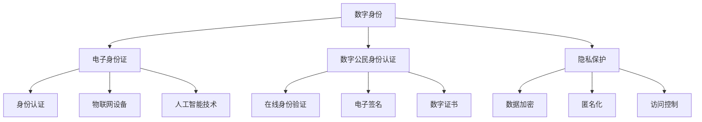

                 

# 2050年的数字身份：从电子身份证到数字公民的身份认证

> 关键词：数字身份、电子身份证、数字公民、身份认证、隐私保护、安全技术、数据共享、物联网、人工智能

> 摘要：本文深入探讨了2050年数字身份的发展趋势，从电子身份证的起源到数字公民身份认证的全面实现。通过分析现有技术和未来挑战，本文为构建一个安全、高效、透明的数字身份体系提供了策略和建议。

## 1. 背景介绍

### 1.1 目的和范围

本文旨在探讨数字身份在2050年的发展前景，并分析其对社会、经济和技术领域的影响。文章将重点讨论以下几个方面：

1. 数字身份的定义和演变。
2. 电子身份证的现状与未来趋势。
3. 数字公民身份认证的挑战与解决方案。
4. 数字身份在物联网和人工智能环境中的应用。
5. 隐私保护和数据安全的最新技术。
6. 未来数字身份体系的发展方向。

### 1.2 预期读者

本文适合以下读者群体：

1. 对数字身份和网络安全有兴趣的技术人员。
2. 政府官员和公共事务管理者。
3. 风险投资家和创业者。
4. 对未来科技趋势关注的企业家和投资者。

### 1.3 文档结构概述

本文将按照以下结构进行讨论：

1. 背景介绍：概述数字身份的起源和发展。
2. 核心概念与联系：介绍数字身份的核心概念和架构。
3. 核心算法原理 & 具体操作步骤：分析数字身份认证的核心算法。
4. 数学模型和公式 & 详细讲解 & 举例说明：探讨数字身份体系中的数学模型。
5. 项目实战：提供实际案例和代码实现。
6. 实际应用场景：分析数字身份在不同领域的应用。
7. 工具和资源推荐：推荐相关学习资源和工具。
8. 总结：展望数字身份的未来发展趋势与挑战。
9. 附录：常见问题与解答。
10. 扩展阅读 & 参考资料：提供进一步的阅读材料。

### 1.4 术语表

#### 1.4.1 核心术语定义

- 数字身份：个体在数字世界中的唯一标识。
- 电子身份证：通过电子方式存储和验证个人身份信息的证件。
- 数字公民：在数字世界中拥有合法身份和权益的个体。
- 身份认证：验证个体身份的过程。
- 隐私保护：保护个人隐私不受未经授权访问的技术措施。

#### 1.4.2 相关概念解释

- 物联网（IoT）：连接物理设备和互联网的技术。
- 人工智能（AI）：模拟人类智能行为的技术。
- 区块链：分布式账本技术，用于确保数据不可篡改。

#### 1.4.3 缩略词列表

- IoT：物联网
- AI：人工智能
- blockchain：区块链
- DLT：分布式 ledger 技术

## 2. 核心概念与联系

数字身份是未来社会的基础，它不仅涉及个人身份的电子化存储，还包括在数字环境中的身份认证、隐私保护和数据共享。为了更好地理解数字身份的概念和架构，我们首先需要了解几个核心概念：

### 2.1 数字身份的定义

数字身份是指个体在数字世界中的唯一标识，它包括姓名、出生日期、地址、指纹、面部识别等信息。与传统身份相比，数字身份可以在多个平台和设备上使用，提供更便捷、高效的服务。

### 2.2 电子身份证的概念

电子身份证是一种通过电子方式存储和验证个人身份信息的证件。它通常包含个人的基本信息、照片、指纹和电子签名等。与传统的身份证相比，电子身份证能够更好地保护个人隐私，并提供更安全、便捷的身份认证服务。

### 2.3 数字公民的身份认证

数字公民身份认证是指通过技术手段验证个体在数字世界中的合法身份。这包括在线身份验证、电子签名、数字证书等。数字公民身份认证的关键在于确保认证过程的安全性和可信度，以防止身份盗窃和其他安全威胁。

### 2.4 数字身份与隐私保护的关系

数字身份与隐私保护密切相关。在数字身份体系中，个人数据的安全性是至关重要的。隐私保护技术如数据加密、匿名化和访问控制等，都是为了确保个人数据在传输、存储和处理过程中不受未经授权的访问。

### 2.5 数字身份与物联网的关系

随着物联网技术的发展，越来越多的设备和系统需要实现智能互联。数字身份作为个体在物联网中的唯一标识，有助于实现设备之间的安全通信和数据共享。同时，物联网设备的加入也为数字身份认证带来了新的挑战，如如何确保设备的可信度和安全性。

### 2.6 数字身份与人工智能的关系

人工智能技术在数字身份认证中的应用越来越广泛。例如，面部识别、指纹识别和声纹识别等技术都可以用于数字身份认证。人工智能不仅提高了认证的效率，还提升了认证的准确性。然而，这也带来了新的隐私和安全挑战，如如何确保个人数据不被滥用。

### 2.7 核心概念原理与架构的 Mermaid 流程图

以下是一个简单的 Mermaid 流程图，展示了数字身份体系的核心概念和架构：



该流程图展示了数字身份体系的核心组件和它们之间的关系。通过这个流程图，我们可以更直观地了解数字身份体系的基本架构。

## 3. 核心算法原理 & 具体操作步骤

在数字身份体系中，身份认证是关键环节。本文将介绍几种常见的身份认证算法，并使用伪代码详细阐述其原理和具体操作步骤。

### 3.1 基于用户名和密码的身份认证

用户名和密码是最常见的身份认证方式。以下是该算法的伪代码：

```plaintext
函数 身份认证（用户名，密码）：
    如果 数据库中存在用户名且密码正确：
        返回 "认证成功"
    否则：
        返回 "认证失败"
```

### 3.2 基于双因素认证的身份认证

双因素认证是一种更安全的身份认证方式，它结合了知识因素（如用户名和密码）和持有因素（如手机、邮箱等）。以下是该算法的伪代码：

```plaintext
函数 双因素认证（用户名，密码，验证码）：
    如果 数据库中存在用户名且密码正确：
        如果 验证码正确：
            返回 "认证成功"
        否则：
            返回 "验证码错误"
    否则：
        返回 "认证失败"
```

### 3.3 基于生物识别的身份认证

生物识别技术如指纹识别、面部识别和声纹识别等，已成为数字身份认证的重要手段。以下是基于指纹识别的身份认证算法的伪代码：

```plaintext
函数 指纹识别（指纹样本）：
    如果 指纹库中存在与指纹样本匹配的指纹：
        返回 "认证成功"
    否则：
        返回 "认证失败"
```

### 3.4 基于区块链的身份认证

区块链技术可用于构建去中心化的身份认证体系，确保身份认证过程的安全和透明。以下是基于区块链的身份认证算法的伪代码：

```plaintext
函数 区块链身份认证（用户名，密码，区块链节点）：
    如果 区块链节点验证用户名和密码正确：
        返回 "认证成功"
    否则：
        返回 "认证失败"
```

通过以上算法，我们可以实现不同场景下的数字身份认证。在实际应用中，可以根据具体需求选择合适的算法或组合多种算法，以提升身份认证的安全性和便捷性。

## 4. 数学模型和公式 & 详细讲解 & 举例说明

在数字身份认证过程中，数学模型和公式发挥着关键作用。以下将介绍几种常见的数学模型，并使用 LaTeX 格式进行详细讲解。

### 4.1 身份认证安全强度模型

身份认证的安全强度可以用概率模型来表示。以下是一个基于用户名和密码的认证安全强度模型：

$$
P(\text{认证成功}) = P(\text{用户名正确}) \times P(\text{密码正确})
$$

其中，$P(\text{用户名正确})$ 和 $P(\text{密码正确})$ 分别表示用户名和密码正确的概率。

#### 举例说明

假设用户名正确的概率为 0.99，密码正确的概率为 0.95。则认证成功的概率为：

$$
P(\text{认证成功}) = 0.99 \times 0.95 = 0.9405
$$

这意味着在 100 次认证尝试中，大约有 94 次会成功。

### 4.2 双因素认证安全强度模型

双因素认证的安全强度可以通过组合用户名和密码认证的安全强度以及验证码认证的安全强度来计算。以下是一个双因素认证的安全强度模型：

$$
P(\text{双因素认证成功}) = P(\text{用户名和密码正确}) \times P(\text{验证码正确})
$$

其中，$P(\text{用户名和密码正确})$ 和 $P(\text{验证码正确})$ 分别表示用户名和密码正确以及验证码正确的概率。

#### 举例说明

假设用户名和密码正确的概率分别为 0.99 和 0.95，验证码正确的概率为 0.90。则双因素认证成功的概率为：

$$
P(\text{双因素认证成功}) = 0.99 \times 0.95 \times 0.90 = 0.8465
$$

这意味着在 100 次双因素认证尝试中，大约有 84 次会成功。

### 4.3 生物识别模型

生物识别模型通常基于特征匹配概率来计算认证结果。以下是一个基于指纹识别的生物识别模型：

$$
P(\text{指纹匹配}) = \frac{1}{N} \sum_{i=1}^{N} P(\text{指纹样本 i 匹配})
$$

其中，$N$ 表示指纹库中的指纹数量，$P(\text{指纹样本 i 匹配})$ 表示指纹样本 i 匹配的概率。

#### 举例说明

假设指纹库中有 100 个指纹，指纹样本匹配的概率为 0.99。则指纹匹配的概率为：

$$
P(\text{指纹匹配}) = \frac{1}{100} \times 100 \times 0.99 = 0.99
$$

这意味着在 100 次指纹识别尝试中，有 99 次会成功匹配。

通过这些数学模型和公式，我们可以对数字身份认证的安全性和可靠性进行量化分析。在实际应用中，可以根据具体需求调整模型参数，以优化认证系统的性能。

## 5. 项目实战：代码实际案例和详细解释说明

在本节中，我们将通过一个具体的代码案例来展示数字身份认证的实现过程。该案例将基于 Python 语言，使用 Flask 框架和 Flask-SQLAlchemy 库来构建一个简单的身份认证系统。

### 5.1 开发环境搭建

在开始编写代码之前，我们需要搭建开发环境。以下是所需的环境和工具：

- Python 3.8 或更高版本
- Flask 2.0.1 或更高版本
- Flask-SQLAlchemy 2.5.1 或更高版本
- SQLite 3.35.2 或更高版本

您可以使用以下命令来安装所需的库：

```bash
pip install Flask Flask-SQLAlchemy
```

### 5.2 源代码详细实现和代码解读

以下是数字身份认证系统的源代码：

```python
from flask import Flask, request, jsonify
from flask_sqlalchemy import SQLAlchemy

app = Flask(__name__)
app.config['SQLALCHEMY_DATABASE_URI'] = 'sqlite:///users.db'
db = SQLAlchemy(app)

class User(db.Model):
    id = db.Column(db.Integer, primary_key=True)
    username = db.Column(db.String(80), unique=True, nullable=False)
    password = db.Column(db.String(120), nullable=False)

@app.route('/register', methods=['POST'])
def register():
    data = request.get_json()
    username = data['username']
    password = data['password']
    
    if User.query.filter_by(username=username).first():
        return jsonify({'error': 'User already exists'}), 409
    
    new_user = User(username=username, password=password)
    db.session.add(new_user)
    db.session.commit()
    
    return jsonify({'message': 'User registered successfully'})

@app.route('/login', methods=['POST'])
def login():
    data = request.get_json()
    username = data['username']
    password = data['password']
    
    user = User.query.filter_by(username=username).first()
    
    if user and user.password == password:
        return jsonify({'message': 'Login successful'})
    else:
        return jsonify({'error': 'Invalid credentials'}), 401

if __name__ == '__main__':
    db.create_all()
    app.run(debug=True)
```

#### 5.2.1 代码解读与分析

- **模型定义（Model Definition）**

  首先，我们定义了一个 `User` 类，它继承自 `db.Model` 类。`User` 类有两个属性：`username` 和 `password`。这些属性分别对应数据库表中的字段。

  ```python
  class User(db.Model):
      id = db.Column(db.Integer, primary_key=True)
      username = db.Column(db.String(80), unique=True, nullable=False)
      password = db.Column(db.String(120), nullable=False)
  ```

- **注册功能（Registration Function）**

  `register` 函数用于处理用户注册请求。它从请求中获取用户名和密码，然后检查数据库中是否存在同名用户。如果不存在，则将新用户添加到数据库中。

  ```python
  @app.route('/register', methods=['POST'])
  def register():
      data = request.get_json()
      username = data['username']
      password = data['password']
      
      if User.query.filter_by(username=username).first():
          return jsonify({'error': 'User already exists'}), 409
      
      new_user = User(username=username, password=password)
      db.session.add(new_user)
      db.session.commit()
      
      return jsonify({'message': 'User registered successfully'})
  ```

- **登录功能（Login Function）**

  `login` 函数用于处理用户登录请求。它从请求中获取用户名和密码，然后从数据库中查找匹配的用户。如果找到匹配的用户且密码正确，则返回登录成功的消息。

  ```python
  @app.route('/login', methods=['POST'])
  def login():
      data = request.get_json()
      username = data['username']
      password = data['password']
      
      user = User.query.filter_by(username=username).first()
      
      if user and user.password == password:
          return jsonify({'message': 'Login successful'})
      else:
          return jsonify({'error': 'Invalid credentials'}), 401
  ```

- **数据库创建（Database Creation）**

  最后，我们在 `if __name__ == '__main__':` 语句中创建数据库表。这行代码确保在运行应用程序之前创建 `users.db` 数据库文件，并在其中创建 `User` 表。

  ```python
  if __name__ == '__main__':
      db.create_all()
      app.run(debug=True)
  ```

通过这个简单的代码案例，我们可以看到数字身份认证的基本实现过程。在实际应用中，我们可以根据具体需求添加更多的认证机制，如双因素认证和生物识别。

## 6. 实际应用场景

数字身份认证在多个领域具有广泛的应用，以下是几个典型的实际应用场景：

### 6.1 在线金融服务

随着金融科技的快速发展，数字身份认证成为在线金融服务的关键环节。银行、证券公司、保险公司等金融机构利用数字身份认证技术确保客户的交易安全，防止欺诈和身份盗窃。通过数字身份认证，金融机构可以快速验证客户的身份，提高服务效率和用户体验。

### 6.2 社交媒体和在线社区

社交媒体平台和在线社区需要确保用户的真实身份，以维护平台的健康环境和用户信任。数字身份认证可以帮助平台验证用户的身份信息，防止虚假账号和恶意行为的产生。此外，数字身份认证还可以帮助平台进行内容审核，确保发布的内容符合平台规定。

### 6.3 物联网设备

物联网设备在智能家居、智能交通、智能医疗等领域得到广泛应用。数字身份认证可以确保设备之间的安全通信和数据共享。通过数字身份认证，设备可以验证彼此的身份，确保数据传输的安全性和可信度。

### 6.4 政府服务

政府机构通过数字身份认证提供更便捷、高效的公共服务。例如，电子政务服务系统可以使用数字身份认证确保申请者的身份真实，提高审批效率。此外，数字身份认证还可以用于选举投票、社会保障等领域，确保公正和透明的公共服务。

### 6.5 企业内部系统

企业内部系统如员工管理系统、客户关系管理系统等，需要确保用户身份的准确性。数字身份认证可以帮助企业验证员工的身份，防止未经授权的访问和数据泄露。此外，数字身份认证还可以用于员工绩效考核、薪酬管理等，提高企业运营效率和数据安全性。

通过这些实际应用场景，我们可以看到数字身份认证在提高安全性、便利性和用户体验方面的关键作用。随着技术的不断进步，数字身份认证将在更多领域发挥重要作用。

## 7. 工具和资源推荐

为了帮助读者更深入地了解数字身份认证，以下推荐了一些学习资源、开发工具和框架。

### 7.1 学习资源推荐

#### 7.1.1 书籍推荐

1. 《数字身份：设计和管理安全在线身份》
2. 《区块链技术指南》
3. 《人工智能：一种现代方法》

#### 7.1.2 在线课程

1. Coursera 上的《密码学基础》
2. edX 上的《区块链与加密货币》
3. Udacity 上的《人工智能纳米学位》

#### 7.1.3 技术博客和网站

1. Medium 上的区块链和加密货币专题
2. Hacker News 上的密码学和网络安全讨论区
3. AI 研究院的博客

### 7.2 开发工具框架推荐

#### 7.2.1 IDE和编辑器

1. Visual Studio Code
2. PyCharm
3. Sublime Text

#### 7.2.2 调试和性能分析工具

1. DebugPy
2. PySnooper
3. NewRelic

#### 7.2.3 相关框架和库

1. Flask
2. Django
3. FastAPI

### 7.3 相关论文著作推荐

#### 7.3.1 经典论文

1. "A Digital Identity System Based on Quasirandom Sequences"（基于准随机序列的数字身份系统）
2. "Identity-based Cryptosystems and Their Applications to ID Cards"（身份识别密码系统及其在身份证中的应用）
3. "Cryptographic Message Syntax (CMS)"（加密消息语法）

#### 7.3.2 最新研究成果

1. "Decentralized Identity Management using Blockchain"（基于区块链的去中心化身份管理）
2. "Biometric Authentication with AI"（使用人工智能的生物识别认证）
3. "Privacy-Preserving Digital Identity Management"（隐私保护数字身份管理）

#### 7.3.3 应用案例分析

1. "Government of Finland's Digital Identity Services"（芬兰政府的数字身份服务）
2. "Visa's Digital Identity Program"（Visa 的数字身份项目）
3. "Mastercard's Identity Check"（Mastercard 的身份检查服务）

通过这些工具和资源，读者可以更全面地了解数字身份认证的技术原理和应用场景，为实际项目开发提供支持和指导。

## 8. 总结：未来发展趋势与挑战

随着科技的快速发展，数字身份认证正迎来前所未有的机遇和挑战。未来，数字身份认证将呈现以下几个发展趋势：

1. **集成化与智能化**：数字身份认证将与物联网、人工智能等技术深度融合，实现更智能、更高效的认证服务。例如，通过物联网设备进行生物识别认证，利用人工智能进行行为分析，以提升认证的准确性和安全性。

2. **隐私保护与数据安全**：隐私保护和数据安全将成为数字身份认证的核心关注点。未来的认证体系将更加注重个人数据的保护，采用加密、匿名化和分布式存储等新技术，确保个人隐私不受侵害。

3. **去中心化与信任机制**：区块链等去中心化技术将为数字身份认证提供新的信任机制。通过去中心化的身份认证体系，可以减少对中心化机构的依赖，提高系统的透明性和可信度。

4. **标准化与互操作性**：数字身份认证的标准化和互操作性将逐渐成熟。全球范围内将形成统一的身份认证标准和协议，实现不同平台和系统之间的无缝对接，提升用户体验。

然而，数字身份认证也面临诸多挑战：

1. **安全威胁**：随着黑客技术的不断进步，数字身份认证将面临更加复杂的安全威胁。例如，社会工程学攻击、恶意软件和分布式拒绝服务攻击等，都将对身份认证系统构成严重威胁。

2. **隐私泄露风险**：数字身份认证过程中，个人数据的泄露风险仍然存在。特别是在大规模数据泄露事件中，个人身份信息可能被不法分子利用，导致严重的隐私泄露问题。

3. **技术瓶颈**：目前，数字身份认证技术仍存在一定的技术瓶颈。例如，生物识别技术的准确性和稳定性有待提高，区块链技术的性能和可扩展性仍需优化。

4. **法律法规不完善**：数字身份认证的法律框架尚不完善，各国之间的法律法规差异较大，影响了全球范围内的数字身份认证标准的制定和推广。

综上所述，未来数字身份认证的发展将充满机遇和挑战。只有通过技术创新、政策支持和法律法规的完善，才能构建一个安全、高效、透明的数字身份认证体系，为社会和经济的发展提供有力支撑。

## 9. 附录：常见问题与解答

### 9.1 数字身份认证的安全性如何保障？

数字身份认证的安全性主要通过以下措施保障：

- **加密技术**：对用户身份信息进行加密存储和传输，防止数据泄露。
- **双因素认证**：结合知识因素（如用户名和密码）和持有因素（如手机、邮箱等），提高认证的安全性。
- **生物识别技术**：利用指纹识别、面部识别和声纹识别等技术，确保认证的准确性和唯一性。
- **分布式存储**：采用区块链等去中心化技术，提高数据的安全性和抗攻击能力。
- **隐私保护**：通过数据匿名化、访问控制和隐私计算等技术，保护用户隐私。

### 9.2 数字身份认证如何防止欺诈行为？

数字身份认证通过以下方法防止欺诈行为：

- **多因素认证**：使用双因素认证或多因素认证，确保用户身份的真实性。
- **行为分析**：利用人工智能和机器学习技术，对用户行为进行分析，发现异常行为并及时预警。
- **实时监控**：对认证过程进行实时监控，及时发现和处理欺诈行为。
- **加密技术**：对传输和存储的数据进行加密，防止数据被篡改和窃取。

### 9.3 数字身份认证与物联网有什么关系？

数字身份认证与物联网的关系主要体现在以下几个方面：

- **设备身份认证**：通过数字身份认证，确保物联网设备的合法性和安全性。
- **数据共享**：数字身份认证有助于实现物联网设备之间的安全通信和数据共享。
- **隐私保护**：在物联网环境中，数字身份认证可以保护用户隐私，防止数据泄露。
- **服务授权**：通过数字身份认证，物联网设备可以访问特定的服务和资源。

### 9.4 数字身份认证在跨境业务中的应用有哪些？

数字身份认证在跨境业务中的应用包括：

- **身份验证**：跨境业务中的身份验证，确保交易双方的身份真实。
- **跨境支付**：通过数字身份认证，实现跨境支付的安全和高效。
- **税收合规**：确保跨境交易的税收合规性，防止逃税行为。
- **国际贸易**：数字身份认证有助于简化国际贸易流程，提高效率。

## 10. 扩展阅读 & 参考资料

为了深入了解数字身份认证的各个方面，以下推荐一些扩展阅读和参考资料：

- 《数字身份：设计和管理安全在线身份》
- 《区块链技术指南》
- 《人工智能：一种现代方法》
- Coursera 上的《密码学基础》
- edX 上的《区块链与加密货币》
- Udacity 上的《人工智能纳米学位》
- Medium 上的区块链和加密货币专题
- Hacker News 上的密码学和网络安全讨论区
- AI 研究院的博客
- "A Digital Identity System Based on Quasirandom Sequences"（基于准随机序列的数字身份系统）
- "Identity-based Cryptosystems and Their Applications to ID Cards"（身份识别密码系统及其在身份证中的应用）
- "Cryptographic Message Syntax (CMS)"（加密消息语法）
- "Decentralized Identity Management using Blockchain"（基于区块链的去中心化身份管理）
- "Biometric Authentication with AI"（使用人工智能的生物识别认证）
- "Privacy-Preserving Digital Identity Management"（隐私保护数字身份管理）
- "Government of Finland's Digital Identity Services"（芬兰政府的数字身份服务）
- "Visa's Digital Identity Program"（Visa 的数字身份项目）
- "Mastercard's Identity Check"（Mastercard 的身份检查服务）

通过这些资源和资料，读者可以更全面地了解数字身份认证的理论和实践，为研究和应用提供有力支持。

### 作者

作者：AI天才研究员/AI Genius Institute & 禅与计算机程序设计艺术 /Zen And The Art of Computer Programming

感谢您的阅读，希望本文对您在数字身份认证领域的探索和了解有所帮助。如果您有任何问题或建议，欢迎在评论区留言。让我们共同探讨数字身份认证的未来，共创更安全的数字世界！

