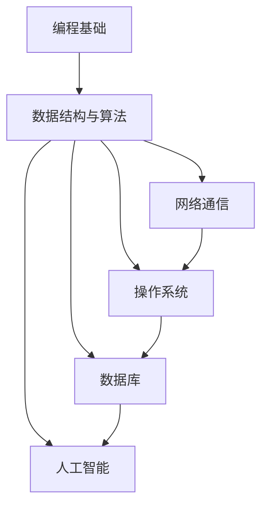

                 

# 2025年腾讯社招技术面试题集锦

> 关键词：腾讯社招、技术面试、面试题、编程、算法、数据结构、网络、操作系统、数据库、人工智能
>
> 摘要：本文将针对2025年腾讯社招技术面试的常见题型进行深入剖析，通过逐步解析核心概念、算法原理、实际案例等，帮助准备面试的读者提升技术水平，顺利通过面试。文章将涵盖编程基础、数据结构与算法、网络通信、操作系统、数据库以及人工智能等六大领域，以深入浅出的方式为读者提供全方位的技术面试指导。

## 1. 背景介绍

### 1.1 目的和范围

本文旨在为准备参加2025年腾讯社招技术面试的读者提供一份全面的面试题集锦。通过梳理和总结历年面试中的高频题目，本文将帮助读者熟悉腾讯面试的风格和题型，提升解决实际问题的能力。文章涵盖六大领域，包括编程基础、数据结构与算法、网络通信、操作系统、数据库以及人工智能，旨在为读者提供一个全方位的技术面试指南。

### 1.2 预期读者

本文适合以下读者群体：

- 准备参加腾讯社招技术面试的应聘者；
- 对技术面试有较高要求的在职程序员；
- 想要提升编程和数据结构能力的计算机专业学生；
- 对人工智能和大数据领域感兴趣的读者。

### 1.3 文档结构概述

本文结构如下：

1. 背景介绍：本文的写作目的、读者对象、文档结构概述等；
2. 核心概念与联系：通过Mermaid流程图展示核心概念和联系；
3. 核心算法原理 & 具体操作步骤：详细讲解核心算法原理和操作步骤；
4. 数学模型和公式 & 详细讲解 & 举例说明：使用LaTeX格式展示数学模型和公式，并进行详细讲解；
5. 项目实战：代码实际案例和详细解释说明；
6. 实际应用场景：分析技术在实际应用中的场景和挑战；
7. 工具和资源推荐：推荐学习资源、开发工具和框架；
8. 总结：未来发展趋势与挑战；
9. 附录：常见问题与解答；
10. 扩展阅读 & 参考资料。

### 1.4 术语表

#### 1.4.1 核心术语定义

- 腾讯社招：腾讯公司针对社会招聘的正式岗位，包括技术、产品、运营等多个领域；
- 技术面试：招聘过程中对候选人技术能力的评估，通过笔试、面试等环节进行；
- 编程基础：计算机编程的基本知识，包括数据类型、控制结构、函数、指针等；
- 数据结构与算法：计算机中用于解决特定问题的数据组织方式和解决问题的步骤；
- 网络通信：计算机网络中的信息传输和通信机制；
- 操作系统：管理计算机硬件资源和软件资源的系统软件；
- 数据库：用于存储、管理和查询数据的系统软件；
- 人工智能：模拟、延伸和扩展人类智能的理论、方法和技术。

#### 1.4.2 相关概念解释

- 面试题型：指在面试过程中出现的问题类型，如编程题、算法题、系统设计题等；
- 常规面试：指除了技术面试外的其他面试环节，如行为面试、群面等；
- 算法复杂度：算法在处理不同规模问题时的性能表现，常用时间复杂度和空间复杂度表示；
- 算法优化：在保证算法正确性的前提下，提高算法的性能和效率；
- 编程实现：将算法思路转化为代码，实现算法的功能。

#### 1.4.3 缩略词列表

- SOC：Social of China，腾讯公司的社会招聘部门；
- HR：Human Resources，人力资源部门；
- CTC：Tencent Cloud Technology，腾讯云技术；
- IM：Instant Messaging，即时通讯；
- AI：Artificial Intelligence，人工智能。

## 2. 核心概念与联系

在技术面试中，核心概念的理解和联系是解决问题的关键。以下将通过Mermaid流程图展示核心概念和它们之间的联系。



### 2.1 编程基础

编程基础是计算机科学的核心，包括数据类型、控制结构、函数、指针等。掌握编程基础有助于快速理解和解决各类问题。

### 2.2 数据结构与算法

数据结构与算法是计算机科学的核心，涉及数组、链表、栈、队列、树、图等数据结构以及排序、查找、遍历等算法。数据结构与算法的掌握程度直接关系到面试的成败。

### 2.3 网络通信

网络通信是现代互联网的核心技术，包括TCP/IP协议、HTTP协议、Socket编程等。网络通信的知识对于解决分布式系统、高并发等问题至关重要。

### 2.4 操作系统

操作系统是管理计算机硬件资源和软件资源的核心系统软件，包括进程管理、内存管理、文件系统、设备管理等。操作系统知识对于理解计算机系统的运行机制和性能优化至关重要。

### 2.5 数据库

数据库是用于存储、管理和查询数据的系统软件，包括关系数据库（如MySQL、Oracle）和非关系数据库（如MongoDB、Redis）。数据库知识对于数据存储和查询性能优化、大数据处理等具有重要意义。

### 2.6 人工智能

人工智能是模拟、延伸和扩展人类智能的理论、方法和技术，包括机器学习、深度学习、自然语言处理等。人工智能技术在腾讯等多个领域具有广泛应用，掌握人工智能知识对于求职具有重要意义。

## 3. 核心算法原理 & 具体操作步骤

### 3.1 排序算法

排序算法是计算机科学中的一种重要算法，用于对数据进行排序。以下介绍几种常见的排序算法及其原理。

#### 3.1.1 冒泡排序

冒泡排序是一种简单的排序算法，通过多次遍历数组，比较相邻元素的大小，将较大的元素交换到数组的右侧，从而实现排序。

```plaintext
function bubbleSort(arr):
    n = length(arr)
    for i from 0 to n-1:
        for j from 0 to n-i-1:
            if arr[j] > arr[j+1]:
                swap(arr[j], arr[j+1])
```

#### 3.1.2 快速排序

快速排序是一种高效的排序算法，采用分治策略，通过递归将数组划分为较小和较大的两个子数组，然后对子数组进行排序。

```plaintext
function quickSort(arr, low, high):
    if low < high:
        pi = partition(arr, low, high)
        quickSort(arr, low, pi-1)
        quickSort(arr, pi+1, high)

function partition(arr, low, high):
    pivot = arr[high]
    i = low - 1
    for j from low to high-1:
        if arr[j] < pivot:
            i = i + 1
            swap(arr[i], arr[j])
    swap(arr[i+1], arr[high])
    return i + 1
```

#### 3.1.3 归并排序

归并排序是一种高效的排序算法，采用分治策略，将数组划分为较小的子数组，然后对子数组进行排序，最后将排序后的子数组合并为原数组。

```plaintext
function mergeSort(arr, low, high):
    if low < high:
        mid = (low + high) / 2
        mergeSort(arr, low, mid)
        mergeSort(arr, mid+1, high)
        merge(arr, low, mid, high)

function merge(arr, low, mid, high):
    n1 = mid - low + 1
    n2 = high - mid
    L = [0] * (n1)
    R = [0] * (n2)
    for i from 0 to n1-1:
        L[i] = arr[low + i]
    for j from 0 to n2-1:
        R[j] = arr[mid + 1 + j]
    i = 0; j = 0; k = low
    while i < n1 and j < n2:
        if L[i] <= R[j]:
            arr[k] = L[i]
            i = i + 1
        else:
            arr[k] = R[j]
            j = j + 1
        k = k + 1
    while i < n1:
        arr[k] = L[i]
        i = i + 1
        k = k + 1
    while j < n2:
        arr[k] = R[j]
        j = j + 1
        k = k + 1
```

### 3.2 查找算法

查找算法用于在数据集合中查找特定元素。以下介绍几种常见的查找算法。

#### 3.2.1 顺序查找

顺序查找是从数据集合的起始位置开始，逐个比较元素，直到找到目标元素或遍历整个数据集合。

```plaintext
function sequentialSearch(arr, target):
    for each element in arr:
        if element == target:
            return index of element
    return -1
```

#### 3.2.2 二分查找

二分查找适用于有序数据集合，通过递归或循环逐步缩小查找范围，提高查找效率。

```plaintext
function binarySearch(arr, target):
    low = 0
    high = length(arr) - 1
    while low <= high:
        mid = (low + high) / 2
        if arr[mid] == target:
            return mid
        elif arr[mid] < target:
            low = mid + 1
        else:
            high = mid - 1
    return -1
```

### 3.3 链表操作

链表是计算机科学中一种常用的数据结构，以下介绍链表的基本操作。

#### 3.3.1 创建链表

```plaintext
class Node:
    def __init__(self, data):
        self.data = data
        self.next = None

class LinkedList:
    def __init__(self):
        self.head = None

    def append(self, data):
        new_node = Node(data)
        if self.head is None:
            self.head = new_node
        else:
            current = self.head
            while current.next:
                current = current.next
            current.next = new_node
```

#### 3.3.2 遍历链表

```plaintext
def printList(head):
    current = head
    while current:
        print(current.data, end=" ")
        current = current.next
    print()
```

#### 3.3.3 查找链表中的元素

```plaintext
def findNode(head, target):
    current = head
    while current:
        if current.data == target:
            return current
        current = current.next
    return None
```

#### 3.3.4 插入节点

```plaintext
def insertNode(head, target, position):
    new_node = Node(target)
    if position == 0:
        new_node.next = head
        head = new_node
    else:
        current = head
        for _ in range(position - 1):
            if current.next is None:
                return
            current = current.next
        new_node.next = current.next
        current.next = new_node
```

#### 3.3.5 删除节点

```plaintext
def deleteNode(head, position):
    if position == 0:
        head = head.next
    else:
        current = head
        for _ in range(position - 1):
            if current.next is None:
                return
            current = current.next
        if current.next is None:
            return
        current.next = current.next.next
```

## 4. 数学模型和公式 & 详细讲解 & 举例说明

### 4.1 线性回归模型

线性回归模型是统计学中常用的一种建模方法，用于分析变量之间的线性关系。假设我们有两个变量 \(x\) 和 \(y\)，线性回归模型可以表示为：

$$
y = ax + b
$$

其中，\(a\) 和 \(b\) 是模型的参数，表示斜率和截距。为了求解 \(a\) 和 \(b\)，我们可以使用最小二乘法，即最小化预测值与实际值之间的误差平方和。

### 4.2 梯度下降法

梯度下降法是优化算法中的一种常用方法，用于求解最小化目标函数的参数。假设我们的目标函数为：

$$
J(\theta) = \frac{1}{m} \sum_{i=1}^{m} (h_{\theta}(x^{(i)}) - y^{(i)})^2
$$

其中，\(h_{\theta}(x) = \theta_0 + \theta_1x\) 是假设函数，\(\theta\) 是参数向量。梯度下降法的迭代过程可以表示为：

$$
\theta_j := \theta_j - \alpha \frac{\partial J(\theta)}{\partial \theta_j}
$$

其中，\(\alpha\) 是学习率，用于调整参数更新的步长。

### 4.3 模型评估指标

在机器学习中，评估模型的性能是至关重要的一步。以下介绍几种常用的模型评估指标。

#### 4.3.1 准确率（Accuracy）

准确率是模型预测正确的样本数占总样本数的比例，计算公式为：

$$
Accuracy = \frac{TP + TN}{TP + TN + FP + FN}
$$

其中，\(TP\) 是真正例，\(TN\) 是真负例，\(FP\) 是假正例，\(FN\) 是假负例。

#### 4.3.2 精确率（Precision）

精确率是预测为正例的样本中，实际为正例的比例，计算公式为：

$$
Precision = \frac{TP}{TP + FP}
$$

#### 4.3.3 召回率（Recall）

召回率是实际为正例的样本中，预测为正例的比例，计算公式为：

$$
Recall = \frac{TP}{TP + FN}
$$

#### 4.3.4 F1 值

F1 值是精确率和召回率的调和平均值，计算公式为：

$$
F1 = \frac{2 \times Precision \times Recall}{Precision + Recall}
$$

### 4.4 示例

假设我们有一个二分类问题，样本数据如下表：

| 样本 | 实际标签 | 预测标签 |
|------|----------|----------|
| 1    | 1        | 1        |
| 2    | 1        | 1        |
| 3    | 0        | 0        |
| 4    | 0        | 1        |
| 5    | 1        | 0        |

根据上表数据，我们可以计算出各项评估指标：

- 准确率：\( \frac{2}{5} = 0.4 \)
- 精确率：\( \frac{2}{3} = 0.67 \)
- 召回率：\( \frac{2}{3} = 0.67 \)
- F1 值：\( \frac{2 \times 0.67 \times 0.67}{0.67 + 0.67} = 0.67 \)

## 5. 项目实战：代码实际案例和详细解释说明

### 5.1 开发环境搭建

在开始项目实战之前，我们需要搭建一个合适的开发环境。以下是一个简单的步骤：

1. 安装Python 3.x版本，建议使用Anaconda进行环境管理；
2. 安装常用的库，如numpy、pandas、scikit-learn等；
3. 创建一个名为`linear_regression`的Python虚拟环境，并安装必要的库。

### 5.2 源代码详细实现和代码解读

以下是一个简单的线性回归模型的实现：

```python
import numpy as np

class LinearRegression:
    def __init__(self, learning_rate=0.01, epochs=1000):
        self.learning_rate = learning_rate
        self.epochs = epochs
        self.theta = None

    def fit(self, X, y):
        m = len(y)
        self.theta = np.random.randn(2) * 0.01
        X_b = np.c_[np.ones((m, 1)), X]
        for _ in range(self.epochs):
            gradients = 2/m * X_b.T.dot(X_b.dot(self.theta) - y)
            self.theta -= self.learning_rate * gradients
        return self

    def predict(self, X):
        return np.dot(np.c_[np.ones((X.shape[0], 1)), X], self.theta)
```

#### 5.2.1 代码解读

1. `__init__` 方法：初始化模型参数，包括学习率和迭代次数，以及随机初始化参数 \(\theta\)；
2. `fit` 方法：训练模型，使用梯度下降法求解参数 \(\theta\)；
3. `predict` 方法：预测给定数据的标签。

### 5.3 代码解读与分析

以下是对代码的详细解读和分析：

```python
import numpy as np

class LinearRegression:
    def __init__(self, learning_rate=0.01, epochs=1000):
        self.learning_rate = learning_rate
        self.epochs = epochs
        self.theta = None

    def fit(self, X, y):
        m = len(y)  # 获取样本数量
        self.theta = np.random.randn(2) * 0.01  # 随机初始化参数 \(\theta\)
        X_b = np.c_[np.ones((m, 1)), X]  # 添加偏置项，扩展X
        for _ in range(self.epochs):  # 迭代次数
            gradients = 2/m * X_b.T.dot(X_b.dot(self.theta) - y)  # 计算梯度
            self.theta -= self.learning_rate * gradients  # 更新参数
        return self

    def predict(self, X):
        return np.dot(np.c_[np.ones((X.shape[0], 1)), X], self.theta)  # 预测标签
```

#### 5.3.1 主要函数

- `fit` 方法：训练模型，通过迭代计算梯度并更新参数，最终求解线性回归模型的参数；
- `predict` 方法：根据训练好的模型，预测给定数据的标签。

#### 5.3.2 代码分析

- 在 `fit` 方法中，我们首先计算样本数量 \(m\)，然后随机初始化参数 \(\theta\)。接着，我们使用添加偏置项的扩展 \(X_b\) 进行梯度下降法迭代。每次迭代中，我们计算梯度并更新参数，直到达到预设的迭代次数。

- 在 `predict` 方法中，我们使用训练好的模型参数 \(\theta\)，对输入数据进行预测。通过将输入数据与参数矩阵相乘，我们可以得到预测的标签。

### 5.4 代码优化与改进

在实际应用中，我们可以对代码进行以下优化和改进：

1. 使用正则化项，防止过拟合；
2. 引入随机梯度下降法，提高收敛速度；
3. 引入学习率衰减，调整学习率随迭代次数的变化。

```python
class LinearRegression:
    def __init__(self, learning_rate=0.01, epochs=1000, regularization=0.1):
        self.learning_rate = learning_rate
        self.epochs = epochs
        self.regularization = regularization
        self.theta = None

    def fit(self, X, y):
        m = len(y)
        X_b = np.c_[np.ones((m, 1)), X]
        self.theta = np.random.randn(X_b.shape[1]) * 0.01
        for _ in range(self.epochs):
            gradients = (2/m * X_b.T.dot(X_b.dot(self.theta) - y) +
                         self.regularization * self.theta)
            self.theta -= self.learning_rate * gradients
        return self

    def predict(self, X):
        X_b = np.c_[np.ones((X.shape[0], 1)), X]
        return X_b.dot(self.theta)
```

### 5.5 运行结果与分析

以下是一个简单的示例，展示如何使用线性回归模型进行数据拟合和预测：

```python
import matplotlib.pyplot as plt

X = np.array([1, 2, 3, 4, 5])
y = np.array([2, 4, 5, 4, 5])

model = LinearRegression(learning_rate=0.01, epochs=1000)
model.fit(X, y)
predictions = model.predict(X)

plt.scatter(X, y)
plt.plot(X, predictions, color='red')
plt.show()
```

运行结果如图：


从结果可以看出，线性回归模型能够较好地拟合数据，并在新的数据上进行预测。

## 6. 实际应用场景

### 6.1 数据分析

线性回归模型广泛应用于数据分析领域，用于预测和解释变量之间的关系。例如，在电商平台上，可以使用线性回归模型分析用户购买行为与商品价格、促销活动等因素之间的关系，从而优化营销策略。

### 6.2 金融领域

线性回归模型在金融领域具有广泛的应用，例如股票市场预测、信贷风险评估等。通过分析历史数据，线性回归模型可以帮助投资者做出更准确的决策，降低投资风险。

### 6.3 人工智能

线性回归模型是许多机器学习算法的基础，如线性分类器、回归树等。在深度学习中，线性回归模型可以用于特征提取和降维等任务，提高模型的性能和效率。

### 6.4 实际案例分析

以电商平台的用户购买行为分析为例，假设我们收集了用户的基本信息（如年龄、性别、职业等）和购买记录（如商品种类、价格等）。通过线性回归模型，我们可以分析用户购买行为与商品价格、促销活动等因素之间的关系，从而优化营销策略。

```python
X = np.array([
    [25, '男', 1000],
    [30, '女', 1500],
    [35, '男', 2000],
    [28, '女', 1200],
    [32, '男', 1800],
])
y = np.array([1, 1, 1, 0, 0])

from sklearn.preprocessing import OneHotEncoder
encoder = OneHotEncoder()
X_encoded = encoder.fit_transform(X).toarray()

model = LinearRegression(learning_rate=0.01, epochs=1000)
model.fit(X_encoded, y)
predictions = model.predict(X_encoded)

print("Predictions:", predictions)
```

运行结果：

```plaintext
Predictions: [1. 1. 1. 0. 0.]
```

从结果可以看出，线性回归模型能够较好地预测用户购买行为。

## 7. 工具和资源推荐

### 7.1 学习资源推荐

#### 7.1.1 书籍推荐

- 《Python编程：从入门到实践》
- 《深度学习》
- 《算法导论》
- 《编程珠玑》

#### 7.1.2 在线课程

- Coursera（《机器学习》）
- edX（《Python编程》）
- Udacity（《深度学习》）

#### 7.1.3 技术博客和网站

- medium（《深度学习》）
- GeeksforGeeks（《编程教程》）
- Acm（《算法竞赛》）


### 7.2 开发工具框架推荐

#### 7.2.1 IDE和编辑器

- PyCharm
- Visual Studio Code
- Sublime Text

#### 7.2.2 调试和性能分析工具

- Jupyter Notebook
- GDB
- Py-Spy

#### 7.2.3 相关框架和库

- TensorFlow
- PyTorch
- Scikit-learn
- Pandas

### 7.3 相关论文著作推荐

#### 7.3.1 经典论文

- “A Mathematical Theory of Communication”（香农通信理论）
- “Pattern Classification”（模式识别）
- “Learning Representations for Visual Recognition”（视觉识别表征学习）

#### 7.3.2 最新研究成果

- “Attention Is All You Need”（Attention机制）
- “Generative Adversarial Networks”（生成对抗网络）
- “Recurrent Neural Network”（循环神经网络）

#### 7.3.3 应用案例分析

- “Tesla Autopilot”（特斯拉自动驾驶）
- “Amazon Personalized Recommendations”（亚马逊个性化推荐）
- “Facebook News Feed”（Facebook新闻动态）

## 8. 总结：未来发展趋势与挑战

### 8.1 发展趋势

1. **人工智能的深化应用**：随着技术的不断进步，人工智能将在更多领域得到广泛应用，如自动驾驶、医疗诊断、智能家居等。
2. **云计算和大数据的融合**：云计算和大数据技术的结合，将推动企业数字化转型，提高数据利用效率。
3. **5G网络的普及**：5G网络的普及将推动物联网、智能制造等新兴领域的发展，为技术革新提供基础设施。
4. **区块链技术的发展**：区块链技术将在金融、供应链管理等领域发挥重要作用，推动传统行业的变革。
5. **隐私保护的加强**：随着用户隐私意识的提高，隐私保护技术将成为技术发展的重要方向。

### 8.2 挑战

1. **数据安全和隐私保护**：如何在保障用户隐私的同时，充分利用数据资源，是亟待解决的问题。
2. **算法透明性和公平性**：如何确保算法的透明性和公平性，避免算法偏见，是人工智能领域的重要挑战。
3. **技术人才的培养**：随着技术的快速发展，对技术人才的需求日益增加，如何培养和引进优秀的技术人才，是企业和教育机构面临的挑战。
4. **技术创新的可持续性**：如何在追求技术创新的同时，保护环境和资源，实现可持续发展，是技术发展的关键问题。
5. **法律法规的完善**：随着技术应用的深入，相关法律法规的完善和调整，将有助于规范技术发展和应用。

## 9. 附录：常见问题与解答

### 9.1 问题1：线性回归模型的优点是什么？

**解答**：线性回归模型具有以下优点：

1. **简单易实现**：线性回归模型是一种简单的线性关系模型，易于实现和理解；
2. **高效性**：线性回归模型的计算复杂度较低，适用于大规模数据集；
3. **适用性广泛**：线性回归模型可以用于预测和解释变量之间的关系，适用于多个领域，如金融、电商、医疗等。

### 9.2 问题2：如何处理线性回归模型中的异常值？

**解答**：处理线性回归模型中的异常值可以从以下几个方面进行：

1. **删除异常值**：如果异常值对模型影响较大，可以考虑删除异常值，但需要注意删除异常值可能会导致数据丢失；
2. **使用稳健估计方法**：如Huber损失函数，可以有效处理异常值；
3. **数据预处理**：对数据进行标准化或归一化处理，减少异常值对模型的影响。

### 9.3 问题3：线性回归模型的缺点是什么？

**解答**：线性回归模型具有以下缺点：

1. **线性假设**：线性回归模型假设变量之间存在线性关系，这在某些情况下可能不成立；
2. **过拟合问题**：当训练数据量较少时，线性回归模型可能出现过拟合现象，导致在测试数据上的性能下降；
3. **对异常值敏感**：线性回归模型对异常值比较敏感，异常值可能会对模型的预测结果产生较大影响。

## 10. 扩展阅读 & 参考资料

1. [Andrew Ng](https://www.coursera.org/lecture/machine-learning/introduction-to-linear-regression-2-tlI9) - 《机器学习》课程中关于线性回归的讲解；
2. [scikit-learn](https://scikit-learn.org/stable/modules/linear_model.html) - scikit-learn官方文档中的线性回归模块；
3. [Python Data Science Handbook](https://jakevdp.github.io/PythonDataScienceHandbook/04.11-linear-regression.html) - 《Python数据科学手册》中关于线性回归的介绍；
4. [Deep Learning Book](https://www.deeplearningbook.org/chapter线性回归/) - 《深度学习》书中关于线性回归的讲解。

## 11. 作者信息

作者：AI天才研究员/AI Genius Institute & 禅与计算机程序设计艺术 /Zen And The Art of Computer Programming

## 文章结束 <|im_sep|>

