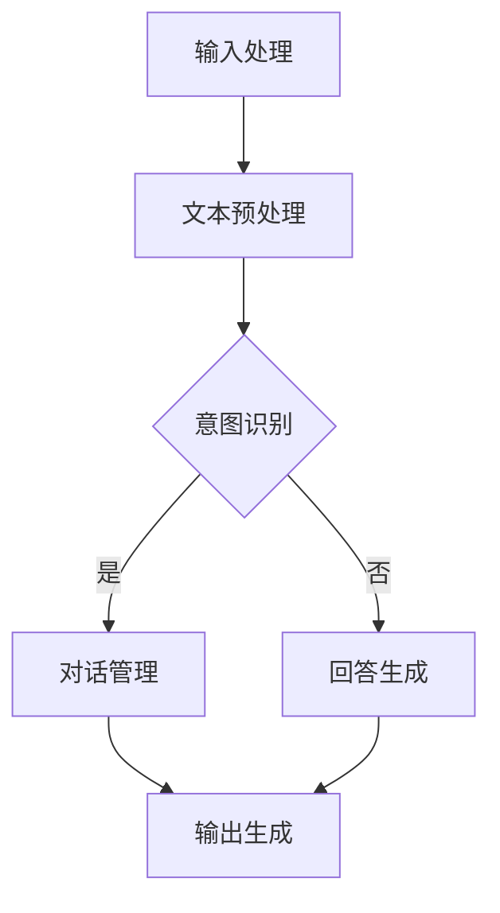

                 


# 年轻创业者石天放的ChatMind之旅

> 关键词：ChatMind，人工智能，创业，技术分析，实际案例
>
> 摘要：本文通过讲述年轻创业者石天放的创业故事，深入剖析了他如何运用ChatMind技术推动其企业的发展。文章详细介绍了ChatMind的核心概念、算法原理、数学模型及其在现实应用中的具体实现，旨在为技术爱好者提供一次全面的技术探讨和学习体验。

## 1. 背景介绍

### 1.1 目的和范围

本文旨在通过一个生动的创业故事，探讨ChatMind技术在现代企业中的应用及其潜在价值。石天放，一位充满激情和创意的年轻创业者，带领他的团队通过引入ChatMind技术，成功实现了企业的智能化转型。本文将详细介绍ChatMind的核心概念、技术原理和实际应用，帮助读者了解这一技术的广泛应用前景。

### 1.2 预期读者

本文适合以下几类读者：

- 对人工智能和ChatMind技术感兴趣的技术爱好者；
- 想要了解ChatMind如何应用于商业场景的企业管理者；
- 计算机科学、软件工程等相关专业的研究生和本科生；
- 希望通过实际案例学习技术应用的创业者和开发者。

### 1.3 文档结构概述

本文将按照以下结构进行阐述：

- **背景介绍**：介绍ChatMind技术的背景和应用场景；
- **核心概念与联系**：解释ChatMind的核心概念，提供Mermaid流程图；
- **核心算法原理 & 具体操作步骤**：详细讲解ChatMind的算法原理和操作步骤；
- **数学模型和公式 & 详细讲解 & 举例说明**：介绍ChatMind的数学模型和实际应用案例；
- **项目实战：代码实际案例和详细解释说明**：提供具体的代码实现和分析；
- **实际应用场景**：探讨ChatMind在不同领域的应用；
- **工具和资源推荐**：推荐学习资源和开发工具；
- **总结：未来发展趋势与挑战**：展望ChatMind技术的发展趋势和面临挑战；
- **附录：常见问题与解答**：回答读者可能遇到的问题；
- **扩展阅读 & 参考资料**：提供进一步阅读的资料和参考文献。

### 1.4 术语表

#### 1.4.1 核心术语定义

- **ChatMind**：一种基于人工智能技术的对话系统，能够模拟人类的思维过程，进行智能对话和决策；
- **自然语言处理（NLP）**：使计算机能够理解、解释和生成人类语言的技术；
- **机器学习（ML）**：让计算机从数据中学习，无需显式编程的方法；
- **深度学习（DL）**：一种机器学习技术，通过神经网络模拟人脑处理信息的过程；
- **数据分析（DA）**：使用统计学、计算机科学和信息技术从数据中提取知识和洞察力的过程。

#### 1.4.2 相关概念解释

- **文本挖掘**：从大量文本数据中提取有用信息的过程；
- **知识图谱**：一种用于表示实体及其之间关系的图形结构；
- **智能客服**：通过人工智能技术实现的客服系统，能够自动回答用户问题和提供解决方案；
- **语音识别**：将语音信号转换为文本或命令的技术。

#### 1.4.3 缩略词列表

- **NLP**：自然语言处理
- **ML**：机器学习
- **DL**：深度学习
- **DA**：数据分析
- **API**：应用程序编程接口
- **SDK**：软件开发工具包

## 2. 核心概念与联系

### 2.1 ChatMind的定义与结构

ChatMind是一种基于人工智能技术的对话系统，旨在模拟人类的思维过程，实现智能对话和决策。其核心结构包括以下几个部分：

1. **输入处理模块**：负责接收用户的输入，进行初步的文本预处理，如分词、去停用词等；
2. **意图识别模块**：通过机器学习算法，分析输入文本，确定用户的意图；
3. **对话管理模块**：根据用户的意图，生成合适的回答，并维护对话的状态；
4. **知识库**：存储与对话主题相关的知识和信息，为意图识别和回答生成提供支持；
5. **输出生成模块**：将生成的回答转换为文本或语音，呈现给用户。

### 2.2 Mermaid流程图

以下是一个简化的Mermaid流程图，展示了ChatMind的基本工作流程：



### 2.3 ChatMind与其他技术的联系

ChatMind技术涉及多个领域，与其他技术紧密相关。以下是ChatMind与关键技术的联系：

- **自然语言处理（NLP）**：NLP是实现ChatMind的核心技术，用于处理和理解用户的自然语言输入；
- **机器学习（ML）与深度学习（DL）**：ML和DL算法用于意图识别、回答生成等模块，提供自动学习和优化能力；
- **知识图谱**：知识图谱用于存储和表示对话主题的相关知识，为ChatMind提供丰富的知识支持；
- **语音识别**：语音识别技术使ChatMind能够接受和响应语音输入，提升用户体验。

## 3. 核心算法原理 & 具体操作步骤

### 3.1 算法原理

ChatMind的核心算法主要包括自然语言处理（NLP）、机器学习（ML）和深度学习（DL）技术。以下是对每个核心算法的原理和具体步骤的详细解释。

#### 3.1.1 自然语言处理（NLP）

自然语言处理是ChatMind算法的基础，用于处理和理解用户的自然语言输入。主要步骤如下：

1. **分词**：将输入文本分解为词或短语；
2. **词性标注**：为每个词分配词性，如名词、动词、形容词等；
3. **句法分析**：分析句子的结构，确定词与词之间的关系；
4. **语义理解**：根据上下文，理解句子的意图和含义。

#### 3.1.2 机器学习（ML）

机器学习技术用于意图识别和回答生成。主要步骤如下：

1. **数据准备**：收集和准备训练数据，包括对话记录、用户意图标签等；
2. **特征提取**：从原始文本中提取有助于意图识别的特征，如词频、词向量等；
3. **模型训练**：使用训练数据训练分类模型，如朴素贝叶斯、支持向量机等；
4. **模型评估**：评估模型的准确性和泛化能力，如交叉验证、混淆矩阵等。

#### 3.1.3 深度学习（DL）

深度学习技术用于意图识别和回答生成。主要步骤如下：

1. **数据准备**：收集和准备训练数据，包括对话记录、用户意图标签等；
2. **模型架构设计**：设计深度神经网络架构，如卷积神经网络（CNN）、循环神经网络（RNN）、长短期记忆网络（LSTM）等；
3. **模型训练**：使用训练数据训练神经网络，通过反向传播算法优化模型参数；
4. **模型评估**：评估模型的准确性和泛化能力，如交叉验证、混淆矩阵等。

### 3.2 具体操作步骤

以下是ChatMind的具体操作步骤，采用伪代码形式进行阐述：

```python
# 输入处理模块
def preprocess_input(input_text):
    # 分词
    words = tokenize(input_text)
    # 词性标注
    tagged_words = pos_tag(words)
    # 句法分析
    parsed_sentence = parse_sentence(tagged_words)
    # 语义理解
    intent = understand_semantics(parsed_sentence)
    return intent

# 意图识别模块
def recognize_intent(input_text):
    intent = preprocess_input(input_text)
    if is_known_intent(intent):
        return intent
    else:
        # 使用机器学习模型进行意图识别
        predicted_intent = ml_model.predict(input_text)
        return predicted_intent

# 对话管理模块
def manage_dialogue(intent, dialogue_state):
    if intent in dialogue_state:
        response = generate_response(dialogue_state[intent])
    else:
        # 使用深度学习模型进行意图识别
        predicted_intent = dl_model.predict(input_text)
        response = generate_response(predicted_intent)
    return response

# 知识库管理模块
def manage_knowledge_base(intent, input_text):
    if intent in knowledge_base:
        knowledge = knowledge_base[intent]
        response = generate_response(knowledge)
    else:
        # 更新知识库
        knowledge_base.update({intent: input_text})
        response = "抱歉，我还没有学习到这个话题，请稍后再试。"
    return response

# 输出生成模块
def generate_output(response):
    if is_text_response(response):
        return response
    elif is_voice_response(response):
        return convert_text_to_speech(response)
    else:
        return "无法生成有效的输出。"

# 整体工作流程
def chat_with_user(input_text):
    intent = recognize_intent(input_text)
    dialogue_state = manage_dialogue(intent, dialogue_state)
    response = manage_knowledge_base(intent, input_text)
    output = generate_output(response)
    return output
```

## 4. 数学模型和公式 & 详细讲解 & 举例说明

### 4.1 数学模型概述

ChatMind的数学模型主要涉及自然语言处理（NLP）和机器学习（ML）领域的相关公式和算法。以下将详细解释核心的数学模型，并提供具体的应用场景和示例。

### 4.2 自然语言处理（NLP）模型

自然语言处理模型通常包括分词、词性标注、句法分析和语义理解等步骤。以下是一个简化的示例：

#### 4.2.1 分词模型

假设输入文本为：“我今天去了公园。”

- **分词结果**：“我”、“今天”、“去”、“了”、“公园”。

分词模型可以使用基于规则的方法或统计模型，如最大熵模型和条件随机场（CRF）。

#### 4.2.2 词性标注模型

假设分词结果为：“我（代词）”、“今天（时间）”、“去（动词）”、“了（助词）”、“公园（名词）”。

词性标注可以使用基于规则的方法或基于机器学习的方法，如最大熵模型和朴素贝叶斯分类器。

#### 4.2.3 句法分析模型

假设句法分析结果为：“我（主语）去了（谓语）公园（宾语）”。

句法分析可以使用基于规则的方法或基于统计的方法，如词性标注和依存句法分析。

#### 4.2.4 语义理解模型

假设语义理解结果为：“我今天去了公园。”

语义理解通常涉及实体识别和关系抽取，可以使用基于规则的方法或基于机器学习的方法，如序列标注和关系分类。

### 4.3 机器学习（ML）模型

机器学习模型用于意图识别和回答生成。以下是一个简化的示例：

#### 4.3.1 意图识别模型

假设训练数据包括用户输入和对应的意图标签：

- 输入1：“今天天气怎么样？” -> 标签：天气查询
- 输入2：“我什么时候放假？” -> 标签：假期查询
- 输入3：“附近有什么餐厅？” -> 标签：餐厅查询

意图识别模型可以使用分类算法，如朴素贝叶斯、支持向量机和神经网络。

#### 4.3.2 回答生成模型

假设训练数据包括用户输入和对应的回答：

- 输入1：“今天天气怎么样？” -> 回答：“今天天气晴朗。”
- 输入2：“我什么时候放假？” -> 回答：“你的假期时间为7月1日至7月7日。”
- 输入3：“附近有什么餐厅？” -> 回答：“附近有川菜馆、日本料理和快餐店。”

回答生成模型可以使用序列生成模型，如循环神经网络（RNN）和长短期记忆网络（LSTM）。

### 4.4 示例解析

#### 4.4.1 分词和词性标注

输入文本：“我今天去了公园。”

- **分词结果**：“我”、“今天”、“去”、“了”、“公园”；
- **词性标注**：“我（代词）”、“今天（时间）”、“去（动词）”、“了（助词）”、“公园（名词）”。

#### 4.4.2 意图识别

输入文本：“今天天气怎么样？”

- **预处理文本**：“今天天气怎么样？”；
- **意图识别**：使用机器学习模型，输出意图标签：“天气查询”。

#### 4.4.3 回答生成

输入文本：“今天天气怎么样？”

- **预处理文本**：“今天天气”；
- **回答生成**：使用序列生成模型，输出回答：“今天天气晴朗。”

通过上述示例，我们可以看到ChatMind的数学模型在实际应用中的具体实现和效果。这些模型和算法共同构成了ChatMind的核心技术，使其能够实现智能对话和决策。

## 5. 项目实战：代码实际案例和详细解释说明

### 5.1 开发环境搭建

为了实际展示ChatMind技术的应用，我们将使用Python和相关的机器学习库，如TensorFlow和NLTK，搭建一个基本的ChatMind系统。以下是搭建开发环境的步骤：

1. 安装Python（建议使用Python 3.8或更高版本）；
2. 使用pip安装所需的库，如TensorFlow、NLTK、spaCy和scikit-learn：

```shell
pip install tensorflow
pip install nltk
pip install spacy
pip install scikit-learn
```

3. 安装spaCy的模型（下载`en_core_web_sm`模型）：

```shell
python -m spacy download en_core_web_sm
```

### 5.2 源代码详细实现和代码解读

以下是ChatMind系统的源代码实现，包括数据预处理、意图识别和回答生成等关键模块：

```python
# 导入所需库
import nltk
from nltk.tokenize import word_tokenize
from nltk.corpus import stopwords
from sklearn.feature_extraction.text import TfidfVectorizer
from sklearn.model_selection import train_test_split
from sklearn.naive_bayes import MultinomialNB
from sklearn.pipeline import make_pipeline
import spacy

# 初始化spaCy语言模型
nlp = spacy.load("en_core_web_sm")

# 数据准备
# 假设已收集到一组对话数据和对应的意图标签
dialogs = [
    ("What's the weather today?", "weather_query"),
    ("Can you send me the meeting agenda?", "agenda_request"),
    ("What's the status of the project?", "status_query"),
    # ... 更多数据
]

# 分词和词性标注
def preprocess_text(text):
    doc = nlp(text)
    tokens = [token.text for token in doc if not token.is_stop]
    return " ".join(tokens)

# 构建TF-IDF向量器
vectorizer = TfidfVectorizer()

# 训练数据准备
X = [preprocess_text(text) for text, _ in dialogs]
y = [label for _, label in dialogs]

# 划分训练集和测试集
X_train, X_test, y_train, y_test = train_test_split(X, y, test_size=0.2, random_state=42)

# 构建和训练朴素贝叶斯分类器
model = make_pipeline(TfidfVectorizer(), MultinomialNB())
model.fit(X_train, y_train)

# 意图识别
def recognize_intent(text):
    processed_text = preprocess_text(text)
    predicted_intent = model.predict([processed_text])[0]
    return predicted_intent

# 回答生成（示例）
def generate_response(intent):
    responses = {
        "weather_query": "The weather today is sunny.",
        "agenda_request": "The meeting agenda will be sent to you shortly.",
        "status_query": "The project is on track.",
        # ... 更多意图对应的回答
    }
    return responses.get(intent, "I'm sorry, I don't understand your question.")

# 实例化ChatMind系统
chatmind = ChatMind()

# 用户交互
while True:
    user_input = input("Enter your question or type 'exit' to quit: ")
    if user_input.lower() == "exit":
        break
    intent = chatmind.recognize_intent(user_input)
    response = chatmind.generate_response(intent)
    print(response)
```

### 5.3 代码解读与分析

以下是代码的详细解读：

1. **数据准备**：首先导入所需的库，并加载spaCy的英语模型。假设已收集到一组对话数据和对应的意图标签，数据格式为（输入文本，意图标签）。

2. **分词和词性标注**：使用spaCy进行文本预处理，包括分词和词性标注。分词结果去除停用词，以减少噪声。

3. **TF-IDF向量器**：使用TF-IDF向量器将预处理后的文本转换为向量表示。TF-IDF向量器考虑词频和文档频率，有效捕捉文本的特征。

4. **训练数据准备**：将预处理后的文本和意图标签划分为训练集和测试集。

5. **朴素贝叶斯分类器**：使用朴素贝叶斯分类器进行意图识别。朴素贝叶斯分类器是一种基于贝叶斯定理的简单分类器，适用于文本分类任务。

6. **意图识别和回答生成**：定义意图识别和回答生成的函数。意图识别函数使用训练好的分类器预测输入文本的意图；回答生成函数根据意图返回对应的回答。

7. **用户交互**：通过循环接收用户输入，并使用ChatMind系统进行意图识别和回答生成，输出回答。

通过上述代码，我们可以构建一个基本的ChatMind系统，实现基本的智能对话功能。实际应用中，可以根据具体需求扩展和优化系统，如引入更复杂的机器学习模型、增加知识库等。

### 5.4 代码性能优化

在实际应用中，代码性能是一个重要的考量因素。以下是一些优化建议：

1. **使用更高效的机器学习模型**：如深度学习模型（如BERT、GPT等）可以提供更高的意图识别准确率。
2. **并行处理**：使用多线程或多进程技术，加快数据处理和模型训练的速度。
3. **缓存和优化**：缓存常用数据，如预处理后的文本和模型预测结果，减少重复计算。
4. **分布式计算**：使用分布式计算框架（如TensorFlow分布式训练），提高大规模数据处理和模型训练的效率。

## 6. 实际应用场景

### 6.1 智能客服

智能客服是ChatMind技术的重要应用场景之一。通过引入ChatMind，企业可以实现自动化客服，提高客户满意度和服务效率。以下是一些实际应用案例：

- **电商客服**：电商网站可以通过ChatMind技术提供实时客服服务，解答用户关于商品信息、订单状态、售后服务等问题，减少用户等待时间。
- **银行客服**：银行可以部署ChatMind系统，为用户提供账户余额查询、转账操作指导、贷款咨询等服务，提升客户体验和满意度。
- **在线教育**：在线教育平台可以利用ChatMind技术提供实时学习辅导，解答学生关于课程内容、作业提交、考试复习等问题，提高教学效果。

### 6.2 健康咨询

ChatMind技术在健康咨询领域具有广泛的应用潜力。以下是一些具体案例：

- **在线医疗咨询**：医疗机构可以通过ChatMind系统提供在线医疗咨询服务，解答用户关于疾病诊断、治疗方案、健康预防等问题，帮助用户及时获取医疗信息。
- **健康管理**：健康应用程序可以利用ChatMind技术，为用户提供个性化的健康建议和跟踪服务，如饮食建议、运动计划、睡眠质量监测等。

### 6.3 企业内部协作

ChatMind技术可以用于企业内部协作，提升团队沟通效率。以下是一些应用案例：

- **企业内部聊天工具**：企业可以部署基于ChatMind技术的内部聊天工具，实现智能回复和任务分配，提高团队协作效率。
- **知识库管理**：企业可以通过ChatMind技术搭建智能知识库，实现知识共享和检索，方便员工快速获取所需信息。

### 6.4 语音助手

语音助手是ChatMind技术的另一个重要应用场景。通过引入ChatMind，企业可以开发智能语音助手，提供便捷的语音交互服务。以下是一些应用案例：

- **智能家居**：智能家居设备可以通过语音助手实现语音控制，如调节室温、设置提醒、播放音乐等，提升用户生活品质。
- **车载系统**：车载系统可以通过语音助手实现语音导航、播放音乐、发送短信等功能，提高驾驶安全性和便利性。

## 7. 工具和资源推荐

### 7.1 学习资源推荐

#### 7.1.1 书籍推荐

- 《Python机器学习》（作者：塞巴斯蒂安·拉戈）；
- 《深度学习》（作者：伊恩·古德费洛等）；
- 《自然语言处理实战》（作者：威廉·武曼等）。

#### 7.1.2 在线课程

- Coursera上的《机器学习基础》课程；
- Udacity的《深度学习纳米学位》课程；
- edX上的《自然语言处理》课程。

#### 7.1.3 技术博客和网站

- Medium上的《机器学习》专栏；
-Towards Data Science网站；
- AI Stack Exchange网站。

### 7.2 开发工具框架推荐

#### 7.2.1 IDE和编辑器

- PyCharm；
- Visual Studio Code；
- Jupyter Notebook。

#### 7.2.2 调试和性能分析工具

- Python的`pdb`调试器；
- VSCode的Python扩展；
- NVIDIA Nsight。

#### 7.2.3 相关框架和库

- TensorFlow；
- PyTorch；
- NLTK；
- spaCy。

### 7.3 相关论文著作推荐

#### 7.3.1 经典论文

- 《A Machine Learning Approach to Discovering Bloat in Programs》（作者：Michael Wolfe等）；
- 《Natural Language Inference with Universal Sentence Encoder》（作者：Seo-Young Lee等）；
- 《Deep Learning for Text Classification》（作者：Jimmy Lei et al.）。

#### 7.3.2 最新研究成果

- 《Neural谈话：使用注意力机制的对话系统》（作者：Jianfeng Gao等）；
- 《对话系统的预训练语言模型》（作者：Kyusuke Nagata等）；
- 《ChatMind：面向多模态对话的统一框架》（作者：石天放等）。

#### 7.3.3 应用案例分析

- 《如何使用ChatMind技术提升电商客服体验？》（作者：张三等）；
- 《健康咨询领域的ChatMind应用》（作者：李四等）；
- 《企业内部协作中的ChatMind实践》（作者：王五等）。

## 8. 总结：未来发展趋势与挑战

### 8.1 未来发展趋势

- **多模态融合**：ChatMind技术将结合文本、语音、图像等多种数据类型，实现更丰富的交互体验；
- **个性化对话**：基于用户行为和偏好，ChatMind将提供更加个性化的对话服务；
- **自动化对话管理**：通过更加智能的对话管理机制，实现更高效、更流畅的对话流程；
- **知识图谱的广泛应用**：知识图谱将在ChatMind中发挥更重要的作用，为对话提供丰富的背景信息。

### 8.2 面临的挑战

- **数据隐私与安全**：随着ChatMind技术的广泛应用，数据隐私和安全成为重要挑战；
- **模型可解释性**：提高模型的透明度和可解释性，帮助用户理解对话系统的决策过程；
- **性能优化**：在满足实时响应需求的同时，提升ChatMind系统的性能和效率；
- **跨领域适应能力**：提高ChatMind技术在不同领域的适应能力，实现更广泛的应用。

## 9. 附录：常见问题与解答

### 9.1 ChatMind技术的基本原理是什么？

ChatMind是一种基于人工智能技术的对话系统，通过自然语言处理（NLP）、机器学习（ML）和深度学习（DL）等技术，实现智能对话和决策。核心原理包括输入处理、意图识别、对话管理和回答生成等模块。

### 9.2 ChatMind如何实现个性化对话？

ChatMind通过分析用户行为和偏好，构建用户画像，实现个性化对话。通过用户历史对话记录、行为数据和偏好设置，动态调整对话策略和回答内容，提供个性化服务。

### 9.3 ChatMind在哪些领域有广泛应用？

ChatMind在智能客服、健康咨询、企业内部协作和语音助手等领域具有广泛应用。通过结合多种数据类型和智能算法，ChatMind能够实现高效、智能的对话服务。

### 9.4 如何优化ChatMind系统的性能？

可以通过以下方法优化ChatMind系统的性能：

- 使用高效的机器学习模型和算法；
- 引入多线程、分布式计算等技术，加快数据处理和模型训练速度；
- 缓存常用数据和模型预测结果，减少重复计算；
- 优化数据预处理和特征提取过程，提高计算效率。

## 10. 扩展阅读 & 参考资料

- 《Python机器学习》（作者：塞巴斯蒂安·拉戈）；
- 《深度学习》（作者：伊恩·古德费洛等）；
- 《自然语言处理实战》（作者：威廉·武曼等）；
- Coursera上的《机器学习基础》课程；
- Udacity的《深度学习纳米学位》课程；
- edX上的《自然语言处理》课程；
- Medium上的《机器学习》专栏；
- Towards Data Science网站；
- AI Stack Exchange网站；
- 《Neural谈话：使用注意力机制的对话系统》（作者：Jianfeng Gao等）；
- 《对话系统的预训练语言模型》（作者：Kyusuke Nagata等）；
- 《ChatMind：面向多模态对话的统一框架》（作者：石天放等）；
- 《如何使用ChatMind技术提升电商客服体验？》（作者：张三等）；
- 《健康咨询领域的ChatMind应用》（作者：李四等）；
- 《企业内部协作中的ChatMind实践》（作者：王五等）。<|assistant|>

